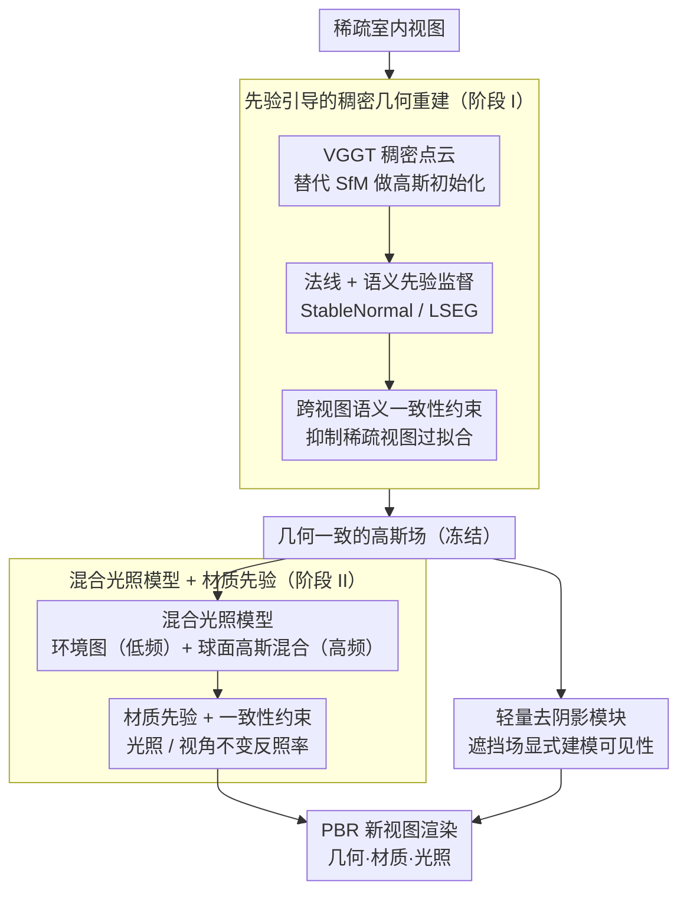

# SGS-Intrinsic: Semantic-Invariant Gaussian Splatting for Sparse-View Indoor Inverse Rendering

**会议**: CVPR 2026  
**arXiv**: [2603.27516](https://arxiv.org/abs/2603.27516)  
**代码**: [https://github.com/GrumpySloths/SGS_Intrinsic.github.io](https://github.com/GrumpySloths/SGS_Intrinsic.github.io)  
**领域**: 3D视觉  
**关键词**: 逆渲染, 稀疏视图, 高斯溅射, 材质分解, 室内场景

## 一句话总结

SGS-Intrinsic 提出两阶段室内逆渲染框架，第一阶段利用语义和几何先验构建稠密几何一致的高斯场，第二阶段结合混合光照模型和材质先验进行材质-光照分解，并通过去阴影模块防止阴影烘焙到反照率中。

## 研究背景与动机

稀疏视图的室内逆渲染是极度病态的问题：监督信号稀疏、室内光照复杂（近场+高频）、材质与光照强耦合。现有方法要么只做几何重建不分解材质，要么假设远距离光源（对室内不适用），要么无法在稀疏视图下工作。

**三大挑战**：(1) 稀疏视图下高斯重建几何不可靠；(2) 室内近场高频光照建模困难；(3) 投射阴影容易被错误地烘焙进材质。

## 方法详解

### 整体框架

室内逆渲染要从几张照片里同时反推出几何、材质和光照，而稀疏视图把这个本就病态的问题逼到了极限——监督太少，材质和光照又纠缠在一起。SGS-Intrinsic 的破局思路是把任务拆成"先把几何站稳，再分解材质"两个阶段，而不是端到端一锅端。第一阶段（Stage I）不再靠 SfM 拼稀疏点云，而是直接用 VGGT 吐出稠密的场景点云做高斯初始化，再叠上法线和语义两路先验监督，养出一个几何可靠的高斯场。第二阶段（Stage II）在这个固定的几何之上做逆渲染：用一个混合光照模型同时吃下远场环境光和近场高频光，用扩散模型的材质先验把材质从光照里"摘"出来，最后再挂一个去阴影模块，专门拦住"把阴影错当成材质颜色"这条最常见的歧义。

### 关键设计

**1. 先验引导的稠密几何重建：用预训练大模型补足稀疏视图缺失的监督**

稀疏视图下最先崩的是几何——传统 SfM 在没几张图的情况下只能恢复出零星稀疏点，根本撑不起后续高斯优化，而几何一旦不准，材质分解就是空中楼阁。SGS-Intrinsic 干脆把 SfM 换成 VGGT，让它一次性给出稠密的场景布局点云作为高斯初始化的起点。光有点还不够，论文再引两路预训练先验把高斯场"焊"得更实：StableNormal 提供法线监督 $\mathcal{L}_{normal} = 1 - \hat{n}^T n_m$，把每个高斯的朝向往真实表面法线上拉；LSEG 提供语义监督。考虑到稀疏视图极易过拟合到训练视角，论文还在训练视图和虚拟新视图之间加了一道语义一致性约束——同一块区域换个视角看语义不能变，这等于用"语义不随视角漂移"这条几乎免费的先验把几何往泛化的方向推。

**2. 混合光照模型 + 材质先验：分频建模光照，再借扩散先验打破材质-光照歧义**

室内光照难就难在它既有大尺度缓变的环境光，又有窗口、灯具这类近场高频成分，单一光照表示要么糊掉细节、要么算不动。论文索性分而治之：用一张环境图（environment map）捕获远距离的低频环境光，再用一组球面高斯混合（Spherical Gaussian Mixture, SGM）去逼近近场高频光照，两者相加构成完整的入射光场。但即便光照建得准，材质和光照之间仍有天然歧义——一块偏暗的表面到底是材质本身深色，还是被照得少？论文用扩散模型里学到的材质先验来定夺，把它当成跨视图、跨光照条件下的一致性约束：同一处材质无论从哪个视角看、被什么光照打，反推出的反照率都应当一致。这条约束逼着优化器交出一个"光照不变、视角不变"的材质解，从根上削弱了材质-光照的耦合。

**3. 轻量去阴影模块：把投射阴影显式归因于遮挡，别让它沾进反照率**

室内场景投射阴影密集，如果不管，优化器最省力的解释就是"这块地方材质本来就黑"——于是阴影被一笔笔烘焙进反照率（albedo），材质估计随之失真，这也是室内逆渲染最主要的误差来源。SGS-Intrinsic 挂了一个轻量去阴影模型，显式地建模可见性，把阴影区域变暗的成因判给"被遮挡、光进不来"，而不是材质。它和上一条的光照不变材质一致性约束配合使用：去阴影负责剥掉阴影这层"假材质"，一致性约束负责保证剥干净之后同一材质在明处暗处给出同一个反照率，两者合力把阴影从材质里干净地分离出去。

### 损失函数 / 训练策略

Stage I 的训练目标是 RGB 重建损失 + 法线损失 + 语义一致性损失，三者合力把几何站稳；Stage II 在冻结几何上优化 PBR 渲染损失 + 材质一致性损失 + 去阴影正则化，把光照和材质分开。

## 实验关键数据

### 主实验

| 方法 | Interiorverse NVS PSNR | Albedo准确度 | 说明 |
|------|----------------------|-------------|------|
| GeoSplat | 较低 | 较低 | 几何不够 |
| IRGS | 中等 | 中等 | 光照模型受限 |
| **SGS-Intrinsic** | **最优** | **最优** | 全面超越 |

在基准数据集上的新视图合成和逆渲染指标全面领先。

### 消融实验

| 配置 | NVS质量 | 材质分解 | 说明 |
|------|---------|---------|------|
| 无先验引导 | 明显下降 | 差 | 几何不可靠影响后续 |
| 无混合光照 | — | 下降 | 近场光照建模不足 |
| 无去阴影 | — | 阴影烘焙 | 反照率被阴影污染 |
| 完整模型 | 最优 | 最优 | 所有组件必要 |

### 关键发现

- VGGT 提供的稠密初始化是稀疏视图成功的关键基础——好的几何是好的逆渲染的前提
- 去阴影模块对反照率估计质量的提升非常显著，室内场景中阴影烘焙是主要的材质估计误差来源
- 语义一致性约束有效防止了稀疏视图下的过拟合

## 亮点与洞察

- **两阶段解耦的合理性**：几何和材质分解有明确的依赖关系——先搞好几何再分解材质，比端到端联合优化更稳定
- **去阴影作为独立模块**：将阴影显式建模而非让优化器隐式处理，是一个简单但关键的设计
- **预训练模型作为先验来源**：StableNormal/LSEG/VGGT 等预训练模型的组合使用，展示了如何在稀疏视图下用丰富的先验补偿数据不足

## 局限与展望

- 依赖多个预训练模型（VGGT/StableNormal/LSEG/扩散模型），系统复杂度高
- 对非朗伯材质（如镜面、玻璃）的处理能力有限
- 两阶段训练的效率不如端到端方案
- 未来可探索减少先验模型依赖或统一为单一模型

## 相关工作与启发

- **vs GeoSplat/IRGS**: 同为3DGS逆渲染方法，SGS-Intrinsic 通过更强的先验和去阴影模块取得更好效果
- **vs NeRF-based 逆渲染**: 3DGS 的显式表示使得PBR属性的解耦更直接
- **vs 单图逆渲染**: 多视图方法天然具有3D一致性，但稀疏视图增加了挑战

## 评分

- 新颖性: ⭐⭐⭐⭐ 各模块设计扎实，去阴影思路有价值，但整体是已有技术的组合
- 实验充分度: ⭐⭐⭐⭐ 基准对比充分，消融清晰
- 写作质量: ⭐⭐⭐⭐ 方法描述系统清晰
- 价值: ⭐⭐⭐⭐ 对室内AR/VR应用有直接价值

<!-- RELATED:START -->

## 相关论文

- [\[CVPR 2026\] Intrinsic Geometry-Appearance Consistency Optimization for Sparse-View Gaussian Splatting](intrinsic_geometry-appearance_consistency_optimization_for_sparse-view_gaussian_.md)
- [\[CVPR 2025\] IRIS: Inverse Rendering of Indoor Scenes from Low Dynamic Range Images](../../CVPR2025/3d_vision/iris_inverse_rendering_of_indoor_scenes_from_low_dynamic_range_images.md)
- [\[ICCV 2025\] GeoSplatting: Towards Geometry Guided Gaussian Splatting for Physically-based Inverse Rendering](../../ICCV2025/3d_vision/geosplatting_towards_geometry_guided_gaussian_splatting_for_physically-based_inv.md)
- [\[CVPR 2026\] AdaSFormer: Adaptive Serialized Transformers for Monocular Semantic Scene Completion from Indoor Environments](adasformer_adaptive_serialized_transformers_for_monocular_semantic_scene_complet.md)
- [\[CVPR 2026\] MVInverse: Feed-forward Multiview Inverse Rendering in Seconds](mvinverse_feed-forward_multiview_inverse_rendering_in_seconds.md)

<!-- RELATED:END -->
