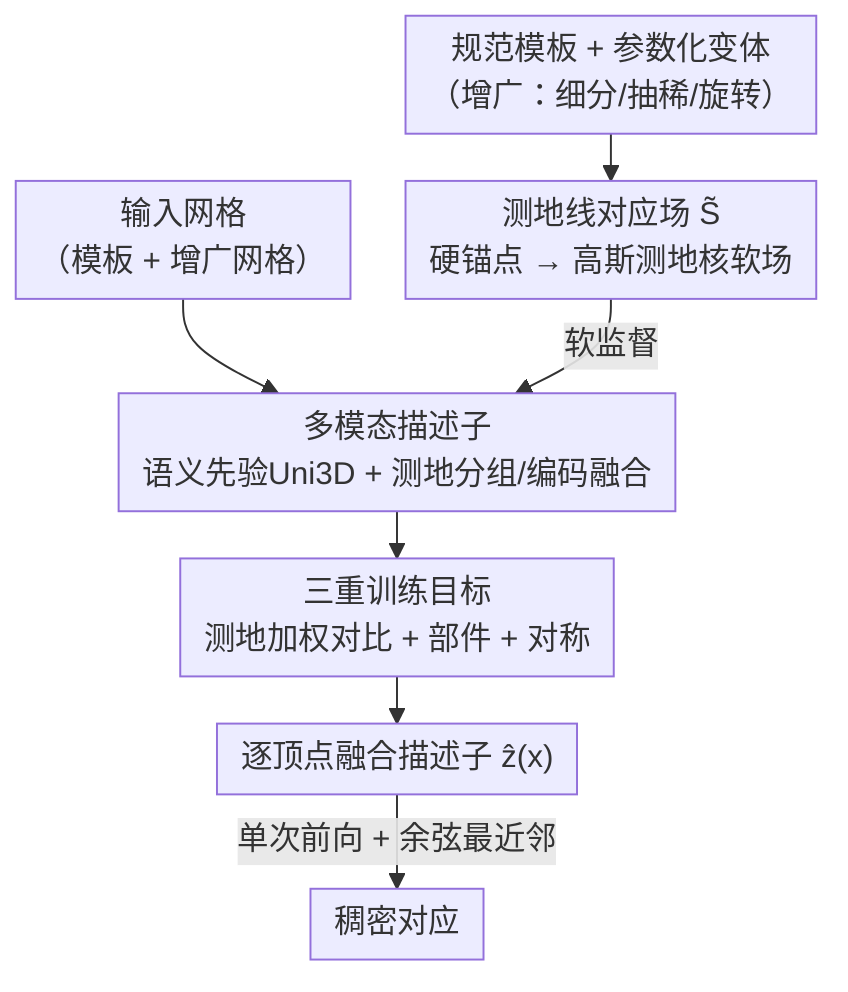

# SGSoft: Learning Fused Semantic-Geometric Features for 3D Shape Correspondence via Template-Guided Soft Signals

**会议**: CVPR 2026  
**论文**: [CVF Open Access](https://openaccess.thecvf.com/content/CVPR2026/html/Yoon_SGSoft_Learning_Fused_Semantic-Geometric_Features_for_3D_Shape_Correspondence_via_CVPR_2026_paper.html)  
**代码**: 无  
**领域**: 3D视觉  
**关键词**: 3D稠密对应, 测地线, 多模态描述子, 模板监督, 对称消歧

## 一句话总结
SGSoft 把"在变形 3D 形状之间找稠密点对应"重新表述为"在一个规范模板上对齐测地线概率场"，用这个拓扑不变的软监督信号训练一个融合几何/语义/空间线索的逐顶点描述子，推理时单次前向 + 最近邻检索即可出对应，无需预对齐、逐对优化或后细化，在保持精度的同时把单对耗时压到 1.7 秒。

## 研究背景与动机
**领域现状**：变形 3D 形状之间的稠密对应（dense correspondence）是动作重定向、绑定/纹理迁移、形状插值等任务的底层能力。主流做法分四类：基于显式形变的方法（ICP、ARAP、神经形变场）、基于函数映射（functional map，谱域线性算子）的方法、借大规模 2D 视觉模型多视角投影的方法，以及把上述范式拼起来的混合方法。

**现有痛点**：这些方法各有硬伤。形变类精度高但要逐对优化、对初始化敏感、扩展性差；函数映射类全局一致但谱抽象会抹掉细粒度几何/语义细节，难区分对称或相近部件；2D 蒸馏类有强语义先验但渲染监督受遮挡、视角稀疏、无纹理表面困扰，且扩散先验计算量大、无法实时；混合类缓解了单点弱点，却仍依赖对齐、后细化或重计算。

**核心矛盾**：现有方法被迫在**泛化、几何保真、效率**三者之间做权衡。它们之所以要靠预对齐 / 逐对优化 / 后细化这些"补救步骤"，根源在于训练监督本身不稳定——用硬锚点（hard anchor）监督时，一旦发生重网格化（remeshing）或大幅非等距形变，锚点的拓扑和索引就乱了，监督信号随之崩坏。

**本文目标**：在一个统一的前向框架里同时解决泛化与效率，去掉所有补救步骤。

**切入角度**：作者抓住曲面几何的两个内在性质——(I1) 测地距离对形变不变、刻画曲面点间的内在关系；(I2) 定义在模板上的测地概率场保持局部光滑、对网格扰动鲁棒。于是把"找对应"改造成"在规范内在空间里对齐测地概率场"。

**核心 idea**：用模板上的连续测地概率场（geodesic correspondence field）替代离散硬锚点作监督信号，去训练一个把几何、语义、空间三种线索融进单一表示的稠密描述子。

## 方法详解

### 整体框架
SGSoft 要解决的是"输入一对变形网格、输出逐点稠密对应"。它的转法是：先在规范模板上离线构造一个测地概率场 $\tilde{S}$ 当监督；再用这个监督把每个输入网格的顶点映射进一个共享的"多模态内在空间"，学到既有语义判别力又几何一致的逐顶点描述子；推理时两个网格各过一次前向得到归一化描述子，直接在描述子空间做余弦最近邻检索读出对应。整条管线没有预对齐、没有逐对优化、没有后细化、没有多视角渲染或候选筛选。

### 关键设计

**1. 测地线对应场 $\tilde{S}$：把脆弱的硬锚点监督换成拓扑不变的软场**

痛点很直白：用硬锚点监督会被重网格化和大形变破坏，因为顶点索引一变锚点就失配。作者先在规范模板和它的参数化变体（如 SMPL）之间定义顶点级硬锚点对，并对网格做细分 / 抽稀 / 随机旋转等增广、再沿增广链回溯，保证每个增广顶点 $x_i$ 都能稳定映回某个模板顶点 $t_{h(i)}$，并带上一致的部件标签 $\ell_\text{aug}$。然后把每个硬锚点"提升"成模板上的连续测地场：

$$\tilde{S}_{i,v} = \exp\!\left(-\frac{d_\mathrm{geo}(t_{h(i)}, t_v)^2}{\sigma^2}\right)$$

其中 $d_\mathrm{geo}(\cdot,\cdot)$ 是测地距离，$\sigma$ 控制局部性。这个高斯核以 $t_{h(i)}$ 为中心，给测地上邻近的顶点高权重、远的指数衰减，因此 $\tilde{S}$ 是定义在模板空间里的光滑场，对形变和离散化不变。作者还按顶点密度和语义部件一致性做自适应调制得到更稀疏高效的软场，并用局部曲率加权、突出关节和面部这类结构显著区域。和硬锚点比，它把"一点对一点"的离散约束放松成"一片邻域上的连续概率"，监督在拓扑变化下不再断裂。

**2. 测地监督下的多模态描述子：把 Uni3D 语义先验和内在几何融成一个描述子**

光有 $\tilde{S}$ 只给几何，编码不了区分左右 / 前后所需的细粒度语义和高层空间理解。作者用预训练 3D 基础模型 Uni3D 初始化描述子注入语义先验，再用三步把几何织进去。第一步**测地分组与传播**：用最远点采样（FPS）把网格切成 $N$ 个测地块，每个块心 $c_g$ 按测地距离取最近 $M$ 个顶点 $\mathcal{N}(c_g) = \operatorname{TopM}_{x_i}(-d_\mathrm{geo}(x_i, c_g))$；块嵌入 $z_g$ 再通过测地加权插值传回每个顶点 $z(x_i) = \frac{\sum_{g} w_{ig} z_g}{\sum_{g} w_{ig}}$，权重 $w_{ig} = \frac{1}{d_\mathrm{geo}(x_i, c_g)^p + \epsilon}$，从而把局部几何上下文传给顶点又防止特征泄漏到相邻部件。第二步**测地特征编码**：对块心集合算两两测地距离矩阵 $D_\mathrm{geo}(i,j) = d_\mathrm{geo}(c_i, c_j)$，取上三角向量化成 $v_\mathrm{geo}$，过一个 Transformer 编码器得到全局测地嵌入 $g_\mathrm{geo} = \mathrm{Encoder}(v_\mathrm{geo})$，捕捉块心之间的高阶内在几何依赖。第三步**语义先验融合**：把 Uni3D 的块级语义嵌入 $f_\mathrm{sem}(c_g)$ 与全局测地特征拼接后过融合模块 $z_g = \Gamma([f_\mathrm{sem}(c_g) \| g_\mathrm{geo}])$，再经测地解组传回顶点得到最终描述子。三步合起来让描述子既语义可分、又在局部和全局都几何一致。

**3. 三重训练目标：测地加权对比 + 部件 + 对称，分别管几何连续、语义、对称消歧**

单一损失撑不起"几何鲁棒 + 语义判别 + 对称区分"。核心是**测地场加权对比损失**，把标准 InfoNCE 改成用 $\tilde{S}$ 作权重：

$$\mathcal{L}_\text{soft} = -\frac{1}{M}\sum_{i,v} \tilde{S}_{i,v} \log \frac{\exp(\mathbf{A}_{i,v}/\tau)}{\sum_u \exp(\mathbf{A}_{i,u}/\tau)}$$

其中 $\mathbf{A}$ 是增广描述子与模板描述子的余弦相似度。它按测地邻近度加权对应、强调几何一致的匹配，把嵌入空间沿内在曲面流形抹平。辅以**部件分类损失** $\mathcal{L}_\text{part}$（带标签平滑的交叉熵，对增广和模板两侧的部件分割 logits 监督，提供粗粒度语义对齐并稳定早期训练）和**对称损失** $\mathcal{L}_\text{sym} = \frac{1}{M}\sum_{i,v} \mathcal{M}_\text{sym}(i,v)\,\mathbf{A}_{i,v}$（用二值掩码 $\mathcal{M}_\text{sym}$ 标出对称部件对，惩罚镜像区域之间的相似度，抑制左右肢 / 前后对应的"泄漏"）。总目标为 $\mathcal{L}_\text{total} = \lambda_\text{soft}\mathcal{L}_\text{soft} + \lambda_\text{part}\mathcal{L}_\text{part} + \lambda_\text{sym}\mathcal{L}_\text{sym}$。这三项各打一个软肋，消融里去掉对比损失会直接崩（见下）。

### 损失函数 / 训练策略
训练用 AdamW，在测地加权对比 / 部件 / 对称三项联合损失下采用课程学习（curriculum learning）逐步加难。推理时一对网格各过一次前向得到归一化逐顶点描述子 $\hat{z}(x)$，按余弦相似度做最近邻检索 $\mathrm{corr}(x_i) = \arg\max_{t_v} \hat{z}_\text{src}(x_i)^\top \hat{z}_\text{tgt}(t_v)$ 读出稠密对应，全程纯前向。

## 实验关键数据

### 主实验
在 FAUST / SCAPE / SHREC19（remeshed 变体，测姿态和离散化鲁棒性）以及 DT4D-Intra / DT4D-Inter（零样本跨域，含动态和非人类物体）上评测，指标为预测与真值之间的平均测地误差（越低越好），效率为单对网格 wall-clock（RTX A6000）。

| 类别 / 方法 | FAUST | SCAPE | SHREC19 | DT4D-Intra | DT4D-Inter | 平均误差 | 时间(s) |
|------|------|------|------|------|------|------|------|
| 形变 NJF | 5.9 | 11.7 | 9.6 | 43.4 | 32.8 | 20.68 | 4.2 |
| 2D蒸馏 Diff3f | 16.3 | 18.2 | 20.6 | 20.6 | 30.3 | 21.20 | 628.9 |
| 混合 DenoisingFM | 1.9 | 2.4 | 4.2 | 5.5 | 16.8 | 6.16 | 37.0 |
| 混合 DiffuMatch | 1.9 | 4.4 | 3.9 | 1.8 | 8.6 | 4.12 | 142.8 |
| **SGSoft（本文）** | 2.5 | 2.9 | 4.0 | 8.1 | **8.3** | 5.16 | **1.7** |

在近等距基准上 SGSoft（2.5 / 2.9 / 4.0）逼近最强的 DenoisingFM、DiffuMatch，但完全前向、不靠后细化或逐对优化。跨域 DT4D-Inter 上它拿到最低误差 8.3，而 NJF / Diff3f / DenoisingFM 在非人类域显著退化，DiffuMatch 虽在 DT4D-Intra 靠逐对优化很强、到 Inter 就明显掉点，说明 SGSoft 的跨类别泛化更稳。效率上 1.7 秒/对，比所有依赖细化 / 优化的基线快一个数量级以上，是唯一能近实时单前向出对应的方法。

### 消融实验
在 SCAPE / SHREC19 / DT4D-Inter 上逐组件消融（平均测地误差 %，越低越好）：

| 配置 | SCAPE | SHREC19 | DT4D-Inter | 说明 |
|------|------|------|------|------|
| w/o $\tilde{S}$（退回硬锚点 InfoNCE） | 3.7 | 6.6 | 10.7 | 失去连续拓扑一致监督 |
| w/o $\tilde{S}$ 对比损失（换成 MSE 回归） | 18.4 | 17.9 | 21.2 | 崩溃，对比优化是关键 |
| w/o 测地分组/解组 | 4.0 | 6.4 | 10.4 | 相邻部件语义泄漏 |
| w/o 测地编码 | 3.3 | 4.9 | 9.3 | 内在一致性变弱 |
| w/o 对称损失 | 7.8 | 8.2 | 15.6 | 镜像部件混淆加剧 |
| **Full (SGSoft)** | **2.9** | **4.0** | **8.3** | 完整模型 |

### 关键发现
- **测地加权对比损失是命门**：把它换成直接 MSE 回归后 SCAPE 从 2.9 暴涨到 18.4，说明在测地场监督下做对比学习（而非回归）才是学到几何可分嵌入的关键。
- **对称损失对跨域帮助最大**：去掉后 DT4D-Inter 从 8.3 退到 15.6（近乎翻倍），印证对称消歧在结构差异大的非人类物体上尤其重要。
- **描述子确实编码了局部几何**：在 K=50 测地近邻内分析，特征相似度与测地距离呈强负相关（模板上 Pearson −0.81、基准网格上 −0.77），单调衰减贴合 $\tilde{S}$ 监督结构，说明描述子高保真地保留了局部几何。
- 学到的描述子可迁移到语义分割、形变迁移等下游任务，且对底层 3D 表示形式的变化也鲁棒。

## 亮点与洞察
- **把"找对应"重述成"对齐测地概率场"**：这一步换框架很巧——硬锚点的脆弱性来自它是离散监督，而软测地场天然对重网格化和形变不变，等于从源头上消除了别人要靠后细化补救的不稳定性。
- **软监督 + 对比学习的组合拳**：消融显示真正起作用的不是软场本身（去掉只掉一点），而是"软场当权重 + InfoNCE 对比"这个组合（换成 MSE 直接崩），这个洞察可迁移到任何"有连续相似度先验、想学判别嵌入"的任务。
- **用 3D 基础模型补语义、用内在几何补空间**：Uni3D 给语义先验、测地场给几何/空间消歧，两者职责清晰互补，是"基础模型 + 任务特定几何结构"范式的一个干净示例。

## 局限与展望
- 方法高度依赖"规范模板 + 参数化变体"来生成硬锚点和测地场，对没有现成参数化模板（如任意拓扑的通用物体）的类别如何构造监督，论文未充分展开。⚠️ 训练数据构建细节放在补充材料，正文较略。
- 语义先验绑定 Uni3D，描述子的语义上限受其表示能力约束；换更弱的 3D backbone 时性能如何，正文未给跨 backbone 对比。
- 跨域虽是 SOTA，但 DT4D-Inter 绝对误差（8.3）仍明显高于人类近等距基准（2–4），对极端非人类、强拓扑差异的场景仍有改进空间。
- 推理 1.7 秒/对已快于所有基线，但"近实时"对真正交互式应用（毫秒级）仍有距离，瓶颈在前向 + 最近邻检索而非优化。

## 相关工作与启发
- **vs 形变类（NJF / ICP / ARAP）**: 它们靠显式形变逐对对齐、对初始化敏感、不可扩展；SGSoft 不做形变、改在内在描述子空间一次性最近邻检索，泛化和效率都更好（NJF 在 DT4D-Intra 误差 43.4，SGSoft 8.1）。
- **vs 函数映射 / 混合类（DenoisingFM / DiffuMatch）**: 它们精度高但谱抽象抹细节、且要后细化或逐对优化（37–143 秒/对）；SGSoft 在保留细粒度几何/语义的同时把耗时压到 1.7 秒，跨域 DT4D-Inter 反超它们。
- **vs 2D 蒸馏类（Diff3f）**: 它靠多视角渲染 + 反投影注入语义，受遮挡 / 视角稀疏 / 无纹理困扰且扩散先验极慢（628.9 秒/对）；SGSoft 改用 3D 基础模型 Uni3D 直接在点云上取语义，避开渲染歧义、快两个数量级。

## 评分
- 新颖性: ⭐⭐⭐⭐⭐ 把稠密对应重述为模板测地场对齐、并用软场加权对比学习统一几何/语义/空间，框架确有新意
- 实验充分度: ⭐⭐⭐⭐ 五基准 + 逐组件消融 + 嵌入相关性分析较全，但缺跨 backbone 和无模板类别的实验
- 写作质量: ⭐⭐⭐⭐ 动机—方法—实验逻辑清晰，公式规范；部分关键细节（数据构建、自适应调制）下放补充材料
- 价值: ⭐⭐⭐⭐⭐ 在精度持平下把对应速度提升一个数量级、且可迁移下游，实用部署价值高

<!-- RELATED:START -->

## 相关论文

- [\[CVPR 2026\] Best Segmentation Buddies for Image-Shape Correspondence](best_segmentation_buddies_for_image-shape_correspondence.md)
- [\[ICML 2026\] Geometry-Guided Modeling of Foundation Features Enables Generalizable Object Shape Deformation Learning](../../ICML2026/3d_vision/geometry-guided_modeling_of_foundation_features_enables_generalizable_object_sha.md)
- [\[ICCV 2025\] Image-Guided Shape-from-Template Using Mesh Inextensibility Constraints](../../ICCV2025/3d_vision/image-guided_shape-from-template_using_mesh_inextensibility_constraints.md)
- [\[CVPR 2026\] Registration-Free Learnable Multi-View Capture of Faces in Dense Semantic Correspondence](registration-free_learnable_multi-view_capture_of_faces_in_dense_semantic_corres.md)
- [\[CVPR 2026\] MARCO: Navigating the Unseen Space of Semantic Correspondence](marco_semantic_correspondence.md)

<!-- RELATED:END -->
