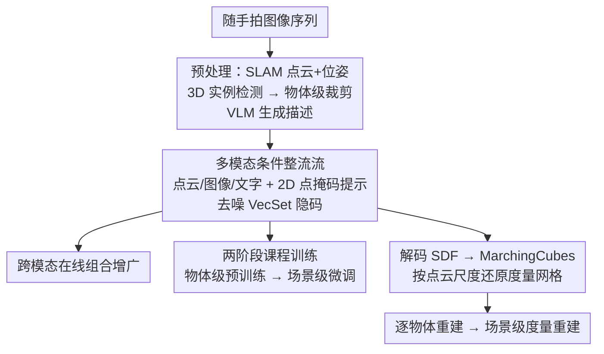

# ShapeR: Robust Conditional 3D Shape Generation from Casual Captures

**会议**: CVPR 2026  
**论文**: [CVF Open Access](https://openaccess.thecvf.com/content/CVPR2026/html/Siddiqui_ShapeR_Robust_Conditional_3D_Shape_Generation_from_Casual_Captures_CVPR_2026_paper.html)  
**代码**: facebookresearch.github.io/ShapeR（项目页，承诺开源代码/权重/数据集）  
**领域**: 3D视觉  
**关键词**: 3D形状生成, 整流流, 多模态条件, 随手拍重建, 课程学习

## 一句话总结
ShapeR 把随手拍的图像序列经过 SLAM + 3D 检测 + VLM 描述，转成"稀疏点云 + 多视角带位姿图像 + 文字"三路多模态条件，喂给一个 FLUX 风格的整流流（rectified flow）Transformer 去噪 VecSet 隐码，在真实遮挡/杂乱场景下生成度量准确、完整的单物体网格，Chamfer 距离比 SOTA 提升 2.7×。

## 研究背景与动机
**领域现状**：物体级 3D 形状生成近年靠原生 3D 扩散模型（TripoSG、Hunyuan3D-2.0、Direct3D-S2 等）取得了惊艳效果，能从干净、分割好、无遮挡的输入里生成高保真网格；场景级重建（NeRF、3DGS、前馈 MVS）则把整个场景重建成单一表面。

**现有痛点**：这两条路在"随手拍"（casual capture）场景下都崩。生成模型依赖干净分割的输入，而真实拍摄充满遮挡、背景杂乱、传感器噪声、低分辨率、运动模糊和糟糕视角，分割本身就难——即便用 SAM2 交互式分割也常出错，掩码一脏生成质量就暴跌。场景级前馈方法把场景重建成单一表面，遮挡区域的物体永远是残缺的、缺背面的。

**核心矛盾**：高保真生成需要"干净、完整、分割好"的理想输入，而随手拍天然给不出这种输入；同时纯图像缺乏度量（metric）锚定，单视角恢复不出真实尺寸。理想输入假设与真实采集条件之间存在根本鸿沟。

**本文目标**：在随手拍序列上，做到（1）对每个物体生成完整、高保真、度量一致的网格；（2）不依赖显式 2D 分割；（3）对遮挡/杂乱/噪声鲁棒。

**切入角度**：作者观察到稀疏 SLAM 点云提供了一路跨整段序列聚合的、互补于图像的几何信号，并且 3D 实例点本身就能隐式"指认"要重建哪个物体，从而绕开易错的显式分割。

**核心 idea**：用"稀疏度量点云 + 带位姿多视角图像 + 机器生成文字"的多模态条件驱动一个整流流生成模型，并配合跨模态在线增广和两阶段课程训练，把生成模型从"理想输入"硬扛到"随手拍"。

## 方法详解

### 整体框架
ShapeR 是一个**物体中心**的生成式重建管线：输入一段随手拍的带位姿图像序列，输出场景中每个被检测物体的完整度量网格。预处理先用现成的视觉惯性 SLAM 得到稀疏点云和相机位姿，再用 3D 实例检测在点云+图像上框出每个物体，为每个物体抽取它的稀疏点、出现它的若干代表帧、这些点在帧上的 2D 投影掩码、以及一段 VLM 生成的文字描述。这套多模态条件喂给一个 FLUX 风格的双流-单流去噪 Transformer，把高斯噪声整流到 3D VAE（Dora/VecSet）的隐码流形上，解码出 SDF 后用 marching cubes 抽网格，最后按物体点云的真实尺度还原到度量坐标系。对每个检测到的物体独立跑一遍，就拼出整个场景的度量重建。

### 关键设计

**1. 多模态条件整流流：用三路互补信号绕开显式分割**

针对"随手拍分割易错、纯图像缺度量"的痛点，ShapeR 把形状生成建成整流流过程：在 Dora 变体 VecSet 的 3D VAE 隐空间里，去噪 Transformer $f_\theta$ 把高斯噪声 $z_1 \sim \mathcal{N}(0,I)$ 整流到目标隐码 $z_0$，训练目标是回归真实传输速度 $\mathcal{L}_{FM} = \mathbb{E}_{t,z_t,C}\big[\|f_\theta(z_t,t,C)-(z_0-z_1)\|_2^2\big]$。条件 $C=\{C_{pts}, C_{img}, C_{txt}\}$ 三路分别编码：SLAM 点用稀疏 3D ResNet 卷积下采样成 token；图像用冻结的 DINOv2 抽特征，拼上相机位姿的 Plücker 射线编码；文字用冻结的 T5 + CLIP 文本编码器。架构借鉴 FLUX.1 的双流-单流：前四层双流对文本 token 做交叉注意力，后续层对图像和点 token 做交叉注意力，省略位置编码。关键在于**不用任何分割掩码**——要重建的物体靠 3D 点 token 和 2D 投影点掩码隐式指认，这正是它能在杂乱场景里鲁棒的根源。

**2. 2D 点掩码提示：把"重建哪个物体"焊进图像特征**

这是隐式分割的核心抓手。每个物体的 3D 点在它出现的帧上投影成二值点掩码 $M_i$，近似该物体在该视角的轮廓，再用一个 2D 卷积提取器处理后，与 DINO 和 Plücker token 拼接。这样 DINO 图像特征就"知道"该聚焦哪个物体，在杂乱场景里大幅减少把相邻物体也重建进来的混淆。消融显示去掉这个点掩码提示（w/o Point Mask Prompting）CD 从 2.375 退到 2.568、F1 从 0.722 掉到 0.701，说明它对干净指认贡献实在。这也是 ShapeR 与依赖显式 2D 分割的先前工作（TripoSG、Amodal3R 等）的根本区别：别人靠掩码、它靠 3D 点投影自己学。

**3. 跨模态在线组合增广：把"理想输入"训练样本逼成"随手拍"**

针对物体级数据集太干净、迁移不到真实采集的痛点，ShapeR 在 data loader 里对所有模态做在线、组合式增广：图像上做背景合成、遮挡叠加、可见性雾化、分辨率退化、光度扰动；SLAM 点上做部分轨迹模拟、多种点丢弃策略、高斯噪声、点遮挡。这些增广在线组合，产生近乎无限的独特训练样本。消融里去掉点增广（CD 3.276）或图像增广（CD 3.397）都明显劣于完整模型（2.375），尤其 w/o Image Augmentation 退化成依赖显式前景分割、一旦掩码脏就崩——这反过来印证"用合成遮挡/背景增广取代对掩码的依赖"是对的。

**4. 两阶段课程训练：先学通用形状先验，再学真实场景复杂度**

作为类别无关的生成模型，ShapeR 要跨大量类别学先验。第一阶段在 60 万+ 艺术家制作的多类别物体网格上训练（物体孤立），靠上面那套重增广弥补"摆拍"设定的局限；第二阶段在 Aria Synthetic Environments 的场景裁剪物体上微调，类别虽少，却带来真实的遮挡、物体间交互和 SLAM 噪声模式——这些组合是单物体数据集因组合爆炸无法覆盖的。消融中去掉第二阶段（w/o Two Stage Training）CD 从 2.375 退到 3.053，证明"大规模物体级预训练 + 真实场景微调"的课程对随手拍鲁棒性是必需的。

### 损失函数 / 训练策略
3D VAE 用 SDF 回归 + KL 正则训练：$\mathcal{L}_{VAE} = \|s-s_{GT}\|_2^2 + \beta\,\mathcal{L}_{KL}(q(z|S)\,\|\,\mathcal{N}(0,I))$，其中表面均匀点捕捉整体几何、边缘显著点捕捉细节，经交叉注意力下采样后拼接、自注意力得到隐码 $z\in\mathbb{R}^{L\times d}$（$L\in\{256,...,4096\}$，$d=64$）。流模型用整流流 FM 损失训练；推理时先三角化高梯度区得稀疏度量点云、3D 检测出包围盒、SAM2 在盒内剔除邻近实例的杂点、选固定 $N$ 帧，再用中点法积分采样 $z_{t-\Delta t}=z_t+\Delta t\,f_\theta(z_t,t,C_i)$，最后 marching cubes + 按点云尺度 rescale 还原度量网格。训练用每物体随机 2 视角，推理最多 16 视角、分辨率 280×280。

## 实验关键数据

### 主实验
在自建 ShapeR Evaluation Dataset（7 个杂乱真实场景、178 个带完整几何标注物体）上，对比 9 个 SOTA 方法。指标：Chamfer ℓ2 距离（CD，越低越好）、法向一致性（NC）、F-score@1%（F1）。

| 方法 | 输入类型 | CD↓ ×10² | NC↑ | F1↑ |
|------|---------|---------|-----|-----|
| EFM3D | 带位姿多视角→3D | 13.82 | 0.614 | 0.276 |
| FoundationStereo (TSDF fusion) | 带位姿多视角→3D | 6.483 | 0.677 | 0.435 |
| LIRM | 带位姿多视角→3D | 8.047 | 0.683 | 0.384 |
| DP-Recon | 带位姿多视角→3D | 8.364 | 0.661 | 0.436 |
| **ShapeR** | 多模态 | **2.375** | **0.810** | **0.722** |

CD 上 ShapeR（2.375）相对最好的基线 FoundationStereo（6.483）提升约 2.7×。另有用户主观偏好实验（660 份回答，对比基础 image-to-3D 模型）：

| 对比基线 | ShapeR 胜率↑ |
|----------|-------------|
| TripoSG | 86.67% |
| Amodal3R | 86.11% |
| Direct3D-S2 | 88.33% |
| Hunyuan3D-2.0 | 81.11% |

注意：单视角 image-to-3D 基线为求最优表现，作者还**人工挑选清晰视角 + SAM2 交互分割**，而 ShapeR 全自动跑多视角带位姿输入，依然在 80%+ 场景被用户偏好。

### 消融实验
（与主表同源 Table 1，逐项去掉组件）

| 配置 | CD↓ ×10² | NC↑ | F1↑ | 说明 |
|------|---------|-----|-----|------|
| Full model (ShapeR) | 2.375 | 0.810 | 0.722 | 完整模型 |
| w/o SLAM Points | 4.514 | 0.765 | 0.486 | 去掉点云这一模态，掉点最猛 |
| w/o Point Augmentation | 3.276 | 0.805 | 0.667 | 去点增广，过拟合点输入 |
| w/o Image Augmentation | 3.397 | 0.778 | 0.649 | 去图像增广，退化成依赖显式分割 |
| w/o Two Stage Training | 3.053 | 0.801 | 0.689 | 去场景级微调 |
| w/o Point Mask Prompting | 2.568 | 0.813 | 0.701 | 去 2D 点掩码提示 |

### 关键发现
- **SLAM 点云模态贡献最大**：去掉后 CD 几乎翻倍（2.375→4.514），证实点云提供了跨整段序列聚合的互补几何信号，在视觉线索弱的物体上尤其救命。
- **增广 > 依赖掩码**：去图像增广后模型被迫依赖显式前景分割，掩码一脏就崩，反证"用合成遮挡/背景增广取代掩码依赖"的设计正确。
- **2D 点掩码提示在杂乱场景防串物体**：去掉后偶尔把相邻物体一起重建进来，NC 反而略升（0.810→0.813）但 F1 下降，说明它主要修的是"指错物体"这类完整性错误。⚠️ NC 这一列的细微非单调变化以原文为准。

## 亮点与洞察
- **隐式分割是最妙的点**：别人都在跟易错的 2D 分割掩码死磕，ShapeR 把"指认哪个物体"交给 3D 实例点 + 2D 投影点掩码隐式完成，从根上躲开了随手拍最大的失败源——掩码噪声。这个"用 3D 点指认代替 2D 掩码分割"的思路可迁移到任何需要在杂乱场景里锁定目标的生成/重建任务。
- **点云作为度量锚**：稀疏 SLAM 点既给互补几何又给真实尺度，让生成网格能 rescale 回度量坐标系，解决了纯图像 image-to-3D 缺度量的老问题。
- **在线组合增广 ≈ 无限数据**：把"摆拍"的干净网格在 data loader 里实时退化成随手拍样本，是用合成可控噪声去逼近真实噪声分布的经济做法，可复用于一切"训练数据太干净、部署环境太脏"的场景。

## 局限与展望
- **依赖一长串现成模块**：SLAM、3D 实例检测、VLM 描述、SAM2 去杂点都是 off-the-shelf，任一环节失败（如检测漏物体、SLAM 点太稀）都会级联影响最终重建质量，论文未充分量化这种级联误差。
- **度量来自特定采集栈**：点云依赖 Project Aria 的视觉惯性 SLAM（单色相机+IMU），对没有惯性/标定的普通手机随手拍能否同样拿到度量点云存疑。⚠️ 适用范围以原文实现细节为准。
- **评测集规模有限**：178 物体 / 7 场景虽真实但偏小，类别覆盖与统计显著性有待更大规模验证；主对比也部分依赖人工为基线挑视角/分割，横向比较需带 caveat。
- **可改进**：把现成模块换成可端到端联合优化的检测+重建，或显式建模级联误差不确定性，可能进一步提升鲁棒性。

## 相关工作与启发
- **vs 基础 image-to-3D（TripoSG / Hunyuan3D-2.0 / Direct3D-S2 / Amodal3R）**：它们在干净、分割好、近正面视角下表现优异，但依赖人工挑视角 + 交互分割，且缺度量锚定；ShapeR 用多模态条件 + 度量点云，全自动、对遮挡杂乱鲁棒，用户偏好 80%+。
- **vs 场景级前馈/融合（EFM3D / FoundationStereo）**：它们把场景重建成单一表面，遮挡处物体残缺；ShapeR 做显式物体级生成，能补全背面与遮挡区。
- **vs 图像-场景布局（MIDI3D / SceneGen）**：它们预测多物体几何+布局但需交互分割、在杂乱场景里物体尺度/排布常出错；ShapeR 逐物体度量重建再组合，尺度与布局更一致且无需交互分割。

## 评分
- 新颖性: ⭐⭐⭐⭐ 多模态条件 + 3D 点隐式分割的组合很巧，但整流流/VecSet/FLUX 等组件多为已有技术的工程整合。
- 实验充分度: ⭐⭐⭐⭐ 自建高质量评测集 + 9 个基线 + 完整消融 + 用户研究，扎实；评测集规模与部分人工干预对比略有保留。
- 写作质量: ⭐⭐⭐⭐ 动机与管线讲得清楚，图示丰富；个别公式在 CVF 文本里 OCR 破碎，需对照原文。
- 价值: ⭐⭐⭐⭐⭐ 把 3D 生成从"理想输入"推向"随手拍"，并开源代码/权重/评测集，对实用化 3D 重建价值高。

<!-- RELATED:START -->

## 相关论文

- [\[CVPR 2026\] Order Matters: 3D Shape Generation from Sequential VR Sketches](order_matters_3d_shape_generation_from_sequential_vr_sketches.md)
- [\[CVPR 2026\] RI-Mamba: Rotation-Invariant Mamba for Robust Text-to-Shape Retrieval](ri-mamba_rotation-invariant_mamba_for_robust_text-to-shape_retrieval.md)
- [\[ICCV 2025\] LongSplat: Robust Unposed 3D Gaussian Splatting for Casual Long Videos](../../ICCV2025/3d_vision/longsplat_robust_unposed_3d_gaussian_splatting_for_casual_long_videos.md)
- [\[CVPR 2026\] HandDreamer: Zero-Shot Text to 3D Hand Model Generation using Corrective Hand Shape Guidance](handdreamer_zero-shot_text_to_3d_hand_model_generation_using_corrective_hand_sha.md)
- [\[CVPR 2026\] Enhancing Hands in 3D Whole-Body Pose Estimation with Conditional Hands Modulator](enhancing_hands_in_3d_whole-body_pose_estimation_with_conditional_hands_modulato.md)

<!-- RELATED:END -->
