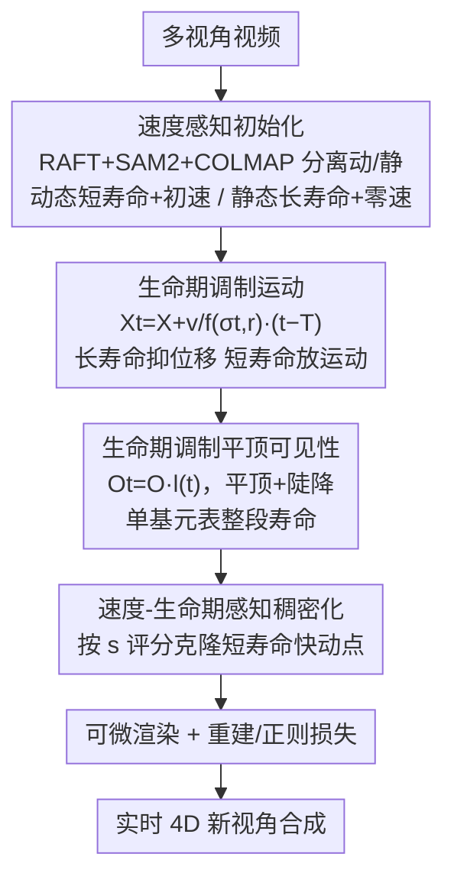

# SharpTimeGS: Sharp and Stable Dynamic Gaussian Splatting via Lifespan Modulation

**会议**: CVPR 2026  
**论文**: [CVF Open Access](https://openaccess.thecvf.com/content/CVPR2026/html/Liao_SharpTimeGS_Sharp_and_Stable_Dynamic_Gaussian_Splatting_via_Lifespan_Modulation_CVPR_2026_paper.html)  
**代码**: https://liaozhanfeng.github.io/SharpTimeGS（项目页）  
**领域**: 3D视觉  
**关键词**: 动态高斯泼溅, 4D重建, 生命期建模, 新视角合成, 静动平衡

## 一句话总结
SharpTimeGS 给每个 4D 高斯基元加一个可学习的"生命期"（lifespan）参数，用它把时间可见性从钟形高斯衰减改成"平顶"轮廓、并调制运动幅度，让长寿命静态点几乎不漂移、短寿命动态点保留充分运动，再配合生命期-速度感知的稠密化与速度感知初始化，在统一表示下同时拍清静态背景和快速动态，达到 SOTA 且 4K@100FPS 实时渲染。

## 研究背景与动机
**领域现状**：3DGS 把场景显式表示成一堆高斯基元、能实时高保真渲染。把它扩到动态场景有两条路：规范空间形变法（学每帧形变场把静态规范表示 warp 到各时刻）和基于运动法（4DGS、4DRotorGS、STGS、FreeTimeGS 直接给基元建模随时间的运动）。

**现有痛点**：这些方法的"时间可见性"和"运动"公式都忽略了静态点和动态点的根本差异。① 时间可见性上，大家都用高斯曲线建模不透明度，但钟形轮廓让长寿命基元会逐渐衰减——要表示一段平直、时不变的可见性，就得堆多个重叠高斯去逼近真实曲线，逼着优化不断插入新基元（冗余稠密化）。② 运动建模上，静态点为了保持稳定必须学一个极小速度，但优化几乎不可能收敛到绝对零速，哪怕一丁点残余速度在长时间里也会累积，造成可见的空间漂移和闪烁。

**核心矛盾**：用一套"行为无关"（behavior-agnostic）的统一公式建模所有点，虽带来简洁和一致优化，却把静态与动态行为纠缠在一起，单一表示难以同时忠实表达两者——长寿命静态要"冻住"，短寿命动态要"放开"，二者诉求相反。

**本文目标**：在不破坏统一表示的前提下，同时做到长期静态结构稳定 + 短时动态运动锐利，并避免冗余稠密化与静态漂移。

**切入角度**：作者的关键洞察是——一个基元的运动特性和时间可见性都和它的"生命期"强相关。于是把生命期作为可学习的逐基元属性，直接注入到不透明度和运动公式里。

**核心 idea**：用生命期参数把"平顶可见性 + 运动调制"统一进 4D 高斯，让生命期长的自动抑制位移、生命期短的保留运动，从表示层面解开静动纠缠。

## 方法详解

### 整体框架
输入多视角视频，目标是重建一个时间连续的 4D 表示做随时间新视角合成。SharpTimeGS 的管线分三块协同：先用**速度感知初始化**分别给动态/静态区域设置物理上合理的位置、速度、生命期先验；核心是**生命期调制的 4D 高斯表示**，它用同一组生命期参数 $(\sigma_t, r)$ 同时调制每个基元的运动幅度和时间可见性（平顶轮廓）；优化过程中再用**速度-生命期感知稠密化**把表示容量更多分给快速动态区、让静态区保持紧凑稳定。三块都围绕"生命期"这一核心属性展开，最终在统一 4D 高斯空间里既稳又锐。

### 关键设计

**1. 生命期调制运动：让静态点"自动冻住"、动态点"放开跑"**

针对"静态点学不到绝对零速、残余运动累积成漂移"的痛点，作者把运动幅度按生命期自适应缩放：$X_t = X + \dfrac{v}{f(\sigma_t, r)}(t-T)$，其中 $f(\sigma_t, r) = 1.0 + \max\!\big(1.0,\,(\sigma_t + r)^2\big)$。$\sigma_t$ 是生命期方差（控制基元随时间渐隐的快慢），$r$ 是时间半径（在此范围内基元完全活跃）。对静态区，$\sigma_t + r$ 很大 → $f \to \infty$ → $v/f \to 0$，等于把位置在时间上冻住，哪怕 $v$ 没收敛到零也不漂移；对短生命期的动态区，$f$ 变小 → 允许大运动幅度、快速跟上剧变。$\sigma_t$ 和 $r$ 都逐基元可学，模型自己决定每个点的时间行为。这一步把"运动幅度"和"时间持续"解耦，是统一表示能兼顾稳与锐的根本。

**2. 生命期调制平顶可见性：单个基元就能表示一整段寿命**

针对"钟形高斯衰减逼长寿命表示堆多个重叠高斯、引发冗余稠密化"的痛点，作者把不透明度的时间轮廓从高斯改成**平顶**：$O_t = O \cdot l(t)$，

$$l(t) = \begin{cases} \exp\!\left(-\left(\dfrac{|t-T|-r}{\sigma_t}\right)^2\right), & |t-T| > r,\\[4pt] 1, & |t-T| \le r. \end{cases}$$

即在半径 $r$ 内可见性恒为 1（平顶），超出 $r$ 才按高斯陡降。静态基元取大 $r$ 就能维持一段稳定、时不变的可见性，无需多个高斯去拼；动态基元取小 $r$、小 $\sigma_t$ 则在短时窗内淡入淡出。复用与运动同一组 $r$，让一个基元就能准确表示自己的完整寿命，去掉了"运动拖影"、产生更清晰的时间边界。颜色按球谐 $C_t = \sum_{l}\sum_{m} C_{lm} Y_{lm}(d(X_t))$ 在移动后位置 $X_t$ 处计算，最后转成 3D 高斯按 3DGS 渲染。

**3. 速度-生命期感知稠密化：把容量更多分给快速动态区**

针对"快速复杂区由短寿命高速基元表示、训练中获得的有效更新远少于长寿命基元、导致动态区模糊欠拟合"的痛点，作者设计了按运动与时间持续度自适应的稠密化。训练分两阶段：前 1/3 迭代按 AbsGS（结合平均与绝对平均图像梯度）克隆、把高斯数扩到覆盖场景，之后固定总数 $N$；第二阶段移除低不透明度基元，并按评分 $s$ 克隆新基元：

$$s = \lambda_e E + \lambda_o O + \lambda_l\left(1 - \exp\!\left(-\dfrac{\|v\| + 1}{f(\sigma_t, r)}\right)\right).$$

$E$ 是该基元累积的渲染重建误差（反映它解释观测的好坏），$O$ 是不透明度（鼓励保留视觉重要区），最后一项给"大运动幅度 + 短生命期"的基元更高分。每步把低于阈值的基元删掉、再从高分基元克隆同样数量，于是表示容量被主动倾斜给瞬态快速运动，静态区保持紧凑轻量。

**4. 速度感知初始化：动静分治给优化一个好起点**

针对"4D 高斯优化在动态场景里不稳"的痛点，作者对动/静区域分别初始化。动态区：用 RAFT 算光流找运动点 → 作为提示喂 SAM2 拿完整物体掩码 → 在掩码+相机参数下用 COLMAP 逐帧重建运动物体点云 → 相邻帧用 KNN 匹配、3D 位移定为初速 $v_{init}$；时间锚 $T$ 取当前帧、$v$ 取 $v_{init}$、$\sigma_t$ 覆盖约三帧、$r$ 初始化为 $10^{-6}$（短寿命）。静态区：用 COLMAP 重建首帧（含动静点，错的动态点优化中会被删）初始化长寿命基元，$v$ 取零、$T$ 取序列中点、$\sigma_t$ 覆盖约三倍总帧数、$r$ 同样 $10^{-6}$。动静分治的先验显著稳定了优化。

### 损失函数 / 训练策略
总损失 $\mathcal{L} = \mathcal{L}_{recon} + \mathcal{L}_{reg} + \mathcal{L}_e$。重建项 $\mathcal{L}_{recon} = \lambda_1 \mathcal{L}_1 + \lambda_s \mathcal{L}_s(\text{SSIM}) + \lambda_p \mathcal{L}_p(\text{感知})$，取 $\lambda_1{=}0.8,\lambda_s{=}0.2,\lambda_p{=}0.01$。正则 $\mathcal{L}_{reg} = \lambda_{scale}\mathcal{L}_{scale} + \lambda_{opacity}\mathcal{L}_{opacity} + \lambda_n\mathcal{L}_n + \lambda_t\mathcal{L}_t$：$\mathcal{L}_{scale}$（仿 PGSR）压扁高斯并配单视角法向/深度一致性 $\mathcal{L}_n$；$\mathcal{L}_t = \frac{1}{N}\sum \frac{1}{\sqrt{-2\log(o_{th})}\,\sigma_t^2 + r}$ 鼓励延长生命期、复用同一基元而非碎成多个；$\mathcal{L}_{opacity} = \frac{1}{N}\sum O \cdot \overline{\nabla}[l(t)]$（$\overline{\nabla}$ 为停梯度）在第二稠密化阶段加入、并停止重置不透明度以稳定收敛。$\mathcal{L}_e$ 为稠密化辅助项（与 $E$ 相关，细节在补充材料）。⚠️ 各公式以原文为准。

## 实验关键数据

### 主实验
在 Neural3DV、ENeRF-Outdoor、SelfCap 三个动态场景基准上评测，指标 PSNR↑ / SSIM²↑ / LPIPS↓。

| 方法 | Neural3DV PSNR↑ | ENeRF-Outdoor PSNR↑ | SelfCap PSNR↑ |
|------|------|------|------|
| Deformable-3DGS | 31.15 | 24.26 | 25.85 |
| Ex4DGS | 32.11 | 24.89 | 24.96 |
| 4DGS | 32.01 | 24.82 | 25.86 |
| STGS | 32.05 | 24.93 | 24.77 |
| FreeTimeGS | 33.19 | 25.36 | 27.50 |
| **Ours** | **33.57** | **25.82** | **28.14** |

SharpTimeGS 在三个数据集的全部指标上都最优。完整三指标对比（以 SelfCap 为例）：本文 PSNR 28.14 / SSIM² 0.960 / LPIPS 0.192，对比最强基线 FreeTimeGS 的 27.50 / 0.951 / 0.201。ENeRF-Outdoor 上 SSIM² 从 FreeTimeGS 的 0.846 提到 0.872，提升尤为明显。指标说明：SSIM² 为论文标注的结构相似度变体（⚠️ 具体定义以原文为准），LPIPS 为学习感知图像块相似度（越低越好）。

### 消融实验
在 SelfCap 数据集（部分场景）逐个去掉提出的模块：

| 配置 | PSNR↑ | SSIM²↑ | LPIPS↓ | 说明 |
|------|------|------|------|------|
| full model | 27.36 | 0.947 | 0.244 | 完整模型 |
| w/o our representation | 25.96 | 0.907 | 0.299 | 换回 4DGS 耦合表示，掉点最猛 |
| w/o lifespan r | 26.76 | 0.927 | 0.321 | 去掉生命期半径 r |
| w/o our densification | 26.82 | 0.919 | 0.317 | 换回 4DGS 稠密化 |
| w/o our initialization | 26.83 | 0.927 | 0.297 | 去速度感知初始化 |

注：该消融表为"Partial"子集，full model PSNR 27.36 与主表 SelfCap 全集的 28.14 不可直接比，仅供组件相对比较。

### 关键发现
- **4D 表示（解耦运动/外观）贡献最大**：换回 4DGS 的耦合表示后 PSNR 从 27.36 暴跌到 25.96，且在快速细结构（头发、自行车辐条）和背景区出现伪影——因为运动与外观纠缠使快速运动下优化不稳、局部不收敛。
- **平顶可见性减少时间混叠**：用回高斯钟形可见性会在运动细节上产生时间模糊、在长寿命结构上过平滑；平顶+陡降边界减少了时间混合，动态更锐、准静态更干净。
- **稠密化解决静动优化失衡**：4DGS 原稠密化不顾生命期与速度，使快/慢、短/长寿命区获得的更新次数不均，动态区欠拟合；本文按 $s$ 评分把克隆名额给短寿命快动点。
- **静动权衡是基线通病**：4DGS 因全耦合在快速内容（球、西瓜）上难收敛；STGS 高阶公式难优化；FreeTimeGS 忽略速度-生命期依赖、参数过松导致静态保真下降（墙、书）且动态欠收敛。

## 亮点与洞察
- **"生命期"是一把多用钥匙**：同一组 $(\sigma_t, r)$ 同时管运动幅度和时间可见性，一个物理直觉（行为与寿命强相关）就把静动解耦、平顶可见性、稠密化评分三件事串了起来，设计极其经济。这种"找一个能解释多种现象的潜变量、把它显式参数化"的思路很值得迁移。
- **平顶可见性根治冗余稠密化**：把钟形改平顶，让单个长寿命基元就能表示一整段时不变可见性，从源头消除了"堆多个高斯逼近平直曲线"的浪费，这是渲染锐利+表示紧凑双赢的关键。
- **静态自动冻结的优雅**：不靠强行把速度正则到零，而靠 $v/f(\sigma_t,r)$ 在长寿命时分母趋无穷自然把位移压没，避免了优化难收敛到绝对零速的老大难，工程上很巧。

## 局限与展望
- **初始化依赖现成栈**：速度感知初始化串了 RAFT + SAM2 + COLMAP，动态掩码/光流/SfM 任一不准都会污染初速与动静分离先验，论文未量化这种级联误差。
- **生命期参数化的可解释性**：$f(\sigma_t, r) = 1.0 + \max(1.0, (\sigma_t+r)^2)$ 的具体形式偏经验，$\sigma_t$ 与 $r$ 角色有重叠（消融里去掉 $r$ 仍有相当表现），二者是否冗余、能否进一步简化有待探究。⚠️ 公式细节以原文为准。
- **基准与评测**：主要在三个多视角视频基准上验证，单目/稀疏视角动态场景的适用性未充分检验；消融用的是 SelfCap 子集，与全集数值不可直接对照。
- **可改进**：把生命期先验做成数据驱动学习、或显式建模初始化不确定性，可能进一步提升对复杂运动的鲁棒性。

## 相关工作与启发
- **vs FreeTimeGS**：同为线性速度运动法，但 FreeTimeGS 不统一处理静动、参数过松，导致静态抖动（墙/书）和快速运动细节丢失；SharpTimeGS 用生命期调制把静动诉求都满足，PSNR/SSIM/LPIPS 全面更优。
- **vs 4DGS / 4DRotorGS**：它们几何与速度耦合、时空尺度紧绑，快速运动难收敛、易出伪影；SharpTimeGS 解耦运动与外观、平顶可见性，快动更锐、静态更稳。
- **vs STGS**：STGS 用高阶多项式运动+角速度，高维参数化难优化、易过拟合；SharpTimeGS 用更简洁的生命期调制线性运动，优化更稳。
- **vs 规范形变法（Deformable-3DGS）**：形变法学高维形变场、复杂大运动下难优化且时间一致性差；本文直接在 3D 空间建模运动+生命期，效率与质量更好。

## 评分
- 新颖性: ⭐⭐⭐⭐⭐ "生命期"统一调制运动+可见性+稠密化的洞察新颖且统一，直击动态高斯静动纠缠的根本痛点。
- 实验充分度: ⭐⭐⭐⭐ 三基准全指标 SOTA + 四组件消融充分；消融用子集、单目/稀疏视角未覆盖略有保留。
- 写作质量: ⭐⭐⭐⭐ 动机和公式推导清晰、图示直观；CVF 文本里部分公式 OCR 破碎需对照原文。
- 价值: ⭐⭐⭐⭐ 4K@100FPS 实时 + SOTA 质量，对动态 NVS 实用化价值高，方法思路可迁移到其他时变高斯任务。

<!-- RELATED:START -->

## 相关论文

- [\[CVPR 2026\] Learning Explicit Continuous Motion Representation for Dynamic Gaussian Splatting from Monocular Videos](learning_explicit_continuous_motion_representation_for_dynamic_gaussian_splattin.md)
- [\[CVPR 2026\] $L^{2}DGS$: Low-Light Dynamic Gaussian Splatting](l2dgs_low-light_dynamic_gaussian_splatting.md)
- [\[CVPR 2026\] MotionScale: Reconstructing Appearance, Geometry, and Motion of Dynamic Scenes with Scalable 4D Gaussian Splatting](motionscale_reconstructing_appearance_geometry_and_motion_of_dynamic_scenes_with.md)
- [\[CVPR 2026\] MSCD-GS: Motion-Separated Cooperative Deblurring Dynamic Reconstruction via Gaussian Splatting](mscd-gs_motion-separated_cooperative_deblurring_dynamic_reconstruction_via_gauss.md)
- [\[CVPR 2026\] InstantHDR: Single-forward Gaussian Splatting for High Dynamic Range 3D Reconstruction](instanthdr_singleforward_gaussian_splatting_for_hi.md)

<!-- RELATED:END -->
