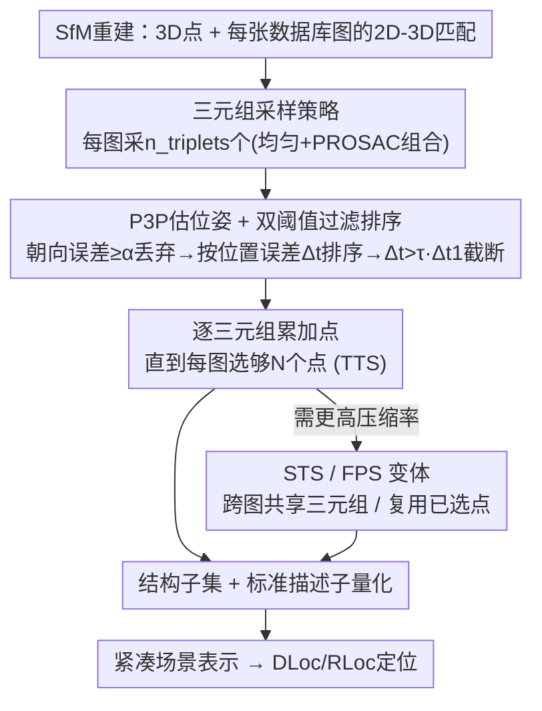

# Simple but Effective Triplet-Based Compression Strategies for Compact Visual Localization

**会议**: CVPR 2026  
**论文**: [CVF Open Access](https://openaccess.thecvf.com/content/CVPR2026/html/Sattler_Simple_but_Effective_Triplet-Based_Compression_Strategies_for_Compact_Visual_Localization_CVPR_2026_paper.html)  
**代码**: https://github.com/tsattler/triplet-based-structure-compression  
**领域**: 3D 视觉 / 视觉定位 / SfM 点云压缩  
**关键词**: 视觉定位, 结构压缩, SfM 点云, P3P, 三元组采样

## 一句话总结
针对视觉定位中"压缩 SfM 点云"这一长期靠求解复杂优化（集合覆盖 / 整数规划 / 二次规划）的问题，本文提出一个**几乎平凡**的策略：为每张数据库图随机采样三元组点、用 P3P 估位姿、保留能让数据库图位姿最准的三元组所含的点——以"位姿精度"为直接选点准则，配合标准描述子量化，效果却追平甚至超过当前 SOTA 压缩与学习型方法。

## 研究背景与动机

**领域现状**：视觉定位（从一张查询图估计相机位姿）是 AR、自主机器人的关键模块，最成熟的场景表示是 SfM 稀疏点云——每个 3D 点挂着局部特征描述子，查询图靠 2D-3D 匹配 + P3P/RANSAC 求位姿。移动端内存有限、云端要快读盘，因此**压缩场景表示**（选点子集 + 压描述子）是社区长期课题。

**现有痛点**：主流的结构压缩（选点子集）把问题建模成"每张数据库图至少看到 N 个被选点"的 **N-覆盖（set cover）**变体，再去求解——而集合覆盖是 NP-hard，精确解要解整数线性规划（ILP，大场景动辄分钟到小时），高效近似要解贪心或二次规划（QP）。这些方法**实现复杂、运行昂贵**。

**核心矛盾**：现有方法只优化"每图看到 N 个点"这类**间接的、几何分布层面的代理条件**（点是否均匀分布、描述子是否互异），却**从不直接把"位姿是否估得准"纳入选点准则**——它们假设满足覆盖条件就能估准位姿，但这只是间接相关。

**本文目标**：用一个**实现起来近乎平凡**的策略替掉复杂优化，同时让选点直接对齐"位姿精度"这一最终目标。

**切入角度**：校准相机下，**三个 2D-3D 匹配（一个三元组）就够 P3P 估一个位姿**。那么与其逐点选，不如**选三元组**：能为数据库图估出准位姿的三元组，往往由三角化准确、且非退化（不共线、信噪比高）的点组成；按"数据库图近似查询视角"的常规假设，这些点在查询图里也大概率构成良态三元组、给出准位姿。

**核心 idea**：以"三元组对数据库图的位姿估计误差"作为选点准则——随机采三元组 → P3P 估位姿 → 留下让位姿最准的三元组所含的点。**用位姿精度直接选点，代替求解复杂的覆盖优化。**

## 方法详解

### 整体框架
方法输入是一份 SfM 重建（相机内外参、3D 点、以及三角化各点的 2D 特征坐标，即每张数据库图的一组 2D-3D 匹配），输出是一个能让定位仍然准确的**3D 点子集**。核心算法 Trivial Triplet Sampling（TTS）对每张数据库图独立处理：随机采若干三元组 → 对每个三元组用 P3P 估相机位姿 → 用朝向误差阈值 $\alpha$ 滤掉差位姿、按位置误差对剩下的三元组排序 → 按相对阈值 $\tau$ 截断、逐三元组把点累加进选集，直到该图被选点数达到 $N$。选完结构再叠加标准描述子压缩（PCA / 乘积量化）即得紧凑表示。作者还给出两个变体（STS / FPS）在压缩率与精度间做不同权衡。

### 关键设计

**1. 以"位姿精度"为直接选点准则：三元组 + P3P 取代覆盖优化**

现有方法只保证几何覆盖（每图看到 N 个点），却不直接管位姿准不准；本文把准则换成"这组点能不能让数据库图位姿估得准"。由于查询图位姿不可得，作者用数据库图位姿（SfM 给的参考位姿）作代理：校准相机下三个 2D-3D 匹配即可经 P3P 估一个位姿，于是选点的最小单位变成**三元组**。能给数据库图估出准位姿的三元组，天然倾向于由三角化准确、非退化（避免共线、保持高信噪比）的点构成；在"数据库视角近似查询视角"的标准假设下，这些点在查询图里也更可能给出准位姿。这个准则把"间接的覆盖条件"换成了"直接对齐最终目标的精度信号"，也正是它实现极简却有效的根因。

**2. Trivial Triplet Sampling（TTS）主算法：双阈值过滤 + 位置误差排序**

TTS 是上述准则最简单的落地。对每张数据库图采 $n_{\text{triplets}}$ 个三元组（固定 $n_{\text{triplets}}=10000$）；P3P 对每个三元组最多返回 4 个候选位姿，逐个与参考位姿比对：朝向误差 $\text{orient\_err}=\arccos\big((\text{trace}(R_{\text{sfm}}^{-1}R_i)-1)/2\big)$，若 $\ge\alpha$（设 $\alpha=5^\circ$）则丢弃。保留的三元组按**位置误差** $\Delta_t=\|c_t-c_{\text{sfm}}\|$ 升序排，记最优三元组误差为 $\Delta_{t_1}$，丢弃 $\Delta_t>\tau\cdot\Delta_{t_1}$ 的三元组（$\tau$ 控制可选三元组的位姿质量门槛，因最终只选少数三元组，实验发现 $\tau$ 不敏感，$\tau=10$ 通用）。然后顺着排序逐三元组把三个点加入选集，直到该图被选点数 $\ge N$（$N$ 越小表示越紧凑）或没有合格三元组为止，再换下一张图。整个算法只有"采样—P3P—阈值—排序—累加"几步，无需任何优化求解器。

**3. 采样策略：均匀 / PROSAC / 组合，权衡共享性与精度**

如何采三元组直接影响压缩率。最朴素的均匀采样（类 RANSAC）问题在于不同数据库图采到的三元组几乎不相交，导致跨图选的点高度互斥、压缩率上不去。替代方案是 **PROSAC 式有偏采样**：把 2D-3D 匹配按"被多少张数据库图观测到"降序排，优先采可见度高的点，提高跨图共享同一 3D 点的概率。但在"部分场景能从很远处看到"的场景（如 King's College），远处点虽被很多相机看到却三角化不准，PROSAC 偏好它们反而掉精度。作者因此用 $n_{\text{triplets}}$ 个均匀样本 + $n_{\text{triplets}}$ 个 PROSAC 样本的**组合采样**作默认，兼顾共享性与精度（极小内存需求时单用 PROSAC 反而更优）。

**4. STS 与 FPS 变体：进一步压小点集**

即便用 PROSAC，TTS 跨图选的三元组仍偏互斥，难以选出极小点集。**Sharing-Based Triplet Selection（STS）** 让一张图的候选三元组列表也纳入"在别的图里也能给出好位姿"的三元组，并给每个三元组打分（在多少张图里合格），按分数降序选——用更少的点覆盖更多图，代价是位姿精度略降。**Fine-Grained Point Selection（FPS）** 则针对"逐三元组选点会重复引入新点"的浪费：它在选三元组时**优先包含已被选过的 3D 点**（哪怕该三元组位姿略差），从而用更少的不同点满足 $N$。两个变体可与 TTS/STS 组合（TTS+FPS、STS+FPS），在压缩率—精度曲线上提供更激进的压缩档位。

## 实验关键数据

### 主实验
数据集为视觉定位标准三件套 7Scenes、Cambridge Landmarks、Aachen Day-Night v1.0；指标为给定阈值内定位成功率（Cambridge 10cm/1°、7Scenes 5cm/5°、Aachen 0.25m/2° 等）与中值位姿误差，并报存全部场景所需内存（MB）。结构压缩对比 QP（当前 SOTA，二次规划）、Greedy Set Cover、Track Length；定位用 DLoc（直接 2D-3D 匹配）与 RLoc（分层检索 + LightGlue）两条标准管线。

| 数据集 / 阈值 | 对比对象 | 本文（TTS 及变体） | 结论 |
|---------------|----------|--------------------|------|
| Cambridge 10cm/1° | QP / Greedy / Track Length | TTS、TTS+FPS、STS、STS+FPS | 在内存-精度权衡上**明显更优** |
| 7Scenes 5cm/5° | 同上 | 同上 | 内存-精度曲线**全面更好** |
| Aachen 细阈值 25cm/2° | 同上 | TTS 系列 | **超过基线** |

在 Cambridge 与 7Scenes 上，本文四种策略均给出比 QP/Greedy/Track Length 更好的"内存-位姿精度"曲线；Aachen 细阈值下也胜出。叠加标准描述子量化（8-bit 标量量化 / 乘积量化）后，整体与近期学习型紧凑定位方法相比也具竞争力或达到 SOTA。

### 消融实验
| 配置 | 现象 | 说明 |
|------|------|------|
| 均匀采样 | 跨图三元组多互斥、压缩率受限 | 但各场景稳定 |
| PROSAC 采样 | 低内存档略优、King's College 显著掉点 | 偏好远处高可见但三角化差的点 |
| 组合采样（默认） | 与均匀相当、且更稳 | 兼顾共享性与精度 |
| $\tau$ 变化 | 对 TTS 几乎无影响（够大即可） | 故统一 $\tau=10$ |

### 关键发现
- **采样策略是 TTS 里最重要的设计选择**：均匀 vs PROSAC vs 组合直接决定压缩率与精度，组合采样最稳、被设为默认；极小内存（约 2.5MB）时 PROSAC 反而最佳。
- **PROSAC 的失败案例有解释**：King's College 这类"远处点被多相机看到但三角化不准"的场景会被 PROSAC 偏好，导致掉精度——揭示"高可见度 ≠ 高精度"。
- **效率优势明显**：Aachen N=20 时 TTS/STS 单核约 5/9 分钟（其中 4 分钟用于选三元组），FPS 仅加 <30s，并行后 2/5 分钟；相比之下 ILP 在很小实例上就要分钟到小时。

## 亮点与洞察
- **"换准则"胜过"换求解器"**：把选点准则从"几何覆盖"换成"位姿精度"，一个准则的改变就让方法从 NP-hard 优化退化成随机采样+P3P，这种"重新定义目标而非更猛地优化旧目标"的思路极有借鉴价值。
- **三元组作为选点最小单位**很自然：既对齐 P3P 的最小求解需求，又隐式偏好三角化准、非退化的好点，等于免费拿到几何质量过滤。
- **简单即优势**：方法只用 P3P、阈值、排序这些标准积木，可直接塞进现有定位管线替换掉更差的结构压缩模块——工程落地门槛极低，这是论文反复强调的核心卖点。

## 局限与展望
- 方法本质仍假设**数据库图视角近似查询图视角**，对查询视角与建图视角差异极大的场景，"数据库图位姿准 ⇒ 查询图位姿准"的代理可能失效。
- TTS 默认 $n_{\text{triplets}}=10000$、按图独立选点，**跨图点共享不足**导致难选极小点集；STS/FPS 虽缓解但以牺牲位姿精度为代价。
- PROSAC 采样在"远景点"场景明显掉点，需依赖组合采样规避，说明采样策略仍需按场景调。
- 结构压缩之外，描述子压缩用的是现成 PCA / 乘积量化，二者联合的最优配置未深入探索。

## 相关工作与启发
- **vs QP（二次规划，前 SOTA）/ Greedy Set Cover / ILP**：它们把压缩建模成覆盖类优化、求解复杂昂贵（ILP 大场景分钟到小时），且只优化几何覆盖代理；本文用随机三元组 + P3P 直接对齐位姿精度，实现极简却追平/超越。
- **vs 学习型紧凑定位（如把 QP 嵌入学习管线、场景坐标回归压缩）**：这些方法更复杂、且在大场景上尚未稳定超越基于 SfM 点云的压缩；本文证明**简单的结构+描述子压缩已能达到或超过 SOTA**，并能直接替换它们管线里更弱的结构压缩组件。

## 评分
- 新颖性: ⭐⭐⭐⭐ 不在算法繁复度上加码，而靠"重定义选点准则"取胜，思路新但单个组件都很标准。
- 实验充分度: ⭐⭐⭐⭐⭐ 三大基准 × 两条定位管线 × 多种特征 × 多压缩档位，对比与消融充分。
- 写作质量: ⭐⭐⭐⭐⭐ 动机—准则—算法—变体层层推进，伪代码与失败案例分析清晰。
- 价值: ⭐⭐⭐⭐ 极易实现、可直接替换现有管线模块，对紧凑视觉定位的工程落地价值高。

<!-- RELATED:START -->

## 相关论文

- [\[CVPR 2026\] AsymLoc: Towards Asymmetric Feature Matching for Efficient Visual Localization](asymloc_towards_asymmetric_feature_matching_for_efficient_visual_localization.md)
- [\[CVPR 2026\] CoLoR: The Devil is in Scene Coordinate Regression for Large-Scale Visual Localization](color_the_devil_is_in_scene_coordinate_regression_for_large-scale_visual_localiz.md)
- [\[CVPR 2026\] Towards Visual Query Localization in the 3D World](towards_visual_query_localization_in_the_3d_world.md)
- [\[CVPR 2026\] ULF-Loc: Unbiased Landmark Feature for Robust Visual Localization with 3D Gaussian Splatting](ulf-loc_unbiased_landmark_feature_for_robust_visual_localization_with_3d_gaussia.md)
- [\[CVPR 2026\] VGA: Empowering Aerial-Ground Localization by Visual Geometry Alignment](vga_empowering_aerial-ground_localization_by_visual_geometry_alignment.md)

<!-- RELATED:END -->
