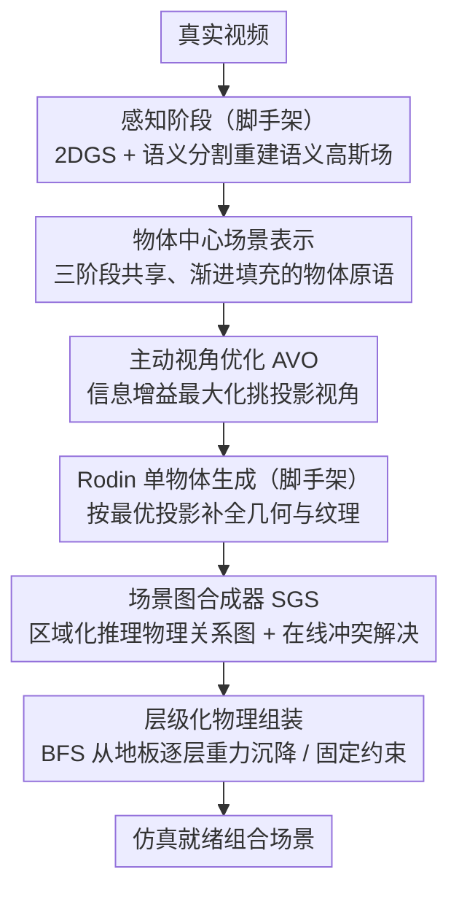

# SimRecon: SimReady Compositional Scene Reconstruction from Real Videos

**会议**: CVPR 2026  
**arXiv**: [2603.02133](https://arxiv.org/abs/2603.02133)  
**代码**: [https://xiac20.github.io/SimRecon/](https://xiac20.github.io/SimRecon/)  
**领域**: 其他  
**关键词**: 组合式场景重建, 仿真就绪, 场景图, 主动视角优化, 物理组装

## 一句话总结

提出 SimRecon 框架，通过"感知→生成→仿真"三阶段流水线，从真实视频自动构建仿真就绪的组合式 3D 场景，核心创新在于主动视角优化（AVO）为单物体生成寻找最优投影视角和场景图合成器（SGS）引导物理可信的层级化组装。

## 研究背景与动机

**领域现状**：3D 场景重建主要有三条路线——整体式神经重建（3DGS/NeRF，无法交互）、手工/程序化构建的仿真器（AI2-THOR, ProcTHOR）、以及新兴的组合式重建（从多视图分解出单个物体）。

**现有痛点**：
   - 整体式重建缺乏物体边界和完整几何，不适合仿真和交互
   - 手工/程序化仿真器成本高、布局不真实
   - 现有组合式重建（DPRecon, InstaScene）依赖启发式视角选择导致生成物体变形，且输出仍是视觉表示而非仿真就绪场景

**核心矛盾**：从真实视频到仿真就绪场景存在两个断裂——"感知→生成"阶段的**视觉保真度**问题和"生成→仿真"阶段的**物理合理性**问题

**切入角度**：不重新设计整个流水线，而是设计两个**桥接模块**来解决两个阶段转换的核心问题

**核心 idea**：用主动视角优化获取信息增益最大的投影图作为生成条件，用场景图合成器引导层级化物理组装

## 方法详解

### 整体框架

SimRecon 要解决的是从一段真实视频自动产出"仿真就绪"组合场景这件事——既要每个物体几何完整、纹理干净，又要它们之间的物理关系（谁压在谁上、谁挂在谁上）正确，丢进仿真器就能直接交互。整条流水线分三段串起来：**感知**阶段先用 2DGS + 语义分割把视频重建成带语义的高斯场，切出每个物体的位姿、尺度、标签；**生成**阶段对每个切出来的物体用 AVO 找一个信息量最大的投影视角，把这张投影喂给单物体生成模型 Rodin 补出完整几何和纹理；**仿真**阶段用 SGS 推理出物体间的物理关系图，再按这张图在 Blender/Isaac Sim 里层级化地把物体摆回去。三段之间靠一个统一的物体中心表示接力，每段往里填一类属性。

论文的洞察是不去重新设计整条流水线，而是盯住两处"断裂点"各补一个桥接模块：感知到生成的断裂是**视觉保真**（投影视角选不好，生成出来的物体会变形），靠 AVO 解决；生成到仿真的断裂是**物理合理**（物体补全了但不知道怎么摆），靠 SGS 解决。

### 关键设计

**1. 物体中心场景表示：给三个阶段一个共享的数据接口**

整条流水线最怕的是各阶段各自为政、信息传不下去。SimRecon 把场景统一写成一组离散的物体原语 $\mathcal{S}_\text{comp} = \{o_1, o_2, ..., o_L\}$，每个 $o_i$ 既带**内在属性**——空间位姿 $T_i \in SE(3)$、外观 $\mathcal{M}_i, \mathcal{T}_i$、物理量 $l_i, \text{mat}_i, m_i$（语义标签、材质、质量），又带**关系属性**（场景图里它和别的物体的支撑/附着边）。这些属性不是一次填满，而是三个阶段渐进式填充：感知填位姿和标签，生成填几何纹理，仿真填关系和物理量。这样每个模块只需读写自己关心的那几个字段，换掉某一阶段的模型也不影响接口。

**2. 主动视角优化（AVO）：用信息增益挑投影视角，而不是拍脑袋采样**

单物体生成模型吃的是一张投影图，投影视角选差了——比如正对着被遮挡的那一面——生成出来的物体就会变形。现有方法靠启发式（固定角度采样、最大化 2D 像素覆盖）来选，但 2D 覆盖大不等于看得清，一个小物体可能 2D 占满画面却整体被前景挡住。AVO 把视角选择直接形式化成信息论问题 $IG(v) = H(X|v_0) - H(X|v)$，即在已有观测 $v_0$ 之外，新视角 $v$ 能再消除多少关于物体的不确定性。难点是 $IG$ 不可微，AVO 用 3DGS 渲染出的累积不透明度做可微代理——一个视角看到的高斯体越多越实，信息增益就越大：

$$\max_v IG(v) = \max_v A(v) = \max_v \sum_{p \in \mathcal{P}_\text{obj}(v)} \alpha(p,v)$$

这样视角参数就能直接用梯度在 3D 空间里搜，不靠人工采样网格。但只最大化不透明度有个塌缩风险：相机会一头扎到物体表面贴脸看（那里不透明度也很高）。于是加一项深度正则把相机拉到合理距离 $d_\text{target}(s_i)$（随物体尺度 $s_i$ 自适应）：

$$L_\text{depth}(v) = \frac{\lambda_\text{depth}}{|\mathcal{P}_\text{obj}(v)|}\sum_p (D(p,v) - d_\text{target}(s_i))^2$$

单个视角往往看不全一个物体，AVO 还做**迭代视角扩展**：每选定一个视角 $v_k^*$，就把它已经看清的那些高斯体的有效不透明度乘法衰减掉，$\alpha_i^{(k)} = \alpha_i^{(k-1)} \cdot (1 - \text{clip}(\alpha_i'(v_k^*), 0, 1))$，下一轮优化自然就被推向还没看到的区域。几轮下来一组视角就把物体绕着覆盖全。

**3. 场景图合成器（SGS）：把物体摆回去之前先想清楚谁靠着谁**

物体补全了但直接按重建位姿放回去，会出现悬浮、穿透这类物理错误，因为重建位姿本身有噪声、也没有"桌子托着杯子"这种依赖关系的概念。SGS 先把物体间的支撑/附着关系推理成一张全局场景图，再用这张图引导组装。一次让 VLM 看整个场景去推全局图既慢又容易漏，所以 SGS 做**区域化推理**：先用 DBSCAN 把物体按空间位置聚成若干区域，每个区域单独用 AVO 取一个最优观察视角，让 VLM（Qwen2.5-VL）只推理这个局部的子图 $\mathcal{G}_k$。局部子图再通过**在线图合并**拼成全局图——BFS 逐个并入子图，一旦检测到冲突边（两个节点间路径不存在、或层级关系互相矛盾），就重新取一个专门的裁决视角让 VLM 复判，把矛盾消掉再继续。图建好后做**层级化物理组装**：BFS 从地板/墙壁这些基础节点出发逐层往上摆，支撑关系（杯子在桌上）用重力沉降模拟让物体自然落稳，附着关系（画挂在墙上）用固定约束锚死。这样组装出来的场景物理上自洽，丢进仿真器即可交互。

### 一个完整示例

以一段桌面场景视频为例走一遍：感知阶段切出地板、桌子、台灯、几本书共若干物体原语，每个先拿到位姿和语义标签。轮到生成台灯时，AVO 在 3D 空间搜视角——若只最大化 2D 覆盖会选到正对着被书遮挡的一面，而信息增益版本会绕到侧上方先拍到灯罩和灯杆；选完第一个视角后，灯罩对应的高斯体不透明度被衰减，第二轮自动转向还没看清的底座，两三个视角把台灯绕覆盖全，Rodin 据此补出完整几何。到仿真阶段，SGS 先把桌面这一簇聚成一个区域，VLM 推出局部子图"书 → 支撑于 → 桌子、台灯 → 支撑于 → 桌子"；并入全局图时若发现"台灯 → 支撑于 → 书"这条与另一子图矛盾，就取裁决视角让 VLM 复判删掉错边。最后从地板出发 BFS 组装：桌子重力沉降落到地板上，书和台灯再沉降落到桌面，整套摆放无悬浮无穿透。

### 损失函数 / 训练策略

框架不涉及端到端训练，各阶段直接复用独立的预训练模型（2DGS、SceneSplat、Rodin），唯一需要在线优化的是 AVO 的视角参数（含深度正则项 $L_\text{depth}$），约 30 秒/物体。

## 实验关键数据

### 主实验 — ScanNet 组合式 3D 重建

| 方法 | CD↓ | F-Score↑ | NC↑ | PSNR↑ | SSIM↑ | LPIPS↓ | MUSIQ↑ | 时间 |
|------|-----|---------|-----|-------|-------|--------|--------|------|
| Gen3DSR | 11.69 | 30.19 | 70.50 | 19.26 | 0.886 | 0.425 | 60.94 | 17min |
| DPRecon | 9.26 | 46.12 | 78.28 | 21.97 | 0.913 | 0.257 | 71.49 | 10h42m |
| InstaScene | 6.90 | 49.69 | 82.55 | 22.35 | 0.907 | 0.302 | 71.57 | 29min |
| **SimRecon** | **4.34** | **62.65** | **87.37** | **24.43** | **0.924** | **0.153** | **73.56** | 21min |

### 消融实验

| 配置 | 说明 |
|------|------|
| Max. 2D Visibility | 仅最大化 2D 像素覆盖，视角不够信息化 |
| w/o $L_\text{depth}$ | 视点坍缩到物体表面，投影无效 |
| 完整 AVO | 信息增益最大化 + 深度正则 → 最优视角 |
| Global Infer. (SGS) | 单次全局推理漏掉物体和关系 |
| Naive Merging (SGS) | 无冲突解决的简单合并产生矛盾关系 |
| **完整 SGS** | 区域化推理 + 在线冲突解决 → 一致场景图 |

### 关键发现
- AVO 在 CD（Chamfer Distance）上比 InstaScene 低 37%（4.34 vs 6.90），证明视角质量对生成结果至关重要
- 2D 可见性最大化不等于 3D 信息最大化——小物体可能 2D 覆盖高但遮挡严重
- SGS 的层级化组装相比 MetaScenes 的 MCMC 后处理，物理合理性显著更好
- 框架模块化设计使得可以替换各阶段的模型（不同重建/生成/仿真器）

## 亮点与洞察
- **信息论驱动的视角优化**：把视角选择形式化为信息增益最大化，并用 3DGS 不透明度作为可微代理。
- **桥接模块设计范式**：不重新设计整个流水线，而是识别阶段转换的瓶颈并设计桥接解决。
- **场景图作为物理支架**：将物理关系推理与重建解耦，场景图既指导组装又可解释。
- **迭代视角扩展的衰减机制**：每次选完视角后衰减已覆盖区域的贡献，自然引导到未观测区域。

## 局限与展望
- 依赖 VLM（Qwen2.5-VL）推理物理关系，VLM 可能产生错误关系
- 仅在 ScanNet 的 20 个场景上验证，更大规模/室外场景未测试
- 生成阶段依赖 Rodin，对复杂/透明/反光物体可能效果不佳
- SGS 的冲突解决需要额外 VLM 调用，复杂场景可能效率降低
- 物理属性（质量、材质）的推理质量依赖 VLM，缺乏定量验证

## 评分
- 新颖性: ⭐⭐⭐⭐ AVO 的信息论视角和 SGS 的在线图合并方法有创新
- 实验充分度: ⭐⭐⭐ 仅 20 个 ScanNet 场景，规模较小
- 写作质量: ⭐⭐⭐⭐ 结构清晰，三阶段流水线图示直观
- 价值: ⭐⭐⭐⭐ 为"视频到仿真"提供了实用的端到端方案

<!-- RELATED:START -->

## 相关论文

- [\[CVPR 2026\] Learning a Particle Dynamics Model with Real-world Videos](learning_a_particle_dynamics_model_with_real-world_videos.md)
- [\[CVPR 2026\] Pano3DComposer: Feed-Forward Compositional 3D Scene Generation from Single Panoramic Image](pano3dcomposer_feed-forward_compositional_3d_scene_generation_from_single_panora.md)
- [\[CVPR 2025\] SLAM3R: Real-Time Dense Scene Reconstruction from Monocular RGB Videos](../../CVPR2025/3d_vision/slam3r_real-time_dense_scene_reconstruction_from_monocular_rgb_videos.md)
- [\[AAAI 2026\] Dynamic Gaussian Scene Reconstruction from Unsynchronized Videos](../../AAAI2026/3d_vision/dynamic_gaussian_scene_reconstruction_from_unsynchronized_videos.md)
- [\[CVPR 2026\] AnyLift: Scaling Motion Reconstruction from Internet Videos via 2D Diffusion](anylift_scaling_motion_reconstruction_from_internet_videos_via_2d_diffusion.md)

<!-- RELATED:END -->
