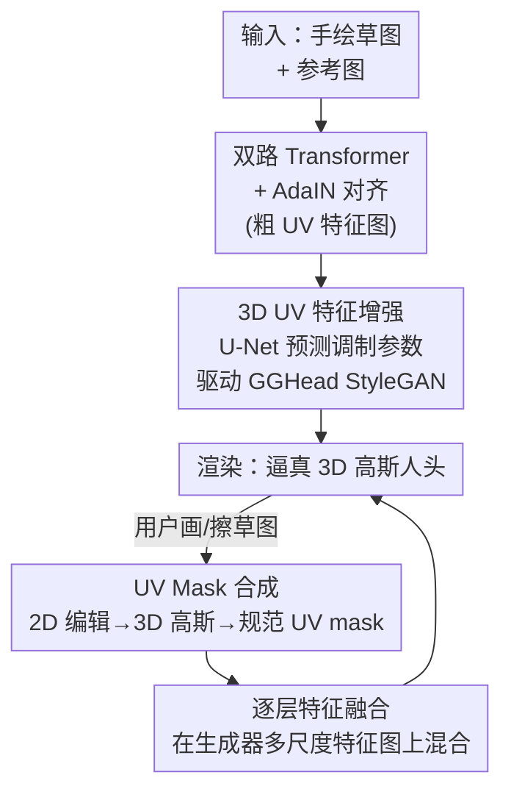

# SketchFaceGS: Real-Time Sketch-Driven Face Editing and Generation with Gaussian Splatting

**会议**: CVPR 2026  
**arXiv**: [2604.19202](https://arxiv.org/abs/2604.19202)  
**代码**: 无  
**领域**: 3D视觉  
**关键词**: 3D高斯splatting, 草图驱动, 人脸生成, 实时编辑, UV特征

## 一句话总结
SketchFaceGS 用一个前馈、coarse-to-fine 架构，把单张手绘草图（加可选参考图）一次性映射成可实时渲染的逼真 3D 高斯人脸，并用 UV Mask Fusion + 逐层特征融合实现自由视角、免优化的局部实时编辑，在生成保真度（FID 92.65）和编辑延迟（~0.3s / 243 FPS）上都超过 SketchFaceNeRF。

## 研究背景与动机
**领域现状**：3D 高斯 splatting（3DGS）已经成为数字人头建模的主流表示，能在实时渲染下做到照片级真实。在这之上，3D-GAN（如 EG3D）和把高斯绑定到模板网格的 GGHead 等方法已经能可控生成高质量 3D 头像。

**现有痛点**：直观、交互式地"创作 / 编辑"一个 3D 高斯人头依然很难。文本驱动编辑控制粒度太粗，做不了精细的局部修改；而最接近的草图驱动 3D 人脸方法 SketchFaceNeRF 用 tri-plane 预测，coarse tri-plane 导致细节（如复杂发丝）恢复不出来、画质不够真实，更要命的是它每次编辑都依赖**逐实例优化**（一次编辑要 ~10s），并且连续编辑会**误差累积**，根本没法做实时交互创作。

**核心矛盾**：2D 草图是最理想的快速概念设计交互方式，但它**稀疏、深度歧义、缺高频外观线索**——从几根线条要推出稠密、几何一致的 3D 高斯结构本身就是高度病态问题，尤其还要在实时约束下完成。优化式方法能补这个歧义但慢且会漂移；前馈式方法快但难保真。

**本文目标**：(1) 从单张草图前馈生成几何一致、照片级真实的 3D 高斯人头；(2) 支持实时、免优化、自由视角的局部编辑，且不破坏未编辑区域的身份。

**切入角度**：把"草图→3D"拆成 coarse-to-fine 两段——先用 Transformer 在 UV 空间建立**低频但几何一致**的骨架，再借一个**预训练 3D-GAN（GGHead）当高频纹理先验**去注入照片级细节；编辑则完全搬到生成器的**特征空间**里做融合，而不是在 3D 高斯空间硬拼。

**核心 idea**：用前馈 coarse-to-fine 架构把稀疏草图桥接到强大的 3D 生成先验，再用 UV-mask 引导的逐层特征融合实现免优化的精确局部编辑。

## 方法详解

### 整体框架
给定一张人像参考图和一张手绘草图，SketchFaceGS 分**生成**和**编辑**两条 pipeline。生成走 coarse-to-fine：粗阶段用两路并行 Transformer 分别从草图抽几何、从参考图抽外观，经 AdaIN 对齐融合成一张几何一致的粗 UV 特征图；细阶段用一个 U-Net 把粗 UV 图翻译成全局 latent + 多尺度空间调制参数，去驱动预训练 GGHead 的 StyleGAN 生成器，输出编码完整高斯属性的高保真 UV 图，再 splatting 渲染。编辑 pipeline 把用户在 2D 屏幕上的画/擦操作反投影定位到 3D 高斯，映射回规范 UV 空间得到精确 UV mask，然后在 StyleGAN 生成器的多尺度特征图上**逐层融合**编辑区与未编辑区，得到无缝、视角一致的修改结果。

整个框架的关键在于：它把"草图到稠密 3D"的病态映射，分解成了"先在 UV 空间搭几何骨架 → 再用生成先验补高频细节 → 编辑时在特征空间做局部融合"三件事，每一步都规避了直接在稀疏草图与稠密 3DGS 之间硬映射的歧义。

### 关键设计

**1. 双路并行 Transformer + AdaIN 对齐：在 UV 空间搭起几何-外观一致的粗骨架**

草图只给几何线索、参考图只给外观，二者结构若不一致，独立抽特征会"打架"。作者借鉴 LAM 的 3D-aware 查询机制，用一组对应规范头模板顶点的可学习 query，通过 cross-attention 跟草图/参考图的 DINOv2 深层特征交互：几何分支 $F_{\text{G}}, F_{\text{ID-G}} = \mathbf{T}_{\text{G}}((f_{\text{g}}, f_{\text{ID-g}}), F_{\text{sketch}})$，外观分支 $F_{\text{A}}, F_{\text{ID-A}} = \mathbf{T}_{\text{A}}((f_{\text{a}}, f_{\text{ID-a}}), F_{\text{ref}})$，同时产出 per-vertex 特征和全局身份向量。顶点特征经重心插值投到 UV 图上得到稠密 $F_{\text{UV-G}}, F_{\text{UV-A}}$。

关键的"防打架"在于一个 AdaIN 对齐网络 $G_c$：它把几何特征图归一化后，用外观特征图对应的标量分量做缩放和偏移，得到协调的 $F_{\text{UV-align}} = G_c(F_{\text{UV-G}}, F_{\text{UV-A}})$，再与几何图 concat 成粗阶段输出。这样当草图和参考图身份冲突时（消融里去掉它会产生严重 artifact），外观被"贴合"到几何骨架上而不是各说各话。这一步只负责低频结构和基础色，几何一致性靠它建立。

**2. 3D UV 特征增强：把预训练 GGHead 当高频纹理先验，用调制参数注入照片级细节**

粗 UV 图几何对了但过于平滑、缺真实纹理。作者不重新训一个生成器，而是把 2D 人脸修复里 GFP-GAN 的"生成式调制"思路搬到 3D UV 特征空间：设计一个 U-Net 吃粗 UV 特征图，预测一套给预训练 GGHead 生成器用的调制参数——一个全局特征向量 $F_{latent}$ 和一组多分辨率空间特征金字塔 $F_{spatial}$。全局向量再和粗阶段抽出的身份向量聚合，经 MLP 投到 StyleGAN 的 $\mathcal{W}^+$ 空间得到身份感知 latent：

$$\mathcal{W} = \mathrm{MLP}\bigl(\mathrm{concat}(F_{\text{latent}}, F_{\text{ID-G}}, F_{\text{ID-A}})\bigr)$$

然后通过"全局身份注入 + 局部细节调制"两个互补机制驱动 StyleGAN，合成细节丰富的最终 UV 图 $F_{output}$，它直接编码完整高斯属性集。妙处在于：GGHead 的 StyleGAN backbone 不再被当随机生成器，而是被复用成一个**可控解码器**，把预测的 UV 特征翻译成高保真 3D 头——既省去从头训生成先验，又借到了它的高频纹理能力。

**3. UV Mask 合成：把 2D 屏幕编辑精确定位回规范 UV 空间**

编辑要做到局部精确，难点是用户的笔画发生在 2D 像素空间，而特征定义在 UV 空间。作者先用草图差分 + 膨胀定位 2D 编辑区，得到像素 mask $\mathcal{M}$；再向编辑区投射射线反投影，找出贡献这些像素的 3D 高斯集合。沿用 GaussianEditor 的做法，每个高斯的影响权重按它在 masked 像素上的不透明度-透射率乘积累加：

$$w_i = \sum_{p \in \mathcal{M}} \alpha_i(p) \cdot T_i(p)$$

只保留当前视角下权重显著的高斯（过滤背面泄漏），再经 FLAME 坐标映射到规范 UV 空间生成精确二值 mask $\mathbf{M}_{\text{UV}}$，最后重采样到每个生成器层 $k$ 的分辨率得到 layer-specific 的 $\mathbf{M}_{\text{UV}}^{(k)}$。这套定位是后续特征融合能"只动该动的地方"的前提。

**4. 逐层特征融合：在 StyleGAN 特征空间混合，而非在 3D 高斯空间硬拼**

直接在 3D 空间拼接两组高斯会在编辑边界留下明显接缝（消融里 3D Gaussian Compositing 就是这毛病）。作者改为在生成器**每一层**的特征图上融合：记原始（未编辑）头在第 $k$ 层的中间特征图为 $\mathbf{f}_k^{\text{orig}}$、新（编辑后）头的为 $\mathbf{f}_k^{\text{new}}$，用 UV mask 选择性保留未编辑区：

$$\mathbf{f}_k^{\text{fused}} = (1 - \mathbf{M}_{\text{UV}}^{(k)}) \odot \mathbf{f}_k^{\text{orig}} + \mathbf{M}_{\text{UV}}^{(k)} \odot \mathbf{f}_k^{\text{new}}$$

融合后的张量作为下一层输入继续合成 $\mathbf{f}_{k+1}^{\text{new}} = \text{Layer}_k(\mathbf{f}_k^{\text{fused}}, \mathcal{W}_{\text{new}})$。迭代下去，未编辑区始终保持稳定特征、编辑区被逐步更新。这样做的好处是融合发生在"多个抽象层次"上，既天然抑制接缝、又保证未编辑区身份不漂移，而且整套是端到端前馈的，所以编辑能做到连续、自由视角、实时（~0.3s）——彻底避开了 SketchFaceNeRF 那种逐实例优化和误差累积。

### 损失函数 / 训练策略
模型分三阶段训练，各有目标：粗生成、细生成、编辑。优化时组合使用像素级 L1、perceptual、LPIPS、颜色一致性和对抗损失，以同时保证几何一致性、颜色可控性和照片级细节。粗阶段在 GGHead 合成的多视角数据集上训，细阶段在单视角 FFHQ 上训（具体损失权重和辅助 decoder 用法见补充材料）。

## 实验关键数据

测试集：生成集 100 张艺术家手绘草图；编辑集 100 个交互系统采集的编辑样例。所有 baseline 用官方代码重训/评测。

### 主实验

**草图到 3D 头生成**（FID / KID 越低越好）：

| 方法 | FID ↓ | KID (×100) ↓ |
|------|-------|--------------|
| S3D | 96.03 | 4.50 ± 1.0 |
| Nano-LAM | 133.72 | 7.61 ± 0.9 |
| SketchFaceNeRF | 94.94 | 4.53 ± 0.6 |
| **Ours** | **92.65** | **4.00 ± 0.4** |

**草图驱动 3D 头编辑**（画质 + 交互/渲染性能）：

| 方法 | FID ↓ | KID (×100) ↓ | 时间 (s) ↓ | FPS ↑ |
|------|-------|--------------|-----------|-------|
| MagicQuill | 46.48 | 0.78 ± 0.2 | ~6.0 | — |
| Nano-LAM | 74.26 | 3.01 ± 0.3 | ~15.0 | 281 |
| SketchFaceNeRF | 62.49 | 2.65 ± 0.3 | ~10.0 | 42 |
| **Ours** | **44.60** | **0.69 ± 0.2** | **~0.3** | 243 |

**未编辑区身份保持**（与 SketchFaceNeRF 比，越高越好）：

| 指标 | SF-NeRF (无优化) | SF-NeRF (优化) | Ours |
|------|------------------|----------------|------|
| PSNR ↑ | 22.30 | 27.78 | **31.12** |
| SSIM ↑ | 0.90 | 0.95 | **0.97** |

本文在生成和编辑两项画质指标上都是最优，编辑延迟从 SketchFaceNeRF 的 ~10s 压到 ~0.3s（约 30 倍提速），且即便对比它做完优化后的结果，身份保持仍更高（PSNR 31.12 vs 27.78）。

### 消融实验

**生成 pipeline**（FID / KID 越低越好）：

| 配置 | FID ↓ | KID (×100) ↓ | 说明 |
|------|-------|--------------|------|
| Full Model (Ours) | 92.65 | 4.00 ± 0.4 | 完整模型 |
| w/o Enhancement Module | 104.08 | 6.14 ± 1.3 | 去掉细阶段增强，几何在但过平滑无细节 |
| w/o Translation Network | 108.26 | 8.10 ± 0.7 | 去掉 AdaIN 对齐，草图/参考冲突时严重 artifact |
| Conv Appearance Encoder | 97.87 | 5.77 ± 0.5 | 外观 Transformer 换成 CNN，风格迁移变弱、颜色不匹配 |
| w/o Global ID Feature | 98.73 | 5.74 ± 0.6 | 去掉全局身份向量，身份属性退化 |

**编辑模块**（FID / KID 越低越好）：

| 配置 | FID ↓ | KID (×100) ↓ | 说明 |
|------|-------|--------------|------|
| Full Model (Ours) | 44.60 | 0.69 ± 0.2 | 逐层特征融合 |
| Re-Generation | 88.15 | 3.35 ± 0.7 | 从编辑草图整头重生成，丢未编辑上下文、身份不保 |
| 3D Gaussian Compositing | 68.42 | 1.89 ± 0.2 | 3D 空间直接换高斯，编辑边界有明显接缝 |

### 关键发现
- **AdaIN 对齐网络（Translation Network）贡献最大**：去掉它 FID 从 92.65 涨到 108.26、KID 几乎翻倍（4.00→8.10），印证了"几何-外观打架"是草图驱动生成的核心难点。
- **逐层特征融合远胜两种朴素编辑策略**：相比直接重生成（FID 88.15）和 3D 高斯直拼（FID 68.42），特征空间融合（FID 44.60）几乎减半，说明"在哪个空间做编辑融合"比"融不融合"更关键。
- **细阶段增强是高频细节的来源**：去掉它结果几何对但过度平滑（FID 104.08），证明照片级真实感主要来自借用 GGHead 的纹理先验，而非粗阶段本身。

## 亮点与洞察
- **把预训练 3D-GAN 复用为"可控解码器"而非随机生成器**：通过 U-Net 预测调制参数去 condition 一个冻结的 GGHead StyleGAN，既白嫖了它的高频纹理先验、又把控制权交给草图，省去从头训生成模型——这个"用调制参数劫持预训练生成器"的范式可迁移到任何有强生成先验的条件生成任务。
- **编辑搬到特征空间是全文最"啊哈"的一招**：大多数 3DGS 编辑方法在 3D 高斯空间拼接，必然有接缝；本文洞察到"在 StyleGAN 多尺度特征图上逐层用 mask 混合"能让融合发生在多个抽象层次，天然无缝且端到端可前馈，顺带把延迟从 10s 砍到 0.3s。
- **UV 空间作为草图与 3DGS 的桥梁**：草图稀疏、3D 高斯稠密，直接映射病态；先在统一的规范 UV 特征空间里建几何、再融合、再编辑，把所有操作都规约到同一张可参数化的 UV 图上，是这套 pipeline 能既快又稳的底层原因。

## 局限与展望
- **几何-外观差异仍会引起轻微身份漂移**：作者承认当草图与参考图几何冲突大时，尽管颜色保持得好，身份仍会有轻微偏移，未来想用身份一致性损失或更强 encoder 缓解。
- **强依赖 GGHead 先验**：罕见配饰、极端遮挡、OOD 输入处理不好，受限于先验能力，需扩数据或加专门的配饰模块。
- **目前只支持静态头编辑**：尚不能做面部动画，作者计划把 UV-masked 融合的运动控制能力接到可驱动的 3DGS-GAN backbone 上。
- （自己观察）评测集规模偏小（生成/编辑各 100 例），且 FID/KID 在小样本下方差不小；与 baseline 用了不同生成先验（GGHead vs EG3D），虽同在 FFHQ 预训练但严格可比性仍存 caveat。

## 相关工作与启发
- **vs SketchFaceNeRF**：都做草图驱动 3D 人脸编辑且都用 mask fusion，但 SketchFaceNeRF 用 tri-plane + EG3D，coarse tri-plane 丢细节、编辑靠逐实例优化（~10s）且连续编辑误差累积；本文用 UV 特征 + GGHead 高斯先验 + 前馈架构，免优化、~0.3s、UV Mask Fusion 抑制误差累积，画质和身份保持都更好。
- **vs S3D**：S3D 先把草图转语义 mask 再用 pix2pix3d 类网络生成，sketch→mask 映射丢失细粒度纹理；本文直接在 UV 流形上合成高斯属性，几何和细节都更忠实于草图。
- **vs Nano-LAM（Nano-Banana 2D 生成 + LAM 单视角抬升）**：两阶段 2D→3D 在大旋转下几何畸变、多视角不一致，且 Nano-Banana 单次 >10s 不可交互；本文端到端前馈天然多视角一致且实时。
- **vs MagicQuill（2D ControlNet 编辑）**：只能在原渲染视角编辑、易引入风格化和身份漂移；本文是真 3D、自由视角、身份保持更好。
- **vs LAM / GGHead（前馈 3D 头重建/生成先验）**：本文受 LAM 高效前馈架构启发用 Transformer 抽特征、复用 GGHead 当生成先验，把它们从"重建/随机生成"扩展到"草图条件生成 + 可编辑"。

## 评分
- 新颖性: ⭐⭐⭐⭐ 首个免优化、前馈的草图驱动实时 3D 高斯人脸生成+编辑框架，"特征空间逐层融合做编辑"和"调制参数劫持 GGHead"两招很巧。
- 实验充分度: ⭐⭐⭐⭐ 生成/编辑双任务对比 + 两组消融 + 身份保持专项，但测试集各仅 100 例、与 baseline 生成先验不完全同源。
- 写作质量: ⭐⭐⭐⭐ coarse-to-fine 与编辑两条线讲得清晰，公式完整；部分训练细节甩到补充材料。
- 价值: ⭐⭐⭐⭐ 把交互式 3D 人脸创作的延迟从 10s 级压到亚秒级，对数字人/avatar 创作工具有直接实用价值。

<!-- RELATED:START -->

## 相关论文

- [\[CVPR 2026\] GHPT: Real-Time Relightable Gaussian Splatting using Hybrid Path Tracing](ghpt_real-time_relightable_gaussian_splatting_using_hybrid_path_tracing.md)
- [\[CVPR 2026\] Seele: A Unified Acceleration Framework for Real-Time Gaussian Splatting on Mobile Devices](seele_a_unified_acceleration_framework_for_real-time_gaussian_splatting_on_mobil.md)
- [\[CVPR 2026\] HyperGaussians: High-Dimensional Gaussian Splatting for High-Fidelity Animatable Face Avatars](hypergaussians_high-dimensional_gaussian_splatting_for_high-fidelity_animatable_.md)
- [\[ICCV 2025\] MeshPad: Interactive Sketch-Conditioned Artist-Reminiscent Mesh Generation and Editing](../../ICCV2025/3d_vision/meshpad_interactive_sketch-conditioned_artist-reminiscent_mesh_generation_and_ed.md)
- [\[CVPR 2026\] KV-Tracker: Real-Time Pose Tracking with Transformers](kv-tracker_real-time_pose_tracking_with_transformers.md)

<!-- RELATED:END -->
