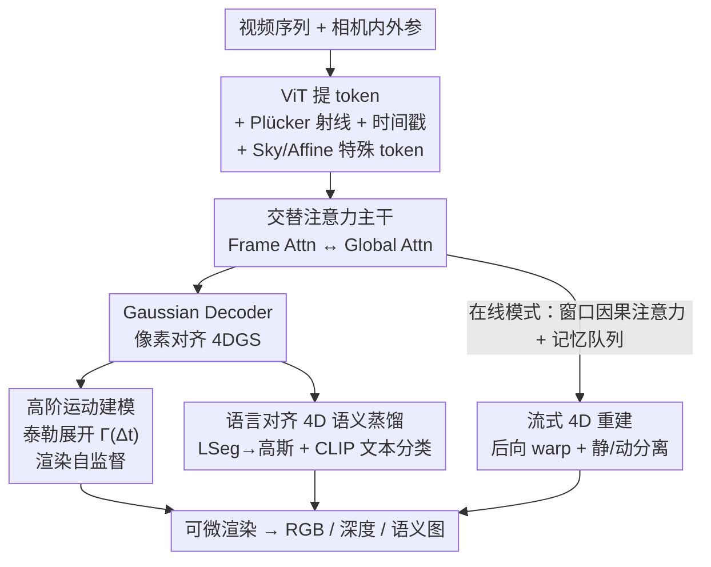

# SLARM: Streaming and Language-Aligned Reconstruction Model for Dynamic Scenes

**会议**: CVPR 2026  
**论文**: [CVF Open Access](https://openaccess.thecvf.com/content/CVPR2026/html/Qiu_SLARM_Streaming_and_Language-Aligned_Reconstruction_Model_for_Dynamic_Scenes_CVPR_2026_paper.html)  
**代码**: 无  
**领域**: 3D视觉  
**关键词**: 动态场景重建, 4D高斯, 前馈重建, 语言对齐语义, 流式推理

## 一句话总结
SLARM 是一个前馈 Transformer，在单次前向里同时输出动态场景的 4D 高斯几何、3D 场景流和语言对齐语义——靠高阶运动函数无监督地学复杂非匀速运动、靠蒸馏 LSeg 拿到可被文本查询的语义、靠窗口因果注意力做恒定延迟的流式推理，在 Waymo 上把运动精度提升 21%、PSNR 提升 1.6 dB、分割 mIoU 提升 20%。

## 研究背景与动机

**领域现状**：从 NeRF 到 3DGS，静态场景重建已经很成熟；近年 DUST3R / VGGT / MapAnything 等前馈模型把"逐场景优化"换成了"数据驱动一次前向出结果"的范式，做成了通用 3D 基础模型。但这些前馈模型几乎都只管静态场景，**前馈式的动态场景重建仍是空白**。

**现有痛点**：最接近的工作 STORM 能从多时刻有位姿的图像里重建动态 3D，但有三个硬伤——（1）**运动建模过于简化**：它假设物体匀速运动，根本拟合不了人走路这类非线性、非刚性的复杂动态；（2）**功能单一**：只重建几何，没有高层语义理解，下游感知/推理用不上；（3）**推理低效**：必须把多帧打包成 batch、靠跨时刻插值，做不了增量式的流式推理。

**核心矛盾**：动态重建里"运动表达能力""语义理解""实时流式"这三件事通常被分开做、互相掣肘——把运动建得复杂就难以前馈、加了语义就更重、要流式又得放弃未来帧带来的信息。

**本文目标**：用一个统一的前馈框架，同时拿下动态重建、语义理解、流式推理这三件事，并让它们互相增益。

**切入角度**：作者观察到运动可以写成"时间的可微函数"，于是用泰勒展开把位移建成多阶导数的叠加；又发现语义一致性本身能当运动的正则项——同一物体的语义不该乱跳，从而几何和语义可以互相校准。

**核心 idea**：用**高阶运动函数 + 渲染自监督**替代"匀速假设 + 流监督"，同时把 2D 基础模型 LSeg 的语言对齐语义蒸馏进随时间形变的 4D 高斯，并用窗口因果注意力把整套东西做成恒定延迟的流式推理。

## 方法详解

### 整体框架
SLARM 的输入是一段已知内外参的视频 $\{I_t\}_{t=1}^{T}$，输出是每一时刻一套显式的 4D 高斯（4DGS）——既重建当前几何外观，又给每个高斯编码 3D 场景流，还挂一个语言对齐的语义特征用于文本查询。整体流程是：先用**共享权重的 ViT** 把每帧切 patch 提 token，给每个 token 注入两类先验——把像素视线编码成 6D Plücker 坐标线性投影后加进去（几何先验）、再加上绝对时间戳的可学习嵌入（时间先验）；并仿照 STORM 拼两个特殊 token，Sky token 建模天空背景、Affine token 补偿多相机的曝光/白平衡差异。增强后的 token 序列送进**交替注意力 Transformer 主干**，逐帧注意力（Frame Attention）和全局注意力（Global Attention）交替堆叠，捕捉时空结构。最后由多个并行 decoder 出参数：Gaussian Decoder 回归像素对齐的 4DGS（位置 $\mu$、旋转 $q$、尺度 $s$、不透明度 $\alpha$、颜色 $c$，位置按 $\mu = o + d\cdot r$ 由预测深度 $d$ 和相机射线算出），另外两个辅助头分别出场景流（动态属性）和语义特征。

### 关键设计

**1. 高阶运动建模：用泰勒展开把"匀速假设"换成可微的高阶运动函数**

STORM 用瞬时速度做运动表达，但匀速假设拟合不了人走路的肢体这类非匀速运动。SLARM 把位移建成时间的可微函数——多阶泰勒展开。对每一阶 $l\in\{0,\dots,L-1\}$，网络预测一个标量速度 $s_l$ 和一个 3D 方向向量 $v_l$，方向归一化后得到运动系数 $m_l = s_l\cdot \frac{v_l}{\|v_l\|_2}$；给定时间偏移 $\Delta t$，总位移按泰勒级数聚合所有阶的贡献：

$$\Gamma(\Delta t) = \sum_{l=0}^{L-1} m_l\cdot \frac{(\Delta t)^{l+1}}{(l+1)!}.$$

论文取 $L=3$（3 阶展开），正好显式建模位置的前三阶导数——速度、加速度、jerk（急动度），用紧凑的表示拿下复杂真实动态。关键是这套运动是**纯渲染自监督**学出来的，不需要任何真值场景流：给定 $t$ 帧和监督帧 $t+\Delta t$，只让高斯位置按 $\Gamma(\Delta t)$ 演化、其余属性（不透明度/旋转/尺度/颜色）冻住，warp 后渲染出 $\hat{I}_{t+\Delta t}$，用像素 MSE + 感知 LPIPS 与真值监督帧对齐（$\lambda_{lpips}=0.05$）。这样把"预测每个时刻的精确位置"这个难题，转成了"预测一条平滑的运动曲线再被渲染拉对"，预测精度和几何保真度都更高。

**2. 语言对齐 4D 语义蒸馏：把 LSeg 的语义灌进会动的高斯，让语义和几何互相校准**

STORM 只有几何、没有语义，下游推理用不上。SLARM 给每个高斯额外挂一个高维语义特征 $f^{sem}_j\in\mathbb{R}^d$，但与 Uni3R 的静态做法不同，这些高斯会随高阶运动函数 $\Gamma$ 一起形变——渲染时对**时间 warp 后**的高斯做 alpha-blending，同时合成 RGB 图和语义特征图 $\hat{F}_{t+\Delta t}$。监督来自冻结的 2D 基础模型 LSeg：用 MSE 把渲染语义图对齐 LSeg 提的 2D 特征 $\tilde{F}_{t+\Delta t}$，即 $L_{sem}=\|\tilde{F}_{t+\Delta t}-\hat{F}'_{t+\Delta t}\|_2^2$（解码用轻量 MLP 降维省显存）。对**有标注的数据**还能再上一层监督：把解码出的每个特征 $f_{ij}$ 和各类别的 CLIP 文本特征 $t_k$ 做内积、softmax 成类别概率，退化成分类任务用交叉熵 $L_{cls}$（温度 $\tau=0.07$）。这样既能用自然语言查询动态场景、又能直接接 LLM 做高层推理；更妙的是语义一致性反过来当了运动的正则——同一物体语义不该乱跳，于是几何和语义互相增益，分割反而比纯 2D baseline 还准。

**3. 流式 4D 重建：窗口因果注意力 + 后向 warp，做恒定延迟、不涨内存的在线推理**

离线动态重建会同时用过去和未来帧做插值，但实时部署只能拿到当前和过去的观测。SLARM 严守因果性：流式模型 $\phi$ 只根据当前及历史帧输出当前的高斯 $G_t$ 和位移场 $\Gamma_t$，即 $(G_t,\Gamma_t)=\phi(I_t\mid I_{t-\Delta t},I_{t-2\Delta t},\dots)$（时间步长通常 $\Delta t=5$）。由于没有未来帧，动态高斯只能**后向**传播到最近历史帧 $t-\Delta t$；为了不在新时刻渲染出空洞，模型按运动幅度把高斯切成静态/动态两类——$\|\Gamma_g(\Delta t)\|\le\tau_m$ 的归静态、超过阈值 $\tau_m$ 的归动态，区间 $[t-\Delta t,t]$ 的场景由"两端静态几何 + 后向动态部分"拼成。架构上每帧独立处理、配合**窗口注意力**和一个记忆队列（缓存/弹出 token），让推理时间随序列线性增长、内存恒定，避免了 batch 打包或滑窗那种内存累积，适合自动驾驶/具身这类长程低延迟场景。

### 损失函数 / 训练策略
总损失为 $L_{total}=L_{rgb}+L_{depth}+\lambda_{sky}L_{sky}+\lambda_{reg}L_{reg}+\lambda_{feat}L_{feat}$。其中深度一致性损失 $L_{depth}$ 在有真值深度的有效像素上做 L1；天空正则 $L_{sky}$ 惩罚天空区域的不透明度（天空 mask 由 DepthAnythingV2 取零深度像素得到），鼓励天空透明；运动正则 $L_{reg}=\sum_{l=0}^{3}\|m_l\|_2^2$ 抑制高阶系数，基于"大多数场景偏静态"的先验。特征对齐 $L_{feat}=L_{sem}\vee L_{cls}$：先用 $L_{sem}$ 训 200k 步，再用 $L_{cls}$ 续训 3k 步。权重 $\lambda_{sky}=0.1$、$\lambda_{reg}=0.005$、$\lambda_{feat}=1.0$。训练在 64 张华为昇腾 910B NPU 上跑 4 天、batch 64、AdamW、200k 迭代。

## 实验关键数据

数据集为 Waymo Open Dataset（WOD），1000 段约 20 秒、10fps 的驾驶序列（798 训练 / 202 验证），输入下采样到 160×240，LSeg 特征用 320×480。

### 主实验

动态重建（Table 1，对比可泛化前馈方法；SLARM-F 为离线全注意力，SLARM-W 为在线窗口注意力）：

| 方法 | 动态区 PSNR↑ | 动态区 SSIM↑ | 动态区 D-RMSE↓ | 全图 PSNR↑ | 全图 SSIM↑ | 全图 D-RMSE↓ |
|------|------|------|------|------|------|------|
| GS-LRM* | 20.02 | 0.520 | 9.95 | 25.18 | 0.753 | 7.94 |
| STORM* | 22.03 | 0.623 | 7.50 | 25.86 | 0.804 | 5.47 |
| SLARM-W | 23.20 | 0.676 | 6.38 | 27.30 | 0.825 | 4.75 |
| **SLARM-F** | **23.51** | **0.691** | **6.16** | **27.49** | **0.828** | **4.57** |

场景流估计（Table 3，全序列评测含输入帧+插值目标帧）：

| 方法 | EPE(m)↓ | Acc5(%)↑ | Acc10(%)↑ | θ(rad)↓ |
|------|------|------|------|------|
| STORM | 0.304 | 79.01 | 83.74 | 0.667 |
| SLARM-F | **0.240** | 78.15 | 83.08 | **0.540** |
| SLARM-W | 0.337 | **81.07** | **84.26** | 0.725 |

语义分割（Table 2，所有方法在 160×240 同分辨率评测）：

| 方法 | mIoU↑ | Acc↑ |
|------|------|------|
| LSeg | 0.4876 | 0.7976 |
| Mask2Former-Swin | 0.5505 | 0.8192 |
| **SLARM** | **0.6663** | **0.8923** |

SLARM 在三类任务上全面 SOTA：全图 PSNR 比 STORM 高 1.6 dB，EPE 从 0.304 降到 0.240（≈21% 提升），分割 mIoU 比最强 2D baseline（Mask2Former-Swin 0.5505）高近 0.12（≈20%），且比直接用的 LSeg（0.4876）高得多——说明 3D 几何先验确实增强了语义表达。

### 消融实验

| 配置 | 效果（Flow EPE / 重建语义） | 说明 |
|------|------|------|
| Base（无语义） | 较高 EPE | 仅几何，运动无语义约束 |
| w/ $L_{sem}$ | EPE 下降 | 语义蒸馏当运动正则，轨迹更平滑合理 |
| w/ $L_{sem}+L_{cls}$ | EPE 进一步下降 | 标注数据的分类监督再加强 |
| 运动阶数 $L=3$ | 最优 | 短时间窗内 jerk 级足够，更高阶收益递减 |
| 在线窗口注意力 SLARM-W | 线性推理时间 + 恒定内存 | 长序列流式部署友好 |

### 关键发现
- **语义反哺运动**：把语义一致性当时间正则后 Flow EPE 持续下降，且 PSNR、语义指标同步改善——几何和语义不是简单叠加而是互相增益。
- **3 阶刚刚好**：短时间窗里真实运动用 jerk 级（3 阶导）就拟合得很好，再加高阶收益递减，验证了用紧凑泰勒展开的合理性。
- **窗口注意力换实时**：SLARM-W 比全注意力 SLARM-F 在重建/流上略掉点，但换来线性时间与恒定内存，是为流式部署做的明确取舍。

## 亮点与洞察
- **把运动当"时间的可微函数"**：泰勒展开直接给出速度/加速度/jerk 的物理可解释分解，又天然可微、能被渲染监督，比"逐帧预测位置"或"匀速假设"都更聪明，是可迁移到其他动态建模任务的核心 trick。
- **语义当几何的免费正则**：语义一致性不该乱跳这个朴素先验，被用成了运动的监督信号，让"加语义"从负担变成增益——这是最让人"啊哈"的设计。
- **统一前馈出三件套**：几何 + 流 + 语义在一次前向里联合优化，互相增强，省去了多模型拼接。

## 局限与展望
- 主实验只在 Waymo 驾驶场景验证，室内/通用动态场景的泛化未充分展示。
- 流式模式靠"后向 warp 到最近历史帧 + 静动阈值分离"，运动阈值 $\tau_m$ 和步长 $\Delta t$ 的敏感性、以及快速进入视野的新动态物体如何处理，正文交代有限。⚠️ 部分阈值/记忆队列细节以原文及补充材料为准。
- 依赖 LSeg/CLIP 的开放词表能力，语义上限受这些 2D 基础模型约束；类别外或罕见安全相关物体的可靠性待考。
- 训练成本高（64 张 910B、4 天、200k 迭代），复现门槛较高。

## 相关工作与启发
- **vs STORM**：STORM 假设匀速、只做几何、需批处理插值；SLARM 用高阶运动函数建非匀速运动、加语言对齐语义、做流式因果推理，三个维度全面超越。
- **vs Uni3R**：Uni3R 统一了静态 3D 重建与语言对齐语义但没有时间建模；SLARM 把语义蒸馏扩到随时间形变的 4D 高斯，实现可查询的动态语义。
- **vs StreamVGGT / Stream3R**：这些流式方法只重建逐帧 3D 几何；SLARM 在流式约束下联合建模瞬时几何及其连续时间形变，是 4D 而非逐帧 3D。

## 评分
- 新颖性: ⭐⭐⭐⭐⭐ 首个把动态重建、语言对齐语义、流式推理三者统一进单次前馈的 4D 高斯框架。
- 实验充分度: ⭐⭐⭐⭐ Waymo 上重建/流/分割三任务全面对比 + 消融到位，但仅单数据集、缺室内/通用场景。
- 写作质量: ⭐⭐⭐⭐ 结构清晰、公式完整、图示直观。
- 价值: ⭐⭐⭐⭐⭐ 自动驾驶/具身的实时动态感知有直接落地价值，运动建模与语义反哺思路可迁移。

<!-- RELATED:START -->

## 相关论文

- [\[CVPR 2026\] Point4Cast: Streaming Dynamic Scene Reconstruction and Forecasting](point4cast_streaming_dynamic_scene_reconstruction_and_forecasting.md)
- [\[CVPR 2026\] LangField4D: Learning Identity-Adaptive and Spatio-Temporal Continuous 4D Language Fields for Dynamic Scenes](langfield4d_learning_identity-adaptive_and_spatio-temporal_continuous_4d_languag.md)
- [\[CVPR 2026\] FastEventDGS: Deformable Gaussian Splatting for Fast Dynamic Scenes from a Single Event Camera](fasteventdgs_deformable_gaussian_splatting_for_fast_dynamic_scenes_from_a_single.md)
- [\[CVPR 2026\] Zero-Shot Depth Completion with Vision-Language Model](zero-shot_depth_completion_with_vision-language_model.md)
- [\[CVPR 2026\] Dynamic-Static Decomposition for Novel View Synthesis of Dynamic Scenes with Spiking Neurons](dynamic-static_decomposition_for_novel_view_synthesis_of_dynamic_scenes_with_spi.md)

<!-- RELATED:END -->
