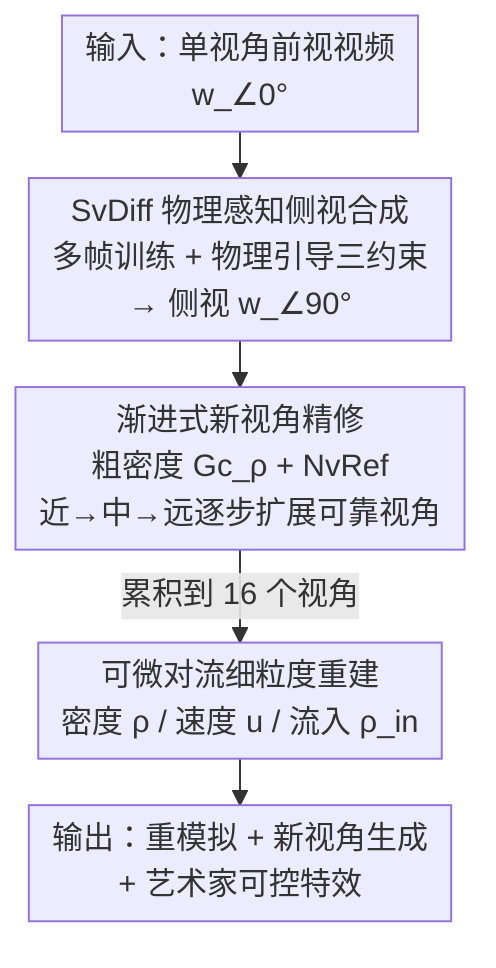

# SmokeSVD: Smoke Reconstruction from A Single View via Progressive Novel View Synthesis and Refinement with Diffusion Models

**会议**: CVPR 2026  
**论文**: [CVF Open Access](https://openaccess.thecvf.com/content/CVPR2026/html/Li_SmokeSVD_Smoke_Reconstruction_from_A_Single_View_via_Progressive_Novel_CVPR_2026_paper.html)  
**代码**: 待确认  
**领域**: 3D视觉  
**关键词**: 烟雾重建, 单视角, 扩散模型, 新视角合成, 流体物理约束

## 一句话总结
用扩散模型从**单视角**视频里逐帧合成侧视图、再"粗密度 → 渐进精修 → 细密度"地循环重建，把单视角烟雾重建做成既高质量又比可微渲染快两个数量级（15 分钟 vs >30 小时）的框架。

## 研究背景与动机

**领域现状**：从 RGB 视频重建动态烟雾（密度场 + 速度场）在图形学、大气物理、医学等领域都有需求。主流做法要么依赖多相机阵列 + 可微渲染/神经辐射场（PINF、HyFluid、PICT），要么针对单视角用严格的可微物理先验（GlobTrans、Franz et al.）。

**现有痛点**：多视角采集在非实验室环境里不现实；而单视角重建是严重欠定问题——一个视角根本看不到烟雾在深度方向的分布。可微渲染类方法（如 GlobTrans）虽然能出好结果，但优化一次要 **30 小时以上**，完全不实用；神经辐射场从稀疏视角重建则在深度方向糊成一团。

**核心矛盾**：单视角输入的**信息缺失**与**重建质量/效率**之间的死结。近期工作（FluidNexus）想用多视角扩散模型一次性生成多视角视频再重建，但扩散模型生成的多视角图像**互相不一致**（shape-appearance ambiguity），且**缺乏物理先验**来约束烟雾这种复杂半透明流体的动力学。

**本文目标**：在单视角输入下，既缓解欠定性（补出可信的其它视角），又保证多视角一致性和物理合理性，同时把计算成本压到分钟级。

**切入角度**：与其"先一口气生成所有视角再重建"，不如把 2D 扩散合成、时空精修、3D 重建**循环交替**起来——用粗 3D 密度场反过来约束 2D 扩散，再用精修后的 2D 图像反过来提升 3D 重建，逐步从近到远扩展可靠视角。

**核心 idea**：物理引导的扩散侧视合成器 + 渐进式新视角精修，把单视角的"补全"拆成多阶段闭环，让 2D 生成质量与 3D 体一致性互相喂养。

## 方法详解

### 整体框架
输入是 $T$ 帧的单视角前视视频，记作前视序列 $w^t_{\angle 0^\circ}$（$\alpha=\angle 0^\circ$ 表示相对前视的偏角）。SmokeSVD 先用扩散模型 **SvDiff** 逐帧合成 $\angle 90^\circ$ 侧视序列，把"只有一个视角"硬生生补成"前 + 侧两个正交视角"；再用 UNet3+ 改造的密度生成器 $G_\rho$ 估计一个粗糙 3D 密度场，随后沿水平面**逐步旋转相机**渲染并精修更多新视角（45°、135°……），最后用 16 个视角联合重建细粒度密度、速度和流入状态，支持重模拟与艺术家可控的下游应用。

整个流程是一个"2D 扩散合成 ↔ 3D 重建"循环交替、可靠视角从近到远逐渐扩张的多阶段管线：

### 关键设计

**1. SvDiff 物理感知侧视合成器：把单视角的欠定性先用扩散补成两个正交视角**

单视角重建最缺的就是"侧面看是什么样"。SvDiff 把图像扩散模型扩展成逐帧处理：以**前两帧侧视 + 当前帧前视**为条件 $c^t = w^t_{\angle 0^\circ} \oplus w^{t-1}_{\angle 90^\circ} \oplus w^{t-2}_{\angle 90^\circ}$（$\oplus$ 为通道拼接）训练，优化噪声损失 $\mathcal{L}_{noise} = \|\epsilon - \epsilon_\theta(w^t_{\angle 90^\circ}, c^t, s)\|^2$。但推理时只能拿"自己之前合成的帧"当条件，误差会随时间累积，于是作者引入**多帧训练方案**：在一个 batch 内做多次前向扩散，每次从噪声里反推出干净图像 $w_{c,\angle 90^\circ} = (w_{s,\angle 90^\circ} - \sqrt{1-\bar\alpha_s}\,\epsilon_\theta)/\sqrt{\bar\alpha_s}$，再把它当成下一次前向的条件，逼模型在训练时就见过"用生成图当输入"的分布，从而抑制长时漂移。

更关键的是物理引导：当扩散步 $s < T_Q$（噪声足够小、能提取相邻帧物理信息）时启用三项约束——**视觉约束** $\mathcal{L}_{img}=\|x_0^i - \hat{x}_0^i\|^2$ 保像素保真；**速度约束** $\mathcal{L}_{vel} = \|\nabla\cdot \mathbf{u}^{i-1}\|^2 + \|\nabla \mathbf{u}^{i-1}\|^2$ 用先重建出的粗密度反推速度场，第一项压不可压缩性散度、第二项压速度突变防闪烁；**空间约束** $\mathcal{L}_{sp} = \|H(w_{c,\angle 90^\circ}) - H(w_{\angle 0^\circ})\|^2$，其中 $H(\cdot)$ 是把 $H\times W$ 图像沿宽度方向逐行求和压成 $H\times 1$ 向量，逼侧视与前视在空间分布上一致。总损失 $\mathcal{L}_{SvDiff} = \lambda_{noise}\mathcal{L}_{noise} + \lambda_{img}\mathcal{L}_{img} + \lambda_{sp}\mathcal{L}_{sp} + \lambda_{vel}\mathcal{L}_{vel}$。这一步把"扩散生成"从纯视觉拉回到物理可信，是后续重建质量的地基。

**2. 渐进式新视角精修：用粗 3D 密度反约束 2D 精修，可靠视角从近到远扩张**

有了前 + 侧两个视角，先用密度生成器 $G_\rho$（UNet3+ 把 2D 卷积扩成 3D 卷积）估一个粗 3D 密度 $\rho^t_{r,c} = G_\rho(I^t)$，$I^t$ 是若干视角图像的拼接。但视角太少时粗密度在新视角下依旧模糊。于是引入精修模块 **NvRef**：对目标角度 $\alpha$，喂入它左右相邻渲染图 $w^t_{r,\angle\alpha\pm\beta}$、当前渲染图 $w^t_{r,\angle\alpha}$ 以及前两帧精修结果的下采样 $\downarrow w^{t-1}_{f,\angle\alpha}, \downarrow w^{t-2}_{f,\angle\alpha}$，预测残差 $res^t_\alpha$ 并叠加得到精修图 $w^t_{f,\angle\alpha} = res^t_\alpha + w^t_{r,\angle\alpha}$。借助粗密度提供的 3D 空间分布约束 + UNet3+ 的时空相关性，NvRef 能产出多视角一致的图像。

整个过程是**循环交替**的：把 16 个视角按到前/侧视的相对位置分成 clear / near / mid / far 四类，依次"用上一阶段密度渲染 near→mid→far 的图 → NvRef 精修 → 把精修图 + 剩余模糊图重新喂回去重建下一阶段密度"。可靠视角集合就这样从近到远逐步扩张，每一步都在更可信的多视角基础上重建。这正是它比"一次生成全部多视角"更稳的原因——不会被某个不一致的远视角一次性污染整个重建。

**3. 可微对流的细粒度密度/速度/流入联合估计：用 Navier-Stokes 把多视角拉成长时一致**

当输入视角累积到 16 个时，$G_\rho$ 升级为细粒度密度生成器 $G^f_\rho$ 重建高质量密度 $\rho_{r,f}$，并通过可微对流算子 $\mathcal{A}$（基于 Navier-Stokes 方程）联合估计速度场 $\mathbf{u}$ 与流入状态 $\rho_{in}$，保证重建满足长期物理约束。密度生成器的损失 $\mathcal{L}_{G_\rho}$ 除了直接的密度 L2 项，还分别对**输入视角集合** $\mathbb{A}$ 内、外的渲染图加约束：$\lambda_{in}\sum_{\alpha\in\mathbb{A}}\|\mathcal{R}(\rho^t_r,\alpha)-\mathcal{R}(\rho^t,\alpha)\|^2 + \lambda_{un}\sum_{\alpha\notin\mathbb{A}}\|\mathcal{R}(\rho^t_r,\alpha)-\mathcal{R}(\rho^t,\alpha)\|^2$，其中 $\mathcal{R}(\rho,\alpha)$ 是把密度场在角度 $\alpha$ 下渲染的可微算子。这一步把"逐帧重建出来的密度序列"用物理对流串成时间连贯的整体，从而支持重模拟（re-simulation）——改流入、换初值就能生成新的视觉特效。

### 损失函数 / 训练策略
SvDiff 用 $\mathcal{L}_{SvDiff}$（噪声 + 视觉 + 空间 + 速度四项）训练；NvRef 用 $\mathcal{L}_{NvRef}$（L2 + L1 + 残差均值 + 空间约束 + PSNR 差异五项）训练；密度生成器 $G_\rho$ 用密度 + 输入视角渲染 + 未知视角渲染三项。值得注意：在真实数据 ScalarFlow 上没有可用 3D 真值，作者把 $\lambda_\rho$ 置零、改用前作重建结果当 $\rho$ 来做渲染监督，规避了"真实烟雾没有 3D 标注"的难题。

## 实验关键数据

### 主实验
评测在真实数据 **ScalarFlow**（五相机沿 120° 弧均匀分布拍真实烟雾）和合成数据集（用可微渲染算子生成、带精确 3D 物理场）上进行。由于真实 3D 数据无法直接做定量对比，评测主要基于图像指标：RMSE↓、SSIM↑、PSNR↑、LPIPS↓（感知相似度，越低越好），以及侧视 STYLE↓（风格相似度）。

ScalarFlow 输入视角重建对比（单视角输入）：

| 方法 | 输入 RMSE↓ | 输入 SSIM↑ | 输入 PSNR↑ | 输入 LPIPS↓ | 120 步耗时 |
|------|-----------|-----------|-----------|------------|-----------|
| GlobTrans | 0.0101 | 0.9975 | 40.16 | 0.0054 | >30h |
| NGT | 0.0289 | 0.9539 | 31.07 | 0.0655 | 5min |
| PICT | 0.0315 | 0.9252 | 30.54 | 0.1332 | / |
| PINF | 0.0872 | 0.8715 | 21.30 | 0.1020 | / |
| **SmokeSVD** | **0.0127** | **0.9868** | **38.08** | **0.0223** | **15min** |

GlobTrans 在输入视角上指标最好，但代价是 >30 小时的优化；SmokeSVD 在 15 分钟内拿到第二好的感知质量，把"质量 vs 效率"的权衡点大幅前移。论文也坦言：MSE 类指标无法全面衡量新视角质量——PICT/PINF 在侧视外观明显不合理却能拿到和本方法相近的 MSE。

与 FluidNexus、NeuSmoke 的对比中，SmokeSVD 在**输入视角全指标显著领先**；新视角上略逊于 FluidNexus（其多视角扩散天生保证跨视角一致性），但 SmokeSVD 不依赖后处理阈值选择、对超参不敏感、鲁棒性更好。合成数据集上更是大幅领先 NGT/PICT/PINF（PSNR 28.13 vs 次优 16.30）。

### 消融实验

SvDiff 侧视合成消融（ScalarFlow，侧视指标）：

| 配置 | 输入 PSNR↑ | 侧视 RMSE↓ | 侧视 STYLE↓ | 说明 |
|------|-----------|-----------|------------|------|
| w/o threshold | 41.84 | 0.0990 | 0.2139 | 去掉噪声阈值 $T_Q$ |
| w/o vel | 41.68 | 0.1032 | 0.2074 | 去掉速度约束 |
| w/o grad | 42.08 | 0.1025 | 0.2025 | 去掉梯度（平滑）项 |
| w/o divergence | 40.90 | 0.1816 | 0.4831 | 去掉散度项，侧视质量崩坏 |
| w/o reconstruction | 41.48 | 0.1025 | 0.3118 | 去掉 3D 重建引导 |
| **完整 SvDiff** | **44.55** | **0.0899** | **0.1892** | — |

NvRef 新视角精修消融（0/3 视角为输入，其余视角评测）：

| 配置 | SSIM↑ | PSNR↑ | 说明 |
|------|-------|-------|------|
| w/o Refinement | 0.7454 | 18.75 | 完全去掉精修 |
| w/o Progressive | 0.7559 | 18.79 | 单趟精修替代渐进式 |
| w/o Res Loss | 0.7126 | 18.51 | 去掉残差损失 |
| **完整 NvRef** | 0.7559 | **18.80** | — |

### 关键发现
- **散度项（不可压缩约束）最关键**：去掉后侧视 RMSE 从 0.0899 暴涨到 0.1816、STYLE 翻倍到 0.4831，说明物理先验里"压散度"对烟雾形状合理性贡献最大。
- **渐进式精修 vs 单趟精修**：渐进策略在感知细节和外观一致性上更优；可视化显示"先 near 后 far"能逐步把模糊的远视角拉清晰，而一次性精修所有视角会被欠定性拖累。
- **泛化性**：在训练未见的"无流入烟雾"和"水平羽流"场景上仍有效，说明物理约束带来的不是过拟合特定流型。

## 亮点与洞察
- **"2D 扩散 ↔ 3D 重建"循环交替**是核心巧思：粗密度反过来约束扩散合成、精修图反过来喂养细密度，避免了"先生成全部视角再重建"被不一致视角一次性毁掉的通病——这个闭环思路可迁移到任意"单/稀疏视角 + 生成式补全"的 3D 重建任务。
- **多帧训练抑制扩散漂移**很实用：训练时就用"自己生成的帧"当条件，把推理分布提前暴露给模型，解决了自回归扩散的长时误差累积——这个 trick 对任何逐帧自回归扩散视频生成都有借鉴价值。
- **空间约束 $H(\cdot)$ 逐行求和**是个轻量又聪明的设计：把侧视和前视压成 1D 分布去对齐，绕开了"半透明烟雾无法逐像素对应"的难题。

## 局限与展望
- 新视角质量仍略逊于专门的多视角扩散（FluidNexus），说明"逐步扩张可靠视角"在远视角上仍有一致性损失。
- 框架目前主要针对沿水平面旋转的视角，作者承认**垂直方向多视角融合**尚未解决；流入状态估计在某些复杂流型下仍有偏差。⚠️ 论文未报告对烟雾以外流体（水、火）的效果，泛化到一般流体仍是 future work。
- 依赖前作重建结果当真实数据的"伪 3D 真值"，监督质量受限于前作；真实场景缺乏 3D 真值导致定量评测只能基于 2D 图像指标，无法直接衡量 3D 密度/速度准确度。

## 相关工作与启发
- **vs GlobTrans / Franz et al.（可微物理先验）**: 他们用严格可微渲染保证物理正确，但优化要 30+ 小时；本文用扩散先验 + 渐进精修把同等量级的质量压到 15 分钟，核心区别是"用生成模型替代纯优化"。
- **vs FluidNexus（多视角扩散）**: 他们先一次性生成多视角视频再重建，跨视角一致性靠扩散本身但易有 shape-appearance 歧义、依赖后处理阈值；本文用"侧视合成 + 渐进精修"逐步扩张可靠视角，输入视角质量和鲁棒性更好，但远新视角略逊。
- **vs PINF / HyFluid / PICT（神经辐射场）**: 他们从多视角隐式重建，稀疏视角下深度方向严重糊；本文显式补出正交侧视 + 物理约束，从根上缓解单视角欠定性。

## 评分
- 新颖性: ⭐⭐⭐⭐ "2D 扩散↔3D 重建循环 + 物理引导侧视合成"组合新颖，但各组件（扩散 NVS、UNet3+、可微对流）多为已有技术拼装
- 实验充分度: ⭐⭐⭐⭐ 真实 + 合成双数据集、三组消融、泛化测试齐全，但缺乏 3D 定量真值评测
- 写作质量: ⭐⭐⭐⭐ 流程讲清楚、公式完整，但部分模块（速度生成器 $G_u$）细节甩到补充材料
- 价值: ⭐⭐⭐⭐ 把单视角烟雾重建从小时级压到分钟级且支持重模拟，对图形学/特效有实用价值

<!-- RELATED:START -->

## 相关论文

- [\[CVPR 2026\] PR-IQA: Partial-Reference Image Quality Assessment for Diffusion-Based Novel View Synthesis](pr-iqa_partial-reference_image_quality_assessment_for_diffusion-based_novel_view.md)
- [\[CVPR 2026\] From None to All: Self-Supervised 3D Reconstruction via Novel View Synthesis](from_none_to_all_self-supervised_3d_reconstruction_via_novel_view_synthesis.md)
- [\[CVPR 2026\] Splatent: Splatting Diffusion Latents for Novel View Synthesis](splatent_splatting_diffusion_latents_for_novel_view_synthesis.md)
- [\[CVPR 2026\] OrienPose: Orientation-Guided Novel View Synthesis for Single-Image Unseen Object Pose Estimation](orienpose_orientation-guided_novel_view_synthesis_for_single-image_unseen_object.md)
- [\[CVPR 2026\] GeodesicNVS: Probability Density Geodesic Flow Matching for Novel View Synthesis](geodesicnvs_probability_density_geodesic_flow_matching_for_novel_view_synthesis.md)

<!-- RELATED:END -->
