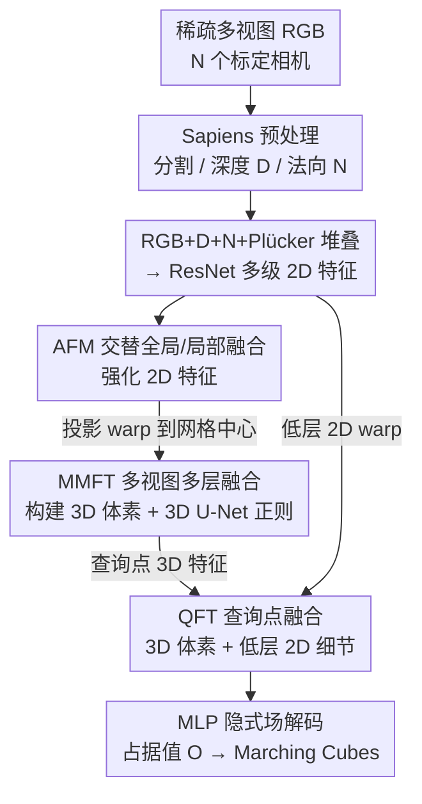

# SMVRT: Implicit Human 3D Modeling Using Sparse Multi-View Volumetric Reconstruction with Transformer Fusion

**会议**: CVPR 2026  
**论文**: [CVF Open Access](https://openaccess.thecvf.com/content/CVPR2026/html/Fan_SMVRT_Implicit_Human_3D_Modeling_Using_Sparse_Multi-View_Volumetric_Reconstruction_CVPR_2026_paper.html)  
**代码**: 待确认  
**领域**: 3D视觉 / 稀疏多视图人体重建  
**关键词**: 稀疏多视图、隐式占据场、人体3D重建、Transformer特征融合、体素网格

## 一句话总结
SMVRT 用一个端到端、无模板的隐式占据场网络从稀疏多视图（2~8 张）重建穿衣人体，核心是在 2D 编码、2D→3D 体素构建、查询点解码三个阶段各放一个 Transformer 融合模块，让网络"挑选最该信的视角与特征"，在 THUman2.0/2.1、MultiGarment、MultiHuman 上把 Chamfer 距离做到约现有 SOTA 的一半。

## 研究背景与动机

**领域现状**：人体 3D 重建是 AR/VR、游戏、虚拟制作的基础能力。一类做法靠参数化模板（SMPL/SMPL-X）拟合，但只擅长裸体、对穿衣人体力不从心；另一类是隐式重建（PIFu 系），从单视图或稀疏视图直接学一个占据场（occupancy field）。

**现有痛点**：单视图重建天然有深度歧义，遮挡区域只能"猜"——要么靠生成模型补视角、要么靠模板填充，而生成模型对不可预测的细节（手指、衣褶）经常补错。要做高质量重建，传统路线又依赖密集相机阵列，设备昂贵笨重。于是"稀疏多视图"成了折中点，但稀疏视图太稀疏，标准多视图立体（MVS）算不出可靠深度。

**核心矛盾**：稀疏视图下，多视图特征**怎么融合**是决定成败的关键。最朴素的拼接（concatenation）无法适配任意视角数；求和/平均池化/方差融合（PIFu、MVSNet 用的）虽然对视角数不变，却给"可见点的视角"和"被遮挡点的视角"分配同样的权重——无法分辨哪些视角对某个点真正有用。3DFG-PIFu 这类方法还在参考相机前建体素再投影到其它相机做拼接融合，融合策略仍偏简单直接。

**本文目标**：在只有稀疏多视图、且不依赖模板、不依赖 MVS 深度的前提下，端到端学一个占据场，把"该信哪个视角、该用哪一层特征"交给网络自己学。

**切入角度**：作者注意到 Transformer 的注意力天然适合做"加权选择"——既然平均池化无法区分视角贡献，那就用注意力在不同阶段分别做几何感知的视角选择与多层特征聚合。受多视图点图（MASt3R、VGGT）和隐式重建（PIFu 系）启发，把融合拆到网络的三个阶段分别优化。

**核心 idea**：不在"哪个阶段"上二选一，而是在**三个阶段都放融合模块**——2D 特征编码阶段（AFM 做全局/局部交替融合）、2D→3D 体素构建阶段（MMFT 选最相关视角）、查询点占据解码阶段（QFT 融合粗糙但鲁棒的 3D 体素特征与保细节的低层 2D 特征），共同支撑一个围绕人体中心的共享体素。

## 方法详解

### 整体框架

输入是 N 个环绕人体的标定相机拍的 RGB 图（论文用 2/4/8 视角）；输出是一个隐式占据场，过 Marching Cubes 抽出三角网格。整条管线可以理解成"先把每张图的 2D 特征做强，再把多视图 2D 特征搬上一个共享 3D 体素网格，最后对每个查询点把 3D 和 2D 特征拼起来解码占据值"。

具体地：每张 RGB 先过预训练的 Sapiens 拿到分割、深度图 D、法向图 N；相机标定算出 Plücker 射线图 P 作为位姿条件。RGB、D、N、P 四路堆叠后喂进一个改了首层的 ResNet，抽出四级 2D 特征。最高层特征 token 化后送进 **AFM**（交替全局/局部融合），得到全局正则化的 2D 特征。然后在人体周围用前景分割反投影框出一个 $64^3$、范围 $[-1.0\text{m}, 1.0\text{m}]$ 的 3D 网格 $G$；把多视图 2D 特征双线性采样投到每个网格中心，用 **MMFT** 做多视图多层融合形成 3D 体素特征，再过一个 3D U-Net 做上下文正则化。最后对任意查询点，从多级体素三线性插值取 3D 特征、从 2D 特征图 warp 取低层细节特征，用 **QFT** 融合后送 MLP 隐式场解码器吐出占据值 $O \in [0,1]$。

### 关键设计

**1. AFM：在 2D 编码阶段用全局/局部交替注意力把跨视图特征做强**

痛点是：稀疏视图下，每张图单独编码会做出"过早的单视图判断"，缺乏跨视图一致性。AFM 把所有视图最高层特征 patch 化成 token $T_{i,j} \in \mathbb{R}^d$，再堆叠若干个交替的全局/帧内（frame）融合块。形式上，先把各视图 token 打包（Pack）做全局注意力 $T^{l} = \text{Attn}^{global}_{AFM}(T^{l-1})$ 让跨视图信息流动，再 Unpack 回各视图做帧内注意力 $T^{l+1} = \text{Attn}^{frame}_{AFM}(T^{l})$ 巩固单视图结构，如此交替 $M$ 层。这套"全局看一致性、局部看自身结构"的交替设计借鉴了 MASt3R/VGGT 的多视图点图思路，外加 register token 稳定全局表示。值得一提的是融合块既能用标准 Transformer 也能换成 Mamba——后者精度相当但训练/推理快约 1.5×。

**2. MMFT：在 2D→3D 体素构建阶段用几何感知注意力"挑视角"，而非平均池化**

这是全文最核心的设计，直接针对"平均/方差融合给所有视角等权"的痛点。对 3D 网格中心 $C(x,y,z)$，先按相机投影 $p_{i,u,v} = \pi_i(T_i \circ C(x,y,z))$ 把它投到每个视图，双线性插值取出该视图各层特征 $F^{2D}_{i,j}$（$j=0,1,2$ 是该视角各层，$j=3$ 是 AFM 全局融合层），堆成 $F^{2D}_i$。然后做注意力融合：

$$G(F^{2D}_i) = \text{Attn}_{MMFT}[F^{2D}_1, z_1, \dots, F^{2D}_N, z_N]$$

其中把网格中心在各视图的深度 $z_i$ 一并喂入，使融合"几何感知"——基于缩放点积注意力（$Q=M_Q X,\ K=M_K X,\ V=M_V X$），网络可以学到对当前网格中心而言哪些相机最该信（如可见 vs 被遮挡）。融合后的 $\{G_i\}$ 再平均池化得到该网格中心的最终特征 $F_{fused} = \text{Average}(G_1, \dots, G_N)$，最后过 3D U-Net 做体素级上下文正则得到 $F_v$。相比 3DFG-PIFu "在参考相机前建体素再投影拼接"，SMVRT 是建一个以人体为中心的**共享**体素，融合更直接也更鲁棒。

**3. QFT：在查询点解码阶段把鲁棒的 3D 体素特征与保细节的低层 2D 特征融合**

光有 3D 体素特征会"太糊"——$64^3$ 的低分辨率体素能给出鲁棒的全局形状，却丢了手指、衣褶这类高频细节。QFT 的做法是对每个查询点 $q$，一边从多级体素三线性插值取 $F_{tri}(x,y,z)$（记作 $F_v$），一边把高分辨率的低层 2D 特征 $F^{2D}_{i,0}$ warp 到同一查询点，每个 2D 特征都和一份 $F_v$ 拼接，再做注意力融合：

$$F(q) = \text{Attn}_{QFT}\big((F_v, F^{2D}_{1,0}, z_0), \dots, (F_v, F^{2D}_{N,0}, z_N)\big)$$

融合结果平均池化后与查询点坐标 $(x_q,y_q,z_q)$ 拼接，送进 MLP 隐式场解码器 $f(\cdot)$ 得到占据值 $O = f(\text{Average}(F(q)), x_q, y_q, z_q)$。消融显示去掉这个"细节保护器"（低层 2D 特征），NC（法向一致性）明显下降、表面变得过度平滑——这正说明 3D 体管全局、2D 管细节的分工是有效的。

### 损失函数 / 训练策略
训练数据由带纹理的人体网格 $S$ 用 Blender 渲染多视图 2D 图作为输入；监督信号是查询点的真值占据值。查询点这样采：先在表面采 $K$ 个点 $p_k$，再加高斯扰动 $q_k = p_k + n_k,\ n_k \sim \mathcal{N}(0,\Sigma)$。优化目标是逐查询点的二元交叉熵：

$$Loss = -\frac{1}{BN}\sum_{i=1}^{B}\sum_{k=1}^{N} BCE(O_{pred\_i,k}, O_{gt\_i,k})$$

用 Adam（$\beta_1=0.9,\beta_2=0.999$），初始学习率 $1\times10^{-4}$，在第 50、100 epoch 各乘 0.1 衰减，全程单卡 A100。ResNet 首层为适配多模态输入而微调，其余从预训练初始化，网络其它部分随机初始化。

## 实验关键数据

### 主实验

THUman2.1（4 相机输入）上与非模板基线对比，SMVRT 在 IoU、NC 上大幅领先，Chamfer 也略优：

| 数据集 | 方法 | CD l1↓(mean) | IoU↑(mean) | NC↑(mean) | F1.0↑(mean) |
|--------|------|------|------|------|------|
| THUman2.1 | MV-PIFu | 10.24 | 0.844 | 0.844 | 0.653 |
| THUman2.1 | Zins et al. | 3.65 | 0.908 | 0.900 | 0.964 |
| THUman2.1 | **SMVRT (Ours)** | **3.58** | **0.958** | **0.940** | **0.973** |

THUman2.0/MultiHuman 上按 Chamfer l2 / P2S l2（$\times10^{-5}$）评测，SMVRT 相对 SOTA 约 2× 提升：

| 数据集 | 方法 | CD l2↓ | P2S↓ |
|--------|------|------|------|
| THUman2.0 | 3DFG-PIFu | 5.13 | 5.03 |
| THUman2.0 | **SMVRT** | **2.39** | **2.14** |
| MultiHuman | 3DFG-PIFu | 5.32 | 4.87 |
| MultiHuman | **SMVRT** | **3.66** | **3.36** |

### 消融实验

逐个开/关三个融合模块（"No fusion"= 去掉 AFM、MMFT/QFT 换成平均池化），看 THUman 上的贡献：

| 配置 | CD l1↓ | IoU↑ | NC↑ | F1.0↑ | 说明 |
|------|------|------|------|------|------|
| No fusion | 4.40 | 0.937 | 0.927 | 0.945 | 全用平均池化 |
| AFM only | 4.37 | 0.939 | 0.934 | 0.945 | 仅 2D 融合，提升有限 |
| QFT only | 4.02 | 0.948 | 0.930 | 0.955 | 单独加查询点融合 |
| MMFT only | 3.84 | 0.951 | 0.937 | 0.966 | 单独贡献最大 |
| MMFT+QFT | 3.61 | 0.957 | 0.940 | 0.972 | 两者协同接近满配 |
| **MMFT+QFT+AFM（Full）** | **3.58** | **0.958** | **0.940** | **0.973** | 完整模型 |

其它消融：

| 维度 | 配置 | 关键指标 | 结论 |
|------|------|---------|------|
| 输入模态 | RGB→+N→+D→+P | CD l1 3.90→3.71→3.65→3.58 | 单调变好，法向贡献最大 |
| 相机数 | 2/4/8 cam | CD l1 8.74/3.58/2.96 | 视角越多越好，2 视角明显吃力 |
| AFM 块 | Transformer vs Mamba | 精度几乎一致 | Mamba 快约 1.5× |
| QFT 2D 细节 | w/ vs w/o detail preserver | NC 0.940 vs 0.937，CD 3.58 vs 3.92 | 去掉表面过度平滑 |
| 零样本 | MultiGarment（4 cam） | IoU 0.962/0.963 | 跨数据集泛化接近同分布 |

### 关键发现
- **MMFT 是单模块贡献最大的设计**：单独加上 CD l1 从 4.40 降到 3.84、F1.0 从 0.945 升到 0.966，说明"在 2D→3D 阶段用注意力挑视角"比在 2D 编码阶段（AFM 单独只把 CD 改善到 4.37）或仅在查询点（QFT only 3.84→实为 4.02）更关键。
- **AFM 单独提升有限、但和其它模块叠加有正收益**：MMFT+QFT 已到 3.61，再加 AFM 到 3.58——它更像锦上添花的全局正则，而非主力。
- **法向输入贡献最大**：从 RGB-only 到 +N，CD l1 一步从 3.90 降到 3.71，作者解释为法向图显式引导网络捕捉局部细节、相当于隐式法向积分。
- **2D 低层细节决定 NC/表面质量**：去掉 QFT 的细节保护器，表面明显变糊，印证"3D 体素管全局形状、2D 高分辨率管精细细节"的分工。
- **视角数边际递减但稳定**：2→4 相机收益巨大（CD l1 8.74→3.58），4→8 继续改善（→2.96），8 视角再上 1024 高分辨率（8 hds）几乎饱和。

## 亮点与洞察
- **"三阶段融合"而非"选一个阶段融合"**：把多视图融合拆解到 2D 编码、体素构建、查询点解码三处分别用注意力，各管各的（全局一致性 / 选视角 / 保细节），这种"分阶段对症下药"的拆法很清晰，也让消融能干净地归因每个模块。
- **几何感知的视角选择**：MMFT 把网格中心在各相机的深度 $z_i$ 一起喂进注意力，让"该信哪个视角"带上几何线索——这比纯特征注意力更贴合多视图遮挡推理的本质。
- **共享人体中心体素 vs 参考相机体素**：相比 3DFG-PIFu 在某个参考相机前建体素再投影到别的相机，SMVRT 建一个绕人体中心的共享体素，避免了参考视角偏置，思路更对称、更易扩展到任意视角数。
- **Mamba 可平替 Transformer**：AFM 里 Mamba 与 Transformer 精度持平却快约 1.5×，对追求效率的实际部署是个现成的省算力开关。
- 可迁移：这套"低分辨率 3D 体管全局 + 高分辨率 2D warp 管细节 + 注意力融合"的查询点解码范式，不止人体，对一般物体的稀疏视图隐式重建（占据/SDF）都能套用。

## 局限与展望
- **仍依赖固定标定相机与预训练 Sapiens**：输入要求标定好的环绕相机，且分割/深度/法向都来自 Sapiens——上游 Sapiens 在野外图、罕见姿态上的误差会直接传导到重建质量，论文未分析这种误差敏感性。
- **体素分辨率受限**：训练体素只有 $64^3$、空间范围 $[-1.0,1.0]$ m，全局形状靠它兜底；虽然推理可上 $256^3$ 抽网格，但低分辨率体素能承载的几何上限可能成为极精细结构（如发丝、薄飘带）的瓶颈。
- **只重建几何、不含纹理/外观**：输出是占据场→网格，没有颜色/材质恢复，离"可渲染数字人"还差外观一环。
- **2 视角仍明显偏弱**：CD l1 在 2 相机下是 8.74，远差于 4/8 相机——"稀疏"的下限其实并不算低，真正极稀疏（单视角/双视角）场景帮助有限。
- 可改进：把 Sapiens 的不确定性显式建模进 MMFT 的注意力权重；或引入可学习相机数自适应，让模型对视角数变化更鲁棒。

## 相关工作与启发
- **vs MV-PIFu / PIFu 系**：PIFu 用像素对齐特征 + 平均池化做多视图融合，对视角数不变但等权对待所有视角；SMVRT 把平均池化换成几何感知注意力，在 IoU/NC 上大幅领先（THUman2.1 IoU 0.958 vs 0.844）。
- **vs Zins et al.（局部注意力融合 SOTA）**：Zins 在每个查询点做局部注意力融合；SMVRT 把融合提前到网格中心（MMFT）选视角、再在查询点（QFT）补细节，两段式融合让表面更平滑（Zins 重建偏"凹凸"），THUman2.0 上 CD l2 2.39 vs 12.67 量级领先。
- **vs 3DFG-PIFu**：3DFG 在参考相机前建体素并投影到其它相机做拼接融合；SMVRT 建人体中心共享体素 + 注意力融合，结构更对称，THUman2.0 CD l2 从 5.13 降到 2.39。
- **vs 模板类（SMPL/SMPL-X、DeepMultiCap）**：模板法擅长裸体但对穿衣人体力不从心；SMVRT 完全无模板（template-free），在穿衣人体（衣褶、手指）上明显更好，且能零样本迁移到 MultiGarment 穿衣数据。

## 评分
- 新颖性: ⭐⭐⭐⭐ 三阶段注意力融合 + 几何感知选视角的组合在稀疏多视图人体重建里是清晰且有效的新设计，但每个模块都建立在已有的 Transformer/隐式场/体素融合积木上。
- 实验充分度: ⭐⭐⭐⭐ 四个数据集、模块/模态/视角数/Mamba/细节保护器多维消融 + 零样本，归因干净；但缺与扩散补视角类方法的直接对比、且未报推理时间/显存。
- 写作质量: ⭐⭐⭐⭐ 动机—融合策略对比—模块拆解逻辑顺畅，图 2 的融合策略对比很到位；公式排版（OCR）略乱但可还原。
- 价值: ⭐⭐⭐⭐ 在不依赖密集相机、不依赖模板、不依赖 MVS 深度的前提下把穿衣人体稀疏重建推到约 2× SOTA，对低成本数字人采集有实用价值。

<!-- RELATED:START -->

## 相关论文

- [\[CVPR 2026\] Intrinsic Image Fusion for Multi-View 3D Material Reconstruction](intrinsic_image_fusion_for_multi-view_3d_material_reconstruction.md)
- [\[CVPR 2026\] Multi-view Pyramid Transformer: Look Coarser to See Broader](multi-view_pyramid_transformer_look_coarser_to_see_broader.md)
- [\[CVPR 2026\] RnG: A Unified Transformer for Complete 3D Modeling from Partial Observations](rng_a_unified_transformer_for_complete_3d_modeling_from_partial_observations.md)
- [\[CVPR 2026\] Coherent Human-Scene Reconstruction from Multi-Person Multi-View Video in a Single Pass](coherent_humanscene_reconstruction_from_multiperso.md)
- [\[CVPR 2026\] ART: Articulated Reconstruction Transformer](art_articulated_reconstruction_transformer.md)

<!-- RELATED:END -->
