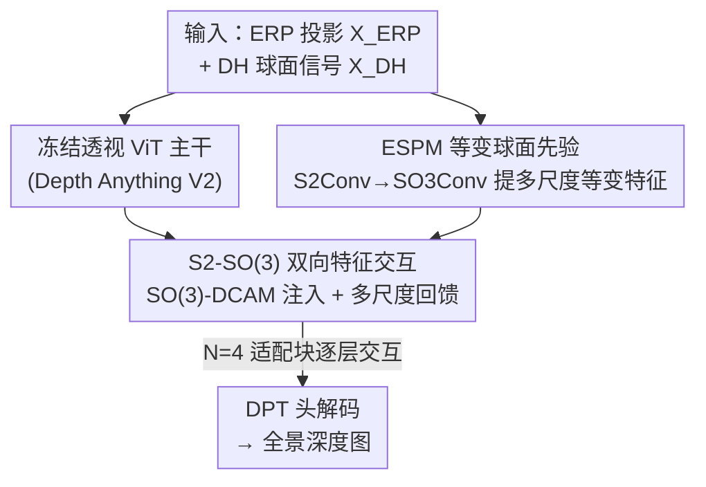

# SO(3)-Equivariant ViT-Adapter for Data-Efficient Zero-Shot Sim-to-Real Indoor Panoramic Depth Estimation

**会议**: CVPR 2026  
**论文**: [CVF Open Access](https://openaccess.thecvf.com/content/CVPR2026/html/He_SO3-Equivariant_ViT-Adapter_for_Data-Efficient_Zero-Shot_Sim-to-Real_Indoor_Panoramic_Depth_Estimation_CVPR_2026_paper.html)  
**代码**: 待确认  
**领域**: 3D视觉  
**关键词**: 全景深度估计, SO(3)等变, ViT-Adapter, 零样本, Sim-to-Real

## 一句话总结
给冻结的透视预训练 ViT（Depth Anything V2）外挂一个 **SO(3)-等变适配器**，只用 6.5K 张合成全景图、零真实数据训练，就把透视零样本深度模型的泛化能力迁移到 360° 全景上，在 Matterport3D / Stanford2D3D 上零样本 sim-to-real 超过依赖真实数据的 PanDA。

## 研究背景与动机

**领域现状**：透视图（窄 FoV）的零样本单目深度估计已经很成熟，Marigold、Depth Anything 等靠大规模预训练 + ViT 主干能跨数据集泛化。全景图能提供完整 360° 环境理解、减少盲区，对机器人/AR-VR/自动导航价值更大。

**现有痛点**：把透视模型直接用到全景图上**性能急剧下降**——等距柱状投影（ERP）带来严重畸变，而普通卷积/Transformer 算子**没有旋转等变性**，建模球面几何时会出现结构不一致。另一边，全景 RGB-D 真实数据采集需要专用硬件 + 复杂标定，**极其昂贵**，难以大规模训练全景基础模型。

**核心矛盾**：透视预训练里有丰富可迁移的深度先验，但"如何把它搬到全景"同时卡在三件事上——**数据可得性**（没有大规模全景真值）、**球面几何建模**（缺等变性）、**推理性能**。现有方法各有取舍：360MonoDepth 把全景切成多个透视块再融合，避免全景训练但推理慢、有拼接缝；DepthAnywhere 半监督混用真实 + 伪标签全景，效果好但真实数据成本高；PanDA 去掉真实深度监督却仍依赖大规模真实图像，且主干缺旋转一致算子。

**本文目标**：在**不用任何真实全景数据**的前提下，构建一个几何一致、数据高效的零样本全景深度适配框架，把透视 ViT 的 sim-to-real 泛化能力搬过来。

**切入角度**：全景图用球面坐标 $\alpha\in[0,2\pi), \beta\in[0,\pi]$ 参数化，球面网格上的"平移"本质上是 3D 旋转。所以应该在**算子层面**引入 SO(3) 等变性，让适配器对垂直旋转鲁棒，而非靠数据增广硬学。

**核心 idea**：不改动冻结的透视 ViT，给它外挂 SO(3) 等变适配器——用球面 CNN 提等变先验、用 SO(3) 可变形交叉注意力对齐到 ViT 特征上，把旋转等变的归纳偏置注入进去。

## 方法详解

### 整体框架
框架由一个**冻结的透视预训练 ViT**（Depth Anything V2）和一组**可训练外挂模块**组成，只训练适配器和从头初始化的 DPT 解码头。每张全景图取两种表示作输入：ERP 投影 $X_{ERP}\in\mathbb{R}^{H\times W\times 3}$（切成 $14\times14$ 块 → patch embedding → ViT token）和在 Driscoll–Healy 球面网格上采样的球面信号 $X_{DH}\in\mathbb{R}^{2B\times2B\times3}$（带宽 $B=\lfloor H/8\rfloor$）。ESPM 从 $X_{DH}$ 提取多尺度 SO(3)-等变特征作几何先验，注入第一个适配块。

Transformer 编码器分成 $N=4$ 块，每个 ViT 块前后各挂一个 **SO(3) Feature Injector**（前）和 **Multi-Scale Feature Extractor**（后），构成 S2-SO(3) 双向特征交互；其中跨球面/旋转群的特征对齐由 **SO(3)-DCAM** 完成。最后各适配块的 ViT 特征上采样成多分辨率特征金字塔，与投影回球面的等变特征逐尺度融合，送入 DPT 头解码出全景深度图。

### 关键设计

**1. ESPM 等变球面先验模块：把"球面平移即 3D 旋转"显式建成旋转等变特征**

透视图有平移对称性，普通 CNN 提的局部 + 平移等变特征就能当 ViT 的归纳偏置；但全景图用球面坐标参数化，球面网格上的"平移"本质是 3D 旋转，普通卷积给不了对的归纳偏置。所有 3D 旋转构成特殊正交群 SO(3)，每个旋转 $R=R_z(\alpha)R_y(\beta)R_z(\gamma)$ 用 ZYZ-欧拉角参数化。ESPM 基于球面 CNN 构建：**S2Conv** 把球面函数 $f:S^2\to\mathbb{R}^{c_{in}}$ 抬升到 SO(3) 上的函数 $h(R)=\int_{S^2}\kappa(R^{-1}x)f(x)dx$；**SO3Conv** 再在群上聚合 $h'(R)=\int_{SO(3)}\kappa(R^{-1}Q)h(Q)dQ$。为效率，这些卷积在谱域实现——球面信号先做球谐变换 $f(\theta,\phi)=\sum_l\sum_m \hat{f}^l_m Y^l_m(\theta,\phi)$，卷积退化成谱系数逐点相乘，下采样直接丢高频分量；SO3Conv 用 Wigner-D 矩阵作 SO(3) 上的傅里叶基。最终输出三尺度等变特征 $F^0_{esp}=\{F_1, F_2, F_3\}$。这是整个框架旋转一致性的源头——先验本身就带等变性，后面只需把它"对齐"进 ViT。

**2. SO(3)-DCAM 可变形交叉注意力：把采样从 2D 平面抬到 SO(3) 群，消除球面非均匀采样的歧义**

视觉里的注意力都为窄 FoV 透视图设计，直接套到球面表示上会被**非均匀采样**坑——全局特征匹配失真、注意力权重次优；而且它们只靠特征相似度，不建模球面流形上的相对位置关系。SO(3)-DCAM 把可变形注意力推广到球面，靠两个创新：

(1) **SO(3) 稀疏采样**——核心是把采样操作从 2D 欧氏平面**抬升到 SO(3) 群**，保证对 $S^2$ 上任意 query 位置 $z_q$，其邻域特征的初始相对位置都一致，从而缓解非均匀采样的离散化误差。具体做法：以北极为原点随机采一组偏移旋转 $R_{offset}(\Delta\alpha,\Delta\beta,\Delta\gamma)$，再找一组把原点搬到 $z_q$ 的传输旋转 $R_x$，复合得到最终采样旋转 $R^s_k=R_x\cdot R_{offset}$ 并转回 ZYZ 欧拉角去 $F_{esp}$ 上取键值特征。为鼓励局部性又不写死，用初始化做**软约束**：线性层偏置设成以北极为中心的 SO(3) 网格坐标，且 $\Delta\beta$ 范围随尺度变化（深层低分辨率初始化更大采样区）。

(2) **球面上下文相对位置编码 SCRPE**——计算把 query 对齐到各键值球面坐标的旋转元 $\{R^s_{qk}\}$，经对数映射到李代数表示成向量 $\{\omega^s_{qk}\}$，再用可学习嵌入编码其量化后的方向与幅度、沿通道拼接，乘上投影后的 query 得到球面相对位置编码 $\{b^s_{qk}\}$。最终注意力 $\sum_s\sum_k A^s_{qk}(W_V f^s_{qk}+\text{PE}(\gamma^s_{qk}))$ 既对齐了等变↔透视特征，又显式注入了球面几何关系，做到旋转一致的特征融合。

**3. S2-SO(3) 双向特征交互：把等变先验注入冻结 ViT，再把深度先验回馈给等变分支**

冻结 ViT 在 ERP 图上提的是球面 $S^2$ 上的**非等变**特征——视觉先验丰富但缺等变性，易受几何畸变影响。作者在每个 ViT 块前后各设一个模块做双向桥接。**SO(3) Feature Injector**（块前）用 SO(3)-DCAM 实现：以当前 ViT 特征 $F^i_{vit}$ 为 query、等变特征 $F^i_{esp}$ 为键值，注入后 $\hat{F}^i_{vit}=F^i_{vit}+\lambda^i\,\text{SO(3)-DCAM}(F^i_{vit}, F^i_{esp})$，其中可学习注入权重 $\lambda^i$ 初始化为 $10^{-6}$（沿用 ViT-Adapter 设置，保证训练初期不破坏预训练特征）。**Multi-Scale Feature Extractor**（块后）反向操作：先把 SO(3) 特征投影到 $S^2$（等价于只保留傅里叶空间 $n=0$ 切片），用标准可变形注意力 DCAM 借 $F^{i+1}_{vit}$ 丰富它，再经 FFN 抬回 SO(3) 得到更新的 $F^{i+1}_{esp}$。一注一回，让冻结 ViT 的深度先验和球面等变先验在 4 个适配块里逐层互相增强——这正是"不改主干就能让透视模型理解球面几何"的关键。

### 损失函数 / 训练策略
深度回归用 **BerHu 损失**：小残差时按 $\ell_1$、大残差时切到 $\ell_2$，兼顾精度与平滑、收敛稳定。训练只更新适配器 + 从头初始化的 DPT 头，主干 Depth Anything V2 全程冻结；在 PNVS-hard 上训 30 epoch、batch size 4、AdamW（lr 1e-4，weight decay 0.01），A100 GPU，**全程不用任何旋转增广**——靠算子层等变性而非数据增广拿旋转鲁棒。

## 实验关键数据

### 主实验
训练只用 PNVS-hard 合成全景（过滤后 6548 对 RGB-D）；对比方法若需大规模无标注全景则额外给 18029 张 Structured3D 合成图。评测在真实室内数据集 **Matterport3D**、**Stanford2D3D** 官方测试集上，**严格零样本 sim-to-real**——训练完全不碰真实全景（标注或无标注都不用）。指标采用 7 个球面感知度量（纬度加权的 AbsRel/SqRel/RMSE/RMSE(log10) + 准确率阈值 $\delta_i<1.25^i$），在 S2 广义螺旋采样下计算以缓解 ERP 非均匀采样畸变。AbsRel = 平均相对误差（越低越好），$\delta_1$ = 预测/真值比值落在 1.25 内的像素占比（越高越好）。

Matterport3D 零样本 sim-to-real：

| 方法 | 主干 | 训练数据 | AbsRel↓ | RMSE↓ | $\delta_1$↑ |
|------|------|---------|---------|-------|------------|
| DepthAnything V2 | ViT-S | 透视预训练 | 0.177 | 0.599 | 0.638 |
| 360MonoDepth | MiDaS V3 | 透视预训练 | 0.158 | 0.749 | 0.660 |
| DepthAnywhere | UniFuse | PNVS + 伪标签 | 0.155 | 0.726 | 0.790 |
| PanDA-L | ViT-L | 透视 + PNVS + 伪标签 | 0.091 | 0.421 | 0.881 |
| **Ours** | ViT-S | 透视 + PNVS | 0.089 | 0.416 | 0.882 |
| **Ours** | ViT-L | 透视 + PNVS | **0.078** | **0.388** | **0.906** |

关键看点：本文 **ViT-S 版（少用伪标签 ST(p) 数据）就追平甚至超过 PanDA-L**（0.089 vs 0.091 AbsRel），ViT-L 版进一步把 RMSE 压到 0.388。Stanford2D3D 上趋势一致——Ours ViT-L AbsRel 0.060 / RMSE 0.295 / $\delta_1$ 0.953，全面优于 PanDA-L（0.073 / 0.335 / 0.937），且本文不用任何伪标签真实数据。

### 消融实验

主组件消融（Matterport3D）：

| 配置 | AbsRel↓ | RMSE↓ | $\delta_1$↑ | 说明 |
|------|---------|-------|------------|------|
| ViT-S(*) | 0.100 | 0.447 | 0.858 | 基础变体 |
| ViT-S | 0.093 | 0.439 | 0.871 | 直接微调 |
| ViT-Adapter | 0.093 | 0.431 | 0.872 | 普通适配器 |
| Ours w/o SO(3)-DCAM | 0.092 | 0.430 | 0.875 | 去掉 SO(3) 可变形注意力 |
| Ours w/o SCRPE | 0.091 | 0.426 | 0.879 | 去掉球面相对位置编码 |
| **Ours** | **0.089** | **0.416** | **0.882** | 完整模型 |

垂直旋转鲁棒性消融（Matterport3D，$\Delta$ 为加旋转增广带来的性能变化，越小/负越说明本身已鲁棒）：

| 方法 | 旋转增广 | RMSE@0° | RMSE@20° | $\Delta$@20° (δ1) |
|------|---------|---------|----------|------------------|
| ViT-Adapter | ✗ | 0.431 | 0.690 | — |
| ViT-Adapter | ✓ | 0.426 | 0.593 | 23.13% |
| Ours w/o SO(3)-DCAM | ✓ | 0.426 | 0.579 | 22.28% |
| **Ours** | ✗ | 0.416 | 0.612 | — |
| **Ours** | ✓ | 0.425 | 0.556 | 16.59% |

### 关键发现
- **SO(3)-DCAM 与 SCRPE 各有贡献**：从 ViT-Adapter（0.093）→ +SO(3)-DCAM（0.092）→ +SCRPE（0.091）→ 完整（0.089），逐项加上去稳定下降，说明"球面采样"和"球面相对位置编码"是两个互补的等变来源。
- **等变性自带旋转鲁棒**：在 $\theta=0°$ 时本文不加增广的 RMSE 已优于 ViT-Adapter 加增广（0.416 vs 0.426），且加增广带来的提升幅度 $\Delta$ 最小（@20° 的 $\delta_1$ 只需 16.59% vs ViT-Adapter 的 23.13%）——意味着算子层等变性已经吃下了大部分旋转不变需求，不必靠数据增广硬补。
- **数据效率**：只用 6.5K 合成图、零真实数据就超过依赖大规模真实/伪标签数据的 PanDA，验证了"把等变性放进算子"比"用数据堆泛化"更高效。

## 亮点与洞察
- **"球面平移 = 3D 旋转"的洞察**是全文支点：正因为认清这点，才把适配器的归纳偏置从平移等变换成 SO(3) 等变，这个视角可迁移到任何球面/全景任务（全景分割、全景检测）。
- **把采样抬升到 SO(3) 群**很巧妙：传统可变形注意力在 2D 平面采样，球面上会因非均匀采样失真；抬到群上让任意 query 的邻域相对位置一致，从根上消歧——这是适配器能保持旋转等变的关键机制。
- **冻结主干 + 外挂等变适配器**的范式很实用：不动透视预训练权重就把它"教会"球面几何，等于零成本复用了 Depth Anything 的全部先验，对任何"把透视基础模型搬到全景"的任务都有借鉴价值。

## 局限与展望
- 等变模块（球面 CNN + SO(3) 注意力）在谱域计算，**推理开销**相比纯 ViT 适配器更高；论文把详细推导和效率分析甩到了补充材料，正文未给出明确的推理时延对比。⚠️ 实际部署成本以原文补充材料为准。
- 训练只用合成全景，虽零样本泛化到真实室内有效，但**室外/复杂场景**未验证；评测集中在 Matterport3D / Stanford2D3D 两个室内基准。
- SCRPE 的单独增益相对有限（AbsRel 0.091→0.089），其设计复杂度（李代数对数映射 + 方向/幅度量化嵌入）与收益是否匹配，值得进一步权衡。

## 相关工作与启发
- **vs 360MonoDepth**: 它把全景切成多个透视块分别预测再融合，避免全景训练但推理慢、有明显拼接缝；本文直接在全景上端到端处理、用等变性保证几何一致，无拼接问题。
- **vs DepthAnywhere / PanDA（半监督）**: 它们靠大规模真实/伪标签全景做半监督蒸馏，真实数据成本高、主干仍缺旋转一致算子；本文零真实数据、算子层等变，数据效率和几何一致性都更优。
- **vs 普通 ViT-Adapter**: 标准适配器用 CNN 提平移等变先验，对球面畸变无能为力；本文把它升级为 SO(3) 等变先验 + 球面可变形注意力，是对 ViT-Adapter 在球面流形上的针对性扩展。

## 评分
- 新颖性: ⭐⭐⭐⭐⭐ "球面平移即旋转 + 把采样抬到 SO(3) 群"的等变适配器设计，针对全景几何很有洞察
- 实验充分度: ⭐⭐⭐⭐ 双真实基准、逐组件消融、旋转鲁棒性专项齐全，但缺推理效率正文对比、未测室外
- 写作质量: ⭐⭐⭐⭐ 动机三难点讲得清晰、公式完整，但球面 CNN/谱域细节大量甩到补充材料
- 价值: ⭐⭐⭐⭐⭐ 零真实数据、数据高效地把透视基础模型搬到全景并超 SOTA，对机器人/AR-VR 实用

<!-- RELATED:START -->

## 相关论文

- [\[CVPR 2026\] VGGT-360: Geometry-Consistent Zero-Shot Panoramic Depth Estimation](vggt-360_geometry-consistent_zero-shot_panoramic_depth_estimation.md)
- [\[CVPR 2026\] Depth Any Panoramas: A Foundation Model for Panoramic Depth Estimation](depth_any_panoramas_a_foundation_model_for_panoramic_depth_estimation.md)
- [\[CVPR 2026\] Zero-Shot Depth Completion with Vision-Language Model](zero-shot_depth_completion_with_vision-language_model.md)
- [\[CVPR 2026\] ConceptPose: Training-Free Zero-Shot Object Pose Estimation using Concept Vectors](conceptpose_training-free_zero-shot_object_pose_estimation_using_concept_vectors.md)
- [\[CVPR 2026\] Fast-FoundationStereo: Real-Time Zero-Shot Stereo Matching](fast-foundationstereo_real-time_zero-shot_stereo_matching.md)

<!-- RELATED:END -->
