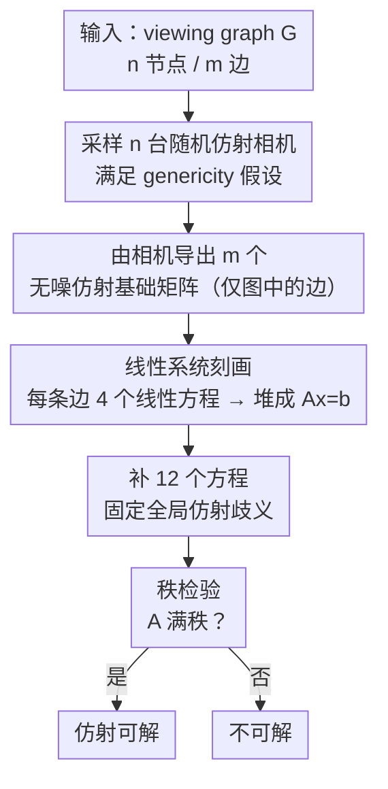

# Solvability of the Viewing Graph Under the Affine Camera Model

**会议**: CVPR 2026  
**论文**: [CVF Open Access](https://openaccess.thecvf.com/content/CVPR2026/html/Pedroni_Solvability_of_the_Viewing_Graph_Under_the_Affine_Camera_Model_CVPR_2026_paper.html)  
**代码**: https://github.com/federica-arrigoni/affine-solvability  
**领域**: 3D视觉  
**关键词**: viewing graph、仿射相机、SfM、可解性、平行刚性

## 一句话总结
本文首次研究仿射相机模型下的 viewing graph 可解性，把"给定一组两视图关系能否唯一确定所有相机"这个问题刻画成一个**线性系统** $Ax=b$，由此给出基于矩阵秩的实用检验算法，并补上若干必要/充分条件，最后猜想"仿射可解 = 2D 平行刚性"。

## 研究背景与动机
**领域现状**：Structure from Motion (SfM) 要从多张图像恢复 3D 点和相机。一个常用的抽象工具是 **viewing graph**：每个节点是一台相机/图像，每条边表示两台相机之间的两视图几何已知（标定相机存本质矩阵 $E$，非标定相机存基础矩阵 $F$）。研究这张图的"可解性"（solvability）就是问：仅凭这些边上的两视图关系，能否**唯一**地确定所有相机（在一个全局变换的意义下）？能则称图可解，否则不可解。

**现有痛点**：可解性已有的结果只覆盖两类相机模型。**标定情形**基本被解决——它等价于图论里的 **3D 平行刚性**，既有组合刻画也有线性系统刻画，还有现成的实用检验。**非标定情形**则棘手得多：它的可解性要用**多项式方程组**刻画 [38]，求解多项式在最坏情况下是变量数的指数复杂度，目前没有真正实用的精确检验，只能退而用"有限可解性"（finite solvability）做近似 [5–7]。

**核心矛盾**：除标定/非标定之外的相机模型在可解性框架里完全是空白。其中 **仿射相机**（affine camera）是个很有现实意义的模型——当场景深度变化相对相机距离很小时（航拍、转台采集等），它是非标定相机的一个良好近似，而且数学形式更简单（最后一行固定为 $[0\,0\,0\,1]$）。可它在 viewing graph 可解性里到底是什么样，从没人研究过。

**本文目标**：（1）给仿射可解性一个**理论刻画**；（2）把刻画变成一个**能跑的检验算法**；（3）搞清同一张图在标定/非标定/仿射三种模型下可解性如何变化。

**切入角度**：作者发现仿射相机的特殊结构（相机矩阵和基础矩阵都有大量为零的元素）会把"基础矩阵与相机对相容"这个本来是多项式的约束**退化成线性约束**，于是整张图的可解性可以收敛为一个线性系统是否有唯一解的问题。

**核心 idea**：用一个 $4m+12$ 行、$8n$ 列的**线性系统 $Ax=b$** 完整刻画仿射可解性——图仿射可解 $\iff$ 系数矩阵 $A$ 满秩；可解性检验因此简化成一次秩计算。

## 方法详解

### 整体框架
本文要回答的是一个纯理论问题：给定一张 viewing graph $G=(V,E)$（$n$ 个节点、$m$ 条边），每条边带一个已知的**仿射基础矩阵**，问这些约束能否把所有仿射相机唯一确定到一个全局仿射变换。整体思路分三步走：先用经典的"$Q^\top F P$ 是反对称矩阵"这一相容性条件，结合仿射相机和仿射基础矩阵的特殊形式，把每条边写成 4 个**线性**方程；把全图所有边的方程堆在一起，再补 12 个方程消掉全局仿射歧义，得到完整线性系统 $Ax=b$；最后把"是否唯一可解"归约为"$A$ 是否满秩"，用秩计算实现。理论刻画之外，作者还推导了几条必要/充分条件用于快速剪枝，并通过实验提出一个等价性猜想。

仿射相机和仿射基础矩阵的特殊形式是一切简化的源头。仿射相机为
$$P=\begin{bmatrix} N & u \\ \mathbf{0}^\top & 1\end{bmatrix},$$
其中 $N$ 是 $2\times3$、$u$ 是 $2\times1$，共 8 个自由度（比非标定相机的 $3\times4$ 少很多）。仿射基础矩阵则有 4 个零元素：
$$F=\begin{bmatrix} \mathbf{0} & f \\ g^\top & e\end{bmatrix}=\begin{bmatrix}0&0&a\\0&0&b\\c&d&e\end{bmatrix},$$
只有 4 个自由度。正是这些零元素让相容性约束从多项式塌缩成线性。

下面这张图对应算法管线（Algorithm 1，把理论刻画变成可执行的检验）：

### 关键设计

**1. 线性系统刻画：把仿射可解性写成 $Ax=b$**

非标定可解性之所以难，是因为它的相容性约束是多项式的；本文要解决的正是这一点。出发点是 [19] 的经典结论（Proposition 1）：非零矩阵 $F$ 是相机对 $P,Q$ 的基础矩阵，当且仅当 $Q^\top F P$ 是**反对称矩阵**。这个结论本质是对极约束，对仿射相机同样成立。关键在于：把仿射相机 (1)、(3) 和仿射基础矩阵 (2) 的特殊形式代进 $Q^\top F P$，乘积的左上 $3\times3$ 块直接变成零，逐项展开后"反对称"条件只剩下 4 个等式：
$$\begin{cases} m_{11}a+m_{21}b+n_{11}c+n_{21}d=0\\ m_{12}a+m_{22}b+n_{12}c+n_{22}d=0\\ m_{13}a+m_{23}b+n_{13}c+n_{23}d=0\\ t_1a+t_2b+u_1c+u_2d=-e \end{cases}$$
这里 $a,b,c,d,e$ 是已知的基础矩阵元素，$m_{ij},t_i,n_{ij},u_i$ 是两台相机的**未知**元素——所有方程对未知量都是线性的。把全图每条边的这 4 个方程收集起来，就得到 $4m$ 个方程、$8n$ 个未知数的线性系统 $Ax=b$。相比非标定情形要解多项式方程组，这是一个质的简化，也正好印证"仿射模型是非标定模型的近似"这一直觉。

**2. 固定全局歧义 + 秩检验：让"唯一解"等价于"满秩"**

仅有相容性方程还不够，因为仿射重建天然存在全局仿射歧义。这里有个容易忽略的细节（Remark 1）：仿射相机有 8 个自由度，而仿射变换有 12 个自由度，所以**固定一台相机的全部元素（8 个）不足以消歧**，必须再固定第二台相机的一部分凑满 12 个被固定参数——用图的语言说，消歧需要**两个节点**而非一个。作者的做法是固定第一台相机的全部元素加第二台相机的第一行，恰好固定 12 个参数，对应往 $Ax=b$ 追加 12 个方程。补完之后系统就完整刻画了这张图：**图仿射可解 $\iff$ $A$ 满秩**（Proposition 2）。因为这是个非齐次线性系统，"有唯一解"等价于系数矩阵满秩，于是检验落地为 Algorithm 1——采样随机相机生成无噪基础矩阵（保证 genericity 与相容性），堆方程、补歧义方程、算 $A$ 的秩，一次秩计算即可判定。

**3. 必要/充分条件：在跑算法前快速剪枝坏图**

除了能"算"，作者还想让人能"看出"图为什么(不)可解，于是给了几条组合条件。**合并规则（Prop 3，充分）**：两张仿射可解图各取两个节点对齐合并，结果仍仿射可解——因为两个节点恰好能消掉两套独立重建之间的仿射歧义（呼应 Remark 1）。**双连通（Prop 4，必要）**：仿射可解图必然是双连通的（删任一节点仍连通）；否则两个分量只共享单个节点，无法把两套仿射变换归并成一个全局变换。**边数下界（Prop 5，必要）**：$m\ge 2n-3$，直接来自"方程数 $4m+12$ 必须 $\ge$ 未知数 $8n$"。这些条件可在跑 Algorithm 1 之前先筛掉明显不可解的图（如经典小图 5g6、6g8 因边数不够被 Prop 5 直接判死），实践中推荐先查这些条件。值得注意的是 $2n-3$ 这个下界**恰好等于 2D 平行刚性所需的最小边数**——这是下一个猜想的伏笔。

**4. "仿射可解 = 2D 平行刚性"猜想：把仿射模型嵌进刚性理论谱系**

标定可解性早已被证明等价于 **3D 平行刚性**，那仿射这个"低一维"的近似模型对应什么？本文没给证明，但用大量实验观察到一个干净的等价：在所有合成图和真实图上，**仿射可解的结果与 2D 平行刚性的结果完全一致**，且仿射可解总能推出非标定可解。由此作者猜想 $\text{affine solvable}\iff\text{2D parallel rigid}$、且 $\text{affine solvable}\Rightarrow\text{uncalibrated solvable}$。这与几条已知事实自洽：2D 平行刚性蕴含 3D 平行刚性；三种模型的最小边数满足 $2n-3\ \ge\ (11n-15)/7\ \ge\ (3n-4)/2$（分别是仿射/2D刚性、非标定、标定/3D刚性的下界，对任意 $n\ge2$ 成立），说明仿射模型确实"更挑剔"、需要更多边。形式化证明留作未来工作。⚠️ 这是猜想而非定理，使用时需注意。

### 一个例子：三角形与 4g5
最直观的例子是**三角形**（Fig. 3a）：3 个节点、3 条边，$m=3=2\cdot3-3$ 恰好达到下界，且它是完全图，所以仿射可解——这是预期之内的。再看 [24] 里的 **4g5** 图（Fig. 3b）：它可以看作两个三角形沿两个公共节点合并而成，由合并规则（Prop 3）直接判定仿射可解。相对地，经典小图 **5g6、6g8**（Fig. 3c/3d）虽然是标定且非标定可解的，却因边数不满足 $m\ge2n-3$ 被判**仿射不可解**——这具体地展示了"仿射可解性比另外两种更严格"。

## 实验关键数据

由于这是仿射 viewing graph 可解性的第一篇工作，没有直接竞品，实验目的有两个：给出更多可解/不可解的具体例子，以及对同一张图比较三种相机模型下可解性的差异。实现基于 MATLAB，已开源。

### 主实验：合成图（固定密度，变节点数）
固定 15% 边密度，每个 $n$ 采样 1000 张连通图，统计通过各项测试的图数：

| n | 2D 平行刚性 | 仿射可解(本文) | 非标定可解 | 标定可解 |
|---|------------|---------------|-----------|---------|
| 10 | 266 | 266 | 327 | 374 |
| 25 | 447 | 447 | 457 | 475 |
| 50 | 865 | 865 | 865 | 867 |
| 75 | 999 | 999 | 999 | 999 |
| 100 | 1000 | 1000 | 1000 | 1000 |

可解图数随节点数增加而增加（边数按 $0.15\cdot n(n-1)/2$ 二次增长，大图更稠密）。关键现象：**仿射可解数始终 $\le$ 非标定可解数**（仿射模型更受限的代价），且**仿射可解数与 2D 平行刚性数逐行完全相等**——这是"仿射 = 2D 刚性"猜想的核心证据。

### 第二组合成实验：固定节点数，变边密度
固定 $n=25$，边密度从 15% 变到 40%，每档采样 1000 张图：

| 边密度 | 2D 平行刚性 | 仿射可解 | 非标定可解 | 标定可解 |
|-------|------------|---------|-----------|---------|
| 0.15 | 439 | 439 | 447 | 465 |
| 0.20 | 531 | 531 | 540 | 559 |
| 0.25 | 816 | 816 | 816 | 818 |
| 0.30 | 952 | 952 | 952 | 952 |
| 0.40 | 999 | 999 | 999 | 999 |

可解图数随密度上升而增加（边越多约束越多），且再次出现"仿射可解 ≡ 2D 平行刚性"、"仿射 $\le$ 非标定 $\le$ 标定"的一致排序。

### 真实数据
在 SfM 数据集 [29,41] 的真实 viewing graph 上测试（取最大双连通子图，因为双连通是所有可解性的必要条件）。所有子图都标定可解，故只报告仿射/非标定/2D 刚性：

| 数据集 | n | 密度 | 2D 刚性 | 仿射可解 | 非标定可解 |
|-------|---|------|--------|---------|-----------|
| Gustav Vasa | 18 | 72% | ✓ | ✓ | ✓ |
| Dino 319 | 36 | 37% | ✓ | ✓ | ✓ |
| Folke Filbyter | 40 | 32% | ✓ | ✓ | ✓ |
| Toronto University | 77 | 33% | ✓ | ✓ | ✓ |
| Tsar Nikolai I | 98 | 52% | ✓ | ✓ | ✓ |
| Pumpkin | 195 | 65% | ✓ | ✓ | ✓ |

### 关键发现
- **仿射可解与 2D 平行刚性在所有合成图与真实图上结果完全一致**，这是猜想 $\text{affine}=\text{2D rigid}$ 的最强经验支撑。
- 真实数据里仿射与非标定**没有出现差异**，且大多数图可解——意味着在转台/小深度变化等场景里，用更简单的仿射模型几乎不损失可解性，鼓励在实践中采用仿射相机。
- 仿射可解性比标定/非标定**更严格**：合成图上仿射可解数恒不超过非标定，经典小图 5g6/6g8 在另外两种模型可解但仿射不可解。

## 亮点与洞察
- **用"零结构"换"线性化"**：仿射相机和仿射基础矩阵大量元素为零，使本来是多项式的相容性约束直接退化为线性方程——这是整篇论文最巧妙的地方，把一个 NP-hard 量级的问题降到一次秩计算。
- **8 vs 12 自由度的消歧洞察**：仿射相机 8 自由度、仿射变换 12 自由度，所以"一个节点固定不了全局歧义、必须两个节点"，这个简单的数数论证既推出了消歧方程，又支撑了合并规则和双连通必要条件。
- **把新模型嵌进既有刚性理论谱系**：标定 ↔ 3D 平行刚性已知，本文猜想仿射 ↔ 2D 平行刚性，并用最小边数 $2n-3=(8n-12)/4$ 与 2D 刚性下界吻合作为佐证，给出一个统一的"维度—模型"对应直觉，可迁移到思考其他降维相机模型。

## 局限与展望
- **核心结论是猜想而非定理**：仿射可解 = 2D 平行刚性、仿射可解 ⇒ 非标定可解，目前只有经验证据、缺形式化证明（作者明言留作未来工作）。⚠️ 引用时需注意其未证明状态。
- **只给可解性判定，不给重建**：本文只回答"解是否唯一"，不解决"如何在可解图上算出相机"，后者是另一个问题。
- **真实数据上仿射与非标定无差异**：分析的真实序列里两种模型结果一致，无法据此区分二者的差距，需要更多（尤其是边稀疏或非转台）数据集才能看清两者真正的 gap。
- **依赖 genericity 假设**：算法用随机采样相机来生成无噪基础矩阵以满足通用性/相容性，结论只对一般位姿成立，退化构型（如共线相机中心）不在讨论范围内。

## 相关工作与启发
- **vs 标定可解性 [2,30,31]**：标定情形等价 3D 平行刚性、已有完整线性/组合刻画与实用检验；本文把这种"线性系统 + 秩检验"的范式首次搬到仿射模型，并猜想仿射对应低一维的 2D 平行刚性，把仿射补进同一个理论谱系。
- **vs 非标定可解性 [4,5,6,38]**：非标定可解性要用多项式系统刻画 [38]，精确检验不可行，只能用"有限可解性"近似 [5–7]（无法区分唯一解与有限多解）。本文证明仿射可解性是**线性**的，因此可以做**精确**的唯一性检验，这是相对非标定情形的根本优势——代价是仿射模型本身更受限、可解的图更少。
- **vs 合并/复合规则 [2,34]**：非标定有 [34] 的 composition rule、标定有 [2] 的合并定理，本文的 Prop 3 是它们在仿射模型下的对应物，论证核心同样是"两个公共节点消歧"。

## 评分
- 新颖性: ⭐⭐⭐⭐⭐ 首次研究仿射相机下的 viewing graph 可解性，并发现其可线性化、与 2D 平行刚性等价的干净结构。
- 实验充分度: ⭐⭐⭐⭐ 合成图系统扫描节点数与密度、真实 SfM 图验证，证据充分；但真实数据上仿射与非标定无差异，gap 尚未充分暴露。
- 写作质量: ⭐⭐⭐⭐⭐ 理论推导清晰，定理—证明—例子—猜想层层递进，可读性强。
- 价值: ⭐⭐⭐⭐ 为仿射 SfM 提供了实用的可解性预检，并把仿射模型纳入刚性理论谱系，有理论与实践双重意义。

<!-- RELATED:START -->

## 相关论文

- [\[ECCV 2024\] A Direct Approach to Viewing Graph Solvability](../../ECCV2024/3d_vision/a_direct_approach_to_viewing_graph_solvability.md)
- [\[CVPR 2026\] Variational Graph-based Normal Integration](variational_graph-based_normal_integration.md)
- [\[CVPR 2026\] Sky2Ground: A Benchmark for Site Modeling under Varying Altitude](sky2ground_a_benchmark_for_site_modeling_under_varying_altitude.md)
- [\[CVPR 2026\] 4C4D: 4 Camera 4D Gaussian Splatting](4c4d_4_camera_4d_gaussian_splatting.md)
- [\[CVPR 2026\] Coverage Optimization for Camera View Selection](coverage_optimization_for_camera_view_selection.md)

<!-- RELATED:END -->
