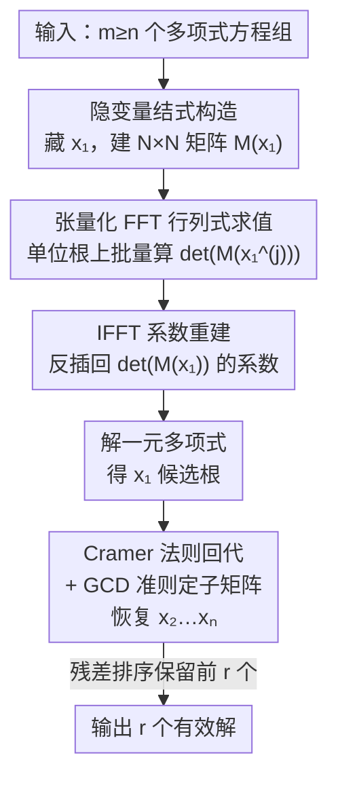

# Solving Minimal Problems Without Matrix Inversion Using FFT-Based Interpolation

**会议**: CVPR 2026  
**arXiv**: [2605.06572](https://arxiv.org/abs/2605.06572)  
**代码**: https://github.com/hayden-86/fft-minimal-solvers (有)  
**领域**: 3D视觉 / 多视图几何 / 相机位姿估计  
**关键词**: 最小问题, 稀疏结式, 隐变量消元, FFT 插值, Cramer 法则

## 一句话总结
这篇论文提出一种**无矩阵求逆**的最小问题（minimal problem）求解器构造方法：用隐变量稀疏结式把多元多项式方程组化成关于隐变量 $x_1$ 的一元行列式多项式，再用 **IFFT 插值**从单位圆上的采样值数值重建该多项式的系数（绕开符号展开），最后用 Cramer 法则配合 GCD 准则鲁棒回代其余未知量；在 14 个相机位姿类最小问题上实现了**零失败率**的数值稳定性，并在小规模问题上平均提速约 30%。

## 研究背景与动机

**领域现状**：相机几何估计（structure-from-motion、相对位姿、绝对位姿/PnP、标定等）在实践中几乎都落到 RANSAC 框架里反复求解"最小问题"——用最少的点对应估计模型参数，而这些最小问题绝大多数会归结为求解多元多项式方程组。计算机视觉里求这类方程组的两大主流路线是 **Gröbner 基方法**（Stewénius 推广、Kukelova/Larsson 的自动求解器生成、GAPS 等）和**结式方法**（resultant，尤其是适配稀疏结构的稀疏结式 sparse resultant）。

**现有痛点**：无论 Gröbner 基还是结式路线，构造出来的在线求解器（online solver）里**几乎都有一步显式矩阵求逆**（典型如对消元矩阵求逆得到 action matrix，或对结式子矩阵求 Schur 补）。当矩阵接近奇异或病态时——这在噪声、退化构型下很常见——矩阵求逆既昂贵又数值不稳定，常导致特征值算偏、甚至求解器生成失败。另一条用结式行列式的路线则卡在**符号展开**上：$N\times N$ 行列式按定义可达 $N!$ 项，高维矩阵下符号展开在计算上根本不可行，而且数值也不稳。

**核心矛盾**：稳定性与可行性之间的死结——要稳定就得避免病态矩阵求逆，但避免它的现有手段（如 Bhayani 等[2]隐变量结式）往往换来更大的特征值问题和更高的计算开销；要用结式行列式当一元多项式来解，又被符号展开的阶乘级复杂度堵死。

**本文目标**：构造一个既**不做显式矩阵求逆**、又**不做符号行列式展开**的最小求解器，同时保持高数值稳定性和有竞争力的运行时。

**切入角度**：作者从一个数值视角观察到——既然最终只需要那条关于隐变量 $x_1$ 的一元行列式多项式 $\det(M(x_1))$，那就**不必符号地把它展开**，只要在足够多的采样点上数值地求出 $\det(M(x_1))$ 的值，就能把这条一元多项式**插值**回来。而如果采样点取在复单位圆的 $(k+1)$ 次单位根上，Vandermonde 插值矩阵恰好退化成离散傅里叶变换矩阵，于是插值求系数变成一次 **IFFT**——既无需求逆病态 Vandermonde 矩阵，又只要 $O(k\log k)$。

**核心 idea**：**用"单位圆采样 + IFFT 插值"代替"符号行列式展开 / 矩阵求逆"来得到隐变量一元多项式**，再用 Cramer 法则（比值形式、不显式求逆子矩阵）回代其余未知量，全程无矩阵求逆。

## 方法详解

### 整体框架
方法分**离线构造**与**在线求解**两个阶段。给定一个最小问题（$m\ge n$ 个 $n$ 元多项式方程），先用隐变量法把其中一个变量 $x_1$ "藏进"系数域，按稀疏结式构造出一个 $N\times N$ 的结式矩阵 $M(x_1)$——它的每个元素是 $x_1$ 的一元多项式，而它的行列式 $\det(M(x_1))=c_k x_1^k+\dots+c_0$ 是关于 $x_1$ 的一元多项式，其（真）根就是原系统解的 $x_1$ 坐标。

离线阶段对一个具体问题只做一次：确定行列式次数 $k$ 和真解个数 $r$（用 Maple/Macaulay2 等代数工具），并用 GCD 准则离线挑出一对可靠的删行删列下标 $(i,j)$（用于在线回代）。在线阶段对每个新实例：把具体系数代入 $M(x_1)$ → 在 $k+1$ 个单位根采样点上**用张量化 FFT 一次性批量算出所有 $\det(M(x_1^{(j)}))$** → 用 **IFFT** 把这些采样值反插回系数 $c_0,\dots,c_k$ → 解这条一元多项式得到 $x_1$ 的候选根 → 对每个根用 **Cramer 法则**算单项式比值，回代出 $x_2,\dots,x_n$ → 把候选解代回原方程组按残差排序，保留残差最小的 $r$ 个为最终解。整条管线**没有任何显式矩阵求逆，也没有符号行列式展开**。

### 关键设计

**1. IFFT 单位圆插值重建行列式多项式：把"符号展开"换成"数值采样 + 一次 IFFT"**

这是全文的核心。要解的隐变量一元多项式 $\det(M(x_1))=c_k x_1^k+\dots+c_0$，其系数 $c_l$ 本身是原始系数的多元多项式，符号展开会触发 $N!$ 阶乘爆炸。作者的做法是把"求系数"变成"求值再插值"：先离线确定次数 $k$（对随机数值系数算一次行列式即可，$k$ 只依赖问题形式、对同一问题恒定），然后在复单位圆的 $(k+1)$ 次单位根上采样

$$x_1^{(j)}=\omega^{-j},\quad \omega=e^{2\pi i/(k+1)},\quad j=0,\dots,k$$

每个点上数值算出 $y^{(j)}=\det(M(x_1^{(j)}))$。这 $k+1$ 个值与系数 $\mathbf c$ 之间是一个 Vandermonde 线性系统 $\mathbf y=V\mathbf c$。直接求逆 $V$ 会因为 Vandermonde 矩阵病态而数值不稳，但**当采样点恰好是单位根时，$V$ 等价于 DFT 矩阵（差一个缩放）**，于是恢复 $\mathbf c$ 就退化成一次 IFFT：

$$c_l=\frac{1}{k+1}\sum_{j=0}^{k}y^{(j)}\,\omega^{jl}$$

这样既绕开了符号展开，又把求逆病态 Vandermonde 换成了稳定的 IFFT，复杂度仅 $O(k\log k)$。单位圆采样还保证所有采样点模长为 1，避免单项式项指数级膨胀或衰减，从源头上提升数值稳定性。

**2. 张量化 FFT 批量求行列式：把 $k+1$ 次逐点求值压成一次沿次数轴的 FFT**

光有 IFFT 还不够——你得先在 $k+1$ 个点上各算一次 $N\times N$ 行列式。作者注意到 $M(x_1)$ 的每个 $(r,c)$ 元素都是 $x_1$ 的一元多项式 $p_{rc}(x_1)=\sum_l a_{rc,l}x_1^l$，于是整个矩阵可写成按次数展开的系数矩阵之和 $M(x_1)=\sum_{l=0}^{d}A_l x_1^l$。把这些系数矩阵 $\{A_l\}$ 沿"多项式次数"维堆叠成一个三维张量 $\mathcal A\in\mathbb C^{N\times N\times(d+1)}$，那么"在所有单位根采样点上同时求值 $M(x_1^{(j)})$"就等价于**沿张量第三维做一维 FFT**：

$$M_{\text{fft}}(:,:,j)=\sum_{l=0}^{d}A_l\,e^{-2\pi i jl/(d+1)}$$

每个张量切片就是某个采样点上的矩阵 $M(x_1^{(j)})$，对它们做一次批量行列式即得全部 $y^{(j)}$。这把原本要顺序做的多次多项式求值合并成一次批量 FFT，显著降了开销，又不损稳定性。

**3. Cramer 法则比值回代 + GCD 准则鲁棒定位秩亏子矩阵：无求逆地恢复其余未知量**

拿到 $x_1$ 的根后，代回齐次系统 $M(x_1)\mathbf b=\mathbf 0$，理论上 $M(x_1)$ 恰好秩亏 1。删掉某一行 $i$ 一列 $j$ 得到满秩子矩阵 $M'(x_1)$，把系统重排成一个线性系统 $M'(x_1)\,\mathbf b'/b_j=-\mathbf m'_j$。作者**不显式求逆 $M'(x_1)$**，而是用 Cramer 法则把每个单项式比值写成两个行列式之比

$$\frac{b_k}{b_j}=\frac{|\tilde M'_k(x_1)|}{|M'(x_1)|}$$

其中 $\tilde M'_k$ 是把 $M'$ 的第 $k$ 列换成 $-\mathbf m'_j$。由于真正要的未知量 $x_w$ 可写成两个单项式比值的商（例如 $b_1=x_2^4x_3,\ b_2=x_2^3x_3$ 则 $x_2=(b_1/b_j)/(b_2/b_j)$），最终 $x_w(x_1)=|\tilde M'_{j_1}(x_1)|/|\tilde M'_{j_2}(x_1)|$，与 $b_j$ 的选择无关，**整步只算行列式比、不做矩阵求逆**。

难点在于：浮点误差下 $M(x_1)$ 可能被误判成满秩，导致所有删行删列子矩阵都"看起来满秩"，找不到那对有效的 $(i,j)$。作者为此提出 **GCD 共素准则**：因为根 $x_1$ 让 $\det(M(x_1))=0$ 但不让 $\det(M'_{(i,j)}(x_1))=0$，所以这两个多项式应当互素、其 GCD 应为常数

$$\gcd\big(\det(M(x_1)),\det(M'(x_1))\big)=c,\quad c\in\mathbb R\setminus\{0\}$$

为避免符号展开行列式的高昂代价，作者用**随机特化**策略：给所有符号系数赋随机素数值、只保留 $x_1$ 为符号，再算两个行列式的 GCD——特化后的 GCD 与符号 GCD 等价，却快得多。GCD 为常数即接受 $(i,j)$ 为有效删除对。这一步在离线阶段做一次、对同一问题的所有实例复用，保证了在线回代的稳定性与泛化性。

### 损失函数 / 训练策略
本文是**纯几何/代数求解器**，不涉及网络训练，没有损失函数。其"离线—在线"划分起到类似预处理的作用：离线只对每个问题做一次（定 $k$、定 $r$、用 GCD 准则定有效 $(i,j)$ 对），结果存为求解器参数；在线对每个新数据实例复用这些参数，只跑"代入系数 → FFT 求值 → IFFT 反插 → 解一元多项式 → Cramer 回代 → 残差筛选"的数值流程。残差筛选用归一化残差 $\hat r(\mathbf x)=r(\mathbf x)/\|\mathbf x\|_2$（其中 $r(\mathbf x)=\max_i|f_i(\mathbf x)|$ 为代回原方程组的最大绝对残差），按残差从小到大排序保留前 $r$ 个解。

## 实验关键数据

实验在合成数据集上进行（按 SparseR[1] 的流程生成 5000 个随机实例），覆盖 14 个相对/绝对位姿类最小问题，全部用 MATLAB 实现、在 Intel Core i5-13500H + 16GB RAM 上测试。对比对象是两个 SOTA：稀疏结式求解器 **SparseR**[1] 和 Gröbner 基求解器生成器 **GAPS**[29]。

### 主实验

**数值稳定性**（log₁₀ 归一化方程残差，越负越好；fail% 为残差 >10⁻³ 的实例比例）：

| 最小问题 | 本文 mean / fail% | SparseR mean / fail% | GAPS mean / fail% |
|----------|-------------------|----------------------|-------------------|
| Rel. pose F+λ 8pt | −13.17 / **0** | −12.71 / 0.2 | −12.62 / 0.1 |
| Rolling shutter pose | −11.14 / **0** | −12.43 / 0 | −12.26 / 0 |
| Abs. pose refractive P5P | −11.24 / **0** | −10.68 / 0.06 | −9.96 / 0.18 |
| Rel. pose E+fλ 7pt | −7.83 / **0** | −9.75 / 0.02 | −7.65 / **0.3** |
| Rel. pose λ1+F+λ2 9pt | −8.83 / **0** | −8.76 / 1.24 | −8.66 / 1.04 |

**核心结论**：在全部 14 个问题上，本文求解器的失败率**一律为 0**；而 SparseR 和 GAPS 在多个问题上有小比例失败（通常 <0.2%，个别如 9pt 问题高达 1.0%~1.2%）。本文的 mean/median 残差与两者持平、个别更好，说明无矩阵求逆的行列式重建**没有牺牲精度**。

**运行时与候选根个数**（time 为每实例平均；带 * 的 roots 是滤除伪根前的数量）：

| 最小问题 (真解数) | 本文 time / roots | SparseR time / roots | GAPS time / roots |
|-------------------|-------------------|----------------------|-------------------|
| Rel. pose F+λ 8pt (8) | **0.086** / 8 | 0.101 / 9 | 0.106 / 8 |
| Rel. pose E+f 6pt (9) | **0.154** / 9 | 0.345 / 9 | 0.235 / 9 |
| Rel. pose f+E+f 6pt (15) | **0.287** / 15 | 0.597 / 18 | 0.515 / 15 |
| Rel. pose E+fλ 7pt elim.λ (19) | **0.417** / 19 | 0.637 / 19 | 0.545 / 19 |
| Triangulation satellite (27) | 2.923 / 27 | **0.552** / 27 | 0.554 / 27 |
| Optimal PnP Cayley (40) | 7.442* / 43 | **1.393** / 40 | 3.005 / 40 |

**核心结论**：在前五个**小规模**问题上，本文求解器一致更快，平均提速约 **30%**（范围 10%~50%）。但**规模一大就反超不了**——求解器对每个隐变量候选根都要重复做行列式求值和回代，运行时随根数近似**线性增长**，所以在 27 根、40 根的大问题上明显慢于 SparseR/GAPS。此外前 7 个问题本文给出的有效根数**恰好等于理论真解数**，而大问题会多出若干伪根（如 9pt 问题 36 个候选 vs 24 真解），靠残差筛选剔除。

### 消融实验
论文未设置传统消融表（无可训练模块），但通过两组维度的对照实质性地验证了各设计的必要性：

| 对照维度 | 关键发现 | 说明 |
|----------|----------|------|
| 失败率 0% vs SparseR/GAPS 的 0.02%~1.24% | IFFT 重建 + 无矩阵求逆带来稳定性 | 验证设计 1：避开病态矩阵求逆的直接收益 |
| 小规模提速 30% vs 大规模反慢 | 张量 FFT 在小矩阵上高效，但逐根回代随根数线性增长 | 验证设计 2 的适用边界 |
| 前 7 问题根数精确 = 真解 / GCD 准则全程命中有效 $(i,j)$ 对 | 候选解更"干净"、子矩阵定位鲁棒 | 验证设计 3：GCD 准则在所有问题上都成功识别有效删除对 |

### 关键发现
- **稳定性来自"无求逆"而非更复杂的数值技巧**：本文残差与对手持平甚至略好，但失败率为 0，说明竞品的偶发失败几乎都来自那一步病态矩阵求逆（在噪声/退化构型下放大误差）。
- **运行时随候选根数近似线性增长**是本文最明确的 scaling 短板：小规模（≤19 根）领先，大规模（27/40 根）显著落后，因为每个根都要独立做行列式求值 + Cramer 回代。
- **GCD 随机特化准则在全部问题上都稳定挑出有效 $(i,j)$ 对**，作者据此声称该策略鲁棒；这是把"理论秩亏 1 但浮点下误判满秩"问题落地的关键工程点。

## 亮点与洞察
- **"单位根采样 ⇒ Vandermonde 退化成 DFT ⇒ 插值变 IFFT"这条链路很漂亮**：它把一个数值上臭名昭著的病态插值问题（Vandermonde 求逆）转化成数值最稳的变换之一（FFT），同时顺手避开了符号行列式的阶乘爆炸——一个观察同时解决稳定性和复杂度两个问题。
- **张量化 FFT 的视角值得迁移**：把"矩阵元素都是同一变量的多项式"重排成"系数矩阵沿次数轴堆叠的张量"，于是"在多个点求值"等价于"沿一维做 FFT"。任何需要在多个采样点批量求值的多项式矩阵问题都能套这个 trick。
- **Cramer 法则比值消元绕开矩阵求逆**：用 $x_w=|\tilde M'_{j_1}|/|\tilde M'_{j_2}|$ 的双行列式比直接读出未知量，且与归一化分母 $b_j$ 选择无关，是"无求逆"这条主线在回代环节的自然延续。
- **离线/在线分离把昂贵的符号工作一次性摊销**：次数 $k$、真解数 $r$、有效删除对 $(i,j)$ 都只离线算一次、对同一问题所有实例复用，把 RANSAC 内循环里的在线开销压到最低。

## 局限与展望
- **作者承认的局限**：运行时随候选根数线性增长，**大规模问题上慢于 SparseR/GAPS**；作者明确提出可以用 GPU 并行化大结式矩阵的实现来提速，但留作未来工作。
- **方法适用边界偏窄**：优势集中在"小规模"最小问题（≤约 19 根），这恰好覆盖了 P3P/5pt/6pt 等高频经典问题，但对根数多、结式矩阵大的复杂问题收益变负。
- **伪根问题随规模上升**：大问题会重建出比理论真解更多的候选根，必须靠残差代回筛选；筛选阈值（10⁻³）和排序保留 top-$r$ 的策略在极端噪声下的可靠性论文未深入分析。
- **离线阶段仍依赖符号代数工具**：确定 $k$、$r$ 和 GCD 准则的随机特化仍要 Maple/Macaulay2 等 CAS 支持，对全新问题的求解器构造门槛仍在；⚠️ 真解数 $r$ 的获取依赖外部代数工具，以原文为准。
- **仅合成数据评测**：实验全在 SparseR 流程生成的合成实例上做，缺少真实图像 RANSAC 管线里的端到端验证。

## 相关工作与启发
- **vs SparseR (Bhayani et al. CVPR'20 [1])**：两者都走稀疏结式 + 隐变量路线，本文直接复用了它的稀疏结式矩阵构造技术；区别在于 SparseR 仍要对选定子矩阵求 Schur 补（含矩阵求逆），本文用 IFFT 插值 + Cramer 比值彻底去掉求逆，换来 0 失败率，代价是大规模问题更慢。
- **vs GAPS (Li et al. [29]) / Gröbner 基路线**：Gröbner 基方法把求解归到 action matrix 的特征值问题，构造在线求解器时通常要对消元矩阵求逆，病态时不稳；本文从结式行列式入手、全程无求逆，稳定性更好但放弃了 Gröbner 路线成熟的大规模优化。
- **vs 隐变量结式 (Bhayani et al. [2])**：[2] 同样避免显式矩阵求逆，但代价是更大的特征值问题和更高开销；本文用数值插值代替特征值求解器，在小规模上更轻量。
- **启发**：当一个 pipeline 的瓶颈是"某个病态线性代数操作"时，与其改进这个操作，不如换一条数学等价但数值更友好的路径——这里就是用"采样—插值"取代"符号展开/求逆"，并借单位根让插值落到 FFT 上。这个"把病态操作替换成 FFT/Cramer 比值"的思路，对其他几何视觉里需要在 RANSAC 内反复求解的最小问题求解器都有借鉴意义。

## 评分
- 新颖性: ⭐⭐⭐⭐ "单位根采样 + IFFT 插值 + 张量 FFT + Cramer 比值"组合出一条全程无矩阵求逆的求解链，视角新颖且自洽
- 实验充分度: ⭐⭐⭐ 覆盖 14 个经典最小问题、5K 实例、稳定性+运行时双指标，但仅合成数据、无消融表、无真实 RANSAC 端到端验证
- 写作质量: ⭐⭐⭐⭐ 数学推导清晰、动机—方法—实验链条完整，离线/在线划分讲得明白
- 价值: ⭐⭐⭐⭐ 对小规模最小问题给出零失败、有竞争力运行时的实用替代方案，代码开源；大规模 scaling 短板限制了普适性

<!-- RELATED:START -->

## 相关论文

- [\[ICCV 2025\] PLMP -- Point-Line Minimal Problems for Projective SfM](../../ICCV2025/3d_vision/plmp_-_point-line_minimal_problems_for_projective_sfm.md)
- [\[CVPR 2026\] Linear Fundamental Matrix Estimation from 7 or 5 Points](linear_fundamental_matrix_estimation_from_7_or_5_points.md)
- [\[CVPR 2026\] Minimal Constraint Relaxation for Multiview Autocalibration](minimal_constraint_relaxation_for_multiview_autocalibration.md)
- [\[CVPR 2026\] TESO: Online Tracking of Essential Matrix by Stochastic Optimization](teso_online_tracking_of_essential_matrix_by_stochastic_optimization.md)
- [\[CVPR 2026\] PaNDaS: Learnable Shape Interpolation Modeling with Localized Control](pandas_learnable_shape_interpolation_modeling_with_localized_control.md)

<!-- RELATED:END -->
