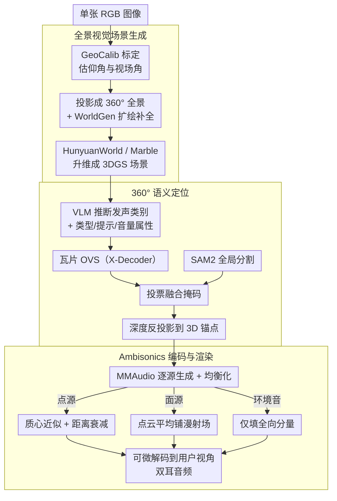

# SonoWorld: From One Image to a 3D Audio-Visual Scene

**会议**: CVPR 2026  
**arXiv**: [2603.28757](https://arxiv.org/abs/2603.28757)  
**代码**: [https://humathe.github.io/sonoworld/](https://humathe.github.io/sonoworld/)  
**领域**: 3D视觉 / 音频-视觉场景生成  
**关键词**: 3D音频视觉场景, 空间音频生成, 全景图重建, Ambisonics编码, 单图生成

## 一句话总结

提出 SonoWorld，一个 training-free 的框架，可以从单张图片出发，生成可探索的3D音频-视觉场景：先将图片扩展为360°全景并重建为3D高斯场景，再通过VLM驱动的语义定位放置声源锚点，最后用 Ambisonics 编码渲染空间音频，实现视觉与听觉的几何和语义对齐。

## 研究背景与动机

**领域现状**：近年来视觉场景生成取得了巨大进展，从类似 WorldGen 等全景方法到 3D 高斯溅射技术，已经能够从单张图片生成可以自由漫游的3D世界。然而，这些系统产生的全部都是"沉默的世界"——可以看但不能听。

**现有痛点**：真正的沉浸式体验天然是多感官的。想象走进一个花园，瀑布声应该从上游传来并随靠近增大，鸟鸣声从树冠传来，虫鸣随着头部转动而变化。没有语义正确且有距离/方向线索的音频，视觉世界再逼真也是感知不完整的。现有的音频生成方法要么只生成单声道音频，要么局限于单个物体或固定视角，无法处理包含点声源（如鸟叫）、面声源（如河流）和环境声（如风声）等多种声源类型的场景级音频。

**核心矛盾**：场景级空间音频的生成需要同时解决三个问题：(1) 异构声源类型的组合——点源、面源、环境音行为各异；(2) 从纯视觉上下文推理什么物体在发声、怎么发声、多大声；(3) 所有声音需要锚定到从图像推断的合理3D位置，并具有感知真实的空间效果。

**本文目标** 定义了一个全新的任务 Image2AVScene:从单张图片同时生成可交互的3D视觉场景和与之语义/几何对齐的空间声场，并提出了首个完整框架。

**切入角度**：采用全景表示（equirectangular panorama）统一视觉和音频的坐标系，并利用VLM进行语义理解来桥接视觉与声音。

**核心 idea**：通过全景扩绘→3DGS重建→VLM驱动的360°语义定位→Ambisonics编码的无训练流水线，实现从单图生成可自由漫游的3D音频-视觉场景。

## 方法详解

### 整体框架

SonoWorld 要解决的是 Image2AVScene：给一张普通 RGB 图像，同时造出一个能自由漫游的 3D 视觉场景和一个跟它语义、几何都对得上的空间声场。难点在于声音是无形的——图里看不到"哪里在响、响什么、多响"，而且不同声源（鸟叫、河流、风声）的空间行为完全不同。

整条流水线的思路是用全景把视觉和音频拉到同一套坐标系下，再逐步把"看得见"翻译成"听得见"。具体分四步往下走：单图先经相机标定和扩绘补成 360° 全景、升维成 3D 高斯场景；接着让 VLM 从图里推断哪些物体在发声，配合分割把这些声源精确定位并反投影到 3D；然后逐个声源生成波形、按类型编码成 Ambisonics 系数；最后在用户实际所在的位置和朝向上，把 Ambisonics 解码成双耳音频。整个框架不训练任何参数，全靠现成预训练模型的组合。

### 关键设计

**1. 全景视觉场景生成：把一张平面照片补全成带统一坐标系的 3D 世界**

直接拿单张透视图很难定位声源——视野窄、又没有 360° 环境，更别提先前方法默认相机水平拍摄，遇到俯仰角度时会把垂直方向整个搞歪。这里先用 GeoCalib 做单图标定，估出仰角和视场角 $(\varphi, f) = \text{Calib}(I)$，据此把图像经高斯金字塔反走样采样投影成等矩形全景，再用 WorldGen 的扩绘模型把缺失的 360° 视野补齐，最后交给 HunyuanWorld（开源）或 Marble（商业）升维成 3D 高斯溅射场景。选全景作为中间表示是关键：它天然覆盖整个 360° 视野，又恰好和后面 Ambisonics 的球面坐标系对齐，视觉和音频从此共用一套几何；而仰角校正这一步专门补上了先前"假设水平拍摄"留下的垂直失真。

**2. 360° 语义定位：从纯视觉里推断声源，并把它锚到 3D 的准确位置**

声音没有像素，框架得先回答"图里什么在发声"再回答"它在 3D 哪儿"。第一问交给 VLM（GPT-5 或 LLaVA-Next-34B），让它直接从输入图推理出发声类别集合 $\mathcal{C}$ 以及每类的属性——声源类型（点/面/环境）、用于生成音频的文本提示、均衡化参数。第二问是把这些类别定位到全景上：开放词汇分割（OVS）模型是在透视图上训练的，直接喂全景会失真，所以把全景切成互相重叠的 FoV 瓦片，逐块用 X-Decoder 做 OVS，再投回全景坐标。但瓦片拼接处常出现边缘断裂、区域残缺，于是再用 SAM2 对整张全景做一次全局、类无关的分割，得到几何上干净连续的区域，然后让 X-Decoder 的语义结果对 SAM2 的区域"投票"——以 SAM2 的全局一致性打底、用 X-Decoder 补上类别语义，两者正好互补。定位好的掩码最后借深度图反投影到 3D，得到声源锚点集合 $\mathcal{P}$。

**3. Ambisonics 编码与渲染：按声源类型分别空间化，再可微地解码到任意视角**

不同声源的空间行为差很多——鸟叫是点源、要有清晰方向感，河流是面源、应产生弥散声场，风声是环境音、根本不依赖方向——所以不能一刀切。框架先用 MMAudio 按每个声源的文本提示生成原始波形 $a_{i,\text{raw}}$，经均衡化

$$a_i(t) = 10^{v_i/20}\, a_{i,\text{raw}}(t)$$

后，按类型编码成 Ambisonics 系数。点声源用质心近似、并随距离衰减 $\mathbf{A}_\text{point} = \sum_i a_i\, \sigma(\|d_i\|)\, \mathbf{y}_L(\cdot)$；面声源在整片点云上平均以铺出漫射声场；环境音只填全向分量 $\mathbf{A}_\text{global} = a_\text{global}[1, 0, \dots, 0]^\top$。距离衰减取 $\sigma(d) = e^{-\alpha d}/d$。整条渲染管线对音频缓冲区可微——这不只是为了渲染，还顺带让框架能反向优化、扩展到房间声学学习和声源分离这类下游任务。

### 一个例子：从一张花园照片到能听的场景

以一张花园照片为例走一遍：标定估出相机略微俯拍，扩绘补出身后的树丛和天空、升维成可漫游的 3DGS 场景；VLM 读图给出三类声源——「瀑布（面源）/上游」「鸟鸣（点源）/树冠」「风（环境音）/全局」，连带各自的文本提示和音量。瀑布和鸟先经瓦片 OVS + SAM2 投票精确分割、反投影到 3D 拿到锚点，风则不需要定位。生成波形后，鸟鸣编成带方向的点源系数、瀑布铺成一片漫射场、风只占全向分量。当用户在场景里走近瀑布并转头，Ambisonics 实时解码出的双耳音频里，瀑布声随距离变大、鸟鸣方向随头部转动而移动——视觉走到哪、听觉就对到哪。

### 损失函数 / 训练策略

SonoWorld 完全 training-free，不训练任何参数，整套流程是预训练模型（VLM、扩绘、3D 重建、音频生成）的组合。唯一用到优化的地方是可微渲染管线——当它被接到单样本房间声学学习这类下游任务上时，可以反向传播来拟合真实声学。

## 实验关键数据

### 主实验

在自建的 SonoScene360 数据集（68个clip，6个真实场景）上评估：

| 方法 | ΔAngular↓ | CC↑ | AUC↑ | D-CLAPT↑ | D-CLAPR↑ |
|------|-----------|-----|------|----------|----------|
| MMAudio | — | — | — | 0.322 | 33.8% |
| SEE-2-SOUND | 1.397 | 0.194 | 0.603 | 0.156 | 22.1% |
| OmniAudio | 1.449 | 0.148 | 0.588 | 0.104 | 39.7% |
| Ours (Open-source) | 0.975 | 0.491 | 0.753 | 0.413 | 52.9% |
| **Ours (Proprietary)** | **0.728** | **0.658** | **0.838** | **0.457** | **67.6%** |

DOA误差降低47%，CC提升239%以上，语义指标提升117%以上。

### 消融实验

单样本房间声学学习（One-shot room acoustic learning）：

| 方法 | ΔAngular↓ | MAG↓ | ENV↓ |
|------|-----------|------|------|
| NAF | 1.76 | 3.96 | 3.60 |
| AV-NeRF | 1.58 | 4.58 | 1.89 |
| **Ours** | **0.22** | **3.46** | **1.22** |

### 关键发现

- 方法在Apple M3 Pro笔记本上音频回调延迟 < 1ms，远低于 5.3ms 的实时要求
- 用户研究（50名参与者，12个场景）中，SonoWorld 在所有对比中获得最高偏好率
- 开源版本（HunyuanWorld + LLaVA-Next）即使与使用商业模型输出的baseline相比也显著胜出
- Siren场景暴露了对运动声源的局限——静态图像输入无法感知声源运动

## 亮点与洞察

- **首个 Image2AVScene 任务定义和完整方案**：将视觉场景生成和空间音频生成统一到同一框架
- **全景表示的统一性**：全景不仅提供完整360°视野，还天然与Ambisonics坐标系对齐，是本文成功的关键架构选择
- **VLM + SAM2 互补融合**：OVS提供语义但不全局一致，SAM2全局一致但无语义，投票融合策略巧妙
- **可微渲染管线**的通用性：同一框架轻松扩展到声学学习和声源分离
- **无训练设计**：全部基于现有模型的巧妙组合，工程可行性高

## 局限与展望

- 无法处理运动声源（输入为静态图片）
- FOA（一阶Ambisonics）的空间分辨率有限，高阶可改善但通道数指数增长
- 声音生成依赖 MMAudio 的质量，对某些稀有声源可能生成效果不佳
- 不建模房间混响、多径效应等复杂声学现象
- 生成的视觉场景质量受限于扩绘和3D重建模型的能力

## 相关工作与启发

- **WonderWorld/WorldGen**：全景到3D的场景生成基础
- **MMAudio**：视频到音频的生成模型，本文用于逐源音频合成
- **X-Decoder + SAM2**：开放词汇分割+全景精炼的组合值得借鉴
- 该框架思路可扩展到 4D 动态场景和具身智能中的声学感知

## 评分

- **新颖性**: ⭐⭐⭐⭐⭐ 首次定义并解决了从单图生成3D音频-视觉场景的任务，开创性工作
- **实验充分度**: ⭐⭐⭐⭐ 自建数据集+全面指标+用户研究+扩展应用，但评估场景数量有限（6个真实场景）
- **写作质量**: ⭐⭐⭐⭐⭐ 问题定义清晰，方法描述完整，公式推导严谨
- **价值**: ⭐⭐⭐⭐⭐ 为VR/AR和具身智能开辟了多感官场景生成的新方向

<!-- RELATED:START -->

## 相关论文

- [\[CVPR 2026\] Pano3DComposer: Feed-Forward Compositional 3D Scene Generation from Single Panoramic Image](pano3dcomposer_feed-forward_compositional_3d_scene_generation_from_single_panora.md)
- [\[CVPR 2026\] Ada3Drift: Adaptive Training-Time Drifting for One-Step 3D Visuomotor Robotic Manipulation](ada3drift_adaptive_trainingtime_drifting_for_onest.md)
- [\[CVPR 2026\] Text–Image Conditioned 3D Generation](text-image_conditioned_3d_generation.md)
- [\[CVPR 2026\] AffordMatcher: Affordance Learning in 3D Scenes from Visual Signifiers](affordmatcher_affordance_learning_in_3d_scenes_from_visual_signifiers.md)
- [\[CVPR 2026\] MoVieS: Motion-Aware 4D Dynamic View Synthesis in One Second](movies_motion-aware_4d_dynamic_view_synthesis_in_one_second.md)

<!-- RELATED:END -->
