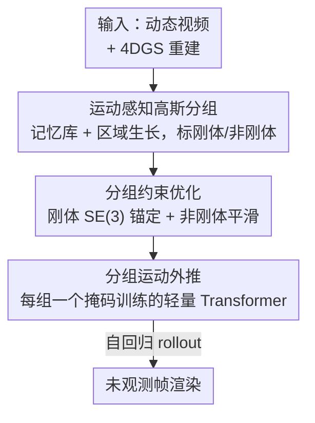

# Space-Time Forecasting of Dynamic Scenes with Motion-aware Gaussian Grouping

**会议**: CVPR 2026  
**论文**: [CVF Open Access](https://openaccess.thecvf.com/content/CVPR2026/html/Lee_Space-Time_Forecasting_of_Dynamic_Scenes_with_Motion-aware_Gaussian_Grouping_CVPR_2026_paper.html)  
**代码**: 无  
**领域**: 3D视觉  
**关键词**: 4D高斯泼溅, 动态场景预测, 运动分组, 长时外推, 刚体/非刚体约束

## 一句话总结
MoGaF 在 4D Gaussian Splatting 上把高斯按物体级运动分组并标注刚体/非刚体，再分组施加运动约束优化、用每组一个轻量 Transformer 自回归外推未来运动，从而把"只能内插已观测帧"的动态重建推进到物理一致的长时场景预测。

## 研究背景与动机

**领域现状**：3D/4D Gaussian Splatting 让从手持视频重建动态场景成为可能，能实时渲染高保真画面。但现有方法绝大多数只做**内插**——在已观测的时间窗内重建运动，渲染训练帧之间的中间状态。

**现有痛点**：真正有用的是**外推**（forecast）：机器人决策、自动驾驶都需要预判未观测的未来运动。可现有路线都不行——2D 视频预测方法只能固定视角生成、复杂场景几何不一致；3D 重建方法本质是内插的，一旦把时间推到训练范围之外，运动轨迹要么"冻住"、要么"塌缩"。最接近的 GaussianPrediction (GSPred) 虽然加了显式运动建模，但仍只擅长短时预测，长时严重退化。

**核心矛盾**：长时预测失败有两层根因。**表示层**——每个高斯各自独立运动，缺乏物体级约束，空间不连贯的运动会随时间累积漂移；**架构层**——预测器都是短时模型，长 rollout 下产生冻结或塌缩的轨迹。

**本文目标**：在 4DGS 上实现场景级、物理一致的长时外推，既要保住刚体的整体结构，又要让非刚体局部形变平滑连贯。

**切入角度**：作者的关键观察是——一个动态场景里的高斯不该被当成一盘散沙，而应按"运动模式一致"聚成物体级的组；同一个组共享运动规律，外推时就能稳定。于是把"分组—约束—预测"三件事串成一条管线。

**核心 idea**：用**运动感知的高斯分组**把场景拆成刚体/非刚体物体组，**分组施加类型化运动约束**得到结构化 4D 表示，再**每组独立用轻量预测器外推**未来运动。

## 方法详解

### 整体框架
MoGaF 输入一段随手拍的动态视频 $\{I_t\}_{t=1}^{T}$，目标是渲染出未观测时刻（$t>T$）的新帧。它建立在 4DGS 表示之上（每个高斯有标准空间参数 $\{\mu, R, s, o, c\}$，运动由 $B$ 个共享运动基 $\{T^{(b)}_{c\to t}\}$ 加权混合表示），整条管线分三个串行阶段：先把高斯**按运动分组并标刚体/非刚体**，再**分组做约束优化**得到物理结构化的 4D 表示，最后**每组各训一个轻量预测器**自回归外推未来运动并渲染。三个阶段层层递进——分组给优化和预测提供物体级单元，优化让组内运动干净一致，预测才能稳定地把运动推到观测窗之外。

### 关键设计

**1. 运动感知高斯分组：把散乱高斯聚成刚体/非刚体物体组**

痛点直指"表示层"——高斯各自为政导致运动累积漂移。MoGaF 借鉴静态分组方法 Gaga 的记忆库思想，但要处理动态表示并显式区分运动类型。每组记为 $M^{(k)}=(G^{(k)}, \tau^{(k)})$，其中 $\tau^{(k)}\in\{0,1\}$ 标注非刚体(0)/刚体(1)。流程先用一个 grounded 分割模型对视频出 $K$ 个物体掩码及刚性标签，再找出渲染每个掩码区域、沿视线方向最靠前的高斯作为可靠种子。

作者发现，若像静态方法那样简单地"把投影落进掩码 $M^{(k)}_t$ 的形变高斯都归到该组"（式 $G^{(k)}_t=\{g\in\mathcal{G}\mid \text{Proj}(g_t)\in M^{(k)}_t\}$），在遮挡或不同物体高斯重叠时会大量误分组。因此改用**迭代式区域生长**：每个高斯用紧凑时空特征 $f_g=[\mu_{c,g}, w'_g]$ 表示（标准空间均值 + PCA 降维后的运动系数），在关键帧间交替做"前向高斯播种"和"特征空间扩张"——把满足 $|f_g-f_{g'}|<\epsilon_r$ 的邻近高斯并入组，自适应阈值取组内 KNN 距离均值的 $\alpha$ 倍。这个交替循环既抓住了空间位置又抓住了运动相似性，得到比简单扩展和单帧掩码区域生长都更完整可靠的物体级运动组。

**2. 分组约束优化：刚体共享 SE(3)、非刚体局部平滑**

分好组后，按刚性标签 $\tau^{(k)}$ 对组内高斯施加**类型化**的运动正则，这是减少漂移、提升时间一致性的关键。对刚体组（$\tau^{(k)}=1$），强制组内所有高斯共享同一个 SE(3) 变换 $\Phi^{(k)}_t=[R^{(k)}_{c\to t}\mid t^{(k)}_{c\to t}]$，把标准空间均值映到 $t$ 时刻：$\Phi^{(k)}_t(g)=R^{(k)}_{c\to t}\mu_{c,g}+t^{(k)}_{c\to t}$；刚体锚定损失度量每个高斯学到的运动与组级刚体变换的偏差：

$$\mathcal{L}^{(k)}_{\text{rigid}}=\sum_t\sum_{g\in G^{(k)}}\big\|\mu_{t,g}-\Phi^{(k)}_t(g)\big\|_2^2$$

对非刚体组（$\tau^{(k)}=0$），每个高斯有可学运动系数 $w_g\in\mathbb{R}^B$，施加空间平滑正则让相邻高斯的运动系数一致：$\mathcal{L}^{(k)}_{\text{nr}}=\sum_{g\in G^{(k)}}\sum_{g'\in\text{NN}(g)}\|w_g-w_{g'}\|_2^2$。总运动目标按刚性标志加权两项：$\mathcal{L}_{\text{motion}}=\sum_k[\tau^{(k)}\mathcal{L}^{(k)}_{\text{rigid}}+(1-\tau^{(k)})\mathcal{L}^{(k)}_{\text{nr}}]$。这样刚体保持整体结构、非刚体保持局部光滑，比对所有高斯一视同仁的优化更贴合真实物理。

**3. 分组掩码外推：每组一个轻量 Transformer，靠掩码训练稳住长时**

直接解决"架构层"短时退化。每个高斯 $t$ 时刻运动由 SE(3) 变换 $T_{t,g}=[R_{t,g}\mid\mu_{t,g}]$ 表示，预测器吃优化后的运动序列 $\{T_{t,g}\}_{t=0}^{T}$，自回归地用最近 $T-1$ 帧（含已预测帧）滚动生成后续时刻。预测器是个**很浅**的 Transformer 编码器（单层、8 头、32 维嵌入、64 维 FFN）。两点关键：其一，**每个运动组各训一个独立预测器**，把不同物体异质的运动解耦，组内共享一致的时间模式，预测更稳更准；其二，借鉴 NLP 的掩码语言建模，引入**段级掩码训练**——遮住连续时间片段逼模型从上下文推断缺失动态，掩码比例在训练中逐步退火以匹配推理条件，显著提升长时鲁棒性。训练目标含运动重建损失 $\mathcal{L}^{(k)}_{\text{pred}}$ 和加速度正则 $\mathcal{L}^{(k)}_{\text{acc}}=\frac{1}{|G^{(k)}|}\sum_g\|\hat\mu_{T,g}-2\mu_{T-1,g}+\mu_{T-2,g}\|_2^2$（二阶差分约束物理平滑），合为 $\mathcal{L}^{(k)}_{\text{group}}=\mathcal{L}^{(k)}_{\text{pred}}+\lambda_{\text{acc}}\mathcal{L}^{(k)}_{\text{acc}}$。

### 损失函数 / 训练策略
重建骨干用 Shape-of-Motion (SoM) 做标准空间与运动参数化；分组复用 Gaga 官方实现并集成。优化阶段以 $\mathcal{L}_{\text{motion}}$ 约束刚体/非刚体；预测阶段每组独立用 $\mathcal{L}^{(k)}_{\text{group}}$ 训练。评测两种观测比例：80%（外推剩余 20%）和更难的 60%（外推剩余 40%）。

## 实验关键数据

### 主实验

iPhone 真实数据集（80% 观测外推 20%，⚠️ GSPred-SoM† / ODE-GS-SoM† 为在 SoM-4DGS 上的复现 baseline）平均结果：

| 方法 | mPSNR↑ | mSSIM↑ | mLPIPS↓ |
|------|--------|--------|---------|
| GSPred | 13.76 | 0.4699 | 0.4757 |
| GSPred-SoM† | 14.99 | 0.6405 | 0.4482 |
| ODE-GS-SoM† | 14.66 | 0.6355 | 0.4597 |
| **MoGaF (Ours)** | **15.58** | 0.6395 | **0.4227** |

D-NeRF 合成数据集（60% 观测外推 40%）平均结果，MoGaF 在大多数场景超过 GSPred，Lego 场景提升尤为夸张（GSPred 几乎失败）：

| 方法 | PSNR↑ | SSIM↑ | LPIPS↓ | Lego PSNR↑ |
|------|-------|-------|--------|------------|
| GSPred | 21.78 | 0.9011 | 0.0919 | 12.65 |
| **Ours** | **23.37** | **0.9147** | **0.0746** | **21.61** |

### 消融实验

| 配置 | 3D-EPE↓ | δ.10 3D↑ | 2D-AJ↑ | OA↑ | 说明 |
|------|---------|----------|--------|-----|------|
| w/o 分组 | 0.296 | 35.6 | 17.1 | 64.1 | 去掉分组优化+预测，所有高斯共用单一预测器 |
| **MoGaF** | **0.236** | **44.8** | **22.5** | **80.1** | 完整模型 |

| 配置 | PSNR↑ | SSIM↑ | LPIPS↓ | 说明 |
|------|-------|-------|--------|------|
| w/o 掩码 | 24.68 | 0.9283 | 0.0551 | 预测器不用掩码训练 |
| **Ours** | **25.87** | **0.9357** | **0.0491** | 段级掩码训练 |

### 关键发现
- **分组是地基**：去掉分组后 3D 跟踪 EPE 从 0.236 恶化到 0.296、遮挡精度 OA 从 80.1 掉到 64.1，证明物体级结构对物理一致、时间连贯的长时预测至关重要。
- **掩码训练稳长时**：浅 Transformer 在全观测序列上易过拟合，段级掩码逼它关注内在运动线索，PSNR +1.19、LPIPS 明显下降，长 horizon 鲁棒性提升。
- **越长时优势越大**：60% 观测（外推 40%）这种更难设定下 MoGaF 对 GSPred 的领先比 80% 设定更显著，正好打在 baseline 的软肋（长时塌缩）上。

## 亮点与洞察
- **把"分组"从静态搬到动态并赋予物理语义**：Gaga 的记忆库本是静态 3DGS 分割工具，MoGaF 用时空特征 $[\mu_c, w']$ 把它扩到 4DGS，还顺手给每组打上刚体/非刚体标签——分组不只是为分割，而是为下游运动约束服务，这个"分组即物理先验"的串联很巧。
- **类型化运动约束**：刚体共享 SE(3)、非刚体局部平滑，用一个 $\tau^{(k)}$ 开关统一进总损失，简洁地把"该硬的硬、该软的软"编码进优化。
- **MLM 思想迁移到运动外推**：把掩码语言建模搬来做运动序列的段级掩码训练，是一个能迁移的 trick——任何自回归轨迹预测都可借此抑制过拟合、增强长时外推。

## 局限与展望
- **强依赖上游分割与重建质量**：分组建立在 grounded 分割掩码 + SoM 重建之上，掩码错或重建差会直接污染后续优化和预测；论文也承认分组细节放在补充材料。
- **刚体/非刚体二分过粗**：真实物体常是铰接式（部分刚体+关节），仅用一个 0/1 标签难以刻画，⚠️ 文中未展开处理铰接体的方案。
- **每组独立预测器的可扩展性**：组数多时要训很多个轻量预测器，组间交互（如碰撞、接触）也未显式建模，复杂多物体交互场景下可能受限。
- **评测规模有限**：主要在 iPhone 与 D-NeRF 上验证，未涉及大尺度街景/自动驾驶这类作者动机里提到的应用。

## 相关工作与启发
- **vs GSPred [50]**：GSPred 用图网络预测关键点运动再传播到所有高斯，是短时预测器，长 rollout 会让动态物体"冻住"；MoGaF 做物体级分组外推、保住刚体与非刚体几何，长时高保真，二者在 D-NeRF Lego 上差距尤其悬殊。
- **vs ODE-GS [36]（并发工作）**：ODE 用神经微分方程建模连续高斯运动；MoGaF 走离散的分组 + 掩码 Transformer 路线，在 iPhone 真实数据上 mPSNR/mLPIPS 更优。
- **vs Gaga [26]**：Gaga 是静态场景的 3DGS 分割（记忆库 + IoU 合并），难直接扩到有时间运动的动态场景；MoGaF 用交替时空区域生长 + 关键帧配准把它扩到 4DGS，得到时空一致的运动组。

## 评分
- 新颖性: ⭐⭐⭐⭐ 把"动态高斯分组 + 类型化约束 + 分组掩码外推"串成首个面向长时外推的统一管线，思路清晰且有针对性。
- 实验充分度: ⭐⭐⭐⭐ 真实+合成双数据集、两种观测比例、跟踪指标与掩码两组消融到位；但缺大尺度/驾驶场景与更多 baseline。
- 写作质量: ⭐⭐⭐⭐ 三阶段动机—方法对应清晰，公式与算法完整；部分细节推给补充材料。
- 价值: ⭐⭐⭐⭐ 把动态 3D 重建从内插推到可外推，对机器人/驾驶的未来运动预判有现实意义。

<!-- RELATED:START -->

## 相关论文

- [\[CVPR 2026\] Efficiently Reconstructing Dynamic Scenes One D4RT at a Time](efficiently_reconstructing_dynamic_scenes_one_d4rt_at_a_time.md)
- [\[CVPR 2026\] MoRGS: Efficient Per-Gaussian Motion Reasoning for Streamable Dynamic 3D Scenes](morgs_efficient_per-gaussian_motion_reasoning_for_streamable_dynamic_3d_scenes.md)
- [\[CVPR 2026\] MotionScale: Reconstructing Appearance, Geometry, and Motion of Dynamic Scenes with Scalable 4D Gaussian Splatting](motionscale_reconstructing_appearance_geometry_and_motion_of_dynamic_scenes_with.md)
- [\[CVPR 2026\] Point4Cast: Streaming Dynamic Scene Reconstruction and Forecasting](point4cast_streaming_dynamic_scene_reconstruction_and_forecasting.md)
- [\[CVPR 2026\] SpeeDe3DGS: Speedy Deformable 3D Gaussian Splatting with Temporal Pruning and Motion Grouping](speede3dgs_speedy_deformable_3d_gaussian_splatting_with_temporal_pruning_and_mot.md)

<!-- RELATED:END -->
