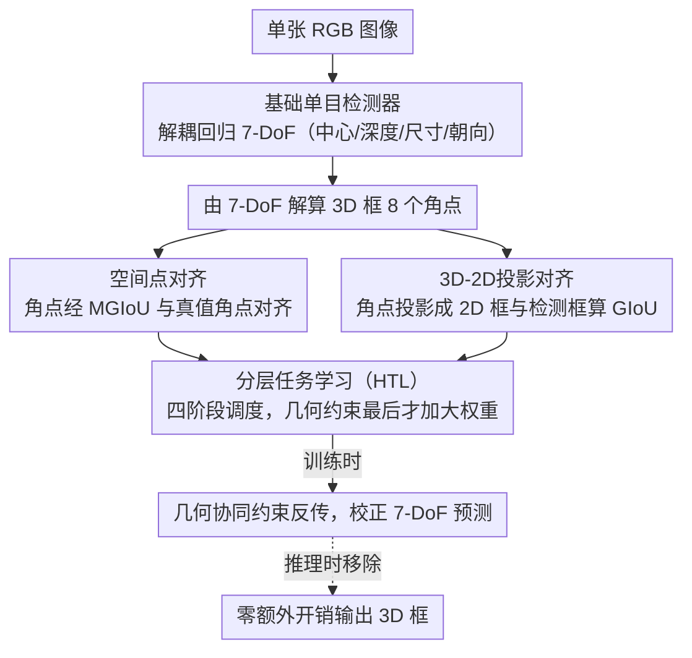

# SPAN: Spatial-Projection Alignment for Monocular 3D Object Detection

**会议**: CVPR2026  
**arXiv**: [2511.06702](https://arxiv.org/abs/2511.06702)  
**代码**: [项目主页](https://wyfdut.github.io/SPAN/)  
**领域**: 3D视觉  
**关键词**: 单目3D检测, 几何一致性, 空间对齐, 投影约束, 即插即用

## 一句话总结

提出 Spatial-Projection Alignment (SPAN)，通过3D角点空间对齐和3D-2D投影对齐两个几何协同约束，配合分层任务学习策略，作为即插即用模块提升任意单目3D检测器的定位精度。

## 背景与动机

1. **单目3D检测的核心挑战**：从单张RGB图像推断完整的3D空间信息是病态问题，缺乏直接的深度线索，但成本低、部署灵活，是自动驾驶和机器人感知的重要方向。
2. **解耦回归范式的局限**：现有方法将3D框的7个自由度参数（中心坐标、深度、尺寸、旋转角）拆分到不同分支独立预测，虽然简化了学习目标，但忽略了属性间的几何协同约束。
3. **几何一致性缺失**：独立预测各属性容易违背空间关系的内在约束，导致预测的3D框无法与真值在空间上完全对齐，降低了定位精度。
4. **已有几何约束方法的不足**：Deep3DBox 等通过超定方程组求解深度，对2D框微小扰动极其敏感；Homography Loss 缺乏细粒度校正；3D Copy-Paste 等数据增强方案未严格验证3D-2D投影一致性。
5. **MonoDGP 的局限**：虽然引入几何误差先验校正深度偏差，但仍独立回归各属性，缺乏统一的一致性约束。
6. **训练稳定性问题**：直接在训练早期施加高阶几何约束，由于初始预测噪声大，会导致训练不稳定，需要合理的调度策略。

## 方法详解

### 整体框架

单目3D检测的主流做法是把3D框的7个自由度拆到不同分支独立回归，简化了学习却丢掉了属性之间的几何约束——各分支各自“最优”，拼起来却不构成一个与真值对齐的立方体。SPAN 不改检测器架构，只在训练时给原有分支补两个几何协同约束损失：一个在3D空间里约束角点对齐，一个在2D图像里约束投影嵌合；再用分层任务学习（HTL）按训练进度动态给这两个约束加权，确保它们在3D预测足够稳定后才真正发力。推理时这些约束全部移除，零额外开销。

### 关键设计

**1. 空间点对齐：直接逼角点对齐，而非各自回归参数**

解耦回归的根子问题是中心、深度、尺寸、朝向各管各的，谁都不为“八个角点是否落到真值上”负责。空间点对齐把约束直接打在角点上：先从预测的7-DoF参数（中心坐标、深度、尺寸、旋转角）算出3D框的8个角点 $\{P_i\}_{i=1}^{8}$，再用 MGIoU（Marginalized GIoU）和真值角点对齐。MGIoU 的巧妙在于不去算任意朝向3D框的精确交集（复杂度极高），而是把对齐分解成沿3个面法向量方向的1D GIoU——对每个法向量 $\mathbf{a}_k$ 把预测与真值角点投影到该方向算1D区间 GIoU，三者取均值。损失为 $\mathcal{L}_{3Dcorner} = (1 - \text{MGIoU}^{3D}) / 2$。和 ROI-10D / MonoDIS 把角点回归当辅助任务不同，这里是直接约束主分支的7-DoF参数，中心偏移、尺寸误差、朝向误差都会被角点偏差一并捕捉。

**2. 3D-2D投影对齐：用透视投影的物理事实约束深度**

深度估计稍有偏差，3D框投影到图像上就会和2D检测框错位，而2D框恰恰是图像里最可靠的监督。投影对齐把这条物理事实写成损失：把预测3D框的8个角点经相机模型投影到图像平面 $u_i = f_u \cdot x_i / z_i + c_u$，取投影点的最小水平外接矩形 $\mathcal{B}_{proj}^{2D}$，再和2D检测框 $\mathcal{B}_{gt}^{2D}$ 算2D GIoU，得到 $\mathcal{L}_{proj} = 1 - \text{GIoU}^{2D}$。它本质是 Deep3DBox 那套“2D框反推3D”约束的可微软化版——后者用超定方程硬解、对2D框微小扰动极敏感，这里改成可微的 GIoU 损失，既稳又不增加推理模块。

**3. 分层任务学习（HTL）：让几何约束在该发力时才发力**

消融里能看到一个反直觉现象：单独加任一几何约束、不配 HTL，性能反而下降。原因是训练早期3D预测噪声极大，此时角点、投影全是错的，强行对齐只会把优化带偏。HTL 把训练拆成4个阶段，按任务依赖关系逐级解锁，几何对齐排在最后、等所有3D属性回归稳定后才加大权重：

| 阶段 | 任务 | 说明 |
|------|------|------|
| Stage 1 | 2D检测 | 分类、2D框定位、投影中心回归 |
| Stage 2 | 3D尺寸与旋转角 | 依赖Stage 1的2D线索初始化 |
| Stage 3 | 深度估计 | 依赖Stage 1+2的几何关系 |
| Stage 4 | 空间-投影对齐 | 依赖所有3D属性回归稳定后 |

### 损失函数

总损失含四部分：2D回归损失 $\mathcal{L}_{2D}$、3D回归损失 $\mathcal{L}_{3D}$、深度图损失 $\mathcal{L}_{dmap}$，以及上面两个几何约束损失，约束权重取 $\lambda_c = \lambda_p = 1.0$。

## 实验关键数据

### KITTI Car类别主实验

在KITTI测试集上（基于MonoDGP baseline）：

| 方法 | Easy | Mod. | Hard |
|------|------|------|------|
| MonoDGP | 26.35 | 18.72 | 15.97 |
| MonoDGP + SPAN | **27.02** | **19.30** | **16.49** |
| 提升 | +0.67 | +0.58 | +0.52 |

在KITTI验证集上：

| 方法 | Easy | Mod. | Hard |
|------|------|------|------|
| MonoDGP | 30.76 | 22.34 | 19.02 |
| MonoDGP + SPAN | **30.98** | **23.26** | **20.17** |
| 提升 | +0.22 | +0.92 | +1.15 |

### 多基线验证（KITTI val，Car $AP_{3D}$）

| Baseline | Mod. 提升 | Hard 提升 |
|----------|----------|----------|
| MonoDETR + SPAN | +0.61 | +0.70 |
| MoVis + SPAN | +0.67 | +0.82 |
| MonoDGP + SPAN | +0.92 | +1.15 |

### 消融实验

| $\mathcal{L}_{3Dcorner}$ | $\mathcal{L}_{proj}$ | HTL | Mod. |
|---|---|---|---|
| ✗ | ✗ | ✗ | 22.34 |
| ✓ | ✗ | ✗ | 21.92（下降） |
| ✗ | ✓ | ✗ | 21.80（下降） |
| ✗ | ✗ | ✓ | 22.56 |
| ✓ | ✓ | ✓ | **23.26** |

**关键发现**：单独使用任一几何约束而不配合 HTL 反而降低性能，验证了分层训练策略的必要性。

## 亮点

1. **即插即用**：无需修改检测器架构，不增加推理开销，可直接嵌入任意单目3D检测器的训练流程
2. **几何协同约束**：首次将空间对齐和投影对齐在统一框架中联合优化，弥补了解耦回归范式的核心缺陷
3. **MGIoU 的巧妙使用**：将3D框对齐分解为3个1D投影问题，避免了计算旋转3D框精确交集的高复杂度
4. **HTL 策略的必要性**：实验充分证明了几何约束需要配合分阶段训练才能发挥作用，直接施加反而有害
5. **Hard级别提升最显著**：在困难样本（远处、遮挡严重）上提升最大，说明几何约束对深度模糊和定位困难的场景最有效

## 局限与展望

1. **对2D检测噪声敏感**：当2D框扰动超过15px时性能急剧下降，在实际部署中2D检测器质量是瓶颈
2. **仅在KITTI上主要验证**：虽然附录有Waymo结果，但主实验仅限KITTI，数据规模和场景多样性有限
3. **BEV指标偶有下降**：测试集BEV的Mod./Hard指标略有下降（-0.40/-0.23），说明空间对齐和BEV投影存在一定矛盾
4. **仅考虑yaw角旋转**：假设物体仅绕Y轴旋转，对非平坦路面或倾斜物体适用性受限
5. **训练成本增加**：HTL分阶段策略增加了训练调参复杂度，需额外确定各阶段切换时机
6. **尚未扩展到多视角**：作者提到未来希望扩展到多视角3D感知，目前仅限单目场景

## 与相关工作的对比

| 方法 | 约束类型 | 局限 |
|------|---------|------|
| Deep3DBox | 2D→3D投影方程求解 | 对2D框噪声极其敏感 |
| Homography Loss | 全局单应性约束 | 缺乏细粒度校正 |
| ROI-10D / MonoDIS | 角点回归作为辅助任务 | 未直接约束主分支参数 |
| MonoDGP | 几何误差校正深度公式 | 仍独立回归各属性 |
| **SPAN** | **空间+投影联合约束** | **统一框架,即插即用** |

## 评分

- 新颖性: ⭐⭐⭐ — 核心思想（空间对齐+投影对齐）直觉自然，MGIoU和HTL均借鉴已有工作，创新在于组合方式
- 实验充分度: ⭐⭐⭐⭐ — 三个baseline验证、完整消融、噪声鲁棒性分析、行人/骑行者类别、权重敏感性分析
- 写作质量: ⭐⭐⭐⭐ — 动机清晰，公式推导完整，图表丰富直观
- 价值: ⭐⭐⭐⭐ — 即插即用的实用性强，对单目3D检测领域有实际指导意义

<!-- RELATED:START -->

## 相关论文

- [\[CVPR 2026\] Towards Intrinsic-Aware Monocular 3D Object Detection](towards_intrinsic-aware_monocular_3d_object_detection.md)
- [\[CVPR 2026\] Unleashing the Power of Chain-of-Prediction for Monocular 3D Object Detection](unleashing_the_power_of_chain-of-prediction_for_monocular_3d_object_detection.md)
- [\[CVPR 2026\] MonoSAOD: Monocular 3D Object Detection with Sparsely Annotated Label](monosaod_monocular_3d_object_detection_with_sparsely_annotated_label.md)
- [\[AAAI 2026\] MonoCLUE: Object-Aware Clustering Enhances Monocular 3D Object Detection](../../AAAI2026/3d_vision/monoclue_object-aware_clustering_enhances_monocular_3d_object_detection.md)
- [\[CVPR 2025\] MonoPlace3D: Learning 3D-Aware Object Placement for 3D Monocular Detection](../../CVPR2025/3d_vision/monoplace3d_learning_3d-aware_object_placement_for_3d_monocular_detection.md)

<!-- RELATED:END -->
