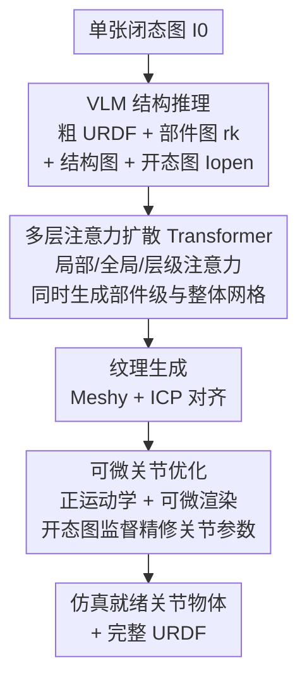

# SPARK: Sim-ready Part-level Articulated Reconstruction with VLM Knowledge

**会议**: CVPR 2026  
**论文**: [CVF Open Access](https://openaccess.thecvf.com/content/CVPR2026/html/He_SPARK_Sim-ready_Part-level_Articulated_Reconstruction_with_VLM_Knowledge_CVPR_2026_paper.html)  
**代码**: 无（仅有项目页 https://heyumeng.com/SPARK-web/）  
**领域**: 3D视觉  
**关键词**: 关节物体重建, URDF估计, 扩散Transformer, VLM先验, 可微正运动学

## 一句话总结
SPARK 从单张 RGB 图像出发，先用 VLM 解析出粗 URDF 参数 + 逐部件参考图 + 开态图，再用带多层注意力的扩散 Transformer 同时生成部件级与整体网格，最后用可微正运动学优化关节参数，端到端造出可直接进物理引擎的"仿真就绪"关节物体，URDF 各项误差比此前方法降低 60%+。

## 研究背景与动机
**领域现状**：关节物体（抽屉、柜门、笔记本电脑等带活动部件的资产）是具身智能、机器人操作和场景理解的刚需，但手工建模部件层级和运动结构极其费力。生成式 3D 模型（TripoSG、TRELLIS、Hunyuan3D）能从图像直接造高保真网格，部件级生成（PartCrafter、OmniPart、AutoPartGen）也能切出语义部件。

**现有痛点**：现有生成模型造出的网格大多是"融合在一起"的整块，难以复用于操作/动画/仿真；而部件级生成虽然几何质量好，但它的分割只看外观（appearance-driven），完全忽略底层运动结构，导致部件**没有运动学一致性**——经常把一个可动链拆成几块（过分割），或把该分开的两块粘成一块（欠分割）。

**核心矛盾**：要造"仿真就绪"的关节物体，需要同时拿到三样东西——干净的部件级几何、整体一致的网格、以及准确的 URDF 运动参数（关节类型/轴/原点/限位）。已有工作要么需要模板、要么需要多视角/多状态图像、要么需要显式输入运动学图，**没有一个能只凭一张图就把几何和 URDF 一起搞定**。纯数据驱动的端到端 URDF 预测又因为缺乏运动学引导，关节参数估计很不准。

**本文目标**：仅从一张图像，重建出运动学部件级关节物体 + 完整 URDF 参数。

**切入角度**：VLM 既懂语义（这是抽屉、那是门、门往左开）又懂结构（部件父子层级），正好可以补上"运动结构"这块外观分割看不到的信息；而几何细节交给擅长形状生成的扩散 Transformer，关节数值再用可微优化精修。

**核心 idea**：用 VLM 先验（部件图 + 结构图 + 开态图）去引导扩散 Transformer 做带运动学意识的部件生成，再用可微正运动学在开态图监督下精修关节参数——把"语义结构推理"和"几何/数值生成"分工协作。

## 方法详解
### 整体框架
输入是单张闭态图像 $I_0$，输出是一组部件级网格 $\{M_k\}_{k=1}^{K}$ 组成的整体网格 $M$，外加分层 URDF 参数 $u=\{u_\ell, u_j\}$（$u_\ell$ 是链接节点，$u_j$ 含关节类型 $u_j^{type}$、轴 $u_j^{axis}$、原点 $u_j^{origin}$、限位 $u_j^{limit}$）。整条管线分三段：先让 VLM 做结构推理产出粗 URDF + 部件参考图 + 开态图；再用扩散 Transformer 在局部/全局/层级三重注意力下同时合成部件与整体网格、贴纹理；最后用可微正运动学在开态图监督下精修关节参数。

### 关键设计

**1. VLM 引导的结构推理：用语言模型补上外观分割看不见的运动结构**

这一步解决"部件分割只看外观、没有运动学意识"的痛点。SPARK 让 VLM（GPT-4o 抽部件标签和关节元数据）先推断部件层级——有几个链接、链接间怎么连、有哪些关节——并据此实例化一个标准 URDF 模板：声明链接 $u_\ell$、父子关系、关节规格 $u_j$。关键在于把关节属性拆成**离散**和**连续**两类区别对待。离散属性（类型 $u_j^{type}\in\{$fixed, revolute, prismatic$\}$、轴 $u_j^{axis}$）从预定义字典里选，保证语义和方向一致：轴只能取 6 个规范单位方向（前 $(0,0,1)$、后 $(0,0,-1)$、上下左右），平动关节直接对应平移方向，转动关节先定旋转轴再定符号（顺时针为负、逆时针为正，如门往左开就是绕 $y$ 轴顺时针 $(0,-1,0)$）；限位下界恒为 0，上界按大范围运动（门/抽屉）和小范围运动（按钮）取预设值。连续属性（关节原点 $u_j^{origin}$、限位）由 VLM 粗估一个初值。拿到粗 URDF 后，再按语义标签（drawer/door/frame）生成逐部件参考图 $\{r_k\}_{k=1}^{K}$，并按父子关系搭出结构图——这两样就是下一步部件生成的引导信号。把离散属性约束到字典里，避免了 VLM 直接吐连续数值时的乱跳，是后面优化能收敛的前提。

**2. 多层注意力扩散 Transformer：一次性生成运动学一致的部件与整体网格**

这一步把 VLM 给的局部/全局/结构三路引导真正注入到几何生成里。SPARK 用一个受 TripoSG 启发的扩散 Transformer（DiT），对每个部件图 $r_k$ 和复制的全局图 $I_0$ 用共享 DINOv2 编码出局部嵌入 $E_k^{loc}$ 和全局嵌入 $E^{glob}$。DiT 自带可学习几何 latent token，$K$ 个部件各 $N$ 个 token 堆成 $Z=[Z_1;\dots;Z_K]\in\mathbb{R}^{NK\times C}$。去噪时交替做局部和全局交叉注意力：局部块只让每个部件 attend 自己的视觉参考（局部图 $A_i^{local}=\text{softmax}(Z_iZ_i^\top/\sqrt{C})$），全局块注入全物体上下文（$A^{global}=\text{softmax}(ZZ^\top/\sqrt{C})$）。真正体现运动结构的是**层级注意力**：用父索引映射 $\pi$ 定义链接层级，子 token 先只 attend 父 token

$$A_{uv}^{c\to p}=\frac{\exp(Z_uZ_v^\top/\sqrt{C})\,\mathbb{1}[v\in P(u)]}{\sum_{v'}\exp(Z_uZ_{v'}^\top/\sqrt{C})\,\mathbb{1}[v'\in P(u)]},\quad Z'=Z+A^{c\to p}Z$$

再用更新后的 $Z'$ 让父 token 回查子 token，得 $Z''=Z'+A^{p\to c}Z$，形成双向父子信息交换。此外用双重位置嵌入（可学习的部件相对索引 emb + 绝对位置 emb）把 latent 序列绑定到语义部件，训练时随机打乱 (部件图, 部件网格) 对，强制"链接 0 永远是链接 0"的顺序不变条件，避免推理时部件错位。这套设计让一个网络同时输出部件分解和整体装配，且分解天然带运动学语义——这是和"先生成整块再切割"路线最大的区别。

**3. 可微关节优化：用开态图把关节数值真正"对齐"到物理一致**

VLM 粗估的关节参数往往不够准，纯数据驱动也缺运动学引导。SPARK 分两路精修。离散参数（轴 $u_j^{axis}$、类型 $u_j^{type}$）用**特征注入**策略，把粗 URDF + 输入图一起喂回 VLM 让它重新预测一遍。连续参数（原点 $u_j^{origin}$、转角 $\Delta\theta$）则上可微优化：令可学习参数 $\xi=(\Delta t,\Delta\theta)$（$\Delta t\in\mathbb{R}^3$ 是父坐标系下关节原点，$\Delta\theta$ 是绕预定义轴的旋转角），它们定义一个 $SO(3)$ 刚体旋转决定子链接的局部运动。从闭态物体 $M^0$ 出发，可微正运动学 $G(\cdot)$ 算出变换后物体 $M^t=G(M^0,\Delta t,\Delta\theta)$，固定相机下用可微渲染器得到软轮廓 $I^{sil}$，再去对齐 VLM 生成的开态参考图 $I_{open}$：

$$\min_{\xi}\ L_{total}=L_{pixel}(I^{sil},I_{open})+L_{reg}(\xi)$$

其中 $L_{pixel}$ 由区域损失 $L_{region}=1-\frac{2\langle I^{sil},I_{open}\rangle}{\|I^{sil}\|+\|I_{open}\|}$（强调区域重叠）和边缘损失 $L_{edge}=\||\nabla I^{sil}|-|\nabla I_{open}|\|$（保边界锐度）组成，正则项 $L_{reg}=\lambda_t\|\Delta t\|_2^2+\lambda_\theta\|\Delta\theta\|_2^2$ 约束关节平移和旋转不偏离初值、防止不真实运动。用开态图当监督信号，相当于让物体"开一下门给你看"，再据此反推关节怎么转最合理——这是把外观证据闭环回几何参数的关键。

### 损失函数 / 训练策略
部件生成用 Rectified Flow 匹配训练：VAE 把每个真值部件网格编码为 latent $z_{k,0}$，采样基 latent $z_{k,1}\sim\mathcal{N}(0,I)$，整物体共享时间步 $t$，插值 $x_k(t)=(1-t)z_{k,0}+tz_{k,1}$，目标速度场 $U^\star=Z_0-Z_1$，损失为 $L_{RF}=\mathbb{E}[w(t)\sum_k\alpha_k\|v_\theta(x_k(t),C,t)-u_k^\star\|_2^2]$。训练数据基于 PartNet-Mobility（2,347 个物体、46 类），针对其只有单一规范状态、且部分资产过分割的问题，按 URDF 链接关联**合并过分割网格**、并采样可行运动范围生成多姿态（如半开抽屉）做增广。在 4 张 H100 上 batch 48、学习率 $1\times10^{-4}$ 训 1000 epoch，约 60 小时。

## 实验关键数据

### 主实验
测试集取自 GAPartNet 的 100 张图、覆盖 25 个关节物体类别。形状重建用 Chamfer Distance（CD）和 F-Score 衡量；URDF 估计用 AxisErr / PivotErr / TypeErr。

**形状重建对比（Table 1）**：

| 方法 | CD↓ | F-Score@0.1↑ | F-Score@0.5↑ |
|------|------|------|------|
| PartCrafter | 0.4342 | 0.3600 | 0.8840 |
| OmniPart | 0.4971 | 0.1928 | 0.8469 |
| URDFormer | 1.0556 | 0.0438 | 0.1762 |
| **SPARK** | **0.3915** | **0.4151** | **0.8959** |

宽松阈值 F-Score@0.5 上和 PartCrafter/OmniPart 接近，但严格阈值 F-Score@0.1 上大幅领先（0.4151 vs 0.36），说明细粒度几何恢复更好。

**URDF 参数估计对比（Table 2）**：

| 方法 | AxisErr↓ | PivotErr↓ | TypeErr↓ |
|------|------|------|------|
| Articulate-Anything | 0.5491 | 0.3529 | 0.2500 |
| Articulate AnyMesh | 1.1834 | 0.9162 | 0.7000 |
| **SPARK** | **0.1577** | **0.1653** | **0.0500** |

三项误差都断崖式低于基线，尤其连续参数（轴、原点）因为有可微优化组件而恢复得准得多。

### 消融实验

**形状重建消融（Table 3）**：

| 配置 | CD↓ | F-Score@0.1↑ | F-Score@0.5↑ | 说明 |
|------|------|------|------|------|
| w/o Part Guidance | 0.4284 | 0.3755 | 0.8725 | 去掉部件引导，柜门会缺失 |
| w/o Data Aug. | 0.4200 | 0.3675 | 0.8883 | 去掉增广，过拟合到单一状态、混淆相似部件 |
| **Full** | **0.3959** | **0.4214** | **0.8934** | 完整模型 |

**URDF 估计消融（Table 4）**：

| 配置 | AxisErr↓ | PivotErr↓ | TypeErr↓ | 说明 |
|------|------|------|------|------|
| w/o Joint Optimization | 0.3148 | 0.2388 | 0.2000 | 去掉关节优化，活动部件错位/漂移 |
| **Full** | **0.1577** | **0.1653** | **0.0500** | 完整模型 |

### 关键发现
- 关节优化组件贡献最大：去掉后 AxisErr 从 0.1577 翻倍到 0.3148、TypeErr 从 0.05 涨到 0.20，关节轴和原点明显漂移——可微正运动学 + 开态监督是 URDF 精度的命门。
- 部件引导主要影响几何完整性：去掉后柜门等部件会整体缺失，说明 VLM 的部件图给了结构生成强先验。
- 数据增广解决"只有单一规范状态"的过拟合：没有它模型会把两扇相似柜门搞混。
- 对比基线的失败模式很有指示性：PartCrafter 常出悬浮/断裂部件、URDFormer 模板检索会认错部件类型、OmniPart 对分割噪声敏感导致遮挡区扭曲；URDF 侧检索式方法（Articulate-Anything/AnyMesh）会把冰箱侧面误判成门导致开合运动错乱。

## 亮点与洞察
- **离散/连续关节参数分治**：离散属性约束到 6 方向字典 + 类型枚举，连续属性交给可微优化——既挡住 VLM 直接吐数值的乱跳，又保留了梯度精修的精度，这种"先离散约束再连续优化"的拆法可迁移到任何带结构 + 数值的预测任务。
- **层级注意力把父子运动学结构编进几何生成**：双向 parent↔child 注意力 + 父索引映射，让 DiT 在生成几何时就"知道"哪块是哪块的子部件，分解天然带运动学语义，而不是先生成整块再硬切。
- **开态图当监督闭环**：用 VLM 生成"开门后长什么样"的开态图，再用可微渲染让物体真的开一下去对齐——把外观证据反向闭环到关节数值，比纯几何启发式选铰链点鲁棒得多。
- **打乱训练 + 双位置嵌入**强制顺序不变，解决了多部件生成里部件错位这个隐蔽但致命的工程问题。

## 局限性 / 可改进方向
- 作者承认目前只处理较简单的运动学，未来才扩展到多自由度关节、复合机构、闭链结构。
- 强依赖 VLM（GPT-4o + Gemini 2.5 Flash Image）的结构推理质量：若 VLM 数错部件数或认错父子关系，后续几何和 URDF 都会被带偏，全流程缺乏对 VLM 错误的兜底纠错。⚠️ 论文未给出 VLM 推理失败率的定量分析。
- 训练数据以 PartNet-Mobility 合成资产为主（46 类、2347 物体），in-the-wild 图像虽展示了结果但靠 VLM 先生成正视图再重建，对噪声/非正面输入的鲁棒性只有定性展示。
- 纹理用外部商业工具 Meshy + ICP 对齐，非端到端，纹理质量受第三方限制。
- 评测集仅 100 张图、25 类，规模偏小，强烈倾向室内家具类关节物体。

## 相关工作与启发
- **vs PartCrafter / OmniPart（部件级生成）**：它们用 DiT 部件 latent 或 2D 分割框引导同时生成部件，但分割纯看外观、缺运动学意识，常过/欠分割；SPARK 用 VLM 结构图 + 层级注意力注入父子运动结构，部件分解天然运动学一致。
- **vs URDFormer / Articulate-Anything（URDF 估计）**：URDFormer 靠模板检索易认错部件类型；Articulate-Anything 用视觉-语言程序合成但无几何精修、关节轴/原点偏差大。SPARK 用可微正运动学 + 开态监督把数值真正对齐物理，三项误差降 60%+。
- **vs Articulate AnyMesh / DreamArt（先重建后分割）**：它们显式用分割模型切 3D 表示，对分割质量和噪声铰链几何敏感；SPARK 端到端从图像一次性生成部件 + 整体，避开了"切割误差传播"。
- **启发来源**：借鉴 Articulate-Anything / DreamArt"先生成 URDF 代码再用 VLM 语义反馈/视频监督精修"的思路，把它落到"VLM 模板 + 可微运动学/渲染 + 合成开闭态图对"的精修范式。

## 评分
- 新颖性: ⭐⭐⭐⭐ 把 VLM 结构先验、层级注意力 DiT、可微关节优化三件套端到端串起来做单图 sim-ready 关节重建，组合新颖且落点实用
- 实验充分度: ⭐⭐⭐⭐ 形状 + URDF 双任务对比 + 两组消融 + 机器人下游应用，但评测集偏小、缺 VLM 失败率分析
- 写作质量: ⭐⭐⭐⭐ 方法分段清晰、公式完整，离散/连续分治讲得明白
- 价值: ⭐⭐⭐⭐⭐ 直接产出可进物理引擎的关节资产，对具身智能/机器人操作数据生产价值很高

<!-- RELATED:START -->

## 相关论文

- [\[CVPR 2026\] ART: Articulated Reconstruction Transformer](art_articulated_reconstruction_transformer.md)
- [\[CVPR 2026\] Part$^{2}$GS: Part-aware Modeling of Articulated Objects using 3D Gaussian Splatting](part2gs_part-aware_modeling_of_articulated_objects_using_3d_gaussian_splatting.md)
- [\[CVPR 2026\] UniPR: Unified Object-level Real-to-Sim Perception and Reconstruction from a Single Stereo Pair](unipr_unified_object-level_real-to-sim_perception_and_reconstruction_from_a_sing.md)
- [\[ICLR 2026\] PD²GS: Part-Level Decoupling and Continuous Deformation of Articulated Objects via Gaussian Splatting](../../ICLR2026/3d_vision/pd2gs_part-level_decoupling_and_continuous_deformation_of_articulated_objects_vi.md)
- [\[CVPR 2026\] SCAPO: Self-Supervised Category-Level Articulated Pose Estimation from a Single 3D Observation](scapo_self-supervised_category-level_articulated_pose_estimation_from_a_single_3.md)

<!-- RELATED:END -->
