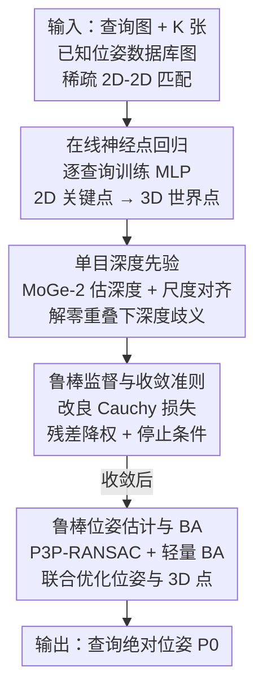

# Sparse-View Localization via Online Neural 3D Regression

**会议**: CVPR 2026  
**论文**: [CVF Open Access](https://openaccess.thecvf.com/content/CVPR2026/html/Dillen_Sparse-View_Localization_via_Online_Neural_3D_Regression_CVPR_2026_paper.html)  
**代码**: https://github.com/ludvigdillen/ON3R  
**领域**: 3D视觉  
**关键词**: 相机定位, 稀疏视图, 无结构定位, 在线神经回归, 单目深度先验

## 一句话总结
ON3R 针对"数据库图像几乎互不重叠（星型拓扑）、又没有预建 3D 地图"的极端稀疏视图定位场景，为每个查询图像**临时在线训练一个小 MLP**，把查询关键点回归成 3D 点（用数据库重投影残差 + 单目深度先验监督），再用 P3P-RANSAC + 轻量 BA 求绝对位姿，在 MegaDepth / Cambridge / 稀疏化 Aachen 上全面超过现有结构无关方法、甚至胜过结构化的 HLOC。

## 研究背景与动机
**领域现状**：相机定位（求一张查询图的 6-DoF 位姿）主流分两类。**结构化方法**（如 HLOC）先用 SfM 重建出显式 3D 点云，再做 2D-3D 匹配 + P3P-RANSAC，精度最高但要预建地图、存储和工程开销大、地图维护麻烦；**结构无关方法**（位姿回归 APR/RPR、运动平均、传递匹配等）不需要预建地图，但精度普遍偏低、长期被冷落。

**现有痛点**：现实里有大量"稀疏视图"场景——监控/工厂相机为省成本而稀疏布设、自主平台因存储受限只保留少量帧——此时数据库图像之间**视觉重叠极低甚至为零**。作者把这种结构称为**星型拓扑（star-topology）**：查询图与每张被检索的数据库图都有重叠，但数据库图彼此几乎不重叠。在这种数据上，结构化方法的三角化不可靠（连 3D 点都建不出来），变得很脆；现有结构无关方法虽能给出位姿但精度不够。

**核心矛盾**：星型拓扑下，单纯靠多视图三角化约束 3D 点是行不通的（数据库图之间没共视），而纯端到端位姿回归又缺少显式几何约束、精度上不去——既要"不依赖共视/预建地图"，又要"有显式几何监督"。

**本文目标**：在 $K\le 10$ 张低重叠数据库图、无预建 3D 地图的设定下，稳定估计查询图绝对位姿。

**切入角度**：作者观察到，即使数据库图之间重叠有限，**联合**地在所有数据库图上推理查询-数据库几何仍然有益；而神经网络在输入空间上的**平滑性**可以充当"软的几何先验"，在单视图约束下也能把深度推断得相对合理（类似场景坐标回归 SCR，但 SCR 是在视觉相似的图像块间平滑，ON3R 是在空间域平滑）。

**核心 idea**：不再预建 3D 地图、也不做脆弱的位姿回归，而是**为每个查询在线学一个 MLP**，把查询关键点显式回归到 3D 世界坐标，用数据库重投影残差 + 单目深度先验做显式几何监督，再走经典 P3P-RANSAC + BA 求位姿——把神经网络当成"在线、逐查询、带几何监督的隐式 3D 表示"。

## 方法详解

### 整体框架
ON3R 的输入是一张查询图、以及与它做过稀疏匹配的 $K$ 张**已知位姿/内参**的数据库图（只用 2D-2D 稀疏匹配，不用任何视觉特征向量），输出是查询图的 6-DoF 绝对位姿 $P_0=[R_0|t_0]$。整条管线是一个"每查询从头训练 → 收敛后求位姿"的过程：先把每个被匹配的查询关键点喂进一个紧凑 MLP，在线回归出它的 3D 世界坐标；MLP 的监督来自"把这些 3D 点投回各数据库图、与匹配点比对"的重投影残差，以及一个单目深度先验（用来在零重叠时定深度尺度）；用改良的鲁棒 Cauchy 损失训练直到收敛；收敛后把得到的 2D-3D 对应丢进 P3P-RANSAC 得初始位姿，再用轻量 bundle adjustment 联合优化查询位姿与 3D 点。关键是：网络**对每个查询-数据库元组都从零训练一遍**，不存在跨场景共享权重，因此天然适配快速变化、稀疏的场景。

### 关键设计

**1. 在线神经点回归：用逐查询训练的 MLP 把关键点"举"到 3D**

这是 ON3R 的核心，直接针对"星型拓扑下无法三角化"的痛点。网络 $N$ 接收一个归一化到 $[0,1]$ 的 2D 查询关键点 $x_{i0}$（先做固定位置编码 $[\sin(2^f x),\cos(2^f x)]_{f=0}^{4}$ 再与原坐标拼接），输出该点的 3D 世界坐标 $X_i$，从而得到 2D-3D 对应 $\{(x_{i0},X_i)\}$。网络是一个 7 层 MLP、**不使用任何视觉特征**、每个关键点独立处理，且**对每个新的查询-数据库元组从头训练**。训练监督来自重投影：每次迭代把预测的 3D 点投到各数据库图，$x^N_{ij}=X_{ij}/d^N_{ij}$，其中 $X_{ij}=R_j X_i + t_j$、$d^N_{ij}$ 是 $X_{ij}$ 的深度分量；再与匹配的数据库关键点比对得残差 $r^c_{ij}=\lVert x^N_{ij}-K_j^{-1}(x_{ij},1)^T\rVert_2$，只在存在匹配（掩码 $m_{ij}=1$）处保留。

它之所以能在单视图约束下推断深度，靠的是 MLP 在输入坐标上的**平滑性**——相邻查询关键点会被映射到空间上相近的 3D 点，等价于一个软的空间几何正则。这点与场景坐标回归 SCR 类似，但 SCR 在"视觉相似图块"间平滑、需要上百张图训练几分钟得到场景专属网络，而 ON3R 在"空间域"平滑、只学一个**查询专属**网络，因此能在极稀疏、动态场景里用。论文还展示（Fig. 4）即便只回归稀疏关键点，网络也能"免费"为关键点凸包内的其它像素给出合理 3D 位置。

**2. 单目深度先验：在数据库图零重叠时锚定深度尺度**

当数据库图之间**完全没有重叠**时，仅靠重投影残差网络无法确定 3D 点的深度（深度是欠约束的）。作者引入单目深度估计器 MoGe-2 作正则。由于场景未必是公制尺度，先估一个全局尺度因子 $\gamma$ 把网络深度 $d^N_k$ 对齐到 MoGe-2 的公制深度 $d^M_k$：最小化 $\sum_k w_k^2(\gamma d^N_k - d^M_k)^2$，其中权重 $w_k=\frac{s^2}{s^2+\min(r^c_k,s^d_{init})^2}$ 用重投影残差给离群点降权，初始尺度 $s^d_{init}=500/f$（$f$ 为焦距）。对该式求导置零得闭式解：

$$\gamma=\Big(\sum_k w_k^2 d^N_k d^M_k\Big)\Big/\Big(\sum_k w_k^2 d^N_k d^N_k\Big)$$

随后把深度残差换算到与图像坐标同尺度 $r^d_k=(\gamma d^N_k - d^M_k)/d^M_k$。消融显示这个先验虽然占了约 40% 的总耗时，但对精度至关重要——去掉它在 MegaDepth($K{=}2$) 上中位平移误差从 0.45 涨到 0.84。

**3. 鲁棒监督与收敛准则：改良 Cauchy 损失抑制离群点、自动停训**

星型拓扑数据里检索回来的数据库图可能含错误对应（outlier），而 MLP 是输入坐标上的平滑函数，离群残差若不抑制会把整片 3D 重建带偏。作者用改良版鲁棒 Cauchy 损失 $\rho(r)=s\ln(1+r^2/s^2)$（与标准 Cauchy 的区别是对数项乘 $s$ 而非 $s^2$），并在训练中对 $s$ 做鲁棒缩放，$s$ 的取值同时决定网络的停止准则（残差足够低/不再改善/达最大 epoch 即停）。总损失把重投影项与深度项加起来：

$$L=\sum_{d^N_k>0}\rho(r^c_k)+\begin{cases}\lambda\sum_k\rho(r^d_k) & \gamma>0\\ -\sum_k d^N_k & \gamma\le 0\end{cases}$$

取 $\lambda=0.1$。当尺度因子 $\gamma\le 0$（说明 3D 点跑到数据库相机背后）时，损失切换为惩罚负深度，把 3D 场景"推"到参考视图前方。训练初期先只跑几十个 epoch 拿到粗略深度，再加入重投影项。

**4. 鲁棒位姿估计与 BA：经典几何收尾**

网络收敛后，把所有回归出的 2D-3D 对应送进 P3P-RANSAC 得到初始查询位姿；再用轻量 bundle adjustment 联合精修查询位姿与 3D 点（数据库位姿固定），BA 内部同样用鲁棒 Cauchy 损失、并借 Ceres 的稀疏 Schur 补技巧求解。BA 是精度的关键且几乎不增成本——消融里去掉 BA，中位旋转误差从 0.37° 暴涨到 4.11°，但它只增加约 20ms。这一步让 ON3R 能作为"即插即用的位姿估计器"，接在标准的图像检索 + 匹配之后。

## 实验关键数据

### 主实验（MegaDepth，星型拓扑采样）
指标为中位旋转/平移误差 $(\varepsilon_R,\varepsilon_t)\downarrow$ 与召回率 $(\varepsilon_1,\varepsilon_2,\varepsilon_3,\varepsilon_4)\uparrow$。下表取 $K=2$（最稀疏、最能拉开差距）：

| 方法 | $\varepsilon_R$↓ | $\varepsilon_t$↓ | $\varepsilon_1$↑ | $\varepsilon_4$↑ |
|------|------|------|------|------|
| Transitive Matching | 1.34 | 1.89 | 4.7 | 62.7 |
| Motion Averaging | 1.40 | 3.06 | 0.7 | 63.0 |
| VGGT | 1.11 | 3.67 | 0.0 | 58.0 |
| Reloc3r | 0.90 | 2.83 | 0.0 | 64.7 |
| ACE (SCR) | 27.62 | 4.35 | 0.0 | 11.3 |
| **ON3R** | **0.37** | **0.45** | **7.7** | **85.0** |

ON3R 在所有指标上大幅领先，$K=2$ 时差距最明显；传递匹配最接近但仍明显落后；位姿回归类（VGGT/Reloc3r）精度根本不够，SCR 的 ACE 在只有几张图时无法学好深度而几乎失效。$K=3,4$ 时各方法都变好但 ON3R 仍居首。在 Cambridge Landmarks 上结论一致，且 ON3R 与传递匹配的平移精度尤其突出。

**vs 结构化 HLOC（稀疏化数据集）**：Cambridge 每场景只留 5/10 张图时，ON3R 在 40 个指标里 35 个胜过 HLOC；在 99% 稀疏化的 Aachen Day-Night（6697 张只留 67 张）上，低阈值大致打平，但在最宽阈值 $\varepsilon_4=(10°,5m)$ 上 ON3R 白天/夜晚召回分别高出 81.6% / 58.6%——因为 ON3R 不依赖数据库图之间的共视，能处理星型拓扑。

### 消融实验（MegaDepth，$K=2$）
| 配置 | 时间[s]↓ | $\varepsilon_R$↓ | $\varepsilon_t$↓ | 说明 |
|------|------|------|------|------|
| ON3R（完整） | 0.55 | 0.37 | 0.45 | 500 epoch + SuperPoint |
| w/o BA | 0.53 | 4.11 | 9.31 | 去 BA，精度崩溃（仅省 ~20ms） |
| w/o MoGe-2 | 0.33 | 0.55 | 0.84 | 去深度先验，掉点明显（省 ~40% 时间） |
| 50 epochs | 0.41 | 0.39 | 0.47 | epoch 砍 10× 几乎不掉点 |
| 50 ep. w/o MoGe-2 | 0.26 | 0.58 | 0.86 | 速度优先的快档 |
| DISK 描述子 | 0.62 | 0.31 | 0.41 | 比 SuperPoint 更准但更慢 |

### 关键发现
- **BA 是精度命门**：去掉后中位旋转误差从 0.37° 飙到 4.11°，而它只占约 20ms——几何收尾不可省。
- **深度先验贵但值**：MoGe-2 占约 40% 耗时，去掉后平移误差近乎翻倍；但若极度追求速度，"50 epoch + 去 MoGe-2"能把单次降到 0.26s 且仍可用。
- **训练 epoch 冗余**：最大 epoch 从 500 砍到 50 几乎不掉点，说明在线训练有很大提速空间。
- **代价**：ON3R 是第二慢的方法（$K=2$ 约 0.55s，主要花在在线训练），但与其它方法同量级（ACE 除外）。

## 亮点与洞察
- **"逐查询在线训练一个网络当 3D 表示"**：把神经网络的平滑性当作空间几何先验，绕开了星型拓扑下三角化不可行的死局——这是对"网络该 per-scene 还是 scene-agnostic"二分法的第三种答案：per-query。
- **只用 2D-2D 匹配、不碰视觉特征**：让 ON3R 能即插即用地接在任意检索+匹配后端之后，工程上很干净。
- **显式几何 + 经典求解器收尾**：没有放弃 P3P-RANSAC/BA 这些成熟工具，而是把神经回归塞进它们前面，兼顾可解释性与精度。
- **可迁移思路**：用 MLP 的输入空间平滑性充当"软正则"来约束欠定的逐点回归，这一招可迁移到其它单视图/稀疏约束的几何回归任务（如稀疏深度补全、点云上采样）。

## 局限与展望
- 作者承认：对检索离群点敏感（所有残差和数据库位姿都同时影响学习与 3D 初始化），且受在线训练的计算成本限制；初始化偏置误差也可能拖累结果。
- 在非稀疏（满库检索）设定下 HLOC 仍略胜——ON3R 不是为大检索量设计的（Aachen 满库 $K=50$ 时虽能跑但明显弱于 HLOC）。
- 自己看：评测都靠"对稠密数据集做子采样"模拟稀疏，而非真实稀疏采集场景（作者解释真稀疏场景难获 GT），泛化到真实部署仍待验证；⚠️ 损失中对 $s$ 的鲁棒缩放与停止准则细节在正文未完全展开，需查附录 C。
- 改进方向（作者给出）：用预训练 encoder 初始化以缩短训练、用查询图额外采样正则网络、分析并重塑损失地形避局部极小、增强对差检索的鲁棒性。

## 相关工作与启发
- **vs 结构化定位（HLOC）**：HLOC 需预建 SfM 地图、靠数据库图共视三角化，星型拓扑下三角化失败而脆；ON3R 无需地图、不靠共视，极稀疏下更稳，但满库场景精度略逊。
- **vs 场景坐标回归（ACE/SCR）**：SCR 学"场景专属"网络、在视觉相似图块间平滑，需上百图训几分钟；ON3R 学"查询专属"网络、在空间域平滑，几张图就能用，更适配动态/稀疏。
- **vs 位姿回归（VGGT / Reloc3r / APR）**：它们端到端回归相对/绝对位姿、快但缺显式几何约束、精度低；ON3R 用显式重投影几何监督 + 经典求解器，精度高出一截。

## 评分
- 新颖性: ⭐⭐⭐⭐⭐ "per-query 在线训练网络当 3D 表示"为稀疏无结构定位提供了真正新颖的第三条路。
- 实验充分度: ⭐⭐⭐⭐ 三数据集 + 多 $K$ + 与结构化/无结构两类全面对比 + 细致消融，但只在子采样模拟稀疏上验证。
- 写作质量: ⭐⭐⭐⭐ 动机和星型拓扑概念讲得清晰，部分损失/停止准则细节下放到附录。
- 价值: ⭐⭐⭐⭐ 对监控、稀疏多相机、存储受限平台等真实稀疏场景定位有实用价值，代码开源。

<!-- RELATED:START -->

## 相关论文

- [\[CVPR 2026\] CoLoR: The Devil is in Scene Coordinate Regression for Large-Scale Visual Localization](color_the_devil_is_in_scene_coordinate_regression_for_large-scale_visual_localiz.md)
- [\[CVPR 2026\] DiffusionHarmonizer: Bridging Neural Reconstruction and Photorealistic Simulation with Online Diffusion Enhancer](diffusionharmonizer_bridging_neural_reconstruction_and_photorealistic_simulation.md)
- [\[CVPR 2026\] Intrinsic Geometry-Appearance Consistency Optimization for Sparse-View Gaussian Splatting](intrinsic_geometry-appearance_consistency_optimization_for_sparse-view_gaussian_.md)
- [\[CVPR 2026\] Generalizable Sparse-View 3D Reconstruction from Unconstrained Images](generalizable_sparse-view_3d_reconstruction_from_unconstrained_images.md)
- [\[CVPR 2026\] Revisiting Pose Sensitivity in Splat-based Computed Tomography under Sparse-view Reconstruction](revisiting_pose_sensitivity_in_splat-based_computed_tomography_under_sparse-view.md)

<!-- RELATED:END -->
