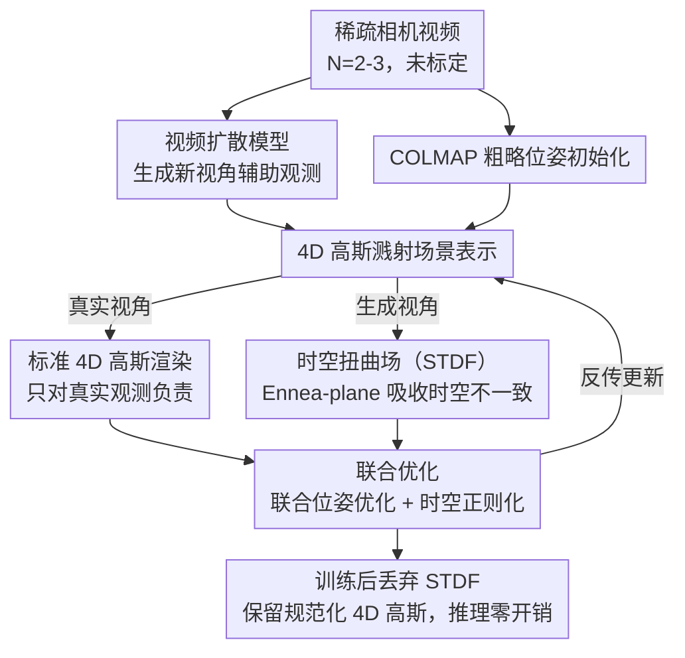

# SparseCam4D: Spatio-Temporally Consistent 4D Reconstruction from Sparse Cameras

**会议**: CVPR 2026  
**arXiv**: [2603.26481](https://arxiv.org/abs/2603.26481)  
**代码**: [https://inspatio.github.io/sparse-cam4d/](https://inspatio.github.io/sparse-cam4d/)  
**领域**: 3D视觉  
**关键词**: 稀疏相机4D重建, 时空扭曲场, 4D高斯溅射, 视频扩散模型, 动态场景

## 一句话总结

提出 SparseCam4D，首个在标准多相机动态场景基准上实现稀疏相机（2-3个）4D重建的方法，核心创新是时空扭曲场（STDF），通过将生成式观测中的时空不一致性显式建模并与真实4D高斯表示解耦，实现高保真、时空一致的动态场景渲染。

## 研究背景与动机

**领域现状**：高质量4D重建依赖稠密相机阵列（通常需要18-21个同步相机），可以实现照片级真实感渲染。但如此昂贵的实验室级设备严重限制了实际应用。

**现有痛点**：稀疏视角4D重建面临两大困难：(1) 几何正则化方法（如 MonoFusion 使用单目深度和3D追踪）只提供结构约束但无法保证外观质量，视角偏移时渲染质量迅速崩溃；(2) 相机控制的视频扩散模型可以生成高质量的多视角数据作为辅助观测，但生成的帧存在严重的时空不一致——在不同视角同一时刻出现空间不一致（物体外观/几何偏差），在同一视角不同时刻出现时间不一致（闪烁、运动不稳定），直接用于重建会导致严重模糊和伪影。

**核心矛盾**：扩散模型生成的观测虽然"照片级真实"，但与要重建的真实场景之间存在系统性偏差——这种偏差跨越空间和时间两个维度，不能简单忽略或独立处理。

**本文目标** 如何利用丰富但不一致的生成观测来辅助稀疏相机 4D 重建，在提取有用信息的同时剥离不一致性。

**切入角度**：将不一致性显式建模为可学习的时空扭曲场，训练时用于适配生成观测，推理时丢弃——零额外计算开销。

**核心 idea**：用 Ennea-plane 分解的时空扭曲场统一建模生成观测中的空间-时间不一致性，使 4D 高斯溅射能从不一致的扩散生成数据中学习正确的场景表示。

## 方法详解

### 整体框架

输入：N 个稀疏相机视频（N=2-3，未标定）。流程：(1) 用视频扩散模型在新视角生成辅助观测；(2) 用 COLMAP 获取粗略位姿初始化；(3) 构建 4D 高斯溅射场景表示 + STDF，联合优化位姿、渲染和正则化项。真实视角用标准 4D 高斯渲染，生成视角用经 STDF 扭曲后的 4D 高斯渲染。训练后 STDF 被丢弃，只保留规范化的 4D 高斯。

### 关键设计

**1. 时空扭曲场（STDF）：把生成观测的不一致性单独装进一个可丢弃的扭曲场**

扩散模型生成的辅助帧虽然"照片级真实"，却和真实场景存在系统性偏差，直接拿来监督 4D 高斯会把这些偏差也学进场景里，导致模糊和伪影。STDF 的做法是不去修正生成图，而是给每个生成视角的每个时刻单独学一组"扭曲量"，让这组扭曲专门吸收不一致性，从而把干净的场景表示和脏的观测偏差解耦开。

具体地，STDF 把待建模的量看成一个 5D 体积 $(x,y,z,t,s)$——前三维是空间坐标，$t$ 是时间索引，$s$ 是位姿（生成视角）索引。直接存这个 5D 体积既贵又难学，于是沿用 K-planes 的思路把它分解成若干二维特征平面的乘积：这里取 9 个平面（省掉了语义上无意义的 $t$-$s$ 平面），作者称之为 Ennea-plane。查询某个坐标时，先把它投影到各个平面、双线性插值取特征，再跨平面逐元素相乘、多分辨率拼接，最后送进一个多头 MLP 解码出位置、旋转、缩放的扭曲量 $\Delta\mu,\ \Delta q_l,\ \Delta q_r,\ \Delta s$。渲染生成视角时用扭曲后的高斯

$$\mathcal{G}'_{4D} = \mathcal{G}_{4D} + \Delta\mathcal{G}_{4D}$$

而渲染真实视角时仍用原始高斯 $\mathcal{G}_{4D}$。这样一来，生成图的偏差被 $\Delta\mathcal{G}_{4D}$ 接住，规范化的 $\mathcal{G}_{4D}$ 只对真实观测负责。关键在于同时保留 $s$ 维和 $t$ 维：$s$ 对应"不同视角同一时刻"的空间不一致，$t$ 对应"同一视角不同时刻"的时间不一致——消融里去掉任一维度都会明显掉点，说明生成偏差确实是跨时空的、不能只建模一边。训练结束后 STDF 直接丢弃，推理时零额外开销。

**2. 联合位姿优化：让相机外参跟着高斯一起被纠正，而不是信任 COLMAP 的初值**

稀疏输入下 COLMAP 本就难标准，再加上生成帧的不一致性会进一步污染特征匹配，初始位姿往往不够准。SparseCam4D 把每个相机的平移 $T$ 和旋转四元数 $q$ 也设成可学习变量，和 4D 高斯属性一起在训练中优化，同时用一项正则把它们拴在 COLMAP 初值附近、防止漂太远：

$$\mathcal{L}_\text{pose} = \lambda_p\left(\|T - \hat{T}\| + \|q - \hat{q}\|\right)$$

优化有节奏：前 3000 次迭代当预热、只做标准训练，之后才同时放开位姿和 STDF，到 7000 次迭代时再冻住位姿。这样位姿在场景大致成形后才被微调，避免早期噪声把外参带偏。消融里去掉这一步，Train 场景 LPIPS 从 0.264 退到 0.336，可见在稀疏 + 生成观测的设定下，固定初始位姿是吃亏的。

**3. 时空正则化：按"扭曲沿位姿轴连续、沿时间轴可能突变"的先验给 STDF 上约束**

光让 STDF 自由拟合容易过拟合到生成图的噪声上，所以要在不同维度施加不同强度的平滑约束。生成视角不用纯像素 $\mathcal{L}_1$ 而改用感知损失 $\mathcal{L}_\text{lpips}$ 来监督纹理和结构，因为感知损失对生成图里的局部偏差更宽容、不会逼着高斯去逐像素对齐一张本就不准的图。空间平面上施加全变差正则 $\mathcal{L}_{TV}$ 保证空间连续。位姿轴则单独上一项二阶平滑正则

$$\mathcal{L}_\text{smooth} = \sum\left\|(P^{i,s-1} - P^{i,s}) - (P^{i,s} - P^{i,s+1})\right\|_2^2$$

只作用于 $xs,\ ys,\ zs$ 这三个含位姿轴的平面。这一选择正是对应那条先验：扩散模型沿相邻位姿生成的扭曲是平滑过渡的（适合二阶约束），而沿时间轴的扭曲可能因为运动突变，所以不强加时间方向的平滑。

### 损失函数 / 训练策略

总损失：$\mathcal{L} = \mathcal{L}_\text{input} + \mathcal{L}_\text{gen} + \mathcal{L}_\text{pose} + \mathcal{L}_{TV} + \mathcal{L}_\text{smooth}$

- 输入视角：$(1-\lambda)\mathcal{L}_1 + \lambda\mathcal{L}_\text{D-SSIM}$，$\lambda = 0.2$
- 生成视角：$\lambda_1\mathcal{L}_1 + \lambda_2\mathcal{L}_\text{lpips}$，$\lambda_1=0.02$，$\lambda_2=0.2$

每场景训练 30,000 次迭代，每次采样一张真实视角图和一张生成视角图。使用 ViewCrafter 生成辅助视频（每序列25帧）。单卡 A800 训练。

## 实验关键数据

### 主实验

三个标准 4D 基准上的定量比较（2-3个稀疏相机输入）：

| 方法 | Technicolor PSNR↑ | Neural 3D PSNR↑ | Nvidia Dynamic PSNR↑ |
|------|-------------------|-----------------|---------------------|
| 4DGaussians | 16.20 | 17.40 | 16.81 |
| 4D-Rotor | 14.85 | 18.20 | 19.38 |
| MonoFusion* | 17.97 | 18.43 | 20.22 |
| **Ours** | **23.15** | **21.91** | **24.81** |

LPIPS 同样全面领先：Technicolor 0.299 vs MonoFusion 0.352，Nvidia 0.150 vs 0.192。

### 消融实验

STDF 消融（Train/Jumping 场景 LPIPS↓ / SSIM↑）：

| 设定 | Train LPIPS | Jumping LPIPS |
|------|-------------|---------------|
| w/o distortion field | 0.608 | 0.319 |
| w/o time axis | 0.458 | 0.279 |
| w/o pose axis | 0.469 | 0.268 |
| **Full STDF** | **0.264** | **0.170** |

去掉位姿优化：LPIPS 从 0.264→0.336（Train），从 0.170→0.217（Jumping）。

### 关键发现

- **去掉 STDF 直接用生成图重建导致严重模糊**：时空切片可视化清晰展示了不一致性导致的时间抖动
- **空间轴和时间轴缺一不可**：去掉时间轴或位姿轴都显著降低性能，验证了生成不一致性是跨时空维度的
- **STDF 可视化**语义合理：高扭曲区域（如面部、酒瓶）对应扩散模型生成中变形最大的区域
- **跨扩散模型通用**：ViewCrafter 和 ReCamMaster 两种 VDM 下均有显著提升（+2.51 dB 和 +1.76 dB）
- 首次在标准多相机动态场景基准上用稀疏相机实现4D重建并在所有视角上评估

## 亮点与洞察

- **"训练时用、推理时丢"的巧妙设计**：STDF 仅在训练阶段适配生成观测的不一致性，推理时零开销
- **Ennea-plane 分解**：将 K-planes 从 4D 扩展到 5D（加入位姿索引维度），紧凑且有效
- **从"对抗不一致性"到"显式建模不一致性"**的思路转变：不是试图让扩散模型生成一致的内容，而是承认并建模不一致性
- STDF 的可视化提供了扩散模型如何"感知物理世界"的有趣洞察——不同区域的变形程度不同

## 局限与展望

- 依赖特定视频扩散模型的生成质量，如果生成质量过差可能无法补充有效信息
- 每场景需要独立训练，30k 次迭代仍有一定计算开销
- 位姿优化需要 COLMAP 的初始化，极端稀疏（如仅1个相机）时可能无法获得有效初始化
- 未处理动态拓扑变化（如物体出现/消失）
- 可探索将 STDF 的思路推广到其他利用生成模型辅助重建的任务中

## 相关工作与启发

- **MonoFusion / Shape-of-Motion**：几何正则化路线的代表，本文证明仅靠几何先验不够
- **ViewCrafter / ReCamMaster**：相机控制的视频扩散模型，提供辅助观测但带来不一致性
- **K-planes**：分解式场景表示的基础，STDF 扩展了其设计空间
- STDF 的"显式建模不一致性"思路可广泛应用于所有利用生成模型进行3D/4D重建的场景

## 评分

- **新颖性**: ⭐⭐⭐⭐⭐ 首次提出统一建模生成观测时空不一致性的框架，Ennea-plane 设计优雅
- **实验充分度**: ⭐⭐⭐⭐⭐ 三个标准基准+充分消融+跨扩散模型验证+可视化分析，非常扎实
- **写作质量**: ⭐⭐⭐⭐ 问题定义清晰，时空不一致性的可视化很有说服力
- **价值**: ⭐⭐⭐⭐⭐ 将4D重建从"需要20+相机"降低到"2-3个相机"，实际应用潜力巨大

<!-- RELATED:START -->

## 相关论文

- [\[CVPR 2026\] 4D Reconstruction from Sparse Dynamic Cameras](4d_reconstruction_from_sparse_dynamic_cameras.md)
- [\[CVPR 2026\] Mark4D: Temporally-Consistent Watermarking for 4D Gaussian Splatting](mark4d_temporally-consistent_watermarking_for_4d_gaussian_splatting.md)
- [\[CVPR 2026\] 4D Primitive-Mâché: Glueing Primitives for Persistent 4D Scene Reconstruction](4d_primitive-mache_glueing_primitives_for_persistent_4d_scene_reconstruction.md)
- [\[CVPR 2026\] Complet4R: Geometric Complete 4D Reconstruction](complet4r_geometric_complete_4d_reconstruction.md)
- [\[CVPR 2026\] BulletGen: Improving 4D Reconstruction with Bullet-Time Generation](bulletgen_improving_4d_reconstruction_with_bullet-time_generation.md)

<!-- RELATED:END -->
