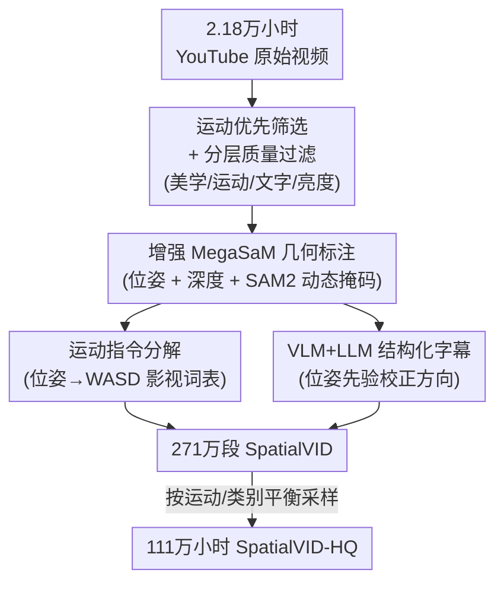

# SpatialVID: A Large-Scale Video Dataset with Spatial Annotations

**会议**: CVPR 2026  
**论文**: [CVF Open Access](https://openaccess.thecvf.com/content/CVPR2026/html/Wang_SpatialVID_A_Large-Scale_Video_Dataset_with_Spatial_Annotations_CVPR_2026_paper.html)  
**代码**: https://nju3dv.github.io/projects/SpatialVID/ （项目页）  
**领域**: 3D视觉 / 视频理解  
**关键词**: 视频数据集, 相机位姿, 深度标注, 世界模型, 可控视频生成

## 一句话总结
SpatialVID 从 2.1 万小时野外网络视频里，用「分层过滤 + 几何/语义标注 + 平衡采样」三段式 pipeline 蒸馏出 271 万段、共 7089 小时的动态片段，每段都带逐帧相机位姿、深度、动态掩码、结构化字幕和序列化运动指令，是目前规模最大、标注最全的"动态场景 + 显式几何"视频数据集。

## 研究背景与动机
**领域现状**：空间智能（spatial reconstruction + world exploration）正在快速发展——从 SfM/MVS 到 DUSt3R、VGGT 这类前馈式 3D 重建，再到 Sora、CogVideoX 这类把视频生成当"世界模拟器"的工作。它们的共同瓶颈不在模型，而在训练数据。

**现有痛点**：现有数据集裂成互不相容的两半。一半是**大规模视频数据集**（Panda70M、MiraData），语义丰富但完全没有 3D 真值，模型只能从像素里隐式猜空间关系；另一半是**空间数据集**（CO3D、RealEstate10K、TartanAir），几何精确但规模小、要么以物体为中心、要么是合成的、要么相机几乎不动（RealEstate10K 80% 是静态视角）。

**核心矛盾**：「语义多样但无几何」与「几何精确但无语义、且静态」之间存在结构性割裂。真正的世界模拟器需要的是**动态真实场景 + 显式几何 + 丰富语义**三者同时具备，而没有任何现成数据满足。

**本文目标**：造一个把原始像素直接连到物理世界的多模态数据集——既要规模（百万级片段）、又要动态真实场景、还要逐帧相机位姿/深度/运动指令/结构化字幕全套标注。

**切入角度**：野外视频天然就编码了空间、时间、语义线索，且取之不尽。与其昂贵地采集 3D 真值，不如以**运动优先（motion-first）**的方式从 YouTube 海量视频里筛选出相机运动丰富、视差充足的片段，再用一条自动标注流水线把几何与语义补齐。

**核心 idea**：用一条"过滤→标注→采样"的程序化 pipeline，把杂乱的野外视频蒸馏成带显式 3D 标注的训练语料，从而桥接动态视频与空间理解。

## 方法详解

### 整体框架
SpatialVID 本质是一条**数据策展（curation）流水线**，不是一个模型。输入是 3.3 万个、共 2.18 万小时的原始 YouTube 视频，输出是 271 万段带全套空间标注的片段（SpatialVID）以及一个 1111 小时的平衡高质量子集（SpatialVID-HQ）。整条线分三个阶段：

1. **过滤（filtering）**：先把长视频切成 3–15 秒短片（720P、H.265 统一编码），得到 700 万+ 候选片段，再用四个质量指标（美学、运动强度、文字干扰、亮度）层层筛掉低质内容，最终保留约 271 万段。
2. **标注（annotation）**：对保留片段补齐几何与语义——用增强版 MegaSaM 估相机位姿与深度、SAM2 抽动态掩码，把位姿序列拆成 WASD 式运动指令，再用 VLM+LLM 协同生成结构化字幕。这一步耗了约 6.9 万 GPU·小时（仅 MegaSaM）。
3. **采样（sampling）**：收紧质量阈值并按语义标签、轨迹统计做平衡采样，得到类别分布良好的 SpatialVID-HQ。

### 关键设计

**1. 运动优先的人工初筛 + 分层质量过滤：把"无法重建"的静态/劣质片段挡在门外**

数据集的成败首先取决于源数据，而通用视频集（Panda70M）跑作者的 pipeline 只有约 10% 片段达标——大量片段静态、闪烁、字幕里没有运动描述。作者因此做了两件事。其一是**运动优先采集**：用 walk、tour、drone 等运动相关关键词在 YouTube 上检索，人工剔除画面破损、含全景相机（"Panoramic camera"，会破坏 MegaSaM 假设）、有重度遮挡或台标字幕的视频，得到 3.3 万个相机轨迹平滑、视差丰富的视频。其二是**四指标分层过滤**：用 CLIP+MLP 美学预测器去掉难看片段、亮度过滤去掉过曝/欠曝、PaddleOCR 按文字面积比去掉字幕过多的片段、轻量 VMAF 指标保留运动充足的片段。切片用改过的 PySceneDetect（调低阈值 + 区间多帧比较，专门处理淡入淡出转场），统一转成 1280×720 的 H.265 MP4。这套"运动优先 + 多指标过滤"直接决定了下游相机位姿估计的可靠性——因为只有运动充分、画面干净的片段，MegaSaM 才能稳定重建。

**2. 增强版 MegaSaM 几何标注：在野外动态视频上拿到可靠的位姿+深度+动态掩码**

野外动态视频做几何标注的难点是运动物体、共线运动、单目深度不可靠会让重建崩掉。作者以 MegaSaM 为主估计器（在 in-the-wild 视频上鲁棒性最好），并做了三处加固。其一，把 MegaSaM 原始深度模块换成 **UniDepth v2 + Depth Anything v2**，显著提升深度精度与鲁棒性。其二，**动态掩码**：先用自适应阈值 + 轮廓检测得到候选区域，从中采样锚点作为 SAM2 的 prompt 抽出动态掩码，再据此算每帧的动态比例（dynamic ratio）。其三，用**基于加速度的检测器**识别突兀的非物理运动抖动，剔除不合理轨迹。为量化相机运动，作者还定义了三个指标：MoveDist（轨迹总长度）、RotAngle（累计旋转角）、TrajTurns（显著方向变化次数）——这三个量后续直接用于采样时做轨迹多样性平衡。这一步让每段视频都带上了显式 3D grounding，是 SpatialVID 区别于纯语义视频数据集的核心。

**3. 运动指令分解：把连续相机位姿翻译成 WASD 式可控词表**

为了让数据能直接监督导航/控制类模型（如 Hunyuan-GameCraft），作者把相机位姿序列分解成离散、可解释的运动指令。具体地，从相邻帧的相对平移与旋转里读出运动动态，先做时序平滑滤波抑制抖动噪声，再用基于幅度的阈值找出"可感知"的运动段——只有当位姿变化超过预设阈值时才生成指令，避免给微小抖动也打标签。最后把运动信号映射到一套受控的影视术语词表，如 dolly in（前向平移）、pan left（水平旋转）、truck right（横向平移），并对应到 W/A/S/D 这类直观控制符号。这种标准化分解保证了指令的清晰、一致和下游可用性，是把"被动视频"变成"可控信号"的关键一跳。

**4. VLM+LLM 协同的结构化字幕：用相机位姿先验纠正 VLM 的空间幻觉**

纯 VLM（如 Gemini）做视频字幕时空间推理很弱，经常把相机运动方向描述反（图 4 里 VLM 说"右"，实际是"左"）。作者设计了两阶段字幕框架：阶段一**视觉解析**，用 Gemini-2.0-Flash 分析采样帧，产出初始的场景描述与相机运动描述；阶段二**语言精炼**，用 Qwen3-30B-A3B 拿**相机位姿作为先验**去校正运动方向、保证空间一致性。精炼后的字幕整合了场景语义、相机运动和多级属性（场景类型、光照、天气、时间、人群密度等），形成包含 Scene Description / Camera Description / Category Tags / Shot Summary 的层级化文本表示。这一步让字幕既语义丰富又**空间 grounded**，整个语义标注共消耗约 130 亿 token 的 LLM 推理。

## 实验关键数据
作者不在单一任务上比 SOTA，而是把 SpatialVID-HQ 当训练数据，在三个下游任务上验证"换了这份数据，模型是不是更好"。

### 主实验：相机可控视频生成
基于 ReCamMaster 的相机注入机制 + Wan2.2 架构，在 RealEstate10K、Sekai-Real、SpatialVID-HQ 三种训练数据下各训一版，在三个 benchmark 上比相机可控性（误差越低越好）。

| 评测 benchmark | 训练数据 | TransErr↓ | RotErr↓ | CamMC↓ | CLIP-T↑ |
|------|------|------|------|------|------|
| RealEstate10K | RE10K | 7.46 | 1.15 | 7.91 | 30.38 |
| RealEstate10K | **SpatialVID-HQ** | **7.42** | **0.99** | **7.72** | **30.54** |
| Sekai | RE10K | 8.17 | 1.51 | 8.78 | 34.97 |
| Sekai | **SpatialVID-HQ** | **6.04** | **1.43** | **6.70** | 35.19 |
| SpatialVID | Sekai-Real | 5.63 | 4.70 | 9.39 | 30.25 |
| SpatialVID | **SpatialVID-HQ** | **4.33** | **3.81** | **7.57** | 30.26 |

在三个 benchmark 上，用 SpatialVID-HQ 训练的模型相机可控性误差都最低，CLIP-T（文本-视频对齐）也最高，VBench 指标尤其是 Imaging Quality 稳定提升。

### 跨任务验证：新视角合成 & 几何预测

| 任务 | 设置 | 训练数据 | 关键指标 | 结果 |
|------|------|------|------|------|
| 新视角合成 (GS-LRM) | DL3DV 测试 | RE10K → SpatialVID | PSNR↑ | 27.01 → **27.80** |
| 新视角合成 (GS-LRM) | SpatialVID 测试 | RE10K → SpatialVID | PSNR↑ | 24.13 → **24.97** |
| 位姿估计 (CUT3R) | TUM-dynamics | 微调前→后 | ATE↓ | 0.049 → **0.040** |
| 位姿估计 (VGGT) | TUM-dynamics | 微调前→后 | ATE↓ | 0.015 → **0.013** |

GS-LRM 用 SpatialVID 子集（片段数对齐 RealEstate10K）训练后，在 DL3DV 和 SpatialVID 上 PSNR/SSIM/LPIPS 全面超过 RE10K，连以户外为主的 DL3DV 也更好。位姿估计上，CUT3R/VGGT 在 TUM-dynamics 动态场景上微调后都有提升。

### 关键发现
- **数据质量分布是核心卖点**：图 5 显示 Panda70M 有 83.7% 片段因运动不足无法被 MegaSaM 重建（TrajTurns 不达标），而 SpatialVID-HQ 刻意提高了带弯曲/转向轨迹片段的比例，运动分布更均衡真实——这正是"动态"数据集的价值所在。
- **平衡采样有意义**：SpatialVID（271万段）里 52.9% 是 0 转向片段，而精选的 SpatialVID-HQ 把 0 转向降到 30.7%、1 转向升到 53.5%，主动富集了运动更复杂的样本。
- **VGGT 已接近天花板**：它本就在多份 3D 数据上训练且表现极强，微调 SpatialVID 后只有微小波动（Sintel 上 ATE 甚至轻微回退），说明该数据对已饱和的强模型增益有限，但对 CUT3R 这类还有空间的模型增益明显。

## 亮点与洞察
- **"运动优先"的策展哲学**：从源头就按相机运动丰富度筛视频，而不是先收集再过滤，避免了通用视频集 90% 片段不可用的尴尬——数据集的质量上限在采集策略而非后处理。
- **用位姿先验治 VLM 的方向幻觉**：让 LLM 拿相机位姿去纠正 VLM 写反的运动方向，是个低成本却切中要害的 trick，可迁移到任何需要"空间-语言对齐"的字幕生成场景。
- **把连续运动离散成 WASD 词表**：位姿序列→影视术语→游戏控制符的映射，直接把视频数据变成了可控生成/世界模型的监督信号，是数据形态上的关键创新。
- **三指标量化相机运动**（MoveDist/RotAngle/TrajTurns）既用于过滤也用于平衡采样，给"运动多样性"提供了可操作的定义。

## 局限与展望
- **继承 MegaSaM 的失败模式**：作者承认在物体主导帧、变焦、严重径向畸变等极端场景下标注会退化，预测位姿在特定场景下还呈现非度量（non-metric）性质，动态掩码在复杂场景表现次优。
- **标注质量受限于现有估计器**：整条几何标注的天花板被 MegaSaM 卡住，作者寄希望于 ViPE 等更强的视频位姿估计器未来替换升级。
- ⚠️ **下游增益依赖任务难度**：从实验看，对 RealEstate10K 这类已成熟的任务提升有限，对动态场景任务（TUM-dynamics）提升更明显；不同 benchmark 难度差异大，跨任务横向比"提升幅度"需谨慎。
- 可改进方向：把动态掩码从"运动概率阈值"升级为更鲁棒的分割、引入度量深度标注、补齐音频等更多模态。

## 相关工作与启发
- **vs RealEstate10K / CO3D（空间数据集）**: 它们几何精确但以静态/物体为中心、规模小；SpatialVID 是百万级、动态、开放场景，且额外带深度、动态掩码、结构化字幕和运动指令。
- **vs Panda70M / MiraData（视频数据集）**: 它们语义丰富但完全无 3D 真值、且大量静态；SpatialVID 用同一 pipeline 处理 Panda70M 验证集仅 10% 达标，凸显其"动态 + 显式几何"的差异化。
- **vs DynPose100K / CamVid-30K（视频挖掘数据集）**: 同样从视频挖位姿，但 SpatialVID 在标注丰富度（深度+字幕+运动指令）和规模上更全面，且强调运动轨迹多样性。
- **vs 并发的 Sekai**: 都想做几何-语义融合，但作者在表 2 中显示用 SpatialVID-HQ 训练的相机可控生成在 Sekai benchmark 上反而误差更低，论证了其标注质量与泛化性。

## 评分
- 新颖性: ⭐⭐⭐⭐ 不是新模型而是新数据集，但"动态真实场景 + 全套显式几何/语义标注 + 百万级规模"的组合此前确实没有，运动优先策展和位姿纠偏字幕是实打实的方法贡献。
- 实验充分度: ⭐⭐⭐⭐⭐ 在可控视频生成、新视角合成、位姿估计三类任务上都做了"换数据"对照，并有详尽的质量分布分析。
- 写作质量: ⭐⭐⭐⭐ pipeline 三阶段叙述清晰，图表充分；部分关键细节（过滤阈值、采样策略）推到补充材料略影响自洽。
- 价值: ⭐⭐⭐⭐⭐ 直击空间智能/世界模型训练数据稀缺的真痛点，是视频与 3D 视觉社区可长期复用的基础资产。

<!-- RELATED:START -->

## 相关论文

- [\[CVPR 2026\] SceneScribe-1M: A Large-Scale Video Dataset with Comprehensive Geometric and Semantic Annotations](scenescribe-1m_a_large-scale_video_dataset_with_comprehensive_geometric_and_sema.md)
- [\[CVPR 2026\] Ego-1K: A Large-Scale Multiview Video Dataset for Egocentric Vision](ego-1k_--_a_large-scale_multiview_video_dataset_for_egocentric_vision.md)
- [\[CVPR 2026\] OLATverse: A Large-scale Real-world Object Dataset with Precise Lighting Control](olatverse_a_large-scale_real-world_object_dataset_with_precise_lighting_control.md)
- [\[CVPR 2026\] 3DReflecNet: A Large-Scale Dataset for 3D Reconstruction of Reflective, Transparent, and Low-Texture Objects](3dreflecnet_a_large-scale_dataset_for_3d_reconstruction_of_reflective_transparen.md)
- [\[CVPR 2026\] Scaling4D: Pushing the Frontier of Video Novel View Synthesis through Large-Scale Monocular Videos](scaling4d_pushing_the_frontier_of_video_novel_view_synthesis_through_large-scale.md)

<!-- RELATED:END -->
