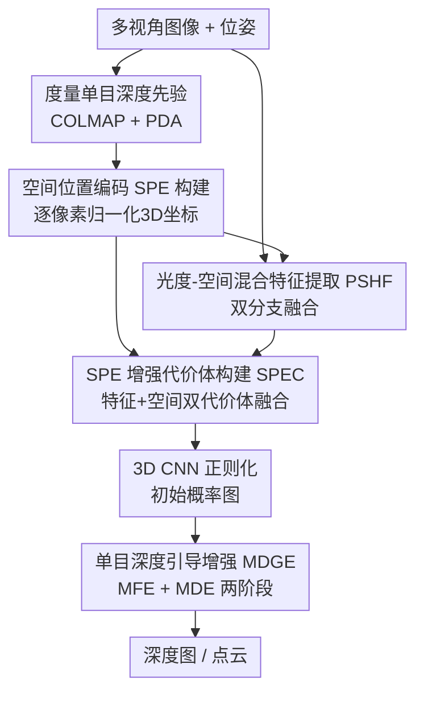

# SPE-MVS: Spatial Position Encoding Enhanced Multi-View Stereo with Monocular Depth Priors

**会议**: CVPR 2026  
**论文**: [CVF Open Access](https://openaccess.thecvf.com/content/CVPR2026/html/Wang_SPE-MVS_Spatial_Position_Encoding_Enhanced_Multi-View_Stereo_with_Monocular_Depth_CVPR_2026_paper.html)  
**代码**: https://github.com/bdwsq1996/SPE-MVS  
**领域**: 3D视觉 / 多视图立体 / 深度估计  
**关键词**: 多视图立体, 空间位置编码, 单目深度先验, 代价体, 弱纹理重建

## 一句话总结
SPE-MVS 用度量单目深度先验为每个视角的每个像素构造统一坐标系下的"空间位置编码（SPE）"，把它和图像一起喂进特征提取与代价体构建，再用单目深度引导的两阶段细化模块打磨概率图，从而在弱纹理、非朗伯面这些光度匹配失效的区域显著提升 MVS 重建质量。

## 研究背景与动机

**领域现状**：学习型多视图立体（MVS）已是主流，遵循"图像特征提取 → 代价体构建 → 正则化 → 深度回归"四步管线，核心是通过多视图特征相似度计算来确定最优深度（MVSNet 系、级联多尺度、迭代细化、Transformer 增强等）。

**现有痛点**：这套管线本质上**过度依赖视图间的光度相似度**来表征匹配相似度。在弱纹理区域和非朗伯表面上，光度差异不明显、光度一致性假设失效，导致这些"困难区域"的重建鲁棒性很差，限制了 MVS 在真实复杂场景的落地。

**核心矛盾**：MVS 的匹配信号几乎全押在光度上，而光度恰恰在最难的区域最不可靠；要破局必须引入与光度互补的额外先验。

**本文目标**：找到一种在弱纹理/非朗伯面依然可靠、又能融入多视图匹配的先验，系统性地降低 MVS 对光度匹配的依赖。

**切入角度**：度量单目深度估计（如 Prior Depth Anything）近年很强——它能从单图 + 稀疏深度产出尺度一致的稠密深度，绝对精度虽不如 MVS，但**表面一致性和在弱纹理/非朗伯区的鲁棒性极好**。已有的 MonoMVSNet 只在参考视角用单目线索，没把潜力榨干。

**核心 idea**：把每个视角的度量单目深度统一到参考视坐标系，编码成逐像素的"空间位置编码（SPE）"，让 MVS 在光度相似度之外再获得一路"空间位置相似度"，并用单目特征/深度引导细化概率图。

## 方法详解

### 整体框架
SPE-MVS 的输入是带已知位姿的多视图图像，输出是参考视的深度图（进而融合成点云）。它先用 COLMAP 跑出每个视角的稀疏深度，配合预训练单目深度模型（PDA）得到每视角的**度量单目深度图**；这些深度被投影、归一化到参考视坐标系，编码成逐像素的 **空间位置编码（SPE）**。SPE 和原图一起作为输入：经**光度-空间混合特征提取器（PSHF）**得到多尺度融合特征，同时由 **SPE 增强代价体构建（SPEC）**把"特征相似度代价体"和"空间位置相似度代价体"融合，正则化后得到初始深度概率图；最后 **单目深度引导增强（MDGE）**用参考视的单目特征和单目深度两阶段细化概率图，输出最终深度。

### 关键设计

**1. 空间位置编码（SPE）：把单目深度变成跨视角统一坐标系下的逐像素 3D 位置**

针对"光度匹配在困难区失效"，作者引入一路与光度无关的位置信号。先对每视角 $I_i$ 的单目深度 $D_i^m$，用相机内外参把像素 $p=[u_i,v_i]$ 反投影到**参考视坐标系**：参考视 $P_0 = D_0^m(p) \cdot K_0^{-1} \cdot [u_0,v_0,1]^\top$，源视 $P_i = D_i^m(p)\cdot R_i \cdot (K_i^{-1}\cdot[u_i,v_i,1]^\top) + t_i$。由于不同场景图像尺寸和深度范围差异大，再用参考视的高 $H$、宽 $W$、最大深度 $d_{max}$ 做归一化：$[X_{max},Y_{max},d_{max}]^\top = d_{max}\cdot K_0^{-1}\cdot[W,H,1]^\top$，最终 $S_i(p) = [X_i/X_{max},\,X_i/Y_{max},\,D_i^m(p_i)/d_{max}]^\top$，得到 $S_i \in \mathbb{R}^{3\times H\times W}$。这样每个像素都带上一个统一空间里的归一化 3D 坐标，作为图像之外的第二路输入。其中度量单目深度本身由 COLMAP 稀疏深度引导 PDA 生成，保证尺度一致——这是 SPE 可靠的前提。

**2. 光度-空间混合特征提取器（PSHF）：双分支融合，让特征既懂外观又懂位置**

以往 MVS 只在图像上提特征，表达被光度束缚。PSHF 是一个**双分支融合的 FPN**：编码器用两条分支分别对图像 $\{I_i\}$ 和 SPE $\{S_i\}$ 做特征提取与聚合，在解码器构造多尺度混合特征 $\{F_i^k\}$（四个尺度 $k=0,1,2,3$，分辨率 $\frac{H}{2^{3-k}}\times\frac{W}{2^{3-k}}$，通道 64/32/16/8）。作者特意对比了"输入端通道拼接"和"双编码器分别编码"两种替代结构，结果双分支融合明显最好——说明把两类输入**充分聚合**比简单拼接或并行编码更关键。

**3. SPE 增强代价体构建（SPEC）：在特征相似度之外再造一路空间位置相似度**

只增强特征还不够，匹配相似度本身也该补上空间维度。SPEC 在每个尺度同时构建两个代价体并融合。基于深度假设 $\{d_j^k\}$，先算单应变换 $p_{i,j} = K_i\cdot(R_i\cdot(K_0^{-1}\cdot p\cdot d_j^k)+t_i)$ 找到对应像素；**特征相似度**用 group-wise 相关 $c_F^{i,k}(p,d_j^k)=\langle F_0^k(p),F_i^k(p_{i,j})\rangle_g$，**空间相似度**直接用 SPE 的平方差 $c_S^{i,k}(p,d_j^k)=(S_0^k(p)-S_i^k(p_{i,j}))^2$。两路分别聚合成特征代价体 $C_F^k$（按像素权重加权）和 SPE 代价体 $C_S^k$（按源视数平均），再用 3D CNN 融合：$C^k = f_{3d}([f_{3d}(C_S^k),\,C_F^k])$，正则化后得初始概率图 $P_{init}^k$。空间相似度在光度失效处仍然可判别——位置对得上的像素，平方差自然小——这正是困难区涨点的来源。

**4. 单目深度引导增强（MDGE）：两阶段细化概率图，把单目的"表面平滑"灌进 MVS**

单目深度的一大优势是物体表面特征天然连续，弱纹理处也能给出平滑深度。MDGE 据此在概率图层面做两步细化。**MFE（单目特征增强）**先用高层特征改概率图：一条分支对 $[F_0^k, F_m^k, P_{init}^k]$（参考图特征、单目特征、初始概率体）做 2D CNN，另一条对 $P_{init}^k$ 做 3D CNN，合并得 $P_f^k = f_{3d}(f_{3d}(P_{init}^k) + f_{2d}([F_0^k,F_m^k,P_{init}^k]))$。**MDE（单目深度增强）**结构相似但把特征换成深度信息：用单目深度 $D_m^{0,k}$ 和由 MFE 输出经 soft-argmax 得到的 $D_f^k$，算 $P_d^k = f_{3d}(f_{3d}(P_f^k)+f_{2d}([D_f^k, D_m^{0,k}, P_f^k]))$，强调几何一致性、进一步增强表面连续性。两阶段串行，分别从"特征"和"深度"两个角度把单目先验注入概率图。

### 损失函数 / 训练策略
对所有尺度的预测概率图用交叉熵监督，且 MDGE 的三个概率图（初始、MFE 后、MDE 后）都参与：$L = \sum_{k=0}^{3} -P_{gt}^k(\log(P_{init}^k) + \log(P_f^k) + \log(P_d^k))$。训练分两阶段：先在 DTU 上训 15 epoch，再在 BlendedMVS 上微调 10 epoch；DTU 阶段输入 $N=5$ 视图、深度假设数 $Z_k=32/16/8/4$（尺度 0–3，采样间隔递减），Adam + OneCycleLR、初始学习率 0.001；BlendedMVS 微调用 $N=7$、576×768。评测时 DTU 用 5 视图 1152×1600，Tanks & Temples 用 21 视图 1056×1920，深度经动态几何一致性重投影后融合成点云。

## 实验关键数据

### 主实验
DTU 用 Overall/Acc./Comp.（单位 mm，越低越好），Tanks & Temples 用 F1-score（越高越好）。

| 数据集 | 指标 | 本文 | MonoMVSNet | MVSFormer++ |
|--------|------|------|------------|-------------|
| DTU | Overall↓ | **0.272** | 0.278 | 0.281 |
| DTU | Acc.↓ | 0.324 | 0.313 | 0.309 |
| DTU | Comp.↓ | **0.220** | 0.243 | 0.252 |
| T&T Intermediate | Mean F1↑ | **69.13** | 68.63 | 67.18 |
| T&T Advanced | Mean F1↑ | **44.72** | 43.58 | 41.60 |

在 DTU 上本文取得 Overall 和 Completeness 的 SOTA：相比同样用单目先验的 MonoMVSNet，Overall 从 0.278 降到 0.272、Completeness 从 0.243 大幅降到 0.220，说明 SPE 和 MDGE 主要在"补全困难区"上发力（Acc. 略逊于个别方法，但完整度领先明显）。Tanks & Temples 上两个集的平均 F1 均达 SOTA，困难区视觉对比也优于 MonoMVSNet/MVSFormer++。

### 消融实验
在 DTU 上以去掉贡献模块的 ET-MVSNet 骨架为基线，逐个加入模块：

| 配置 | Overall↓ | Acc.↓ | Comp.↓ | 说明 |
|------|----------|-------|--------|------|
| 基线（无模块） | 0.298 | 0.342 | 0.254 | 仅骨架 |
| + PSHF | 0.283 | 0.336 | 0.230 | 混合特征，完整度大涨 |
| + SPEC | 0.288 | 0.340 | 0.236 | 空间代价体，完整度提升 |
| + MDGE | 0.286 | 0.330 | 0.242 | 单目引导细化，精度提升 |
| + PSHF + SPEC | 0.279 | 0.331 | 0.227 | SPE 两件套协同 |
| 全部模块 | **0.272** | **0.324** | **0.220** | 完整 SPE-MVS |

### 关键发现
- PSHF 和 SPEC 这两个与 SPE 直接相关的模块，主要拉动 **Completeness**（0.254 → 0.230 / 0.236），印证"空间位置信息专治困难区的重建残缺"；MDGE 则在 Accuracy 和 Completeness 上都有平均提升，证明单目先验确实能强化概率图。
- PSHF 结构对比中，双分支融合（Overall 0.272）明显优于输入端拼接（0.277）和双编码器（0.276），说明两类输入要在编解码中**充分交互聚合**，简单并接不够。
- MDGE 组件消融里，MFE（特征增强）比 MDE 贡献更大（把 Overall 从 0.279 优化到 0.274）；一旦移除单目特征（MF）或单目深度（MD）先验，各模块性能均显著下降，验证单目先验是 MDGE 的根基。

## 亮点与洞察
- **"空间位置相似度"这条新匹配线很巧**：MVS 几十年押在光度相似度上，本文用归一化 3D 位置的平方差造出一路与光度正交的相似度，在光度失效处依然可判别——这是个可直接嫁接到任意 MVS 代价体框架的通用增量。
- **把单目深度"榨干"到每个视角、每个像素**：相比 MonoMVSNet 只在参考视用单目线索，SPE 给所有视角都补上逐像素 3D 位置，这种"全视角 + 全像素"的用法是完整度涨点的关键，思路可迁移到立体匹配、深度补全等任务。
- **概率图层面的两阶段细化（MFE→MDE）**：从"特征"和"深度"两个互补角度分两步注入单目先验，而不是一股脑拼进去，这种分阶段、分模态的细化设计值得借鉴。

## 局限与展望
- 整条管线依赖 COLMAP 稀疏重建 + PDA 单目深度作为 SPE 的前提，若 COLMAP 在极弱纹理/重复纹理场景失败、或单目深度尺度对齐偏差，SPE 质量会受影响，论文未系统分析这种级联失败。
- DTU 上 Accuracy 并非最优（0.324，逊于若干方法），说明 SPE 主要换来完整度、对精度的提升有限，存在 Acc.↔Comp. 的权衡。
- 引入多视角 SPE 构建、双分支特征、双代价体和两阶段细化，计算/显存开销相比单纯光度 MVS 增加，论文未给出详细效率对比。⚠️ 部分符号定义以原文公式为准。
- 单目深度模型（PDA/DepthAnything）是冻结的现成模型，与 MVS 联合端到端优化、或随场景自适应，是潜在改进方向。

## 相关工作与启发
- **vs MonoMVSNet**：同样借单目深度先验，但 MonoMVSNet 只在参考视用单目特征、并据此优化深度搜索范围；本文为**所有视角**构造逐像素 SPE，既进特征提取又进代价体构建，把单目先验用得更彻底，完整度提升更明显。
- **vs 传统光度 MVS（MVSFormer++/ET-MVSNet 等）**：它们靠增强特征提取来改善困难区，但匹配信号仍是光度；本文直接在匹配相似度里**新增空间位置一路**，从根上缓解对光度一致性的依赖，因此在弱纹理/非朗伯面更鲁棒。

## 评分
- 新颖性: ⭐⭐⭐⭐ "空间位置编码"作为与光度互补的新匹配信号思路清晰，是对成熟 MVS 管线的扎实增量而非颠覆。
- 实验充分度: ⭐⭐⭐⭐⭐ DTU + T&T 双基准、逐模块/结构/组件三层消融完整，结论支撑充分。
- 写作质量: ⭐⭐⭐⭐ 四模块管线讲得清楚，公式与图对应良好，个别符号需对照原文。
- 价值: ⭐⭐⭐⭐ 困难区完整度的 SOTA 提升对真实场景重建有实际意义，且 SPE 模块易迁移、代码开源。

<!-- RELATED:START -->

## 相关论文

- [\[CVPR 2026\] Unsupervised Monocular 3D Keypoint Discovery from Multi-View Diffusion Priors](unsupervised_monocular_3d_keypoint_discovery_from_multi-view_diffusion_priors.md)
- [\[CVPR 2026\] LiDAR Prompted Spatio-Temporal Multi-View Stereo for Autonomous Driving](lidar_prompted_spatio-temporal_multi-view_stereo_for_autonomous_driving.md)
- [\[CVPR 2026\] Learning Multi-View Spatial Reasoning from Cross-View Relations](learning_multi-view_spatial_reasoning_from_cross-view_relations.md)
- [\[CVPR 2026\] Iris: Bringing Real-World Priors into Diffusion Model for Monocular Depth Estimation](iris_bringing_realworld_priors_into_diffusion_model_for_monocular_depth_estimation.md)
- [\[CVPR 2026\] Depth Hypothesis Guided Iterative Refinement for Event-Image Monocular Depth Estimation](depth_hypothesis_guided_iterative_refinement_for_event-image_monocular_depth_est.md)

<!-- RELATED:END -->
