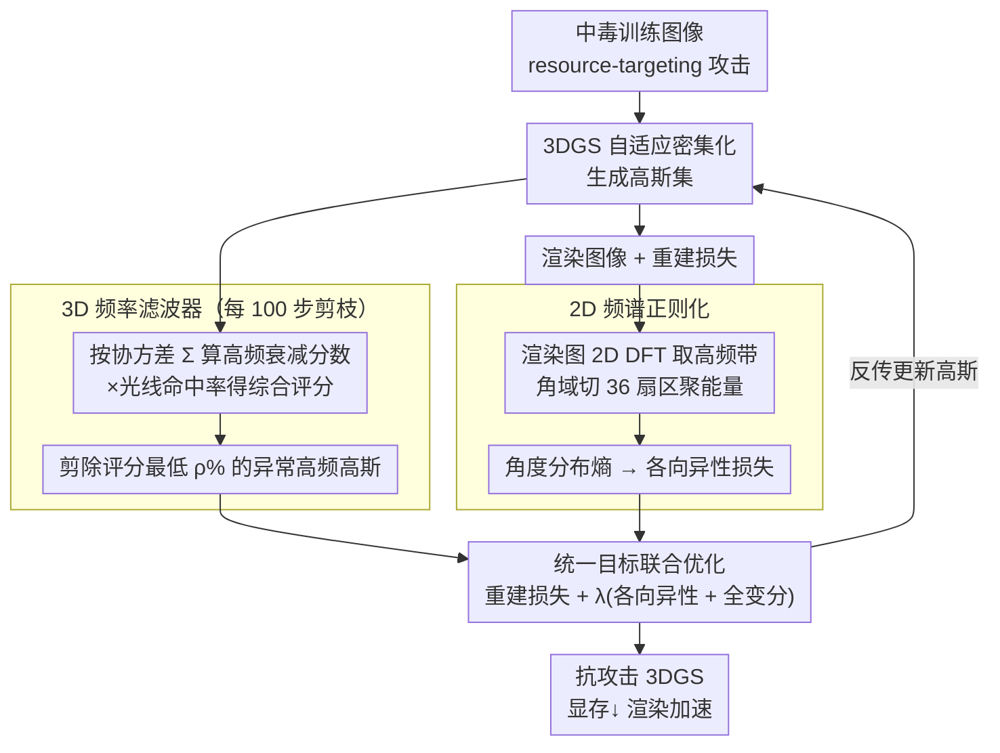

<!-- 由 src/gen_stubs.py 自动生成 -->
# Spectral Defense Against Resource-Targeting Attack in 3D Gaussian Splatting

**会议**: CVPR2026  
**arXiv**: [2603.12796](https://arxiv.org/abs/2603.12796)  
**代码**: 待确认  
**领域**: 3D视觉  
**关键词**: 3D Gaussian Splatting, 对抗防御, 资源耗尽攻击, 频域分析, 高斯剪枝, 频谱正则化

## 一句话总结

提出首个针对 3DGS 资源耗尽攻击的频域防御框架，通过 3D 频率滤波器选择性剪枝异常高频高斯 + 2D 频谱正则化约束渲染图像的各向异性噪声，在攻击下将高斯过生长抑制最高 5.92×、显存降低最高 3.66×、渲染加速最高 4.34×，同时保持重建质量。

## 研究背景与动机

**3DGS 的安全盲区**：3D Gaussian Splatting 通过自适应密集化机制匹配场景复杂度，但这种灵活性暴露了新的攻击面——资源耗尽攻击（resource-targeting attack）。攻击者仅需投毒训练图像，即可诱导高斯原语过度生长，导致 GPU 内存耗尽和训练/渲染速度大幅下降。

**现有防御手段失效**：Poison-Splat 提出的简单防御（图像平滑或统一高斯数阈值）存在明显缺陷——平滑会破坏有效细节结构，统一阈值无法泛化到不同场景复杂度，对某些场景过于严格、对另一些则不够。

**效率剪枝方法不适用**：LightGaussian、PUP 等效率导向的剪枝策略是为干净输入设计的，在中毒输入下难以区分精细细节与恶意噪声纹理，因此无法可靠地识别和移除攻击诱导的高斯。

**空间域检测不可靠**：投毒扰动在像素空间极其隐蔽（受 ε-ball 约束），但在频域表现为异常的高频放大和方向各向异性，空间域方法难以捕获这些频谱畸变。

**频域根因分析**：作者观察到过生长的根本原因在于频谱行为而非空间结构——中毒图像在 Fourier 域高频区域出现异常能量集中和方向偏斜，误导优化器将噪声模式解释为细节结构。

**直接抑制高频不可行**：自然场景同样包含合法的高频成分（边缘、纹理），粗暴滤波会严重损害重建保真度，需要更精细的频域先验来区分合法与恶意高频。

## 方法详解

### 整体框架

资源耗尽攻击的要害是：攻击者投毒训练图，诱导 3DGS 的自适应密集化机制疯狂生长高斯原语，吃光显存、拖垮渲染。作者发现过生长的根因不在空间结构而在频谱——中毒图在 Fourier 高频区出现异常能量集中和方向偏斜，把噪声误判成细节。Spectral Defense 据此双管齐下：在3D高斯参数空间里用频率滤波器周期性剪掉那些“异常高频”的高斯，在2D渲染图像的频域里用正则项压制各向异性噪声，两者和重建损失、全变分损失合成统一目标联合优化。

### 关键设计

**1. 3D 频率滤波器：按频率响应剔除恶意高斯**

面向干净输入的效率剪枝（LightGaussian、PUP）在中毒场景失灵，因为它们分不清精细细节和恶意噪声纹理。这里换个判据：每个高斯 $G$ 的协方差矩阵 $\Sigma$ 完全决定它的频率响应，Fourier 变换后振幅衰减为 $\gamma(t) = (2\pi)^{3/2}|\Sigma|^{1/2}\exp(-2\pi^2 t^\top \Sigma t)$，$\Sigma$ 的最小特征值 $\sigma_{\min}$ 越小、高频响应越强。据此在固定截止频率 $t=8$ 处算高频衰减分数 $\mathcal{S}(G) = \exp(-2\pi^2 t^2 \sigma_{\min}^2)$，再转成频率感知权重 $\mathcal{W}(G) = (1 - \mathcal{S}(G))^\alpha$（$\alpha=2$）让异常高频高斯拿到低权重，并乘上光线命中率得综合评分 $\text{score}(G) = \mathcal{W}(G) \cdot \text{hit}(G)$ 以兼顾几何可见性。每 $T_{\text{prune}}=100$ 步随机采样 $K^*=48$ 个视角算分，剪除最低 $\rho\%$ 的高斯——既精准命中攻击诱导的高斯，又不像粗暴滤波那样误伤合法边缘纹理。

**2. 2D 频谱正则化：用角度各向异性抓投毒信号**

投毒扰动在像素空间被 ε-ball 约束得极隐蔽，空间域几乎看不出，但在频域会暴露成方向上的尖锐集中。正则化先对渲染图做 2D DFT，提取高频带 $\mathcal{E}(u,v)$（能量落在 $[\dot{\gamma}_{\min}, \dot{\gamma}_{\max}] = [0.3, 0.9]$），再把角域 $[-\pi, \pi)$ 均匀切成 $B=36$ 个扇区聚合各扇区高频能量 $\mathcal{E}_b$，归一化成概率分布 $\mathcal{P}_b$。干净图的高频近似各向同性（分布均匀），中毒图则在少数方向尖锐集中（各向异性）。用信息熵刻画这种均匀程度，各向异性损失为 $\mathcal{L}_{\text{ani}} = 1 - \mathcal{H}/\log B$（$\mathcal{H}$ 为角度分布的信息熵），熵越低、各向异性越强、惩罚越大，把渲染往各向同性的自然分布推。

### 损失函数

$$\min_{\mathcal{G}} \Big(\mathcal{L}(\dot{\mathcal{V}}^p, \mathcal{V}^p) + \lambda\big(\mathcal{L}_{\text{freq}}(\dot{\mathcal{V}}^p) + \mathcal{L}_{\text{tv}}(\dot{\mathcal{V}}^p)\big)\Big)$$

其中 $\mathcal{L}$ 为标准 3DGS 重建损失（L1 + D-SSIM），$\mathcal{L}_{\text{freq}}$ 为各视角各向异性损失均值，$\mathcal{L}_{\text{tv}}$ 为全变分损失，$\lambda$ 按场景复杂度设为 4–5。

## 实验

### 实验设置

- **数据集**：Tanks and Temples（21 场景）、NeRF-Synthetic（8 物体）、Mip-NeRF 360（9 场景）
- **对比方法**：Universal Threshold (UT▽)、LightGaussian (LG▽)、PUP 3D-GS (PUP▽)，均在中毒设定下实现
- **评估指标**：高斯数量、峰值 GPU 显存、训练时间、FPS、PSNR、SSIM
- **硬件**：单张 NVIDIA RTX A6000

### 主要结果

| 数据集 | 指标 | Clean | Poison | Defense | 防御效果 |
|--------|------|-------|--------|---------|---------|
| TT (avg) | 高斯数(M) | 1.751 | 2.889 (1.65×↑) | 1.128 (2.56×↓) | 有效抑制 |
| NS (avg) | 高斯数(M) | 0.291 | 0.720 (2.47×↑) | 0.273 (2.64×↓) | 低于 clean |
| MIP (avg) | 高斯数(M) | 3.191 | 7.045 (2.21×↑) | 1.876 (3.76×↓) | 显著压缩 |
| MIP-bonsai | 高斯数(M) | 1.273 | 6.139 (4.82×↑) | 1.037 (**5.92×↓**) | 最佳 |
| TT-Train | 峰值显存(MB) | 5674 | 15805 (2.79×↑) | 4324 (**3.66×↓**) | 最佳 |
| MIP-garden | FPS | — | 48 (poison) | 208 (**4.34×↑**) | 最佳 |

渲染质量方面，防御方法在所有场景上均优于其他剪枝基线，如 MIP-bonsai PSNR 从 poison 的 27.14 提升到 29.07（UT▽ 仅 22.68）、SSIM 从 0.64 提升到 0.84。

### 消融实验

| 消融因素 | 关键发现 |
|---------|---------|
| 参考频率 $t$ 与指数 $\alpha$ | $t=8, \alpha=2$ 最佳；不同设置下结果稳定 |
| 剪枝比例 $\rho$ 与采样数 $K^*$ | $\rho=3\%, K^*=48$ 在 NS 上最优平衡；过高 $\rho$ 损害 PSNR |
| 频率阈值 $[\dot{\gamma}_{\min}, \dot{\gamma}_{\max}]$ | [0.3, 0.9] 整体最优，方法对超参不敏感 |
| 角度分区数 $B$ | $B=36$ 最佳，过大导致高斯数回升 |
| 损失权重 $\lambda$ | TT/NS 用 4、MIP 用 5；过大会过度抑制自然模式 |
| 攻击强度 $\epsilon$ | 从 8/255 到无约束攻击均有效防御，强攻击下防御增益更显著 |

### 关键发现

- 防御效果在 defense 设定下甚至可以将高斯数压缩到 **低于 clean 设定**（如 NS 平均 0.273M vs clean 0.291M），说明频率滤波也能去除原始场景冗余
- 在干净输入上应用防御同样有效（Table 4），MIP-bicycle 高斯数从 5.782M 降到 1.339M（4.32×↓），兼具效率优化功能
- 黑盒攻击实验（Table 5）：攻击基于 3DGS 生成但受害者是 Scaffold-GS，防御仍然有效，说明方法具有跨架构泛化能力

## 亮点

- **首创性**：首个针对 3DGS 资源耗尽攻击的防御框架，填补了 3DGS 安全研究的空白
- **频域视角新颖**：从频谱行为分析攻击根因，揭示高频各向异性是核心信号，比空间域方法更有原理性
- **双层防御互补**：3D 频率滤波解决参数空间冗余，2D 频谱正则修正图像域噪声，两者协同比单独使用更有效
- **实用性强**：作为即插即用模块嵌入训练循环，无需干净监督，也可作为效率优化工具用于非攻击场景
- **实验全面**：3 个数据集 38 个场景 × 3 次平均，涵盖 clean/poison/defense 全设定，消融丰富

## 局限性

- 需要为不同规模场景手动调整 $\rho$ 和 $\lambda$（NS 用 3%/4，TT 用 4.5%/4，MIP 用 5%/5），自动化程度有限
- 频谱正则化基于全局 DFT，对局部化攻击模式（如仅影响图像局部区域的扰动）可能不够敏感
- 仅验证了 Poison-Splat 一种攻击方法，未评估潜在的自适应对抗攻击（专门设计来规避频域防御）
- 防御后复杂场景（如 MIP-counter）的训练时间仅小幅降低（1.12×↓），显示大场景效率提升存在瓶颈
- 截止频率 $t$ 固定为全局常数，未根据场景内容自适应调整

## 相关工作

- **Poison-Splat** [Lu et al., 2024]：首个对 3DGS 的资源耗尽攻击，本文的攻击设定基础
- **LightGaussian** [Fan et al., 2024]：基于重要性评分的高斯剪枝，本文对比基线
- **PUP 3D-GS** [Hanson et al., 2025]：另一种剪枝策略，同为对比基线
- **Scaffold-GS** [Lu et al., 2024]：基于锚点的高斯表示，用于黑盒攻击泛化实验
- **MaskGaussian** [Liu et al., 2025]：可学习掩码剪枝策略
- **3DGS 安全研究**：StealthAttack [Ke et al., 2025] 针对准确率，IPA-NeRF [Jiang et al., 2024] 针对 NeRF 投毒

## 评分

- 新颖性: ⭐⭐⭐⭐ — 首个 3DGS 资源攻击防御，频域分析视角独到
- 实验充分度: ⭐⭐⭐⭐⭐ — 38 场景 3 数据集，多基线对比、消融全面、黑盒/干净泛化
- 写作质量: ⭐⭐⭐⭐ — 结构清晰，频域推导严谨，图表信息量大
- 价值: ⭐⭐⭐⭐ — 填补安全防御空白，兼具效率优化实用性

<!-- RELATED:START -->

## 相关论文

- [\[CVPR 2026\] FastGS: Training 3D Gaussian Splatting in 100 Seconds](fastgs_training_3d_gaussian_splatting_in_100_seconds.md)
- [\[CVPR 2026\] VarSplat: Uncertainty-aware 3D Gaussian Splatting for Robust RGB-D SLAM](varsplat_uncertainty-aware_3d_gaussian_splatting_for_robust_rgb-d_slam.md)
- [\[CVPR 2026\] Rethinking Pose Refinement in 3D Gaussian Splatting under Pose Prior and Geometric Uncertainty](rethinking_pose_refinement_in_3d_gaussian_splatting_under_pose_prior_and_geometr.md)
- [\[CVPR 2026\] Speeding Up the Learning of 3D Gaussians with Much Shorter Gaussian Lists](speeding_up_the_learning_of_3d_gaussians_with_much_shorter_gaussian_lists.md)
- [\[CVPR 2026\] Where, What, Why: Toward Explainable 3D-GS Watermarking](where_what_why_toward_explainable_3d-gs_watermarking.md)

<!-- RELATED:END -->
