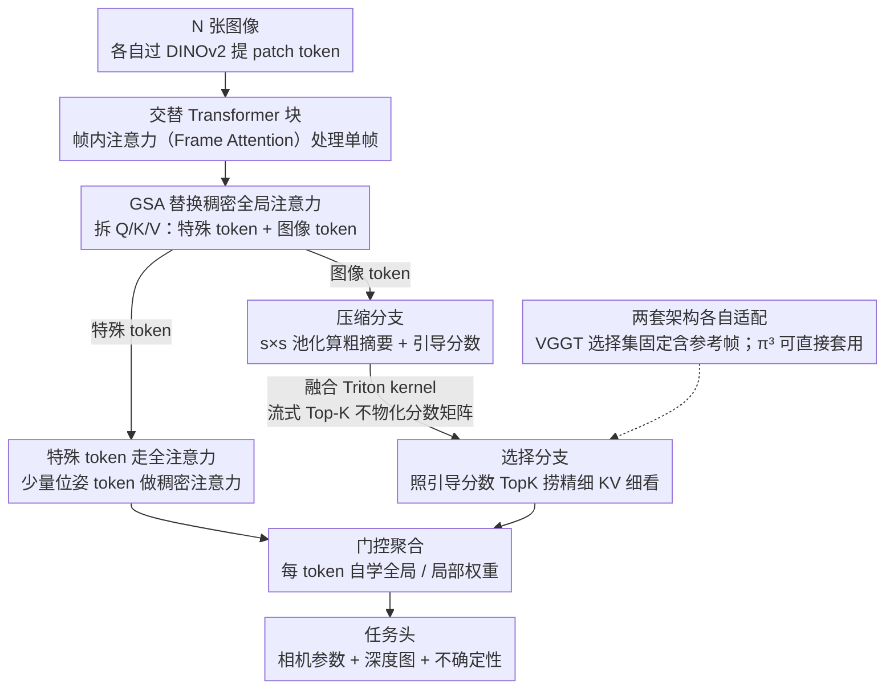

# Speed3R: Sparse Feed-forward 3D Reconstruction Models

**会议**: CVPR 2026 Findings  
**arXiv**: [2603.08055](https://arxiv.org/abs/2603.08055)  
**代码**: [https://visual-ai.github.io/speed3r/](https://visual-ai.github.io/speed3r/)  
**领域**: 3D视觉  
**关键词**: 3D重建, 稀疏注意力, Feed-forward, 推理加速, Structure-from-Motion

## 一句话总结

Speed3R 为 feed-forward 3D重建模型设计了可训练的双分支全局稀疏注意力机制（GSA），通过压缩分支提供粗粒度场景摘要、选择分支聚焦关键 token 精细注意力，在1000视图序列上实现 **12.4倍推理加速**，同时仅引入微小精度下降。

## 研究背景与动机

**领域现状**：近期 feed-forward 3D重建模型（VGGT、$\pi^3$）能在单次前向传播中联合推理密集几何和相机位姿，绕过了经典 SfM/MVS 的多阶段流水线。

**核心痛点**：这些模型依赖稠密全局注意力，计算量随 token 数量呈 $O(n^2)$ 增长。当处理大量视图或高分辨率图像时，推理速度成为严重瓶颈——例如 $\pi^3$ 处理1024张图需要 **202秒**。

**已有尝试的不足**：FastVGGT（token merge-unmerge）和 Block-Sparse VGGT（top-k 注意力）是 training-free 方法，无法进行端到端优化，激进剪枝会导致显著精度下降。

**经典洞察**：传统 SfM 的核心思想——稀疏关键点足以完成鲁棒的位姿估计——尚未被 feed-forward 方法充分利用。

**本文方案**：受 SfM 和 LLM 中稀疏注意力（NSA、MOBA）的双重启发，设计可端到端训练的稀疏注意力，用知识蒸馏迁移稠密模型的性能。

## 方法详解

### 整体框架

Speed3R 想解决的事很具体：让 VGGT、$\pi^3$ 这类 feed-forward 3D 重建模型在长序列上跑得快。这些模型把多视图几何和相机位姿压进一次前向传播，但代价是每个 Transformer 块都做稠密全局注意力，token 一多就 $O(n^2)$ 爆炸。Speed3R 的做法是把那个稠密全局注意力整块换成自己设计的全局稀疏注意力（GSA），其余流水线照旧：$N$ 张图先各自过 DINOv2 提 patch token，进入交替堆叠的 Transformer——局部的帧内注意力（Frame Attention）负责单帧内部，全局的 GSA 负责跨帧信息流——精炼后的 token 再送进任务头，输出每视图的相机参数 $\{\hat{C_i}\}$、深度图 $\{\hat{D_i}\}$ 和不确定性 $\{\hat{\alpha_i}\}$。GSA 的总思路是「从粗到细」：先用低分辨率表征把整个场景看个大概，再据此让每个 token 在全分辨率下只盯着最该看的那一小撮邻居。

### 关键设计

**1. 特殊 token 走全注意力，只对海量图像 token 下手**

GSA 的输入 $X \in \mathbb{R}^{M \times C}$ 是特殊 token $X_{\text{spec}}$（如位姿 token）和图像 token $X_{\text{img}}$ 拼起来的，投影出 Q/K/V 后按类型切开。位姿这类全局任务最怕信息被剪掉，而特殊 token 本来就没几个，所以干脆让它们对全部 token 做标准稠密注意力，开销可忽略：

$$O_{\text{spec}} = \text{softmax}\left(\frac{Q_{\text{spec}} K^T}{\sqrt{d_k}}\right) V$$

真正撑爆 $O(n^2)$ 的是数量庞大的图像 token，后面三步全部只对它们做稀疏化——这样既保住了关键全局信息，又把刀砍在了瓶颈上。

**2. 压缩分支：先把场景看个大概，顺手算出引导分数**

对 $Q_{\text{img}}, K_{\text{img}}, V_{\text{img}}$ 做 $s \times s$ 非重叠平均池化，把图像 token 从 $M_{\text{img}}$ 压到 $M'_{\text{img}} = M_{\text{img}} / s^2$，在这个小得多的压缩空间里算注意力 $O'_{\text{comp}} = \text{Attention}(Q_{\text{comp}}, K_{\text{comp}}, V_{\text{comp}})$，再用最近邻插值上采样回原分辨率 $O_{\text{comp}} = \text{Upsample}(O'_{\text{comp}})$。这一分支给出的是粗粒度的全局摘要；更关键的是它顺带产出一张引导分数矩阵

$$S_{\text{guide}} = Q_{\text{comp}} K_{\text{comp}}^T \in \mathbb{R}^{M'_{\text{img}} \times M'_{\text{img}}}$$

它记录了哪些粗区域彼此相关，等于替下一步选 token 提前划好了重点。

**3. 选择分支：照着引导分数把精细 KV 捞回来**

光有粗摘要会丢细节，所以再补一条精细分支。对每个 query 用 $\text{TopKSelect}(\cdot)$ 从 $S_{\text{guide}}$ 里挑出最相关的几个粗区域，再回到全分辨率的 $K_{\text{img}}, V_{\text{img}}$ 取出对应的 $K_{\text{sel}}, V_{\text{sel}}$（同一压缩窗口内的 query 共享同一组 KV，省掉重复挑选），只在这一小撮上算精细注意力：

$$O_{\text{sel}} = \text{Attention}(Q_{\text{img}}, K_{\text{sel}}, V_{\text{sel}})$$

每个 query 实际只注意 $k \ll M_{\text{img}}$ 个 token——这正是把 SfM「稀疏关键点就足够鲁棒位姿估计」的老经验搬进 feed-forward 模型：不必看全场，看对的几个点就行。

**4. 门控聚合：每个 token 自己决定看全局还是看局部**

粗摘要和精细注意力各有所长，硬性二选一不划算，于是用一个可学习门控按 token 动态加权：

$$g = \sigma(W_g Q_{\text{img}}), \quad O_{\text{img}} = g \odot O_{\text{comp}} + (1 - g) \odot O_{\text{sel}}$$

$\sigma$ 是 sigmoid、$W_g$ 是学习投影。需要全局上下文的 token 多取压缩分支，需要细节的多取选择分支，融合权重交给模型自己学。

**5. 融合 Triton kernel：别让完整分数矩阵落地显存**

朴素实现会把 $S_{\text{guide}}$ 整张分数矩阵物化出来，长序列下显存吃不消。作者写了个融合 kernel，把流式 Top-K 塞进 FlashAttention 的工作流：在片上 SRAM 逐 tile 算分数时就同步维护一个 running top-k 索引集合，一次扫描同时完成区域选择和压缩输出，全程不物化完整矩阵——这才让稀疏的理论加速真正落到墙钟时间上。

**6. 两套架构各自适配**

GSA 是即插即用的，但两套 backbone 的细节不同。VGGT 把首帧当全局参考帧、还带专用相机 token，为防参考信息被稀疏掉，它的选择集固定包含「参考帧全部 token + 每隔 100 帧采样的 token」这层全局上下文，再叠加非参考帧的动态 Top-K 窗口。$\pi^3$ 没有参考帧和相机 token 依赖，可直接套 GSA，实验还发现它的 register token 在稀疏变体里能直接移除、性能不掉，模型反而更简洁。

### 一个例子：1024 张图怎么稀疏下来

拿 $\pi^3$ 处理 1024 张图来感受一下省在哪。稠密版每个 token 要和全序列所有图像 token 两两算注意力，整段前向要 **202.39 秒**。换成 GSA 后（消融最优配置 $4\times4$ 窗口、top-32）：压缩分支先把图像 token 按 $4\times4$ 池化、整体规模缩到约 $1/16$，在这个小空间里算出全局摘要和引导分数；选择分支再让每个 query 只挑 32 个最相关的粗区域、回到全分辨率细看对应窗口，而不是扫全部上万个 token；门控把两路一融合。同一段前向因此压到 **16.38 秒**，加速 **12.4×**，而 RE10K / CO3Dv2 的位姿精度几乎不掉。更有意思的是：训练用 top-32，推理时把 top-k 调到 128 还能继续涨长序列精度（见测试时自适应），说明这条「先粗看、再精挑」的路子留足了可调空间。

### 训练策略

训练走知识蒸馏：拿预训练好的稠密模型当 teacher，用它的深度和位姿预测当伪标签来教稀疏 student，绕开真实数据集标签噪声。总损失为 $\mathcal{L}_{\text{total}} = \mathcal{L}_{\text{depth}} + \lambda \mathcal{L}_{\text{camera}}$，在 7 个数据集（ArkitScene、Scannet++、DL3DV、CO3D、Hypersim、WildRGBD、VirtualKitti2）混合上训 80 epochs（每 epoch 800 步），8× NVIDIA H20 约 7 天，学习率 $1 \times 10^{-5}$，梯度累积 factor=4（有效 batch size 32）。

## 实验

### 主实验：多视图位姿估计（RE10K / CO3Dv2）

| 方法 | 稀疏率(%) | RE10K AUC@30↑ | CO3Dv2 AUC@30↑ |
|------|-----------|---------------|----------------|
| VGGT (dense) | 0 | 74.17 | 88.33 |
| Block Sparse-VGGT | 75 | 63.82 | 79.92 |
| FastVGGT | 82 | 69.99 | 84.03 |
| **Speed3R-VGGT** | **84** | **74.81** | **87.71** |
| $\pi^3$ (dense) | 0 | 87.37 | 89.67 |
| Block Sparse-$\pi^3$ | 75 | 75.39 | 80.72 |
| FastVGGT-$\pi^3$ | 90 | 86.04 | 86.39 |
| **Speed3R-$\pi^3$** | **94** | **87.17** | **89.41** |

**关键发现**：

- Speed3R-VGGT 在 84% 稀疏率下在 RE10K 上 **超越了稠密 VGGT 基线**（74.81 vs 74.17）
- Speed3R-$\pi^3$ 在 94% 稀疏率下几乎匹配稠密 $\pi^3$ 的性能
- 在所有稀疏率水平上一致优于 training-free 竞争方法

### 长序列位姿估计（Tanks & Temples，平均300图/场景）

| 方法 | RRA@5↑ | RTA@5↑ | AUC@30↑ | 时间(s)↓ |
|------|--------|--------|---------|----------|
| VGGT (dense) | 70.29 | 79.30 | 77.67 | 34.51 |
| Block Sparse-VGGT | 66.83 | 71.29 | 74.15 | 10.79 |
| FastVGGT | 69.28 | 77.98 | 76.29 | 15.98 |
| **Speed3R-VGGT** | **69.51** | **77.81** | **76.57** | **6.55** |
| $\pi^3$ (dense) | 72.14 | 81.26 | 79.63 | 22.32 |
| Block Sparse-$\pi^3$ | 67.85 | 78.91 | 76.64 | 8.16 |
| FastVGGT-$\pi^3$ | 69.78 | 79.51 | 77.76 | 11.96 |
| **Speed3R-$\pi^3$** | **70.72** | **80.72** | **79.77** | **4.19** |

**关键发现**：Speed3R-$\pi^3$ 在所有指标上取得稀疏方法最优，同时推理速度最快（4.19s），比稠密 $\pi^3$ 快 **5.3倍**。

### 消融实验（Speed3R-$\pi^3$，T&T 数据集）

| 配置 | RE10K AUC@30↑ | T&T AUC@30↑ | 时间(s)↓ |
|------|---------------|-------------|----------|
| Base (4×4窗口, top-32) | 86.35 | 78.69 | 4.19 |
| (1) 移除压缩分支 Value | 86.29 | 77.90 | 3.99 |
| (2) 移除选择分支 | 83.44 | 76.84 | 3.56 |
| (4) Top-8 | 85.37 | 78.17 | 3.72 |
| (5) Top-16 | 85.98 | 78.55 | 3.92 |
| (6) Top-64 | 86.42 | 78.90 | 4.64 |
| (7) 8×8 窗口 | 86.49 | 78.71 | 5.27 |
| (8) 无知识蒸馏 | 85.18 | 77.81 | 4.19 |

**消融关键结论**：

- **选择分支是核心**：移除后两个数据集上均大幅下降（RE10K -2.91, T&T -1.85）
- **压缩分支对长序列重要**：移除 Value 后短序列几乎不变但长序列下降（T&T -0.79）
- **知识蒸馏至关重要**：移除后 RE10K 降1.17、T&T 降0.88，有效缓解真实数据集噪声标签问题
- **4×4窗口 + top-32 为最佳平衡点**：top-8/16 精度不足，top-64 和 8×8窗口增速有限但精度提升微小

### 推理延迟对比

| 序列长度 | 32 | 64 | 128 | 256 | 512 | 1024 |
|---------|-----|------|------|------|------|-------|
| Full Attn. ($\pi^3$) | 0.50s | 1.31s | 3.97s | 13.41s | 50.01s | 202.39s |
| Block Sparse | 0.46s | 0.85s | 1.69s | 3.77s | 9.64s | 29.58s |
| FastVGGT | 0.44s | 0.88s | 1.96s | 4.95s | 14.13s | 45.49s |
| **Speed3R** | **0.37s** | **0.71s** | **1.44s** | **3.06s** | **6.83s** | **16.38s** |

1024张图：Speed3R 仅需 16.38s vs 稠密模型 202.39s，加速比 **12.4×**。

### 测试时自适应（Tanks & Temples）

训练时用 top-32，推理时增大 top-k 可持续提升长序列性能。top-128 时 RTA@5 达 82.00 **超越稠密模型**（81.26），AUC@30 达 80.33 也超越稠密模型（79.63），时间仅 6.07s。

## 亮点与创新

- **经典与现代融合**：将 SfM "稀疏关键点足矣"的洞察与 LLM 稀疏注意力技术结合，设计出适配3D重建的可训练稀疏注意力
- **从粗到细的双分支设计**：压缩分支建全局理解 → 引导选择分支聚焦关键区域，兼顾全局性与局部精度
- **端到端可训练**：相比 FastVGGT/Block-Sparse 等 training-free 方法，训练时优化带来显著优势
- **通用即插即用**：成功适配 VGGT 和 $\pi^3$ 两套架构，验证了泛化性
- **自定义 Triton kernel**：融合 Top-K + FlashAttention 实现高效显存访问，避免完整分数矩阵物化

## 局限性

1. **短序列精度差距**：在严格阈值 AUC@5 下与稠密模型仍有差距，位姿回归的高精度需求对稀疏方法挑战较大
2. **显存开销**：GSA 双分支架构相比全注意力有 **15% 内存开销**，单 80GB GPU 最多处理 1024 张图
3. **依赖预训练稠密模型**：知识蒸馏策略要求先有高质量稠密 teacher，增加了训练流程复杂度
4. **3D重建 vs 生成任务**：位姿回归对数值精度要求极高，不如文本/图像生成对稀疏注意力友好

## 评分

⭐⭐⭐⭐ — 首个面向 feed-forward 3D重建的可训练稀疏注意力方法，12.4× 加速实用意义大，双分支设计优雅且消融充分；但短序列严格指标下精度仍有差距，且方法受限于3D重建中位姿回归的高精度需求。

<!-- RELATED:START -->

## 相关论文

- [\[CVPR 2026\] VGG-T3: Offline Feed-Forward 3D Reconstruction at Scale](vgg-t3_offline_feed-forward_3d_reconstruction_at_scale.md)
- [\[CVPR 2026\] AMB3R: Accurate Feed-forward Metric-scale 3D Reconstruction with Backend](amb3r_accurate_feed-forward_metric-scale_3d_reconstruction_with_backend.md)
- [\[CVPR 2026\] PanoVGGT: Feed-Forward 3D Reconstruction from Panoramic Imagery](panovggt_feed-forward_3d_reconstruction_from_panoramic_imagery.md)
- [\[ICML 2026\] Trust3R: Evidential Uncertainty for Feed-Forward 3D Reconstruction](../../ICML2026/3d_vision/trust_it_or_not_evidential_uncertainty_for_feed-forward_3d_reconstruction_with_t.md)
- [\[CVPR 2026\] Z-Order Transformer for Feed-Forward Gaussian Splatting](z-order_transformer_for_feed-forward_gaussian_splatting.md)

<!-- RELATED:END -->
