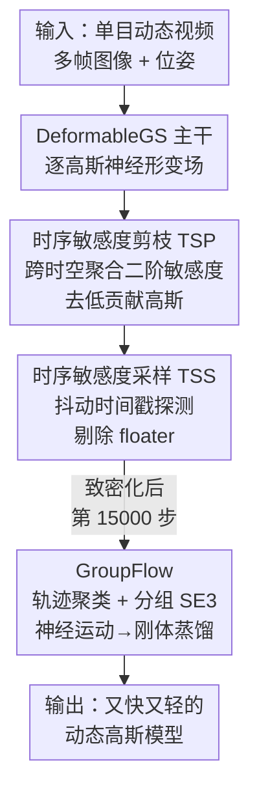

# SpeeDe3DGS: Speedy Deformable 3D Gaussian Splatting with Temporal Pruning and Motion Grouping

**会议**: CVPR 2026  
**论文**: [CVF Open Access](https://openaccess.thecvf.com/content/CVPR2026/html/Tu_SpeeDe3DGS_Speedy_Deformable_3D_Gaussian_Splatting_with_Temporal_Pruning_and_CVPR_2026_paper.html)  
**代码**: https://speede3dgs.github.io （项目页）  
**领域**: 3D视觉  
**关键词**: 动态高斯泼溅, 时序剪枝, 运动场蒸馏, 实时渲染, 形变场

## 一句话总结
SpeeDe3DGS 在 DeformableGS 之上叠加三个模块——时序敏感度剪枝（TSP）、时序敏感度采样（TSS）和分组刚体运动蒸馏（GroupFlow），在保持神经形变场画质的同时把动态高斯泼溅的渲染速度提升 13.71×、训练缩短 2.53×、高斯数量减到 1/10。

## 研究背景与动机

**领域现状**：3D Gaussian Splatting（3DGS）用可微光栅化的高斯点取代 NeRF 的逐光线 MLP 积分，实现了静态场景的实时高保真渲染。要扩展到动态场景，主流做法是给每个高斯耦合一个随时间变化的运动场：DeformableGS 用一个共享 MLP 预测形变偏移 $(\Delta\mu_t, \Delta r_t, \Delta s_t)$，4DGS 用 HexPlane 网格做时空插值。MonoDyGauBench 的系统比较显示，这类神经运动场重建质量最高、最稳定。

**现有痛点**：神经运动场的高质量是用算力换来的——形变网络必须对**每个高斯、每一帧**都做一次神经推理。在 MonoDyGauBench 上，DeformableGS 只有 20.20 FPS，比解析式或非神经的运动表示慢好几倍，难以实时。

**核心矛盾**：保真度（neural motion field）和效率（analytic motion）之间存在 trade-off。要么用神经场拿到高画质但跑得慢，要么用解析式跑得快但画质掉。

**本文目标**：在不牺牲神经场画质的前提下，把动态 3DGS 的渲染逼近非神经表示的速度，需要同时解决两件事——减少需要做神经推理的高斯数量，以及降低每个高斯的形变推理成本。

**切入角度**：作者观察到两点冗余。其一，动态 3DGS 严重过参数化，靠少得多的高斯就能达到相近画质（沿用 Speedy-Splat 的发现），所以可以剪枝；但静态场景的敏感度剪枝只在固定帧上算梯度，对动态场景里"在观测帧表现正常、外推到未见时刻就漂移"的 floater 无能为力。其二，真实场景里很多物体是局部刚性运动，相邻高斯轨迹高度相关，没必要每个高斯各算一套形变。

**核心 idea**：把"逐高斯神经推理"这个瓶颈从两头压——**时序感知的剪枝**砍掉低贡献和时序不稳的高斯，**分组刚体蒸馏**把剩下高斯的神经形变场压缩成每组共享一个 SE(3) 变换。

## 方法详解

### 整体框架
SpeeDe3DGS 是一个集成进 DeformableGS 的统一训练管线。输入是单目动态视频的多帧图像与位姿，输出是一个又快又轻的动态高斯模型。训练分两阶段推进：先在致密化阶段穿插 TSP+TSS 做"软剪枝/硬剪枝"逐步收缩模型容量，去掉冗余和不稳定的高斯；致密化结束后再上 GroupFlow，把已经学好的神经形变场蒸馏成分组刚体运动，从此推理只需按组算变换而不是按高斯算。三个模块互补：TSP 减数量、TSS 稳剪枝、GroupFlow 降单位推理成本。

### 关键设计

**1. 时序敏感度剪枝 TSP：把静态敏感度剪枝推广到带运动耦合的动态场景**

静态 3DGS 的剪枝（如 Speedy-Splat）用二阶敏感度衡量每个高斯对重建的贡献，但只在固定视角、单帧上算。动态场景里高斯的贡献会随时间变化，直接套用会漏掉运动相关的冗余。TSP 把 L2 重建损失对高斯投影贡献 $g_i$ 的二阶敏感度**沿所有训练位姿和时间戳累加**：训练收敛后残差项消失，敏感度近似为 $\tilde{U}_{G_i} \approx \sum_{\phi,t\in P_{gt}} (\nabla_{g_i} I_{G_t}(\phi))^2$。这里 $\nabla_{g_i} I_{G_t}(\phi)$ 是光栅化反向传播里现成的图像空间梯度，几乎零额外开销。关键在于：因为形变参数 $(\Delta\mu_t, \Delta r_t, \Delta s_t)$ 本身随时刻变化，这些梯度天然编码了时序运动耦合，于是 $\tilde{U}_{G_i}$ 不只对静态外观敏感，也对动态贡献敏感。每隔若干步把低分高斯去掉，就能以"时序感知"的方式剔除运动相关冗余。

**2. 时序敏感度采样 TSS：用抖动时间戳暴露并剪掉 floater**

TSP 只在观测到的训练时刻评估梯度，而 floater 这类高斯恰恰是"在观测帧上梯度很弱、看起来正常，外推到未见时刻才漂移出可见伪影"。TSS 是 TSP 的子模块，它在敏感度估计时往形变函数的时间戳输入注入一个线性退火的高斯扰动：$(\mu+\Delta\mu, r+\Delta r, s+\Delta s) = D(\mu, r, s, t+X(i))$，其中 $X(i) = N(0,1)\cdot\beta\cdot\Delta t\cdot(1-i/\tau)$，$\beta=0.1$ 控制扰动幅度，$\Delta t$ 是帧间隔，$\tau=20{,}000$ 是退火周期。由于敏感度公式不需要真值监督，TSS 可以完全自监督地在任意抖动运动状态上算分。这样那些"对小幅运动偏移反应不一致"的高斯会拿到更低敏感度从而被剪掉；早期强扰动鼓励探索、在致密化期间清 floater，后期退火到零让优化聚焦于精确重建观测帧——在时序鲁棒和重建精度间取得平衡，且评估是确定性的。

**3. GroupFlow：把逐高斯神经形变蒸馏成分组共享的 SE(3) 刚体运动**

即便剪枝后，形变网络仍要对每个剩余高斯做推理。给每个高斯单独配一个 SE(3) 变换在内存和参数上又太贵。GroupFlow 利用"真实动态物体多为局部刚性"这一点，把轨迹相似的高斯聚成 $J$ 组、每组共享一个随时间变化的刚体变换，从而把每帧要预测的变换数从 $N$（每高斯）降到 $J$（每组，论文取 $J=2048$）。具体分三步：先把每个高斯的运动表示成跨 $F$ 帧的均值与四元数序列 $M_i = \{\mu_i^t, r_i^t\}$；以 $t=0$ 为标准帧、对 $t=0$ 的均值做最远点采样选 $J$ 个控制点，按轨迹相似度 $S_{i,j} = \lambda_r \text{std}_t(\|\mu_i^t - h_j^t\|) + (1-\lambda_r)\text{mean}_t(\|\mu_i^t - h_j^t\|)$（$\lambda_r=0.5$）把每个高斯分到最近控制点；再对每组用 Umeyama 对齐（每组最多采样 $N_{max}=100$ 个均值）估计把标准帧映到 $t$ 时刻的 SE(3) 变换 $[R_j^t|T_j^t]$。推理时高斯位置按 $\mu_i^t = R_j^t(\mu_i^0 - h_j^0) + h_j^0 + T_j^t$ 计算、旋转按 $r_i^t = \text{quat}(R_j^t\,\text{mat}(r_i^0))$ 更新，$\{h_j^0, R_j^t, T_j^t\}$ 设为可学习参数。这套神经→刚体蒸馏不仅大幅降推理成本，还有正则作用：在位姿估计不稳的场景里反而能稳住重建、画质超过逐高斯基线。

### 损失函数 / 训练策略
沿用 3DGS 的图像重建损失 $L = \|I_G(\phi) - I_{gt}\|_1 + L_{\text{D-SSIM}}$。全程训练 30,000 步。从第 6,000 步起每隔 3,000 步执行一次 TSP：致密化阶段每次"软剪"掉 60% 的高斯，致密化结束后"硬剪"30%。TSS 扰动用 $\beta=0.1$、$\tau=20{,}000$ 退火。GroupFlow 在第 15,000 步致密化结束后初始化，组数 $J=2048$。FPS 在 RTX 3090 上测，训练时间在 RTX A5000 上测。

## 实验关键数据

### 主实验
在 MonoDyGauBench 的 50 个动态场景上，把 Pruning（TSP+TSS）和 GroupFlow 逐步叠加到 DeformableGS 与 4DGS 两个高保真但慢的基线上：

| 方法 | PSNR ↑ | SSIM ↑ | MS-SSIM ↑ | LPIPS ↓ | FPS ↑ | 训练时间(s) ↓ |
|------|--------|--------|-----------|---------|-------|---------------|
| DeformableGS | 24.07 | 0.694 | 0.755 | 0.283 | 20.20 (1.00×) | 6227 (1.00×) |
| + Pruning | 23.86 | 0.694 | 0.749 | 0.295 | 137.01 (6.78×) | 2851 (2.18×) |
| + GroupFlow | 23.52 | **0.709** | **0.771** | 0.313 | **276.91 (13.71×)** | **2461 (2.53×)** |
| 4DGS | 23.55 | 0.708 | 0.765 | 0.277 | 62.99 (1.00×) | 8629 (1.00×) |
| + Pruning | 22.44 | 0.689 | 0.737 | 0.334 | 179.64 (2.85×) | 4358 (1.47×) |
| + GroupFlow | 21.00 | 0.667 | 0.705 | 0.380 | 290.21 (4.61×) | 4176 (2.07×) |

DeformableGS+Pruning 渲染加速 6.78× 且画质几乎不掉、达到与非神经基线相当的帧率；再加 GroupFlow 到 13.71×、比所有基线快近 100 FPS，且 SSIM/MS-SSIM 反而**超过**原始 DeformableGS（GroupFlow 的轻度正则效果，在位姿估计不稳的场景最明显）。值得注意的是 GroupFlow 叠在 DeformableGS 上能涨 SSIM，叠在 4DGS 上却明显掉点——说明逐高斯推理的 DeformableGS 在分组运动下更能保真。

### 消融实验
NeRF-DS 数据集（7 个真实场景，三次平均）上逐模块拆解：

| 配置 | PSNR ↑ | SSIM ↑ | FPS ↑ | 高斯数 ↓ | 模型大小(MB) |
|------|--------|--------|-------|----------|--------------|
| DeformableGS 基线 | 23.80 | 0.8503 | 54.37 (1.00×) | 132.22K (1.00×) | 33.21 |
| + TSP | 23.78 | 0.8507 | 346.96 (6.38×) | 10.90K (12.13×) | 4.52 |
| + TSP + TSS | 23.81 | **0.8515** | 345.24 (6.35×) | 11.06K (11.95×) | 4.55 |
| + GroupFlow（无剪枝） | 23.54 | 0.8433 | 406.21 (8.58×) | 132.32K | 51.00 |
| + TSP + TSS + GroupFlow | 23.66 | 0.8487 | **505.60 (10.68×)** | 11.10K (11.91×) | 21.40 |

### 关键发现
- **TSP 是减数量主力**：单独 TSP 就把高斯压到 1/12、渲染快 6.38×，而 PSNR/SSIM 基本不掉。
- **TSS 把画质从"保持"推到"超过基线"**：TSP+TSS 的 SSIM（0.8515）高于基线（0.8503），因为时序扰动当正则用、压住了 floater，同时只多用了约 0.16K 高斯。
- **剪枝反而帮了 GroupFlow**：先剪再分组（TSP+TSS+GF）比单独 GroupFlow 的 PSNR/SSIM 都高，且整模型比基线还**小 1.55×**；单独 GroupFlow 不剪枝时模型反而膨胀到 51MB。
- **数据集间存在协同放大**：在 HyperNeRF 上 TSP+TSS 与 GroupFlow 单独是 9.37×、15.66× 渲染加速，合用达 29.21×、高斯减 12.18×、训练缩 3.74×。

## 亮点与洞察
- **零额外网络的"复用梯度"剪枝**：TSP 直接拿光栅化反向传播里现成的图像空间梯度做二阶敏感度，几乎不增加开销，却把静态剪枝推广到了带运动耦合的动态场景——形变参数随时间变意味着梯度天然编码时序贡献，这个观察很巧。
- **用时间抖动定义"稳定性"**：TSS 把"对小幅时间扰动反应不一致"等价于"是 floater"，从而用一个自监督扰动就把传统剪枝看不见的时序不稳高斯揪出来剪掉，且退火调度让它早期清杂、后期收敛。
- **神经→刚体的可学习蒸馏**：GroupFlow 不是简单聚类，而是用 Umeyama 对齐估计每组 SE(3) 并设为可学习参数，把 $N$ 个轨迹压成 $J$ 个，既省算力又带正则——"压缩即正则"在位姿噪声场景上转化为画质提升，可迁移到其他需要运动压缩的 4D 表示。
- **模块解耦、即插即用**：TSP/TSS 可加到任意动态 3DGS，GroupFlow 可加到任意带显式运动模型的方法，便于和已有 pipeline 组合。

## 局限与展望
- **极端剪枝/有限分组会掉质**：作者承认过高剪枝比例下会有轻微画质下降，高度可形变区域在组数受限时会丢细节，需要靠超参在速度与保真间权衡。
- **不含显式运动先验**：方法只引入了轻度正则，没有学习动力学或运动先验，因此与"先验驱动/运动感知"的 3DGS 是互补关系而非替代。
- **GroupFlow 对主干敏感**：⚠️ 实验显示 GroupFlow 叠在 4DGS 上明显掉点（PSNR 22.44→21.00），说明分组刚体假设并非对所有形变参数化都友好，迁移到 HexPlane 类网格运动时需谨慎。
- **局部刚性假设的适用边界**：分组共享 SE(3) 本质假设组内近似刚体，对强非刚性、流体类运动可能失效，可考虑组内再叠加轻量形变残差。

## 相关工作与启发
- **vs Speedy-Splat / PUP 3D-GS**：它们在静态 3DGS 上做基于 Hessian/梯度的敏感度剪枝；本文把敏感度沿时间维聚合（TSP）并加时序扰动探测（TSS），把剪枝推广到动态场景、能感知运动相关冗余。
- **vs SC-GS / MoSca / Shape of Motion**：这些用控制点+线性混合蒙皮或学习低维运动基来做分组运动，但往往依赖昂贵神经推理、复杂形变计算或 2D 先验引导；GroupFlow 用 Umeyama 对齐直接蒸馏出分组刚体 SE(3)，无需额外网络，更轻更快。
- **vs DeformableGS / 4DGS（主干）**：本文不替换它们的运动参数化，而是作为加速层叠在上面——在 DeformableGS 上能既提速又涨 SSIM，证明其作为强主干的价值。

## 评分
- 新颖性: ⭐⭐⭐⭐ 把静态敏感度剪枝时序化、再用时间抖动定义 floater、加分组刚体蒸馏，组合扎实但每一块都基于已有思路的推广。
- 实验充分度: ⭐⭐⭐⭐⭐ 覆盖 MonoDyGauBench 50 场景 + NeRF-DS/D-NeRF/HyperNeRF，逐模块消融、跨主干对比、三次平均，证据充分。
- 写作质量: ⭐⭐⭐⭐⭐ 动机—模块—实验逻辑清晰，公式与图示到位，trade-off 讨论诚实。
- 价值: ⭐⭐⭐⭐ 即插即用、把神经场动态 3DGS 推到实时，工程价值高；受限于局部刚性假设和主干敏感性。

<!-- RELATED:START -->

## 相关论文

- [\[CVPR 2026\] Space-Time Forecasting of Dynamic Scenes with Motion-aware Gaussian Grouping](space-time_forecasting_of_dynamic_scenes_with_motion-aware_gaussian_grouping.md)
- [\[CVPR 2026\] Prune Wisely, Reconstruct Sharply: Compact 3D Gaussian Splatting via Adaptive Pruning and Difference-of-Gaussian Primitives](prune_wisely_reconstruct_sharply_compact_3d_gaussian_splatting_via_adaptive_prun.md)
- [\[CVPR 2026\] Learning Explicit Continuous Motion Representation for Dynamic Gaussian Splatting from Monocular Videos](learning_explicit_continuous_motion_representation_for_dynamic_gaussian_splattin.md)
- [\[CVPR 2026\] FastEventDGS: Deformable Gaussian Splatting for Fast Dynamic Scenes from a Single Event Camera](fasteventdgs_deformable_gaussian_splatting_for_fast_dynamic_scenes_from_a_single.md)
- [\[CVPR 2026\] ST4R-Splat: Spatio-Temporal Referring Segmentation in 4D Gaussian Splatting](st4r-splat_spatio-temporal_referring_segmentation_in_4d_gaussian_splatting.md)

<!-- RELATED:END -->
