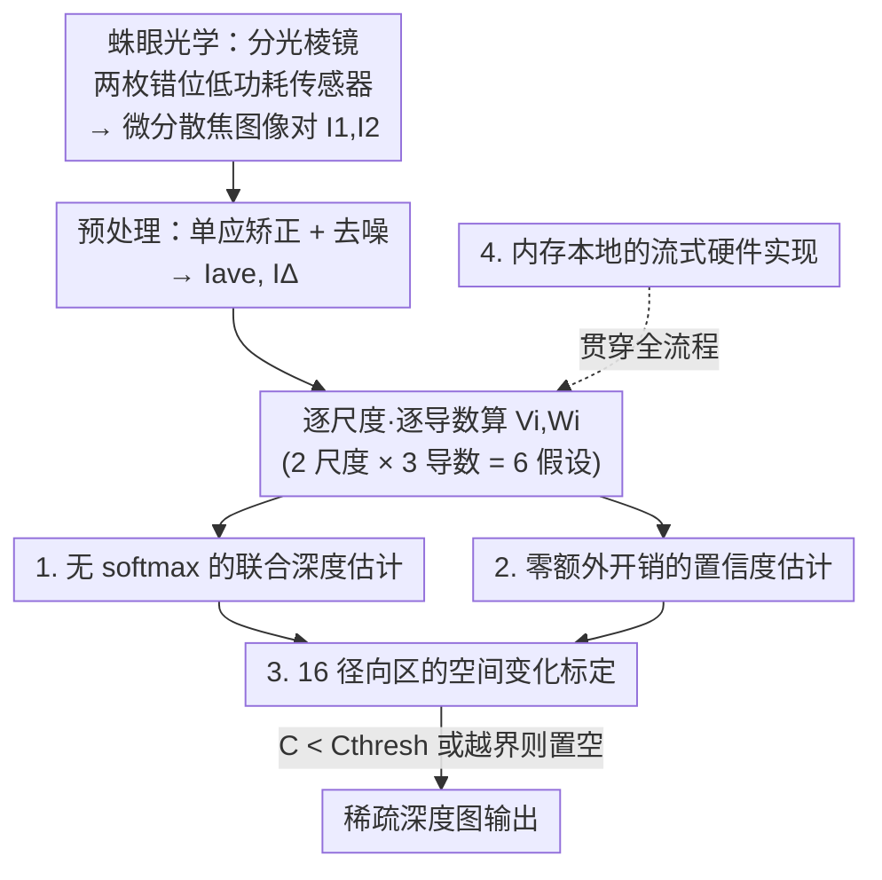

# SpiderCam: Low-Power Snapshot Depth from Differential Defocus

**会议**: CVPR 2026  
**论文**: [CVF Open Access](https://openaccess.thecvf.com/content/CVPR2026/html/Ferreira_SpiderCam_Low-Power_Snapshot_Depth_from_Differential_Defocus_CVPR_2026_paper.html)  
**代码**: 无（仅项目页 nubivlab.github.io/SpiderCam）  
**领域**: 3D视觉 / 计算成像  
**关键词**: 散焦深度, 微分散焦(DfDD), 低功耗FPGA, 快照成像, 流式硬件

## 一句话总结
SpiderCam 用一组分光棱镜 + 两枚低功耗图像传感器拍下同一场景的两张微分散焦图像，在一块小到连一对完整图像都存不下的低功耗 FPGA 上流式跑改进版微分散焦深度算法（DfDD），做出了文献中第一台总功耗低于 1 瓦（624 mW@32.5 FPS）、工作距离超过半米的被动式 3D 相机。

## 研究背景与动机
**领域现状**：低功耗深度感知长期被双目立体（stereo）主导，最省电的 FPGA 立体原型也要 2-3 W；而散焦深度（DfD），尤其是只利用微小散焦变化的「微分散焦」DfDD，理论上 FLOPs 远低于其它 DfD 方法，但从没在真实的超低功耗系统里被验证过。

**现有痛点**：文献里大量「低功耗」立体/DfD 工作存在两个虚高——一是只报算法「核心功耗」（core power），把高质量图像传感器、I/O、图像对齐这些已经花掉的电忽略不计；二是只在 KITTI / Middlebury 这类大基线、预对齐、高质量数据集上跑，不报真实硬件采集下的定量深度。这既高估了精度，也回避了真实低功耗传感器的噪声、标定误差、小基线等非理想性。

**核心矛盾**：要把整机功耗压到 1 W 以下，会同时撞上三堵墙——(1) 运算预算极紧，连不同浮点操作的相对代价都不能再忽略（一次除法约等于 10 次加法）；(2) 低功耗 FPGA 片上内存极小，装不下两帧图像，必须做内存本地的流式处理；(3) 低功耗传感器小且噪声大，光学像差和数值误差都会放大。

**本文目标**：造出一台真正在 1 W 以下、报真实整机功耗和真实工作距离的快照式被动 3D 相机，并把 DfDD 算法改造到能塞进这种硬件。

**切入角度**：作者借鉴跳蛛——它用罂粟籽大小的脑子靠分层视网膜同时捕获一对不同散焦的图像来估距。于是用分光棱镜把光分到两枚错位放置的传感器上，硬件上天然得到「同一瞬间、两种散焦」的图像对。

**核心 idea**：把「蛛眼式快照光学」与「为低功耗电子专门重写的 DfDD 算法」绑在一起——用便宜的乘法/求和替换昂贵的 softmax 与除法、用流式 + 径向分区标定对抗内存与像差限制，从而首次实现 sub-Watt 的实时被动深度相机。

## 方法详解

### 整体框架
系统输入是分光棱镜后两枚错位传感器同时拍下的微分散焦图像对 $I_1, I_2$，输出是一张被置信度阈值过滤过的稀疏深度图。微分散焦的物理基础是：对齐像素上的亮度差 $I_\Delta$ 与图像的空间二阶变化 $\nabla^2 I$ 之比，可以廉价地反推该点深度 $Z$。本文用的核心关系是

$$Z(x,y) = V(x,y)/W(x,y),\quad V = a\,\nabla^2\tilde{I},\quad W = bV - \tilde{I}_\Delta$$

其中 $a,b$ 是标定的相机参数，$\tilde{I}$ 可以是原图、其空间导数或降采样版本。

整条流水线是：先做预处理（亚像素单应矫正补偿装配误差 + 可选去噪），把图像对求和得平均图 $I_{ave}$、求差得变化图 $I_\Delta$；然后在 2 个图像尺度 × 3 种导数阶（$I, I_x, I_y$）下并行算出 6 个 $(V_i, W_i)$ 假设；把 6 个假设用标定权重联合求解出深度与置信度；最后施加一个随空间变化（按径向分区）的置信度阈值，得到稀疏深度图。整套算法在一块 Lattice ECP5 低功耗 FPGA 上以「数据流式（streaming）」模型实现——因为 FPGA 内存装不下哪怕一对完整图像。

### 关键设计

**1. 无 softmax 的联合深度估计：用一次除法换掉昂贵的 softmax 加权**

以往 DfDD 方法（[19,20]）把多个逐像素深度估计 $\{Z_i\}$ 用 softmax 按动态置信度 $C_i$ 加权融合（$Z=\sum_i e^{C_i}Z_i/\sum_i e^{C_i}$）来稠密化、鲁棒化输出。但在本文的资源预算下，softmax 的高效硬件实现至今仍是研究难题，照搬会比整个系统的某些配置还吃 FPGA 资源。作者改成对 6 个估计（2 尺度 × 3 导数阶）用标定权重 $\omega_i$ 做加权联合：

$$Z(x,y) = \frac{\sum_i \omega_i V_i(x,y) W_i(x,y)}{\sum_i \omega_i W_i(x,y)^2}$$

关键在于这个式子全程只需要**一次除法**——而除法在他们的设定里贵到相当于 10 次加法。它既保留了多假设融合带来的工作距离提升（对比图 3a），又把最贵的操作压到极限。

**2. 零额外开销的置信度估计：把分子直接拿来当置信度**

自然场景里三角化线索稀疏，必须有逐像素置信度把无纹理、不可靠的区域剔掉（否则 Eq.(1) 会给出错误深度）。以往方法的置信度要么更贵（[19,20]）要么更不准（[41,42]）。本文用一个极简的逐估计乘积再加权求和：

$$C_i(x,y) = V_i(x,y)W_i(x,y),\qquad C(x,y) = \sum_i \omega_i C_i(x,y)$$

妙处在于 $C$ 恰好就是上面联合深度估计的**分子**，所以算置信度几乎不需要额外计算。低置信度自然出现在两种地方：纹理缺失时 $V\propto\nabla^2 I$ 趋零，或除法不稳定时 $W$（即分母 $W^2$）趋零。相比 [41,42] 的估计器，它把工作距离扩大了约 5 cm。

**3. 16 径向区的空间变化标定：对抗紧凑光学的场曲与像差**

低功耗传感器配套的紧凑光学会因 Petzval 场曲等非理想性，让散焦在画面不同位置明显不一致；若把 $a,b$ 和阈值在整幅图上设成常数，精度会掉。作者把图像按等宽划成 **16 个同心径向区**，让标定参数 $\{a\}, \{b\}, C_{thresh}, Z_{min}, Z_{max}$ 随径向区变化（但权重 $\omega_i$ 不随空间变）。由于像素在流式管线里是按顺序到达的，他们无需把 $(x,y)$ 坐标和每个像素值一起缓存，而是用「到流式像素的平方径向距离」与阈值比较来动态切换参数——平方是为了避开昂贵的开方运算。标定本身数据驱动：把印有纹理的平面放在 0.24–1.36 m 间 56 个已知深度处采集，用平均绝对深度误差当 loss 优化参数，且只在每个径向区置信度最高的 10% 像素上算 loss 以防过拟合噪声。这一项是工作距离提升的主因（去掉空间变化，工作距离从 0.45–0.97 m 缩到 0.51–0.82 m）。

**4. 内存本地的流式硬件实现：在装不下一帧的 FPGA 上把算法跑成数据流**

整个 DfDD 被设计成塞进 Lattice ECP5（LFE5U-85F）这块小 FPGA——FPGA 越小静态功耗越低，但片上内存装不下两帧、外接 DRAM 又会因数据搬运能耗过高而前功尽弃。所以算法必须按数据流式处理，靠 DfDD 本身的数据局部性省电。具体三招：(a) **流式上采样器**——多尺度联合估计与拉普拉斯金字塔需要上采样，朴素上采样要缓存大量图像，作者用「零交织核」（zero-interleaved kernels）在不增加算术操作的前提下扩大有效感受野，让缓存行数和内存占用与图像高度无关；(b) **高效核**——只用小的、系数为 2 的幂的整数、且线性可分的核（box/高斯/导数核，最大是 5-tap Burt-Adelson 高斯），分别实现「少缓存行 / 乘法变移位 / 卷积代价按核宽度倍减」；(c) **混合定点 + 高效浮点**——单应与预处理用便宜的定点（精选滤波器不需截位、不引入量化问题），之后因自然场景动态范围高再转 FP16 浮点，并砍掉次正规数支持，让乘除法接近定点代价。最终核计算在 ECP5 上可达 140 FPS、Kintex-7 上达 300 FPS，实机受 I/O（8 MB/s）限制输出 32.5 FPS。

### 损失函数 / 训练策略
没有神经网络训练；「学习」体现在标定阶段：用 56 个已知深度的纹理平面数据，以平均绝对深度误差（MAE）为 loss 优化 $a,b,\{\omega_i\}$，只对每个径向区置信度最高 10% 像素计 loss；再为每个径向区设置使工作距离最大化的置信度阈值。

## 实验关键数据

### 主实验：功耗 / 工作距离对比
在被动 FPGA 深度相机里，SpiderCam 是极少数同时报「整机功耗」和「真实硬件采集深度」的工作（多数只报核心功耗 + 公开数据集）。

| 系统 | 类型 | 核心功耗 (W, 归一化) | 真实工作距离 | 整机功耗 |
|------|------|------|------|------|
| Mattoccia 2015 [45] | Stereo | 0.44–0.68 | 仅定性 | 2.5 W |
| Ttofis 2015 [65] | Stereo | 0.92–1.53 | 仅定性 | 2.8 W |
| Puglia 2017 [55] | Stereo | 0.43–0.68 | 无 | 2 W |
| Raj 2014 [30] | DfD | 0.46–0.58 | 0.77–0.80 m (0.5% err) | 2 W + 相机 |
| Focal Split / Luo 2025 [42] | DfD | N/A | 0.40–1.20 m (10% err) | 4.9 W |
| **本文（归一化, Kintex-7）** | DfD | **0.42–0.55** | – | – |
| **本文（实测, ECP5）** | DfD | **0.24–0.31** | **0.45–0.97 m (10% err)** | **0.6 W** |

注：核心功耗按 30 Mpix/sec 处理速率归一化以便横向比较；「归一化」一行是为公平比较跑在效率较低的 Kintex-7 上、每秒处理更多像素，「实测」一行才是系统真实参数。整机 624 mW@32.5 FPS（9 FPS 时 399 mW），是文献中已报最低整机功耗 [55] 的 1/3.3 – 1/5（⚠️ 部分对比数字依赖各文献的厂商工具估计，跨系统比较有 caveat）。

### 消融实验：估计数 / 空间变化对精度的影响（图 3、图 4，离线 0.4–1.0 m）
| 配置 | 估计数 | 工作距离 | 说明 |
|------|------|------|------|
| 完整（2 尺度 × 3 导数） | 6 | 0.43–0.99 m | 精度最佳（紫星） |
| 单尺度 × 3 导数 | 3 | 次优 | 加导数比加尺度更省功耗 |
| 2 尺度 × 1 导数 | 2 | 较差 | — |
| 单尺度 × 1 导数 | 1 | 最差 | 估计最少 |
| 去掉空间变化标定 | 6 | 0.51–0.82 m | 工作距离明显缩短 |
| Focal Split [42]（同款低功耗相机数据） | — | 0.60–0.83 m | 在挑战性低功耗数据上被本文超越 |

### 关键发现
- **空间变化标定贡献最大**：去掉它工作距离从 0.45–0.97 m 缩到 0.51–0.82 m，是相对 Focal Split 提升的主因。
- **加导数比加尺度便宜**：精度随「独立估计数」单调上升（6 > 3 > 2 > 1），但增加导数阶比增加图像尺度更省核心功耗。
- **核心功耗差被外设摊薄**：完整 vs 次优配置核心功耗差 311 vs 214 mW（约 32%），但实机整机墙电功耗只差 624 vs 489 mW（20%，9 FPS 时降到 11%）——因为传感器/I/O 等外设功耗恒定、占了大头。
- **被动法的场景鲁棒性**：能优雅处理连续/不连续/反射深度、重叠透明物体、气泡膜（透明+反射+非刚性形变）、以及快照捕获下的运动模糊——这些都是主动深度（LiDAR/结构光）难处理的。

## 亮点与洞察
- **把昂贵操作「设计掉」而非「加速」**：softmax→加权求和、除法→只留一次、开方→比较平方距离、浮点→FP16 去次正规数。整篇方法的灵魂是「在算法层面就让操作变便宜」，而不是堆硬件加速器，这是低功耗系统设计很值得迁移的思路。
- **置信度即分子，零额外开销**：让置信度 $C$ 恰好等于深度估计的分子，是「一份计算两用」的漂亮设计，可启发其它需要副产物质量度量的流式算法。
- **流式约束下的标定技巧**：用平方径向距离 + 流式像素顺序，免去缓存 $(x,y)$ 就实现 16 区空间变化标定——在内存受限的边缘硬件上很实用。
- **生物启发落到工程**：跳蛛分层视网膜→分光棱镜双错位传感器，把「同时两种散焦」从生物结构翻译成可量产光学。

## 局限与展望
- **输出稀疏且有噪**：依赖纹理，无纹理区被置信度剔除，深度图天然稀疏；作者把它定位成嵌入式/可穿戴/机器人的「控制信号」而非稠密重建。
- **固定阈值并非最优**：图 3b 显示固定置信度阈值与强制稀疏度给出的 error/density 折中不同，作者自承「计算廉价又良好标定的置信度估计」仍是开放问题。
- **工作距离与 FoV 受限**：约半米工作距离、FoV 仅 9.4°×7.9°，受紧凑光学与小基线限制。
- **FPGA 仍非终点**：作者指出转 ASIC 可再省 5–20× 功耗；未来方向还包括接高效深度补全管线 [72] 稠密化、扩大 FoV。

## 相关工作与启发
- **vs 双目立体（FPGA 加速器，如 Mattoccia 2015 / Ttofis 2015）**：立体靠匹配两枚有基线相机的特征位移求深度，硬件上要做 census 变换 + 半全局匹配，整机普遍 2–3 W；本文用单光路分光的微分散焦，无需立体匹配、整机降到 0.6 W，且能处理立体难搞的反射/透明/连续深度。
- **vs Raj & Staunton 2014（FPGA 上的有理滤波 DfD）**：他们精度高（0.5% err）但工作距离极小（77–80 cm 一个窄带）、且是顺序而非快照捕获、未计传感器功耗；本文用 FLOPs 更省的 DfDD，快照捕获、工作距离半米连续、并首次给出真实整机 sub-Watt 测量。
- **vs Focal Split（Luo 2025 [42]）**：本文光学设计沿用 Focal Split（一枚传感器离分光棱镜稍远造成散焦偏移），但换成 12× 更省电的 HM0360 传感器、各自配镜，并把算法重写为内存本地流式 + 联合估计 + 空间变化标定；功耗从约 5 W（Raspberry Pi 5）降到 0.6 W（ECP5），在同款低功耗相机数据上工作距离也更宽（0.43–0.99 m vs 0.60–0.83 m）。

## 评分
- 新颖性: ⭐⭐⭐⭐⭐ 首台 sub-Watt 被动 FPGA 3D 相机，算法-硬件协同设计有体系性的新意。
- 实验充分度: ⭐⭐⭐⭐ 真实硬件 + 整机功耗 + 多配置消融扎实；但深度评测靠纹理平面、稀疏输出的下游验证偏少。
- 写作质量: ⭐⭐⭐⭐⭐ 三大挑战→对应设计的逻辑清晰，生物启发叙事有画面感。
- 价值: ⭐⭐⭐⭐⭐ 为可穿戴/机器人/边缘场景的低功耗被动深度感知打开了 sub-Watt 的工程先例。

<!-- RELATED:START -->

## 相关论文

- [\[CVPR 2026\] $L^{2}DGS$: Low-Light Dynamic Gaussian Splatting](l2dgs_low-light_dynamic_gaussian_splatting.md)
- [\[CVPR 2026\] GeoSAM2: Unleashing the Power of SAM2 for 3D Part Segmentation](geosam2_unleashing_the_power_of_sam2_for_3d_part_segmentation.md)
- [\[CVPR 2026\] Revisiting 3D Reconstruction Kernels as Low-Pass Filters](revisiting_3d_reconstruction_kernels_as_low-pass_filters.md)
- [\[CVPR 2026\] Unlocking the Power of Critical Factors for 3D Visual Geometry Estimation](unlocking_the_power_of_critical_factors_for_3d_visual_geometry_estimation.md)
- [\[CVPR 2026\] Unleashing the Power of Chain-of-Prediction for Monocular 3D Object Detection](unleashing_the_power_of_chain-of-prediction_for_monocular_3d_object_detection.md)

<!-- RELATED:END -->
