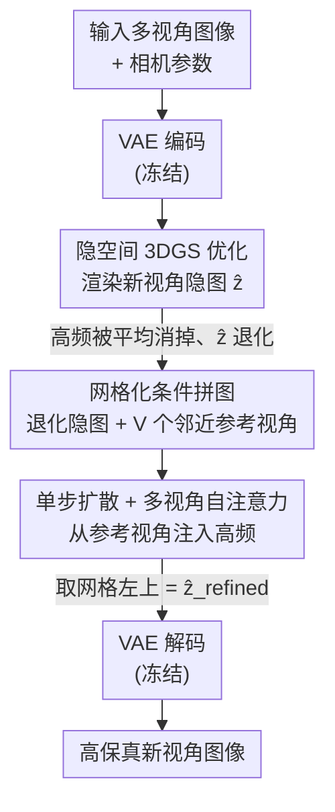

# Splatent: Splatting Diffusion Latents for Novel View Synthesis

**会议**: CVPR 2026  
**arXiv**: [2512.09923](https://arxiv.org/abs/2512.09923)  
**代码**: https://orhir.github.io/Splatent (项目页)  
**领域**: 3D视觉 / 新视角合成 / 扩散模型  
**关键词**: 隐空间辐射场, 3D高斯泼溅, 多视角注意力, 单步扩散, VAE隐空间

## 一句话总结
Splatent 在冻结的扩散 VAE 隐空间里做 3DGS 重建后，用一个单步扩散模型 + 多视角自注意力，从邻近参考视角的隐编码里把被 3D 优化"平均掉"的高频细节补回到渲染出的新视角隐图上，在保持预训练 VAE 重建质量的同时刷新了隐空间辐射场新视角合成的 SOTA。

## 研究背景与动机

**领域现状**：扩散模型普遍工作在 VAE 压缩出的隐空间里。最近一批工作（LRF、latentSplat、MVSplat360 等）尝试把辐射场（NeRF / 3DGS）也直接搬到这个隐空间里训练——好处很实在：隐图分辨率被下采样 $f=8$ 倍，优化和渲染都快得多；而且把 3D 高斯特征直接预测成隐特征，可以让前馈 3D 重建网络端到端训练，梯度不必再穿过编码器衰减。

**现有痛点**：直接在隐空间里跑 3DGS 会得到模糊、丢细节的结果。根因是 VAE 隐空间**不具备多视角一致性**：与 RGB 空间不同，隐编码里那些对解码至关重要的高频分量，在不同视角之间是高度视角相关、互相矛盾的。3DGS 优化要让所有训练视角达成一致，结果就是这些打架的高频分量在优化中被"平均消掉"，隐空间只剩下粗结构（低频），解码出来自然糊。

**核心矛盾**：要么牺牲一致性、要么牺牲重建质量。LRF 的做法是**微调 VAE**让隐空间变得更 3D 一致，但代价是解码质量下降，而且改了隐分布后就很难再塞进期望原始分布的预训练扩散管线里；MVSplat360 的做法是堆叠视频扩散模型去"脑补"高频细节，但容易**幻觉**出场景里本不存在的内容（输入视角明明拍到了，重建却画错）。

**本文目标**：在**冻结 VAE**（不动预训练权重、不牺牲重建质量与泛化性）的前提下，恢复隐空间渲染丢掉的高频细节，且要忠实于输入视角、不幻觉。

**切入角度**：作者跳出"一切都在 3D 里解决"的惯性思维。既然高频的视角不一致性正是它无法在 3D 空间被统一表达的原因，那就别在 3D 里硬补——**把 3D 表示留在低频域负责几何**，把高频细节放到 **2D 空间**、从参考输入视角里捞回来。

**核心 idea**：用"3DGS 提供低频几何 + 单步扩散的多视角自注意力从邻近参考视角注入高频细节"替代"微调 VAE / 视频扩散脑补"，在冻结 VAE 下做忠实的隐空间新视角合成。

## 方法详解

### 整体框架
Splatent 是一个两阶段流水线。给定一组带相机参数的输入视角，**阶段一**先用预训练 VAE 把每张图编码进隐空间，在隐特征上优化一个 3DGS（仿照 Feature-3DGS，给每个高斯额外挂一个 $f_z\in\mathbb{R}^d$ 的隐特征向量，泼溅即可渲染出任意新视角的隐图）。但如前所述，渲染出的新视角隐图 $\hat{z}$ 因为多视角不一致而丢了高频，解码出来是糊的。**阶段二**做扩散精修：把这张退化的渲染隐图和它最邻近的若干参考视角隐图拼成一个网格（退化图放左上角），送进一个单步扩散模型，靠跨视角自注意力把参考视角里的高频细节"搬运"到渲染隐图上，取网格左上位置作为精修后的隐图 $\hat{z}_{\text{refined}}$，最后用冻结 VAE 解码回图像。整条管线渲染与精修**全程在隐空间**，VAE 始终冻结。

阶段一既可以走逐场景 test-time 优化（对标 LRF 的设定），也可以替换成前馈网络（如 MVSplat360）直接预测隐 3DGS，阶段二作为即插即用的增强模块接上去。

### 关键设计

**1. 隐空间 3DGS 只负责低频几何：把问题一分为二**

作者先把"为什么糊"诊断清楚，再据此分工。每个 3D 高斯 $G=(\mu,\Sigma,\alpha,f_c)$ 被额外赋予一个 $d$ 维隐特征 $f_z$，泼溅时把这些隐特征 alpha 合成成隐图。问题在于：VAE 隐图同时含低频和高频分量（频谱分析见原文 Fig.3），而高频分量在不同视角间严重不一致，3DGS 优化要求多视角达成共识，于是高频在优化里互相抵消、被平均掉，只剩低频粗结构。作者的关键判断是：**这部分低频几何恰恰是可靠的**——它来自真正的 3D 重建，天然多视角一致。所以与其去微调 VAE 硬逼隐空间变一致（LRF 的代价是解码变差），不如**接受 3DGS 只能给低频几何这个事实**，把高频恢复这个难题甩给阶段二的 2D 模块。这种"3D 管低频、2D 管高频"的分工是全文的立论基础。

**2. 网格化多视角自注意力精修：从参考视角搬运高频细节**

这是补高频的核心机制，针对的就是"渲染隐图丢了高频"这个痛点。作者受 Difix3D 启发但目标不同——Difix3D 修的是 RGB 渲染里的伪影，而本文要恢复的是隐空间因 3D 不一致而**丢失**的细节（更难，因为信息是真被丢掉而非待修复）。具体做法是把退化渲染隐图 $\hat{z}$ 与 $V$ 个邻近训练视角的参考隐图 $\{z^i_{\text{ref}}\}_{i=1}^{V}$ 拼成网格 $\hat{z}_{\text{grid}}\in\mathbb{R}^{(V+1)\times M\times d}$（$M=h\times w$，退化图固定放左上角），再把视角轴并入空间维得到 $z\in\mathbb{R}^{((V+1)\cdot M)\times d}$，在所有视角间**联合做自注意力**：

$$\hat{z}_{\text{grid}}\in\mathbb{R}^{(V+1)\times M\times d}\ \longrightarrow\ z\in\mathbb{R}^{((V+1)\cdot M)\times d}\ \xrightarrow{\text{self-attn}}\ \hat{z}_{\text{refined}}$$

去噪过程中，注意力把参考视角的高频细节传播到渲染隐图上。参考视角按"与退化视角在位置和朝向上最接近"来选。用网格拼接而非改架构来注入条件，好处是不依赖特定扩散模型结构，未来换更强的扩散模型也能直接用。

**3. 单步冻结-VAE 扩散：忠实、高效、可即插即用**

精修模型基于单步扩散（用预训练 Stable Diffusion Turbo），单次前向就出结果，推理快。整套流程里 **VAE 全程冻结**，这点很关键：它保住了在数十亿张图上预训练的 VAE 的重建质量和泛化能力，也保证隐分布不变，因此能无缝接进现成的隐扩散管线——这正是 LRF 微调 VAE 所牺牲掉的。三路信息互补让它在稀疏视角下尤其稳：扩散模型提供先验、参考视角提供细粒度细节、渲染隐图提供粗几何，几何约束不足时先验补缺、参考视角又把细节锚定在真实观测上，从而既不糊也不幻觉。同一个精修模块还能直接挂到前馈模型 MVSplat360 上端到端微调，作为细节增强器。

### 损失函数 / 训练策略
训练时用已知训练相机渲染出的退化隐图 $\hat{z}$，并有对应的编码 ground-truth 隐图 $z_{\text{gt}}$ 作监督。主损失是隐空间重建 L2：

$$\mathcal{L}_{\text{recon}}=\|\hat{z}_{\text{refined}}-z_{\text{gt}}\|_2^2$$

为提升感知质量，再在**解码后的图像**上加 LPIPS 和 RGB 重建损失（$\mathcal{D}$ 为 VAE 解码器）：

$$\mathcal{L}_{\text{LPIPS}}=\text{LPIPS}\big(\mathcal{D}(\hat{z}_{\text{refined}}),\mathcal{D}(z_{\text{gt}})\big),\quad \mathcal{L}_{\text{RGB}}=\|\mathcal{D}(\hat{z}_{\text{refined}})-\mathcal{D}(z_{\text{gt}})\|_2^2$$

总损失 $\mathcal{L}_{\text{total}}=\mathcal{L}_{\text{recon}}+\lambda_{\text{LPIPS}}\mathcal{L}_{\text{LPIPS}}+\lambda_{\text{RGB}}\mathcal{L}_{\text{RGB}}$，其中 $\lambda_{\text{LPIPS}}=2$、$\lambda_{\text{RGB}}=1$。实现细节：VAE 用 LDM 的 KL-VAE（$f=8$），扩散用 SD-Turbo，参考视角数 $V=3$，噪声水平 $\tau=300$，AdamW、基础学习率 $2\times10^{-5}$；在 DL3DV-10K 训练集随机选 400 个场景上、用 8×H100 微调约 24 小时。相机位置用最远点采样保证空间覆盖。

## 实验关键数据

### 主实验
在 DL3DV-10K、LLFF、Mip-NeRF360 三个数据集上评测（LRF 和 Splatent 都只在 DL3DV-10K 上训练，后两者考察跨数据集泛化）。Dense 设定用 30 个输入视角（LLFF 用 1/8 视角），Sparse 设定只用 5 个输入视角。

| 设定 / 数据集 | 指标 | Feature-3DGS | LRF (前SOTA) | Splatent | 提升 |
|--------|------|------|----------|------|------|
| Dense / DL3DV-10K | PSNR↑ | 16.37 | 20.19 | **21.94** | +1.75 |
| Dense / DL3DV-10K | LPIPS↓ | 0.704 | 0.322 | **0.265** | −0.057 |
| Dense / DL3DV-10K | FID↓ | 263.45 | 75.32 | **35.60** | −39.7 |
| Dense / Mip-NeRF360 | PSNR↑ | 14.85 | 19.08 | **20.42** | +1.34 |
| Sparse / DL3DV-10K | PSNR↑ | 15.04 | 15.34 | **17.44** | +2.10 |
| Sparse / DL3DV-10K | FID↓ | 308.00 | 204.36 | **86.12** | −118 |

所有数据集、所有指标全面领先，FID 提升尤其大（Dense DL3DV 上从 75 降到 36），稀疏设定下优势更明显——作者归因于三路互补信息（扩散先验 + 参考细节 + 渲染几何）在几何约束不足时仍能稳住。

3D 一致性用 MEt3R 指标单独评测（越低越好）：

| 设定 | Feature-3DGS | LRF | Splatent | 相对提升 |
|------|------|------|------|------|
| Dense | 0.1106 | 0.1082 | **0.0774** | ~28–30% |
| Sparse | 0.1281 | 0.1272 | **0.0998** | ~22% |

作者解释：渲染隐图提供的低频几何本身就一致，扩散只需补高频，所以跨视角的细节补全也更一致。

### 消融实验
参考视角数量的影响（DL3DV-10K，Dense）：

| 配置 | PSNR↑ | LPIPS↓ | FID↓ | 说明 |
|------|------|---------|------|------|
| 无参考图 | 19.47 | 0.389 | 83.66 | 没参考视角，靠扩散先验硬补，明显掉点且易幻觉 |
| 1 张参考 | 21.61 | 0.276 | 38.04 | 加 1 张就大幅改善 |
| Splatent (3 张) | 21.94 | 0.265 | 35.60 | 默认配置，质量/显存折中 |
| 5 张参考 | 21.96 | 0.263 | 35.16 | 几乎饱和，增益边际递减 |

### 关键发现
- **参考视角是高频恢复的命门**：从"无参考"到"1 张参考" PSNR 直接涨 2.1，FID 从 83.66 砍到 38.04，证明高频细节确实是从参考视角搬来的、而非扩散凭空脑补。
- **3 张参考即饱和**：dense 设定下增到 5 张几乎不再涨（PSNR 21.94→21.96），但显存随视角数线性增长，故默认取 3 张。
- **稀疏场景增益最大**：5 视角 Sparse 下 FID 相对 LRF 砍掉一半以上，说明三路互补信息在几何约束稀缺时最能救场。
- **即插即用增强前馈模型**：接入 MVSplat360（5 视角前馈，DL3DV-10K）后 PSNR 16.69→17.98、LPIPS 0.431→0.378、FID 13.46→11.10，全指标改善，且修正了 MVSplat360 把窗户、树等结构画错的幻觉。

## 亮点与洞察
- **"3D 管低频、2D 管高频"的分工**是真正的 aha：它把"隐空间为什么糊"的诊断（高频视角不一致被优化平均掉）直接转化成解法——既然 3D 表达不了高频，就别在 3D 里硬补，转到 2D 从参考视角捞。这种把难题搬到合适空间去解的思路很可迁移。
- **冻结 VAE + 网格拼接条件**是工程上的巧劲：不动 VAE 保住了重建质量、泛化性和隐分布兼容性（LRF 微调 VAE 的代价被完全规避）；用网格拼接 + 自注意力注入条件而不改扩散架构，使方法对未来更强的扩散 backbone 天然兼容。
- **忠实 vs 生成的边界划得清楚**：作者明确把 Splatent 定位成"保真"（从参考视角搬真实细节），与 MVSplat360 这类"生成"（用强先验脑补内容）互补，两者叠加既有生成先验又有保真约束，思路上很有启发。
- 单步扩散（SD-Turbo）让精修单次前向完成，把"扩散精修"的推理代价压到可接受，是落地的关键。

## 局限性 / 可改进方向
- **本质比 RGB 空间 3DGS 更难**：隐空间是有损的，信息是真被丢掉、要"恢复"而非"修复"，所以当 RGB 空间 3DGS 本身就够好时，直接用 RGB 反而更优；Splatent 的价值场景是那些**必须在隐空间优化**的管线（如为省显存、或要兼容生成模型）。
- **性能受预训练 VAE 上限约束**：高频恢复的天花板由 VAE 解码质量决定，VAE 本身糊则无解。
- 参考视角靠"位置+朝向最近"启发式选取，论文未深入探讨参考视角选择策略的影响（仅 Appendix 提到替代注入策略），在视角分布极不均匀时可能受限。
- 训练只在 DL3DV-10K 的 400 场景子集上微调，虽展示了对 LLFF / Mip-NeRF360 的跨数据集泛化，但更极端域差（如纯合成、医学等）下的表现未验证。

## 相关工作与启发
- **vs LRF**: LRF 也观察到隐空间非 3D 一致，但选择**微调 VAE** 去逼一致，代价是解码质量下降、隐分布改变难以接回预训练扩散管线；Splatent 冻结 VAE、把高频恢复挪到 2D 多视角注意力，质量和兼容性双赢，所有指标全面超越 LRF。
- **vs MVSplat360**: MVSplat360 用堆叠视频扩散（SVD）的生成先验脑补细节，会幻觉出不忠实的结构；Splatent 从参考视角搬真实细节、强调保真。两者互补——把 Splatent 接进 MVSplat360 后既保留 SVD 的生成能力又补上保真细节，全指标改善。
- **vs Difix3D**: Difix3D 同样用单步扩散 + 参考视角增强渲染，但工作在 **RGB 空间**修伪影；Splatent 面对的是隐空间因 3D 不一致而**丢失**的细节（信息真被丢掉、更难），且全程在隐空间完成渲染与增强。
- **vs Feature-3DGS**: Splatent 复用了它"给高斯挂可学习特征、泼溅渲染特征"的框架，但把特征空间定为 VAE 隐空间，并补上了隐空间特有的高频不一致问题的解法。

## 评分
- 新颖性: ⭐⭐⭐⭐⭐ "3D 管低频、2D 管高频"的视角转换 + 冻结 VAE 下的多视角注意力精修，思路清晰且切中隐空间辐射场的核心痛点。
- 实验充分度: ⭐⭐⭐⭐ 三数据集 + dense/sparse + 跨数据集泛化 + MEt3R 一致性 + 前馈集成，覆盖全面；参考视角数消融到位，但参考视角选择策略、噪声水平等仅留在 Appendix。
- 写作质量: ⭐⭐⭐⭐⭐ 从频谱诊断到方法分工逻辑自洽，图文（频谱图、定性对比）支撑有力。
- 价值: ⭐⭐⭐⭐ 为"必须在隐空间做 3D 重建"的管线提供了即插即用、保真且兼容预训练扩散的增强方案，对隐空间前馈 3D 重建有实际推动。

<!-- RELATED:START -->

## 相关论文

- [\[CVPR 2026\] Physically Inspired Gaussian Splatting for HDR Novel View Synthesis](physically_inspired_gaussian_splatting_for_hdr_novel_view_synthesis.md)
- [\[CVPR 2026\] Learning Compact 3D Representations from Feed-Forward Novel View Synthesis](learning_compact_3d_representations_from_feed-forward_novel_view_synthesis.md)
- [\[CVPR 2026\] SmokeSVD: Smoke Reconstruction from A Single View via Progressive Novel View Synthesis and Refinement with Diffusion Models](smokesvd_smoke_reconstruction_from_a_single_view_via_progressive_novel_view_synt.md)
- [\[CVPR 2026\] Dynamic-Static Decomposition for Novel View Synthesis of Dynamic Scenes with Spiking Neurons](dynamic-static_decomposition_for_novel_view_synthesis_of_dynamic_scenes_with_spi.md)
- [\[CVPR 2026\] PR-IQA: Partial-Reference Image Quality Assessment for Diffusion-Based Novel View Synthesis](pr-iqa_partial-reference_image_quality_assessment_for_diffusion-based_novel_view.md)

<!-- RELATED:END -->
