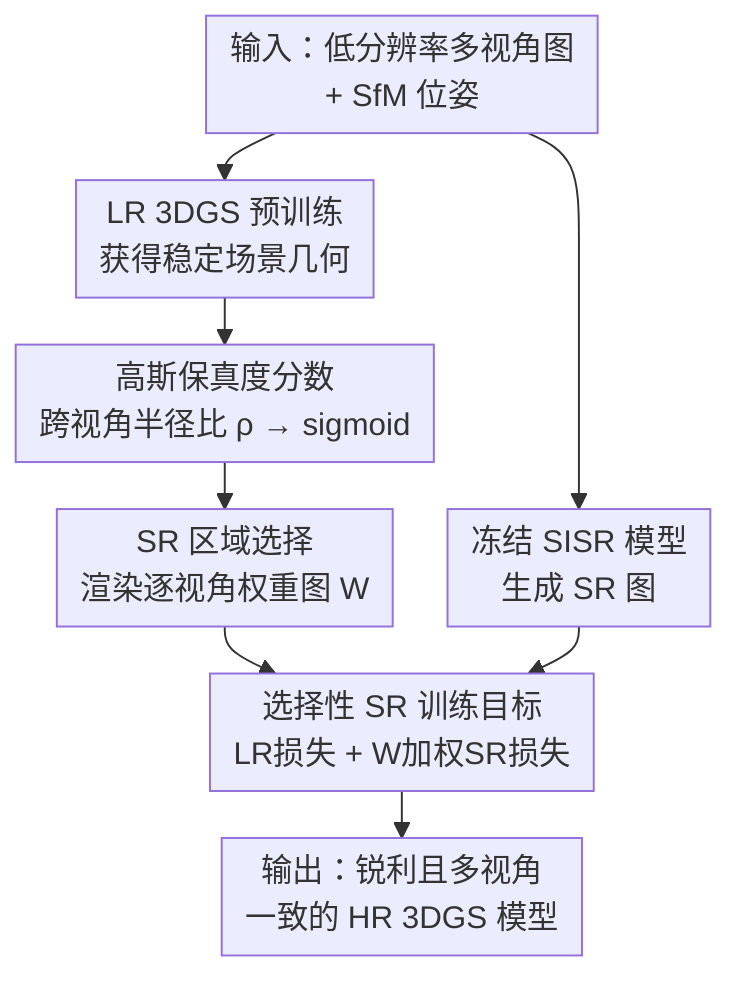

# SplatSuRe: Selective Super-Resolution for Multi-view Consistent 3D Gaussian Splatting

**会议**: CVPR 2026  
**论文**: [CVF Open Access](https://openaccess.thecvf.com/content/CVPR2026/html/Asthana_SplatSuRe_Selective_Super-Resolution_for_Multi-view_Consistent_3D_Gaussian_Splatting_CVPR_2026_paper.html)  
**代码**: https://splatsure.github.io （项目页）  
**领域**: 3D视觉  
**关键词**: 高斯泼溅, 超分辨率, 多视角一致性, 新视角合成, 几何感知监督

## 一句话总结
SplatSuRe 不再把超分（SR）均匀地灌进所有像素，而是先算一个"每个高斯被各视角采样得有多充分"的保真度分数、再渲染成逐视角权重图，只在缺乏高频观测的欠采样区域注入 SR 监督，从而在不加任何神经组件、不改 3DGS 主干的前提下得到更锐利且多视角一致的高分辨率重建。

## 研究背景与动机

**领域现状**：3DGS 用各向异性高斯做可微泼溅实现实时高保真新视角合成，但渲染质量和训练图像分辨率强绑定。只有低分辨率（LR）训练图时，一个自然策略是先用超分（SR）把 LR 图增强成 HR 再去拟合 3D 模型（如 SRGS）。

**现有痛点**：单图 SR（SISR）对每张视图独立处理，常产生与视角相关的"幻觉纹理"。把这些彼此不一致的 SR 结果当直接监督，3D 优化就会在不同视角间收到互相冲突的梯度，平均化后渲染出来反而变糊。已有方法（学习型神经组件、时序一致视频先验、LR+SR 联合优化）试图缓解不一致，但它们都**对每张图、每个区域无差别地施加 SR**，不管这个区域到底需不需要生成式细节。

**核心矛盾**：SR 并非对全场景一律有益。有些区域已经从更近的 LR 视图拿到了足够高频监督，再灌 SR 只会引入不必要的不一致、破坏跨视角一致性；另一些距离远或观测稀疏的区域才真正欠采样、需要 SR 补细节。

**本文目标**：把"该不该上 SR"从全图统一决策，细化到**几何感知的逐区域决策**——识别出缺高频观测的 3D 区域，只在那里注入 SR。

**切入角度**：作者的关键观察是多视角对 3D 内容的采样并不均匀。一张近距离拍的 LR 图，往往含有足以监督"只被远处视图粗略观测到的同一区域"的高频细节。也就是说，很多视图已经能从更近的视图获得高频监督，只有那些找不到更近视图的区域才需要 SR 引导。

**核心 idea**：用相机位姿相对场景几何的关系，量化每个高斯"被采样得充不充分"，据此生成逐视角权重图，**选择性地**只在欠采样区域加 SR，而非全图无差别增强。

## 方法详解

### 整体框架
SplatSuRe 是一个两阶段、纯监督改造的选择性 SR 框架，不引入任何新网络。先用 LR 图训练一个 LR 3DGS 模型来获得稳定几何，并据此算出每个高斯的保真度分数与逐视角权重图（标出哪里缺高频）。然后训练目标 HR 3DGS 模型：每次迭代把 HR 渲染下采样后与 LR 真值比（LR 损失，全图一致监督），同时把冻结的 SISR 模型产出的 SR 图用权重图做空间加权后与 HR 渲染比（SR 损失，只在欠采样区生效），两者按系数 $\gamma$ 加权。整条流水线只改监督损失，渲染与致密化沿用标准 3DGS。

### 关键设计

**1. 高斯保真度分数：用跨视角屏幕半径比量化"被采样得有多充分"**

不同视图为 3D 重建贡献的高频信息并不相等——近距离/长焦的 LR 视图可能比远处的 HR 视图含更多细节。SplatSuRe 先用 LR 图训一个 LR 3DGS 拿到稳定几何，对每个高斯 $G_i$ 计算它在各训练视图中的屏幕空间半径 $r_i = 3\sqrt{\max(\lambda_1^i, \lambda_2^i)}$（$\lambda$ 是 2D 协方差矩阵特征值）。然后取该高斯在所有它参与渲染的视图中半径的最大/最小比 $\rho_i = r_{max}^i / r_{min}^i$ 作为采样频率的近似：比值大说明它在某些视图被高保真观测、能监督其余视图；比值接近 1 说明各视图采样频率一致、这块缺更高频观测、需要 SR。一个细节是 3DGS 会用固定低通滤波给高斯做 $s=0.3$ 的膨胀防混叠，这会人为撑大半径（对远处高斯尤甚），所以算比值时要**剔除这层膨胀**。最后把原始比值经阈值偏移再过 sigmoid 映到 $[0,1]$：$\text{score}_{G_i} = \sigma((\rho_i - \tau)/k)$，$k=0.05$ 控制过渡平滑度，$\tau$ 是依场景结构和 SR 一致性而定的超参；可见视图少于三个的高斯分数置零（约束太弱）。分数高=已被 LR 充分覆盖，分数低=需要重点上 SR。

**2. 超分区域选择：把高斯级分数渲染成逐视角像素权重图**

保真度分数是场景级的、按高斯定义，但监督 HR 模型更新需要每个训练视图的像素级权重。对给定视图 $t$，先找出"最大半径恰好出现在该视图"的高斯集合 $M(t) = \{G_i \mid t = \arg\max_{t'} r_{t'}^i\}$——这些高斯在该视图被观测得最近，没有任何其它视图能提供更高频信息。该视图的权重图渲染为 $W'_t = (1 - \text{Render}(\text{score}_G)) + \text{Render}(\mathbf{1}_{M(t)}(G))$：第一项让低保真（欠采样）区域获得 SR，第二项让"本视图观测得最近的区域"也获得 SR（因为别的视图给不了更高分辨率）。最后对权重图归一化，保证 SR 损失在各视图间幅度一致。直观上权重图在需要 SR 的地方亮（如拖拉机背后的远树、舞厅前景的桌子），在已被其它 LR 视图充分采样的地方暗。

**3. 选择性 SR 训练目标：用权重图把 SR 监督"只贴在需要的像素上"**

有了权重图 $W_t$，训练目标用两路互补信号监督。每次迭代在目标 HR 分辨率渲染 $R_{HR}$：把它**下采样**后与 LR 真值 $I_{LR}$ 比，得到全图一致的 LR 损失 $L_{LR} = (1-\lambda)L_1(R_{HR}{\downarrow}, I_{LR}) + \lambda L_{\text{D-SSIM}}(R_{HR}{\downarrow}, I_{LR})$；同时把冻结 SISR 产出的 SR 图 $I_{SR}$ 与 HR 渲染 $R_{HR}$ 比，但用**空间加权**损失 $L_{SR} = (1-\lambda)L_1^W(R_{HR}, I_{SR}) + \lambda L_{\text{D-SSIM}}^W(R_{HR}, I_{SR})$，每个像素贡献按 $W_t$ 缩放——高权重在欠采样区放大 SR 监督，低权重在 LR 已可靠处压制 SR。总目标 $L = (1-\gamma)L_{LR} + \gamma L_{SR}$，$\gamma$ 平衡两者。这样模型只在能改善重建的地方借用生成式细节，避开了在已充分约束区域引入不一致。注意整套机制是纯损失改造，不引入新网络也不改 3DGS 渲染/致密化。

### 损失函数 / 训练策略
两阶段训练：先 LR 初始化（拿几何与权重图），再 HR 选择性 SR 优化。主实验在 4× 超分、用 StableSR 作 SISR、比值阈值 $\tau=1.1$；损失系数 $\lambda=0.2$、$\gamma=0.4$。附录另给出一个把 LR 初始化与 SR 精修合并、在与单阶段基线相同训练预算下达到相近性能的统一管线。

## 实验关键数据

### 主实验
在三个真实数据集（Tanks & Temples、Deep Blending、Mip-NeRF 360）上，4× 超分、$\tau=1.1$：

| 数据集 | 指标 | 本文 | SRGS | Mip-Splatting | 3DGS(LR) |
|--------|------|------|------|---------------|----------|
| Tanks & Temples | SSIM ↑ | **0.784** | 0.771 | 0.767 | 0.669 |
| Tanks & Temples | PSNR ↑ | **23.81** | 23.32 | 23.10 | 19.41 |
| Tanks & Temples | LPIPS ↓ | **0.272** | 0.286 | 0.303 | 0.350 |
| Tanks & Temples | FID ↓ | **37.72** | 49.11 | 52.46 | 71.58 |
| Deep Blending | SSIM ↑ | **0.872** | 0.861 | 0.865 | 0.836 |
| Deep Blending | PSNR ↑ | **29.01** | 28.23 | 28.43 | 26.72 |
| Mip-NeRF 360 | PSNR ↑ | 26.34 | 25.92 | **26.48** | 20.67 |

> 指标说明：FID/CMMD/DreamSim 是分布或语义层面的感知质量（越低越接近真实分布），MUSIQ/NIQE 是无参考自然度。论文指出感知/分布类指标会先把图下采样再抽特征，对高频锐度不敏感，所以用 8 个互补指标综合评估。

在 Tanks & Temples 上 SplatSuRe 几乎所有指标最优；Deep Blending 上全指标最强；Mip-NeRF 360 上除 LPIPS 外全面超过 SRGS，但两种 SR 方法都被 Mip-Splatting 反超——因为该数据集相机轨迹平滑、多视角覆盖密、欠采样极少，且其 LR 图本就约两倍大、已保留多数高频，留给 SR 的提升空间很小。

### 消融实验
| 配置 | 关键发现 | 说明 |
|------|---------|------|
| 比值阈值 $\tau$ | $\tau$ 从小到大，PSNR/LPIPS 先升后降 | 少量 SR 补细节有益，过量 SR 引入跨视角不一致反而掉点；$\tau=0$/$\infty$ 即零/全 SR，选 $\tau=1.1$ 折中 |
| SISR 主干（SwinIR vs StableSR） | 两种主干下均优于 SRGS | SwinIR 保守、PSNR 更高但偏过平滑；StableSR 用扩散先验更锐、感知更好但 PSNR 略低；选 StableSR 因感知质量优 |

### 关键发现
- **SR 不是越多越好**：阈值消融显示存在最优 SR 用量，过量施加 SR 在相机-物距差异大的场景上最容易因不一致而退化。
- **方法与 SISR 主干解耦**：换 SwinIR 或 StableSR 都能超过 SRGS，说明增益来自"选择性施加"而非某个特定 SR 网络；用 StableSR 时增益更大，恰因其感知质量高、多视角不一致也更严重，正好被选择性机制压住。
- **增益集中在前景/欠采样区**：作者强调提升在"需要更高细节的局部前景区域"最显著，与"只在欠采样区上 SR"的设计动机吻合。
- **无参考指标的反直觉**：在 MUSIQ/NIQE 上 3DGS(LR) 反而占优，因为其混叠噪声渲染恰好契合无参考指标偏好的自然图像统计，但这并不代表真实画质更好。

## 亮点与洞察
- **把"采样充分度"几何化成一个可渲染的标量场**：用跨视角屏幕半径比 $\rho_i$ 量化高频可得性，再渲染成逐视角权重图，是个很轻却很直接的几何先验——不需要任何学习组件就回答了"哪里缺细节"。
- **剔除防混叠膨胀这一步很关键**：作者注意到 3DGS 的固定低通膨胀会人为撑大远处高斯半径、污染比值，主动在算 $\rho$ 时排除，体现了对 3DGS 内部机制的细致理解。
- **纯损失改造、零额外网络**：整套方法只动监督损失，不改渲染/致密化、不加可训练模块，因此可与任意 SISR、甚至视频 SR / 扩散后处理 / 3D 点云上采样正交组合。
- **"何处需要生成式细节"是个可复用问题**：这个几何感知的 where-to-SR 判据可以迁移给扩散类 3D 增强方法当作引导信号，而不必让大扩散模型盲目全图生成。

## 局限与展望
- **保守策略会漏掉有用 SR**：作者承认在已被 LR 充分覆盖的区域抑制 SR，可能错过如高对比边界处稳定细节这类有益精修，未来可在这些区域也选择性放开。
- **单一上采样层级**：框架只在一个上采样尺度工作，扩展到多尺度公式能对 SR 注入做更细控制、进一步提升锐度。
- **依赖 SISR 的多视角一致性上限**：⚠️ 方法本身减少了不一致，但仍受底层 SR 图质量约束——SR 输出本身越一致结果越好，未来需要多视角一致的生成式 SR 来突破。
- **欠采样判据依赖 LR 几何质量**：保真度分数建立在 LR 3DGS 的几何上，COLMAP 失败或几何不稳的场景（论文里 Tanks & Temples 就排除了两个 COLMAP 失败场景）会直接影响权重图可靠性。

## 相关工作与启发
- **vs SRGS**：SRGS 同样用冻结单图 SR 联合优化 LR+SR，但**全图无差别**施加 SR，无法消除 SR 不一致带来的平均化模糊；SplatSuRe 用几何感知权重图只在欠采样区上 SR，跨视角更一致、细节更锐。
- **vs Mip-Splatting**：Mip-Splatting 靠多尺度 3D/2D 抗混叠滤波缓解高分辨率渲染的混叠，但画质仍受训练分辨率限制、会过度模糊；本文用 SR 主动引入高频，在欠采样多的数据集（T&T、Deep Blending）显著更优，但在密集覆盖的 Mip-NeRF 360 上反被 Mip-Splatting 超过。
- **vs S2Gaussian / SuperGaussian**：前者训练逐场景的不一致建模模块、后者用视频 SR 网络做时序一致重训，都依赖额外神经组件或缺乏空间自适应；SplatSuRe 不加网络、靠相机-几何关系做空间自适应选择。
- **vs GaussianSR / 3DSR 等扩散方法**：它们用大预训练扩散模型预测降一致性的图像；本文用显式几何关系判定"何处需要生成式细节"，可作为这些扩散方法的互补引导，让生成只发生在真正需要的地方。

## 评分
- 新颖性: ⭐⭐⭐⭐ "选择性而非均匀施加 SR" + 用跨视角半径比做几何判据，角度新颖且简洁，但建立在 SRGS 的 LR+SR 联合优化框架之上。
- 实验充分度: ⭐⭐⭐⭐ 三数据集、八指标、阈值与 SISR 主干消融齐全；但对 Mip-NeRF 360 的劣势坦诚，覆盖面略集中于静态场景 SR。
- 写作质量: ⭐⭐⭐⭐⭐ 动机—观察—机制—指标局限层层推进，对指标选择与反直觉结果的解释很到位。
- 价值: ⭐⭐⭐⭐ 零额外网络、可与各类 SR/扩散正交组合，前景细节增益实用；受 SISR 一致性与 LR 几何质量上限约束。

<!-- RELATED:START -->

## 相关论文

- [\[CVPR 2025\] S2Gaussian: Sparse-View Super-Resolution 3D Gaussian Splatting](../../CVPR2025/3d_vision/s2gaussian_sparse-view_super-resolution_3d_gaussian_splatting.md)
- [\[CVPR 2026\] Multi-view Consistent 3D Gaussian Head Avatars 'without' Multi-view Generation](multi-view_consistent_3d_gaussian_head_avatars_without_multi-view_generation.md)
- [\[CVPR 2026\] BRepGaussian: CAD Reconstruction from Multi-View Images with Gaussian Splatting](brepgaussian_cad_reconstruction_from_multi-view_images_with_gaussian_splatting.md)
- [\[CVPR 2026\] Confidence-Guided Multi-Scale Aggregation for Sparse-View High-Resolution 3D Gaussian Splatting](confidence-guided_multi-scale_aggregation_for_sparse-view_high-resolution_3d_gau.md)
- [\[AAAI 2026\] Arbitrary-Scale 3D Gaussian Super-Resolution](../../AAAI2026/3d_vision/arbitrary-scale_3d_gaussian_super-resolution.md)

<!-- RELATED:END -->
