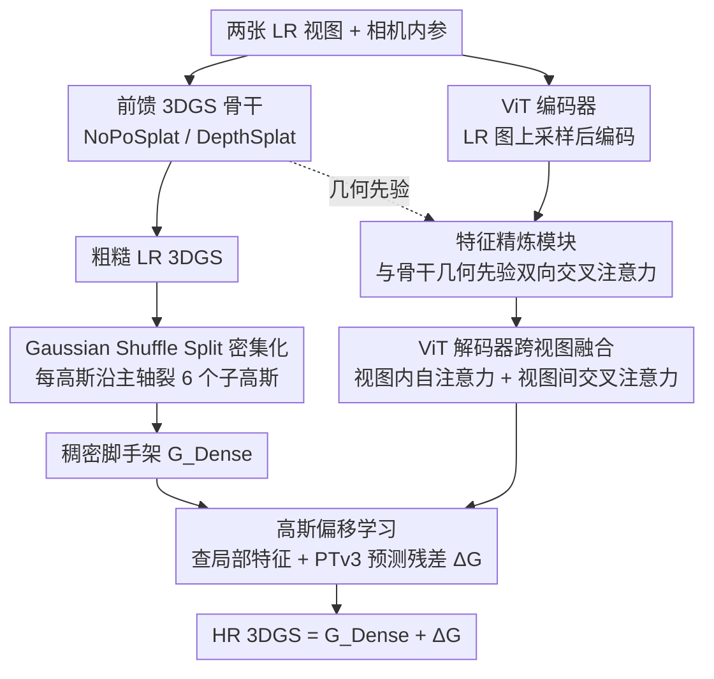

# SR3R: Rethinking Super-Resolution 3D Reconstruction With Feed-Forward Gaussian Splatting

**会议**: CVPR2026  
**arXiv**: [2602.24020](https://arxiv.org/abs/2602.24020)  
**代码**: [项目主页](https://xiangfeng66.github.io/SR3R/)  
**领域**: 3D视觉  
**关键词**: 3D超分辨率, 3D高斯溅射, 前馈重建, 高斯偏移学习, 稀疏视图重建

## 一句话总结

将3D超分辨率(3DSR)重新定义为从稀疏低分辨率视图到高分辨率3DGS的**前馈映射**问题，通过高斯偏移学习和特征精炼实现高保真HR 3DGS重建，无需逐场景优化即可实现强零样本泛化。

## 背景与动机

- **核心痛点**: 现有3DSR方法依赖密集LR输入和预训练2D超分模型生成伪HR图像，再用伪HR标签逐场景优化HR 3DGS，存在三大根本限制：
  1. **高频先验受限**: 高频知识仅来源于2DSR模型的先验，无法学习3D特有的高频几何/纹理结构
  2. **重建保真度有天花板**: 伪HR标签质量本身决定了重建上限
  3. **计算开销大**: 密集多视图合成 + 逐场景迭代优化，无法跨场景泛化
- **关键观察**: 前馈3DGS重建模型已能从稀疏视图直接预测3DGS，但其重建质量严重受输入分辨率限制——能否将3DSR也做成前馈映射，从大规模多场景数据中学习3D特有的高频先验？
- **范式转换**: 从"逐场景HR 3DGS自优化"转向"泛化的HR 3DGS前馈预测"，根本改变了3DSR获取高频知识的方式

## 方法详解

### 整体框架

SR3R要解决的是：只给两张低分辨率（LR）视图，如何直接前馈预测出一套高分辨率（HR）的3D高斯，而不去做任何逐场景优化、也不依赖2D超分模型造出来的伪HR标签。它被设计成**即插即用**的一层——先借一个现成的前馈3DGS骨干（NoPoSplat/DepthSplat）从两张LR视图拿到一套粗糙的LR 3DGS $\mathcal{G}^{\text{LR}}$，再由SR3R把它"补细、补高频"成HR 3DGS。

整条pipeline可以这样看：LR图像先进ViT编码器、经特征精炼对齐到3DGS骨干的几何先验、再由ViT解码器做跨视图融合，提取出多视图特征；与此同时 $\mathcal{G}^{\text{LR}}$ 通过Gaussian Shuffle Split被密集化成 $\mathcal{G}^{\text{Dense}}$ 作为结构脚手架；最后用解码特征在脚手架上预测残差偏移，把 $\mathcal{G}^{\text{Dense}}$ 推到 $\mathcal{G}^{\text{HR}}$。整个映射可形式化为

$$f_{\boldsymbol{\theta}}: \{(\boldsymbol{I}^{v}_{lr}, \boldsymbol{K}^{v})\}_{v=1}^{V} \mapsto \mathcal{G}^{\text{HR}}$$

其中每个3D高斯原语参数化为 $(\boldsymbol{\mu}, \alpha, \boldsymbol{r}, \boldsymbol{s}, \boldsymbol{c})$，分别对应中心位置、不透明度、四元数旋转、缩放和球谐系数。

### 关键设计

**1. Gaussian Shuffle Split 密集化：先搭出一副够细的结构脚手架**

前馈骨干直接吐出的LR 3DGS高斯太稀，撑不起HR级别的细节，所以SR3R先做密集化。对 $\mathcal{G}^{\text{LR}}$ 中每个高斯原语，沿它自己的三个主轴正负方向各裂出一个子高斯，共6个，落点由下式给出：

$$\boldsymbol{\mu}_{j,k} = \boldsymbol{\mu}_j + \beta \, R_j \, \boldsymbol{e}_k \odot \boldsymbol{s}_j, \quad k=1,\dots,6$$

这里 $R_j$ 是四元数 $\boldsymbol{r}_j$ 对应的旋转矩阵，$\boldsymbol{e}_k$ 是正/负主轴单位向量，$\beta=0.5$ 控制裂开的幅度，子高斯沿偏移轴的尺度缩到原来的 $\frac{1}{4}$ 以避免重叠糊成一团。关键的一点是只对 opacity > 0.5 的高斯做裂分，把算力集中在结构显著区域、不浪费在透明背景上。密集化后 $\mathcal{G}^{\text{Dense}}$ 含 $N = 6M$ 个原语（$M$ 为LR高斯数量），是一副位置可靠但细节未补的脚手架。

**2. 特征精炼模块（Feature Refinement）：把上采样带进来的"假高频"过滤掉**

LR图像上采样后会混入插值产生的模糊和幻觉高频，直接拿去预测高斯会在3D里翻译成几何/纹理伪影。特征精炼模块的做法是让ViT编码特征 $\boldsymbol{t}_{\text{en}}$ 和预训练3DGS骨干的几何感知特征 $\boldsymbol{t}_{\text{pre}}$ 做**双向交叉注意力**，互相校准：

$$\mathbf{U}_{o \leftarrow p} = \text{softmax}\!\left(\frac{(\boldsymbol{t}_{\text{en}} \boldsymbol{W}^o_Q)(\boldsymbol{t}_{\text{pre}} \boldsymbol{W}^p_K)^\top}{\sqrt{d}}\right)(\boldsymbol{t}_{\text{pre}} \boldsymbol{W}^p_V)$$

$$\mathbf{U}_{p \leftarrow o} = \text{softmax}\!\left(\frac{(\boldsymbol{t}_{\text{pre}} \boldsymbol{W}^p_Q)(\boldsymbol{t}_{\text{en}} \boldsymbol{W}^o_K)^\top}{\sqrt{d}}\right)(\boldsymbol{t}_{\text{en}} \boldsymbol{W}^o_V)$$

两个方向的输出拼接后过全连接层融合，得到精炼特征 $\boldsymbol{t}_{ca}$。本质上是借3DGS骨干那套可靠的3D几何先验去"压住"上采样引入的模糊——让2D特征空间里残留的是真实高频信号，而不是插值幻觉。

**3. 高斯偏移学习（Gaussian Offset Learning）：只学残差，不学绝对值**

这是SR3R涨点最关键的模块，思路是不去直接回归HR高斯的绝对参数，而是预测从 $\mathcal{G}^{\text{Dense}}$ 到 $\mathcal{G}^{\text{HR}}$ 的残差偏移。因为脚手架 $\mathcal{G}^{\text{Dense}}$ 已经给出了可靠的粗结构，剩下要补的主要是局部高频信号，学偏移等于把搜索空间死死约束在每个高斯的邻域内，训练更稳、重建也更锐。

具体地，先把每个密集高斯中心 $\boldsymbol{\mu}_i$ 投影到图像平面拿到2D坐标 $\boldsymbol{p}_i$，在ViT解码器特征图 $\boldsymbol{t}_{de}$ 的对应位置查询局部特征 $\boldsymbol{F}_i$；再把高斯中心、查询特征和相机内参拼在一起送进PointTransformerV3做空间推理：

$$\boldsymbol{F} = \Phi_{\text{PTv3}}\!\left([\boldsymbol{\mu}_i;\, \{\boldsymbol{F}_i\}_{i=1}^{N};\, \boldsymbol{K}]\right)$$

PTv3的输出经一个轻量MLP的Gaussian Head预测出五元组残差，再叠回脚手架就得到最终HR 3DGS：

$$\Delta G = (\Delta\boldsymbol{\mu},\, \Delta\boldsymbol{\alpha},\, \Delta\boldsymbol{r},\, \Delta\boldsymbol{s},\, \Delta\boldsymbol{c}) = \Psi_{\text{GH}}(\boldsymbol{F})$$

$$\mathcal{G}^{\text{HR}} = \mathcal{G}^{\text{Dense}} + \Delta\mathcal{G}$$

值得注意的是，这种"脚手架+残差"的写法也顺带省了参数——不需要再额外回归一大堆绝对高斯，HR高斯量反而远小于直接上采样的暴力做法（后面消融里 16.5M vs 44.5M）。

**4. ViT解码器跨视图融合：让两张视图的信息对得上**

精炼特征 $\boldsymbol{t}_{ca}$ 进ViT解码器时同时走两种注意力：视图内自注意力聚合各自的全局上下文，视图间交叉注意力把两张视图的互补信息缝在一起。这一步是为了缓解位姿不准、视图重叠不足带来的跨视图不一致——否则两张视图各自补出的高频会在3D里"打架"，造成重影。

### 一个完整示例

拿RE10K上一个室内场景走一遍：输入是两张 $64\times64$ 的LR视图，先过NoPoSplat骨干拿到约 $M$ 个LR高斯（参数量级2.7M）。Gaussian Shuffle Split只对 opacity > 0.5 的显著高斯裂分，每个裂成6个、尺度缩到 $\frac{1}{4}$，得到 $6M$ 个的密集脚手架 $\mathcal{G}^{\text{Dense}}$，此时结构骨架已经到位、只是细节糊。同时两张LR图被上采样、过编码器和特征精炼（用骨干几何先验滤掉插值幻觉）、再过解码器跨视图融合出特征图 $\boldsymbol{t}_{de}$。接着把每个密集高斯投到图像平面查局部特征、连同内参喂给PTv3，预测出每个高斯的残差 $\Delta G$，叠回去得到 $256\times256$ 渲染质量的HR 3DGS——最终高斯参数量收在16.5M，PSNR从基线21.33dB抬到24.79dB，整条前馈走完约1.69s，而对应的逐场景优化方法要300s以上。

### 损失函数

采用像素级MSE重建损失和感知一致性LPIPS损失的组合：

$$\mathcal{L} = \mathcal{L}_{\text{MSE}} + 0.05 \cdot \mathcal{L}_{\text{LPIPS}}$$

通过可微高斯光栅化端到端训练。

## 实验

### 实验设置

- **数据集**: RealEstate10K (RE10K, 室内)、ACID (室外无人机)、DTU (物体中心)、ScanNet++ (室内)
- **超分倍率**: 4× (64×64 → 256×256)
- **骨干**: NoPoSplat、DepthSplat
- **训练**: 75K迭代，batch=8，lr=2.5e-5，4×RTX 5090

### 主实验结果

| 方法 | 数据集 | PSNR ↑ | SSIM ↑ | LPIPS ↓ | 高斯参数量 |
|------|--------|--------|--------|---------|-----------|
| NoPoSplat | RE10K | 21.33 | 0.612 | 0.307 | 2.7M |
| Up-NoPoSplat | RE10K | 23.37 | 0.771 | 0.251 | 44.5M |
| **SR3R (NoPoSplat)** | **RE10K** | **24.79** | **0.827** | **0.188** | **16.5M** |
| DepthSplat | RE10K | 23.15 | 0.699 | 0.281 | 2.3M |
| Up-DepthSplat | RE10K | 24.71 | 0.793 | 0.244 | 38.3M |
| **SR3R (DepthSplat)** | **RE10K** | **26.25** | **0.856** | **0.165** | **14.2M** |
| NoPoSplat | ACID | 21.45 | 0.606 | 0.531 | 2.7M |
| Up-NoPoSplat | ACID | 23.91 | 0.692 | 0.384 | 44.5M |
| **SR3R (NoPoSplat)** | **ACID** | **25.54** | **0.746** | **0.283** | **16.5M** |
| DepthSplat | ACID | 23.80 | 0.624 | 0.437 | 2.3M |
| Up-DepthSplat | ACID | 25.32 | 0.721 | 0.322 | 38.3M |
| **SR3R (DepthSplat)** | **ACID** | **27.02** | **0.797** | **0.261** | **14.2M** |

**关键发现**: SR3R在PSNR上平均提升1.4-3.5dB，同时高斯参数量仅为直接上采样的37%-63%（16.5M vs 44.5M）。

### 零样本泛化实验（RE10K → DTU）

| 方法 | PSNR ↑ | SSIM ↑ | LPIPS ↓ | 重建时间 |
|------|--------|--------|---------|---------|
| SRGS (逐场景优化) | 12.42 | 0.327 | 0.598 | 300s |
| FSGS+SRGS (逐场景优化) | 13.72 | 0.444 | 0.481 | 420s |
| NoPoSplat | 12.63 | 0.343 | 0.581 | 0.01s |
| Up-NoPoSplat | 16.64 | 0.598 | 0.369 | 0.16s |
| **SR3R (NoPoSplat)** | **17.24** | **0.607** | **0.291** | **1.69s** |

SR3R不仅超越所有前馈基线，还**超越了需要逐场景优化的SRGS/FSGS+SRGS**（PSNR +3.5dB），且推理速度快177-248倍。

### 消融实验

| 组件 | PSNR ↑ | SSIM ↑ | LPIPS ↓ | 高斯参数 |
|------|--------|--------|---------|---------|
| NoPoSplat (基线) | 21.33 | 0.612 | 0.307 | 2.7M |
| + 上采样 | 23.37 | 0.771 | 0.251 | 44.5M |
| + 交叉注意力 | 23.50 | 0.784 | 0.237 | 44.5M |
| + 高斯偏移 (无PTv3) | 24.45 | 0.808 | 0.211 | 16.5M |
| + PTv3 (**完整SR3R**) | **24.79** | **0.827** | **0.188** | **16.5M** |

**关键发现**:
1. **高斯偏移学习贡献最大**: +0.95 PSNR，同时将高斯参数从44.5M降至16.5M
2. 交叉注意力特征精炼提升结构一致性（+0.13 PSNR, LPIPS −0.014）
3. PTv3多尺度空间推理进一步提升锐度（+0.35 PSNR, LPIPS −0.023）
4. 各组件互补，逐步提升重建质量

### 上采样策略鲁棒性

| 上采样方法 | PSNR ↑ | SSIM ↑ | LPIPS ↓ |
|-----------|--------|--------|---------|
| Bilinear | 24.59 | 0.795 | 0.204 |
| Bicubic | 24.66 | 0.817 | 0.193 |
| SwinIR | 24.79 | 0.827 | 0.188 |
| HAT | 24.78 | 0.819 | 0.183 |

即使使用最简单的Bilinear插值，SR3R也已超越所有前馈基线，表明框架不依赖特定上采样设计。

## 亮点

- 🔄 **范式颠覆**: 将3DSR从"逐场景优化+2DSR伪监督"转向"大规模跨场景前馈预测"，根本改变高频知识获取方式
- 🔌 **即插即用**: 可与任意前馈3DGS骨干配合，设计优雅且实用性强
- 📐 **偏移学习 > 直接回归**: 通过学习残差偏移而非绝对参数，在提升质量的同时将高斯参数减少至37%
- 🎯 **零样本泛化**: 在未见场景上超越逐场景优化方法，且速度快2个数量级
- ⚡ **高效实用**: 从仅2张LR视图即可完成HR 3D重建

## 局限与展望

- 推理时间(1.69s)虽远快于优化方法(300+s)，但相比基础前馈模型(0.01s)仍慢约100倍，实时应用受限
- 仅验证了4×超分，更高倍率(8×/16×)的效果未知
- 密集化策略（固定6个子高斯）较为启发式，自适应密集化可能更优
- 训练需要4×RTX 5090，计算资源门槛较高
- 仅在室内/室外/物体中心场景上验证，大规模户外场景(如自动驾驶)的泛化能力待验证

## 评分

- 新颖性: ⭐⭐⭐⭐ — 3DSR的前馈映射范式转换思路新颖，高斯偏移学习设计巧妙
- 实验充分度: ⭐⭐⭐⭐ — 3个数据集+零样本泛化+消融+上采样策略分析，较为完整
- 写作质量: ⭐⭐⭐⭐ — 结构清晰，motivation阐述充分，公式规范
- 价值: ⭐⭐⭐⭐ — 为3DSR领域提供了新范式，实用性强且即插即用设计利于推广

<!-- RELATED:START -->

## 相关论文

- [\[CVPR 2026\] AnchorSplat: Feed-Forward 3D Gaussian Splatting with 3D Geometric Priors](anchorsplat_feed-forward_3d_gaussian_splatting_with_3d_geometric_priors.md)
- [\[CVPR 2026\] Z-Order Transformer for Feed-Forward Gaussian Splatting](z-order_transformer_for_feed-forward_gaussian_splatting.md)
- [\[CVPR 2026\] SplatSuRe: Selective Super-Resolution for Multi-view Consistent 3D Gaussian Splatting](splatsure_selective_super-resolution_for_multi-view_consistent_3d_gaussian_splat.md)
- [\[CVPR 2025\] S2Gaussian: Sparse-View Super-Resolution 3D Gaussian Splatting](../../CVPR2025/3d_vision/s2gaussian_sparse-view_super-resolution_3d_gaussian_splatting.md)
- [\[CVPR 2026\] Off The Grid: Detection of Primitives for Feed-Forward 3D Gaussian Splatting](off_the_grid_detection_of_primitives_for_feed-forward_3d_gaussian_splatting.md)

<!-- RELATED:END -->
