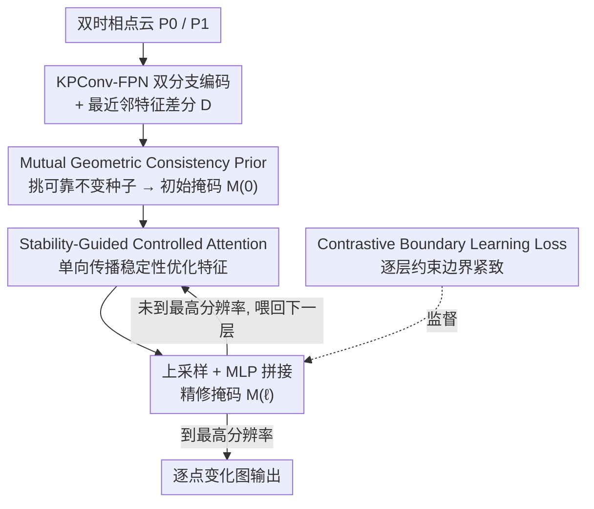

# SRGCD: Stability-Driven Region Growth Framework for 3D Change Detection

**会议**: CVPR 2026  
**论文**: [CVF Open Access](https://openaccess.thecvf.com/content/CVPR2026/html/Wu_SRGCD_Stability-Driven_Region_Growth_Framework_for_3D_Change_Detection_CVPR_2026_paper.html)  
**代码**: 无  
**领域**: 3D视觉  
**关键词**: 3D变化检测, 点云, 区域生长, 类别不均衡, 受控注意力

## 一句话总结
把 3D 点云变化检测从"逐点二分类分割"重新定义为"从高置信不变种子出发、逐层向边界生长"的稳定性传播过程，用几何一致性先验挑种子、用单向受控注意力把稳定性从核心扩散到边界，在 Urb3DCD / HKCD 上分别拿到 94.11% / 78.79% mIoU 的 SOTA。

## 研究背景与动机
**领域现状**：随着 LiDAR 和摄影测量普及，大规模双时相点云越来越容易获取，3D 变化检测（3DCD）成了城市重建、灾害评估、环境监测的基础任务。主流做法是把它当成逐点语义分割：用 Siamese 双分支编码两期点云、做特征差分，再对每个点独立做"变/不变"二分类，少数工作加上注意力融合或解码器精修，但本质都是"一步到位"的分割。

**现有痛点**：逐点独立分类破坏了空间一致性——同一个连贯区域内部会冒出孤立的误判噪点（interior 不完整）；而边界处两期特征本就相似，分类器分不清，导致边界模糊（boundary ambiguity）。更糟的是变化检测天然存在极端类别不均衡：不变区域的点远多于变化区域，网络被带偏成"无脑预测不变"，这种偏置在低置信的边界处最严重。

**核心矛盾**：把每个点平等对待、一步分类，既忽略了"不变大区域几何结构一致、本来很好分"这一层级化的稳定性结构，又让海量不变点在 loss 里淹没了少数变化点。一步分类没有给边界一个"逐步收敛"的机会。

**本文目标**：(1) 不靠逐点独立分类也能恢复内部完整、边界紧致的变化图；(2) 从机制上缓解类别不均衡，而不是靠加类别权重打补丁。

**切入角度**：作者观察到变化检测呈"层级化稳定性"——结构一致的大片不变区域内在稳定、易分类，而边界/模糊区域因配准误差和噪声不确定。既然如此，不如先从最可信的区域立住"稳定地基"，再把这份稳定性逐步传播到不确定区域。

**核心 idea**：用"区域生长"代替"逐点分割"——先用严格几何约束挑出极少量绝对可靠的不变种子，再让稳定性沿单向受控注意力一层层从内核扩散到边界，由粗到细把不变区域"长"出来。

## 方法详解

### 整体框架
SRGCD 的核心是 Stability-Driven Region Growth Framework（SDRGF），它把传统分割解码器换成一条"稳定性传播"路径。给定两期对齐点云 $P_0, P_1$，先用 KPConv-FPN 双分支编码器抽多尺度特征 $\{F^{(\ell)}_0, F^{(\ell)}_1\}$，在每层用空间最近邻配对算特征差分 $D^{(\ell)} = \phi(F^{(\ell)}_0, F^{(\ell)}_1)$ 暴露跨时相差异。

在最深层（分辨率最低），**Mutual Geometric Consistency Prior (MGCP)** 用严格的多几何约束挑出稀疏但绝对可靠的不变种子，初始化稳定性场 $M^{(0)}$。然后框架进入跨尺度的迭代闭环："**Stability-Guided Controlled Attention (SGCA)** 基于当前稳定性掩码优化特征 → 上采样 → 用 MLP 把优化特征、差分特征、上采样掩码拼接生成更精细的掩码 $M^{(\ell)}$ → 喂给下一层 SGCA"。稳定区域就这样从稀疏种子逐层向高分辨率边界生长，由粗到细。训练时额外加一个对比边界学习损失（CBL）约束边界紧致、防止过度生长。

### 关键设计

**1. SDRGF：把逐点分割重定义为多阶段稳定性传播**

针对"一步分类破坏空间一致性 + 类别不均衡"这两个根因，SDRGF 不再用对称上采样路径重建特征，而是直接把变化检测建模成"稳定性由深到浅逐层生长"的过程。它的关键收益有两点：一是从源头缓解不均衡——只在最深层标记极少量高置信不变种子，把初始不变区域的规模压到很小，再靠生长扩张，而不是一上来就让海量不变点主导 loss；二是保留空间连贯性——靠"从可信种子向外扩"而非逐点独立判断。具体的迭代公式是 $M^{(\ell)} = \sigma\big(\text{MLP}(\tilde{D}^{(\ell-1)}_\uparrow \,\|\, D^{(\ell)} \,\|\, M^{(\ell-1)}_\uparrow)\big)$，$\tilde{D}^{(\ell)} = \text{SGCA}(\tilde{D}^{(\ell-1)}_\uparrow; M^{(\ell)})$，把深层语义稳定性（来自优化特征）和空间连续性（来自上采样掩码）融在一起，逐层 refine。消融里这条迭代深度从只用 Layer 0 的 90.92% 一路涨到五层全开的 94.11% mIoU，说明"多次由粗到细的迭代"确实是涨点主力。

**2. MGCP：用互最近邻 + 几何一致性挑"绝对可靠"的不变种子**

种子是整条生长链的地基，必须近乎零假阳——论文明确要求种子集里"不变预测全对"，即 $\frac{|M^{(0)}=0 \cap Y=0|}{|M^{(0)}=0|}=1$。MGCP 的做法是：对源点云 $P_0$ 里每个点 $p_i$，找它在目标点云 $P_1$ 的最近邻 $q_j$，再从 $q_j$ 回找 $P_0$ 的最近邻 $p_i'$；只有当 $p_i'=p_i$（互最近邻 MNN）、距离 $\|p_i - q_j\| < \tau_d$、且两点法向夹角 $\angle(n_{p_i}, n_{q_j}) < \tau_\theta$ 三个条件同时满足，才把 $(p_i, q_j)$ 标为高置信不变种子。互最近邻保证了对应关系的双向一致，距离和法向约束保证了局部几何真的没变。这样挑出的种子虽稀疏却几乎不会错，给后续传播一个干净的起点。消融里单开 MGCP（ID 3）就把 mIoU 从 89.41% 抬到 91.28%，因为高精度种子大幅减少了向变化区的错误扩张。

**3. SGCA：单向受控注意力，让稳定特征只往外传、不被污染**

SDRGF 的传播质量取决于每层稳定性能否"干净地"传过去。普通对称注意力平等对待所有点，会让不稳定特征反过来污染稳定区。SGCA 分三步解决：(i) **SGA** 单向传播——定义稳定掩码 $S^{(\ell)} = \mathbb{I}(M^{(\ell)} < 0.5)$，只让稳定区的特征参与 Key/Value（$K_s, V_s$ 用 $S^{(\ell)} \odot D^{(\ell)}$ 算），$\tilde{D}^{(\ell)} = D^{(\ell)} + AV_s$，从而稳定区主导特征交互、方向性地向全局扩散。(ii) **SAP（Stability-Adaptive Propagation）** 在点级调更新强度：$\lambda_i = \alpha + (1-\alpha)M^{(\ell)}_i$，变化点（$M_i \approx 1$）拿到更强更新去吸收稳定特征，稳定点（$M_i \approx 0$）只微调以保结构，避免对稳定区过度更新、对不稳定区更新不足。(iii) **SPT（Stability-Proportional Temperature）** 在尺度级调传播范围：按当层稳定点比例 $r^{(\ell)}$ 动态设 softmax 温度 $T^{(\ell)} = T_{\max} - (T_{\max}-T_{\min})r^{(\ell)}$——稳定点稀疏时高温让传播更平滑更广，稳定点密集时低温让注意力更锐更精细。三者叠加，稳定性才能在多尺度层级里既传得出去又不越界。

**4. CBL：对比边界损失，防止区域"长过头"**

区域生长有个天然风险——长着长着越界吃进真正变化的区域，把边界糊掉。除了逐层 BCE 监督 $M^{(\ell)}$，作者引入对比边界学习损失：从 GT 标签里抽边界点集 $B$，对每个边界点 $p_i$，邻域内同标签点作正样本、异标签点作负样本，按 InfoNCE 形式拉大边界点与异类邻居的特征距离、拉近与同类邻居的距离（$\mathcal{L}_{cbl} = -\frac{1}{|B|}\sum \log \frac{\sum_{Y_j=Y_i}\exp(-d(f_i,f_j)/\tau_c)}{\sum_k \exp(-d(f_i,f_k)/\tau_c)}$）。总损失 $\mathcal{L} = \sum_\ell (\mathcal{L}^{(\ell)}_{bce} + \lambda \mathcal{L}^{(\ell)}_{cbl})$ 在所有尺度上施加。它在特征空间里给类间画出清晰分界，从而压制掩码过度扩张、产出紧致对齐的边界。值得注意的是，因为框架本身靠严格种子初始化而非一步分类来抗不均衡，BCE 这里**没有再加显式类别权重**。

### 损失函数 / 训练策略
总损失对每个尺度生成的精修掩码 $M^{(\ell)}$ 都施加监督，由两部分组成：逐层 BCE 损失（标准二元交叉熵，逐层优化掩码）+ CBL 对比边界损失（增强边界判别），以 $\lambda$ 平衡。多尺度全程监督是"由粗到细生长"能稳定收敛的关键。

## 实验关键数据

### 主实验
在合成数据集 Urb3DCD-V1（CAD 城市模型 + 模拟 LiDAR，精确配准、密集变化标注）和真实街景 LiDAR 数据集 HKCD 上，与传统方法（RF、DSM-FC-EF）及学习类 SOTA（3DCDNet、SiameseKPConv、PBFormer、PGN3DCD）对比，指标为 mIoU / mAcc。

| 数据集 | 指标 | SRGCD | 次优(方法) | 提升 |
|--------|------|-------|-----------|------|
| Urb3DCD-V1 | mIoU | **94.11%** | 92.46% (PGN3DCD) | +1.65% |
| Urb3DCD-V1 | mAcc | **96.95%** | 94.63% (PBFormer) | +2.32% |
| HKCD | mIoU | **78.79%** | 76.95% (PGN3DCD) | +1.84% |
| HKCD | mAcc | **87.93%** | 87.00% (PGN3DCD) | +0.93% |

相比传统 RF/DSM-FC-EF，mIoU 在 Urb3DCD 上提升 25% 以上。质性结果上，其他方法常产出孤立块状误判或全局散点误判，SRGCD 误判几乎只集中在边界附近，且"偶尔把不变误判成变化（橙点）、但几乎从不漏检真变化（红点）"——这正是严格几何先验 + 区域生长带来的独特误差分布，对极端不均衡的 HKCD（如移动车辆这类极细微变化）几乎消除假阴性。

### 消融实验
组件消融（Urb3DCD-V1，ID 1 为 backbone-only ≈ SiameseKPConv）：

| ID | 配置 | mIoU (%) | 说明 |
|----|------|----------|------|
| 1 | backbone only | 89.89 | 等价 SiameseKPConv |
| 2 | 无 MGCP/DynMask（仅 SGCA） | 89.41 | 种子不可靠+静态掩码，比 backbone 还差 |
| 3 | +MGCP | 91.28 | 高精度种子，比 ID2 +1.87% |
| 4 | +DynMask（无 MGCP） | 90.63 | 从假稳定种子扩张，比 full −3.48% |
| 6 | 去 SAP | 93.17 | 过度平滑 |
| 7 | 去 SPT | 93.25 | 失控传播、跨类泄漏 |
| 8 | Full model | **94.11** | 完整 |

区域生长深度消融：Layer 0 only 90.92% → Layers 0-1 92.31% → 0-2 93.12% → 0-3 93.67% → 0-4 全开 94.11%，单调上升。

### 关键发现
- **MGCP 是地基、缺它必塌**：没有可靠种子时（ID 2），生长会从"假稳定种子"向外扩张，反而比单纯 backbone 更差——说明区域生长范式的成败完全押在种子质量上。
- **DynMask 与 MGCP 必须搭配**：只开 DynMask（ID 4）从错误种子精修，严重拉低变化类 IoU，掉 3.48%。
- **SGCA 三子模块各司其职**：去 SGA 退化成对称注意力、去 SAP 过度平滑、去 SPT 失控传播跨类泄漏，三者互补。
- **迭代深度越多越好**：稳定性传播确实受益于多次由粗到细迭代，五层在性能与复杂度间取得平衡。

## 亮点与洞察
- **范式重构本身就是最大亮点**：把"逐点分割"改成"区域生长"，一招同时治好了空间不连贯、边界模糊、类别不均衡三个老问题——不均衡不是靠加权而是靠"只标极少种子+生长"从源头化解，这个视角迁移性很强，凡是"前景稀疏+边界模糊"的稠密预测任务（如点云稀有目标分割）都值得借鉴。
- **MGCP 的"零假阳"设计很果断**：宁可种子极稀疏也要保证绝对正确（互最近邻+距离+法向三重约束），把不确定性全留给后续生长去消化，而不是让初始种子就带噪。
- **SGCA 的"单向"是关键**：用稳定掩码只让稳定区进 K/V，从机制上杜绝了不稳定特征反向污染，这比"对称注意力+事后过滤"干净得多。
- **误差分布可解释**："偏向误报不变区、几乎不漏检真变化"对灾害/安全监测这类"宁可错杀不可放过"的场景特别友好。

## 局限与展望
- **只做二分类变化检测**：作者明确未来要扩到多类变化检测；当前框架的"稳定/不稳定"二元稳定掩码如何推广到多类语义，是开放问题。
- **依赖双时相已配准**：MGCP 的互最近邻+距离约束建立在两期点云已对齐的前提上；⚠️ 在配准误差较大或重叠不全的真实场景下，种子质量可能下降（论文也提到真实数据 HKCD 上所有方法都掉点）。
- **种子稀疏度是双刃剑**：种子太严格虽保证可靠，但若场景里几乎没有"绝对不变"的区域（如大面积渐变），初始稳定场可能过空，生长起点不足——论文用层级恢复缓解（高层能补回低层未检出的不变点），但未给出种子比例的敏感性分析。
- **无代码、部分超参留在补充材料**：$\tau_d, \tau_\theta, \alpha, T_{\max}/T_{\min}, \lambda$ 等阈值的取值与敏感性正文未充分展开。

## 相关工作与启发
- **vs SiameseKPConv**: 都用 KPConv 双编码器，但 SiameseKPConv 是一步逐点分割、无边界感知模块，边界刻画差；SRGCD 把它当 backbone（ID 1），靠 SDRGF+SGCA+CBL 把 mIoU 从 89.89% 提到 94.11%。
- **vs PGN3DCD**: PGN3DCD 用先验引导注意力让网络聚焦变化区来缓解不均衡，是"突出前景"思路；SRGCD 反过来"压缩背景初始规模+生长"，在两个数据集都更优，且在不均衡更严重的 HKCD 上优势依旧。
- **vs PBFormer**: PBFormer 用双时空 Transformer 建模跨期 point–patch 交互，仍是一步分割；SRGCD 的多步迭代让边界决策"渐进稳定"而非过早定死，质性上块状误判明显更少。
- **vs INRCD / MUCD 等**: 这些走隐式重建或掩码一致性自监督路线；SRGCD 的差异在于显式利用"层级稳定性"几何先验做有监督的逐层生长。

## 评分
- 新颖性: ⭐⭐⭐⭐⭐ 首次把 3DCD 建模成多阶段稳定性传播/区域生长，视角层面的范式重构而非模块堆叠。
- 实验充分度: ⭐⭐⭐⭐ 合成+真实双数据集、组件与深度双消融齐全，但缺阈值敏感性分析、无多类验证。
- 写作质量: ⭐⭐⭐⭐ 动机—洞察—方法链条清晰，图示与层级可视化到位。
- 价值: ⭐⭐⭐⭐ SOTA 且范式可迁移到稀疏前景的稠密预测，惜未开源、暂限二分类。

<!-- RELATED:START -->

## 相关论文

- [\[CVPR 2026\] Changes in Real Time: Online Scene Change Detection with Multi-View Fusion](changes_in_real_time_online_scene_change_detection_with_multi-view_fusion.md)
- [\[CVPR 2026\] HAMMER: Harnessing MLLMs via Cross-Modal Integration for Intention-Driven 3D Affordance Grounding](hammer_harnessing_mllms_via_cross-modal_integration_for_intention-driven_3d_affo.md)
- [\[CVPR 2026\] PoseMaster: A Unified 3D Native Framework for Stylized Pose Generation](posemaster_a_unified_3d_native_framework_for_stylized_pose_generation.md)
- [\[CVPR 2026\] Towards Intrinsic-Aware Monocular 3D Object Detection](towards_intrinsic-aware_monocular_3d_object_detection.md)
- [\[CVPR 2026\] Scene Reconstruction as Mapping Priors for 3D Detection](scene_reconstruction_as_mapping_priors_for_3d_detection.md)

<!-- RELATED:END -->
