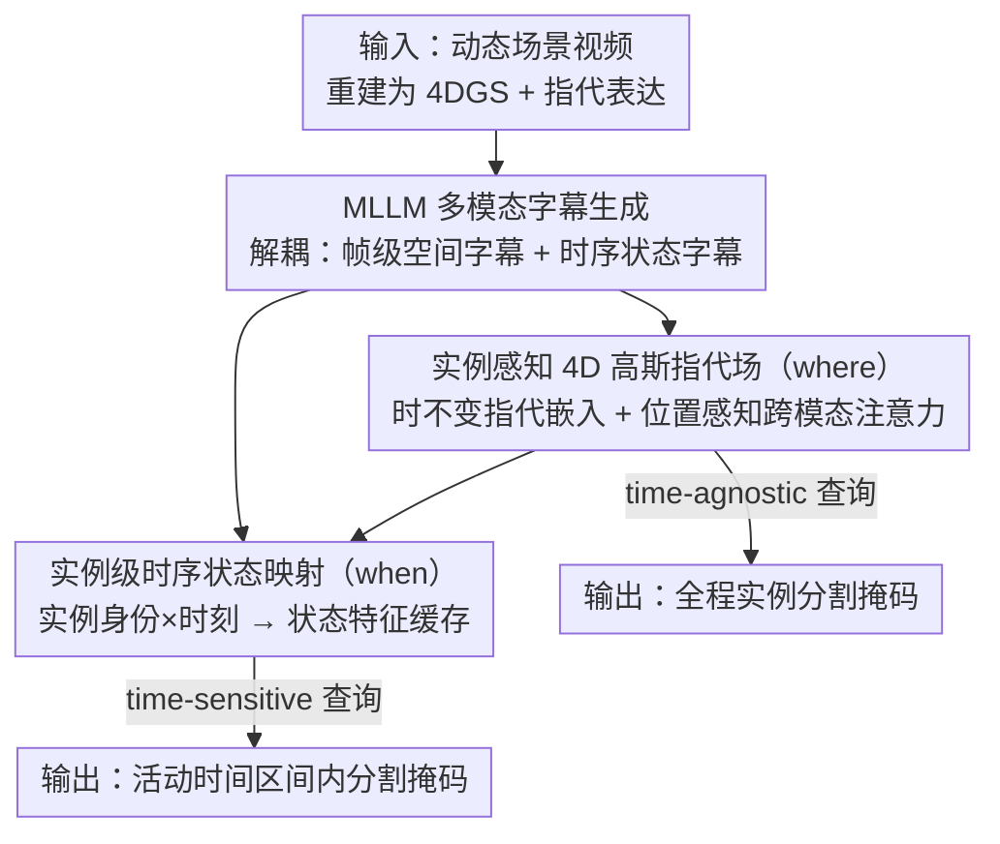

# ST4R-Splat: Spatio-Temporal Referring Segmentation in 4D Gaussian Splatting

**会议**: CVPR 2026  
**论文**: [CVF Open Access](https://openaccess.thecvf.com/content/CVPR2026/html/Meng_ST4R-Splat_Spatio-Temporal_Referring_Segmentation_in_4D_Gaussian_Splatting_CVPR_2026_paper.html)  
**代码**: 无  
**领域**: 3D视觉  
**关键词**: 4D高斯泼溅, 指代分割, 时空定位, 语言场, MLLM监督

## 一句话总结
提出了「4D 高斯泼溅中的时空指代分割（STRS-4DGS）」这一新任务，并设计 ST4R-Splat 框架：用**时不变的实例指代嵌入**解决「在哪（where）」、用**特征空间里的实例级时序状态映射**解决「何时（when）」，再配一条 MLLM 自动生成时空监督的字幕流水线，在自建 benchmark 上把改造过的 SOTA baseline 大幅甩开（time-agnostic mIoU 77.67% vs 43.40%）。

## 研究背景与动机

**领域现状**：3D 高斯泼溅（3DGS）和它的动态版 4D 高斯泼溅（4DGS）已经能做到高保真、实时的动态场景重建，但它们本质是为几何保真和新视角合成优化的，**没有语义、不懂语言**。近期有两条线想给高斯场加语言能力：一条在静态 3DGS 上建语言场（如 ReferSplat 做静态 3D 指代分割），另一条在动态 4DGS 上建语言场（如 4DLangSplat 支持开放词表查询）。

**现有痛点**：这两条线是「正交」的——3DGS 那条只能在**静态**场景里做语言 grounding；4DGS 那条虽在动态场景里，却只能做**类别级 / 开放词表**的检索（「找出所有杯子」），无法解析需要联合推理空间布局与时间演化的复杂指代表达。

**核心矛盾**：一句指代表达如「在某人手里被掰成两半的那个物体」，同时夹带了**空间消歧**（「在某人手里」用来锁定是哪一个实例）和**时序定位**（「被掰成两半」用来锁定发生在哪段时间）两个维度，而现有方法要么没有时间轴、要么没有实例级消歧，没人能在显式 4D 重建上把两者一起解。

**本文目标**：在给定 4DGS 表示 + 自由形式指代表达的前提下，把被描述的目标实例在**整个时空范围**内分割出来，并细分为两个子任务——空间消歧（where）和时序定位（when）。

**切入角度**：作者的关键观察是「where 和 when 应该解耦」。空间身份是跨时间不变的（一个杯子从头到尾还是那个杯子），而状态是随时间变化的；若把两者纠缠在一个随时间形变的语言场里（像 4DLangSplat 那样靠 2D 渲染监督），就会受视角变化干扰、时序状态学不稳。

**核心 idea**：给每个 4D 高斯绑一个**时不变**的指代嵌入来稳稳锚定空间身份，再把「实例身份 + 时刻」直接在**特征空间**映射到语义状态特征来定位时间，从而彻底绕开 2D 渲染监督的视角依赖。

## 方法详解

### 整体框架
ST4R-Splat 在 4DGS 重建之上叠了一套语言理解系统，输入是动态场景的 RGB 视频（重建成 4DGS）和一句指代表达，输出是目标实例在时空上的分割掩码。整个框架围绕「解耦 where / when」展开，由三大组件串成：先用 MLLM 自动造出解耦的空间字幕与时序状态字幕作监督信号；再用这些字幕训练一个**实例感知 4D 高斯指代场**回答「在哪」；最后用一个**实例级时序状态映射**模块回答「何时」。推理时按查询类型走：time-agnostic 查询只用空间指代场；time-sensitive 查询先用指代场定位实例、再查时序状态缓存定位时间区间。

### 关键设计

**1. MLLM 多模态字幕生成：无人工标注地造出解耦的时空监督**

新任务没有现成标注，而指代分割又必须有细粒度的语言-实例对齐才能训。作者用现成视觉基础模型（Grounded-SAM-2 + Unipixel）先做开放词表检测/分割/跟踪，得到时间一致的物体轨迹 $\{M_{k,t}\}$，再用 MLLM（Qwen3-VL-8B）生成**两类解耦字幕**：（i）**帧级描述字幕** $C_{\text{desc}}(o_k,t)$——把目标实例用红色轮廓高亮、背景灰度模糊，配原始 RGB 帧作上下文，让 MLLM 写出外观、属性、空间关系；（ii）**时序状态字幕** $C_{\text{state}}(o_k,t)$——先对整段视频拿一个粗略时序摘要 $T^{\text{sum}}(o_k)$，再对每个时刻 $t$ 附近的短视频片段查询 MLLM 写出该时刻的瞬时状态/动作。两类字幕分别喂给空间分支和时序分支，是整套监督的源头；解耦的好处是空间监督不被时序信息污染、反之亦然，正好对上 where/when 的解耦架构。

**2. 实例感知 4D 高斯指代场：用时不变嵌入回答「在哪」**

要在连续 4D 空间里 ground 一句指代表达，作者给每个随时间形变的高斯 $g_i(t)$ 额外挂一个**可学习、时不变**的指代嵌入 $e_i \in \mathbb{R}^d$，形成跨时间一致的语义场。关键是它如何与文本交互：因为嵌入静态而物体在动，作者把时变坐标 $\mu_i(t)$ 注入一个**位置感知跨模态注意力** $\phi$，动态增强嵌入 $e_i'(t)=\phi(e_i,\mu_i(t),E)$；再用增强特征与所有词嵌入的平均内积 $m_i(t)=\frac{1}{L}\sum_j \langle e_i'(t),E_j\rangle$ 算出每个高斯的语义相关度，经 alpha 合成栅格化成 2D 掩码、用 BCE 对齐伪 GT（$L_{\text{ref}}$）。为消歧不同实例，还加了两个约束：**对象级对比学习** $L_{\text{con}}$——取相关度 top-$\tau$ 百分位的高斯特征平均成实例表示 $e_g(t)$，拉近它与句子嵌入 $e_{\text{txt}}$、推远无关文本；以及**实例感知正则** $L_{\text{inst}}=\lambda_{\text{comp}}L_{\text{comp}}+\lambda_{\text{dist}}L_{\text{dist}}$——把同实例的渲染特征拉向各自原型（compactness）、把不同实例原型推开（distinctiveness）。训练采用**解耦优化**：先只用 $L_{\text{rgb}}$ 重建 4DGS，语义项 $L_{\text{sem}}=\lambda_{\text{ref}}L_{\text{ref}}+L_{\text{inst}}+\lambda_{\text{con}}L_{\text{con}}$ 对几何**停梯度**，保渲染保真的同时学出稳的指代场。

**3. 实例级时序状态映射：在特征空间回答「何时」**

4DLangSplat 靠 2D 渲染监督学时序状态，单视角训练导致换视角后渲染特征质量崩、时序判断失稳。作者改成在**特征空间**直接建映射 $c_{k,t}=F(\bar e_k,t)$：把组件 2 学到的判别性实例嵌入 $\bar e_k$ 和时刻 $t$ 映射到该时刻的语义状态特征 $c_{k,t}$。实现上做得很轻——直接把每个实例在所有时刻的时序状态字幕编码（用 e5-mistral-7b）成一个**预计算的状态缓存** $C_k=\{c_{k,t}\mid t\in[0,T]\}$，把时序状态牢牢绑在实例身份上。推理 time-sensitive 查询时，先用组件 2 定位实例并拿到全程空间掩码，再把查询编码后与状态缓存逐帧算相关度、沿时间轴平滑、自适应阈值二值化，得到「描述的状态发生在哪些帧」。因为状态特征不依赖任何渲染视角，所以**换到全新视角也稳**（论文 Fig.3：新视角下 Acc 90.38% vs 4DLangSplat 51.92%）。

### 损失函数 / 训练策略
总语义目标 $L_{\text{sem}}=\lambda_{\text{ref}}L_{\text{ref}}+L_{\text{inst}}+\lambda_{\text{con}}L_{\text{con}}$，其中 $L_{\text{inst}}$ 含 compactness 与 distinctiveness 两项（后者带 $\epsilon$ 防除零）。4DGS 几何先用 $L_{\text{rgb}}$ 单独重建，语义训练对几何停梯度。时序分支不参与梯度训练，是字幕编码后的预计算缓存。文本编码：空间分支用 BERT，时序分支用 e5-mistral-7b。

## 实验关键数据

### 主实验
评测在扩展自 HyperNeRF 的自建 STRS-4DGS benchmark 上（6 场景 26 物体，52 条 time-agnostic + 8 条 time-sensitive 查询）。由于是全新任务，没有现成方法，作者把 ReferSplat（3DGS 指代分割 SOTA）和 4DLangSplat（4D 语言场）改造成 baseline。

**time-agnostic 指代查询（mIoU %）**：

| 方法 | americano | cookie | keyboard | Average |
|------|-----------|--------|----------|---------|
| ReferSplat | 36.97 | 28.47 | 20.39 | 35.42 |
| 4DLangSplat | 35.70 | 46.55 | 61.00 | 43.40 |
| **ST4R-Splat（本文）** | **80.51** | **69.48** | **83.25** | **77.67** |

**time-sensitive 指代查询（Acc / vIoU %）**：

| 方法 | Acc (Avg) | vIoU (Avg) |
|------|-----------|------------|
| 4DLangSplat | 52.24 | 12.14 |
| **ST4R-Splat（本文）** | **83.44** | **57.98** |

> 指标定义：**mIoU** 为所有测试帧上分割 IoU 的均值（衡量空间分割质量）；**Acc** = 正确预测帧数 / 总帧数（衡量时序区间判断）；**vIoU** $=\frac{1}{|S_u|}\sum_{t\in S_i}\text{IoU}(\hat s_t,s_t)$，$S_u/S_i$ 分别为 GT 与预测的帧集合并/交，兼顾时序准确度与分割质量。

### 消融实验
在 time-agnostic 查询上逐个去掉核心组件（mIoU %）：

| 配置 | mIoU | 说明 |
|------|------|------|
| 完整模型 | 77.67 | — |
| w/o 跨模态注意力 | 58.56 | 掉 19.11，最关键 |
| w/o 对比损失 $L_{\text{con}}$ | 70.85 | 掉 6.82 |
| w/o 实例感知正则 $L_{\text{inst}}$ | 76.94 | 掉 0.73，影响最小 |

### 关键发现
- **位置感知跨模态注意力是空间 grounding 的命门**：去掉它 mIoU 从 77.67 直接掉到 58.56，远超另外两项的影响，印证了「把时变坐标注入文本-高斯交互」对动态场景定位至关重要。
- **对 4DLangSplat 的碾压主要来自任务错位**：它本为开放词表查询设计，面对需要联合时空推理的复杂指代表达就乱了——time-agnostic 上只有 43.40%，且常把「手」和「木板」一起激活而不是孤立目标物体。
- **解耦带来视角鲁棒性**：在固定新视角下重渲染整段视频做 time-sensitive 查询，本文 Acc 90.38% 对 4DLangSplat 51.92%，证明特征空间的时序映射不被渲染视角拖累。

## 亮点与洞察
- **「where 时不变 / when 在特征空间」是这篇最漂亮的拆法**：把空间身份做成跨时间不变的嵌入、把时序状态做成绑在身份上的预计算缓存，一举绕开了 2D 渲染监督的视角依赖——这是它在新视角下不崩的根本原因，思路可迁移到其他「需要稳定实例身份 + 随时间变状态」的 4D 理解任务。
- **用现成 VFM + MLLM 自动造解耦监督，省掉人工标注**：检测/分割/跟踪管线给实例轨迹，MLLM 再分别写空间字幕与时序状态字幕，把一个本来要密集标注的新任务变得可训，是把基础模型当「标注工厂」的实用范式。
- **解耦优化 + 停梯度保几何**：语义学习对 4DGS 几何停梯度，让加语义场不破坏渲染保真，这个工程细节对所有「在重建场上叠语言场」的工作都通用。

## 局限与展望
- **依赖自建 benchmark，规模偏小**：仅 6 场景 26 物体、52+8 条查询，time-sensitive 只有 8 条，统计可靠性有限；扩展自 HyperNeRF 的设定也偏室内桌面级，开放真实场景下的泛化未验证。
- **训练监督由 MLLM 自动生成，质量上限受字幕器制约**：字幕错误/幻觉会直接污染指代场与状态缓存，论文未量化字幕质量对最终精度的影响。⚠️ 时序分支为预计算缓存、不参与端到端训练，可能限制对未见状态描述的泛化。
- **无开源代码**，复现成本高；时序状态映射用「字幕编码成缓存」的简化实现，是否能升级成可学习的连续映射、覆盖更细的状态粒度，值得探索。

## 相关工作与启发
- **vs ReferSplat**：ReferSplat 在**静态** 3DGS 上做指代分割，本文把它的位置感知跨模态注意力 + 对象级对比学习**搬进时间维度**，注入时变坐标 $\mu_i(t)$ 让静态嵌入能匹配动态物体——优势是支持 4D，代价是需额外的时序状态建模。
- **vs 4DLangSplat**：4DLangSplat 在动态 4DGS 上做**类别级开放词表**查询，靠 2D 渲染监督学可形变语言场；本文转向**实例级指代** grounding，并把时序状态放到特征空间（而非渲染空间），解决了它在复杂指代表达和新视角下都失稳的问题。
- **vs 2D/3D 指代分割（RES / RVOS / ScanRefer）**：这些方法要么纯在图像平面缺 3D 几何（难抗长时遮挡与大视角变化），要么只在静态点云上 grounding；本文首次把实例级指代语言 grounding 与显式 4D 几何/动力学统一起来。

## 评分
- 新颖性: ⭐⭐⭐⭐⭐ 定义了 STRS-4DGS 全新任务，并给出首个解耦 where/when 的可行框架
- 实验充分度: ⭐⭐⭐ benchmark 自建且规模小，time-sensitive 仅 8 条查询，缺更大规模与真实场景验证
- 写作质量: ⭐⭐⭐⭐ 任务动机和解耦思路讲得清晰，图文对照到位
- 价值: ⭐⭐⭐⭐ 为语言驱动的 4D 场景理解开了个有说服力的头，对具身/AR 有应用潜力

<!-- RELATED:START -->

## 相关论文

- [\[CVPR 2026\] Geometry-Aware Cross-Modal Graph Alignment for Referring Segmentation in 3D Gaussian Splatting](geometry-aware_cross-modal_graph_alignment_for_referring_segmentation_in_3d_gaus.md)
- [\[CVPR 2026\] STS-Mixer: Spatio-Temporal-Spectral Mixer for 4D Point Cloud Video Understanding](sts_mixer_4d_point_cloud.md)
- [\[CVPR 2026\] MORE-STEM: Long-Short MemOry REcall and Spatio-TEmporal Consistency Model for Query-Driven 3D/4D Point Cloud Segmentation](more-stem_long-short_memory_recall_and_spatio-temporal_consistency_model_for_que.md)
- [\[CVPR 2026\] LangField4D: Learning Identity-Adaptive and Spatio-Temporal Continuous 4D Language Fields for Dynamic Scenes](langfield4d_learning_identity-adaptive_and_spatio-temporal_continuous_4d_languag.md)
- [\[CVPR 2026\] Revisiting Monocular SLAM with Spatio-Temporal Scene Modeling](revisiting_monocular_slam_with_spatio-temporal_scene_modeling.md)

<!-- RELATED:END -->
