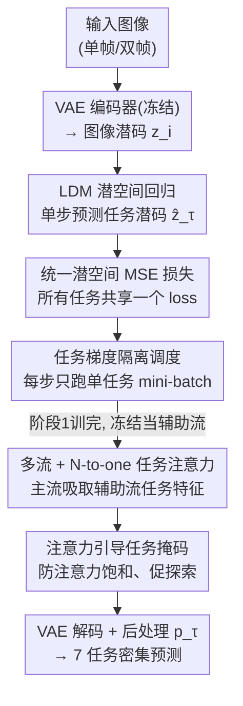

# StableMTL: Repurposing Latent Diffusion Models for Multi-Task Learning from Partially Annotated Synthetic Datasets

**会议**: CVPR 2026  
**arXiv**: [2506.08013](https://arxiv.org/abs/2506.08013)  
**代码**: https://github.com/astra-vision/StableMTL （有）  
**领域**: 3D视觉 / 多任务密集预测 / 扩散模型  
**关键词**: 多任务学习, 潜空间回归, 部分标注, 域泛化, 任务注意力

## 一句话总结
StableMTL 把预训练潜扩散模型（Stable Diffusion）改造成"单步潜空间回归器"，在三个各自只标注了部分任务的合成数据集上联合训练 7 个密集预测任务（语义/法向/深度/光流/场景流/着色/反照率），用统一的潜空间 MSE 损失替代逐任务损失、用"主流-辅助流"的 N-to-one 任务注意力促进任务间知识共享，在 8 个真实 benchmark 上以 +4.78 的 Δm 超过部分标注 MTL 基线并强泛化到分布外域。

## 研究背景与动机
**领域现状**：密集预测的多任务学习（MTL）很有价值——同时估计语义、深度、法向、光流等场景线索，且不同任务学到的表示能互相增益。但 MTL 的前提是要有"同一批图像、多个任务都标注全"的数据集，而像素级标注极其昂贵，这类数据稀缺。于是出现了"部分标注 MTL"：每张图只标注部分任务（如 MTPSL、DiffusionMTL、JTR）。

**现有痛点**：现有部分标注 MTL 方法有两个硬伤。其一是**单域训练**——它们大多在单个数据集内"模拟缺标"（随机丢掉部分标签），泛化能力受限，无法跨域。其二是**任务目标冲突**——为每个任务设计专属的像素级损失，再靠人工调权重去平衡不同任务的损失量级和梯度，任务一多（>3 个）训练就不稳定、调参成本爆炸。真实多数据集联合训练又面临标注噪声大（深度有传感器噪声）、某些任务标签根本拿不到（反照率、着色）的问题。

**核心矛盾**：要扩任务数 + 跨域泛化，就绕不开"多源部分标注"，但逐任务损失 + 人工平衡的范式在任务数增加时既不稳定也不可扩展。

**切入角度**：近期一批工作（Marigold、Lotus）发现，把预训练潜扩散模型（LDM）的去噪 UNet 微调一下，就能在小规模合成数据上做单任务密集预测，并强泛化到真实图像——生成式先验天然抗域偏移。作者顺着这条线设问：能不能把这种"LDM 重定向"从单任务扩到**多任务 + 多合成数据集 + 部分标注**，并彻底甩掉逐任务损失？

**核心 idea**：把多任务学习重新表述为**潜空间回归问题**——所有任务的标签都先编码进 SD 的统一潜空间，模型只需用一个共享的 MSE 潜损失去回归目标潜码，任务身份靠 task token 区分；再叠一层"主流向辅助流取经"的任务注意力来显式促进任务间交流。

## 方法详解

### 整体框架
StableMTL 要解决的问题是：从 $N$ 个合成数据集学 $K$ 个任务，每个数据集只标注 $<K$ 个任务（如 Hypersim 标语义/法向/深度/着色/反照率、VKITTI2 标深度/法向/光流/场景流/语义、FlyingThings3D 只标光流/场景流）。整体走**两阶段训练**：

- **第一阶段（单流）**：把 Lotus 式的单步确定性 LDM 改造成多任务版——输入图像先经冻结的 SD VAE 编码器变成潜码 $z_i=\mathcal{E}(x_i)$，标签也经任务专属函数 $f_\tau$ 编码进同一潜空间得到目标潜码 $z_\tau=\mathcal{E}(f_\tau(y_\tau))$；一个 UNet $U_{\theta,\tau}$ 在 task token $c_\tau$ 条件下单步预测 $\hat z_\tau=U_{\theta,\tau}(z_i)$，再经 VAE 解码器 + 后处理 $p_\tau$ 还原到任务空间。所有任务共享参数 $\theta$，靠 task token 切换。训练用统一潜空间 MSE 损失 + 任务梯度隔离调度。
- **第二阶段（多流）**：把第一阶段训好的单流 UNet **冻结**当"辅助流"$U_{\theta,\tau}$（为每个非主任务生成任务专属特征），再复制一份**可训练的主 UNet** $U_{\phi,T}$ 负责输出主任务 $T$；在主 UNet 的每个 transformer block 里插入**任务注意力层**，让主流特征去"吸取"辅助流的任务特征，从而把传统 N-to-N 的两两任务交互压成高效的 N-to-one 注意力。两阶段都只用一个 MSE 潜损失，没有任何逐任务损失。

### 关键设计

**1. LDM 潜空间回归 + task token：把生成器改造成多任务判别器**

针对"逐任务损失难扩展、跨域泛化差"的痛点，作者不再让网络在各任务的原始输出空间（深度图、分割图……）里分别回归，而是把所有任务的标签统一编码进 SD VAE 的 4 通道潜空间。语义这种离散类别、深度这种连续量纲完全不同，先各自经 $f_\tau$ 映射成 3 通道图再编码 $z_\tau=\mathcal{E}(f_\tau(y_\tau))$，于是异质任务全被拉到同一潜空间里。UNet 在单步内直接回归 $\hat z_\tau=U_{\theta,\tau}(z_i)$（沿用 Lotus 的单步确定性扩散，比多步采样训/推都快且泛化更好）。任务身份不靠加参数，而靠 task token $c_\tau$ 经 cross-attention 注入隐状态，让一套共享参数 $\theta$ 在不同 token 下学不同的"分布模式"——零额外参数即实现完全参数共享。生成式潜空间先验是它能在仅 ≈80k 合成图上训练却泛化到 KITTI/Waymo/DAVIS 等真实/分布外域的关键。

**2. 统一潜空间 MSE 损失：一个 loss 取代逐任务损失与人工平衡**

针对"任务一多就要调一堆损失权重"的痛点，StableMTL 对每个任务都只算潜空间里的 MSE：
$$\mathcal{L}(\theta)=\|\hat z_\tau-z_\tau\|_2^2=\|U_{\theta,\tau}(z_{i,j})-\mathcal{E}(f_\tau(y_\tau))\|_2^2$$
因为所有任务共用同一个潜空间、且在 task token 上做平均，对异质任务和不同分辨率天然归一化，从而内在缓解任务量级失衡。这意味着加新任务时不用设计新损失、不用 grid search 调权重——论文实验显示，即便只 3 个任务，某些权重组合就会让逐任务损失方案直接崩到 −68.94 Δm，而统一潜损失零调参就拿到与最优权重几乎持平的成绩（+3.92 vs +4.07 Δm）。代价是潜损失只能间接监督，论文也验证再叠一个 VAE 输出端的损失能微涨但显存翻倍。

**3. 任务梯度隔离调度：让弱梯度任务不被强任务压垮**

统一潜损失缓解了量级失衡，但不同任务的梯度幅值和方向仍会冲突——语义、反照率这类梯度范数小的任务会被深度等强梯度任务"淹没"。作者的做法很朴素却有效：**每个训练步只用单一任务的 mini-batch**，梯度累积也只在同一任务的 mini-batch 间累加，累完做一次 optimizer step、清零梯度，再换下一个任务。靠随机性，同一张图会在不同步被采到不同任务标签，保证所有标注都被覆盖。这样从根上避免了不同任务梯度在同一步里相互干扰。消融显示该调度单独带来 +2.54 Δm，且对语义、反照率这种低梯度范数任务提升最猛，梯度范数越小、去掉隔离后掉点越多，呈反相关。

**4. 多流 N-to-one 任务注意力 + 注意力引导掩码：高效促进任务交流**

单流虽能多任务但没有显式的任务交流；传统 N-to-N 任务注意力（每个任务都 attend 所有其他任务）随任务数平方膨胀。作者改成多流：冻结的单流 UNet 当辅助流，为每个非主任务 $\tau\in\mathcal{T}^*=\mathcal{T}\setminus\{T\}$ 产生任务特征 $F_{\theta,\tau}$；主 UNet 的特征 $F_{\phi,T}$ 当 query，辅助流特征当 key/value 做 cross-attention：
$$\mathrm{Attention}(Q,K,V)=\mathrm{softmax}(QK^\top/\sqrt d)\,V$$
其中 $Q=[q_T(F_{\phi,T})]$、$(K,V)=[(k_\tau(F_{\theta,\tau}),v_\tau(F_{\theta,\tau}))\mid\tau\in\mathcal{T}^*]$，每个任务有**独立的投影层** $(q_t,k_t,v_t)$ 做任务专属适配——这样把两两交互压成"主流对所有辅助流"的 N-to-one，可扩展性大增。但主、辅 UNet 都用阶段一权重初始化，注意力早期容易过度集中在某几个辅助任务上。为此加**注意力引导任务掩码**：把主流到各辅助任务的注意力分数归一化成分布 $\pi_T(\tau)=\mathbf{s}_{T\to\tau}/\sum_{\tau}\mathbf{s}_{T\to\tau}$，从中采一个任务 $m_T$ 把它掩掉（$M(t)=\mathbb{1}[t\neq m_T]$，得分高者更可能被掩），并以概率 $\rho$ 随机施加——分数越高越可能被掩，逼模型别只依赖强势任务、去探索更多任务交互。消融里去掉独立投影层掉 2.56 Δm、去掉单流初始化掉 6.52 Δm、退回纯单流掉 4.98 Δm，三者都证明这一层的价值。

### 损失函数 / 训练策略
- **唯一损失**：潜空间 MSE（式 1），两阶段共用，无逐任务损失、无损失权重。
- **多帧适配**：光流/场景流这类时序任务，输入两帧潜码沿通道拼接 $z_{i,j}=\mathrm{concat}(z_i,z_j)$；单帧任务令 $j=i$ 即把 $z_i$ 与自身拼接，统一处理时空任务。消融显示 concat 优于 avg、优于 concat 空帧。
- **任务采样**：每步均匀采一个任务；若该任务在多个数据集都有标注，按域匹配规则采（深度/法向沿用 Marigold 采样，光流/场景流在 FlyingThings3D 与 VKITTI2 间等概率采）。
- **骨干**：SD v2（可换 SD-XL/SD-3，改动极小），主 UNet 16 个 transformer block 各插一层任务注意力，最优用 4 个注意力头。

## 实验关键数据

### 主实验
在 3 个合成数据集（Hypersim/VKITTI2/FlyingThings3D，≈80k 图）训练，用真实数据集评测 7 任务 8 benchmark。单任务基线为逐任务单独训的 Lotus-D，Δm 衡量相对单任务基线的多任务整体性能。

| 方法 | 语义 mIoU↑ | 法向 mAE↓ | 深度 AbsRel↓(KITTI) | 光流 EPE-2D↓ | 场景流 EPE-3D↓ | 反照率 RMSE↓ | Δm %↑ |
|------|-----------|----------|---------------------|-------------|---------------|-------------|-------|
| 单任务基线 (Lotus-D) | 48.17 | 22.27 | 14.21 | 10.36 | 0.2735 | 0.2551 | 0.00 |
| JTR* | 20.46 | 50.91 | 39.27 | 34.92 | 0.5176 | 0.3565 | −106.87 |
| DiffusionMTL* | 45.92 | 44.56 | 24.83 | 36.60 | 0.3502 | 0.3660 | −78.76 |
| StableMTL-𝒮 (单流) | 52.57 | 23.94 | 15.64 | 12.76 | 0.2618 | 0.2077 | −1.57 |
| **StableMTL (多流)** | **55.79** | **23.27** | **14.98** | **10.76** | **0.2313** | 0.2016 | **+4.78** |

关键对比：相对各任务最强基线，StableMTL 在语义 +9.87 mIoU、法向 −12.37 mAE、场景流 −0.1189 EPE-3D 全面领先；逐任务损失的 JTR/DiffusionMTL 在扩到全 7 任务（带 *）后训练不稳，法向/深度反而严重退化（如 JTR* 法向 50.91 mAE）。

NYUv2 单数据集部分标注设定（MTPSL 的 One/Random 制式）下，StableMTL 同样在语义/法向/深度三任务全面超过 MTPSL、JTR、DiffusionMTL（如 One 设定语义 47.81 vs 次优 44.47，法向 22.45 vs 25.84）。

### 消融实验

| 配置 | Δm %↑ | 说明 |
|------|-------|------|
| **StableMTL 完整（多流）** | **+4.78** | 完整模型 |
| w/o 独立投影 $(q_t,k_t,v_t)$ | +0.85（掉 2.56） | 各任务共享投影 → 注意力模式趋同、交互受限 |
| w/o 单流初始化（用 SD 权重初始化 $U_\phi$） | −3.11（掉 6.52） | 初始化是多流最关键因素 |
| w/o 多流（退回单流） | −1.57（掉 4.98） | 无任务交流 |
| 单流 w/o 任务梯度隔离 | −4.11（掉 2.54） | 弱梯度任务被强任务淹没 |

数据集消融（Tab.4）：去掉 VKITTI2 对光流/场景流的打击远大于去掉 FlyingThings3D（域匹配 > 标注量）；去掉 Hypersim 严重伤害 DIODE 上的深度/法向（标注质量 + 域匹配）。

损失消融（Fig.6b）：单用潜损失 $\mathcal{L}_{\rm low}$ 即 +4.78 Δm；叠加 VAE 输出端损失 $\mathcal{L}_{\rm high}$ 或逐任务损失 $\mathcal{L}_{\rm task}$ 仅微涨（最高组合约 +6.9 Δm）但显存翻倍且需平衡，性价比低。注意力头数 1/2/4/8 → +2.45/+4.14/+4.78/+4.41 Δm，4 头最优、很快饱和。掩码概率 $\rho{=}0$ 时为 +3.41 Δm，启用掩码进一步增益。

### 关键发现
- **贡献最大的设计**：多流里"用单流权重初始化主 UNet"最关键（去掉掉 6.52 Δm），其次是任务梯度隔离（+2.54）和独立任务投影（+2.56）。
- **逐任务损失是不可扩展的根源**：3 任务时某些权重组合就能崩到 −68.94 Δm，而统一潜损失零调参拿到接近最优的 +3.92 Δm。
- **任务交互可视化**：法向↔深度、光流↔场景流、着色↔反照率呈强双向交互；也有单向受益（光流靠语义、语义靠着色），与任务关系先验吻合。
- **泛化**：仅 80k 合成图训练即可泛化到 KITTI/Waymo/Cityscapes/DDAD/YouTube-VOS/DAVIS 等真实与强分布外域。

## 亮点与洞察
- **"把生成器当判别器"的统一潜空间回归**：所有异质密集任务被编码进 SD 同一潜空间后，逐任务损失/权重平衡这个 MTL 老大难直接消失——这是最"啊哈"的点，本质是用统一表征替代显式平衡。
- **N-to-N 注意力压成 N-to-one**：把"每个任务 attend 所有任务"的平方复杂度，改成"主流向冻结辅助流取经"，既可扩展又能复用第一阶段免费产出的任务特征，是个干净的工程巧思。
- **任务梯度隔离极简却有效**：不改损失、不改架构，只把"每步单任务 + 同任务梯度累积"这种调度变一下，就解决了弱梯度任务被淹没的问题，可直接迁移到任何 MTL 训练循环。
- **注意力引导掩码当正则**：用注意力分数自身的分布去采样要掩谁，"越被依赖越可能被掩"，是一种自适应的任务级 dropout，可迁移到任何多源注意力防饱和场景。

## 局限与展望
- **依赖生成式潜空间先验 + 合成数据**：方法的泛化很大程度来自 SD 潜空间和合成数据集的密集干净标签；语义分割训在闭集驾驶类别上，跨到非驾驶域只是"部分"泛化（图 1 作者亦注明）。
- **两阶段 + 多流推理成本**：推理时辅助流要为所有非主任务各跑一遍产生特征，主 UNet 再 attend，相比单网络多任务有额外开销，论文未深入讨论推理时延。
- **逐任务损失能再涨但被舍弃**：叠加 $\mathcal{L}_{\rm high}/\mathcal{L}_{\rm task}$ 能到 ~+6.9 Δm，作者因显存翻倍而不用——若有显存预算，统一潜损失并非绝对上限。
- **改进思路**：把辅助流共享化/蒸馏成轻量模块以降推理成本；把任务采样从均匀改为按任务难度/梯度自适应；尝试把闭集语义换成开放词表以提升跨域语义泛化。

## 相关工作与启发
- **vs DiffusionMTL / JTR（部分标注 MTL SOTA）**：它们在单个全标注数据集内模拟缺标、用逐任务像素级损失 + 人工权重，任务一多就训练不稳；StableMTL 跨多合成数据集真·部分标注、统一潜损失零平衡，任务覆盖翻倍且全面领先。
- **vs Marigold / Lotus（LDM 重定向做单任务密集预测）**：它们证明了 LDM 微调可做单任务深度/法向并强泛化；StableMTL 把这条线扩到多任务 + 多数据集 + 任务交流，是"从单任务到 holistic MTL"的延伸。
- **vs Diception / OneDiffusion（大规模 LDM 多任务）**：它们靠大规模真实数据训多任务；StableMTL 互补地给出"仅小规模、部分标注合成数据"也能微调出多任务的方法。
- **vs 传统 MTL 平衡方法（自适应损失加权 / 梯度操纵 / Pareto 优化）**：这些都在显式平衡任务；StableMTL 用统一潜空间表征 + 梯度隔离调度，把"平衡"内化掉。

## 评分
- 新颖性: ⭐⭐⭐⭐⭐ 首个把生成式 LDM 先验用于 holistic 多任务密集预测，统一潜损失 + N-to-one 任务注意力组合新颖。
- 实验充分度: ⭐⭐⭐⭐⭐ 7 任务 8 benchmark + NYUv2，数据集/损失/初始化/梯度隔离/注意力头/掩码全套消融，且有任务交互可视化。
- 写作质量: ⭐⭐⭐⭐ 思路清晰、图文配合好；个别表述（损失消融最优配置）原文略有自相矛盾，需对照表格。
- 价值: ⭐⭐⭐⭐⭐ 给"标注稀缺下扩任务数的 MTL"提供了一条可扩展、免调权重的实用路径，对机器人/自驾多线索估计有直接价值。

<!-- RELATED:START -->

## 相关论文

- [\[CVPR 2026\] 3D-Aware Multi-Task Learning with Cross-View Correlations for Dense Scene Understanding](3d-aware_multi-task_learning_with_cross-view_correlations_for_dense_scene_unders.md)
- [\[CVPR 2026\] Mamba Learns in Context: Structure-Aware Domain Generalization for Multi-Task Point Cloud Understanding](mamba_learns_in_context_structure-aware_domain_generalization_for_multi-task_poi.md)
- [\[ICCV 2025\] Repurposing 2D Diffusion Models with Gaussian Atlas for 3D Generation](../../ICCV2025/3d_vision/repurposing_2d_diffusion_models_with_gaussian_atlas_for_3d_generation.md)
- [\[CVPR 2026\] NaTex: Seamless Texture Generation as Latent Color Diffusion](natex_seamless_texture_generation_as_latent_color_diffusion.md)
- [\[CVPR 2026\] MonoSAOD: Monocular 3D Object Detection with Sparsely Annotated Label](monosaod_monocular_3d_object_detection_with_sparsely_annotated_label.md)

<!-- RELATED:END -->
