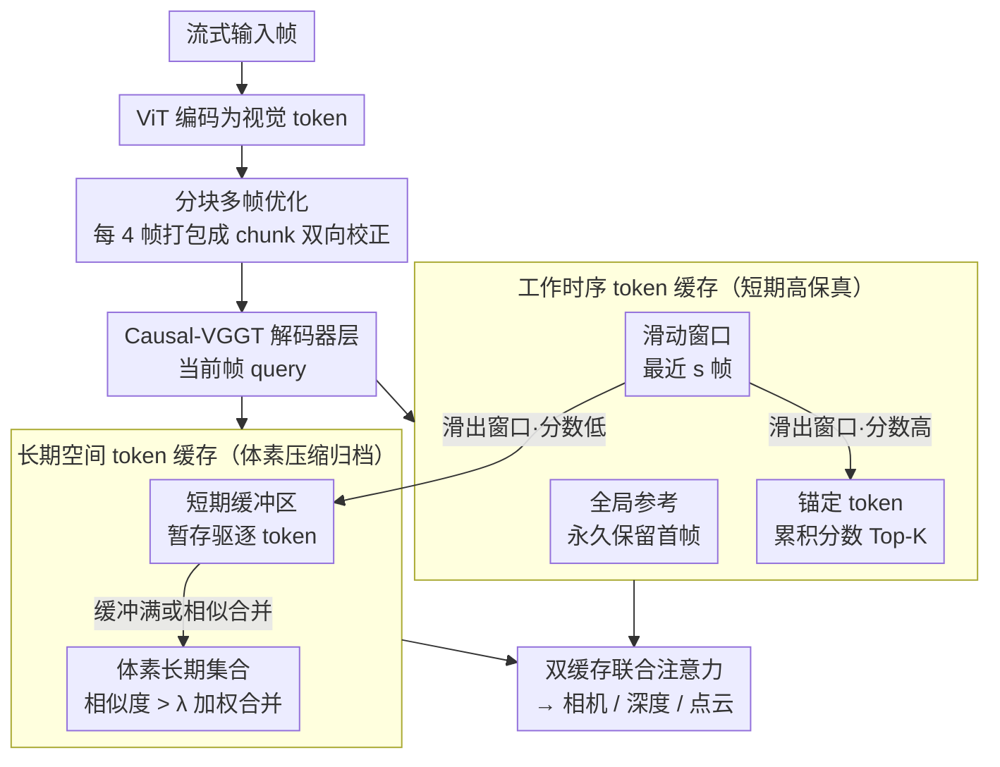

# STAC: Plug-and-Play Spatio-Temporal Aware Cache Compression for Streaming 3D Reconstruction

**会议**: CVPR 2026  
**arXiv**: [2603.20284](https://arxiv.org/abs/2603.20284)  
**代码**: [https://stac-3r.github.io/](https://stac-3r.github.io/) (项目主页)  
**领域**: 3D视觉  
**关键词**: 流式3D重建, KV缓存压缩, 时空稀疏性, 因果Transformer, 体素化存储

## 一句话总结

提出STAC框架，利用因果Transformer中KV缓存的时空稀疏性，通过工作时序token缓存、长期空间token缓存和分块多帧优化三个模块，在不需要额外训练的情况下将流式3D重建的内存消耗降低约10倍、推理速度提升4倍，同时几乎不损失重建质量。

## 研究背景与动机

1. **领域现状**：基于Transformer的3D重建方法（如VGGT）通过前馈网络联合推断相机参数、深度图和点云图，取得了SOTA表现。为支持流式输入，Causal-VGGT变体（STream3R、StreamVGGT）将全局自注意力替换为因果自注意力，并通过KV缓存维护历史帧的上下文。
2. **现有痛点**：KV缓存随帧数线性增长，在长序列场景下导致严重的内存瓶颈。例如处理200-300帧时，缓存可增长到接近20GB。内存受限下的早期驱逐策略会显著降低重建质量和时序一致性。
3. **核心矛盾**：现有方法对所有token统一处理，忽略了缓存中固有的结构化稀疏模式——部分token只在特定空间位置相关（空间稀疏），部分token跨帧持续重要（时序稀疏）。统一的驱逐/缓存策略导致有价值token被过早丢弃，无用token被不必要保留。
4. **本文目标** (1) 在有限内存下维持长序列3D重建质量；(2) 利用时空稀疏性进行KV缓存压缩；(3) 在不额外训练的前提下实现即插即用的加速。
5. **切入角度**：作者通过分析因果Transformer的注意力图，发现不同注意力头呈现分化的角色——有些专注空间推理（关注空间相邻区域），有些专注时序一致性（持续关注首帧/地标帧/相机token），这种"内在的时空稀疏性"为结构化压缩提供了理论基础。
6. **核心 idea**：受人类记忆机制启发，用"工作记忆（短期高保真）+长期记忆（空间压缩存储）"的双缓存架构替代线性增长的KV缓存。

## 方法详解

### 整体框架

STAC 要解决的核心问题是：流式 3D 重建里 KV 缓存随帧数线性膨胀，处理两三百帧时就能撑到近 20GB，但简单按内存上限驱逐 token 又会把有用的历史信息丢掉，导致重建质量塌方。它的破局思路是把"一个线性增长的大缓存"拆成两块功能互补的记忆：一块管"近期 + 全局锚点"的高保真短期记忆，一块管"被驱逐 token 按空间位置压缩归档"的长期记忆。

具体而言，每帧经 ViT 编码成视觉 token 后，STAC 在 Causal-VGGT 的每个解码器层维护两个缓存：工作时序缓存 $\mathcal{M}^{\text{temp}}$ 保存近期帧和锚定 token 的原始表示，长期空间缓存 $\mathcal{M}^{\text{spat}}$ 把驱逐出来的 token 按 3D 位置塞进体素网格并在线合并。解码时，当前帧的 query 同时去注意这两个缓存里的 key-value。在此之上，分块多帧优化把连续几帧打包成一个 chunk 联合处理，既摊薄 GPU 开销又让相邻帧互相校正。

### 关键设计

**1. 工作时序 token 缓存：让滑动窗口之外的"时序锚点"不被冲掉**

纯滑动窗口的麻烦在于，它只记最近 $s$ 帧，一旦某个全局重要的 token（首帧、地标帧、相机 token）滑出窗口就永久丢失，而注意力分析恰恰显示这类 token 会跨帧被持续关注。STAC 因此把短期记忆拆成三类：全局参考 token $\mathcal{M}^{\text{refer}}$ 永远保留第一帧的全部 token 作为坐标基准，滑动窗口 token $\mathcal{M}^{\text{window}}$ 保留最近 $s$ 帧捕捉短期运动连续性，锚定 token $\mathcal{M}^{\text{anchor}}$ 则动态挑出那些"虽然旧但一直被关注"的 token。判定靠一个带衰减的累积重要性分数：

$$s_t^i = \gamma s_{t-1}^i + \sum_j \alpha_t^{j,i}, \quad \gamma \in (0,1)$$

每个 token 的分数随时间以 $\gamma$ 指数衰减，又不断加上当前帧对它的注意力 $\alpha$。当一个 token 滑出窗口时，它带着累积分数去和现有锚定 token 竞争，留下 Top-K 的作为新锚点。这样指数衰减天然偏向"长期反复受关注"的 token，把真正的时序锚点筛出来，而不是单纯按距离淘汰。

**2. 长期空间 token 缓存：被驱逐的 token 不删，而是按 3D 位置压缩归档**

3D 重建里空间邻近的 token 高度冗余——同一物体从不同视角看到的观测往往大同小异，体素网格因此是天然的组织单位。STAC 给每个体素配双缓存：短期缓冲区 $\mathcal{E}_u$ 先暂存刚驱逐进来的 token，长期集合 $\mathcal{G}_u$ 存合并后的代表性 token。合并有两种路径。一是一对一合并：当被驱逐 token 与某个长期代表的余弦相似度超过阈值 $\lambda$，就按相似度加权融进去

$$\hat{m}^p \leftarrow \frac{Z(\hat{m}^p)\hat{m}^p + \omega(m^e,\hat{m}^p)m^e}{Z(\hat{m}^p) + \omega(m^e,\hat{m}^p)}$$

其中 $Z(\hat m^p)$ 记录该代表已经吸收过多少 token，相当于带权平均。二是多对一聚合：缓冲区满了就以分数最高的 token 为轴心，把整批缓冲 token 加权聚合成一个新代表插进长期集合。体素本身也有容量上限，满了就触发再合并，把最不重要的代表融进它的最近邻。先用缓冲区暂存、相似才合并的两段式设计，是为了别把可能独特的证据过早抹平，同时又压住总体素数量。

**3. 分块多帧优化：把帧级处理的 kernel 开销摊到 chunk 上**

逐帧处理会反复启动大量 CUDA kernel，开销可观。STAC 把连续到达的帧每 4 帧组成一个 temporal chunk，块内做双向注意力让相邻帧互相交换信息、彼此校正局部几何，块边界仍守住流式约束（不偷看未来帧）。配合 Morton 编码把 3D 体素坐标映射成线性索引，token 的选择、合并、检索都能批量化执行。消融里这一项对运行时间影响最大——去掉后单步从 71ms 涨到 138ms，几乎翻倍。

### 一个完整示例：一个 token 的生命周期

跟着某帧里一个普通视觉 token 走一遍，整个双缓存机制就具象了。它刚生成时进入工作时序缓存，落在滑动窗口里、保真度全开。几帧之后窗口前移，它面临滑出：系统读它的累积分数 $s_t^i$——若它一直被后续帧关注（比如落在一个反复出现的地标上），分数高，就晋升为锚定 token 继续留在短期记忆；若分数平平，它被驱逐，但不是删除，而是按它的 3D 坐标找到所属体素，先进短期缓冲区 $\mathcal{E}_u$。接着系统拿它和该体素已有的长期代表比相似度：相似度 > $\lambda$ 就一对一融进最近的代表（加权平均、计数 $Z$ 加一）；若缓冲区此刻刚好满，就连同其他缓冲 token 一起多对一聚合成新代表。日后当前帧 query 指向这块空间时，它已经以"压缩代表"的形式被检索回来参与注意力。一个 token 就这样从"高保真短期"逐级降级到"压缩长期"，全程没被真正丢弃。

### 损失函数 / 训练策略

STAC是完全免训练的（training-free），直接在预训练的Causal-VGGT上即插即用。仅需设置衰减因子 $\gamma=0.9$、体素分辨率0.05、合并阈值 $\lambda=0.8$ 等超参数。为支持合并感知的注意力计算（加入 $\log n$ 偏置补偿），实现了自定义CUDA kernel。

## 实验关键数据

### 主实验

在NRGBD和7-Scenes数据集上的点云重建结果（采样步长5，200-300帧/序列）：

| 方法 | 类型 | NRGBD Acc↓ | NRGBD Comp↓ | NRGBD NC↑ | 7-Scenes Acc↓ | 7-Scenes NC↑ | 内存(GB)↓ | FPS↑ |
|------|------|-----------|------------|----------|--------------|-------------|----------|------|
| VGGT | 离线 | 0.017 | 0.012 | 0.740 | 0.022 | 0.602 | – | <1 |
| STream3R | 在线 | 0.053 | 0.013 | 0.703 | 0.044 | 0.606 | 19.75 | 2.52 |
| STream3R-W8 | 在线 | 0.078 | 0.015 | 0.687 | 0.107 | 0.587 | 0.86 | 6.19 |
| **STream3R-STAC** | **在线** | **0.065** | **0.014** | **0.700** | **0.047** | **0.606** | **2.20(0.86)** | **10.53** |
| StreamVGGT | 在线 | 0.134 | 0.059 | 0.651 | 0.046 | 0.595 | 19.75 | 2.48 |
| StreamVGGT-STAC | 在线 | 0.126 | 0.047 | 0.682 | 0.056 | 0.596 | 2.57(0.86) | 10.49 |

STAC将STream3R的内存从19.75GB降至2.20GB（运行时仅0.86GB），FPS从2.52提升至10.53，同时重建质量几乎无损。

### 消融实验

在NRGBD数据集上以STream3R-W8为基线（7-Scenes平均指标）：

| 配置 | Acc↓ | Comp↓ | NC↑ | 内存(GB) | 运行时间(ms) |
|------|------|-------|-----|----------|-------------|
| Baseline (W8) | 0.0776 | 0.0150 | 0.6865 | 0.858 | 92.56 |
| w/o 锚定token | 0.0725 | 0.0209 | 0.6991 | 1.901 | 61.36 |
| w/o 空间缓存 | 0.0713 | 0.0199 | 0.6939 | 0.572 | 39.08 |
| w/o 计数偏置 | 0.0666 | 0.0175 | 0.6973 | 2.063 | 56.08 |
| w/o 分块优化 | 0.0673 | 0.0156 | 0.6948 | 1.805 | 138.12 |
| **完整模型** | **0.0648** | **0.0142** | **0.6995** | **2.210** | **71.18** |

### 关键发现
- 分块优化对运行时间影响最大：去掉后从71ms增加到138ms（几乎翻倍），同时质量也下降
- 空间缓存虽然增加内存但显著提升Completion指标，说明长期空间信息对完整性很关键
- 锚定token对Comp指标影响最大（0.0142→0.0209），印证了持久性token对时序一致性的重要性
- 在相同内存预算下，STAC始终优于简单的滑动窗口扩展（W22/W26），验证了结构化压缩的优越性

## 亮点与洞察
- **免训练即插即用**：STAC不需要任何额外训练，可直接应用于任何Causal-VGGT架构（STream3R和StreamVGGT都验证了），这大幅降低了实际部署门槛
- **人类记忆类比精准**：工作记忆（短期高保真）+长期记忆（压缩存储可检索）的设计巧妙对应了人类认知的双过程模型，而且在3D重建的token级别得到了具体实现——衰减累积分数识别"锚点"特别类似于记忆巩固过程
- **体素化组织的自然适配**：利用3D重建本身就需要输出3D点的特性，将空间缓存组织在体素网格中实现O(1)检索，这是其他领域（如LLM）的KV缓存压缩方法所不具备的结构先验

## 局限与展望
- 体素网格分辨率固定，在大规模开放场景中活跃体素数会持续增长——可考虑CPU offload或自适应分辨率
- 高动态场景中快速运动可能引入不一致的token表示，影响缓存稳定性
- 目前仅在室内数据集上验证，室外驾驶等大规模场景的泛化性有待探索
- 合并阈值 $\lambda$ 和体素分辨率等超参对不同场景的敏感性未做系统分析

## 相关工作与启发
- **vs StreamVGGT/STream3R**: 它们是STAC的底层架构，KV缓存线性增长是核心瓶颈，STAC通过结构化压缩在不修改训练的情况下解决此问题
- **vs H2O/StreamLLM (LLM领域KV缓存压缩)**: 这些方法针对1D文本序列，不考虑空间结构；STAC利用3D重建的空间先验设计了体素化的空间缓存，是首个将时空结构化稀疏性引入3D视觉模型KV缓存压缩的工作
- **vs Spann3R/CUT3R**: 这些方法使用隐式或潜在记忆，长序列下会出现漂移/遗忘；STAC的显式双缓存机制更好地保持了长期一致性

## 评分
- 新颖性: ⭐⭐⭐⭐ 首次系统研究3D视觉因果Transformer的KV缓存时空稀疏性，设计精巧但单个组件技术含量一般
- 实验充分度: ⭐⭐⭐⭐⭐ 多数据集、多基线、详细消融、内存/速度/质量全面评估
- 写作质量: ⭐⭐⭐⭐⭐ 动机分析深入，图表清晰，从观察到设计的逻辑链完整
- 价值: ⭐⭐⭐⭐ 实际应用价值高（10倍内存缩减+4倍加速），免训练特性使其易于集成

<!-- RELATED:START -->

## 相关论文

- [\[CVPR 2026\] Revisiting Monocular SLAM with Spatio-Temporal Scene Modeling](revisiting_monocular_slam_with_spatio-temporal_scene_modeling.md)
- [\[CVPR 2026\] ST4R-Splat: Spatio-Temporal Referring Segmentation in 4D Gaussian Splatting](st4r-splat_spatio-temporal_referring_segmentation_in_4d_gaussian_splatting.md)
- [\[CVPR 2026\] LiDAR Prompted Spatio-Temporal Multi-View Stereo for Autonomous Driving](lidar_prompted_spatio-temporal_multi-view_stereo_for_autonomous_driving.md)
- [\[CVPR 2026\] STS-Mixer: Spatio-Temporal-Spectral Mixer for 4D Point Cloud Video Understanding](sts_mixer_4d_point_cloud.md)
- [\[CVPR 2026\] Point4Cast: Streaming Dynamic Scene Reconstruction and Forecasting](point4cast_streaming_dynamic_scene_reconstruction_and_forecasting.md)

<!-- RELATED:END -->
