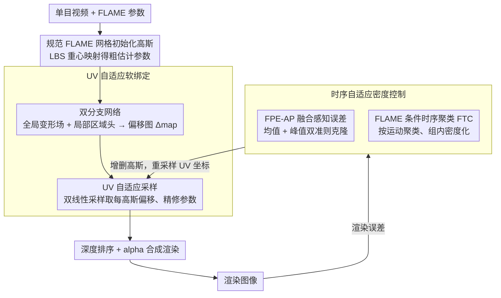

# STAvatar: Soft Binding and Temporal Density Control for Monocular 3D Head Avatars Reconstruction

**会议**: CVPR2026  
**arXiv**: [2511.19854](https://arxiv.org/abs/2511.19854)  
**代码**: [项目主页](https://jiankuozhao.github.io/STAvatar/)  
**领域**: 3D视觉  
**关键词**: 3D Head Avatar, 3D Gaussian Splatting, Soft Binding, Adaptive Density Control, Monocular Reconstruction

## 一句话总结

提出 STAvatar，通过 UV 自适应软绑定框架和时序自适应密度控制策略，从单目视频重建高保真可驱动的 3D 头部化身，在遮挡区域（口腔内部、眼睑）和精细细节方面显著优于现有方法。

## 背景与动机

从单目视频重建可驱动的逼真 3D 头部化身是计算机视觉与图形学的长期挑战，在 AR/VR、远程呈现和数字人等领域有广泛需求。现有基于 3D Gaussian Splatting (3DGS) 的方法存在两大核心缺陷：

1. **刚性绑定问题**：现有方法将高斯原语硬绑定到 FLAME 网格三角面片上，仅通过线性混合蒙皮 (LBS) 驱动变形。这导致高斯在三角面片局部坐标系中保持相对静止，无法建模非刚性的精细变形（如皱纹、表情细节）。部分方法用固定维度 MLP 增强变形，但需预定义固定数量的高斯，不兼容自适应密度控制 (ADC)。
2. **ADC 在动态场景的失效**：原始 3DGS 的 ADC 针对静态场景设计，对频繁遮挡区域（如口腔内部）处理不当——这些区域仅在少量帧可见，平均位置梯度低，导致密度化不足。此外，位置梯度仅捕捉几何差异而忽略纹理细节。

## 核心问题

如何在保持 ADC 灵活性的同时实现从网格到高斯的软性非刚性变形？如何改进 ADC 使其适应动态头部重建中短暂可见区域和纹理细节的需求？

## 方法详解

### 整体框架

STAvatar 想从单目视频重建出能自由驱动、又保得住细节的 3D 头部化身，难点在于既要让高斯随表情做非刚性形变、又不能因此丧失自适应密度控制（ADC）的灵活性。它的整条管线建在 FLAME 参数化网格驱动的 3DGS 之上：在规范 FLAME 网格上初始化一批高斯原语 $g_i$，每个绑到一个三角面片，参数含中心 $\boldsymbol{\mu}$、缩放 $\boldsymbol{S}$、旋转 $\boldsymbol{R}$、不透明度 $\alpha$ 和颜色 $c$；驱动时，先借父三角面片的重心映射把规范参数变成粗估计参数 $\tilde{\boldsymbol{r}} = \boldsymbol{r}\boldsymbol{R}$、$\tilde{\boldsymbol{\mu}} = k\boldsymbol{r}\boldsymbol{\mu} + \boldsymbol{t}$、$\tilde{\boldsymbol{s}} = k\boldsymbol{s}$（$\boldsymbol{r}$、$\boldsymbol{t}$ 为面片相对旋转与重心平移，$k$ 为各向同性缩放）；最后深度排序后做 alpha 合成 $\boldsymbol{C} = \sum_{i=1}^{N} c_i^* \alpha_i' \prod_{j=1}^{i-1}(1 - \alpha_j')$ 渲染出像素。

问题恰恰出在这个"粗估计"上：纯 LBS 驱动下不透明度和颜色保持不变（$\tilde{\alpha}=\alpha$、$\tilde{c}=c$），高斯在面片局部坐标系里近乎静止，皱纹、表情这类非刚性细节根本变不出来——这是硬绑定的核心局限。STAvatar 在粗估计之上叠两套机制来补救：用 **UV 自适应软绑定** 给每个高斯预测一个细粒度偏移，把粗参数精修成最终参数；再用 **时序自适应密度控制** 让密度化策略适应动态头部里"短暂可见"和"纹理误差"两类被原始 ADC 忽视的情况。

### 关键设计

**1. UV 自适应软绑定的双分支网络：在 UV 空间里预测高斯偏移，补回硬绑定丢掉的非刚性细节**

硬绑定让高斯无法独立形变，最直接的补法是给每个高斯学一个偏移量；但若像以往工作那样用固定维度 MLP 逐高斯独立预测，就把高斯数量写死了，和 ADC 互相冲突。STAvatar 改成在 UV 空间里预测一张偏移图。网络吃三样输入：从固定参考帧（默认第一帧）$Img_r$ 提取纹理、把参考帧 UV 坐标光栅化成的位置图 $UV_{pos}$、以及参考网格与控制网格顶点偏移光栅化成的位移图 $UV_{disp}$。它由全局、局部两个分支合作产出一张特征偏移图 $\Delta_{map} \in \mathbb{R}^{256 \times 256 \times 13}$，每个纹素存 13 维高斯偏移。全局分支负责整张脸一致的变形场，输入 U-Net 编码器纹理特征 $T = \mathcal{E}_i(Img_r)$、Fourier 编码的位置图 $UV_{pos}' = \mathcal{E}_f(UV_{pos})$ 和控制码 $\beta$（拼接表情、平移、姿态），输出 $\omega_g = \Phi_g(T, UV_{pos}', \beta)$；局部分支专攻眼、嘴、鼻、额四个关键区，用四张区域遮罩 $M_i \in \{0,1\}^{256 \times 256}$ 配区域专属解码头 $H_i$，输出 $\omega_l = \sum_{i=1}^{4} H_i(M_i \odot \Phi_l(T, UV_{disp}', \beta))$，最后融合成 $\Delta_{map} = \mathcal{F}(\omega_g, \omega_l)$。把偏移放进 UV 图而非逐高斯独立预测，好处是相邻高斯的偏移天然带空间连续性，且偏移图与具体高斯数解耦，为下一步兼容 ADC 留出空间。

**2. UV 自适应采样：用一张连续偏移图喂任意数量高斯，让软绑定和 ADC 真正兼容**

有了偏移图还得把它"分发"给每个高斯，而且高斯数会在 ADC 过程中不断增删，分发机制必须跟着变。STAvatar 给每个高斯 $g_i$ 在 UV 空间分配一个坐标，再双线性采样 $\Delta_{map}$ 取出它那份偏移 $\delta_i = \{\delta_\mu, \delta_s, \delta_r, \delta_\alpha, \delta_c\}$。坐标分配（Algorithm 1）的做法是：先把 UV 顶点和面光栅化、给每个面建一个像素池，再对绑定到该面的高斯从池里采样相应数量的像素，提取重心坐标后加权算出 UV 坐标；一旦 ADC 触发密度化、高斯数量变了，就自动重采样新的 UV 坐标。拿到偏移后，粗参数按各自的几何含义精修成最终参数：

| 参数 | 计算方式 | 操作类型 |
|------|----------|----------|
| 位置 $\mu^*$ | $\tilde{\mu} + \delta_\mu$ | 加法偏移 |
| 颜色 $c^*$ | $\tilde{c} + \delta_c$ | 加法偏移 |
| 不透明度 $\alpha^*$ | $\tilde{\alpha} + \delta_\alpha$ | 加法偏移 |
| 缩放 $s^*$ | $\tilde{s} \odot \delta_s$ | 逐元素乘法 |
| 旋转 $r^*$ | $q(\tilde{r}, \delta_r)$ | 四元数 Hamilton 积 |

关键在于偏移来自一张连续 UV 图、支持任意分辨率采样，新增高斯只要重采样坐标就能拿到合理偏移，不像 MLP 那样把高斯数钉死——这才让"软绑定"和"动态增删高斯"两件本来打架的事并存。

**3. FPE-AP 融合感知误差准则：让密度化看纹理误差，而不只是位置梯度**

原始 ADC 拿位置梯度当克隆准则，只能反映几何不一致，完全看不见纹理误差，于是有纹理细节却几何对齐的区域得不到加密。STAvatar 改用渲染误差直接驱动密度化。先构造一张融合感知误差图，把逐像素 L1 和结构不相似度合在一起：

$$E = (1 - \lambda_1)|\mathcal{L}_1| + \lambda_1 \mathcal{L}_{d\text{-}ssim}$$

其中 $\lambda_1 = 0.2$。再把误差摊到每个高斯头上：记录它的屏幕中心 $(x_i, y_i)$、覆盖像素数 $C_i$ 和累积 alpha 权重 $A_i$，以中心、半范围 $R_i = \lfloor \sqrt{C_i}/2 \rfloor$ 圈一个正方形影响区，算平均融合感知误差 $\bar{E}_i = \frac{A_i}{C_i} \sum_{p \in \mathcal{P}_i} E(p)$（用二维求和面积表加速窗口求和）。光看均值还不够，短暂出现的高误差会被平均掉，所以再加一条峰值准则：取跨所有迭代的峰值误差 $E_i^{peak} = \max_t(\frac{A_i^{(t)}}{C_i^{(t)}} \sum_{p} E^{(t)}(p))$，挑 top 3% 组成集合 $\mathcal{S}_{peak}$。最终只要 $\bar{E}_i > \tau_{avg}$ **或** $i \in \mathcal{S}_{peak}$（$\tau_{avg} = 1 \times 10^{-3}$）就克隆；分裂操作仍沿用位置梯度，因为分裂主要还是几何不一致驱动的。

**4. FLAME 条件时序聚类（FTC）：让口腔这类只在少数帧可见的区域也能被充分加密**

口腔内部、眼睑这种频繁遮挡区域，大部分帧里压根不可见，密度化准则在整段视频上一平均就被拉得很低，于是常年加密不足。FTC 的思路是按运动模式把帧分组、在组内算密度化准则。具体先用 FLAME 参数（表情权重 0.3、姿态权重 0.6、平移权重 0.1）对视频帧做 K-means，PCA 降维后再算帧间距离，并在 $[5, 12]$ 范围内用最大平均轮廓系数挑最优 $K$。训练时先按聚类分组、每组各训 $N-M$ 个 epoch（组内做 ADC），再用 $M$ 个 epoch 把全部数据随机洗牌、消除组间不一致（$N=6$、$M=1$）。这样结构相似的帧凑在一起算准则，口腔等区域在它真正可见的那个聚类里就有机会被充分加密——实验里 FTC 让口腔区域高斯数平均涨约 17%（超 400 个原语）。

### 损失函数 / 训练策略

RGB 损失把 L1、结构不相似度和感知损失合起来：$\mathcal{L}_{rgb} = (1-\lambda_1)\mathcal{L}_1 + \lambda_1\mathcal{L}_{d\text{-}ssim} + \gamma\lambda_2\mathcal{L}_{vgg}$，其中 VGG 感知损失只在训练后半段激活（$\gamma=1$），$\lambda_1=0.2$、$\lambda_2=0.05$。偏移正则 $\mathcal{L}_{offset} = \lambda_3|\delta_s - 1| + \lambda_4\delta_c$ 把缩放偏移拉向 1、压住颜色偏移别太大，另外沿用 GaussianAvatars 的位置损失和缩放损失。优化器为 Adam，UV 软绑定网络学习率 $1 \times 10^{-4}$，其余参数沿用 3DGS 默认；因为高斯都绑在网格面片上、几乎没有浮动高斯，所以不做不透明度重置。

## 实验关键数据

在 4 个数据集（INSTA、PointAvatar、NerFace、HDTF）共 22 个身份上评估，全部使用 512×512 分辨率，单张 RTX 3090 训练。

| 方法 | INSTA PSNR↑ | INSTA SSIM↑ | INSTA LPIPS↓ | PointAvatar PSNR↑ | NerFace PSNR↑ | HDTF PSNR↑ |
|------|-------------|-------------|--------------|-------------------|---------------|------------|
| SplattingAvatar | 27.48 | 0.9329 | 0.1046 | 24.93 | 26.14 | 26.02 |
| GaussianAvatars | 26.98 | 0.9378 | 0.0851 | 24.62 | 25.74 | 25.08 |
| FlashAvatar | 27.90 | 0.9357 | 0.0563 | 26.19 | 26.96 | 26.83 |
| FateAvatar | 28.33 | 0.9446 | 0.0508 | 28.36 | 27.12 | 27.18 |
| **STAvatar** | **30.63** | **0.9587** | **0.0304** | **28.25** | **30.08** | **27.99** |

- INSTA 上 PSNR 超次优方法 **2.2 dB**，LPIPS 降低 **40%+**
- 仅需 **6 个 epoch** 几乎收敛，训练效率最高（次优需 10-100 个 epoch）
- 消融实验证实每个组件的有效性：去除软绑定后 PSNR 降 1.0 dB，去除 ADC 后 LPIPS 显著恶化

## 亮点

1. **UV 空间软绑定设计精妙**：将高斯偏移量编码在 UV 特征图中，既利用了空间上下文（相邻高斯的偏移具有连续性），又天然兼容 ADC 的动态增删——新增高斯只需重采样 UV 坐标
2. **时序 ADC 策略直击痛点**：通过 FLAME 参数聚类让短暂可见区域在结构相似帧中获得充分密度化，FPE-AP 联合考虑几何和纹理误差，均值+峰值双准则避免遗漏
3. **训练效率极高**：6 epoch 收敛，比 MonoGaussianAvatar (100 epoch) 快一个数量级，得益于双分支网络的高效参数化和 FTC 的聚焦训练

## 局限与展望

1. **依赖 FLAME 跟踪质量**：管线以 VHAP 的 FLAME 拟合为前提，跟踪误差会直接传播到重建结果
2. **参考帧选择简单**：默认使用第一帧作为参考，未探索多参考帧或自适应选择策略
3. **未处理头发和配饰**：FLAME 不建模头发，这些区域的重建依赖 3DGS 自由度
4. **FTC 聚类数超参**：虽用轮廓系数自动选择 K，但聚类效果仍受 FLAME 参数空间分布影响
5. **实时推理未讨论**：训练高效但未报告推理帧率，双分支网络可能影响实时性能

## 与相关工作的对比

- **vs GaussianAvatars (GA)**：GA 硬绑定+纯 LBS，STAvatar 的软绑定加偏移使 PSNR 提升 3.6 dB
- **vs FlashAvatar (FA) / MonoGaussianAvatar (MGA)**：FA/MGA 用固定维度 MLP 预测偏移但不兼容 ADC，STAvatar 的 UV 采样方案天然支持动态高斯数
- **vs FateAvatar**：同为近期 SOTA，STAvatar 在 INSTA 和 NerFace 上大幅领先（+2.3/+2.96 dB），主要归功于针对遮挡区域的时序 ADC
- **vs 静态 ADC 改进方法**（如 SteepGS、3DGS-MCMC）：这些方法面向静态场景，无法处理动态重建中的短暂可见区域

## 启发与关联

- **UV 空间作为中间表示的通用性**：将离散高斯的属性预测转化为连续 UV 图的采样问题，是实现点云/高斯与 ADC 兼容的优雅方案，可推广到全身avatar、手部重建等领域
- **时序聚类思路**：按运动模式聚类训练帧的策略可迁移到其他动态 3DGS 任务（如动态场景重建、视频生成中 4DGS 的密度控制）
- **FPE-AP 的设计理念**：用渲染误差直接作为密度化准则替代间接的位置梯度，概念简洁且效果显著，可能成为 3DGS ADC 的新范式

## 评分

- 新颖性: ⭐⭐⭐⭐ (UV 软绑定+时序 ADC 的组合既解决实际问题又有技术创新)
- 实验充分度: ⭐⭐⭐⭐⭐ (4 数据集 22 身份、6 个 baseline、完整消融、效率分析)
- 写作质量: ⭐⭐⭐⭐ (动机清晰、图示优秀，方法描述略密)
- 价值: ⭐⭐⭐⭐ (在单目头部化身重建上推进了 SOTA，高训练效率有实用价值)

<!-- RELATED:START -->

## 相关论文

- [\[CVPR 2026\] Zero-Shot Reconstruction of Animatable 3D Avatars with Cloth Dynamics from a Single Image](zero-shot_reconstruction_of_animatable_3d_avatars_with_cloth_dynamics_from_a_sin.md)
- [\[CVPR 2026\] PhysHead: Simulation-Ready Gaussian Head Avatars](physhead_simulation-ready_gaussian_head_avatars.md)
- [\[NeurIPS 2025\] DC4GS: Directional Consistency-Driven Adaptive Density Control for 3D Gaussian Splatting](../../NeurIPS2025/3d_vision/dc4gs_directional_consistency-driven_adaptive_density_control_for_3d_gaussian_sp.md)
- [\[ICLR 2026\] FastGHA: Generalized Few-Shot 3D Gaussian Head Avatars with Real-Time Animation](../../ICLR2026/3d_vision/fastgha_generalized_few-shot_3d_gaussian_head_avatars_with_real-time_animation.md)
- [\[CVPR 2025\] Steepest Descent Density Control for Compact 3D Gaussian Splatting](../../CVPR2025/3d_vision/steepest_descent_density_control_for_compact_3d_gaussian_splatting.md)

<!-- RELATED:END -->
