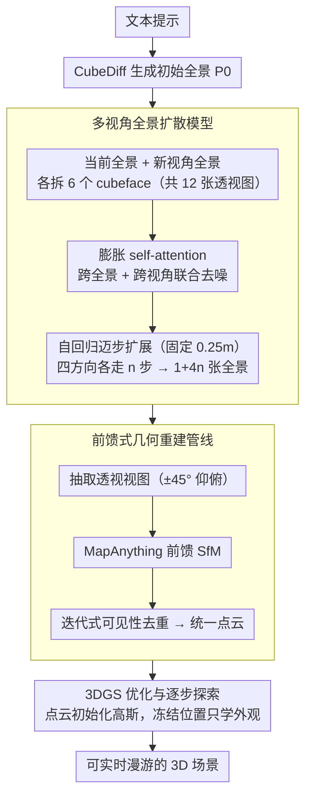

# Stepper: Stepwise Immersive Scene Generation with Multiview Panoramas

**会议**: CVPR 2026  
**arXiv**: [2603.28980](https://arxiv.org/abs/2603.28980)  
**代码**: [项目主页](https://fwmb.github.io/stepper)  
**领域**: 3D视觉 / 场景生成  
**关键词**: 全景图生成, 3D场景合成, 扩散模型, 多视角一致性, 沉浸式场景

## 一句话总结

提出 Stepper 框架，通过逐步生成多视角全景图并结合前馈式3D重建管线，实现文本驱动的高保真沉浸式3D场景生成，在PSNR上比现有方法平均提升3.3 dB。

## 研究背景与动机

**领域现状**：从文本或图像合成可探索的沉浸式3D场景是计算机视觉的核心任务，在AR/VR和空间计算中有广泛应用。目前主流方法分为两类：一是自回归扩展方法（如DiffDreamer、Text2Room），利用图像/视频模型逐步填充新视角；二是全景提升方法（如HoloDreamer、Matrix-3D），将360°全景直接提升至3D空间。

**现有痛点**：自回归方法因依赖局部视场的透视图像，会产生上下文漂移（context drift），随着扩展步数增加，几何误差积累、视觉保真度下降。全景提升方法虽然在投影中心附近质量较好，但对遮挡区域（disoccluded regions）无能为力，远离原点渲染时会出现模糊和拉伸。全景视频生成方法（如Matrix-3D）虽然一致性好，但受限于视频生成模型的计算开销，分辨率只能达到1440×720，细节严重不足。

**核心矛盾**：视觉保真度（fidelity）与可探索性（explorability）之间存在根本性trade-off——高质量但不能走远 vs. 能走远但质量差。

**本文目标** 如何在保持高分辨率、高保真度的同时，实现大基线的场景探索？

**切入角度**：作者观察到全景图本身是强大的场景上下文表示（覆盖360°信息），而cubemap表示可以将全景图分解为标准透视图像，因此可以直接复用预训练的2D图像扩散模型进行高分辨率全景图生成，避免了视频模型的分辨率瓶颈。

**核心 idea**：将场景扩展重新定义为多视角cubemap生成问题——每次向前"迈一步"生成完整的新视角全景图，兼顾高分辨率和全局一致性。

## 方法详解

### 整体框架

Stepper 要解决的核心难题是：怎样在不牺牲分辨率和保真度的前提下，让生成的3D场景能"走得远"。它的思路是把场景扩展从逐帧视频生成改写成多视角全景图的逐步生成——每次向前迈一步（固定 0.25m），就用扩散模型补出一张完整的新视角全景图，再把这些全景图重建成统一的3D场景。整条管线分三段接力：先用扩散模型从当前全景生成前方新视角全景，再用前馈式SfM把多张全景提升为一致的3D点云，最后把点云优化成可实时渲染的3D高斯溅射（3DGS）表示。一句话串起来就是：文本 → CubeDiff 出初始全景 → 多步自回归扩展 → MapAnything 重建点云 → 3DGS 优化 → 实时探索。

### 关键设计

**1. 多视角全景扩散模型：用 cubemap 把全景生成接回预训练 2D 扩散模型**

直接训一个全景扩散模型既要高分辨率又要跨视角一致，代价很高；视频生成路线又被分辨率卡死在 1440×720。Stepper 的做法是把输入全景 $P_{in}$ 和待生成的新视角全景 $P_{nv}$ 各自拆成 6 个 cubemap 面，共 12 张标准透视图，设 batch size $t=12$ 直接喂进预训练的 LDM。关键改动是膨胀（inflate）LDM 深层的 self-attention 层，把 token 序列从 $(bt)\times(hw)\times l$ 重排成 $b\times(thw)\times l$，让每个 cubeface 的 token 能 attend 到全部其他面——既包括同一张全景内的相邻面，也包括另一张全景的所有面，从而同时保证跨视角和跨全景的一致性；UV 坐标位置编码与全景来源标记则作为额外条件拼进去。这样设计的好处有两层：cubemap 的每个面都是 90° FOV 的标准透视图，没有等距矩形投影的极点畸变，分布与预训练数据吻合，省去从头训练；而全景级别的上下文覆盖了完整 360° 场景，从源头压住了自回归路线最头疼的上下文漂移。

**2. 前馈式几何重建管线：用 MapAnything 替代易错的单目深度对齐**

把生成的多张全景拼成一致的点云，最朴素的办法是逐张做单目深度估计再对齐，但深度估计器在球面数据上畸变严重、误差会层层累积。Stepper 改用前馈 SfM 模型 MapAnything 直接处理从全景中抽取的透视视图，端到端给出比深度对齐更稳的多视角几何。为了贴合 MapAnything 的训练分布，作者专门设计了取视图方式——从水平 cubeface 再向上、向下各旋转 45° 各取一组，保证相邻视图有充足重叠便于匹配。点云规模会随步数膨胀，于是用迭代式构建来去冗余：每引入一张新全景，就用 PyTorch3D 的点云渲染器检查它带来的点是否已在此前的全景里可见，只把真正没被观测过的新点加进来。

**3. 3DGS优化与逐步探索：固定高斯位置，只学外观**

有了 MapAnything 给出的精确点云，最后一步是把它变成能实时渲染的 3DGS。Stepper 用这份点云直接初始化高斯，并采用简化版 MCMC-GS 策略——位置全部冻住不动，只优化每个高斯的颜色作为外观表示，训练视图取 6 个 cubeface 加额外 8 个透视视图。冻结位置之所以可行，正是因为前馈模型的初始化已经足够准，把欠约束的几何自由度交还给可靠的重建结果，优化只需补外观即可。场景探索时从初始全景出发，向四个水平方向各走 $n$ 步，得到 $1+4n$ 个全景视图，覆盖一大片可自由漫游的空间。

### 一个完整示例

以一个室内场景为例走一遍：从文本用 CubeDiff 生成站在原点的初始全景 $P_0$，扩散模型据此在正前方 0.25m 处补出新视角全景 $P_1$——两张全景共 12 个 cubeface 经膨胀 attention 一起去噪，保证 $P_1$ 与 $P_0$ 接缝处的墙面、家具连续。继续向四个方向各推进 $n=3$ 步，得到 $1+4\times3=13$ 张全景；每张抽取带 ±45° 仰俯的透视视图送进 MapAnything，逐张做可见性去重后汇成一团统一点云。最后用这团点云初始化 3DGS，冻结位置只调颜色，几分钟后就得到一个能从原点向四周漫游约 0.75m 半径、远处遮挡区域也不出现拉伸空洞的可探索场景。

### 损失函数 / 训练策略

训练数据方面，基于Infinigen程序化生成框架构建了大规模合成多视角全景数据集，包含约230,000对全景图（分辨率4096×2048），覆盖5000个室内外场景。扩散模型使用标准扩散损失在全景对的cubeface上进行微调，训练90,000步，batch size为1（12个cubeface），在4个ViperFish TPU上分片训练（共64个TPU），有效batch size为16。步长固定为 $d=0.25m$，因为实验发现固定步长比可调步长训练更稳定。

## 实验关键数据

### 主实验

| 方法 | PSNR↑ | SSIM↑ | LPIPS↓ |
|------|-------|-------|--------|
| WorldExplorer | 13.145 | 0.624 | 0.648 |
| LayerPano3D | 17.931 | 0.688 | 0.503 |
| Matrix-3D | 18.133 | 0.665 | 0.515 |
| **Stepper (Ours)** | **21.426** | **0.735** | **0.385** |

（平均结果，涵盖Infinigen室内/室外 + Blender场景三个子集）

### 消融实验

| 设置 | 效果 |
|------|------|
| 单全景 vs 多全景输入3DGS | 多全景显著减少空洞，保持初始视角质量 |
| 可调步长方向 | 几何错误、纹理伪影增多 |
| 步长 d=0.5m vs d=0.25m | 0.5m仍可生成高质量全景但细节保持能力略差 |

### 关键发现

- 在所有数据集和所有指标上全面超越基线方法，PSNR平均提升至少3.3 dB
- SSIM 0.735 vs 次优 LayerPano3D 0.688；LPIPS 0.385 vs 次优 0.503
- 固定步长比可调步长效果更好——固定步长使学习任务更简单，生成质量更稳定
- 全景级上下文是减少漂移的关键：相比透视图的局部视场，全景图覆盖完整场景上下文，从源头上抑制了语义和几何不一致

## 亮点与洞察

- **范式创新**：将场景扩展问题从"逐帧视频生成"转化为"多视角cubemap图像生成"，巧妙地绕过了视频模型的分辨率瓶颈，同时保持了全景的全局上下文优势
- **数据集贡献**：构建了23万对多视角全景的大规模数据集，填补了该领域数据稀缺的空白，并提供了统一的定量评估基准
- **工程设计精细**：MapAnything的视角提取模式设计（45°旋转取视图）、迭代式去重点云构建、固定高斯位置的简化3DGS优化，都是实用且经过验证的engineering contributions

## 局限与展望

- 步长固定为0.25m，对于不同尺度的场景可能不够灵活
- 当前仅支持四个水平方向步进，垂直方向（如楼梯场景）的探索能力有限
- 依赖Infinigen合成数据训练可能限制真实场景的泛化能力
- 自回归生成过程仍然存在一定的累积偏差，只是通过全景级上下文缓解而非根本解决
- 3DGS优化中固定高斯位置虽简化了问题，但在复杂遮挡区域可能不够灵活

## 相关工作与启发

- CubeDiff [Uy et al.] 提出的cubemap范式为本文奠定了基础——将全景生成转化为多视角图像生成
- MapAnything [Hong et al.] 提供了强大的前馈SfM能力，使得从生成图像到3D重建的流程无缝衔接
- 本文的"步进式扩展"策略可以推广到其他需要大范围场景生成的任务（如自动驾驶场景模拟、游戏世界生成）
- 全景级上下文 vs 透视图局部上下文的对比，为其他自回归生成任务提供了重要启示

## 评分

- **新颖性**: ⭐⭐⭐⭐ — 将场景扩展重定义为多视角cubemap生成的思路新颖，但各组件（cubemap扩散、MapAnything、3DGS）均为已有技术的集成
- **实验充分度**: ⭐⭐⭐⭐ — 定量和定性对比充分，提供了多个子集的评估和消融实验，但缺少用户研究和真实场景评估
- **写作质量**: ⭐⭐⭐⭐⭐ — 逻辑清晰，图示精美，方法描述详尽
- **价值**: ⭐⭐⭐⭐ — 数据集和统一基准的贡献对社区有长期价值，方法在实际应用（AR/VR场景生成）中有明确前景

<!-- RELATED:START -->

## 相关论文

- [\[CVPR 2026\] Beyond Geometry: Artistic Disparity Synthesis for Immersive 2D-to-3D](beyond_geometry_artistic_disparity_synthesis_for_immersive_2d-to-3d.md)
- [\[CVPR 2026\] JOPP-3D: Joint Open Vocabulary Semantic Segmentation on Point Clouds and Panoramas](jopp3d_joint_open_vocabulary_semantic_segmentation.md)
- [\[CVPR 2026\] HyperMVP: Hyperbolic Multiview Pretraining for Robotic Manipulation](hyperbolic_multiview_pretraining_for_robotic_manipulation.md)
- [\[CVPR 2026\] Ego-1K: A Large-Scale Multiview Video Dataset for Egocentric Vision](ego-1k_--_a_large-scale_multiview_video_dataset_for_egocentric_vision.md)
- [\[CVPR 2026\] Pano3DComposer: Feed-Forward Compositional 3D Scene Generation from Single Panoramic Image](pano3dcomposer_feed-forward_compositional_3d_scene_generation_from_single_panora.md)

<!-- RELATED:END -->
