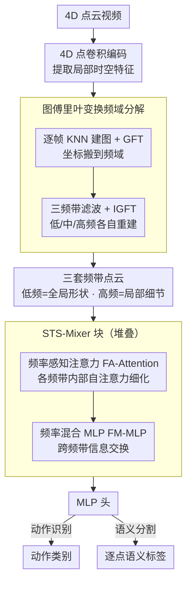

# STS-Mixer: Spatio-Temporal-Spectral Mixer for 4D Point Cloud Video Understanding

**会议**: CVPR 2026  
**arXiv**: [2604.11637](https://arxiv.org/abs/2604.11637)  
**代码**: [https://github.com/Vegetebird/STS-Mixer](https://github.com/Vegetebird/STS-Mixer)  
**领域**: 3D视觉  
**关键词**: 4D点云视频, 图傅里叶变换, 频谱表示, 动作识别, 语义分割

## 一句话总结
STS-Mixer 首次将图傅里叶变换（GFT）引入 4D 点云视频理解，通过频域分解捕获不同尺度的几何结构（低频=全局形状、高频=局部细节），与时空信息混合后在动作识别和语义分割上达到 SOTA。

## 研究背景与动机

**领域现状**：4D 点云视频包含 3D 空间+时间信息，现有方法（P4Transformer、PST-Transformer 等）在时空域建模短期和长期动态。

**现有痛点**：现有方法仅在时空域工作，难以捕获点云的底层几何特性——抽象形状和局部-全局上下文。点云的不规则无序性使得标准频域变换（如 DCT）不适用。

**核心矛盾**：时空域能建模运动动态但缺少对静态几何结构的显式建模，而几何结构（全局形状、局部细节）对理解 4D 场景至关重要。

**切入角度**：图傅里叶变换（GFT）天然适合不规则点云——通过图拉普拉斯的特征分解将点云转换到频域，不同频带捕获不同尺度的几何结构。

**核心 idea**：将 4D 点云分解为多频带信号（低/中/高频），各频带捕获不同几何特征，与时空信息混合实现全面表示学习。

## 方法详解

### 整体框架
STS-Mixer 想解决的是：4D 点云视频以往只在「时空」两个维度建模运动，却没人显式刻画点云本身的几何形状——什么是全局轮廓、什么是局部细节。它的做法是给点云补上第三个维度「频谱」。一段点云视频进来后，先用 4D 点卷积编码每个点的局部时空特征；接着对每一帧构图、做图傅里叶变换（GFT）把坐标搬到频域，用频带滤波器切成低/中/高三段，再逆变换回空间域，得到三套各自只保留某一尺度几何的点云；最后这三套频带点云送进堆叠的 STS-Mixer 块，块内先用 FA-Attention 在每个频带内部各自细化，再用 FM-MLP 让三个频带互通有无，末端接一个 MLP 输出动作类别或逐点语义标签。整条链路的关键就是「先按频率把几何拆开、各自处理、再融回来」。

### 关键设计

**1. 图傅里叶变换频域分解：让网络看见「全局形状」和「局部细节」是两类信号**

时空建模擅长捕运动，却把静态几何结构糊在一起。但点云是不规则、无序的，图像上常用的 DCT/FFT 没法直接套。GFT 正好为图结构而生：对每帧点云用 KNN 建图，算出归一化图拉普拉斯 $L = I - D^{-1/2} A D^{-1/2}$，对它做特征分解 $L = U \Lambda U^\top$，特征向量按特征值（频率）从小到大排好就构成一组频率基。把点坐标 $x$ 投到这组基上就得到 GFT 系数：

$$\hat{x} = U^\top x, \qquad x = U \hat{x}\ \text{(IGFT)}$$

低特征值对应平滑、缓变的成分（全局轮廓），高特征值对应剧烈变化的成分（边角、局部细节）。于是用三个频带滤波器把 $\hat{x}$ 切成低/中/高三段，每段单独做逆变换（IGFT）回到空间域，就得到三套「只保留某一尺度几何」的点云重建。作者的频带拒绝实验直接验证了这层语义：抹掉低频，重建出的物体整体形状垮掉；抹掉高频，大形状还在但棱角和细节糊了——这说明把频带分开，等于把不同尺度的几何信息交给网络分别处理。

**2. 频率感知注意力（FA-Attention）：同一尺度的点先在自己圈子里对齐**

三套频带点云语义并不互通——低频描述的是「这是个人形」，高频描述的是「这里有条边」，把它们混在一个注意力里互相关注只会干扰。FA-Attention 因此对每个频带各自独立做自注意力，让同频段内的点彼此关注，专注捕该尺度特有的几何模式。这一步只在频带内部细化，刻意不跨频带，保证每一路表示都纯净。

**3. 频率混合 MLP（FM-MLP）：三个尺度终究描述同一个物体，得让它们对话**

频带分开处理解决了干扰，但走到极端又割裂了信息——毕竟低/中/高频说的是同一个物体或场景，只看一段是片面的。FM-MLP 负责把它们重新接通：把三个频带的特征沿频率维度拼起来，过一个 MLP 做跨频带的信息交换，再拆回各自的频带。这样低频提供的全局位置能给高频的局部细节定位，高频的细节也能反过来锐化低频的轮廓，三者互相增强后再进入下一层 Mixer。FA-Attention 管「频带内细化」、FM-MLP 管「频带间融合」，二者交替堆叠就是 STS-Mixer 块的核心。

### 损失函数 / 训练策略
动作识别用交叉熵损失；语义分割用交叉熵损失加 Lovász-softmax 损失（后者直接优化 mIoU）。

## 实验关键数据

### 主实验

| 任务/数据集 | 指标 | STS-Mixer | 之前SOTA | 提升 |
|-------------|------|-----------|----------|------|
| MSR-Action3D 动作识别 | Acc | SOTA | PST-Transformer | 提升 |
| NTU RGB+D 60 动作识别 | Acc | SOTA | PPTr | 提升 |
| Synthia 4D 语义分割 | mIoU | SOTA | PST-Transformer | 提升 |

### 消融实验

| 配置 | 准确率 | 说明 |
|------|--------|------|
| Full STS-Mixer | 最优 | 时空+频谱 |
| 仅时空(无GFT) | 下降 | 缺乏几何结构建模 |
| w/o FA-Attention | 下降 | 频带内细化缺失 |
| w/o FM-MLP | 下降 | 频带间交互缺失 |
| 单频带 | 下降 | 多频带分解必要 |

### 关键发现
- 频谱表示与时空表示高度互补——各自捕获不同方面的信息
- 低频对动作识别贡献最大（全局形状区分动作类别），高频对精细分割更重要
- 三频带分解比两频带效果更好，频带数继续增加收益递减

## 亮点与洞察
- **首次频域视角看 4D 点云**：GFT 为点云理解开辟了新的信息维度，类似于 RGB 图像中的频域处理
- **频带拒绝的直观验证**：通过"去掉某个频带看重建效果"直观展示了各频带的信息含义

## 局限与展望
- GFT 计算（特征分解）在大规模点云上可能成为瓶颈
- 频带数和滤波器参数需要手动设定
- 未来可探索自适应频带分解和更高效的频谱方法

## 相关工作与启发
- **vs P4Transformer/PST-Transformer**: 纯时空域建模，忽略了频域几何信息
- **vs PointGST/PointWavelet**: 仅处理静态点云的频域方法，未拓展到 4D 视频

## 评分
- 新颖性: ⭐⭐⭐⭐⭐ 首次将 GFT 引入 4D 点云理解，视角独特
- 实验充分度: ⭐⭐⭐⭐ 动作识别+语义分割两个任务，多数据集验证
- 写作质量: ⭐⭐⭐⭐ 频域分析清晰直观
- 价值: ⭐⭐⭐⭐ 为 4D 理解开辟了新维度

<!-- RELATED:START -->

## 相关论文

- [\[ICCV 2025\] UST-SSM: Unified Spatio-Temporal State Space Models for Point Cloud Video Modeling](../../ICCV2025/3d_vision/ust-ssm_unified_spatio-temporal_state_space_models_for_point_cloud_video_modelin.md)
- [\[CVPR 2026\] Deformation-based In-Context Learning for Point Cloud Understanding](deformation-based_in-context_learning_for_point_cloud_understanding.md)
- [\[CVPR 2026\] SparseCam4D: Spatio-Temporally Consistent 4D Reconstruction from Sparse Cameras](sparsecam4d_spatio-temporally_consistent_4d_reconstruction_from_sparse_cameras.md)
- [\[CVPR 2026\] STAC: Plug-and-Play Spatio-Temporal Aware Cache Compression for Streaming 3D Reconstruction](stac_plug-and-play_spatio-temporal_aware_cache_compression_for_streaming_3d_reco.md)
- [\[CVPR 2026\] Mamba Learns in Context: Structure-Aware Domain Generalization for Multi-Task Point Cloud Understanding](mamba_learns_in_context_structure-aware_domain_generalization_for_multi-task_poi.md)

<!-- RELATED:END -->
