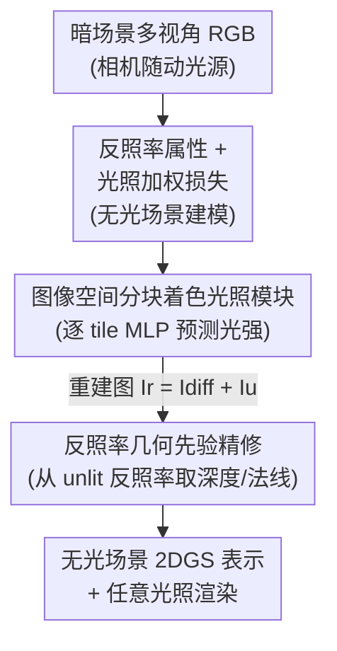

# SunFaded: Illumination-Aware Gaussian Splatting for Dark Scenes with Camera-Mounted Active Lighting

**会议**: CVPR 2026  
**论文**: [CVF Open Access](https://openaccess.thecvf.com/content/CVPR2026/html/Chang_SunFaded_Illumination-Aware_Gaussian_Splatting_for_Dark_Scenes_with_Camera-Mounted_Active_CVPR_2026_paper.html)  
**代码**: 待确认  
**领域**: 3D视觉  
**关键词**: 高斯泼溅, 暗场景重建, 主动照明, 光照解耦, 2DGS

## 一句话总结
针对"相机带着光源一起移动"的暗场景，本文用 2DGS + 反照率属性把光照从内在外观里剥出来，靠"光照加权损失 → 图像空间分块着色 → 反照率几何先验精修"的三阶段训练，在 PSNR/SSIM/LPIPS 全面超过 DarkGS 等方法，且训练更快、渲染更快。

## 研究背景与动机

**领域现状**：高斯泼溅（3DGS / 2DGS）已成为新视角合成的主流表示，渲染实时、质量高。处理"in-the-wild"外观变化（不同时段、天气、ISP 设置）时，主流做法是给每个高斯挂额外的外观特征属性，或学一个随视角变化的颜色变换（如 GS-W、WildGaussians、VastGaussian）。

**现有痛点**：在暗场景里，机器人/手持设备必须靠相机闪光灯或刚性绑在相机上的"随动光源"才能拍到可用图像。此时光照随视角剧烈、且高度局部化地变化——同一个物理点在不同视角下颜色完全不同，但这是光照造成的，不是材质造成的。in-the-wild 那套"全局色调变化"假设彻底失效，逐高斯的外观调整在强局部阴影、投影阴影面前不鲁棒，会产生 floaters、颜色失真、几何崩坏。

**核心矛盾**：这些方法把光照和内在外观**隐式纠缠**在一起，且不强制光源在多视角间一致。唯一显式建模暗场景光照的 DarkGS 又要求**预先标定光源**，每换一次硬件就得重标，实用性差。

**本文目标**：从"相机随动光源"拍的暗图里，重建一个**与光照基本无关的无光（unlit）场景表示**，同时还能在任意光照下高质量渲染——且不需要标定光源。

**切入角度**：作者借用 Retinex 思想，把图像看成"光照 × 反照率"的乘积，并假设光照在空间上平滑变化（log 域里是低频），材质边缘/纹理是中高频。于是可以从单张图里估出一个平滑的光照先验，用它去"压制亮区"来引导无光重建。

**核心 idea**：把 2DGS 里的球谐系数换成**视角无关的反照率属性**，用一个独立的"成像/光照模块"显式建模随动光源；并把光照作用在**渲染后的图像（图像空间分块着色）**上而非逐个高斯上，从而既解耦光照与外观、又大幅省算力。

## 方法详解

### 整体框架
输入是一组在暗环境下、相机带随动光源拍摄的多视角 RGB 图 $\{I_m\}_{m=1}^M$；目标是学一组 2D 高斯面元 $\{G_i\}$，每个高斯用均值 $\mu_i$、协方差 $\Sigma_i$、不透明度 $\alpha_i$ 和**反照率属性 $a$** 参数化（反照率代替了原 2DGS 的球谐颜色）。因为同时优化几何、外观、光照在主动照明下是高度病态的，作者采用**三阶段训练**：先在光照加权约束下恢复无光场景与初始几何（Stage 1）；再用一个图像空间光照模块把光照"贴"回渲染图，显式分离光照与外观（Stage 2）；最后用从无光反照率图导出的几何先验精修高斯几何（Stage 3）。

### 关键设计

**1. 反照率属性 + 光照加权光度损失：把亮区压下去，逼出无光场景**

痛点是：暗图里随动光源造成强局部高光，直接用普通光度损失会让高斯去"拟合光照"而非材质。作者先把球谐颜色换成反照率 $a$，alpha 混合得到反照率图 $A_m$，无光图建模为 $I_m^u = E \odot A_m$（$E\in\mathbb{R}^3$ 是可学的全局环境光）。关键在损失：受 Retinex 启发，对每张图在 log 域用大核高斯滤波 $K_\sigma$ 估一个平滑的光照先验 $L_m = K_\sigma(\log(I_m+\varepsilon))$，再转成逐像素光照权重 $W_m = \exp(-\beta\cdot \mathrm{Norm}(L_m))$，其中 $\beta>0$ 控制亮区被下压的力度。最终损失为 $\mathcal{L}_{\text{unlit}} = \frac{1}{M}\sum_m \lVert W_m \odot (I_m^u - I_m)\rVert_1$。这样越亮的像素权重越小，优化时不会被高光主导，从而把表示推向"底层无光外观"。消融显示 $\beta$ 太小或太大都掉点，$\beta=10$ 最优。

**2. 图像空间分块着色光照模块：光照贴在渲染图上而不是贴在每个高斯上**

之前方法逐高斯调外观，既贵又容易过拟合视角嵌入。本文反其道：在渲染出的反照率图 $A$、深度图 $D$、法线图 $N$ 上做着色。引入一个可学虚拟光源位置 $l\in\mathbb{R}^3$ 和 MLP $M_{\text{light}}$，把图像切成 $16\times16$ 像素的 tile，对每个 tile 中心像素 $(u,v)$ 用相机内参 $K$ 反投得到 3D 位置 $p = K^{-1}[u,v,1]^T \cdot D(u,v)$，算出相对虚拟光源的方向 $\omega = (p-l)/d$、距离 $d=\lVert p-l\rVert$，转成球坐标 $(\theta,\phi)$ 后送进 MLP 预测该 tile 的 RGB 光强 $i = M_{\text{light}}(\gamma([\theta,\phi]),\gamma(d))$。tile 内用简化漫反射模型着色 $I_{\text{diff}}(x) = (A(x)\odot i)\max(0,\hat{n}(x)\cdot \hat{l})$，聚合所有 tile 得稠密光照图，最终重建图 $I_r = I_{\text{diff}} + I^u$，以 $\mathcal{L}_r = \frac{1}{M}\sum_m \lVert I_m^r - I_m\rVert_1$ 监督。分块让全图光照只需算一遍 MLP，省算力，且因为是图像空间预测、不绑定具体视角嵌入，有效避免逐视角过拟合。消融里 tile 越小质量略升但 FPS 暴跌（$4\times4$:95FPS vs $16\times16$:193FPS），$16\times16$ 是质量-速度的平衡点。

**3. 反照率几何先验精修：用"无光反照率图"取深度/法线，再回去修几何**

即便 Stage 1 引入了单目深度先验（用 Depth-Pro 从输入图预测深度 $D^p$、由其梯度得法线 $N^p$，配 $\mathcal{L}_{\text{normal}}=\frac{1}{M}\sum_m[1-N_m^p\cdot N_m]$ 和基于 Pearson 相关的 $\mathcal{L}_{\text{depth}}=\frac{1}{M}\sum_m[1-\rho(D_m^p,D_m)]$），但直接从**带光照的参考图**估出来的深度/法线在光照变化下伪影严重（论文 Fig.3）。作者的做法是：在第三阶段改从**已经解耦出的、光照不变的反照率图**预测深度 $D_{\text{albedo}}$ 和法线 $N_{\text{albedo}}$，作为更可靠的伪标签去精修几何。为避免破坏已优化好的部分，先冻结除不透明度外的全部高斯属性、只优化不透明度（基于不透明度剪枝），5000 次迭代后再放开、联合优化除 $M_{\text{light}}$ 和光源位置 $l$ 外的所有参数。这一步把"光照不变的外观"反哺给"几何监督"，显著提升几何精度。

### 损失函数 / 训练策略
总训练 40K 迭代，单卡 A6000、每个场景约 20 分钟。分段：前 10K 迭代只学无光场景（Stage 1，$\mathcal{L}_{\text{unlit}}$ + 几何先验损失）；10K–20K 固定其他、只更新光源位置 $l$ 和 $M_{\text{light}}$（Stage 2，$\mathcal{L}_r$）；20K–30K 联合优化所有参数；最后阶段只更新高斯不透明度（Stage 3 的冻结-精修）。

## 实验关键数据

### 主实验
在 DarkRobotic 数据集（FLIR 相机 + 随动光源装在足式机器人上，约 32cm 基线，但本文不用这个标定）上，4 个场景平均：

| 数据集 | 指标 | 本文(Ours) | 之前SOTA(GS-W) | DarkGS |
|--------|------|------|----------|--------|
| DarkRobotic 平均 | PSNR↑ | **41.02** | 35.62 | 35.50 |
| DarkRobotic 平均 | SSIM↑ | **0.9739** | 0.9525 | 0.9131 |
| DarkRobotic 平均 | LPIPS↓ | **0.0286** | 0.1577 | 0.0778 |

在自采 DarkPhone 数据集（iPhone 15 + 内置闪光灯）上，DarkGS 因依赖预标定光照参数**直接重建失败**（论文未列其数值），本文在 Bucket/Box/Corner/Cabinet 四场景全面领先，如 Corner 场景 PSNR 39.39 / SSIM 0.9790 / LPIPS 0.0472，明显优于 GS-W（35.68 / 0.9716 / 0.2959）。

效率方面（DarkRobotic）：

| 方法 | 训练时间 | 渲染 FPS |
|------|---------|----------|
| GS-W | ~287min | 51 |
| WildGaussians | ~473min | 106 |
| DarkGS | ~25min | 145 |
| **Ours** | **~22min** | **193** |

本文在质量最高的同时训练最快、FPS 最高。

### 消融实验
| 配置 | 关键指标 | 说明 |
|------|---------|------|
| Ours (full) | PSNR 41.02 / SSIM 0.9739 | 完整模型 |
| Ours* (无几何先验) | PSNR 40.92 / SSIM 0.9711 | 去掉 Stage 3 几何先验，仍超所有对手 |
| $\beta=1$ | PSNR 40.26 | 光照加权力度偏小 |
| $\beta=10$ | PSNR 41.02 | 最优默认 |
| $\beta=50$ | PSNR 37.03 | 力度过大，掉点明显 |
| tile $4\times4$ | PSNR 41.25 / 95 FPS | 质量微升但速度腰斩 |
| tile $16\times16$ | PSNR 41.02 / 193 FPS | 默认平衡点 |
| tile $64\times64$ | PSNR 33.55 / 215 FPS | 过粗，质量崩 |

### 关键发现
- 光照加权损失里的 $\beta$ 是个"金发姑娘"参数：太小压不住高光、太大把有用纹理也压没了，$\beta=10$ 最稳。
- 分块着色的 tile 尺寸直接决定质量-速度 trade-off，$16\times16$ 是甜点；过大的 tile（$\ge32$）会让光照空间分辨率不足而显著掉点。
- 即便去掉几何先验（Ours*），本文仍稳超 DarkGS/GS-W，说明"光照解耦 + 图像空间着色"本身就是主要增益来源，几何先验是锦上添花。

## 亮点与洞察
- **把光照从"逐高斯"搬到"逐图像 tile"**：这是最巧妙的一招——既符合 3DGS 的快速光栅化管线（不破坏渲染流程），又因为不绑视角嵌入而天然抗过拟合，还顺手省了大量算力。
- **用解耦后的反照率图反哺几何监督**：先验深度本来在暗图上不可靠，作者绕了个圈——先解耦出光照不变的外观，再从外观取几何先验，形成"外观帮几何、几何帮外观"的正反馈，思路可迁移到任何"输入退化但中间表示更干净"的重建任务。
- **不需要标定光源**：相比 DarkGS 每换硬件就重标，本文用可学虚拟光源 $l$ + MLP 直接端到端拟合，实用性大增，这对手持/机器人采集是关键卖点。

## 局限与展望
- 作者承认光照模型刻意做得简单：**不显式建模投影阴影**，高光（specular）只粗略处理。
- 光照解耦本质病态：光源位置、环境项、强度都未知，恢复出的各分量并非物理精确，论文也声明"仅供对比、非物理真值"。
- 自己看：评测集中在室内/小范围暗场景，大尺度户外夜景、多光源、动态遮挡下的稳定性未验证；几何先验依赖 Depth-Pro，先验本身的偏差会限制上限。
- 改进方向：引入可微阴影/可见性建模、更丰富的反射模型，以及在复杂光照下稳定联合优化。

## 相关工作与启发
- **vs DarkGS**：同样针对随动光源暗场景，DarkGS 要求预标定光源、按高斯与光源的空间关系定颜色，换硬件就得重标；本文用可学虚拟光源 + 图像空间分块着色，免标定、更通用，PSNR/LPIPS 全面更优。
- **vs GS-W / WildGaussians / VastGaussian（in-the-wild 系）**：它们建模的是全局色调/外观漂移，给高斯挂外观嵌入或学视角相关变换，面对暗场景强局部高光会过拟合、纠缠光照与材质；本文显式用反照率分离光照、在图像空间着色，抗过拟合且更省算力。
- **vs Flash-Splat**：Flash-Splat 需要成对的 flash/no-flash 图来分离反射，对采集要求高；本文只需单一主动照明序列即可。

## 评分
- 新颖性: ⭐⭐⭐⭐ 把光照从逐高斯搬到图像空间分块着色、用反照率反哺几何先验，针对"随动光源暗场景"切口清晰且实用，但底层仍是 2DGS + Retinex 思路的组合。
- 实验充分度: ⭐⭐⭐⭐ 双数据集（含自采 DarkPhone）+ 效率对比 + $\beta$/tile/几何先验三组消融，比较扎实；但只到室内小场景，缺大尺度户外。
- 写作质量: ⭐⭐⭐⭐ 三阶段动机和公式交代清楚，图示到位；个别符号（如 $\Sigma_i\in\mathbb{R}^3$ 描述反照率）排版略含糊，以原文为准。
- 价值: ⭐⭐⭐⭐ 免标定 + 快 + 质量高，对机器人/手持夜间重建有直接实用价值。

<!-- RELATED:START -->

## 相关论文

- [\[CVPR 2026\] LuxRemix: Lighting Decomposition and Remixing for Indoor Scenes](luxremix_lighting_decomposition_and_remixing_for_indoor_scenes.md)
- [\[CVPR 2026\] IR-HGP: Physically-Aware Gaussian Inverse Rendering for High-Illumination Scenes via Generative Priors](ir-hgp_physically-aware_gaussian_inverse_rendering_for_high-illumination_scenes_.md)
- [\[CVPR 2026\] FastEventDGS: Deformable Gaussian Splatting for Fast Dynamic Scenes from a Single Event Camera](fasteventdgs_deformable_gaussian_splatting_for_fast_dynamic_scenes_from_a_single.md)
- [\[CVPR 2026\] 4C4D: 4 Camera 4D Gaussian Splatting](4c4d_4_camera_4d_gaussian_splatting.md)
- [\[CVPR 2026\] VAD-GS: Visibility-Aware Densification for 3D Gaussian Splatting in Dynamic Urban Scenes](vad-gs_visibility-aware_densification_for_3d_gaussian_splatting_in_dynamic_urban.md)

<!-- RELATED:END -->
