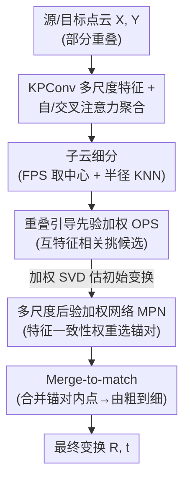

# SuP: Sub-cloud Driven Point Cloud Registration

**会议**: CVPR 2026  
**论文**: [CVF Open Access](https://openaccess.thecvf.com/content/CVPR2026/html/Fung_SuP_Sub-cloud_Driven_Point_Cloud_Registration_CVPR_2026_paper.html)  
**代码**: https://github.com/SheldonFung98/SuP  
**领域**: 3D视觉  
**关键词**: 点云配准, 低重叠, 子云锚对挖掘, 特征一致性, 即插即用

## 一句话总结
针对低重叠点云配准里"非重叠区域几何/语义相似导致错配"的老大难，SuP 把问题重构成"在子云对里挖出高重叠锚对"，用双阶段（先验加权筛候选 + 后验网络验一致性）锚对挖掘 + 合并匹配，在 Color3DMatch/3DLoMatch 上刷新 SOTA，还能当插件涨别的方法的点。

## 研究背景与动机

**领域现状**：点云配准在两个扫描共享大量公共几何（高重叠）时已经能做到高精度。早期 pioneering 工作显式预测逐点重叠权重去定位重叠区（如 Predator）；近年主流（GeoTransformer、PEAL、ColorPCR 等）放弃显式重叠预测，转而用强大的注意力层去**隐式强化全局特征**——注入几何编码、语义特征或颜色信息，学习变换不变特征。

**现有痛点**：当重叠率掉到很低（如低于 30%，C3DLoMatch 甚至 0.1%–0.3%），这些方法纷纷掉点。根本原因在于：即便重叠区特征提得再好，**非重叠区域之间仍然存在几何/语义上的相似性**——一面墙和另一面墙长得一样、一个角落和另一个角落长得一样——这些相似让模型在非重叠区建立大量"看起来合理"的离群对应，把真正的内点对应淹没掉，最终配准失败（论文 Fig.1：ColorPCR/GeoTr. 在低重叠下 RRE 高达 41.3°、RTE 1m 级）。

**核心矛盾**：直接在整对低重叠点云上做稠密全局对应估计，本质上要同时对抗"找到稀少的真内点"和"抵御海量的伪相似离群点"，两者纠缠在一起难解。

**本文目标**：与其硬刚低重叠点云对，不如想办法把它"补"成高重叠对来匹配。

**切入角度**：作者的关键观察是——如果把源/目标点云各自细分成若干更小的**子云（sub-cloud）**再两两配对，总能找到一小撮**局部高重叠的子云对**（称为锚对，anchor pairs）。难点在于：这些高重叠锚对隐藏在所有可能的子云对里，怎么高效、鲁棒地把它们挖出来。

**核心 idea**：把低重叠配准**重构成"高重叠子云锚对挖掘"问题**——先在局部找到真正重叠的子云对，只在这些区域里匹配，从而绕开非重叠区的歧义。

## 方法详解

### 整体框架
输入源点云 $X\in\mathbb{R}^{m\times3}$、目标点云 $Y\in\mathbb{R}^{n\times3}$（部分重叠），目标是估计刚体变换 $T = \{R,t\}$。pipeline 是：先用 KPConv 风格骨干多尺度下采样提局部几何特征，再用注意力（自注意力聚合全局 + 交叉注意力跨云条件化）增强点级特征；核心是 **Dual-phase Sub-cloud Anchor Mining (DSAM)** 模块——把每个点云细分成子云，用"重叠引导的先验加权（OPS）"选出高重叠候选并估初始变换，再用"多尺度后验加权网络（MPN）"按特征一致性挑出锚对；最后用 merge-to-match 把锚对里的内点粗对应合并、由粗到细生成最终对应并估变换。

### 关键设计

**1. 子云细分 + 重叠引导先验加权 OPS：先廉价地把"可能重叠"的子云对挑出来**

痛点是直接枚举所有子云对再逐一精算太贵。作者先在最粗层点 $\hat{X}_4$ 上用最远点采样（FPS）取 $k$ 个分散的中心，每个中心用带半径约束的 KNN 聚成一个子云 $\hat{S}^x_i$，目标云同理。$k$ 个子云两两组合得 $k^2$ 个候选对。对每个子云对，用其条件化特征算高斯相关矩阵 $s_{ij}=\exp(-\lVert \mathrm{norm}(F^c_{xi})-\mathrm{norm}(F^c_{yj})\rVert_2^2)$，再取"双向 top-k 互相关"集合 $M$，先验权重 $w^o_{lm}=\frac{1}{|M|}\sum_{s\in M}s$。背后假设是：两个真正重叠的点倾向于有强互特征相关。最后用 top-$\bar{k}$ 选出初步候选 $C_p$。这一步纯靠特征相关、不需训练，廉价地把大量非重叠子云对剔掉。对每个候选还复用相关矩阵 $S$（配双归一化抑噪）做加权 SVD，估一个初步变换供后续验。实验里 $k=6$ 子云、$\bar{k}=24$ 候选。

**2. 多尺度后验加权网络 MPN + 特征一致性权重：用"对齐后是否一致"鲁棒地验出真锚对**

OPS 只是先验筛选，可能放进假阳性。作者的核心观察是：**真正对齐好的子云对，其重叠点（对齐后距离近的点）会表现出高特征相似度，反之则不会**。MPN 就把这个"对齐后特征一致性"学出来。给定第 $k$ 个候选的初始变换 $\hat{T}_k$，先在粗层取对齐后的重叠点集 $\hat{O}^3_k=\{(\hat{x}^3_i,\hat{y}^3_j): \lVert \hat{x}^3_i-\hat{T}_k(\hat{y}^3_j)\rVert_2<\hat{\tau}\}$，再用跨尺度 1-NN 把它映到更密的尺度 $\hat{O}^2_k$（保证不同尺度点的顺序对应、且高效）。然后用对应多尺度特征算亲和特征 $Z=[F^{O2}_x,F^{O3}_x]\odot[F^{O2}_y,F^{O3}_y]$（Hadamard 积），经轻量多头自注意力 + 残差得上下文化亲和 $\hat{Z}$，再投影 + GELU + 全局最大池化得一致性描述子 $\hat{F}_d$，最终特征一致性权重 $w^c_k=\mathrm{Softmax}(\mathrm{MLP}(\hat{F}_d))$。按 top-k 且过阈值选出锚对。这一步把"几何对齐"和"特征一致"双重验证绑在一起，远比单看特征相似鲁棒。

**3. 对齐感知加权损失 AWL：用"实时对齐误差"当监督，教网络在小误差失败时也给高权重**

MPN 是可学的，需要监督信号。作者不直接拿"是否重叠"做标签，而是用**实时计算的对齐 RMSE 误差**。按真值变换把后验权重 $w^c$ 分成正负组：正组 $\epsilon_p$ 是 RMSE 误差 $E_{\text{rmse}}<\tau_e$ 的锚对，负组类似。损失 $\mathcal{L}_a = -\frac{1}{|\epsilon_p|}\sum_{p\in\epsilon_p}\lambda_a\log w^c_p - \frac{1}{|\epsilon_n|}\sum_{n\in\epsilon_n}\lambda_a\log(1-w^c_n)$，其中对齐感知权重 $\lambda_a = 1-E_{\text{rmse}}$（当 $\tau_e<E_{\text{rmse}}<\tau_e+\delta$）否则为 1。直觉是：$\delta$ 这个边界带让"误差虽超阈值但其实很小"的对齐仍能拿到较高一致性权重 $w^c$，避免把"差一点点就对"的好候选一刀切掉。总损失 $\mathcal{L}=\mathcal{L}_{oc}+\alpha\mathcal{L}_p+\beta\mathcal{L}_a$（$\mathcal{L}_{oc}$ 重叠感知 circle 损失、$\mathcal{L}_p$ 点匹配损失）。

### 一个完整示例
拿一对重叠仅约 14.5% 的 3DLoMatch 样本走一遍：ColorPCR 在非重叠区（相似墙面/角落）建了大量离群对应，内点率仅 9.0%、RMSE 高达 0.499m，配准失败。SuP 先把源/目标各分成 6 个子云、组合出 36 个候选对；OPS 用互特征相关把明显不重叠的剔掉留 24 个候选，每个估个初始变换；MPN 对每个对齐后的候选验特征一致性，挑出 top-8 锚对（这些锚对落在真正重叠的局部区域）；merge-to-match 把这些锚对内的内点粗对应合并、由粗到细细化，最终内点率升到 51.2%、RMSE 降到 0.069m，干净对齐。整个过程的关键在于：错配的离群对应被"子云隔离 + 对齐一致性验证"挡在门外了。

### 损失函数 / 训练策略
PyTorch 实现，端到端用 vanilla SGD。每云分 $k=6$ 子云、OPS 选 $\bar{k}=24$ 候选；MPN 重叠阈值 $\hat{\tau}=0.04$、取 top-8 锚对。学习率 $1\times10^{-4}$，每 epoch 指数衰减 0.95，权重衰减 $1\times10^{-6}$。8 卡 RTX 4070 Ti DataParallel、有效 batch 8，训练 40 epoch、约 10 小时。

## 实验关键数据

### 主实验
数据集为 Color3DMatch (C3DM，重叠 >0.3%) 与 Color3DLoMatch (C3DLM，重叠 0.1%–0.3% 的更难低重叠)。RANSAC 估计、5000 采样点下与 SOTA 对比（数值越高越好）：

| 指标 | 数据集 | 本文(SuP) | 之前SOTA(ColorPCR) | 提升 |
|------|--------|------|----------|------|
| Registration Recall | C3DM | **98.1** | 96.7 | +1.4 |
| Registration Recall | C3DLM | **90.4** | 88.9 | +1.5 |
| Inlier Ratio | C3DM | **91.1** | 87.8 | +3.3 |
| Inlier Ratio | C3DLM | **76.0** | 68.0 | +8.0 |
| Feature Matching Recall | C3DM | **99.7** | 99.5 | +0.2 |

低重叠（C3DLM）的内点率提升最大（+8.0），正说明 SuP 主要补的就是低重叠这块短板。RANSAC-free 的 LGR 估计下同样领先：C3DM RR 97.8%、C3DLM RR 90.2%，几何精度也最好——LGR 下 RRE/RTE 在 C3DM 为 1.374°/0.046m、C3DLM 为 2.493°/0.074m，全面优于 ColorPCR（1.492°/0.048m、2.581°/0.075m）。

### 即插即用 + 消融实验
作为插件接到现有方法后端（LGR 估计），普遍涨点：

| 配置 | C3DM RR | C3DLM RR | 说明 |
|------|---------|----------|------|
| GeoTr. | 91.5 | 74.0 | 原始 |
| SuP + GeoTr. | 92.8 | 76.7 | +1.3 / +2.7 |
| PEAL | 94.3 | 81.2 | 原始 |
| SuP + PEAL | 95.6 | 83.4 | +1.3 / +2.2 |
| ColorPCR | 96.5 | 88.3 | 原始 |
| SuP + ColorPCR | 97.8 | 90.2 | +1.3 / +1.9 |

逐模块消融（RR%，从无任何提出模块的 baseline 起逐步加）：

| 配置 | C3DM RR | C3DLM RR | 说明 |
|------|---------|----------|------|
| baseline | 96.5 | 88.3 | 无任何提出模块 |
| +OPS | 96.6 | 88.6 | 强调重叠区，微涨 |
| +OPS+FCW | 97.0 | 89.1 | 加特征一致性权重 |
| +OPS+FCW+MPN | 97.5 | 89.7 | 多尺度推理，低重叠显著增强 |
| Full (+AWL) | **97.8** | **90.2** | 对齐感知损失再加成 |

### 关键发现
- **MPN（多尺度后验网络）贡献最关键**：它在低重叠（C3DLM）上带来最明显的鲁棒性提升，正是"对齐后验一致性"这一步把假候选挡住的。
- **低重叠收益远大于高重叠**：内点率在 C3DLM 上 +8.0、C3DM 上 +3.3，验证了"子云锚对"思路就是为低重叠设计的。
- **子云细分阈值 $\tau$ 有甜点**：$\tau$ 太小（0.15）粒度细但子云内重叠不足、recall 降；太大则过粗丢局部细节；$\tau=0.35$ 同时拿到最低 RTE（0.046m）和最高 RR（97.8%）。

## 亮点与洞察
- **问题重构本身就是最大亮点**：不去"硬找"低重叠下稀少的真对应，而是把它转成"在子云对里挖高重叠锚对"，从根上绕开非重叠区歧义——这种"把难问题映射成易问题"的思路可迁移到其他被离群点淹没的匹配任务。
- **"对齐后特征一致性"是个很聪明的验证信号**：先验特征相似容易被相似几何骗（墙像墙），但"对齐之后重叠点还一致"几乎只有真锚对满足，等于用几何一致性给特征一致性上了二次保险。
- **可当即插即用后处理**：不改原 backbone，接在 GeoTr./PEAL/ColorPCR 后端就能稳定涨点，工程价值高。

## 局限与展望
- 作者承认：在跨模态差异极端（不同传感器、严重外观失真）时，提取的特征可能有细微不一致，会影响 OPS 的筛选或 MPN 的加权行为；建议用轻量特征归一化/域适应缓解（但作者认为这是扩展而非核心缺陷）。
- 自己看：方法引入子云数 $k$、候选数 $\bar{k}$、阈值 $\hat{\tau}$/$\tau$/$\tau_e$/$\delta$ 等不少超参，且 OPS 的 $k^2$ 子云对枚举 + 每候选估初始变换会带来额外计算；论文未给与 SOTA 的运行时/显存直接对比，效率开销需留意（⚠️ 以原文为准）。
- 评测仅限室内 Color3DMatch/3DLoMatch，户外大尺度、室外稀疏 LiDAR 场景的泛化未验证。

## 相关工作与启发
- **vs Predator（显式重叠预测）**：Predator 逐点预测重叠权重，强依赖底层特征一致性，低重叠下失效；SuP 不预测逐点重叠，而是在子云级别挖锚对并做对齐一致性验证，对低重叠更鲁棒。
- **vs GeoTransformer / PEAL（隐式强化全局特征）**：它们靠注入几何编码/注意力强化特征，但非重叠区相似性仍会造成错配；SuP 直接在空间上隔离重叠局部、只在锚对内匹配，绕开歧义，且能反过来作为插件增强它们。
- **vs ColorPCR（颜色增强特征）**：ColorPCR 引颜色域信息提升特征判别力，仍在低重叠掉点；SuP 在 ColorPCR backbone 之上做子云锚对挖掘，把 C3DLM RR 从 88.3 推到 90.2，是当前最强组合。

## 评分
- 新颖性: ⭐⭐⭐⭐⭐ "低重叠配准 → 高重叠子云锚对挖掘"的问题重构干净有力，OPS+MPN+AWL 三件套围绕这一思路自洽展开。
- 实验充分度: ⭐⭐⭐⭐ 双 benchmark、RANSAC/LGR 双估计、插件实验 + 逐模块/阈值消融较全；但缺运行时/显存对比、缺户外场景。
- 写作质量: ⭐⭐⭐⭐ 动机递进清晰、公式完整、Fig.1/3 案例直观；符号偏多，初读需对照图。
- 价值: ⭐⭐⭐⭐⭐ 既刷 SOTA 又能即插即用涨别的方法，对低重叠这一长期痛点有实打实贡献。

<!-- RELATED:START -->

## 相关论文

- [\[CVPR 2026\] MHopReg: Efficient Hierarchical Multi-Hop Graph Search for Point Cloud Registration](mhopreg_efficient_hierarchical_multi-hop_graph_search_for_point_cloud_registrati.md)
- [\[CVPR 2026\] Generalized-CVO: Fast and Correspondence-Free Local Point Cloud Registration with Second Order Riemannian Optimization](generalized-cvo_fast_and_correspondence-free_local_point_cloud_registration_with.md)
- [\[CVPR 2026\] CMHANet: A Cross-Modal Hybrid Attention Network for Point Cloud Registration](cmhanet_a_cross-modal_hybrid_attention_network_for_point_cloud_registration.md)
- [\[CVPR 2026\] C-GenReg: Training-Free 3D Point Cloud Registration by Multi-View-Consistent Geometry-to-Image Generation with Probabilistic Modalities Fusion](c-genreg_training-free_3d_point_cloud_registration_by_multi-view-consistent_geom.md)
- [\[CVPR 2026\] Hg-I2P: Bridging Modalities for Generalizable Image-to-Point-Cloud Registration via Heterogeneous Graphs](hg-i2p_bridging_modalities_for_generalizable_image-to-point-cloud_registration_v.md)

<!-- RELATED:END -->
