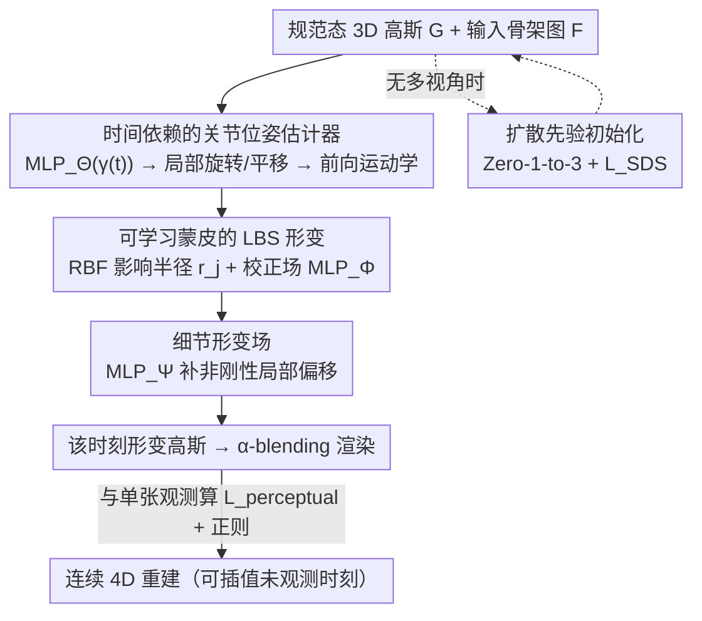

# SV-GS: Sparse View 4D Reconstruction with Skeleton-Driven Gaussian Splatting

**会议**: CVPR 2026  
**论文**: [CVF Open Access](https://openaccess.thecvf.com/content/CVPR2026/html/Chao_SV-GS_Sparse_View_4D_Reconstruction_with_Skeleton-Driven_Gaussian_Splatting_CVPR_2026_paper.html)  
**代码**: 待确认  
**领域**: 3D视觉  
**关键词**: 4D 重建, 高斯泼溅, 骨架驱动形变, 稀疏视角, 线性混合蒙皮

## 一句话总结
SV-GS 用一段「输入骨架图 + 首帧静态重建」驱动的形变场，在每个时刻只有一张任意视角图像（比常规稠密视频少约 20×）的极端稀疏条件下重建关节物体的连续 4D 运动，靠「只让关节位姿随时间变化」实现平滑插值，在合成数据上 PSNR 比 SOTA 高最多 34%。

## 研究背景与动机

**领域现状**：动态物体重建主流靠 NeRF / 3DGS 加一个时间相关的形变场（D-NeRF、4DGS、SC-GS、RigGS 等），普遍假设有稠密的时空覆盖——即每个时刻都有多视角视频，运动线索和跨帧对应关系都很充足。

**现有痛点**：现实里这种稠密观测往往拿不到。监控摄像头对运动目标的采样在时间上很稀疏，多个相机视角差异又很大，目标在两次观测之间可能已经发生大幅运动和自遮挡。此时跨帧外观剧烈变化、时间对应关系几乎无法建立，重建变成高度欠定（ill-posed）问题。作者证明：在这种稀疏设定下，把 4DGS / SK-GS / RigGS 直接拿来用，即使给同样的初始化，它们也会产生发散的形变、破坏物体结构、渲染模糊。

**核心矛盾**：稀疏监督下，无约束的形变场自由度太高、没有足够的图像去约束它，于是「拟合得上观测帧」和「在未观测时刻/视角下结构合理」二者无法兼得。

**本文目标**：在「每个时刻仅一张任意视角图」的稀疏时序观测下，重建关节物体的连续运动，并支持对未观测中间时刻的平滑插值。

**切入角度**：引入额外的结构先验——一个粗糙的骨架图（只给节点 3D 位置和父子连通性）和首帧静态 3D 重建——把形变约束在骨架的运动学结构上，从而大幅压缩解空间。但这套输入并不构成完整的 rigged 模型：骨架可能有噪声，关节位姿、蒙皮权重、点到骨骼的归属全是未知的，仍需在优化中学出来。

**核心 idea**：学一个「骨架驱动的形变场」，把它拆成「随时间变化的粗粒度关节位姿」和「与时间无关的精细形变（蒙皮 + 细节）」两层；**只让关节位姿估计器依赖时间**，这样既能在测试时对未观测时刻做平滑插值，又能保留学到的局部几何细节。

## 方法详解

### 整体框架
SV-GS 的输入是：首帧的规范（canonical）静态 3D 高斯 $\mathcal{G}$、一张带噪声的输入骨架图 $\mathcal{F}$（$J$ 个节点的 3D 位置 + 父子连通性），以及若干稀疏时刻、任意视角的 posed RGB 图像 $\mathcal{I}=\{I_t\}$。输出是一段连续的 4D 重建，可在任意时刻、任意视角渲染。

整条管线是：对每个时刻 $t$，先用一个 MLP 预测各关节的局部位姿（旋转 + 根节点平移），经前向运动学（forward kinematics）传播成各关节的全局变换；再用「学习式线性混合蒙皮（LBS）」把规范态高斯按蒙皮权重搬到该时刻的姿态；接着用一个细节形变场补上骨架解释不了的非刚性形变；最后渲染、与该时刻的单张观测算感知损失。训练时静态高斯 $\mathcal{G}$ 冻结，只优化形变相关参数，并配上运动正则与细节正则抑制单视角监督下的噪声。

### 关键设计

**1. 时间依赖的关节位姿估计器：把"随时间变化"压到最低维度，换取可插值性**

这是 SV-GS 应对稀疏时序的核心取舍。它针对的痛点是：稀疏监督下若让整个稠密形变场都随时间变化，自由度过高，未观测时刻就会抖动、跳变。作者的做法是——整个形变场里**只有关节局部位姿这一层显式依赖时间**。具体用一个 MLP 以位置编码后的时间为输入，预测每个关节 $j$ 的局部旋转四元数 $q^t_j$，以及仅根节点的局部平移 $p^t$：$q^t, p^t = \text{MLP}_\Theta(\gamma(t))$。再用前向运动学按骨架父子层级把局部变换传成全局变换 $\hat{R}^t_j, \hat{T}^t_j = \text{fk}(\mathcal{F}, q^t, p^t)$。因为只有这层关于时间连续，测试时对未观测中间时刻做插值就退化为「对少量关节位姿做插值」，远比插值整个高斯场稳定；而蒙皮校正、细节形变这些与时间无关的部分则被原样保留，几何细节不会因插值而丢失。

**2. 可学习蒙皮的 LBS 形变：在噪声骨架、缺蒙皮信息下也能把高斯绑到骨骼上**

输入骨架是带噪声的，且完全没有蒙皮权重和点到骨骼的归属信息，直接做 LBS 会绑错。作者为每条骨骼 $b_j$（连接关节 $j$ 与其父节点的边，共 $B$ 条）在规范态用一个径向基函数（RBF）核建模其影响范围，并叠加一个位置相关的校正场来吸收骨架噪声。每个高斯中心 $\mu_i$ 被搬到时刻 $t$：$\mu^t_i = \sum_{j=1}^{B} w_{i,j}(\hat{R}^t_j \mu_i + \hat{T}^t_j)$，旋转分量同样按权重加权。蒙皮权重做归一化 $w_{i,j} = \hat{w}_{i,j} / \sum_j \hat{w}_{i,j}$，其中 $\hat{w}_{i,j} = \Delta w_{i,j}\exp(-d_{i,j}^2 / 2r_j^2)$：$d_{i,j}$ 是高斯中心到骨骼 $b_j$ 的距离，$r_j$ 是**每条骨骼可学的影响半径**，$\Delta w_{i,j}=\text{MLP}_\Phi(\gamma(\mu_i))$ 是**位置相关的校正项**。RBF 给出一个由几何邻近性决定的合理初值，校正场 $\text{MLP}_\Phi$ 则在 RBF 不够用时（骨架有噪、形状复杂）去微调权重，二者互补让蒙皮在没有 GT 监督时也稳定。

**3. 细节形变场：补上骨架天然解释不了的非刚性细节**

骨架本质是稀疏的，只能表达粗粒度的关节运动，衣物褶皱、肌肉这类非刚性细节它无能为力。作者额外加一个姿态相关的细节形变场 $\text{MLP}_\Psi$，对每个高斯预测一个小偏移：$\hat{\mu}^t_i = \mu^t_i + \text{MLP}_\Psi(\gamma(\mu_i), R^t)$，输入是规范态高斯中心和当时的关节位姿。它定义在规范帧、只产生小位移，因此和「时间依赖只在关节位姿」的设计兼容——这层本身不显式吃时间，而是通过姿态 $R^t$ 间接随运动变化，既补了细节又不破坏插值稳定性。消融显示去掉它 PSNR 从 27.75 掉到 26.34，是几个组件里掉点最多的。

**4. 运动正则 + 扩散先验放松初始化：稳住单视角监督，并摆脱多视角输入依赖**

单时刻只有一张图，缺监督的区域容易出现不稳定/抖动形变。作者引入两个正则项。**运动正则**直接最小化关节局部位姿对时间的二阶差分（拉普拉斯）：$\mathcal{L}_{motion}=\frac{1}{TJ}\sum_t\sum_j |q^{t-1}_j - 2q^t_j + q^{t+1}_j|$，缓解自遮挡带来的歧义、防止 $\text{MLP}_\Theta$ 产生突变姿态。**细节正则**对细节偏移做 L2 约束 $\mathcal{L}_{detail}=\frac{1}{N}\sum_i \|\text{MLP}_\Psi(\cdot)\|^2_2$，避免它产生大位移。此外作者进一步证明：首帧的多视角初始化可以被一个预训练 2D 扩散模型（Zero-1-to-3）替代——只用单张参考图 $I_r$，对该视角用 $\mathcal{L}_{perceptual}$、对其它未见视角用 SDS 损失 $\mathcal{L}_{SDS}$ 优化静态高斯，之后照常优化形变场（优化中保留 $\mathcal{L}_{SDS}$ 做正则）。这让方法摆脱对多视角采集的依赖，更贴近真实监控/野外场景。

### 损失函数 / 训练策略
形变参数（关节位姿 $\text{MLP}_\Theta$、骨骼半径 $r_j$、蒙皮校正 $\text{MLP}_\Phi$、细节形变 $\text{MLP}_\Psi$）联合优化，静态高斯 $\mathcal{G}$ 冻结。总损失 $\mathcal{L}=\lambda_1\mathcal{L}_{perceptual}+\lambda_2\mathcal{L}_{motion}+\lambda_3\mathcal{L}_{detail}$，其中 $\mathcal{L}_{perceptual}$ 是 L1 + D-SSIM 的组合（沿用 3DGS）。实现上 $\lambda_1{=}2, \lambda_2{=}1, \lambda_3{=}1$，每个场景跑 40,000 步优化，单张 RTX 4080，骨架初值取自 RigGS 的估计。

## 实验关键数据

### 主实验
合成数据上把时间步在 $[0,1]$ 均匀降采样到 0.1 间隔（每序列 11 帧，约为原始的 1/20），所有 baseline 都给同样的首帧多视角初始化以保证公平。

| 数据集 | 指标 | SV-GS (本文) | RigGS | 4DGS | SK-GS |
|--------|------|------|----------|------|------|
| D-NeRF (0.1) | PSNR ↑ | **27.75** | 24.23 | 21.70 | 19.43 |
| D-NeRF (0.1) | SSIM ↑ | **0.950** | 0.897 | 0.925 | 0.921 |
| D-NeRF (0.1) | LPIPS×100 ↓ | **5.79** | 8.28 | 7.85 | 8.8 |
| DG-Mesh (0.1) | PSNR ↑ | **23.76** | 21.80 | 21.28 | 20.56 |
| DG-Mesh (0.05) | PSNR ↑ | **25.81** | 22.81 | 23.40 | 23.32 |

真实数据 ZJU-MoCap 上，baseline 用**完整单目视频**训练，SV-GS 只用 1/10 与 1/5 帧：

| 方法 | 帧量 | SSIM ↑ | PSNR ↑ | LPIPS×100 ↓ |
|------|------|--------|--------|------|
| AP-NeRF | 全量 | 0.919 | 25.62 | 9.34 |
| RigGS | 全量 | 0.975 | 33.54 | 3.27 |
| Ours | 1/5 | 0.944 | 28.83 | 5.89 |
| Ours | 1/10 | 0.934 | 28.13 | 6.53 |

SV-GS 用 5~10× 更少的帧就追平 AP-NeRF、逼近全量视频的 RigGS（RigGS 用全量视频领先属意料之中，关键是 SV-GS 在帧量远少时仍可用）。

### 消融实验
D-NeRF 上逐个去掉关键组件：

| 配置 | SSIM ↑ | PSNR ↑ | LPIPS×100 ↓ | 说明 |
|------|--------|--------|------|------|
| Ours (Full) | 0.950 | 27.75 | 5.79 | 完整模型 |
| w/o $\mathcal{L}_{motion}$ | 0.942 | 27.26 | 6.08 | 量化掉点小，但定性看关节位姿噪声明显增大 |
| w/o $\text{MLP}_\Phi$ | 0.945 | 27.28 | 5.97 | 去掉蒙皮校正场 |
| w/o $\text{MLP}_\Psi$ | 0.931 | 26.34 | 6.51 | 去细节形变场，掉点最多 |

### 关键发现
- **细节形变场 $\text{MLP}_\Psi$ 贡献最大**：去掉后 PSNR 掉 1.41、LPIPS 明显变差，说明骨架驱动只给了粗运动，非刚性细节得靠它补。
- **运动正则的价值在定性而非定量**：去掉后 PSNR 只掉约 0.5，但可视化里关节位姿变得抖动、噪声大——它主要解决的是时间一致性/自遮挡歧义，这类问题不完全反映在逐帧 PSNR 上。
- **观测越稀越能拉开差距**：DG-Mesh 在 0.05（21 帧）时 baseline 的 SSIM 能逼近本文，但在 0.1（11 帧）更稀疏时本文优势扩大，说明 SV-GS 的结构先验正是在极端稀疏区间起作用。
- **扩散先验初始化可行但有已知缺陷**：DAVIS camel 这类野外单目固定相机场景下，配 SDS 能重建出合理运动和可见区纹理，但完全未见区域会出现 LSDS 经典的边缘过饱和伪影。

## 亮点与洞察
- **"把时间依赖局部化到关节位姿"是简单但关键的设计**：它把稀疏时序插值从「插值高维高斯场」降维成「插值少量关节位姿」，这是方法稳定的根因，也解释了为何同样吃骨架输入的 RigGS 在稀疏下却崩——它没有这层结构化的时间-非时间解耦。
- **RBF 初值 + 可学校正场的组合很实用**：在没有 GT 蒙皮权重时，用几何先验给初值、再用 MLP 吸收骨架噪声，这套「先验打底 + 网络微调」范式可迁移到任何缺标注的绑定/蒙皮问题。
- **把扩散先验当初始化而非运动生成器**：相比用视频扩散 + SDS 直接生成运动（那条线只要求运动"看着合理"），SV-GS 坚持从稀疏观测估计**真实**运动，只把 2D 扩散用来补首帧静态几何，定位更清晰。

## 局限与展望
- **作者承认**：扩散初始化在严重自遮挡或罕见视角下会失败（依赖通用预训练模型）；测试时插值对高度复杂运动仍可能吃力。
- **野外未见区伪影**：SDS 带来的过饱和纹理是已知问题，限制了完全无多视角场景的可用性。
- **依赖输入骨架质量**：虽然能吸收噪声，但骨架拓扑若严重错误（节点/连通性给错），LBS 的归纳偏置反而会害事；论文未系统评估骨架拓扑错误的鲁棒性。
- **改进思路**：作者建议引入类别特定先验，或用「以噪声骨架为条件」的预训练先验来联合引导运动估计与重建。

## 相关工作与启发
- **vs RigGS / SK-GS**：它们同样学骨架驱动的 3DGS 形变，但以连续单目视频为输入、从运动中**反推**骨架；SV-GS 把骨架当**输入先验**，并在稀疏图像下工作。作者特意把 RigGS 改成吃同样骨架输入做对比，结果它在稀疏下仍因缺乏时间-非时间解耦而不稳定。
- **vs 4DGS**：4DGS 用 hex-plane 学无结构约束的形变场，稀疏监督下自由度过高直接发散；SV-GS 用骨架 LBS 强约束解空间。
- **vs 视频扩散 + SDS 的生成式 4D**：那类方法只求运动平滑合理、不需匹配 GT；SV-GS 面向的是从稀疏观测恢复**真实**运动的重建问题，二者目标不同。

## 评分
- 新颖性: ⭐⭐⭐⭐ 「时间依赖只放在关节位姿」的解耦设计针对稀疏 4D 重建很对症，但 LBS + 细节场 + 扩散先验各组件均改自已有工作。
- 实验充分度: ⭐⭐⭐⭐ 三个合成 + 真实 + 野外数据，消融清晰；但缺骨架拓扑错误鲁棒性、运动复杂度上限的系统评估。
- 写作质量: ⭐⭐⭐⭐ 问题设定与动机讲得很清楚，图示直观；部分公式排版（缓存）较乱。
- 价值: ⭐⭐⭐⭐ 把动态重建推向"监控级"稀疏观测这一现实场景，骨架先验 + 扩散初始化的组合有实用前景。

<!-- RELATED:START -->

## 相关论文

- [\[CVPR 2026\] DropAnSH-GS: Dropping Anchor and Spherical Harmonics for Sparse-view Gaussian Splatting](dropping_anchor_and_spherical_harmonics_for_sparse-view_gaussian_splatting.md)
- [\[CVPR 2026\] 4D Reconstruction from Sparse Dynamic Cameras](4d_reconstruction_from_sparse_dynamic_cameras.md)
- [\[CVPR 2026\] 4C4D: 4 Camera 4D Gaussian Splatting](4c4d_4_camera_4d_gaussian_splatting.md)
- [\[CVPR 2026\] TWINGS: Thin Plate Splines Warp-aligned Initialization for Sparse-View Gaussian Splatting](twings_thin_plate_splines_warp-aligned_initialization_for_sparse-view_gaussian_s.md)
- [\[CVPR 2026\] BRepGaussian: CAD Reconstruction from Multi-View Images with Gaussian Splatting](brepgaussian_cad_reconstruction_from_multi-view_images_with_gaussian_splatting.md)

<!-- RELATED:END -->
