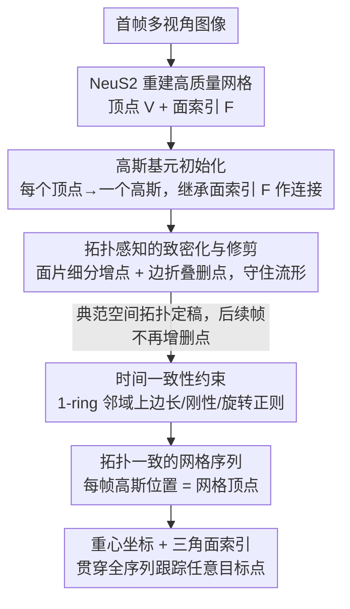

# TagSplat: Topology-Aware Gaussian Splatting for Dynamic Mesh Modeling and Tracking

**会议**: CVPR2026  
**arXiv**: [2512.01329](https://arxiv.org/abs/2512.01329)  
**代码**: [项目页面](https://haza628.github.io/tagSplat/)  
**领域**: 3D视觉  
**关键词**: Gaussian Splatting, 拓扑一致性, 动态网格重建, 3D关键点跟踪, 流形保持

## 一句话总结

提出拓扑感知的高斯泼溅框架 TagSplat，通过显式编码高斯基元间的空间连接关系，在动态场景重建中生成拓扑一致的网格序列，并支持精确的3D关键点跟踪。

## 背景与动机

动画产业的核心工作流基于网格（mesh）：渲染、蒙皮、编辑均需要拓扑一致的三角网格。然而现有的4D重建方法面临关键困难：

- **NeRF系方法**（HyperNeRF、D-NeRF等）采用隐式表示，无法对动态对象施加显式拓扑约束，即使用 Marching Cubes 逐帧提取网格，也无法保证帧间拓扑连续性
- **3DGS系方法**（Dynamic 3DGS、DG-Mesh、Dynamic 2DGS等）虽能高质量渲染，但逐帧独立重建网格导致拓扑不一致，顶点数和连接关系随帧变化，无法用于骨骼绑定和关键点跟踪
- **Topo4D** 将高斯绑定到静态模板网格顶点上，但依赖高质量 Metahuman 模板且仅限头部模型
- **GauSTAR** 用光流引导重建和跟踪，但预处理管线复杂，难以部署

核心瓶颈：现有方法在高斯致密化（densification）和修剪（pruning）过程中会破坏流形结构，导致拓扑随训练迭代变化。

## 核心问题

如何在3D高斯泼溅的训练过程中保持流形拓扑不变，从而生成具有一致顶点数和连接关系的动态网格序列？

## 方法详解

### 整体框架

TagSplat 想解决的事很具体：动画产业的渲染、蒙皮、编辑都建立在拓扑一致的三角网格上，而现有 4D 重建方法逐帧独立提网格，顶点数和连接关系一帧一变，根本没法绑骨骼、连关键点。它的破局思路是把"拓扑"从一开始就焊进高斯表示，并在整个训练里守住它不变。

整个流程的关键是用一个典范空间（取首帧）确立拓扑、再让后续帧只动几何不动拓扑。先从首帧多视角图像用 NeuS2 重建出高质量网格，把每个网格顶点变成一个高斯基元，并直接继承网格的面索引作为高斯之间的连接关系；接着只在典范空间里做"拓扑感知"的致密化与修剪，让增删高斯也不破坏流形；之后训练每一后续帧时，用基于 1-ring 邻域的时间正则化把帧间拓扑钉住。训练完成后，每帧高斯的位置就是对应的网格顶点坐标，又因为所有帧共享同一套拓扑，网格表面上任意一点都能用"重心坐标 + 三角面索引"来表示——这套参数化在所有帧通用，于是任意目标点都能贯穿整个序列被跟踪。

### 关键设计

**1. 高斯基元初始化：让每个高斯一出生就背着网格拓扑**

逐帧独立重建之所以拓扑乱，根子在于高斯本来是一团无连接的散点。TagSplat 的做法是从首帧网格 $\mathcal{M}=(\mathcal{V},\mathcal{F})$ 出发，把每个顶点 $\boldsymbol{v}_i$ 直接实例化成一个高斯基元，并让初始化后的高斯集合 $\mathcal{G}=(\{(\boldsymbol{p}_i,\boldsymbol{R}_i,\boldsymbol{s}_i,\boldsymbol{c}_i,\alpha_i)\}_{i=1}^{|\mathcal{V}|},\mathcal{F})$ 把网格面索引 $\mathcal{F}$ 一并带上——这套 $\mathcal{F}$ 就是后续所有拓扑操作的"骨架"，定义了哪个高斯和哪个高斯相邻。各参数的初始化方式如下：

| 参数 | 初始化策略 |
|------|-----------|
| 位置 $\boldsymbol{p}_i$ | 直接取顶点坐标 $\boldsymbol{v}_i$ |
| 颜色 $\boldsymbol{c}_i$ | 取顶点 RGB 颜色 |
| 不透明度 $\alpha_i$ | 统一设为 1 |
| 旋转 $\boldsymbol{R}_i$ | 基于顶点法线 $\boldsymbol{n}_i$，法线方向作为局部坐标 z 轴 |
| 缩放 $s_{i,x}, s_{i,y}$ | 基于邻域顶点距离，确保覆盖 |
| 缩放 $s_{i,z}$ | 设为极小值 $\epsilon$，使高斯紧贴表面 |

把 $s_{i,z}$ 压到极小、让旋转对齐法线，是为了让高斯像一片片贴在表面上的"鳞片"而不是飘在空中的椭球，这样它的中心才能稳定对应到网格顶点。

**2. 拓扑感知的致密化与修剪：增删高斯，却不撕裂流形**

这是全文最核心的创新。标准 3DGS 增删点只看局部属性（投影梯度、不透明度、尺度），新增/删除的点之间没有任何显式连接，结果是迭代几轮后表面的流形结构被打散，拓扑随训练漂移。TagSplat 把"增"和"删"都改造成在面索引 $\mathcal{F}$ 上做的、保拓扑的操作。

致密化针对投影梯度超阈值的三角面片：在该面片内插入一个新高斯，属性取三个顶点高斯的平均值，并把原三角形细分成 $(\mu_0,\mu_1,\mu_{\text{new}})$、$(\mu_1,\mu_2,\mu_{\text{new}})$、$(\mu_2,\mu_0,\mu_{\text{new}})$ 三个新三角形——这样面索引始终是合法的三角剖分。尺度处理沿用 3DGS 的 clone/split 直觉：若平均尺度 $\bar{s}<\tau_s$（欠重建区）就直接用新点，否则（过重建区）把新点和原顶点的尺度都减半。

修剪则借鉴 Hoppe 的边折叠（edge collapse），为高斯拓扑定制了一个把几何误差和颜色误差一起算进去的折叠代价：

$$C = \omega_g \cdot \|\mathbf{p}_i - \mathbf{p}_j\| + \omega_a \cdot \|\mathbf{c}_i - \mathbf{c}_j\|$$

其中 $\|\mathbf{p}_i-\mathbf{p}_j\|$ 是中心欧氏距离（几何误差），$\|\mathbf{c}_i-\mathbf{c}_j\|$ 是颜色差异（属性误差）。对每个待删高斯，遍历它 1-ring 邻域里所有邻居算 $C$，挑代价最小的那条边折叠合并，相当于在"简化点数"的同时把几何和视觉上的损失压到最低。最关键的约束是：致密化与修剪只在典范空间执行，一旦定稿，后续帧不再增删点、不再改面索引，这正是动态序列拓扑一致的来源。

**3. 时间一致性约束：用 1-ring 邻域把帧间拓扑钉住**

拓扑在典范空间已经定死，但每一后续帧的几何还会随运动变化，若放任不管，相邻高斯之间的相对关系会乱跳。TagSplat 在后续帧的训练里额外加三项都建立在 1-ring 邻域上的时间正则：边长一致性约束相邻高斯间距在相邻帧连续，刚性约束让局部相对位移符合局部刚体假设，旋转一致性让相邻高斯的旋转变化在帧间平滑。三者的权重一项比一项高（4.0 / 4.0 / 20.0），其中旋转一致性权重最大，说明旋转的平滑性对时序连贯最敏感。具体公式见下面「损失函数与训练策略」。

### 损失函数与训练策略

首帧采用高斯渲染与可微网格光栅化（Nvdiffrast）双路监督的联合优化，损失由多项组成：

| 损失项 | 公式 | 作用 | 权重 |
|--------|------|------|------|
| 高斯颜色损失 $\mathcal{L}_c^{gs}$ | $0.8\cdot\|I_{gs}-I_{gt}\|+0.2\cdot\mathcal{L}_{ssim}$ | 对齐渲染图与真值 | 1.0 |
| 网格颜色损失 $\mathcal{L}_c^{mesh}$ | 同上，用 Nvdiffrast 可微渲染 | 提升网格渲染质量 | 1.0 |
| 高斯掩码损失 $\mathcal{L}_m^{gs}$ | $0.8\cdot\|I_m-I_{mask}\|+0.2\cdot\mathcal{L}_{ssim}$ | 确保覆盖目标区域 | 3.0 |
| 网格掩码损失 $\mathcal{L}_m^{mesh}$ | 同上 | 同上 | 3.0 |
| 2D尺度约束 $\mathcal{L}_{2d}$ | $\sum_{i=1}^k s_z^i$ | 约束z轴尺度，使高斯贴合表面 | 1.0 |
| 拉普拉斯平滑 $\mathcal{L}_{lap}$ | $\frac{1}{k}\sum\|\boldsymbol{\delta}_i\|^2$ | 抑制表面尖刺伪影 | 5.0 |
| 法线一致性 $\mathcal{L}_n$ | $\sum\|\boldsymbol{n}_i^{gs}-\boldsymbol{n}_i^{mesh}\|$ | 对齐高斯方向与网格法线 | 1.0 |

其中拉普拉斯平滑项 $\boldsymbol{\delta}_i = \boldsymbol{\mu}_i - \frac{1}{|m|}\sum_{j=1}^m \boldsymbol{\mu}_j$ 衡量每个高斯与其 1-ring 邻域中心的偏差。

后续帧在首帧损失之上叠加上文设计 3 的三项时间正则。边长一致性（权重 4.0）：

$$\mathcal{L}_{len} = \sum_{i=1}^{k_l} \|l_{t,i} - l_{t-1,i}\|$$

刚性约束（权重 4.0），其中 $\Delta\boldsymbol{R}_t = \boldsymbol{R}_{i,t-1}\boldsymbol{R}_{i,t}^{-1}$、权重 $\omega_{i,j}=\exp(-\lambda_w \cdot l_{i,j})$ 让越近的邻居约束越强：

$$\mathcal{L}_{rigid} = \sum_{i=1}^k \sum_{j=1}^m \omega_{i,j} \|(\boldsymbol{\mu}_{j,t-1}-\boldsymbol{\mu}_{i,t-1}) - \Delta\boldsymbol{R}_t(\boldsymbol{\mu}_{j,t}-\boldsymbol{\mu}_{i,t})\|$$

旋转一致性（权重 20.0），其中 $\boldsymbol{q}$ 为归一化四元数、$\otimes$ 为四元数乘法：

$$\mathcal{L}_{rot} = \sum_{i=1}^k \sum_{j=1}^m \omega_{i,j} \|\boldsymbol{q}_{j,t}\otimes\boldsymbol{q}_{j,t-1}^{-1} - \boldsymbol{q}_{i,t}\otimes\boldsymbol{q}_{i,t-1}^{-1}\|$$

## 实验关键数据

### 数据集

- **MIX-TAG**（合成）：3个动态人体（Worker/Dancer/Boxer），42个虚拟相机，1080×1080分辨率，90-130帧，提供GT网格
- **TalkBody4D**（真实）：59台标定RGB相机@20FPS，3000×4000分辨率，使用其中30个视角

### 主实验结果（MIX-TAG 数据集，Boxer 场景）

| 方法 | PSNR↑ | SSIM↑ | CD↓ | Tracking MSE↓ | 拓扑一致? |
|------|-------|-------|-----|---------------|----------|
| Dynamic 3DGS | 30.56 | 0.97 | ✗ | 0.000676 | ✗ |
| DG-Mesh | 22.46 | 0.95 | 1.48 | 0.013502 | ✗ |
| Deformable-GS | 34.38 | 0.98 | ✗ | 0.006631 | ✗ |
| Dynamic 2DGS | 34.27 | 0.97 | 0.47 | 0.009148 | ✗ |
| **TagSplat** | **34.76** | **0.98** | **0.32** | **0.000569** | **✔** |

在 Dancer 场景中，TagSplat 的跟踪 MSE 为 0.000101，比 Dynamic 3DGS（0.000329）低约70%，比 Dynamic 2DGS（0.042436）低约99.8%。

### TalkBody4D 真实数据集（网格渲染质量）

| 方法 | PSNR↑ | SSIM↑ | LPIPS↓ |
|------|-------|-------|--------|
| DG-Mesh | 24.90 | 0.91 | 0.097 |
| Dynamic-2DGS | 23.58 | 0.90 | 0.081 |
| **TagSplat** | **26.82** | **0.93** | **0.077** |

### 消融实验要点

- 移除网格损失：PSNR从32.90降至27.70，CD从0.360升至0.396
- 移除拓扑保持的D&P模块：PSNR降至30.22
- 移除旋转一致性损失：跟踪MSE从0.000368升至0.000372（影响最小，但仍有贡献）
- 移除刚性损失：跟踪MSE升至0.000395（影响显著）

## 亮点

1. **首个在高斯动态更新中保持流形拓扑的方法**，实现真正的拓扑一致网格序列重建
2. **拓扑感知的致密化和修剪策略设计精巧**：致密化通过三角面片细分、修剪通过边折叠代价最小化，既增加几何细节又保持流形结构
3. **跟踪精度大幅领先**：利用拓扑一致性进行3D关键点跟踪，MSE 比次优方法低1-2个数量级
4. **端到端框架**：从多视角视频到拓扑一致网格序列 + 3D跟踪，无需复杂预处理管线
5. 同时使用高斯泼溅渲染和可微网格光栅化（Nvdiffrast）双路监督，提升几何精度

## 局限与展望

1. **无法处理拓扑剧变**：如衣服撕裂、物体分裂等场景，当前框架假设拓扑关系稳定
2. **依赖首帧高质量网格重建**：使用NeuS2初始化，若首帧重建质量差则影响后续所有帧
3. **仅限前景人体**：实验均为单人动态重建，未涉及多人或一般动态场景
4. **致密化和修剪仅在典范空间执行**：后续帧无法自适应调整拓扑精度
5. 实验硬件为 RTX 3090 单卡，未报告训练时间和推理速度

## 与相关工作的对比

- **vs DG-Mesh**：DG-Mesh 将高斯附着在网格上并自动重建动态网格，但逐帧独立拓扑；TagSplat 保持跨帧拓扑一致
- **vs Dynamic 2DGS**：Dynamic 2DGS 用2D高斯提升网格精度但仍逐帧 Poisson 重建；TagSplat 直接从高斯拓扑生成一致网格
- **vs Topo4D**：Topo4D 依赖高质量 Metahuman 模板且仅限头部；TagSplat 通用性更强，从数据驱动的初始网格出发
- **vs Dynamic 3DGS**：Dynamic 3DGS 渲染质量可接受但不输出网格；TagSplat 同时实现高质量渲染和网格重建
- **vs GauSTAR**：GauSTAR 预处理复杂（光流引导）；TagSplat 流程更简洁

## 启发与关联

- 拓扑保持的致密化/修剪策略可推广到其他需要结构化高斯表示的任务（如可编辑3D内容生成）
- 1-ring 邻域的时间正则化思路可用于其他动态重建框架中的时序一致性约束设计
- 边折叠代价函数同时考虑几何和颜色误差的设计，为网格简化提供了新视角
- 重心坐标+固定拓扑的跟踪策略简洁有效，可用于动画制作、运动捕捉后处理等下游任务

## 评分
- 新颖性: ⭐⭐⭐⭐ (拓扑感知的高斯致密化/修剪是清晰的创新点)
- 实验充分度: ⭐⭐⭐⭐ (合成+真实数据集，消融充分，但缺速度对比)
- 写作质量: ⭐⭐⭐⭐ (结构清晰，算法描述详细)
- 价值: ⭐⭐⭐⭐ (弥合3DGS与动画产业网格工作流的重要一步)

<!-- RELATED:START -->

## 相关论文

- [\[CVPR 2026\] ExMesh: EXplicit Mesh Reconstruction with Topology Adaptation](exmesh_explicit_mesh_reconstruction_with_topology_adaptation.md)
- [\[CVPR 2026\] Part$^{2}$GS: Part-aware Modeling of Articulated Objects using 3D Gaussian Splatting](part2gs_part-aware_modeling_of_articulated_objects_using_3d_gaussian_splatting.md)
- [\[CVPR 2026\] RT-Splatting: Joint Reflection-Transmission Modeling with Gaussian Splatting](rt-splatting_joint_reflection-transmission_modeling_with_gaussian_splatting.md)
- [\[ICLR 2026\] Topology-Preserved Auto-regressive Mesh Generation in the Manner of Weaving Silk](../../ICLR2026/3d_vision/topology-preserved_auto-regressive_mesh_generation_in_the_manner_of_weaving_silk.md)
- [\[CVPR 2026\] VAD-GS: Visibility-Aware Densification for 3D Gaussian Splatting in Dynamic Urban Scenes](vad-gs_visibility-aware_densification_for_3d_gaussian_splatting_in_dynamic_urban.md)

<!-- RELATED:END -->
