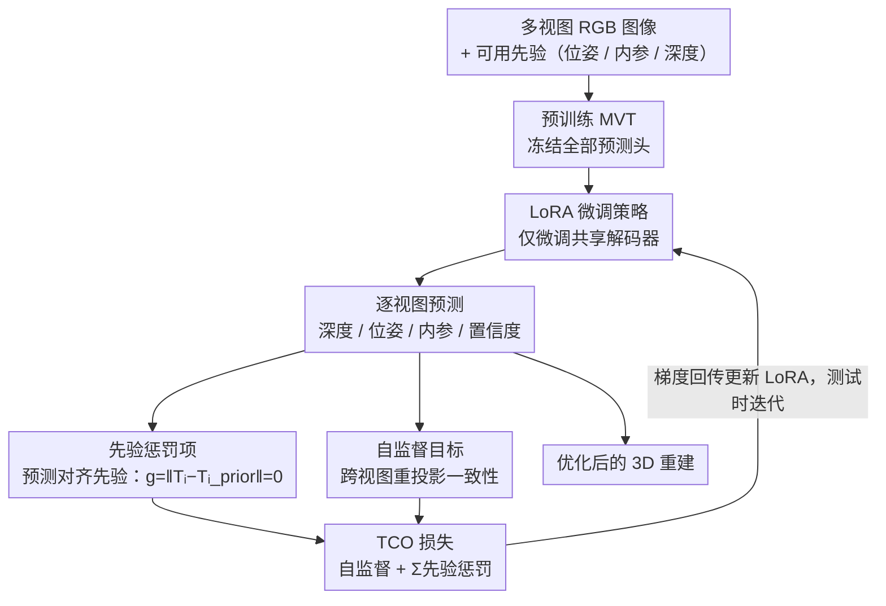

# Learning 3D Reconstruction with Priors in Test Time

**会议**: CVPR 2026  
**arXiv**: [2604.03878](https://arxiv.org/abs/2604.03878)  
**代码**: [https://github.com/cvlab-stonybrook/TCO](https://github.com/cvlab-stonybrook/TCO)  
**领域**: 三维重建  
**关键词**: test-time optimization, 3D reconstruction, multiview transformer, camera pose, LoRA

## 一句话总结

提出测试时约束优化（TCO）框架，无需重训练或修改预训练多视图 Transformer 架构，通过在推理时将先验（相机位姿、内参、深度）作为预测约束进行优化，大幅提升 3D 重建精度。

## 研究背景与动机

前馈多视图 Transformer（MVTs）如 DUSt3R、VGGT、π³ 等可以一次前向传播就从多张 RGB 图像输出深度图、相机位姿和内参。但这些模型本身只接受 RGB 输入，当有额外先验信息（如从 COLMAP 获得的相机位姿、从 LiDAR 获得的深度图）时无法利用。

现有方法（如 Pow3R、MapAnything）通过修改架构将先验作为额外输入，但这些方法绑定特定架构和先验类型，每次更换骨干或先验都需重训练，既不灵活又计算昂贵。

TCO 的核心洞察：与其将先验作为输入喂入网络，不如将其视为对输出的约束，在推理时优化网络来满足这些约束。

## 方法详解

### 整体框架

前馈多视图 Transformer（如 DUSt3R、VGGT、π³）一次前向就能从多张 RGB 输出深度、位姿和内参，但它们只吃 RGB，手里有 COLMAP 位姿、LiDAR 深度这类先验也用不上。TCO 的转念在于：与其改架构把先验当输入喂进去（Pow3R、MapAnything 那样，换骨干或换先验都得重训），不如把先验看成对输出的约束，在测试时优化网络去满足它。具体是冻住预训练 MVT，只用 LoRA 微调共享解码器，目标函数由“自监督兼容性 + 先验惩罚”两部分组成；测试时反复前向、算损失、把梯度回传到 LoRA 参数迭代更新，最终输出满足先验又自洽的 3D 重建。

### 关键设计

**1. 先验惩罚项：把先验写成对输出的约束而非输入**

传统做法把先验拼进网络输入，于是先验类型和骨干架构被死死绑定。TCO 反过来，把每种可用先验直接转成对应预测模态的输出约束：相机位姿先验写成 $g = \|T_i - T_i^{prior}\| = 0$，深度先验同理。约束打在 MVT 的输出端，所以换骨干、加新先验都不用动网络结构，也不用重训。

**2. 自监督目标（预测兼容性）：防止优化只迁就先验、不管整体质量**

只用先验惩罚去优化，网络会过拟合那几条先验、把其余 3D 结构搞坏。自监督目标补上这块约束：用光度或几何损失衡量多视图预测之间的兼容性——把一个视图从其他视图渲染过来，比对它与该视图自身的一致性。这逼着优化在满足先验的同时仍保持整体 3D 重建的连贯。

**3. LoRA 微调策略：借共享解码器实现模态间协同**

微调全部参数既慢又容易不稳定。TCO 冻结所有预测头，只用从零初始化的 LoRA 微调共享解码器，参数少、收敛快。更关键的是各模态预测共享这一层表示，于是某个模态的先验能顺着共享表示改善其他模态的预测——位姿先验也能间接帮到深度。

### 损失函数 / 训练策略

测试时优化损失 = 自监督兼容性目标 + Σ 先验惩罚项。自监督目标可取光度损失（重投影一致性）或几何损失（点云对齐）。LoRA 参数从零初始化，快速收敛。

## 实验关键数据

### 主实验

| 数据集 | 指标 | 本文 (TCO) | 基础模型 | 提升 |
|--------|------|----------|---------|------|
| ETH3D | 点图距离误差 | 减少 >50% | image-only MVT | 显著 |
| 7-Scenes | 点图距离误差 | 减少 >50% | image-only MVT | 显著 |
| NRGBD | 点图距离误差 | 减少 >50% | image-only MVT | 显著 |

### 消融实验

| 配置 | 关键指标 | 说明 |
|------|---------|------|
| 仅先验惩罚（无自监督） | 效果差 | 容易过拟合先验 |
| 仅自监督（无先验） | 有改善 | 但不如组合使用 |
| 微调全部参数 | 不稳定 | LoRA 更优 |

### 关键发现

- TCO 不仅大幅优于基础 image-only 模型，还超越了需要重训练的先验感知前馈方法（Pow3R、MapAnything）
- 即使只有部分先验可用，TCO 也能有效利用
- 自监督目标是防止过拟合的关键

## 亮点与洞察

- 即插即用设计：TCO 可以应用于任何预训练 MVT 而无需修改架构或重训练
- "先验不是输入而是约束"的视角转换非常优雅
- LoRA 微调共享解码器的策略巧妙利用了模态间协同
- 与测试时计算缩放（test-time compute scaling）的大趋势吻合

## 局限与展望

- 测试时优化带来额外推理时间开销
- 先验的质量直接影响优化效果，噪声先验可能反而有害
- 当前主要在室内场景验证，大规模户外场景的适用性有待探索

## 相关工作与启发

- 与 Test3R、TTT3R 等测试时微调方法精神一致，但 TCO 更通用
- 对其他需要融合多模态先验的 3D 任务有启发

## 评分

- 新颖性：⭐⭐⭐⭐ — 先验作为约束而非输入的思路新颖
- 技术深度：⭐⭐⭐⭐ — 自监督+先验约束+LoRA 组合设计合理
- 实验充分度：⭐⭐⭐⭐ — 多数据集多先验类型验证
- 实用价值：⭐⭐⭐⭐ — 即插即用，通用性强

<!-- RELATED:START -->

## 相关论文

- [\[CVPR 2026\] tttLRM: Test-Time Training for Long Context and Autoregressive 3D Reconstruction](tttlrm_test-time_training_for_long_context_and_autoregressive_3d_reconstruction.md)
- [\[CVPR 2026\] ZipMap: Linear-Time Stateful 3D Reconstruction via Test-Time Training](zipmap_linear-time_stateful_3d_reconstruction_via_test-time_training.md)
- [\[CVPR 2026\] Low-Rank Test-Time Training for Pre-Trained Point Cloud Models](low-rank_test-time_training_for_pre-trained_point_cloud_models.md)
- [\[CVPR 2026\] Rethinking Dense Optical Flow without Test-Time Scaling](rethinking_dense_optical_flow_without_test-time_scaling.md)
- [\[CVPR 2026\] Scene Reconstruction as Mapping Priors for 3D Detection](scene_reconstruction_as_mapping_priors_for_3d_detection.md)

<!-- RELATED:END -->
