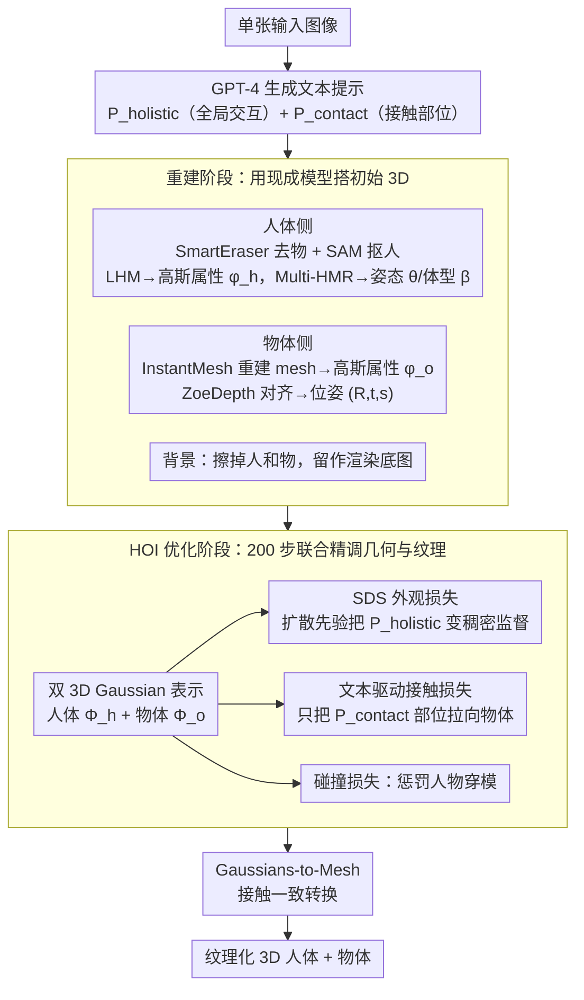

# TeHOR: Text-Guided 3D Human and Object Reconstruction with Textures

## 基本信息

- **会议**: CVPR 2026
- **arXiv**: [2602.19679](https://arxiv.org/abs/2602.19679)
- **代码**: [项目主页](https://hygenie1228.github.io/TeHOR/)
- **领域**: 3D视觉 / 人体-物体重建
- **关键词**: 3D Human-Object Reconstruction, Text-Guided Optimization, Score Distillation Sampling, 3D Gaussian Splatting, Human-Object Interaction

## 一句话总结

TeHOR 利用文本描述作为语义引导，通过预训练扩散模型的 Score Distillation Sampling 联合优化 3D 人体和物体的几何与纹理，突破了传统方法对接触信息的依赖，实现了包括非接触交互在内的准确且语义一致的 3D 重建。

## 研究背景与动机

从单张图像联合重建 3D 人体和物体是人体行为理解的关键任务，在机器人、AR/VR 和数字内容创作中有广泛应用。现有方法存在两个根本性局限：

**过度依赖接触信息**：现有方法（如 PHOSA、CONTHO、InteractVLM）主要利用人体-物体接触区域作为交互推理的核心线索，通过迭代拟合强制接触区域的几何邻近。然而，现实世界中大量交互是非接触的（如注视、指向物体），接触信息完全失效。即使存在接触，错误的接触预测也会直接导致重建失败。

**忽视全局外观上下文**：现有方法的拟合过程主要靠局部几何近邻驱动，忽略了人体和物体的外观线索（颜色、阴影等）所提供的全局交互上下文，导致全局不合理的结果（如物体朝向错误、人体视线不对齐）。

## 方法详解

### 整体框架

TeHOR 要从单张图像里把人和物体连同纹理一起立起来，难点是现有方法全靠"接触"推交互，一旦碰上注视、指向这类非接触动作就失灵。它的破局点是把"文本语义"接进优化回路：先用现成模型搭好人、物、背景的初始 3D，再用一段文字描述驱动多视角优化，让结果在没有接触线索时也能摆对朝向与姿态。

整个流程分两段。**重建阶段**负责初始化：GPT-4 从输入图像读出两种文本提示——$P_{\text{holistic}}$（全局交互描述，如"一个人在草地上骑自行车"）和 $P_{\text{contact}}$（接触的身体部位，如"右手, 左手"）；人体侧用 SmartEraser 去物体、SAM 抠人，再由 LHM 生成初始 3D Gaussian 属性 $\phi_h$（40,000 个锚点均匀采样在 SMPL-X 表面），Multi-HMR 估计姿态 $\theta$ 与体型 $\beta$；物体侧同样分离后用 InstantMesh（Zero123++ 生 6 视角 → 三平面网络）重建 mesh，转成 Gaussian 属性 $\phi_o$，ZoeDepth 深度对齐估出位姿 $(R, t, s)$；背景则擦掉人和物后单独留作渲染底图。**HOI 优化阶段**再用 200 步迭代联合精调几何与纹理，下面的关键设计都发生在这一阶段。

### 关键设计

**1. 双 3D Gaussian 表示：让外观线索也能参与优化**

人体和物体分别用 3D Gaussian 集合 $\Phi_h$、$\Phi_o$ 表示，而不是传统 mesh。人体 Gaussians 由属性 $\phi_h$ + 姿态 $\theta$ + 体型 $\beta$ 参数化，每个高斯锚在标准姿态的 SMPL-X 表面点上、通过 LBS 驱动（手脸沿用原始蒙皮权重，其余取邻近顶点平均）；物体 Gaussians 由 $\phi_o$ + 旋转 $R$ + 平移 $t$ + 缩放 $s$ 参数化，标准空间定义后仿射变换到位。这一阶段要靠"外观"做监督，选高斯而非 mesh 是因为高斯能建模更高保真的视觉细节、给外观损失提供更丰富的梯度信号，而且拓扑无关的灵活结构让人-物空间关系更好优化。

**2. SDS 外观损失：用扩散先验把"文字描述"变成稠密空间监督**

这是全文核心。接触信息只能管"贴着的地方"，碰上非接触交互就没辙；TeHOR 改用一段全局文字 $P_{\text{holistic}}$ 当监督，借 Score Distillation Sampling 把预训练 StableDiffusion-v2.1 的视觉先验灌进优化：

$$\nabla_{\Phi}\mathcal{L}_{\text{appr}} = \mathbb{E}\left[w_t\left(\hat{\epsilon}_t(\mathbf{x}_t; P_{\text{holistic}}) - \epsilon_t\right)\frac{\partial \mathbf{x}_t}{\partial \Phi}\right]$$

其中 $t$ 为噪声级别、$\mathbf{x}_t$ 为加噪后的渲染图、$w_t$ 为权重，损失逼着渲染结果向"文本条件下合理的外观分布"靠。实现上在球面坐标 $(r, \upsilon, \psi)$ 均匀采视角（全身 $r \in [1.0, 2.5]$、$\upsilon \in [-30°, 30°]$、$\psi \in [-180°, 180°]$，上半身放大视角以 SMPL-X 脊柱为球心 $r \in [0.7, 1.5]$），CFG 尺度 15.0、噪声时间步在 $[0.02, 0.98]$ 随机采、梯度裁剪范数 1.0。它有效有两点：一是文本能推理接飞盘、注视这种接触线索给不出的交互；二是 SDS 给的是像素级稠密梯度，远比 CLIP 那种单向量全局编码能约束细粒度空间关系（消融里 CLIP 替代使物体 CD 从 16.701 退化到 18.504）。

**3. 文本驱动接触损失：只在该贴的地方贴**

为了不丢掉接触这条有用线索、又不被错误接触带偏，TeHOR 用 $P_{\text{contact}}$ 圈出该接触的身体部位对应高斯中心集 $V_{h,c}$，只把它们拉向最近物体点：

$$\mathcal{L}_{\text{contact}} = \frac{1}{|V_{h,c}|}\sum_{v_h \in V_{h,c}} d(v_h, V_o) \cdot \mathbb{1}[d(v_h, V_o) < \tau]$$

阈值 $\tau = 10$ cm，指示函数保证只对已经靠近（< 阈值）的点算梯度，避免把远处无关点硬拽过来——既维持局部物理合理，又不会像旧方法那样让一次错误接触预测毁掉整个重建。

**4. 碰撞损失：禁止人和物穿模**

外观和接触约束都不防穿模，所以再加一项碰撞惩罚：计算人体顶点落在物体 mesh 内部的比例并惩罚，把 interpenetration 压下去，保证结果物理上站得住。

**5. Gaussians-to-Mesh 接触一致转换：为了和 mesh 方法公平比**

优化完要把高斯转回 mesh 做评估，但高斯会偏离底层 base mesh，接触区域容易对不齐。解决办法是找出人-物高斯距离 < 5 cm 的接触区域，取对应 mesh 顶点并把它们之间的间距最小化到零，得到接触一致的 mesh 输出。

### 损失函数 / 训练策略

总损失是四项之和：

$$\mathcal{L} = \mathcal{L}_{\text{recon}} + \mathcal{L}_{\text{appr}} + \mathcal{L}_{\text{contact}} + \mathcal{L}_{\text{collision}}$$

其中 $\mathcal{L}_{\text{recon}}$ 是前视角渲染与输入图像的 MSE（含 RGB 重建误差 + 人/物轮廓与分割 mask 误差），保证输入视角下与原图一致；后三项即上面的外观、接触、碰撞损失。HOI 优化阶段共迭代 200 步。

## 实验

### 数据集与指标

- **Open3DHOI**：开放词汇野外 3D HOI 数据集，2.5K+ 图像，133 类物体（仅评估用）
- **BEHAVE**：室内 3D HOI 数据集，8 名受试者 × 20 个物体，测试集 4.5K 图像
- **指标**：$\text{CD}_{\text{human}}$ / $\text{CD}_{\text{object}}$（Chamfer 距离, cm↓）、Contact（F1↑）、Collision（穿模率↓）

### 主实验：与 SOTA 比较（Tab. 4）

| 方法 | CD↓_human (O3D) | CD↓_obj (O3D) | Contact↑ (O3D) | Coll.↓ (O3D) | CD↓_human (BH) | CD↓_obj (BH) | Contact↑ (BH) |
|------|:---:|:---:|:---:|:---:|:---:|:---:|:---:|
| PHOSA | 5.342 | 49.180 | 0.243 | 0.044 | 5.758 | 46.003 | 0.257 |
| LEMON+PICO | 5.948 | 25.889 | 0.335 | 0.078 | 6.159 | 22.585 | 0.082 |
| InteractVLM | 5.252 | 24.238 | 0.392 | 0.054 | 5.770 | 19.197 | 0.379 |
| HOI-Gaussian | 5.111 | 19.363 | 0.348 | 0.070 | 5.748 | 21.774 | 0.371 |
| **TeHOR** | **4.941** | **16.701** | **0.412** | **0.047** | **5.615** | **17.339** | **0.412** |

全面超越所有 SOTA。Open3DHOI 上物体 CD 从 19.363→16.701（↓13.7%），Contact F1 从 0.392→0.412。

### 非接触场景评估（Tab. 5）

| 方法 | CD↓_human | CD↓_object | Collision↓ |
|------|:---:|:---:|:---:|
| PHOSA | 5.401 | 65.537 | 0.028 |
| InteractVLM | 5.390 | 46.819 | 0.011 |
| HOI-Gaussian | 5.244 | 25.374 | 0.037 |
| **TeHOR** | **4.958** | **17.546** | **0.005** |

非接触场景优势更显著，物体 CD 从 25.374→17.546（↓30.8%），验证文本语义引导的关键作用。

### 消融实验

**文本引导优化效果（Tab. 1）**：

| 设置 | CD↓_human | CD↓_obj | Contact↑ | Collision↓ |
|------|:---:|:---:|:---:|:---:|
| 优化前 | 5.252 | 31.268 | 0.305 | 0.040 |
| 优化（无文本） | 5.028 | 20.348 | 0.374 | 0.052 |
| **优化（完整）** | **4.941** | **16.701** | **0.412** | **0.047** |

**损失函数配置消融（Tab. 2）**：

| $\mathcal{L}_{\text{appr}}$ | $\mathcal{L}_{\text{contact}}$ | CD↓_obj | Contact↑ |
|:---:|:---:|:---:|:---:|
| ✗ | ✓ | 22.094 | 0.330 |
| ✓ | ✗ | 19.849 | 0.374 |
| CLIP 替代 | ✓ | 18.504 | 0.366 |
| **✓ (SDS)** | **✓** | **16.701** | **0.412** |

关键发现：SDS 外观损失显著优于 CLIP loss——CLIP 编码为单一 1D 向量无法建模密集空间关系，SDS 提供像素级密集梯度。

**渲染组件消融（Tab. 3）**：3D Gaussians→Mesh 使 CD_obj 恶化至 25.162；去除 2D 背景使 CD_obj 恶化至 18.196，说明完整场景上下文对扩散先验至关重要。

## 亮点

- **突破接触依赖范式**：首次将文本描述引入 3D 人体-物体联合重建，支持非接触交互推理（注视、指向、接飞盘等）
- **SDS 外观优化**：利用预训练扩散模型视觉先验，通过多视角 SDS 实现细粒度语义对齐，消融验证远优于 CLIP
- **首个纹理联合重建**：据称首个同时重建人体和物体完整 3D 纹理的框架，可直接生成沉浸式数字资产
- **实验设计完善**：一般场景与非接触场景分别评估，5 组消融实验充分验证各组件有效性

## 局限性

- 依赖 GPT-4、StableDiffusion、LHM、InstantMesh 等多个外部模型，依赖链长且推理成本高
- 每样本约 134 秒（单张 RTX 8000），200 步优化使实时应用困难
- 外观损失主要提供全局引导，对局部细节（小配件、微妙表面变形）监督不足
- 缺乏纹理质量的量化评估指标（无同时标注几何+纹理的 3D HOI 数据集）

## 评分

⭐⭐⭐⭐ — 清晰识别现有方法的根本局限（接触依赖+忽视全局外观），提出的文本引导 SDS 优化方案新颖且有效。在一般和非接触场景均全面 SOTA，消融实验设计系统完善。主要扣分在优化效率和对多个外部模型的长依赖链。

<!-- RELATED:START -->

## 相关论文

- [\[ICCV 2025\] StrandHead: Text to Hair-Disentangled 3D Head Avatars Using Human-Centric Priors](../../ICCV2025/3d_vision/strandhead_text_to_hair-disentangled_3d_head_avatars_using_human-centric_priors.md)
- [\[ICCV 2025\] PlaceIt3D: Language-Guided Object Placement in Real 3D Scenes](../../ICCV2025/3d_vision/placeit3d_language-guided_object_placement_in_real_3d_scenes.md)
- [\[CVPR 2025\] Multi-view Reconstruction via SfM-guided Monocular Depth Estimation](../../CVPR2025/3d_vision/multi-view_reconstruction_via_sfm-guided_monocular_depth_estimation.md)
- [\[ICCV 2025\] MemoryTalker: Personalized Speech-Driven 3D Facial Animation via Audio-Guided Stylization](../../ICCV2025/3d_vision/memorytalker_personalized_speech-driven_3d_facial_animation_via_audio-guided_sty.md)
- [\[ICCV 2025\] RapVerse: Coherent Vocals and Whole-Body Motion Generation from Text](../../ICCV2025/3d_vision/rapverse_coherent_vocals_and_whole-body_motion_generation_from_text.md)

<!-- RELATED:END -->
