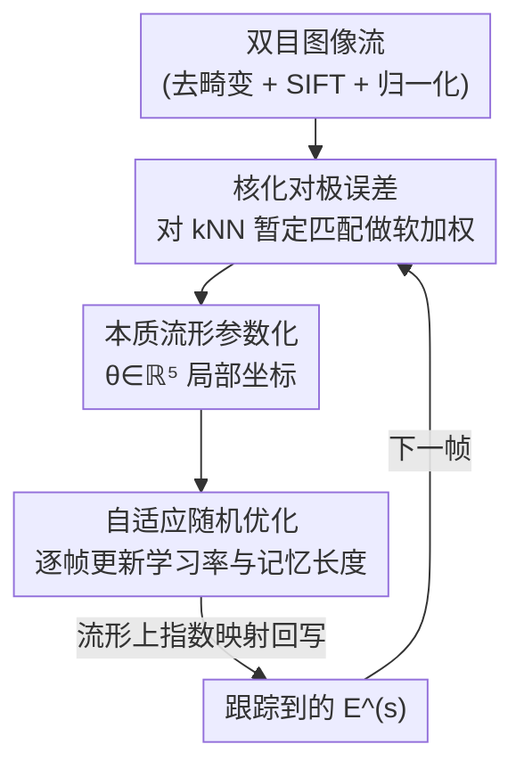

# TESO: Online Tracking of Essential Matrix by Stochastic Optimization

**会议**: CVPR 2026  
**arXiv**: [2604.19420](https://arxiv.org/abs/2604.19420)  
**代码**: https://github.com/moravecj/teso （有）  
**领域**: 3D视觉 / 多视图几何 / 在线标定  
**关键词**: 本质矩阵、在线立体标定、核相关、随机优化、对极几何

## 一句话总结
TESO 把双目相机的在线外参标定问题，建模成"在本质矩阵流形上对一个鲁棒核化对极误差做自适应随机优化"，无需任何数据训练、只有两个超参，就能以 0.12° 级精度实时跟踪相机标定漂移，且单帧优化精度可媲美基于神经网络的方法。

## 研究背景与动机
**领域现状**：自动驾驶/机器人这类多传感器系统高度依赖相机间精确的几何配准（相对位姿）。当前主流做法是离线标定——在受控的标定室里把外参一次标定好。

**现有痛点**：部署后的系统会因机械振动、运动部件、温度波动、材料磨损导致传感器相对位姿缓慢漂移（drift）或突变（shift），而要重标定就得把车开回专门设施，停机且成本高。因此需要**在线**跟踪标定参数随时间的演化。但在线场景要求低延迟，只能用很小的数据批做参数更新，这就让优化对"序列里信息量忽高忽低"非常敏感——有的场景（高速公路、重复纹理、远景）几乎提供不了有效约束。

**核心矛盾**：在线标定跟踪的本质难点是**在小批量、信息量波动的数据上同时保证快速收敛又稳定收敛**。已有方法的思路几乎都集中在"选更鲁棒的特征提取器"或"选更鲁棒的估计器（RANSAC/学习模型）"上，用复杂的外点剔除来对抗噪声匹配。

**本文目标**：构造一个低开销、对场景变化鲁棒、可实时跟踪非平稳标定参数的方法，把它落到双目对极几何（本质矩阵）上。

**切入角度**：作者换了一个视角——不去剔除外点，而是**让损失函数本身天然鲁棒**。用核相关（kernel correlation）对暂定匹配做软加权，外点自动被压低权重；优化直接在本质矩阵流形上进行，保留对极几何的几何不变量。

**核心 idea**：用"核化对极误差 + 本质流形上的自适应随机优化"代替"鲁棒估计器 + 外点剔除 + 学习模型"，把在线标定跟踪做成一个轻量、免训练、几乎无参的优化过程。

## 方法详解

### 整体框架
TESO 要解决的是：给定一对双目图像流，实时输出随时间演化的本质矩阵 $\mathbf{E}$（编码两相机的相对旋转 $\mathbf{R}$ 与平移方向 $\mathbf{t}$，共 5 个自由度）。整条流水线是：用 OpenCV 多项式模型去畸变 → SIFT 检测关键点并提取描述子 → 用各自内参 $\mathbf{K}_j$ 把关键点归一化到相机坐标系 → 用**核化对极误差**对左右图所有暂定匹配（kNN）算一个鲁棒损失 → 用**带自适应学习率的随机二阶优化**在本质流形上更新 $\mathbf{E}$，逐帧跟踪。整个过程从离线标定室得到的参考本质矩阵 $\mathbf{E}^{(0)}=\mathbf{E}^{\text{ref}}$ 出发，之后只靠数据流自适应地修正。

两个真正的贡献节点是中间的「核化对极误差」和「本质流形上的自适应随机优化」；去畸变、SIFT、归一化都是通用预处理脚手架——论文甚至明确说关键点检测器的选择不是关键（核相关已经把外点容忍掉了）。

### 关键设计

**1. 核化对极误差：把外点容忍直接写进损失，免掉显式外点剔除**

暂定匹配里有大量外点，传统做法靠 RANSAC 等鲁棒估计器把它们挑掉。TESO 反过来——用核相关让损失函数对外点天生不敏感。对极约束本身是 $\mathbf{y}^\top \mathbf{E}\mathbf{x}=0$（归一化坐标下，对应点应落在对方的对极线上）。TESO 不直接最小化残差，而是把残差套进一个高斯核再求和取负（越小越好）：

$$\mathcal{L}(\theta\,|\,\mathbf{X},\mathbf{Y})=-\sum_{\mathbf{x}\in\mathbf{X}}\sum_{\mathbf{y}\in\text{NN}^1(\mathbf{x})}\exp\!\left[-\frac{(\mathbf{y}^\top\mathbf{E}(\theta)\mathbf{x})^2}{2\sigma^2}\right]-\sum_{\mathbf{y}\in\mathbf{Y}}\sum_{\mathbf{x}\in\text{NN}^0(\mathbf{y})}\exp\!\left[-\frac{(\mathbf{y}^\top\mathbf{E}(\theta)\mathbf{x})^2}{2\sigma^2}\right]$$

这里不做硬匹配，而是对每个关键点在描述子空间取 $k=5$ 个最近邻（$\text{NN}^1,\text{NN}^0$ 双向），把所有这些候选对都喂进核里。一个外点对极残差大，$\exp[-\cdot]$ 趋近 0，对损失几乎没贡献；一个内点残差小、核值接近 1，主导优化。超参 $\sigma$ 控制吸引盆的宽度与最终精度，作者直接把它设成相机的像素角分辨率（垂直 FoV/宽度，CARLA/MAN 用 0.001、KITTI 用 0.00075）。这样设计的直接好处有两个：关键点检测器不再关键（简单快的检测器就够用），且彻底不需要显式外点剔除或学习式匹配器。

**2. 本质矩阵流形的五参数局部化：让优化在几何正确的空间里进行**

本质矩阵有 5 个可观自由度（基线尺度不影响约束 $\mathbf{y}^\top\mathbf{E}\mathbf{x}=0$，所以平移只到方向）。要在迭代里始终保持 $\mathbf{E}$ 合法（而不是优化到一个不满足 $\mathbf{E}=[\mathbf{t}]_\times\mathbf{R}$ 的矩阵），TESO 采用 [18] 的本质流形参数化：把 $\mathbf{E}$ 做 SVD 分解 $\mathbf{E}=\mathbf{U}\Sigma_0\mathbf{V}^\top$（归一化 $\Sigma_0=\mathrm{diag}(1,1,0)$），再用 5 个局部参数 $\theta\in\mathbb{R}^5$ 通过左右两个反对称矩阵的矩阵指数 $\mathbf{E}(\theta)=\mathbf{U}\,\text{expm}[\Omega_1(\theta)]\,\Sigma_0\,\text{expm}[-\Omega_2(\theta)]\,\mathbf{V}^\top$ 局部参数化。更新时只更新 $\mathbf{U},\mathbf{V}$（各乘一个指数映射）再合成新的 $\mathbf{E}^{(s)}$。这保证每一步迭代得到的都是合法本质矩阵，把"标定跟踪"自然表达成"流形上的轨迹跟踪"，同时保留旋转/平移方向的几何不变量。

**3. 自适应随机优化：用学习率与记忆长度的自调节兼顾"快收敛"和"抗突变"**

在线场景里标定参数是一个非平稳随机过程，可能慢漂、可能突变。TESO 借用 Schaul 等人 [29] 的自适应学习率随机优化：对每个参数 $\theta_i$，用指数滑动平均估计梯度均值 $g_i$、Hessian 对角 $h_i$、梯度二阶矩 $v_i$。更新量是一个在拟牛顿步和梯度下降步之间插值的式子：

$$\Delta\theta_i^{(s)}=-\nu_i\,\frac{1}{h_i^{(s)}}\,\frac{\partial\mathcal{L}}{\partial\theta_i},\qquad \nu_i=\frac{(g_i^{(s)})^2}{v_i^{(s)}+\varepsilon}$$

其中 $\nu_i$ 是关键：当平方梯度远小于方差（说明当前噪声大/信息量低）时 $\nu_i\to 0$，更新被压小、稳住不乱跳；当梯度可与方差比拟（信息充分）时 $\nu_i\to 1$，逼近一个稳定的拟牛顿步、加快收敛。记忆长度 $m_i$ 同理自适应更新——式 $m_i^{(s)}=(1-\frac{(g_i^{(s)})^2}{v_i^{(s)}+\varepsilon})m_i^{(s-1)}+1$，过程突变时增大记忆稳住、信息足时缩短记忆提速。这正好对症"小批量 + 信息量波动"这个核心难点：不靠固定步长硬调，而是让优化器自己感知当前帧值不值得信、该走多大步。开头有 10 帧 burn-in 只累计滤波量、不更新流形。

### 损失函数 / 训练策略
核心损失就是上面的核化对极误差（式 4），唯二超参是核宽 $\sigma$ 和 kNN 的 $k=5$，无任何数据驱动训练。在线模式用 [29] 的自适应随机优化逐帧更新（含 10 帧 burn-in、$\varepsilon=10^{-7}$ 防塌缩）。在没有连续序列、只有离散图像对的 CARLA–FlowGuided 数据集上，无法做在线随机优化，作者改用差分进化（DE）做 7 次迭代全局优化，并对 $\sigma$ 退火（从 0.02 起每次减半），实现从粗到精的标定，专门用来验证"核化误差本身"够不够强。

## 实验关键数据

### 主实验
四个数据集：自建 CARLA–Drift（带已知漂移 ground truth）、KITTI、MAN TruckScenes（大基线商用卡车）、CARLA–FlowGuided（离散对，对比学习方法）。指标含几何精度（旋转/平移 MAE）、矫正指标 KO（关键点偏移）/VOF（垂直光流偏移）、深度一致性 DC（立体深度 vs LiDAR/GT 深度的 MAE）；带 `-I` 后缀表示相对参考标定的改善量，负值即优于参考。

CARLA–Drift 上跟踪 ±0.01°/帧/DoF 的快速漂移（几何精度，越低越好）：

| 旋转轴 | TESO | 无跟踪(w/o) |
|--------|------|-------------|
| Rx [°] | **0.011** | 0.157 |
| Ry [°] | **0.039** | 0.166 |
| Rz [°] | **0.015** | 0.175 |

立体矩阵改善量（CARLA–Drift，越低越好）：KO-I 1.94→**0.03**、VOF-I 1.65→**0.07**、DC-I 2.06→**0.52**（约降 4 倍）。Y 轴旋转是最难观测的自由度（核化对极误差对它敏感度低），也是对深度影响最大的，所以 DC-I 改善相对最小。

CARLA–FlowGuided 上，仅用核化误差 + DE 全局优化（无在线、无训练），与三个已发表 SOTA（含端到端学习法）对比（几何精度，越低越好）：

| 方法 | Rx [°] | Ry [°] | Rz [°] | T [°] |
|------|--------|--------|--------|-------|
| Kumar et al. [21] | 0.03 | 0.23 | 0.11 | — |
| Rockwell et al. [27] | 0.007 | 0.153 | 0.017 | 2.73 |
| Gong et al. [15] | 0.003 | **0.077** | **0.006** | 0.86 |
| **Ours (DE)** | 0.007 | **0.027** | 0.012 | 1.34 |

TESO 仅凭损失函数（不碰训练集）就在 Ry 上反超所有学习方法，立体矩阵 KO/VOF/DC 也与最好的端到端方法 [15] 持平，证明核化误差本身已足够鲁棒。

### KITTI 标定一致性发现
TESO 在 KITTI 四对相机上揭示了原始标定 [14] 的系统性不一致（几何精度，越低越好）：

| 立体对 | 标定源 | Rx [°] | Ry [°] | Rz [°] |
|--------|--------|--------|--------|--------|
| 00-01 | [14] | 0.011 | 0.489 | 0.023 |
| 00-01 | [4] | 0.005 | **0.025** | 0.004 |
| 00-03 | [14] | 0.004 | 0.303 | 0.016 |
| 02-01 | [14] | 0.009 | 0.308 | 0.024 |
| 02-03 | [14] | 0.003 | 0.116 | 0.015 |

用原始内参时 Y 轴旋转误差巨大（pair 00-01 高达 0.489°），且 KO/VOF 改善但 DC 反而变差——说明误差不仅在外参、也在内参。换用 [4] 的重标定内参后，Ry 精度提升 20× 到 0.025°、深度一致性从 2 m 改善到 4 cm（约 50×）。这与多篇前作 [4,5,24,2] 的发现互相印证。

### 消融实验
论文没有标准"逐模块开关"消融表，但通过若干受控对照验证了各设计的必要性：

| 配置/对照 | 关键指标 | 说明 |
|-----------|---------|------|
| 有跟踪 vs 无跟踪 (CARLA–Drift) | Ry 0.039° vs 0.166° | 随机优化+核损失整体把漂移精度提升约 4 倍 |
| 模拟漂移序列 vs 无漂移序列 | 精度相当 | 跟踪器无偏（unbiased），不会因漂移引入系统性偏差 |
| 核化误差单独 (DE, 无在线/无训练) | 媲美学习 SOTA | 证明核损失本身就够强，鲁棒性不来自在线优化或训练 |
| 关键点检测器替换 (Supp. A.4) | 不敏感 | 核相关已吸收外点，检测器选择非关键 |
| 原内参 vs 重标定内参 (KITTI) | Ry 0.489°→0.025° | 通过矫正/深度指标"互相矛盾"诊断出内参 decalibration |

### 关键发现
- **贡献最大的设计是核化对极误差**：CARLA–FlowGuided 上仅靠损失（不训练、不在线）就追平学习 SOTA，说明鲁棒性主要来自损失设计而非优化器或数据。
- **Y 轴旋转是普遍最难的自由度**：在对极误差里可观测性最低，但对深度估计影响最大——这是几何固有难点（大垂直 FoV + 低像素角分辨率），不是方法缺陷。
- **"矫正指标改善但深度指标变差"是一个有用的诊断信号**：当 KO/VOF 改善而 DC 反向恶化时，说明误差进入了内参而非外参，作者据此定位了 KITTI 的内参 decalibration。
- 跟踪器无偏：对有漂移和无漂移序列给出相近精度，证明它不会无中生有地引入偏差。

## 亮点与洞察
- **把"鲁棒性"从估计器搬进损失函数**：用核相关对暂定匹配软加权，外点自动衰减，省掉 RANSAC/外点剔除/学习匹配器这一整套机制——这是一种"用更简单的目标换掉一堆工程组件"的优雅减法。
- **自适应学习率 $\nu_i=(g_i)^2/(v_i+\varepsilon)$ 同时调步长和记忆长度**：用"平方梯度 vs 方差"这一个量，既在信息不足时压小更新保稳定、又在信息充分时逼近拟牛顿步加速，正好对症在线小批量数据的信息量波动，这个 trick 可迁移到任何非平稳在线参数跟踪任务。
- **流形参数化保证迭代合法性**：直接在本质流形上用五参数 + 矩阵指数更新，避免优化跑到非法矩阵再投影回去，是把几何约束"编进表示"而非"编进惩罚"的范式。
- **用指标矛盾做诊断**：联合矫正指标和深度指标，靠"两者方向矛盾"反推出内参问题——这种"用多个指标的不一致定位误差来源"的思路值得借鉴。
- 极轻量、免训练、仅两超参，适合资源受限平台甚至 ASIC 集成传感器。

## 局限与展望
- **作者承认**：未跟踪内参（尤其焦距）。在 MAN TruckScenes 上发现微调焦距能让某些序列精度显著提升，但无法稳定复现，作者把"在本质矩阵跟踪外加焦距跟踪"列为未来方向。
- **Y 轴旋转固有难观测**：在大垂直 FoV、低分辨率、远景（高速公路）下 Ry 精度明显弱于 X/Z（差约 5 倍），且对深度影响最大，方法本身难以根治。
- **平移仅到方向、需用参考基线回缩**才能与 GT 比 MAE，绝对尺度不可观测（对极几何固有）。
- **依赖良好的参考标定起点 $\mathbf{E}^{\text{ref}}$**：方法是"跟踪漂移"，若初始离线标定本身严重错误（如 KITTI 内参），需外部重标定才能发挥（论文也正是借此诊断 KITTI）。
- 自建 CARLA–Drift 为合成数据；真实带 GT decalibration 的数据集仍缺，跟踪绝对精度的真实评估受限。

## 相关工作与启发
- **vs 相机位姿估计（PoseNet [19] / 方向学习 [3] / Rockwell [27]）**：它们多为单图回归 6-DoF、面向离线，且位姿对双目标定太粗、不利用立体几何一致性。TESO 专攻在线、直接在本质流形上优化几何约束，精度细到亚度级。
- **vs 在线立体标定（Dang [7] iEKF / SOFT2 [5] 点-对极线 / Kumar [21] 学习矫正 / Gong [15] 半稠密匹配+RANSAC+LM）**：这些方法的鲁棒性来自"挑更好的特征/估计器"或训练模型。TESO 改为鲁棒化损失本身（核化对极误差），免训练、免外点剔除，且在 CARLA–FlowGuided 上以非学习方式追平学习 SOTA。
- **vs Schaul 等人 [29] 的自适应随机优化**：TESO 把它从一般优化器搬到本质流形上的非平稳标定跟踪场景，复用其学习率/记忆长度自适应来应对小批量信息量波动。
- **启发**：'用核相关软化匹配 + 在流形上做带自适应步长的随机优化'这一组合，可迁移到任何"在线、非平稳、含外点观测"的几何参数跟踪问题（如 LiDAR-相机在线标定、IMU 外参跟踪）。

## 评分
- 新颖性: ⭐⭐⭐⭐ 视角新（鲁棒性进损失而非估计器）、组合巧妙，但核相关与自适应优化均借自已有工作。
- 实验充分度: ⭐⭐⭐⭐ 四数据集多指标，含真实大基线卡车与学习 SOTA 对比；缺标准逐模块消融表。
- 写作质量: ⭐⭐⭐⭐ 动机—方法—实验逻辑清晰，公式完整，诊断式分析（KITTI 内参）很有说服力。
- 价值: ⭐⭐⭐⭐ 轻量免训练、可上低成本硬件/ASIC，对自动驾驶在线标定有实用价值。

<!-- RELATED:START -->

## 相关论文

- [\[CVPR 2026\] Linear Fundamental Matrix Estimation from 7 or 5 Points](linear_fundamental_matrix_estimation_from_7_or_5_points.md)
- [\[CVPR 2026\] Solving Minimal Problems Without Matrix Inversion Using FFT-Based Interpolation](solving_minimal_problems_without_matrix_inversion_using_fft-based_interpolation.md)
- [\[CVPR 2026\] Tracking by Predicting 3-D Gaussians Over Time](tracking_by_predicting_3-d_gaussians_over_time.md)
- [\[NeurIPS 2025\] Online Segment Any 3D Thing as Instance Tracking](../../NeurIPS2025/3d_vision/online_segment_any_3d_thing_as_instance_tracking.md)
- [\[CVPR 2026\] Coverage Optimization for Camera View Selection](coverage_optimization_for_camera_view_selection.md)

<!-- RELATED:END -->
