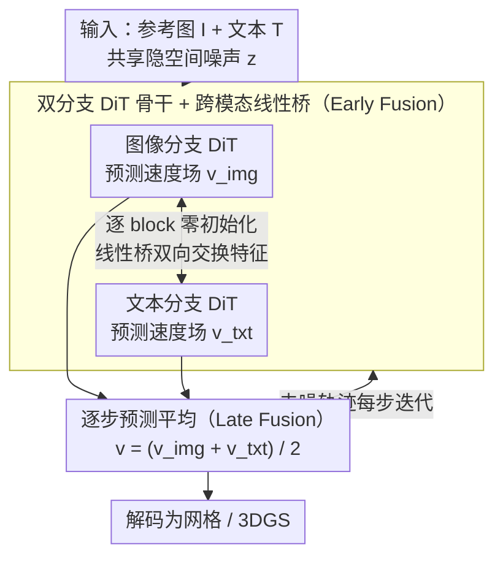

# Text–Image Conditioned 3D Generation

**会议**: CVPR 2026  
**arXiv**: [2603.21295](https://arxiv.org/abs/2603.21295)  
**代码**: [https://jumpat.github.io/tigon-page](https://jumpat.github.io/tigon-page)  
**领域**: 3D视觉 / 三维生成  
**关键词**: 文本-图像联合条件, 3D生成, 双分支DiT, 跨模态融合, 整流流

## 一句话总结
本文发现图像条件和文本条件在3D生成中提供互补信息——图像给出精确外观但受视角限制，文本提供全局语义但缺乏视觉细节——并提出TIGON，一个最小化双分支DiT基线，通过零初始化跨模态桥(early fusion)和步级预测平均(late fusion)实现联合文本-图像条件的原生3D生成。

## 研究背景与动机
1. **领域现状**：原生3D生成模型（如TRELLIS、UniLat3D）已经能从单一条件（图像或文本）生成高质量3D资产。这些方法在各自模态上表现出色，但都依赖单一条件信号。
2. **现有痛点**：(a) **图像条件**的3D生成对输入视角极其敏感——当输入为低信息量视角（如仰视、遮挡严重）时，模型必须"幻想"不可见区域，导致生成结果偏离用户意图；(b) **文本条件**虽能提供全面语义，但缺乏底层视觉约束，生成结果往往视觉质量不高。
3. **核心矛盾**：图像提供局部精确的几何和外观线索但覆盖不完整，文本提供全局语义但粒度不够细——两者恰好互补。
4. **本文目标** (a) 诊断并量化单模态3D生成的局限性；(b) 形式化"文本-图像联合条件3D生成"这一新任务；(c) 设计一个简洁有效的双模态基线方法。
5. **切入角度**：作者做了一个诊断实验——在推理时直接平均图像条件和文本条件两个预训练整流流模型的速度场（称为SimFusion），发现这种朴素融合已经显著优于单模态方法(FD_DINOv2: 82.40 vs 125.93/154.88)，揭示了强烈的跨模态互补性。
6. **核心 idea**：保留两个模态专用的DiT骨干网络，通过轻量级跨模态线性桥进行特征交换，再在去噪轨迹上逐步平均预测，实现联合文本-图像3D生成。

## 方法详解

### 整体框架
TIGON要解决的是"一张参考图 + 一段文字"同时作为条件去生成3D资产的问题。它建在UniLat3D的整流流框架上，但故意不去拼一个统一的大骨干：图像分支和文本分支各跑各的DiT，分别在共享的隐空间噪声 $\tilde{\mathbf{z}}$ 上预测自己那一路的速度场。两路之间在每一层之间插一个轻量的线性桥互相递信息（early fusion），到了每一个去噪步又把两路的速度场平均一下再走下一步（late fusion）。最后把去噪完的隐变量解码成网格或3DGS。整条链路的核心就是"两个专家各自看一个模态、边走边对账"。

### 关键设计

**1. 双分支DiT骨干：让图像专家和文本专家分开看，不强行塞进一个网络**

朴素做法是把图像token和文本token拼在一起喂同一个DiT，但这两类条件的"粒度"完全不对等——图像token稠密、锚在具体视角上、局部信息密集，一只老虎要用一大片token才能描述清楚；文本里的"tiger"可能一个token就完了，抽象但稀疏。硬混在一起，模型容易被这种不匹配带偏而退化。所以TIGON给两边各留一个独立分支，分别预测 $\mathbf{v}_{\text{img}} = \mathcal{F}_{\text{img}}(\tilde{\mathbf{z}}, t, \mathbf{I})$ 和 $\mathbf{v}_{\text{txt}} = \mathcal{F}_{\text{txt}}(\tilde{\mathbf{z}}, t, \mathbf{T})$。这样每个分支都能直接继承预训练好的单模态能力，在联合训练数据不算多的情况下也不至于因为强行纠缠而把原本的本事丢掉。

**2. 跨模态线性桥（Early Fusion）：用零初始化的旁路让两路偷偷交换信息，又不破坏起点**

两个分支如果全程互不通气，去噪过程中很可能各走各的，最后平均出来的速度场反而互相抵消、把细节磨掉。桥的作用就是在每一对DiT block之间开一条双向通道：在第 $i$ 个block输出后，用学到的线性投影把对面的特征投过来加进自己的特征里，

$$\mathbf{f}^{(i),\prime}_{\text{img}} = \mathbf{f}^{(i)}_{\text{img}} + \mathcal{P}^{(i)}_{\text{txt}\rightarrow\text{img}}(\mathbf{f}^{(i)}_{\text{txt}})$$

文本侧用对称的 $\mathcal{P}^{(i)}_{\text{img}\rightarrow\text{txt}}$ 做同样的事。关键技巧是借ControlNet那套零初始化——所有桥参数初值为零，训练刚开始时两路行为和各自的预训练模型一模一样，梯度再一点点把这些"门"打开。这样既稳了起点又拿到了交互：消融里无桥时FD_DINOv2是66.78，加上桥直接降到61.59。

**3. 逐步预测平均（Late Fusion）：每一步只做最简单的等权平均，不堆复杂融合**

既然early fusion已经让两路在中间层互相条件化了，最后一公里就没必要再搞花活。TIGON每个去噪步直接把两路速度场取等权平均 $\mathbf{v} = \frac{1}{2}(\mathbf{v}_{\text{txt}} + \mathbf{v}_{\text{img}})$ 再往下走。作者也试过更聪明的融合——自适应权重(AW)、注意力融合(AT)——但相比简单平均最多只挪动一点点(60.90 vs 61.59)。原因是分支参数本身就能通过重参数化把任何动态加权的好处吸收进去，与其多加一堆参数和训练方差，不如让平均保持干净。

### 训练策略
两阶段训练：(1) 两分支分别预训练——图像分支使用UniLat3D原始checkpoint，文本分支在相同骨干上从头训练100万次迭代；(2) 联合微调5万次迭代，同时训练跨模态桥和所有参数。训练时以0.5概率独立dropout图像和文本条件，产生25%无条件/25%纯文本/25%纯图像/25%文本+图像的均匀混合，使模型学会处理自由形式的条件输入。

## 实验关键数据

### 主实验（Toys4K数据集）

| 模型 | 条件 | 表示 | CLIP↑ | FD_DINOv2↓ |
|------|------|------|-------|------------|
| UniLat3D | 图像 | GS | 91.20 | 85.30 |
| UniLat3D | 文本 | GS | 86.14 | 154.88 |
| SimFusion (朴素融合) | 图+文 | GS | 91.95 | 66.78 |
| **TIGON** | **图+文** | **GS** | **92.33** | **61.59** |
| TRELLIS | 图像(View-1) | GS | 88.16 | 143.58 |
| TIGON | 图像 | GS | 91.40 | 84.62 |
| TIGON | 文本 | GS | 86.77 | 152.34 |

### 消融实验（Toys4K）

| 跨模态桥 | 融合策略 | 联合微调 | CLIP↑ | FD_DINOv2↓ |
|----------|----------|----------|-------|------------|
| ✗ | Sim | ✗ | 91.95 | 66.78 |
| ✗ | Sim | ✓ | 92.05 | 66.04 |
| ✓ | Sim | ✓ | **92.33** | **61.59** |
| ✓ | AW | ✓ | 92.31 | 60.90 |
| ✓ | AT | ✓ | 92.26 | 62.00 |

### 关键发现
- **跨模态互补性真实存在**：仅朴素融合(SimFusion)就将FD_DINOv2从单图像的85.30/单文本的154.88降至66.78，证明两个模态确实提供互补信息。
- **跨模态桥是核心贡献点**：无桥时联合微调仅边际改善(66.78→66.04)，加桥后大幅提升(→61.59)。定性来看，无桥时两分支在去噪过程中发散产生不一致结构。
- **复杂融合策略不必要**：AW和AT融合相比简单平均仅有微弱变化，证明early fusion已足够让分支互相感知。
- **TIGON保持单模态能力**：纯图像/纯文本条件下TIGON性能与UniLat3D单模态模型可比。

## 亮点与洞察
- **诊断驱动的任务定义**非常扎实：先通过定量实验证明单模态限制和跨模态互补性，再定义新任务，避免了"解决方案找问题"的陷阱。
- **极简设计哲学**：仅用线性投影+零初始化就实现了有效的跨模态融合，没有注意力机制或复杂门控。这种设计同时保持了单模态生成能力和自由形式条件支持。
- **可控生成能力**有趣：固定图像变换文本可以得到属性微调的3D对象；当图像信息弱时文本主导，图像信息强时图像主导——这种自适应权衡是隐式学到的。

## 局限与展望
- 仅在UniLat3D框架上验证，未在其他原生3D生成器（如直接3DGS生成）上测试泛化性
- 当图像和文本条件显式冲突时，TIGON倾向于遵循图像——缺乏显式的冲突解决机制
- 训练数据为TRELLIS-500K，仅测试Toys4K和UniLat1K，这些都是合成3D资产，真实世界泛化待验证
- 双分支架构带来约2倍的参数量和推理成本，可以探索更轻量的条件注入方式
- ULIP/Uni3D指标仅在mesh输出上报告，3DGS输出缺乏点云级评估

## 相关工作与启发
- **vs TRELLIS/UniLat3D**: 单模态基线，TIGON在其上增加了跨模态融合能力，保持了其单模态性能同时获得了联合条件的收益
- **vs TICD**: TICD通过SDS修改来融合文本-图像条件，依赖2D扩散先验，TIGON直接在原生3D生成框架中操作
- **vs FlexGen**: FlexGen关注2D多视图生成而非原生3D合成，TIGON直接生成3D表示

## 补充细节

### 数据集与评估指标
- 训练集：TRELLIS-500K
- 测试集：Toys4K（105类约4K对象）和UniLat1K（更难的1K对象基准）
- 关键指标：CLIP（渲染图语义对齐）、FD_DINOv2（渲染图视觉保真度，越低越好）、ULIP/Uni3D（3D点云-图像对齐，仅mesh可用）
- 每个对象用三个参考视角（正面、顶部、底部）而非理想视角进行条件化，测试视角鲁棒性

### 条件冲突行为
当图像和文本显式冲突时，TIGON倾向遵循图像——因为图像通常比文本更具体、更少歧义。这暗示未来可设计显式的冲突权衡机制。

## 评分
- 新颖性: ⭐⭐⭐⭐ 任务定义新颖且有实验支撑，但方法本身相对简单
- 实验充分度: ⭐⭐⭐⭐ 消融全面，定性结果丰富，但测试集较小且为合成数据
- 写作质量: ⭐⭐⭐⭐⭐ 逻辑链清晰，诊断→任务定义→方法→验证层层递进
- 价值: ⭐⭐⭐⭐ 开辟了一个有意义的新方向，极简baseline为后续工作提供了清晰的改进空间

<!-- RELATED:START -->

## 相关论文

- [\[CVPR 2026\] ForgeDreamer: Industrial Text-to-3D Generation with Multi-Expert LoRA and Cross-View Hypergraph](forgedreamer_industrial_text-to-3d_generation_with_multi-expert_lora_and_cross-v.md)
- [\[CVPR 2026\] Pano3DComposer: Feed-Forward Compositional 3D Scene Generation from Single Panoramic Image](pano3dcomposer_feed-forward_compositional_3d_scene_generation_from_single_panora.md)
- [\[ICCV 2025\] FlexGen: Flexible Multi-View Generation from Text and Image Inputs](../../ICCV2025/3d_vision/flexgen_flexible_multi-view_generation_from_text_and_image_inputs.md)
- [\[ICML 2026\] RelaxFlow: Text-Driven Amodal 3D Generation](../../ICML2026/3d_vision/relaxflow_text-driven_amodal_3d_generation.md)
- [\[CVPR 2026\] SwiftTailor: Efficient 3D Garment Generation with Geometry Image Representation](swifttailor_efficient_3d_garment_generation_with_geometry_image_representation.md)

<!-- RELATED:END -->
