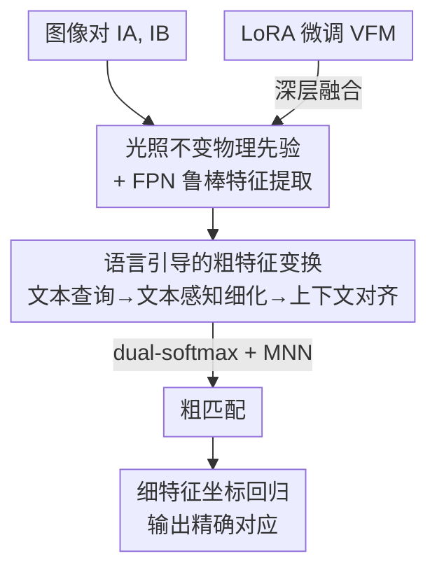

# TextFM: Robust Semi-dense Feature Matching with Language Guidance

**会议**: CVPR 2026  
**论文**: [CVF Open Access](https://openaccess.thecvf.com/content/CVPR2026/html/Zheng_TextFM_Robust_Semi-dense_Feature_Matching_with_Language_Guidance_CVPR_2026_paper.html)  
**代码**: 无  
**领域**: 3D视觉  
**关键词**: 特征匹配, 视觉语言模型, 域泛化, LoRA, 光照不变先验

## 一句话总结
TextFM 是第一个把视觉语言模型（VLM）的文本语义引入半稠密特征匹配的框架——它用文本嵌入生成实例级查询给粗匹配注入域不变语义、用 LoRA 高效微调视觉基础模型（VFM）、再叠加光照不变物理先验，在跨域和昼夜变化下显著超过 EfficientLoFTR 等现有方法。

## 研究背景与动机
**领域现状**：图像特征匹配是 SfM、视觉定位等几何感知任务的基石。方法已经从基于检测子（detector-based）的稀疏匹配，演进到 detector-free 的稠密/半稠密匹配（LoFTR、EfficientLoFTR 等），后者对所有像素建立对应关系，靠全局上下文提升鲁棒性。

**现有痛点**：主流的粗匹配学习依赖 3D 监督，而高质量大规模 3D 数据稀缺，导致模型过拟合、对未见域泛化差。近期工作转而引入冻结的 VFM（如 DINOv2）来提供可迁移的视觉特征，但纯视觉特征在**无纹理表面、重复纹理**这类几何线索本身就模糊的区域仍然失效，而且在**大幅光照/外观变化**（如昼夜切换）下，VFM 表征的泛化能力也会被突破。

**核心矛盾**：问题的根本是**预训练知识与未见应用场景之间持续存在的域间隔（domain gap）**。纯视觉特征缺乏跨域稳定的"语义锚点"；同时，想充分利用 VFM 又面临两难——冻结骨干没榨干其泛化力，全量微调又昂贵且会过拟合、丢失预训练知识。

**本文目标**：在不依赖昂贵 3D 监督的前提下，造一个对跨域、低纹理、极端光照都鲁棒的半稠密匹配器。拆成三个子问题：(1) 给粗匹配注入域不变的语义信息；(2) 高效地把 VFM 适配到匹配任务又不丢知识；(3) 抵抗光照变化。

**切入角度**：作者观察到**文本语义天然具备域不变性**——"建筑""天空"这类类别概念在白天黑夜、不同数据集间是一致的，可以作为把同类区域聚到一起的语义原型。而粗匹配阶段的特征来自骨干深层、本就编码高层语义，是注入语言引导的理想位置。

**核心 idea**：用 VLM 文本嵌入生成实例级查询，把"语义一致性"作为域不变先验注入 detector-free 的粗匹配阶段；同时用 LoRA 高效微调 VFM、叠加光照不变物理先验，三者合力做鲁棒匹配。

## 方法详解

### 整体框架
TextFM 沿用 coarse-to-fine（粗到细）的 detector-free 匹配范式：输入一对图像 $I_A, I_B$，输出它们之间的精确像素对应。整条管线分三段——**先抽鲁棒视觉特征，再做语言引导的粗匹配，最后细化坐标**。

第一段先从输入图像提取光照不变物理先验，喂给 CNN-based FPN，并在 FPN 深层融入 LoRA 微调后的 VFM 特征，得到 1/8 分辨率的粗特征 $F_c$ 和 1/2 分辨率的细特征 $F_f$。第二段把粗特征送进语言引导的粗特征变换模块：用冻结 CLIP 生成文本查询、用文本感知细化把每个像素特征按语义原型聚类、再用上下文对齐建立像素与文本的类级对应，最后用 dual-softmax + 互最近邻（MNN）选出粗匹配。第三段在粗匹配的局部裁剪块内用细特征做高分辨率坐标回归，沿用 EfficientLoFTR 的两阶段精化策略。

### 关键设计

**1. 光照不变物理先验 + FPN 鲁棒特征提取：让特征从根上不受光照干扰**

VFM 特征虽然语义丰富，却缺乏精细匹配所需的空间细节，而且在昼夜这类极端光照下会超出其泛化极限。作者不直接用 RGB 图，而是先从输入图抽取**光照不变物理先验**：基于 Kubelka–Munk 反射理论的颜色不变边缘检测子，给出 $H, C, W$ 三个先验，它们只依赖材质反射属性、与光照和视角无关；再加上 RGB 颜色顺序图 $O$，四个先验拼接后作为 FPN 的输入嵌入。这样网络看到的是"材质级"的稳定信号而非易受光照扰动的原始像素，FPN 据此抽多尺度特征，从源头上提升了对昼夜/外观变化的抗性。消融显示该模块在 MegaDepth-night2night 上带来明显增益。

**2. LoRA 微调 VFM：在"不丢预训练知识"和"任务适配"之间找到高效解**

前人要么用冻结 VFM（没榨干泛化力），要么全量微调（304M 可训参数、易过拟合且遗忘预训练知识）。TextFM 给 VFM 每一层插入可训练的低秩矩阵：对第 $i$ 层的预训练权重 $W_i$，特征传播改为 $f_{i+1} = W_i f_i + \Delta W_i f_i$，其中残差 $\Delta W_i = BA$ 用低秩分解（$A \in \mathbb{R}^{r\times c}, B \in \mathbb{R}^{c\times r}, r \ll c$）。作者进一步用可学习 token $T_i$ 加轻量 MLP $M_i(\cdot)$ 替代 $\Delta W_i$，更新式变成 $f_{i+1} = W_i f_i + M_i(T_i W_i f_i)$，并令 $T_i = A_i B_i$ 继续低秩化。这套方案只需约 3M 可训参数，却让 DINOv2 适配到匹配任务的同时保住了预训练知识。消融里它在 in-domain MegaDepth 上贡献最大的单项增益，且**冻结 VFM 反而比全量微调更好**，印证了"全微调会过拟合遗忘"的判断。

**3. 语言引导的粗特征变换：把域不变的文本语义注入粗匹配**

这是本文的核心创新，由三个子阶段串成。**(a) 文本查询生成**：用冻结的 CLIP 文本编码器 $E_T$ 生成文本嵌入，为避免手工 prompt 的脆弱，采用 prompt learning——给每个类别标签 token $\text{CLS}_k$ 拼一个可学习提示 $p$，得到 $t_k = E_T([p, \text{CLS}_k])$，再经 MLP 投影成文本查询 $Q_t \in \mathbb{R}^{K\times\hat C}$（默认 $K=150$ 个 ADE20K 类别）。**(b) 文本感知细化**：在原本交替的自注意力/交叉注意力块之前，插入一层交叉注意力，让每个像素特征去"问"文本原型 $\hat t$。注意力按

$$\hat{f}_i = f_i + A \times v, \quad A = \mathrm{Softmax}\!\left(\frac{q \times k^T}{\sqrt{\alpha}}\right)$$

把像素特征 $f_i$ 投影成 query $q$、文本原型投影成 $k,v$，相当于把每个像素软分配到 $K$ 个文本原型上做加权聚合，从而**把同类区域在特征空间里聚到一起**，用域不变的文本语义引导视觉特征。**(c) 上下文对齐**：用带 $N$ 层掩码注意力的 Transformer decoder 迭代更新文本查询 $Q_t \to \hat Q_t$（注入来自粗特征的空间上下文），再用细化后的像素特征 $\tilde F_c$ 与 $\hat Q_t$ 做点积，得到上下文相关图 $\hat F_c \in \mathbb{R}^{H\times W\times K}$，编码每个空间位置与各文本概念的语义亲和度，产出"语义对齐"的视觉表征供后续粗匹配。三步合起来让粗特征在跨域时更可分、更稳定——t-SNE 可视化显示未见目标域样本分布更均匀。

### 损失函数 / 训练策略
整条管线端到端训练，粗匹配与精化分别监督。粗层用负对数似然损失监督相关分数矩阵 $S_c$：$\mathcal{L}_c^v = -\frac{1}{N_c}\sum_{(i,j)\in M_c^{gt}} \log S_c(i,j)$，其中真值对应 $M_c^{gt}$ 由已知位姿和深度把网格点从 $I_A$ warp 到 $I_B$ 得到；同时对文本相关分数矩阵 $S_c^t$ 加一项 $\mathcal{L}_c^t$，故 $\mathcal{L}_c = \mathcal{L}_c^v + \mathcal{L}_c^t$。细层沿用 EfficientLoFTR 两阶段：第一阶段对局部分数图用 NLL 损失 $\mathcal{L}_{f1}$，第二阶段对子像素坐标用 L2 回归损失 $\mathcal{L}_{f2}$。总损失 $\mathcal{L} = \mathcal{L}_c + \alpha\mathcal{L}_{f1} + \beta\mathcal{L}_{f2}$，$\alpha=1.0, \beta=0.25$。默认 VFM 为 DINOv2-L，文本细化块交替 $M=4$ 次、decoder $N=3$ 层，仅在户外 MegaDepth 上训练，AdamW、初始学习率 $4\times10^{-3}$。

## 实验关键数据

### 主实验
两视图几何（位姿误差 AUC@5°/10°/20°），同一个 MegaDepth 训练模型评测所有域：

| 数据集 | 类别 | EfficientLoFTR | TextFM(本文) | 提升 |
|--------|------|----------------|--------------|------|
| MegaDepth (in-domain) | 半稠密 | 55.3 / 71.4 / 83.1 | **58.0 / 73.6 / 84.6** | +2.7 / +2.2 / +1.5 |
| ScanNet (跨域) | 半稠密 | 18.4 / 35.6 / 52.7 | **22.7 / 43.2 / 59.9** | +4.3 / +7.6 / +7.2 |
| MegaDepth-N2D (昼夜) | 半稠密 | 47.5 / 64.7 / 77.8 | **49.4 / 66.3 / 79.3** | +1.9 / +1.6 / +1.5 |
| MegaDepth-N2N (夜夜) | 半稠密 | 42.6 / 60.1 / 74.0 | **45.1 / 62.7 / 76.1** | +2.5 / +2.6 / +2.1 |

跨域（ScanNet、夜间）增益最大，验证了语言引导的域不变优势；用时 183.5ms，慢于 EfficientLoFTR(93.7ms) 但远快于稠密的 ROMA(707ms)，且接近后者精度。视觉定位上 InLoc 平均 73.85（>EfficientLoFTR 73.63），Aachen v1.1 夜间子集 79.8/92.0/99.5 领先，整体 92.70 最高。

### 消融实验
关键组件逐项叠加（AUC@5°，VFM=LoRA-VFM，Priors=物理先验，TAR=文本感知细化，CA=上下文对齐）：

| 配置 | MegaDepth | ScanNet | N2N | Params |
|------|-----------|---------|-----|--------|
| baseline | 55.5 | 18.4 | 42.6 | 17.4M |
| +VFM | 56.8 (+1.3) | 20.0 (+1.6) | 43.7 | 20.7M |
| +Priors | 56.1 | 19.1 | 43.6 (+1.0) | 17.5M |
| +TAR+CA | 56.6 | 21.6 (+3.2) | 43.9 | 19.5M |
| Full (全部) | **58.0 (+2.5)** | **22.7 (+4.3)** | **45.1 (+2.5)** | 23.1M |

VFM 微调方案对比（仅 DINOv2-L 骨干）：

| 方案 | AUC@5° | 可训参数 |
|------|--------|----------|
| Baseline | 55.3 | 0M |
| 冻结 DINOv2 | 56.4 | 0M |
| LoRA 微调 | **56.8** | 2.99M |
| 全量微调 | 56.1 | 304.2M |

### 关键发现
- **不同模块各管一摊域**：LoRA-VFM 在 in-domain MegaDepth 上单项增益最大；语言引导模块（TAR+CA）在跨域 ScanNet 上增益最大（AUC@10° +5.0）；物理先验主要管昼夜 N2N。三者解决的是不同维度的鲁棒性。
- **全微调 < 冻结 < LoRA**：全量微调（304M 参数）反而不如冻结，证实其过拟合、遗忘预训练知识；LoRA 用 3M 参数取得最佳。
- **词表越广越稳**：用 ADE20K 150 类（覆盖室内外）优于 Cityscapes 19 类、NYUv2 40 类，也优于随机可学习 token（57.3→58.0），说明增益确实来自文本语义而非额外参数；prompt learning 优于固定模板（57.2→58.0）。
- **对分辨率不敏感**：480² 训练仅比 800² 略降（57.3 vs 58.0），得益于 VFM 特征，利于真实部署。
- VFM 骨干可换（CLIP/EVA02/DINOv2 都好用），DINOv2-L 最佳。

## 亮点与洞察
- **"文本即域不变锚点"的视角很巧**：纯视觉特征跨域漂移，但"建筑""天空"的语义概念跨白天黑夜、跨数据集是稳定的——用文本原型把同类像素聚到一起，等于给匹配装了一个不随光照/外观变化的语义罗盘。这是首个把 VLM 引入特征匹配的工作。
- **物理先验 + 学习特征的混搭**：用 Kubelka–Munk 反射理论的颜色不变量做输入、而非直接吃 RGB，从信号源头去光照，是把经典物理建模和深度特征结合的可复用 trick，可迁移到任何对光照敏感的视觉任务。
- **LoRA 在 matching 任务上验证了"少即是多"**：3M vs 304M 参数、效果还更好，给"如何用大模型又不被它拖累"提供了一个干净的对照实验。
- 顺手贡献了 **MegaDepth-Sync** 昼夜匹配 benchmark（用图像翻译模型把 MegaDepth 白天图转黑夜，含真值位姿），填补了极端光照下匹配评测的空白。

## 局限与展望
- 文本查询依赖预定义的分割词表（ADE20K 150 类），测试集出现未见类别时性能会略降——语义先验的覆盖面受词表限制，开放词表场景下如何自适应扩词表是开放问题。
- 速度（183.5ms）比纯视觉的 EfficientLoFTR 慢近一倍，引入 CLIP 编码与多阶段注意力有额外开销，实时性场景需权衡。
- ⚠️ 仅在户外 MegaDepth 上训练就跨域评测，泛化结论亮眼，但训练数据单一，是否在更多样训练分布下仍保持优势未充分验证。
- 物理先验来自固定的颜色不变边缘检测子，对极端噪声/模糊图像是否仍稳健、与学习式去光照相比孰优，论文未深入。

## 相关工作与启发
- **vs EfficientLoFTR**：本文以它为 baseline（并把骨干换成 FPN），细化阶段直接沿用其两阶段策略；区别在于 TextFM 在粗匹配阶段注入语言引导 + LoRA-VFM + 物理先验，跨域增益明显（ScanNet AUC@10° 35.6→43.2），代价是慢约一倍。
- **vs 用冻结 VFM 的方法（如 OmniGlue、ROMA 系）**：它们直接拿冻结 DINOv2/CLIP 作辅助视觉表征，没充分适配；本文用 LoRA 微调榨干 VFM 泛化力，且证明全量微调反而更差。
- **vs 稠密方法（DKM / ROMA）**：稠密法精度更高（ROMA 62.4/76.4/86.2）但慢得多（707ms）；TextFM 在半稠密里逼近稠密精度、跨域差距进一步缩小，效率-精度权衡更好。
- **vs TopicFM**：同样想给匹配引入"主题/语义"概念，但 TopicFM 的主题是视觉自学习的、无显式语义；本文用 VLM 文本嵌入提供**显式、域不变**的语义原型，跨域更稳。

## 评分
- 新颖性: ⭐⭐⭐⭐⭐ 首个把 VLM 文本语义引入特征匹配，"文本即域不变锚点"角度新颖
- 实验充分度: ⭐⭐⭐⭐⭐ 两视图+定位双任务、in/out-of-domain 全覆盖，消融细到词表/prompt/分辨率/骨干
- 写作质量: ⭐⭐⭐⭐ 动机推导清晰、图文对照好，部分公式排版略乱
- 价值: ⭐⭐⭐⭐ 跨域/昼夜鲁棒匹配实用性强，并贡献昼夜 benchmark；速度开销是落地需权衡处

<!-- RELATED:START -->

## 相关论文

- [\[CVPR 2026\] Scalable Feature Matching via State Space Modeling and Sparse Correlation](scalable_feature_matching_via_state_space_modeling_and_sparse_correlation.md)
- [\[ICCV 2025\] CasP: Improving Semi-Dense Feature Matching Pipeline Leveraging Cascaded Correspondence Priors for Guidance](../../ICCV2025/3d_vision/casp_improving_semi-dense_feature_matching_pipeline_leveraging_cascaded_correspo.md)
- [\[CVPR 2026\] AsymLoc: Towards Asymmetric Feature Matching for Efficient Visual Localization](asymloc_towards_asymmetric_feature_matching_for_efficient_visual_localization.md)
- [\[CVPR 2026\] PatchAlign3D: Local Feature Alignment for Dense 3D Shape Understanding](patchalign3d_local_feature_alignment_for_dense_3d_shape_understanding.md)
- [\[CVPR 2026\] HeroGS: Hierarchical Guidance for Robust 3D Gaussian Splatting under Sparse Views](herogs_hierarchical_guidance_for_robust_3d_gaussian_splatting_under_sparse_views.md)

<!-- RELATED:END -->
