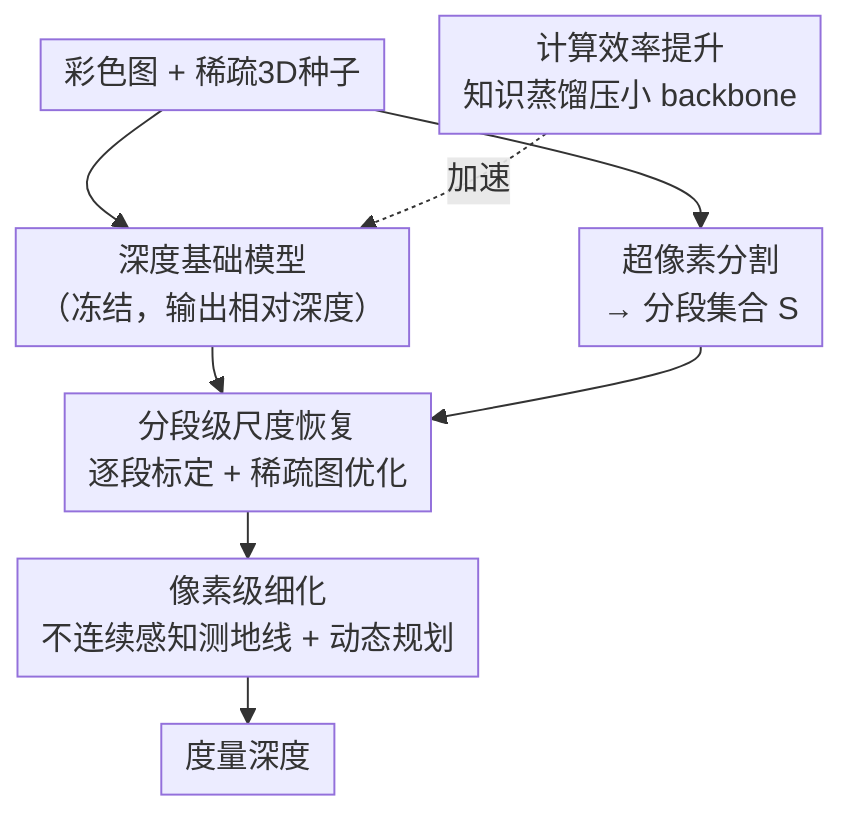

# The Midas Touch for Metric Depth

**会议**: CVPR 2026  
**论文**: [CVF Open Access](https://openaccess.thecvf.com/content/CVPR2026/html/Ma_The_Midas_Touch_for_Metric_Depth_CVPR_2026_paper.html)  
**代码**: https://mias.group/MTD （项目页）  
**领域**: 3D视觉 / 单目深度估计  
**关键词**: 度量深度, 相对深度, 深度补全, 稀疏点云, 测地线

## 一句话总结
MTD（Midas Touch for Depth）用一套无需训练、数学可解释的"由粗到细"算法，借助极稀疏的 3D 点（LiDAR / 立体匹配等）把深度基础模型输出的相对深度转换成度量深度：先做分段图优化把局部尺度对齐，再用"不连续感知测地线代价 + 动态规划"做像素级细化，在零样本深度补全与深度估计上全面超过 BP-Net / DMD3C / Marigold-DC 等 SOTA，且后端只占 1.9 ms。

## 研究背景与动机
**领域现状**：MiDaS、DepthAnything 系列这类深度基础模型把单目相对深度估计的跨场景泛化做得很强，零样本效果好。但它们输出的是**相对深度**——存在固有的尺度模糊（scale ambiguity），没有绝对的"米"。

**现有痛点**：要拿到度量深度（metric depth），过去有两条路，各有硬伤。① 用 3D 点云做**全局最小二乘**恢复一个统一尺度——但不同物体/区域的尺度比例和偏移其实不一样，单一全局缩放一刀切，局部精度差。② 直接训练**度量深度网络**（Metric3D、UniDepth）或深度补全网络（BP-Net、DMD3C）——但它们在特定域上训练，跨域泛化差，且想泛化就得收集大规模数据集、训练好几天，成本高，还有物体边界"边缘变胖"（edge-fattening）的问题。

**核心矛盾**：相对深度模型的强泛化能力和度量深度的绝对尺度，二者难以兼得——要尺度就得训练专用网络从而牺牲泛化，要泛化就只能停在相对深度。而尺度模糊的本质是**局部尺度不一致**，不是一个全局标量能修好的。

**本文目标**：在**完全不微调**基础模型（避免泛化退化）的前提下，只用极稀疏的 3D 线索（论文称之为 "3D seeds / 3D 种子"，可以是深度、视差、对应匹配等多源输入），把相对深度高效、准确地转成度量深度。

**切入角度**：把问题拆成"局部尺度对齐"和"像素级残差修正"两个子问题，全部用**非参数、有清晰数学基础**的方法解决，而不是再训一个网络。

**核心 idea**：用"分段图优化做粗尺度恢复 + 不连续感知测地线做像素级细化"的纯优化管线，替代"全局缩放"或"端到端训练"，把相对深度"点石成金"为度量深度。

## 方法详解

### 整体框架
MTD 的输入是三样东西：基础模型预测的**相对深度图** $d$、**稀疏 3D 种子** $X$、以及对彩色图做超像素分割得到的**分段集合** $S=\{S_i\}$；输出是可靠的度量深度。整条管线是**由粗到细（coarse-to-fine）**：先用分段级恢复（Segment-Wise Recovery）把局部尺度对齐、得到一张粗的度量深度；再用像素级细化（Pixel-Wise Refinement）把残差修掉、得到精细度量深度。此外，为了实际落地，还用知识蒸馏把前端基础模型压小，在保证精度的同时大幅提速。

整个框架最妙的地方在于：精度的两块工作（恢复 + 细化）都是后端的纯数学优化，几乎零开销（480×640 输入在 RTX 3090 上后端仅 1.9 ms、显存 <1.8 GB），真正的耗时全在前端基础模型——所以换个更轻的 backbone 就能直接换来速度，精度损失很小。

### 关键设计

**1. 分段级尺度恢复：用分段图优化替代全局缩放，修复局部尺度不一致**

这一步针对的是"全局最小二乘一刀切、局部尺度对不上"的痛点。做法分两层。第一层是**逐段标定（Per-Segment Calibration）**：把彩色图超像素分割成若干段 $S_i$，把 3D 种子投影到图像平面；对每个**含有种子投影**的段（索引集合记作 $Q$），用段内种子提供的标量代理 $\xi_i^j$（与真实深度 $z_i^j$ 通过单调双射对应）和该处的相对深度 $d_i^j$，拟合一个逐段标定函数 $g_i: d \mapsto \xi$（可用最小二乘或中位数匹配对齐两者分布），并把参数存进查找表以便并行传播。第二层是**稀疏图优化（Sparse Graph Optimization）**：很多段根本没被任何种子命中（$i \notin Q$），没法直接标定，于是把分段集合编码成超像素图 $G=(V,E)$，顶点是段、边权 $w_{ij}$ 由段质心间距的衰减核给出；为省内存只给每个节点保留 $N$ 个最近邻。然后把全体标定参数 $\{\theta_i\}$ 的估计写成一个图正则化的二次问题：

$$\min_{\{\theta_i\}} \sum_{i\in Q}\lVert\theta_i-\hat\theta_i\rVert^2 + \sum_{(i,j)\in E} w_{ij}\lVert\theta_i-\theta_j\rVert^2.$$

前一项让有种子的段贴近自己的标定锚点，后一项让相邻段的标定参数平滑一致，从而把可靠尺度从 $Q$ 传播到无种子段。这个问题有闭式近似解，效率很高。这样得到的是一张**局部尺度已对齐、但仍带像素级残差**的粗度量深度——它比全局缩放好在"每段一个尺度且段间还连贯"，而不是全图共用一个尺度。

**2. 像素级细化：把深度传播建成不连续感知的测地线问题，再用动态规划求解**

分段恢复后还有残差：种子投影点的真实深度和粗深度仍有偏差，且同一物理表面上相邻像素往往共享相似误差。直接平滑会把误差跨过物体边界扩散出去。作者的解法是把"该往哪传、传多远"形式化成一个**测地线代价**问题。核心是定义一个反对称的一阶余项 $R(p,q)$（满足 $R(p,q)+R(q,p)=0$，对仿射深度恒为 0，从而隔离二阶变化、去掉方向偏置），并证明（Proposition 1）它的上界可由沿某条轴平行折线路径对一个**局部不连续密度** $\phi(u,v)=\sqrt{z_{uu}^2+z_{vv}^2}$ 的线积分控制。于是定义不连续感知测地线代价

$$d_\phi(p,q)=\inf_{L\in\mathcal{L}_{p\to q}} \int_L \phi(u,v)\, ds,$$

它正好是共形黎曼度量 $\phi^2 I_2$ 下的测地距离。直觉上：物体边界处 $\phi$ 很大，任何穿过边界的路径都会累积巨大代价，取下确界后得到的 $d_\phi$ 天然惩罚"跨越不连续"，把深度传播限制在可靠的空间范围内。⚠️ 上述命题与积分细节以原文补充材料为准。

求解上，把线积分离散成单像素步的黎曼和 $\int_{L_\Pi}\phi\,ds \approx \sum_k \ell(p_k,p_{k+1})\,\phi(p_{k+1})$，并改写成动态规划递推 $d_\phi(p_0,p_K)\le \inf W(p_{K-1}\to p_K)+d_\phi(p_0,p_{K-1})$——把"沿路径算线积分"对应成"动态规划的代价优化"。从可靠的 3D 种子投影像素出发（代价初始化为最小），迭代 $K$ 步就得到种子到任意像素 $p$ 的最平滑路径，这也让像素交互不再局限于局部邻域、等效扩大了感受野。深度更新用调和步长 $\frac{1}{k+1}$ 做凸组合：$z^{(k+1)}(p)=(1-\frac{1}{k+1})z^{(k)}(p)+\frac{1}{k+1}\hat z^{(k)}(p\mid q,\Delta p)$，其中 $\hat z^{(k)}=\alpha^{(k)}(q)^\top\Psi(\Delta p)$ 用 $q$ 附近数据估的局部系数和一组基函数 $\Psi$ 预测，既稳定又能不断纳入新的局部信息。

**3. 计算效率提升：知识蒸馏把前端 backbone 压小，让框架真正能上嵌入式**

既然 MTD 的精度模块几乎零开销、耗时全在前端基础模型，那提速的关键就是把前端压小。作者用知识蒸馏：以 DepthAnythingV2 为教师，把 TinyViT、EfficientViT 当学生 backbone，同时用特征蒸馏和 logit 蒸馏，蒸馏数据来自 VKITTI2、Hypersim、TartanAir、SA-1B 等真实+仿真数据。结果是参数大幅下降、运行时显著加速，而度量深度精度仍可接受——因为即便相对深度只是"中等质量"，分段恢复 + 像素细化也能把它救回准确的度量深度。这正是 MTD "不依赖高容量基础模型"这一卖点的来源，使其能部署到自动驾驶、机器人的边缘设备（如 Jetson AGX Orin）上。

## 实验关键数据

### 主实验

零样本深度补全（KITTI/NYUv2 因常用于训练被排除，避免训练-测试重叠），MTD 全面领先。下表摘录与 SOTA 的对比（数值越低越好）：

| 数据集 | 指标 | Marigold-DC（前SOTA） | MTD（本文） | 提升 |
|--------|------|-----------------------|-------------|------|
| nuScenes | RMSE / MAE | 4.924 / 2.595 | 4.387 / 2.177 | -0.537 / -0.418 |
| DDAD | RMSE / MAE | 6.449 / 2.364 | 5.252 / 1.834 | -1.197 / -0.530 |
| VOID1500 | RMSE / MAE | 0.505 / 0.151 | 0.366 / 0.138 | -0.139 / -0.013 |
| SUN-RGBD | RMSE / MAE | 0.238 / 0.067 | 0.220 / 0.050 | -0.018 / -0.017 |
| ScanNet | RMSE / MAE | 0.145 / 0.059 | 0.129 / 0.049 | -0.016 / -0.010 |

作为即插即用模块挂到各种深度基础模型上做零样本深度估计，MTD 一致地降低 AbsRel、提高 $\delta_1$。摘录几组（每行上=原模型，下=加 MTD 后，KITTI / ScanNet）：

| 基础模型 | KITTI AbsRel↓ / δ1↑ | ScanNet AbsRel↓ / δ1↑ |
|----------|---------------------|------------------------|
| MiDaS → +Ours | 0.183 / 0.711 → **0.069 / 0.929** | 0.099 / 0.907 → **0.015 / 0.991** |
| DepthAnythingV2 → +Ours | 0.080 / 0.946 → **0.022 / 0.987** | 0.043 / 0.981 → **0.016 / 0.991** |
| UniDepthV2 → +Ours | 0.076 / 0.952 → **0.032 / 0.977** | 0.058 / 0.975 → **0.014 / 0.993** |

效率上，480×640 输入、RTX 3090，MTD 后端仅 **1.9 ms**、显存 <1.8 GB、GPU 利用率 <4%，主要耗时在前端，可自由换 backbone 平衡精度与速度。

### 消融实验

KITTI（室外）+ VOID（室内）统一消融（RMSE/MAE，越低越好）：

| 模块 | 配置 | KITTI RMSE | VOID RMSE | 说明 |
|------|------|-----------|-----------|------|
| 逐段标定 | median | 10.891 | 0.898 | 中位数对齐 |
| 逐段标定 | least squares | 7.013 | 0.791 | 最小二乘更好 |
| 逐段标定 | Domain: $z^{-1}$ | 6.782 | 0.614 | 用逆深度作代理再涨 |
| 稀疏图优化 | global-based | 2.521 | 0.554 | 全局基线 |
| 稀疏图优化 | graph-based | **2.232** | **0.459** | 图优化稳定优于全局 |
| 动态规划 | w/o $d_\phi$ | 2.618 | 0.482 | 去掉测地线代价明显变差 |
| 动态规划 | polynomial vs B-spline | 2.049 vs 2.112 | 0.429 vs 0.442 | 多项式基优于 B 样条 |
| 动态规划 | k=3 / k=5 | 2.028 / 1.913 | 0.366 / 0.391 | 增大 k 扩感受野、整体提升 |

### 关键发现
- **测地线代价是细化模块的命门**：去掉 $d_\phi$（w/o $d_\phi$）后，普通边缘提取器无法有效表达不连续，KITTI RMSE 从 2.0 级别退回 2.618，说明"不连续感知"才是把深度传播挡在物体边界内的关键。
- **图优化 > 全局缩放**：从 global-based 换成 graph-based，室内外都稳定下降，印证"局部尺度不一致需要分段+图传播"这一核心动机。
- **MTD 能抹平 backbone 差距**：全局最小二乘下 DepthAnythingV2 和 MiDaS 的 MAE 差距很大，加了 MTD 后差距显著缩小——说明方法不依赖高容量基础模型，参数掉到 ~20M 以下 RMSE 才开始上升，TinyViT/EfficientViT 这类极轻 backbone 的 RMSE 仍在可接受范围。
- **种子越稀疏越能体现优势**：在 3D 种子数量（NP）很低时，MTD 相比全局最小二乘的 MAE 优势更明显，nuScenes 这种点云稀疏、深度值大的室外场景里几乎所有方法都吃力，MTD 仍稳定领先。

## 亮点与洞察
- **"精度全在后端纯数学、耗时全在前端网络"的解耦**很巧妙：因为后端只占 1.9 ms，换 backbone 就能直接换速度，给了"精度-效率"一个干净的旋钮，这是大多数端到端度量深度网络做不到的。
- **把深度细化重述成测地线问题**是最"啊哈"的一笔：用 $\phi=\sqrt{z_{uu}^2+z_{vv}^2}$ 当不连续密度、用测地距离自动惩罚跨边界传播，再用动态规划高效求解——既有数学保证又能落地，比"学一个 affinity 再传播"更可解释、更不依赖训练域。
- **无需训练 + 多源 3D 种子**的设计可迁移性强：任何能产生稀疏深度/视差/对应匹配的传感器（LiDAR、立体相机、iPhone）都能当种子喂进来，作为即插即用模块挂到任意相对深度模型后面，工程价值高。

## 局限与展望
- 方法依赖**超像素分割**与种子投影质量：分割尺度是需要按数据集搜索的超参（论文 Fig.4b 对每个 NP 都搜了最佳段尺度），实际部署时这套超参的自适应性如何、跨域是否稳定，值得关注。⚠️ 论文未给出自动选段尺度的方案。
- 仍**需要稀疏 3D 种子**：在完全没有任何 3D 线索的纯单目场景下，MTD 无法独立产出度量深度，本质是"相对→度量"的转换器而非端到端度量估计器。
- 测地线 + 动态规划的若干命题与代价等价性证明放在补充材料，正文只给结论，复现时需仔细对照补充材料的离散化与初始化细节。
- 可改进方向：把段尺度、种子可靠性加权做成数据自适应；或把测地线代价与基础模型特征联合，进一步压低对种子密度的依赖。

## 相关工作与启发
- **vs 全局最小二乘尺度恢复（MiDaS/DepthAnything 常用）**: 他们用一个全局标量缩放相对深度，本文用分段标定 + 图正则传播做局部尺度对齐，区别在于承认并显式建模"局部尺度不一致"，因此在点云稀疏、室外大深度场景优势明显。
- **vs 深度补全 SOTA（BP-Net / DMD3C / Marigold-DC）**: 他们训练网络融合彩色图与稀疏测量，精度在特定数据集上很高但跨域鲁棒性和运行效率受限、还需大规模数据训练数天；本文无需训练、数学可解释、只用极稀疏种子，零样本下 MAE/RMSE 反而更低、后端仅毫秒级。
- **vs 度量深度网络（Metric3D / UniDepth）**: 他们端到端预测度量深度但跨域泛化弱、边界易"变胖"；本文保留相对深度模型的泛化强项，只在后端做尺度恢复与边界感知细化，兼得泛化与度量精度。

## 评分
- 新颖性: ⭐⭐⭐⭐⭐ 把"相对→度量"重述为分段图优化 + 不连续感知测地线，全程无需训练且数学可解释，角度新。
- 实验充分度: ⭐⭐⭐⭐⭐ 覆盖 10+ 室内外零样本基准、补全与估计两类任务、多 backbone、稀疏度与段尺度消融，相当扎实。
- 写作质量: ⭐⭐⭐⭐ 思路清晰、命题严谨，但测地线部分较硬核，关键证明依赖补充材料。
- 价值: ⭐⭐⭐⭐⭐ 即插即用、毫秒级后端、可上嵌入式，对自动驾驶/机器人度量深度落地实用性极高。

<!-- RELATED:START -->

## 相关论文

- [\[CVPR 2026\] Dense Metric Depth Completion from Sparse Direct Time-of-Flight Sensors](dense_metric_depth_completion_from_sparse_direct_time-of-flight_sensors.md)
- [\[CVPR 2026\] Radar-Guided Polynomial Fitting for Metric Depth Estimation](radar-guided_polynomial_fitting_for_metric_depth_estimation.md)
- [\[CVPR 2026\] MD2E: Modeling Depth-to-Edge Cues for Monocular Metric Depth Estimation](md2e_modeling_depth-to-edge_cues_for_monocular_metric_depth_estimation.md)
- [\[CVPR 2026\] UniDAC: Universal Metric Depth Estimation for Any Camera](unidac_universal_metric_depth_estimation_for_any_camera.md)
- [\[CVPR 2026\] LiteSense: Lifting Lightweight ToF with RGB for High-Resolution Metric Depth Estimation](litesense_lifting_lightweight_tof_with_rgb_for_high-resolution_metric_depth_esti.md)

<!-- RELATED:END -->
