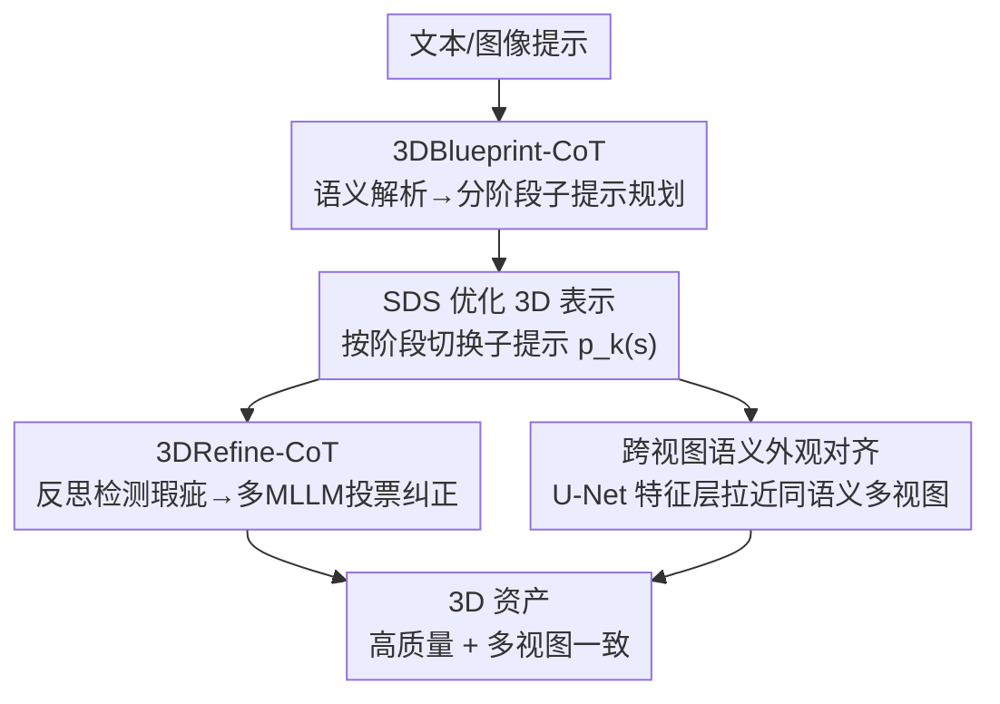

# Think-Then-Generate: Structural Chain-of-Thought Reasoning for Consistent 3D Generation

**会议**: CVPR 2026  
**论文**: [CVF Open Access](https://openaccess.thecvf.com/content/CVPR2026/html/Liu_Think-Then-Generate_Structural_Chain-of-Thought_Reasoning_for_Consistent_3D_Generation_CVPR_2026_paper.html)  
**代码**: 待确认  
**领域**: 3D视觉 / 扩散模型  
**关键词**: 文本到3D, SDS, 多视图一致性, Janus问题, 结构化CoT

## 一句话总结
Thoughtful3D 把 Chain-of-Thought（CoT）推理引入 SDS 式 3D 生成，用「先想后画」的双阶段结构化推理——生成前用 3DBlueprint-CoT 解析语义并把复杂提示拆成分阶段子目标，生成中用 3DRefine-CoT 多轮反思-纠正渲染瑕疵，再配一条跨视图语义外观对齐损失——显著缓解多视图不一致与 Janus 多面/引导坍塌问题，在 text-to-3D 和 image-to-3D 上质量与一致性全面提升。

## 研究背景与动机

**领域现状**：当前 text/image-to-3D 主流靠 Score Distillation Sampling（SDS）——用预训练 2D 扩散模型当视觉监督，渐进地优化 3D 表示（3D Gaussian、NeRF）的渲染输出。

**现有痛点**：2D 扩散模型天然缺乏 3D 几何先验，蒸出来的 3D 资产常出现**结构幻觉**和**多视图不一致**：经典的 **Janus 问题**（多面/多头，如兔子长三只耳朵、孔雀多个头）、以及面对复杂提示时的**引导坍塌（guidance collapse）**（部分物体被忽略，如「果冻罐」里的「罐」整个消失）。

**核心矛盾**：现有方法在整个训练过程中用**固定提示**。当提示很复杂时，多个属性修饰词同时优化会引发**梯度竞争与特征覆盖**；而「优雅」「可爱」这类抽象概念在几何初始化早期缺乏明确语义锚点，导致核心结构形成不稳定。换句话说，模型被要求「一口吃成胖子」，把所有约束塞进同一个固定提示里同时满足。

**切入角度**：作者注意到 CoT 在 NLP 和 2D 生成里已被证明能做「问题分解、语义对齐、布局规划」，于是发问：3D 生成能不能也借 CoT，把「一次性硬塞复杂提示」改成「先规划、再分步执行、边做边纠错」？

**核心 idea**：用双阶段结构化 CoT 把全局目标分解成一系列由易到难的子目标——**生成前**（3DBlueprint-CoT）规划，**生成中**（3DRefine-CoT）反思纠正，再加一条**跨视图语义外观对齐**在特征层面锁住一致性，三者协同地引导 SDS 优化走向高质量、高一致的 3D 资产。

## 方法详解

### 整体框架
Thoughtful3D 是一个 CoT 引导的 SDS 优化框架，把固定提示的「一步到位」拆成「先想后画 + 边画边纠」。给定文本/图像输入，**生成前** 3DBlueprint-CoT 先做语义解析与逻辑规划，把复杂提示按优化阶段拆成由简到繁的分阶段子提示；**生成中** 用两条机制联合优化 3D 模型：3DRefine-CoT 通过结构化推理检测渲染不一致（反思）并经多 MLLM 投票选出最优纠正结果（纠正），跨视图语义外观对齐则在 U-Net 特征层按共享语义把多视图特征拉近。最终损失把 SDS、纠正重建、跨视图对齐三项加权求和，统一驱动 3D 表示优化。

### 关键设计

**1. 3DBlueprint-CoT：生成前先把复杂提示拆成由易到难的分阶段蓝图**

复杂提示一次性喂给 SDS，多属性同时优化会梯度竞争、抽象词在早期没有几何锚点，导致结构崩。3DBlueprint-CoT 在优化前做两阶段结构化推理：**阶段一·语义解析**用统一 MLLM 把提示 $p$ 拆成三类成分 $S=\{S_o,S_a,S_h\}=M(p)$——物体 $S_o$、可度量属性对 $S_a$（如几何属性）、抽象概念 $S_h$（如风格）；**阶段二·规划**联合 $p$ 和 $S$ 生成分阶段步骤 $I=\{I_1,\dots,I_K\}$，每步 $I_k=(\tau_k,p_k)$ 给出时间区间和该区间用的子提示，复杂度随 $k$ 递增。SDS 优化时损失按阶段切换子提示：$L_{SDS}(\phi,x)=\mathbb{E}_{i,t,\pi}[\omega(t)\lVert \epsilon_\theta(x_t;t,p_{v(s)})-\epsilon\rVert^2]$，其中 $v(s)$ 把第 $s$ 步映射到所属区间。通常取 $K=3$，并用过渡窗 $\Delta T$ 线性插值平滑切换：$p_1$ 阶段只放核心物体 $S_o$，$p_2$ 阶段加上 $S_c+\lambda_a(s)S_a$ 引入显式属性，$p_3$ 阶段再叠加 $S_c+S_a+\lambda_h(s)S_h$ 引入抽象概念（⚠️ 公式中 $S_c$/$S_o$ 符号以原文为准）。这样模型先把「兔子」的骨架建稳，再逐步上「蓝色制服」「可爱」，避免一上来被一堆约束撕扯。

**2. 3DRefine-CoT：生成中多轮反思-纠正，并用多 MLLM 投票挑最优修正**

光有规划，3D 模型仍可能残留幻觉、Janus、低美感。3DRefine-CoT 在生成过程中做「反思 + 纠正」。**反思阶段**：每张渲染图 $V_i$ 与提示 $p$ 经结构化模板 $P_e$ 喂 MLLM 生成分层描述 $D_i=M(V_i,p;P_e)$，再从结构完整性、语义对齐、视觉质量三维度打分 $s_i$，以阈值 $\theta$ 把渲染分成参考组 $V_{ref}$（高于阈值）和待纠正组 $V_{target}$；对 $V_{target}$ 用对比模板 $P_c$ 输入三元组 $(V_i,D_i,V_{ref})$ 做多角度问题分析，把分析结果转成**负面提示** $P_{neg}=M(V_i,D_i,V_{ref};P_c)$，并做多轮独立推理以产出多样化、稳健的纠正建议。**纠正阶段**：目标图按 Hallo3D 思路加噪到 $x_T$ 保语义后，用正向提示 + 反思增强负面提示做 DDIM 采样得到一组候选纠正图，再由 **MLLM Consensus Selector** 多模型投票选最优——给定 $m$ 个评估器，评估器 $k$ 对候选 $V^{(r)}$ 选最高分 $e_k=\arg\max_r s_{k,r}$，候选 $r$ 得票 $c_r=\sum_{k=1}^m \mathbb{1}(e_k=r)$，最终按多数表决 $r^*=\arg\max_r c_r$ 取 $\hat V$。再用最终纠正图与原图的 MSE 损失 $L_{rc}=\lVert V_i-\hat V_i\rVert_2^2$ 回训 3D 模型。投票机制专治「单轮纠正给出冗余或错误建议」的不稳定。

**3. 跨视图语义外观对齐：在 U-Net 特征层锁住「同一属性跨视图一致」**

多视图同时做 SDS 时，原始 SDS 不考虑视图间的几何与语义关联，导致换视角时形变、重影、纹理不一致；而一些方法用固定特征选择做跨视图对齐，效果次优。作者发现「保持共享语义视图间的特征相似性」就足以换来一致几何，于是提出动态跨视图对齐：利用扩散 U-Net 交叉注意力天然能度量图文相似度，给定多视图图像 query 特征 $Q\in\mathbb{R}^{B,N,D}$ 和文本 key 特征 $K\in\mathbb{R}^{B,M,D}$（$B$ 为视点数），算相似矩阵 $S=QK^\top$，对每个文本特征检索 Top-K 最相似的图像 query 特征 $Q^K\in\mathbb{R}^{B,K,M,D}$，对齐损失为 $L_{align}=\sum_{1\le i<j\le N}\lVert Q_i^K-Q_j^K\rVert_2$。它在 U-Net 内部强制同语义的中间特征跨视图靠拢，比单视图、图像级优化更能压住几何漂移和不稳定。

### 损失函数 / 训练策略
总损失为三项加权和：$L_\Theta=\lambda_1 L_{SDS}+\lambda_2 L_{rc}+\lambda_3 L_{align}$，分别对应阶段化 SDS 蒸馏、3DRefine-CoT 的纠正重建 MSE、跨视图语义外观对齐。$\{\lambda_1,\lambda_2,\lambda_3\}$ 为超参，3DBlueprint-CoT 默认分 $K=3$ 个阶段并用过渡窗 $\Delta T$ 线性插值切换子提示。整个框架与现有 SDS 管线即插即用。

## 实验关键数据

> 指标定义：**CLIP Score** 在 360° 均匀采 16 视图上算文图相似度均值，衡量多视图一致与文图对齐；**CD**（Chamfer Distance，越低越好）与 **Vol. IoU**（越高越好）衡量几何重建质量；**PSNR/SSIM/LPIPS** 衡量视觉质量；**User Study** 从对齐(Align.)/质量(Qual.)/一致性(Cons.) 三维度人工打分。

### 主实验
text-to-3D（CLIP Score，越高越好；以 +Thoughtful3D 表示在该 baseline 上叠加本方法）：

| 方法 | B/32 | B/16 | L/14 | User Align. | User Qual. | User Cons. |
|------|------|------|------|------|------|------|
| GaussianDreamer | 21.45 | 26.71 | 27.33 | 6.44 | 5.58 | 6.14 |
| +Thoughtful3D | **24.65** | **29.15** | **30.39** | 8.03 | 8.75 | 8.55 |
| Magic3D | 16.28 | 22.52 | 22.75 | 5.02 | 6.30 | 5.32 |
| +Thoughtful3D | 19.64 | 25.14 | 25.27 | 7.72 | 8.31 | 8.09 |
| Fantasia3D | 16.71 | 20.45 | 21.28 | 4.78 | 5.26 | 6.31 |
| +Thoughtful3D | 23.33 | 26.75 | 27.26 | 8.72 | 9.03 | 7.88 |
| DreamFusion-IF | 16.40 | 22.98 | 23.22 | 4.99 | 5.19 | 5.23 |
| +Thoughtful3D | 21.98 | 27.87 | 28.67 | 8.26 | 8.19 | 8.39 |
| SJC | 21.03 | 26.16 | 26.56 | 5.54 | 5.08 | 5.71 |
| +Thoughtful3D | 24.39 | 29.63 | 29.98 | 8.36 | 9.10 | 8.25 |

image-to-3D（几何/视觉质量）：

| 方法 | CD ↓ | Vol. IoU ↑ | PSNR ↑ | SSIM ↑ | LPIPS ↓ |
|------|------|-----------|--------|--------|---------|
| Zero123 | 0.1521 | 0.3203 | 13.586 | 0.7808 | 0.2764 |
| +Thoughtful3D | 0.1398 | 0.3714 | 14.346 | 0.8085 | 0.2453 |
| Wonder3D | 0.1335 | 0.4025 | 16.050 | 0.8201 | 0.2047 |
| +Thoughtful3D | **0.1297** | **0.4343** | **16.353** | **0.8234** | **0.1965** |

可见无论作为 plug-in 接在哪个 baseline 上，Thoughtful3D 在所有指标上都带来一致提升——尤其 CLIP Score 和用户主观打分提升幅度最大。

### 消融实验
逐模块消去（GaussianDreamer 为基线，CLIP Score）。Module A = 3DBlueprint-CoT，B = 3DRefine-CoT，C = 跨视图语义外观对齐：

| 配置 | B/32 | B/16 | L/14 | 说明 |
|------|------|------|------|------|
| Baseline | 21.45 | 26.71 | 27.33 | GaussianDreamer 原始 |
| w/o A | 22.76 | 26.86 | 27.56 | 去规划：物体遗漏、属性错配（绿帽变蓝） |
| w/o B | 23.56 | 28.87 | 29.11 | 去反思纠正：重复面部特征、多出肢体 |
| w/o C | 23.97 | 27.90 | 29.42 | 去跨视图对齐：同一部位颜色跨视角漂移 |
| Thoughtful3D（Full） | **24.65** | **29.15** | **30.39** | 完整模型 |

### 关键发现
- **Module A（3DBlueprint-CoT）去掉掉点最多**：CLIP B/32 从 24.65 降到 22.76，且定性上出现物体遗漏与属性错配（帽子从指定的绿色变成蓝色）——说明「先规划、分阶段建结构」是质量的根基。
- **B、C 对跨视图一致性最关键**：去 B 会冒出重复面部特征、第三只手/脚；去 C 会让同一部位（手的颜色）在不同视角不一致。
- **即插即用**：在 5 个 text-to-3D + 2 个 image-to-3D baseline 上都稳定涨点，泛化到不同 SDS 框架而非绑定单一管线。
- ⚠️ text-to-3D 与 image-to-3D 用不同评测协议（前者无 GT 用 CLIP，后者有 GT 用 CD/IoU），两组数字不可直接横比。

## 亮点与洞察
- **「固定提示」是 SDS 复杂提示失败的根因**这一诊断很到位：把它换成「分阶段、由易到难地喂子提示 + 过渡窗平滑切换」，直接缓解梯度竞争和抽象词无锚点的问题，是本文最有迁移价值的洞察。
- **多 MLLM 投票挑纠正结果**很务实：单轮、单模型纠正容易给冗余或错误建议，用多评估器多数表决稳住了纠正质量，是把「MLLM 当裁判」用对地方的例子。
- **跨视图对齐放在 U-Net 特征层、且只需保持同语义特征相似**——比图像级或固定特征选择更轻、更有效，提示「一致性约束应该下沉到特征空间」。
- 整套方法作为 plug-in 接在任意 SDS baseline 上都涨点，工程上很友好。

## 局限与展望
- 流程重度依赖 MLLM（语义解析、反思打分、负面提示生成、投票纠正多处调用），推理成本和耗时显著高于原始 SDS，论文未报告额外开销。
- 3DBlueprint-CoT 默认 $K=3$ 阶段、阈值 $\theta$、$\{\lambda_1,\lambda_2,\lambda_3\}$ 等超参的敏感性分析不足；阶段划分与过渡窗如何随提示复杂度自适应仍是开放问题。
- 评测样本偏少（text-to-3D 100 个提示、image-to-3D 50 个物体、用户研究 30 人），且部分定性图来自 Google Images，统计显著性有限。
- 多 MLLM 投票纠正受评估器自身偏差/幻觉影响，可能把「看起来好但几何错」的结果选上；纠正用的负面提示质量上限受 MLLM 制约。

## 相关工作与启发
- **vs 原始 SDS（DreamFusion/Magic3D/SJC 等）**：它们用固定提示一次性优化，复杂提示下易 Janus 与引导坍塌；Thoughtful3D 用结构化 CoT 分阶段规划 + 反思纠正，作为 plug-in 普遍涨点。
- **vs 多视图扩散一致性增强（Wonder3D 等引入 3D 先验/多视图扩散）**：那类方法往往绑定特定框架；本文的跨视图特征对齐 + CoT 纠正不依赖特定架构，可叠加在多种 baseline 上通用增强一致性。
- **vs 2D 生成中的 CoT（问题分解/布局规划）**：本文把 2D 的 CoT 思路迁移到 3D，并针对 3D 独有的多视图一致性问题加了反思-纠正与跨视图对齐两层 3D 专属机制。

## 评分
- 新颖性: ⭐⭐⭐⭐ 首次把双阶段结构化 CoT 系统性引入 SDS 式 3D 生成，分阶段提示 + 反思纠正 + 跨视图对齐组合新颖。
- 实验充分度: ⭐⭐⭐ 覆盖 7 个 baseline、两类任务和消融，但样本规模小、缺超参敏感性与开销分析。
- 写作质量: ⭐⭐⭐⭐ 动机（固定提示之弊）与三模块机制讲得清楚，公式与图示充分。
- 价值: ⭐⭐⭐⭐ 作为即插即用的一致性增强器对 SDS 生态有实用价值，但 MLLM 重调用带来的成本是落地门槛。

<!-- RELATED:START -->

## 相关论文

- [\[CVPR 2026\] S$^2$-MLLM: Boosting Spatial Reasoning Capability of MLLMs for 3D Visual Grounding with Structural Guidance](s2-mllm_boosting_spatial_reasoning_capability_of_mllms_for_3d_visual_grounding_w.md)
- [\[CVPR 2026\] Unleashing the Power of Chain-of-Prediction for Monocular 3D Object Detection](unleashing_the_power_of_chain-of-prediction_for_monocular_3d_object_detection.md)
- [\[CVPR 2026\] Multi-view Consistent 3D Gaussian Head Avatars 'without' Multi-view Generation](multi-view_consistent_3d_gaussian_head_avatars_without_multi-view_generation.md)
- [\[CVPR 2026\] C-GenReg: Training-Free 3D Point Cloud Registration by Multi-View-Consistent Geometry-to-Image Generation with Probabilistic Modalities Fusion](c-genreg_training-free_3d_point_cloud_registration_by_multi-view-consistent_geom.md)
- [\[CVPR 2026\] FunFact: Building Probabilistic Functional 3D Scene Graphs via Factor-Graph Reasoning](funfact_building_probabilistic_functional_3d_scene_graphs_via_factor-graph_reaso.md)

<!-- RELATED:END -->
