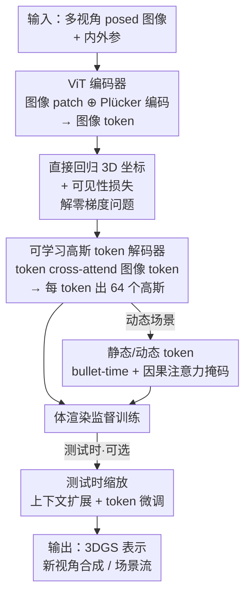

# TokenGS: Decoupling 3D Gaussian Prediction from Pixels with Learnable Tokens

**会议**: CVPR 2026  
**论文**: [CVF Open Access](https://openaccess.thecvf.com/content/CVPR2026/html/Ren_TokenGS_Decoupling_3D_Gaussian_Prediction_from_Pixels_with_Learnable_Tokens_CVPR_2026_paper.html)  
**代码**: 无  
**领域**: 3D视觉  
**关键词**: 前馈3DGS重建, 可学习高斯token, 编码器-解码器, 直接坐标回归, 测试时优化

## 一句话总结
TokenGS 把前馈式 3D Gaussian Splatting 重建从「每个像素回归一条射线上的深度」改成「一组可学习的高斯 token 直接回归 3D 坐标」，从而让高斯数量彻底脱钩于输入分辨率和视角数量，在静态/动态场景上都拿到 SOTA，且几何更干净、对位姿噪声更鲁棒，并支持低成本的测试时 token 微调。

## 研究背景与动机
**领域现状**：前馈神经重建近年进展很快，主流范式是用一个大的 encoder-only Transformer（如 GS-LRM、MVSplat、DepthSplat）从多张带位姿的图像直接预测「像素对齐」的 3DGS 基元——即每个像素（或 patch）沿相机射线预测一个深度，再把深度反投影成高斯的中心 $\mu$。

**现有痛点**：这种像素对齐范式有三个根上的毛病。其一，把高斯均值当作射线上的深度来预测，模型很难内部纠正噪声位姿和多视角不一致，对动态场景更是别扭（点/像素需要随时间 warp）。其二，高斯数量被死死绑在分辨率 × 视角数上——32 张 512×512 图像就会产出 800 万+ 个高斯，而把同一场景的输入重复 N 次就会得到 N 倍冗余高斯，表示规模跟着视角数走、而不是跟着场景复杂度走。其三，前馈重建本可以在测试时做自监督精修，但直接优化高斯参数会破坏网络学到的先验，在少视角下尤其明显。

**核心矛盾**：根子在于「高斯基元 ↔ 输入像素」被硬绑定了——位置绑在相机射线上、数量绑在像素网格上。这条耦合既限制了几何表达能力（遮挡区域补不出来），又制造了冗余和不鲁棒。

**本文目标**：解开这条耦合——让高斯的位置不再沿射线、让高斯的数量不再等于像素数，同时还要能稳定训练、支持动态场景、支持测试时优化。

**切入角度**：作者借鉴前馈 SfM 模型（如 VGGT）里的 point-map 思路——直接回归 3D 坐标而非深度；但关键区别是**不用任何显式 point-map / 深度真值监督**，只靠自监督渲染损失训练。一旦预测的是自由 3D 坐标而非射线深度，就可以把 encoder-only 换成 DETR 式的 encoder-decoder，用一组可学习 token 去 cross-attend 图像特征。

**核心 idea**：用「一组可学习的高斯 token 直接回归 3D 坐标」代替「逐像素回归射线深度」，让预测的高斯数量变成一个与输入无关的超参数。

## 方法详解

### 整体框架
输入是 $N$ 张带外参 $\{T_i \in SE(3)\}$ 和内参的 posed 图像，输出是一组 $M$ 个 3DGS 基元 $G \in \mathbb{R}^{M\times 14}$（每个高斯含均值 $\mu\in\mathbb{R}^3$、颜色 $c$、尺度 $s$、不透明度 $\sigma$、四元数旋转 $q$），可经体渲染合成新视角。整条管线分三步：编码器把多视角图像 + 相机参数编成图像 token；解码器让一组可学习的 3DGS token 通过 cross-attention 从图像 token 里「取」出每个高斯的 14 维属性（含直接回归的 3D 坐标）；训练完成后，可选地在测试时只微调 token embedding 来进一步提质。直接回归坐标会引入「零梯度」难题，作者用一个可见性损失把它兜住。

### 关键设计

**1. 直接回归 3D 坐标 + 可见性损失：解开高斯位置和相机射线的绑定**

像素对齐方法把高斯中心当作沿射线的深度来预测，这意味着每个高斯只能落在某条相机射线上，遮挡区域、相机视锥外的几何就补不出来，且位姿一旦有噪声、整套预测就跟着歪。TokenGS 干脆在一个由相机外参定义、所有视角共享的全局坐标系里**直接回归 $\mu$ 的 3D 坐标**，且只用自监督渲染损失训练（不用 point-map 真值——那种监督既难获取又会重新把均值拉回射线上，正是要避免的耦合）。XYZ 用 $f(x)=\mathrm{sign}(x)\cdot(\exp(x)-1)$ 激活映射到实数域。这一改带来三个直接好处：能外推/补全输入视角之外的几何、对位姿噪声更鲁棒、消除深度预测网络常见的「尖刺」伪影。

但直接回归坐标有个非平凡的训练难题——**零梯度问题**：落在所有相机视锥之外的高斯不参与任何渲染监督，因此从渲染损失拿不到梯度，这些「死」高斯会拖垮训练稳定性、浪费模型容量、变成场景周围漂浮的噪点。作者不走 VGGT 那种显式 3D 监督的老路，而是引入一个**可见性损失**：把每个高斯中心 $\mu_m=(x_m,y_m,z_m)$ 投影到所有监督视角的图像平面，得到像素坐标后按宽高归一化

$$\tilde{u}_m^i = 2(u_m^i/W)-1, \qquad \tilde{v}_m^i = 2(v_m^i/H)-1,$$

落在图像内的点满足 $\tilde{u},\tilde{v}\in[-1,1]$。损失度量每个高斯到「最近可见边界」的距离：

$$\mathcal{L}_{\text{vis}} = \sum_m \min_{\mathbf{I}_i\in\mathcal{I}_{sup}}\left[\mathrm{ReLU}(|\tilde{u}_m^i|-1)+\mathrm{ReLU}(|\tilde{v}_m^i|-1)\right].$$

只要高斯至少投进一个视角，这一项就是 0；否则提供梯度把它拉回视野（实践中用常数 1.0 截断以避免虚假梯度）。总损失为 $\mathcal{L}=\mathcal{L}_{\text{MSE}}+\lambda_{\text{SSIM}}\mathcal{L}_{\text{SSIM}}+\lambda_{\text{vis}}\mathcal{L}_{\text{vis}}$。消融显示它带来 0.4 PSNR 提升并去掉漂浮噪点。

**2. 可学习高斯 token 的编码器-解码器：解开高斯数量和图像分辨率的绑定**

光改坐标参数化还不够——只要还是 encoder-only、逐像素出高斯，数量就还绑在分辨率上。作者采用 DETR 式的 encoder-decoder。编码器是 ViT：每张视图 patch 化后线性投影到 $C$ 维，同时把每个视图对应的 Plücker 坐标也 patch 化投影，两者相加 $a_{vk}=x_{vk}+s_{vk}$ 后展平成所有视图的 token 序列，过标准 ViT 层（允许跨视角注意力）得到图像 token $B$。解码器初始化 $N_t$ 个可学习 token embedding（即 3DGS token），每个解码块做三件事：(i) 对图像 token $B$ 做 cross-attention，(ii) GS token 之间做 self-attention，(iii) 逐 token MLP。每个输出 embedding 经线性层回归出 $N_G=64$ 个高斯（共 14 维属性，颜色/不透明度用 scaled tanh、尺度用截断 exp、旋转单位归一化）。

关键在于：**每个高斯 token 的解码独立于输入像素数**，于是预测高斯总数 $N_t\times N_G$ 变成一个与分辨率、视角数都无关的超参数。这样模型能把高斯自由分配到场景复杂度高的地方——实验发现 token 会自发把更多高斯分给高频细节区域，且单个 token 产出的高斯在场景内聚集、跨场景落在相似 3D 位置，呈现出类似 slot 专门化的现象。由于图像 token 通常远多于 GS token（$N_I\gg N_t$），作者让所有解码器 cross-attention 层**共享图像 token 的 key–value 投影**（开头算一次），把 $O(N_I D_{dec})$ 的显存占用压到 $O(N_I)$，从而能堆更深的解码器（24 层）。此外用 LayerScale 和 QK-normalization 稳训练，并刻意去掉回归头前的 LayerNorm（发现它反而掉点）。

**3. 静态/动态 token + bullet-time + 因果注意力掩码：把动态场景拆成结构与运动**

像素对齐表示无法让高斯中心随时间移动（BTimer 只能靠改不透明度让动态物体「忽隐忽现」来凑），而 TokenGS 预测的是连续 3D 坐标，天然能表达运动。作者把 token 集拆成静态 $T^S$（时间不变）和动态 $T^D$ 两组，给每个动态 token 加一个 bullet-time 时间嵌入：

$$\tilde{T}^D_j(t) = T^D_j + \mathrm{Linear}(\tau(t)),$$

其中 $\tau(t)$ 是正弦编码再线性投影。在解码器 self-attention 里施加**结构化因果掩码**：动态 token 只能单向 attend 静态 token（dynamic→static），静态 token 之间互相 attend，动态 token 各自互相 attend，但静态不 attend 动态。这条归纳偏置表达「场景的动态部分依赖于静态结构」，让模型自动把场景分解成时间不变的结构 + 时变运动，同时让动态 token 在所有帧间保持一致的对应关系——于是不仅能重建中间时刻的运动，还涌现出可跟踪的场景流。

**4. 双轴测试时缩放：上下文扩展 + token 微调，免重训提质**

encoder-decoder 设计天然支持两种互补的测试时缩放，都不需重训网络。**上下文扩展（CE）**：推理时喂比训练时更多的图像 token（如训练 2 视角、测试给 4 视角）——在 encoder-only 范式里这会增加预测高斯数，而这里高斯数固定、只是上下文变长，质量随之提升（实验显示最多受益于 4× 输入后饱和）。**Token 微调（TT）**：一种轻量测试时训练，**只**微调高斯 token embedding，网络参数和图像特征全部冻结，用输入视角的自监督跑几十步梯度。少量步数就能让注意力模式适配具体场景，改善高斯参数同时保住网络里学到的全局先验。作者特意对比了「直接优化高斯参数」的 baseline：后者在多视角、问题适定时 PSNR 更高、收敛更快，但过度优化会破坏几何（在新视角下崩坏），而 token 微调改善几何——这正反映 token 里编码了更强的先验。两种缩放可叠加。

## 实验关键数据

### 主实验

RealEstate10K（2 视角，256×256）上，TokenGS 用更少高斯打平/超过像素对齐 SOTA：

| 方法 | PSNR↑ | SSIM↑ | LPIPS↓ | #GS |
|------|-------|-------|--------|-----|
| MVSplat | 26.39 | 0.869 | 0.128 | 131K |
| DepthSplat | 27.47 | 0.889 | 0.114 | 131K |
| GS-LRM | 28.10 | 0.892 | 0.114 | 131K |
| Ours (1024 tok) | 28.02 | 0.896 | 0.147 | **66K** |
| Ours (4096 tok) | 28.41 | 0.903 | 0.135 | 262K |
| Ours (4096 tok, +TT) | **28.82** | **0.910** | 0.130 | 262K |

基础模型用 50% 的高斯就达到 GS-LRM 同档 PSNR；微调版用 2× 高斯明确胜出；TT 进一步提质且即便只有 2 个训练视角也不过拟合。

DL3DV 上测跨上下文长度泛化（模型只在 4 视角训练，2/6 视角用上下文扩展，记作 Ours*）：

| 方法 | #Views | PSNR↑ | LPIPS↓ | Time(s) | #GS |
|------|--------|-------|--------|---------|-----|
| DepthSplat | 6 | 24.19 | 0.147 | 0.132 | 688K |
| Ours* | 6 | 23.69 | 0.311 | 0.085 | 262K |
| Ours* (+TT) | 6 | **24.51** | 0.295 | 5.61 | **262K** |

6 视角下 Ours+TT 用少 72% 的高斯反超 baseline，且前馈推理更快（0.085s vs 0.132s）。视角外推（Tab.3）上，TokenGS 不用任何 point-map/深度标注就超过 baseline，并追平用 PM-Loss 点图监督微调过的版本。动态场景 Kubric 4D（4 视角，Tab.4）上 PSNR 24.84 超过 BTimer 的 24.45。

### 消融实验

| 配置 / 分析 | 关键指标 | 说明 |
|------|---------|------|
| w/o 可见性损失 | PSNR 28.4 | 出现漂浮噪点、几何退化 |
| w/ 可见性损失 | PSNR 28.8 | +0.4 PSNR，去掉 floaters |
| token 微调（TT） | 几何改善 | 保住先验，新视角更锐 |
| 直接优化高斯参数 | 近视角 PSNR 更高但几何崩 | 过度优化破坏几何 |
| token 数 256→4096 | PSNR 单调上升 | 与视角数解耦的二维可调 |

### 关键发现
- **可见性损失是直接坐标回归能跑通的关键**：它专治零梯度问题导致的 floater，去掉后掉 0.4 PSNR 并出现退化几何。
- **token 微调 vs 高斯参数微调揭示了「先验」的价值**：直接调高斯参数在量化指标（近视角 PSNR）上更好，却会破坏几何；只调 token 反而改善几何——说明 token 空间编码了更强的全局先验，这是本文「在 token 空间做测试时优化」的核心论据。
- **高斯数与视角数二维独立可调**：token 数从 256 到 4096，质量随之上升且与输入视角数无关，让人能在「压缩效率」和「重建保真」之间自由权衡，这是像素对齐方法天生做不到的。
- **token 自发专门化**：单个 token 的高斯在场景内聚集、跨场景落在相似位置，高频区域分到更多 token/高斯。

## 亮点与洞察
- **把 DETR 的「object query」思路搬到 3DGS**：用一组可学习 token 当「高斯查询」，一举解开高斯数量对分辨率/视角数的依赖——这是个干净利落、可迁移的结构性洞察，本质是把「逐像素稠密预测」换成「固定容量的 set prediction」。
- **可见性损失是「自监督直接回归坐标」的关键缝合点**：不靠任何 3D 真值、只用一个把高斯往视野里拉的软约束，就绕开了 point-map 监督会重新引入射线耦合的两难，设计很巧。
- **「token 空间优化保先验」可迁移**：在冻结主干、只调一小撮 token embedding 上做测试时训练，这套「轻量适配且不破坏先验」的范式可借鉴到其他前馈预测任务。
- **动态建模的因果掩码**很优雅：用单向 dynamic→static 注意力把「运动依赖结构」写进归纳偏置，顺带涌现出场景流和静动分解。

## 局限与展望
- **作者承认的局限**：继承前馈方法通病，大尺度环境和细粒度几何细节会吃力；测试时 token 微调相对昂贵，通常要几十步优化（表中 TT 把推理从 ~0.08s 拉到 4–5.6s）。
- **指标的两面性**：TokenGS 的 LPIPS 普遍比 baseline 差（如 DL3DV 4 视角 0.314–0.326 vs DepthSplat 0.178），PSNR/SSIM 占优但感知指标偏弱，说明渲染细节锐度仍有差距，论文未深入讨论这一权衡。
- **直接优化高斯参数其实量化更优**：作者自己指出在多视角适定场景下直接调高斯参数 PSNR 更高更快，TT 的卖点主要在「保几何」而非「最高分」，混合策略（token + 高斯联合优化）留作未来工作。
- **改进思路**：探索 token 数自适应分配（按场景复杂度动态增减 token）、把 TT 步数压下来、以及联合 token/高斯优化以兼顾量化指标与几何质量。

## 相关工作与启发
- **vs GS-LRM / 像素对齐前馈方法**：它们逐像素沿射线回归深度、高斯数 = 像素数；TokenGS 直接回归 3D 坐标、用 token 解耦数量。优势是更干净几何（去尖刺）、更鲁棒于位姿噪声、可外推补全；代价是 LPIPS 偏弱、TT 较慢。
- **vs VGGT 等前馈 SfM**：同样直接回归 3D 坐标/point-map，但 VGGT 用显式 3D/深度监督；TokenGS 只用自监督渲染损失 + 可见性损失，避免了真值难获取且会把点拉回射线的问题。
- **vs BTimer（动态）**：BTimer 像素对齐表示无法移动高斯中心，靠改不透明度凑动态导致物体闪烁；TokenGS 用连续 3D 坐标 + bullet-time 动态 token，运动连续、可跟踪，PSNR 也更高。
- **vs PM-Loss 微调**：在视角外推上，TokenGS 无需点图监督即可追平甚至超过用 PM-Loss 点图监督微调的 baseline。

## 评分
- 新颖性: ⭐⭐⭐⭐⭐ 把高斯位置和数量同时从像素中解耦，DETR 式 token + 直接坐标回归 + 可见性损失是一套自洽且少见的组合
- 实验充分度: ⭐⭐⭐⭐ 静态/动态/外推/位姿噪声/测试时缩放都覆盖，消融扎实；但 LPIPS 劣势未充分讨论
- 写作质量: ⭐⭐⭐⭐ 动机层层推导、设计与问题一一对应、图表清晰
- 价值: ⭐⭐⭐⭐⭐ 为前馈 3DGS 提供了「解耦像素」的新范式，二维可调 + 保先验测试时优化对实际部署很有吸引力

<!-- RELATED:START -->

## 相关论文

- [\[CVPR 2026\] ExtrinSplat: Decoupling Geometry and Semantics for Open-Vocabulary Understanding in 3D Gaussian Splatting](extrinsplat_decoupling_geometry_and_semantics_for_open-vocabulary_understanding_.md)
- [\[CVPR 2026\] Featurising Pixels from Dynamic 3D Scenes with Linear In-Context Learners](featurising_pixels_from_dynamic_3d_scenes_with_linear_in-context_learners.md)
- [\[CVPR 2026\] Registration-Free Learnable Multi-View Capture of Faces in Dense Semantic Correspondence](registration-free_learnable_multi-view_capture_of_faces_in_dense_semantic_corres.md)
- [\[CVPR 2026\] ORD: Object-Relation Decoupling for Generalized 3D Visual Grounding](ord_object-relation_decoupling_for_generalized_3d_visual_grounding.md)
- [\[CVPR 2026\] PaNDaS: Learnable Shape Interpolation Modeling with Localized Control](pandas_learnable_shape_interpolation_modeling_with_localized_control.md)

<!-- RELATED:END -->
