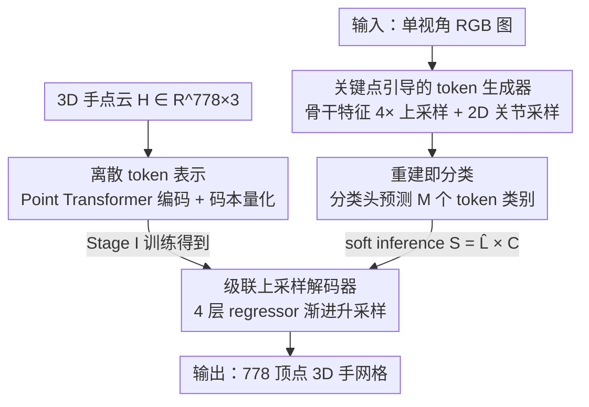

# TokenHand: Discrete Token Representation for Efficient Hand Mesh Reconstruction

**会议**: CVPR 2026  
**论文**: [CVF Open Access](https://openaccess.thecvf.com/content/CVPR2026/html/He_TokenHand_Discrete_Token_Representation_for_Efficient_Hand_Mesh_Reconstruction_CVPR_2026_paper.html)  
**代码**: 无  
**领域**: 3D视觉  
**关键词**: 手部网格重建, 离散 token, 向量量化, 分类式重建, 实时推理

## 一句话总结
TokenHand 把一只 3D 手编码成 $M$ 个共享码本里的离散 token，再把"从单张图重建手网格"这件事从回归问题改写成 token 分类问题——分类器只需预测每个 token 的类别，一个预训练好的轻量解码器就能无后处理地还原 778 顶点网格，在 FreiHAND 上做到 PA-MPJPE 5.7mm、65 FPS、参数量仅 3.0M。

## 研究背景与动机

**领域现状**：单视角手部网格重建主流分两派。一派以 MANO 参数化模型为先验，用网络回归形状/位姿系数（如 HandOccNet、MobRecon）；另一派直接回归 778 个网格顶点的 3D 坐标，借助 Transformer/GCN 建模顶点间关系（如 METRO、MeshGraphormer、PointHMR）。

**现有痛点**：两派各有硬伤。MANO 派受其运动链（kinematic chain）结构所累，位姿误差会沿链条层层累积——腕关节一点点偏差，传到指尖就被放大成显著位移，鲁棒性差。顶点回归派为了恢复细节，往往堆一个很重的 Transformer 解码器（METRO 102M、MeshGraphormer 98M 参数），精度上去了但推理慢、部署难。

**核心矛盾**：重建质量与推理效率之间长期是 trade-off。直接回归连续顶点坐标，输出空间巨大且无强约束，既容易产生不真实/残缺的手，又得靠大模型硬扛。

**本文目标**：在 AR/VR、机器人模仿学习这些要求实时的场景里，同时满足高精度 + 高鲁棒 + 低延迟。

**切入角度**：作者观察到手的几何是高度结构化的——一只手可以被拆成若干"子结构"（如某根手指的某段），它们的可能形态其实是有限且可枚举的。那么与其在连续空间里回归一堆坐标，不如先学一套"手的零件词典"（码本），把任意一只手压缩成几个词典索引。

**核心 idea**：用"离散 token + 分类"代替"连续坐标 + 回归"——先用 VQ 把手编码成 $M$ 个码本 token，再让网络去**分类**每个 token 属于哪个码本条目，分类结果交给冻结的解码器还原网格。

## 方法详解

### 整体框架

TokenHand 输入一张裁剪后的单视角 RGB 图，输出一个拓扑跟随 MANO、含 778 个顶点的 3D 手网格。整个系统分两阶段：**Stage I 学一套手的离散 token 表示**（编码器 + 码本 + 解码器，纯几何，不看图像），**Stage II 把图像重建改写成 token 分类**（骨干网 + token 生成器 + 分类头，复用 Stage I 训好的冻结解码器）。两阶段的纽带是那本共享码本：Stage I 教会码本"手的零件长什么样"，Stage II 只需预测每个零件用哪个词。

### 关键设计

**1. 离散 token 表示：把一只手压成码本里的 $M$ 个索引**

痛点直指连续顶点回归"输出空间无约束、易出畸形手"。作者借鉴 VQ-VAE 的思路，在 Stage I 用一个 Point Transformer 编码器 $f_e$ 把手点云 $H \in \mathbb{R}^{778\times3}$ 映射成 $M$ 个 token 特征 $T=(t_1,\dots,t_M)=f_e(H)$，每个 $t_i$ 大致对应手的某个子结构（论文 Fig.1 显示：只改一个 token 的取值，重建出的手总是同一处子结构在变）。随后定义一本**共享码本** $C=(c_1,\dots,c_K)^\top \in \mathbb{R}^{K\times D}$，每个 token 通过最近邻查找被量化成一个离散索引：

$$q(t_i=k\mid H)=\begin{cases}1 & k=\arg\min_j \lVert t_i-c_j\rVert_2,\\ 0 & \text{otherwise.}\end{cases}$$

所有 token 共用同一本码本（而非每个位置一本），训练更稳更高效。这一步的意义是：码本张成的空间足够表达多样手型/位姿，于是"重建"被转化成"从这个有限离散集合里挑组合"，天然带上了强先验，畸形/残缺手被挡在码本之外。论文也指出 token 间存在一定冗余（不同 token 可能覆盖重叠子结构），但这种冗余反而扩大了表达覆盖面。

**2. 重建即分类：用 token 分类取代坐标回归**

这是全文的题眼。既然手已经被表示成 $M$ 个码本索引，Stage II 就不必再回归连续坐标——给定图像 $I$，骨干网提特征 $X_b$，token 生成器产出 token 特征 $X_m$，分类头直接预测每个 token 属于码本 $K$ 个条目中的哪一类，输出 logits $\hat L \in \mathbb{R}^{M\times K}$，再交给 Stage I 那个**冻结的**解码器无后处理还原网格。分类头的具体构造是：两个残差卷积块精炼特征 → 展平 + 线性投影 $X_f=L(\text{Flatten}(C(X_m)))$ → reshape 成 $\mathbb{R}^{M\times D}$ → 4 个 MLP-Mixer 块建模 token 间依赖 → 输出 $\hat L=\mathcal{M}(X_f)$。

为什么有效：分类的输出空间是离散且受码本约束的，比连续回归的解空间小得多也更规整，分类器更容易学、也不容易产生不真实的手；而把误差累积大户——重的解码器——直接复用 Stage I 训好的冻结模块，使 Stage II 极其轻量，正是 65 FPS / 3.0M 参数的来源。训练时用交叉熵 $\ell_{cls}=\text{CE}(\hat L, L)$ 监督，其中 GT 标签 $L$ 由预训练编码器对 GT 手编码得到。

**3. 级联上采样解码器 + 抗码本坍缩：让轻量解码器也能还原细节**

token 只有 $M$ 个，怎么涨回 778 个顶点？作者借鉴多阶段近似的思路，搭了一个**级联上采样网格解码器**：由 4 个 regressor 层串联，每层 = 降维层 + MetaFormer 块（token mixer 用多头自注意力）+ 上采样层。token 数沿 $[48,97,194,389]\to[97,194,389,778]$ 逐层渐进翻倍，特征维度沿 $[256,128,64,32]$ 逐层收窄，最后映射到 3D 坐标。Stage I 用重建 L1 + commitment 项联合优化编码器/码本/解码器：

$$\ell=w_{rec}L_1(\hat H,H)+\beta\sum_{i=1}^{M}\lVert t_i-\text{sg}[c_{q(t_i)}]\rVert_2^2,\quad w_{rec}=10,\ \beta=5,$$

$\text{sg}$ 为 stop-gradient。VQ 训练的老问题是**码本坍缩**（只有少数条目被用到），作者用 EMA 更新 + Code Reset 机制重置死条目来缓解，保证码本利用率和训练稳定性。这套设计让一个很小的解码器（靠码本提供结构先验）就能恢复细节，无需像 METRO 那样堆大解码器。

**4. 关键点引导的 token 生成器 + soft inference：让特征对齐、梯度可回传**

token 生成器要解决"从骨干特征里抽出空间对齐的 token 特征"。作者沿用 MobRecon 的关键点引导采样：骨干先经全局池化预测 2D 手关节位置，再把骨干特征图 **4× 上采样**（分辨率升到 28×28），用预测的 2D 关节坐标在升采样特征上采样对应空间位置，得到 token 特征 $X_m$。消融（Tab.8）显示这一步——升采样后再做关键点采样（Method D）——是性价比最高的配置：只用全局特征最差，提分辨率到 28×28 才带来明显增益，而额外加卷积或换成 coarse-mesh 采样都没有进一步收益。

另一个细节是**soft inference**：硬选 token（argmax）不可导，无法把解码器的重建误差回传到分类头。作者把硬选择换成软插值 $S=\hat L \times C$（用 logits 对整本码本做加权），$S\in\mathbb{R}^{M\times D}$ 再喂给冻结解码器得到 $\hat H$，从而打通梯度。重建损失监督顶点、3D 关节、2D 关节，其中 3D 关节由顶点经固定回归矩阵 $J_{3d}=J\times V_{3d}$ 算出：

$$\ell_{rec}=w_{3d}L_{J3d}+w_{2d}L_{J2d}+w_{vert}L_{vert},\quad (w_{3d},w_{2d},w_{vert})=(10,1,10).$$

2D 关节只作辅助监督（服务点采样，精度要求不高）。总目标 $\ell_{all}=\ell_{cls}+\ell_{rec}$，解码器全程冻结。

### 损失函数 / 训练策略
- **Stage I（tokenization）**：编码器 = Point Transformer，解码器 = 4 个 regressor 层；码本 $512\times512$；AdamW，lr 6e-3、weight decay 0.05、batch 128、200 epoch；用多数据集（FreiHAND/DexYCB/InterHand2.6M/OakInk/HO3D/ReInterHand）的 MANO 参数生成手点云，每个 pose 只留一个视角去冗余。
- **Stage II（重建）**：骨干 FastViT-MA36（ImageNet 预训练初始化）；AdamW，lr 5e-4（50 epoch 后降到 5e-5）、batch 64、300 epoch；增广含噪声/翻转/旋转/缩放；解码器冻结。

## 实验关键数据

### 主实验

FreiHAND（无 TTA、无 TensorRT，FPS 在统一设置下测）。TokenHand 在精度与速度上同时领先：相比非实时的 MeshGraphormer 提速 ≥35 FPS 还更准，相比实时的 FastViT 在相近速度下 PA-MPJPE 好 0.9mm。

| 方法 | 骨干 | PA-MPJPE ↓ | PA-MPVPE ↓ | F@05 ↑ | FPS |
|------|------|-----------|-----------|--------|-----|
| MobRecon [9] | DenseStack | 6.9 | 7.2 | 0.694 | 80 |
| METRO [51] | HRNet | 6.7 | 6.8 | 0.717 | 27 |
| MeshGraphormer [29] | HRNet | 6.3 | 6.5 | 0.738 | 24 |
| FastViT [1] | FastViT-MA36 | 6.6 | 6.7 | 0.722 | 84 |
| Zhou et al. [55] | HRNet | 5.8 | 6.1 | 0.766 | 33 |
| **Ours** | FastViT-MA36 | **5.7** | **5.9** | **0.768** | 65 |

参数效率（剔除骨干后对比）：TokenHand 解码侧仅 3.0M，约为 Transformer 派的 10%。

| 方法 | #Params | PA-MPJPE ↓ | PA-MPVPE ↓ |
|------|---------|-----------|-----------|
| METRO [51] | 102M | 6.7 | 6.8 |
| MeshGraphormer [29] | 98M | 6.3 | 6.5 |
| FastMETRO [11] | 25M | 6.5 | 7.1 |
| **Ours** | **3.0M** | **5.7** | **5.9** |

在大规模手-物交互数据集 DexYCB（S0 协议）上同样全面领先：MPJPE 12.3 / MPVPE 12.0，较 H2ONet 的 MPJPE 提升 1.7mm，验证泛化性。

### 消融实验

| 配置 | 关键指标 (PA-MPJPE / PA-MPVPE) | 说明 |
|------|------|------|
| 1 层 regressor, [48] | 6.4 / 6.8 | 单层容量不足 |
| 2 层, [48,389] | 6.1 / 6.3 | 加一层即提 ~0.3mm |
| **4 层, [48,97,194,389]** | **5.7 / 5.9** | ×2 渐进升采样，最佳 |
| 4 层, [48,128,256,512] | 5.9 / 6.1 | 偏离 ×2 缩放即变差 |
| token 生成器 Method A (1×1 全局) | 6.2 / 6.5 | 只用全局特征最差 |
| token 生成器 Method C (7×7 关键点采样) | 6.0 / 6.3 | 低分辨率提升有限 |
| **token 生成器 Method D (28×28 上采样+关键点)** | **5.7 / 5.9** | 默认配置 |
| token 生成器 Method E (28×28 + 额外卷积) | 5.7 / 5.9 | 额外卷积无增益 |

### 关键发现
- **解码器深度与 ×2 升采样最关键**：从 1 层加到 4 层 regressor，PA-MPJPE 5.7 vs 6.4；且 token 数必须按 ×2 渐进翻倍，换成 [48,128,256,512] 这种非 ×2 缩放立刻掉到 5.9，说明分层倍增是有效的特征聚合结构。
- **MetaFormer 块越多反而越差**：每层 block 数从 1 加到 3，PA-MPJPE 5.7→5.8，增加算力几乎无益甚至略降——支持"靠码本先验、解码器保持轻量"的设计哲学。
- **码本尺寸不敏感**：384/512/640 三档下重建误差基本持平（PA-MPJPE ~4.9-5.1 范围，Stage I 测），说明所选码本已足够表达数据集中的手型分布。
- **token 生成的关键是分辨率而非花哨结构**：把骨干特征 4× 升采样到 28×28 带来明显增益，但在其上再叠卷积（E）或换 coarse-mesh 采样（F）都没有进一步好处。
- **骨干选择**：ResNet50/DenseStack 6.7 → HRNet 6.1 → FastViT-MA36 5.7，码本表示在各骨干下都稳定有效。

## 亮点与洞察
- **把重建改写成分类，是个很"对"的表述转换**：手的子结构形态本质有限，离散化后输出空间可枚举、受码本强约束，既天然抗畸形手、又让分类器比回归器好学——这是同时拿下精度和效率的根本原因，而非靠工程堆料。
- **"训一本几何码本 + 冻结复用解码器"是可迁移的范式**：把昂贵的解码能力前置到 Stage I 一次性学好并冻结，Stage II 只剩轻量分类，3.0M 参数做到 SOTA。这套"几何先 tokenize、下游做分类"的思路可迁移到人体/人脸网格、点云补全等结构化几何重建任务。
- **soft inference 这个小 trick 很实用**：用 $S=\hat L \times C$ 的软加权代替不可导的 argmax 来打通梯度，让重建损失能监督到分类头，是离散表示做端到端训练的通用解法。
- **作者点出离散 token 可对接文本等离散模态**：手被表示成"词"之后，天然方便与文本驱动的手建模等离散模态融合（虽超出本文范围），指向一个有想象空间的方向。

## 局限与展望
- **依赖 MANO 拓扑与点云 GT**：Stage I 用各数据集的 MANO 参数生成手点云来学码本，本质仍绑定 MANO 拓扑（778 顶点），码本对训练分布外的极端手型/畸形手的覆盖未充分检验。
- **两阶段训练、非端到端**：码本/解码器在 Stage I 单独训好后冻结，Stage I 的重建上限（如码本表达力）会成为 Stage II 的天花板，二者无法联合微调互相纠偏。
- **未直接处理遮挡与双手交互**：论文动机提到遮挡难点，但方法层面没有显式的遮挡建模；DexYCB 虽含手-物交互，双手/重度遮挡场景的鲁棒性仍待验证。
- **token 冗余被当成优点但缺乏量化**：作者称 token 间冗余增强表达，但没给码本利用率、token-子结构对应的定量分析，"每个 token 对应一个子结构"更多是定性可视化结论。

## 相关工作与启发
- **vs MANO 参数回归派（HandOccNet / MobRecon）**：它们回归 MANO 形状/位姿系数，受运动链结构所累、误差沿链累积（腕部小偏差放大到指尖）；本文不回归连续参数，而是分类离散 token，子结构间保持局部独立、不影响全局一致性，规避了链式误差累积。
- **vs Transformer 顶点回归派（METRO / MeshGraphormer / FastMETRO）**：它们直接回归 778 顶点坐标、靠大解码器（98-102M）恢复细节；本文把重建改成 token 分类，复用一个靠码本先验支撑的轻量冻结解码器，参数量降到 ~10%，精度反而更高。FastMETRO 也注意到"输入 token 设计是瓶颈"并改用编码-解码分离，本文则从"离散化 + 分类"这一更彻底的角度切入。
- **vs VQ-VAE [42]**：方法在 Stage I 直接继承 VQ 的码本量化与 commitment loss，并针对码本坍缩补了 EMA + Code Reset；创新点不在 VQ 本身，而在于把它用作"手几何的离散先验"，并据此把下游重建重构成分类任务。

## 评分
- 新颖性: ⭐⭐⭐⭐ "重建即分类 + 离散手 token"的表述转换简洁且抓住了手几何可枚举的本质，虽 VQ 组件是现成的，整体框架新意足。
- 实验充分度: ⭐⭐⭐⭐ FreiHAND/DexYCB 双数据集 SOTA，码本尺寸/解码器深度/token 生成器/骨干四组消融较系统；缺端到端对比与遮挡专项分析。
- 写作质量: ⭐⭐⭐⭐ 动机-方法-实验逻辑清晰，两阶段与公式交代完整，Fig.1 的 token-子结构可视化直观。
- 价值: ⭐⭐⭐⭐ 3.0M 参数 + 65 FPS + SOTA 精度，对 AR/VR、机器人等实时场景部署价值高，且范式可迁移到其他结构化几何重建。

<!-- RELATED:START -->

## 相关论文

- [\[CVPR 2026\] PartDiffuser: Part-wise 3D Mesh Generation via Discrete Diffusion](partdiffuser_part-wise_3d_mesh_generation_via_discrete_diffusion.md)
- [\[CVPR 2026\] Aligning Text, Images and 3D Structure Token-by-Token](aligning_text_images_and_3d_structure_token-by-token.md)
- [\[CVPR 2026\] SGI: Structured 2D Gaussians for Efficient and Compact Large Image Representation](sgi_structured_2d_gaussians_for_efficient_and_compact_large_image_representation.md)
- [\[ICCV 2025\] MaskHand: Generative Masked Modeling for Robust Hand Mesh Reconstruction in the Wild](../../ICCV2025/3d_vision/maskhand_generative_masked_modeling_for_robust_hand_mesh_reconstruction_in_the_w.md)
- [\[CVPR 2026\] PAD-Hand: Physics-Aware Diffusion for Hand Motion Recovery](pad-hand_physics-aware_diffusion_for_hand_motion_recovery.md)

<!-- RELATED:END -->
