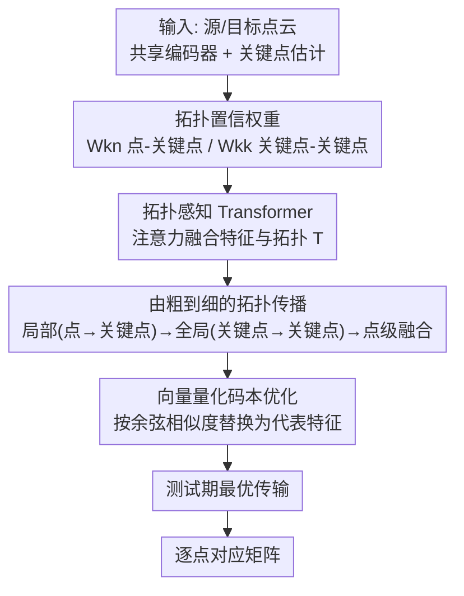

<!-- 由 tmp/gen_cvf_stubs.py 自动生成（CVF-only，无 arXiv） -->
# Topology-aware Feature Propagation for Unsupervised Non-rigid Point Cloud Correspondence

**会议**: CVPR 2026  
**论文**: [CVF Open Access](https://openaccess.thecvf.com/content/CVPR2026/html/Chen_Topology-aware_Feature_Propagation_for_Unsupervised_Non-rigid_Point_Cloud_Correspondence_CVPR_2026_paper.html)  
**领域**: 3D视觉  
**关键词**: 非刚体点云对应, 无监督学习, 形状拓扑, 特征传播, 向量量化码本

## 一句话总结
针对无监督非刚体点云对应中"按空间邻近传播特征会把物理上不相连的部位连起来"的痛点，本文提出学习对形变鲁棒的**形状拓扑**，用拓扑置信权重 + 拓扑感知 Transformer 在"由粗到细"管线里传播特征，并辅以向量量化码本优化，在四个基准上取得 SOTA。

## 研究背景与动机

**领域现状**：非刚体点云对应要预测源点云 $P_{src}$ 与目标点云 $P_{tgt}$ 之间逐点的匹配函数 $f: P_{src}\to P_{tgt}$。由于人工标注稠密对应代价极高，近年主流转向无监督路线（CorrNet3D、DPC、SE-ORNet、HSTR 等），用"互重建损失"作为代理监督，让源/目标点云互相重建以隐式学到对应。

**现有痛点**：这些方法在特征传播/聚合时几乎都依赖**空间关系**（通常是 KNN，按欧氏距离找邻居）。但非刚体形变会让点的空间位置剧烈变化——一个人抬手时，手腕和腰可能空间上很近，KNN 就会把它们连起来传播特征。这种"非物理连接"（non-physical connection）在形变下极不稳定，导致空间相近或几何相似区域上的特征互相污染，产生错配。

**核心矛盾**：点的空间特征（坐标、局部朝向）随形变改变，但**形状的拓扑**——各部位之间的物理连通关系——在姿态/坐标变化下是不变的。现有方法只用前者、忽略后者，等于把最稳定的那部分信息丢掉了。

**本文目标**：在无监督设定下，显式地学习一种对形变鲁棒的拓扑信息，并用它来约束特征传播，只在"物理上真正相连"的区域之间传播特征。

**切入角度**：作者观察到，如果能给点对/关键点对之间的连接打一个"拓扑置信度"——物理相连的高、隔开的低——就能在传播时压制掉那些有害的非物理连接。而语义关键点估计恰好能提供"点-关键点""关键点-关键点"的关系矩阵，天然可以当成这种拓扑置信权重的来源。

**核心 idea**：用学到的**拓扑置信权重**取代单纯的空间邻近关系来引导特征传播，把它塞进一个"由粗到细"的传播管线，并用向量量化码本把形状专属特征替换成数据集级的代表特征，进一步提升对形变/形状差异的鲁棒性。

## 方法详解

### 整体框架
给定共享编码器下的源/目标点云，方法先用一个无监督语义关键点估计模块产出 $K$ 个关键点（充当超点 superpoint）以及两组拓扑置信矩阵：点-关键点矩阵 $W_{kn}$ 和关键点-关键点矩阵 $W_{kk}$；基础编码器同时给出逐点特征、关键点特征以及"局部参考系（LRF）下的相对几何关系"。随后这些输入进入**拓扑感知特征传播模块**：先做局部传播（点→关键点）、再做全局传播（关键点→关键点），用拓扑置信权重压制非物理连接；接着用**向量量化码本**把关键点特征替换成数据集共享的代表特征；最后把拓扑感知的关键点特征融合回逐点特征，算出余弦相似度对应矩阵，并在推理时用**最优传输**做测试期全局优化得到最终对应。

### 关键设计

**1. 拓扑置信权重：把"哪些部位物理相连"学成一个可微的软矩阵**

痛点是 KNN 式的空间邻近会引入非物理连接。本文的做法是借语义关键点估计模块同时输出两类置信矩阵。点-关键点矩阵 $W_{kn}\in\mathbb{R}^{K\times N}$ 表示每个关键点该"关注"哪些点，关键点本身就由它加权聚合得到：$P_K=\text{Softmax}(W_{kn})\times P_N$，即关键点是语义上有意义的超点。关键点-关键点矩阵 $W_{kk}\in\mathbb{R}^{K\times K}$ 编码全局拓扑——符合形状拓扑的关键点连接被赋予高置信，物理上隔开的部位之间则是低置信。之所以这套权重对形变鲁棒，是因为它由无监督关键点损失 $\mathcal{L}_{key}$ 监督、学的是部位连通关系而非绝对坐标，姿态一变坐标全变、但"手连着小臂、小臂连着大臂"这件事不变。Fig. 4 的可视化也印证：全连接图里塞满了错误连接，而学到的拓扑置信图把跨部位的边压淡甚至压没。

**2. 拓扑感知 Transformer：让特征传播同时"看特征、看拓扑"**

普通注意力只按特征相似度传播，无法注入拓扑先验。本文设计的拓扑感知 Transformer 把查询特征 $F_Q$、参考特征 $F_R$ 与拓扑信息 $T$ 三者两两相乘再相加，softmax 得到注意力图：

$$A=\text{Softmax}(F_Q\times T + F_Q\times F_R + F_R\times T)$$

输出特征同样用三项交叉相乘聚合：

$$F_{out}=T\times A + T\times F_R + F_R\times A$$

其中 $T$ 是被拓扑置信权重重加权后的相对几何关系 $G$（即 $G$ 逐元素乘上对应的 $W$）。把整个过程记作 $\text{Prop}(F_Q,F_R,T)$。关键在于 $T$ 里物理隔开的点对相对几何关系已被低置信"封住"，于是注意力只会沿着拓扑上合理的连接传递信息，这正是它比纯特征相似度注意力更抗形变的原因。

**3. 由粗到细的拓扑传播：局部聚合 → 全局交互 → 回灌逐点**

单一尺度的传播要么只有局部细节、要么只有全局结构。本文用三步把 $\text{Prop}(\cdot)$ 串起来：

- **局部拓扑传播（点→关键点）**：$F_K=\text{Prop}(F_K,F_N,\,G_{kn}\cdot\text{Softmax}(W_{kn}))$，用点-关键点置信把"拓扑相关的点"的特征聚到关键点上，得到比"空间最近点聚合"更鲁棒的超点特征。
- **全局拓扑传播（关键点→关键点）**：$\hat{F}_K=\text{Prop}(F_K,F_K,\,G_{kk}\cdot\text{Softmax}(W_{kk}))$，关键点之间互相传播，但被 $W_{kk}$ 的低置信压制掉非物理连接，让全局特征在形变下更一致。
- **点级特征融合（关键点→点）**：$\hat{F}_N=\text{Prop}(F_N,\hat{F}_K,\,G_{nk}\cdot\text{Softmax}(W_{nk}))+F_N$，其中 $W_{nk}=W_{kn}^{T}$，把拓扑感知的关键点特征灌回稠密逐点特征，并加一条残差保留原始细节。

这条粗→细→粗的回路让最终逐点特征既带全局拓扑结构、又保留局部分辨力。

**4. 向量量化码本优化：用数据集级代表特征替换形状专属特征**

即便有了拓扑感知，特征仍可能过拟合到单个形状的特性上。本文引入一个跨整个数据集共享的向量量化码本：对每个拓扑感知关键点特征 $\hat{F}_K$，用余弦相似度在码本里查最相近的代表特征并**直接替换**它作为输出。由于码本是全数据集训练共享的，它逼模型去学"通用的代表性特征"而非"形状专属特征"，从而对形状/姿态差异更鲁棒，同时进一步挖掘拓扑信息。码本训练用标准 VQ 策略，额外加一个正交项让码向量彼此正交，产生损失 $\mathcal{L}_{vq}$。消融显示码本必须作用在**超点（关键点）特征**上才有效：直接对逐点特征用码本会把 err 炸到 32.4（见下表 A2/A），因为逐点空间太复杂、码本学不好。

### 损失函数 / 训练策略
总损失把对应学习与各模块约束合在一起：

$$\mathcal{L}_{total}=\lambda_{cc}\mathcal{L}_{cc}+\lambda_{sc}\mathcal{L}_{sc}+\lambda_{m}\mathcal{L}_{neigh}+\lambda_{vq}\mathcal{L}_{vq}+\lambda_{key}\mathcal{L}_{key}$$

其中 $\mathcal{L}_{cc}$、$\mathcal{L}_{sc}$、$\mathcal{L}_{neigh}$ 是沿用 DPC 的互重建与邻域正则损失，$\mathcal{L}_{vq}$ 为码本损失，$\mathcal{L}_{key}$ 监督关键点估计。超参 $\lambda_{cc}=1,\lambda_{sc}=10,\lambda_m=1,\lambda_{vq}=\lambda_{key}=1$。实现上关键点估计网络只接收 $\mathcal{L}_{key}$ 的梯度，且拓扑正则模块到基础编码器的反传被切断（基础编码器只从点级融合的残差项拿梯度），避免拓扑模块干扰基础特征。关键点数 $K=16$，特征维 $C=512$，码本 64 个码向量、中间维 32，单卡 3090、batch=2、Adam、初始学习率 3e-4。推理时用最优传输做测试期全局对应优化：$f(x_i)=y_{j^*},\ j^*=\arg\max_{j\in\mathcal{N}_Y(x_i)} w_{ij}$。

## 实验关键数据

数据集：人体用 SURREAL（训练）/ SHREC'19（测试），动物用 SMAL（训练）/ TOSCA（测试）；统一 $N=1024$ 点。指标：对应准确率 acc（容差 $\epsilon=0.01$，越高越好）与平均对应误差 err（越低越好）。"Ours+" 表示推理时加最优传输精修。

### 主实验

| 方法 | SURREAL/SHREC acc↑ | SURREAL/SHREC err↓ | SMAL/TOSCA acc↑ | TOSCA/TOSCA acc↑ |
|------|------|------|------|------|
| DPC | 17.7% | 6.1 | 33.2% | 34.7% |
| SE-ORNet | 21.5% | 4.6 | 36.4% | 38.3% |
| DiffCorr | 22.5% | 4.3 | 41.6% | 66.7% |
| DV-Matcher | 27.1% | 4.0 | 39.5% | 56.2% |
| EquiShape(+) | 24.2%(30.3%) | - | -(57.7%) | - |
| **Ours** | **33.2%** | **4.0** | **54.0%** | 63.6% |
| **Ours+** | **37.9%** | **3.2** | **60.5%** | **71.5%** |

跨数据集泛化（SURREAL→SHREC、SMAL→TOSCA）上本文优势最明显：SMAL/TOSCA 上 Ours 54.0% 比次优 DiffCorr 的 41.6% 高出 12 个百分点以上，Ours+ 进一步到 60.5%。在小训练集的 SHREC/SHREC 上本文是"有竞争力但非最优"（Ours+ 24.0% vs DV-Matcher 23.9%、DIFF3F 26.4%），作者强调 DIFF3F/DV-Matcher 用了 DINOv2/ControlNet 等大视觉模型、计算开销远高于本文。

### 消融实验

| 配置 | 由粗到细 | 超点 | $W_{kn}$ | $W_{kk}$ | 码本 | acc↑ | err↓ |
|------|------|------|------|------|------|------|------|
| A | ✗ | - | ✗ | ✗ | ✗ | 31.63% | 5.8 |
| A2 | ✗ | - | ✗ | ✗ | ✔(N×4) | 38.88% | 32.4 |
| B | ✔ | FPS | ✗ | ✗ | ✗ | 32.39% | 5.3 |
| D | ✔ | 关键点 | ✗ | ✔ | ✔ | 32.90% | 4.4 |
| E | ✔ | 关键点 | ✔ | ✔ | ✗ | 32.73% | 4.6 |
| **F (完整)** | ✔ | 关键点 | ✔ | ✔ | ✔ | **33.18%** | **4.0** |

码本大小消融（输入为拓扑感知特征）：$K\times1$ 32.49%/4.9、$K\times2$ 32.85%/4.3、$K\times3$ 33.06%/4.1、$K\times4$ 33.18%/4.0、$K\times8$ 32.61%/4.6，说明 $K\times2{\sim}4$ 这类适中尺寸最稳。计算开销上，本文 71.5 GFLOPs / 8.7M 参数 / 1044ms，明显轻于 DIFF3F（>1000 GFLOPs、>100M），与 SE-ORNet 同量级却性能更好。

### 关键发现
- **拓扑权重是主力**：A（无拓扑无粗细）31.63%/5.8 → F（完整）33.18%/4.0，err 从 5.8 降到 4.0；去掉 $\mathcal{L}_{vq}$ 或 $\mathcal{L}_{key}$ 都会掉到 acc≈32.5%/err≈4.6，证明两个辅助损失都必要。
- **码本必须作用在超点上**：A2 把码本直接套到逐点特征，acc 看似冲到 38.88% 但 err 崩到 32.4——逐点空间太复杂、码本学不出有意义的量化，整体匹配其实失效；A3/F 改作用在关键点特征上 err 才稳定在 4.0–4.5。这是个很有警示性的发现：单看 acc 会被误导，必须结合 err 看。
- **拓扑即使估错也有用**：在 SHREC 上挑出 $\mathcal{L}_{key}$ 最高（拓扑估计最差）的约 10% 难样本，带拓扑（27.3%/5.9）仍优于不带拓扑（26.8%/6.0），说明残缺拓扑仍保留有用线索。

## 亮点与洞察
- **把"拓扑不变性"作为非刚体对应的核心先验**：坐标会变、拓扑不变，这个观察很直接但被以往按空间邻近传播的方法忽略了；用关键点估计副产的两个置信矩阵当软拓扑，免去额外标注，工程上很巧。
- **拓扑感知 Transformer 的三项交叉聚合**把"特征 × 拓扑"耦合进注意力，是个可迁移的模块——任何"想在传播时注入结构先验"的图/点云任务都能借这种 $F_Q\times T+F_Q\times F_R+F_R\times T$ 的写法。
- **码本作用尺度的消融**揭示了一个反直觉点：VQ 码本不是套得越细越好，作用在稠密逐点特征上会直接失效，必须放在语义超点这一抽象层级。
- **粗→细→粗的闭环**（点聚到关键点、关键点互传、再灌回点）让全局拓扑与局部细节在一条管线里循环，思路可迁移到其他需要"全局结构 + 局部分辨"的稠密匹配任务。

## 局限与展望
- 作者承认：① 超点与拓扑估计质量还不够完美，对应性能不够稳定，更好的关键点/骨架估计是潜在改进方向；② 对未见的点分布与噪声敏感，需要密度不变分析与去噪。
- 自己观察：小训练集场景（SHREC/SHREC）上本文并非最优，对大视觉模型方法（DIFF3F）仍有差距，说明"数据集共享码本"在样本极少时代表性不足。
- 关键点数固定 $K=16$，对结构更复杂或部件更多的形状可能不够；拓扑置信完全由无监督关键点损失驱动，缺乏对拓扑正确性的直接约束，难样本上拓扑会部分估错（Fig. 5）。
- 改进思路：把骨架/部件分割的显式拓扑监督引入、或让 $K$ 随形状自适应、并加入密度增广提升对真实扫描数据的鲁棒性。

## 相关工作与启发
- **vs 空间邻近传播（DPC / CorrNet3D / HSTR）**：它们按 KNN 或局部→全局的欧氏距离聚合特征，会混入非物理连接；本文用学到的拓扑置信权重压制这些连接，跨数据集泛化显著更好。
- **vs 谱方法（functional map 系）**：谱方法靠 Laplace-Beltrami 算子的特征基，在网格上有效但点云上基函数不稳定、对噪声与断连敏感、常需先做刚性对齐；本文是端到端点云方法，不依赖高质量连通性。
- **vs 大视觉模型路线（DIFF3F / DV-Matcher）**：它们借 DINOv2/ControlNet 编码强描述子，但 FLOPs/显存开销巨大（DIFF3F >1000 GFLOPs）；本文用轻量拓扑模块在多数基准上达到可比或更优性能，效率高一个量级。
- **vs SE-ORNet / EquiShape（旋转对齐/等变）**：它们靠姿态对齐或旋转等变特征抗形变；本文从拓扑不变性切入，与之互补，且性能更强。

## 评分
- 新颖性: ⭐⭐⭐⭐ "拓扑不变性 + 拓扑感知传播"切入点清晰，虽借用已有关键点估计模块，但拓扑置信引导传播 + 超点级码本的组合是新的。
- 实验充分度: ⭐⭐⭐⭐ 四基准 + 跨/同数据集 + 充分消融 + 计算开销 + 难样本鲁棒性，较完整；小训练集上未占优如实报告。
- 写作质量: ⭐⭐⭐⭐ 动机—方法—实验逻辑顺畅，公式与可视化到位；部分细节（如 LRF、各损失）外推到补充材料。
- 价值: ⭐⭐⭐⭐ 无监督非刚体对应的实用 SOTA，拓扑感知传播与码本作用尺度的洞察对相关稠密匹配任务有借鉴价值。

<!-- RELATED:START -->

## 相关论文

- [\[CVPR 2026\] RINO: Rotation-Invariant Non-Rigid Correspondences](rino_rotation-invariant_non-rigid_correspondences.md)
- [\[CVPR 2026\] PointGS: Semantic-Consistent Unsupervised 3D Point Cloud Segmentation with 3D Gaussian Splatting](pointgs_semantic-consistent_unsupervised_3d_point_cloud_segmentation_with_3d_gau.md)
- [\[NeurIPS 2025\] U-CAN: Unsupervised Point Cloud Denoising with Consistency-Aware Noise2Noise Matching](../../NeurIPS2025/3d_vision/u-can_unsupervised_point_cloud_denoising_with_consistency-aware_noise2noise_matc.md)
- [\[CVPR 2026\] Generalized-CVO: Fast and Correspondence-Free Local Point Cloud Registration with Second Order Riemannian Optimization](generalized-cvo_fast_and_correspondence-free_local_point_cloud_registration_with.md)
- [\[CVPR 2026\] Image-to-Point Cloud Feature Back-Projection for Multimodal Training of 3D Semantic Segmentation](image-to-point_cloud_feature_back-projection_for_multimodal_training_of_3d_seman.md)

<!-- RELATED:END -->
