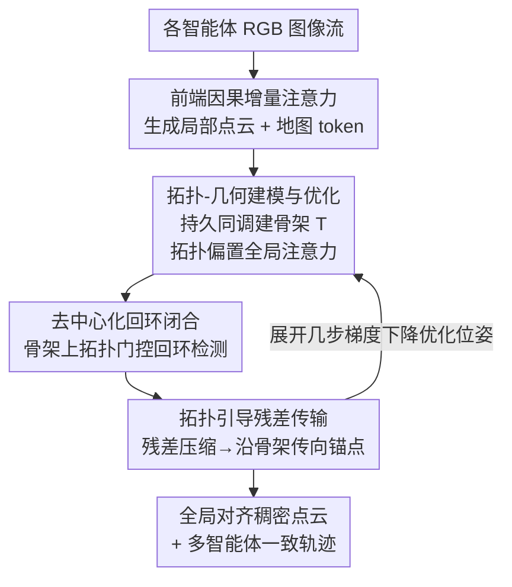

# TopoMA: Topology-Guided Multi-Agent Dense RGB 3D Reconstruction via Distributed Inference

**会议**: CVPR 2026  
**论文**: [CVF Open Access](https://openaccess.thecvf.com/content/CVPR2026/html/Zhang_TopoMA_Topology-Guided_Multi-Agent_Dense_RGB_3D_Reconstruction_via_Distributed_Inference_CVPR_2026_paper.html)  
**领域**: 3D视觉  
**关键词**: 多智能体3D重建, 拓扑骨架, 分布式推理, 回环检测, 端到端SLAM

## 一句话总结
TopoMA 用持久同调（persistent homology）学一张连接各智能体子图的「场景拓扑骨架」，把它当注意力偏置、回环门控和残差传输的统一调度核心，从而让多个智能体在纯分布式、无中心服务器的条件下各自重建并增量优化局部地图，仅靠轻量拓扑消息就实现全局一致的大规模 RGB 稠密重建。

## 研究背景与动机

**领域现状**：多智能体协同 3D 重建是大规模 VR/AR、机器人集群、数字孪生的底座——单个相机覆盖复杂大场景效率太低，必须靠多个智能体分摊工作量、加速探索、互相补盲。近期端到端（learning-based）pointmap 方法（VGGT 系、SLAM3R、MASt3R-SLAM 等）在单智能体下表现很强。

**现有痛点**：这些为「单相机单轨迹」设计的端到端方法直接搬到多智能体场景就崩——跟踪不稳、显存爆炸、回环频繁失败。实践中要么每个智能体各维护一张地图、彼此尺度漂移严重且不一致；要么把计算集中到一台服务器、把 GPU/CPU 吃满。而且回环还停留在局部几何启发式，根本没有在智能体之间强制「全局拓扑一致」。

**核心矛盾**：多智能体重建真正难的不是「并行跑几个 SLAM」，而是如何在**通信受限、轨迹异构**的条件下，让不同智能体的子地图在尺度和空间结构上对齐并融合。逐对几何配准既贵又不稳，集中式优化又破坏了分布式的可扩展性——精度、资源、去中心三者互相打架。

**本文目标**：要一个实时、端到端、map-first 的框架，能同时解决「智能体间空间对齐」和「子图融合」，并且能在真实带宽约束下分布式部署。

**切入角度**：作者的关键观察是——与其平行化单体 SLAM，不如先学一张**场景级拓扑骨架**，它概括了不同智能体子图之间的连通性与几何关系，可以直接去引导注意力、融合与优化。拓扑结构对视角变化和尺度漂移天然更鲁棒，比逐帧几何匹配更适合做跨智能体的全局锚点。

**核心 idea**：把「拓扑骨架」做成贯穿全流程的统一调度核心——用持久同调算视图间拓扑距离，既当全局注意力的偏置、又当回环检测的门控、还当残差传输的路由路径，三件事共用一张图，从而在分布式架构里实现全局一致重建。

## 方法详解

### 整体框架
TopoMA 的输入是多个智能体各自采集的 RGB 图像流，输出是全局对齐、尺度一致的稠密点云与各智能体位姿轨迹。整条管线分两条线交织：**建图（Mapping）** 把每个智能体的 RGB 观测 token 化、聚合成一张拓扑感知的骨架，并与几何线索统一以恢复一致的结构和尺度；**跟踪（Tracking）** 让各智能体做本地回环检测、更新拓扑约束，并通过前端/后端的「拓扑 Transformer」施加拓扑一致的回环闭合。前端用因果增量注意力（causal incremental attention）做局部更新，后端用全局注意力做全局与拓扑优化；整个系统完全分布式运行，每个智能体维护自己的局部子图，逐步收敛到全局拓扑一致。

三个拓扑驱动的贡献组件依次串起来：**拓扑-几何建模与优化**先把骨架建好、并用它做拓扑正则化的全局注意力；**去中心化回环闭合**在骨架上做受拓扑门控的回环检测与位姿修正；**拓扑引导残差传输**把多模态残差压缩后沿骨架传给锚点智能体，既做监督信号又压低通信和显存开销。

### 关键设计

**1. 拓扑-几何建模与优化：用持久同调把"哪些视图该融合"变成可学的全局先验**

传统协同方法满足不了端到端统一优化的需求，而端到端方法又只会顺着轨迹做局部关联，缺一个跨智能体的全局结构锚点。TopoMA 的做法是先建一张拓扑骨架：前端用因果注意力 $f^{causal}_\theta$ 对每个智能体的图像 $X_{m,t}$ 生成局部点云 $P_{m,t}$ 和地图 token $F_{m,t}$，并复用 KV-cache $C_m$ 加速增量更新。然后用**持久同调**计算视图两两之间的拓扑距离矩阵 $D_{topo}=\{d^{topo}_{mn}\}$，在相似度图 $G$ 上抽一棵带候选回边的**最大生成树**得到骨架 $T=(V,E_T)$；当两视图拓扑相似度超阈值 $\tau$（$S_{mn}=\psi_{topo}(P_{m,t},P_{n,t})>\tau$）时才融合点云，并每 100 帧强制做一次全局更新。

真正巧妙的是它把拓扑距离塞进全局注意力当**偏置**。所有 token 汇进全局记忆池 $Z$，注意力权重写成

$$\alpha_{ij}=\frac{\exp\left(\frac{Q_i^\top K_j}{\sqrt{d}}-\lambda\, d^{topo}_{ij}\right)}{\sum_{j'}\exp\left(\frac{Q_i^\top K_{j'}}{\sqrt{d}}-\lambda\, d^{topo}_{ij'}\right)}$$

$\lambda$ 控制拓扑正则强度——拓扑越远的 token 注意力被压得越低，模型被引导只关注拓扑相近的点云。更新后的 token $\tilde z_i=\sum_j \alpha_{ij}V_j$ 直接回归各智能体的位姿修正 $\Delta T_{m,t}$ 与融合权重 $w_{m,t}$，最终 $P_{global}=\sum_{m,t} w_{m,t}T^{new}_{m,t}P_{m,t}$。相比"逐对几何配准"，拓扑偏置让全局对齐有了一个对视角/尺度变化更鲁棒的结构先验，从源头压住了尺度漂移和累积误差。

**2. 去中心化回环闭合：用拓扑门控把"伪回环"挡在外面，无需中心服务器**

经典回环依赖昂贵的全局优化，且在动态场景退化；多智能体场景里更怕跨智能体的伪回环把地图拉歪。TopoMA 把回环做成端到端、拓扑驱动的设计：对每对视图先用小 MLP 算外观回环分数 $s_{(m,t),(n,s)}=\sigma(f_{loop}(F_{m,t},F_{n,s}))$，但**只有同时满足外观和拓扑两个门**才接受这条回环边——$s\ge\tau_{loop}$ 且骨架上测地距离 $d^{topo}\le\delta_{topo}$。这个拓扑门是关键：它把那些"长得像但在骨架上离得很远"的视图直接否掉，正是 NaiveLoop 容易栽的坑。

通过的回环对组成 $E_{loop}$，连同树边 $E_T$ 一起锚定在骨架上。后端对每条边算当前估计的相对位姿 $\tilde T_e=T^{-1}_{n,s}T_{m,t}$ 与网络预测的回环一致相对位姿 $\hat T_e$，作用到点图/深度/颜色上得到多模态残差，组成位姿精修能量

$$E_{pose}=\sum_{e\in E_T\cup E_{loop}}\sum_{j\in\Omega_e}\left(\lambda_{depth}\|r^{depth}_{e,j}\|_2^2+\lambda_{color}\|r^{color}_{e,j}\|_2^2+\lambda_{pointmap}\|r^{pointmap}_{e,j}\|_2^2+\lambda_{topo}\|r^{topo}_{e,j}\|_2^2\right)$$

在全局注意力块里展开几步梯度下降，得到 $T^{new}_{m,t}=\Delta T_{m,t}\circ T^{old}_{m,t}$。整个过程不需要中心服务器做全局 BA，靠骨架上的拓扑一致性就把回环锚住，因此是真正的 server-free。

**3. 拓扑引导残差传输：把多模态残差沿骨架汇向锚点，换来分布式下的低显存**

回环阶段每条边都背着 depth/color/pointmap/topology 四类残差，如果每个智能体都全量保存全部残差，显存会随序列线性爆炸。残差传输模块先用置换不变聚合器 $g_{edge}$ 把每条边的逐样本残差压成单个边描述子 $r_e$，再在节点 $v$ 上聚合所有相邻边得到节点残差 $u_v$。然后沿骨架做**拓扑感知消息传递**：$\tilde u_v=\sum_{u\in N(v)}\beta_{v,u}u_u$，传输权重满足 $\sum_u\beta_{v,u}=1$ 且 $\beta_{v,u}=f_{topo}(d^{topo}_{v,u})$，$f_{topo}$ 是测地距离的单调减函数——离得近的邻居权重大。

关键的工程取舍是：把骨架 root 在一个指定的**锚点智能体** $a_{ref}$，所有残差朝它汇集，把全局残差信息**集中到单个智能体**上，其余智能体只保留局部摘要，从而显著降低整体显存。传输后的残差当作后端 Transformer 的额外监督信号，要求它与原始节点残差、以及全局 token 预测的位姿增量一致：

$$E_{trans}=\sum_{v=(m,t)\in V}\|\tilde u_v-u_v\|_2^2+\mu\,\|h_\theta(\tilde z_{k(m,t)})-g_\theta(\tilde u_v)\|_2^2$$

总目标 $E_{total}=E_{pose}+\lambda_{trans}E_{trans}$，同样在全局注意力块里展开几步梯度下降。这样"密集但轻量、频繁但低开销"的传输，让分布式重建既能保持全局一致、又把每个智能体的显存压在低位（图 4 显示显存随帧数增长几乎平稳）。

### 损失函数 / 训练策略
后端总能量 $E_{total}=E_{pose}+\lambda_{trans}E_{trans}$：$E_{pose}$ 是 depth/color/pointmap/topology 四项加权的多模态残差能量（各由 $\lambda_{depth},\lambda_{color},\lambda_{pointmap},\lambda_{topo}$ 调权），$E_{trans}$ 是残差传输一致性损失（含 $\mu$ 平衡两项）。优化方式是把若干步梯度下降**展开（unroll）**进全局注意力块内部，最重的监督集中施加在锚点智能体 $a_{ref}$ 的节点上，进一步降低 per-agent 显存。

## 实验关键数据

数据集：KITTI（室外大规模）、Replica（室内复杂）、ScanNet（室内表面重建）。指标：轨迹精度用 RMSE / Mean ATE，重建精度用 Accuracy(ACC) 与 Depth L1，并报告 FPS、GPU/CPU 占用。所有方法统一切分序列、做 Sim(3) 对齐，每序列跑 5 次取平均。单智能体对手 VGGT-Long / TTT3R / SLAM3R / MASt3R-SLAM / VGGT-SLAM 被切分模拟成多智能体；多智能体对手为 MAGiC-SLAM、CP-SLAM。

### 主实验

KITTI 里程计轨迹精度（ATE，米，越低越好，Avg 跨 5 个子序列）：

| 方法 | Avg. RMSE↓ | Avg. Mean↓ | 备注 |
|------|-----------|-----------|------|
| VGGT-Long | 24.36 | 19.68 | 单智能体最强基线 |
| TTT3R | 42.75 | 36.16 | |
| SLAM3R | 71.71 | 58.93 | |
| MASt3R-SLAM | 84.48 | 73.93 | |
| VGGT-SLAM | 94.23 | 77.26 | 多处 [TL] 跟踪丢失 |
| **Ours** | **22.51** | **18.32** | KITTI-07 上尤其强（3.95/3.67） |

Replica 轨迹精度（RMSE，cm），含多智能体对手：

| 方法 | 类型 | Average RMSE↓ |
|------|------|--------------|
| VGGT-SLAM | 单智能体 | 1.17 |
| MAGiC-SLAM | 多智能体 | 1.06 |
| CP-SLAM | 多智能体 | 1.39 |
| **Ours** | 多智能体 | **0.53** |

ScanNet 表面重建（Avg，cm，越低越好）：Ours 的 Depth L1 = 12.19、Acc = 11.10，优于次优 VGGT-SLAM（13.80 / 12.60）与 MASt3R-SLAM（15.71 / 12.58）。

### 消融实验

回环闭合消融（Replica apartment-00，5 次平均）：

| 配置 | ATE[cm]↓ | FPS↑ | GPU[GB]↓ | CPU[GB]↓ | 说明 |
|------|---------|------|---------|---------|------|
| NoLoop | 23.81 | 7.35 | 5.10 | 8.20 | 只本地跟踪，漂移最大但最省 |
| NaiveLoop | 17.94 | 6.82 | 5.50 | 9.10 | MASt3R 式回环，易引入伪回环 |
| ICP | 15.73 | 6.70 | 5.40 | 9.40 | 对局部极小/尺度不一致敏感 |
| Single-Loop | 11.68 | 6.45 | 5.80 | 9.70 | 单智能体回环，无跨体一致性保证 |
| **Ours** | **10.45** | 6.21 | 5.92 | 9.96 | ATE 最低，FPS/资源仅略增 |

残差传输消融（Replica apartment-00，5 次平均）：

| 配置 | ATE[cm]↓ | FPS↑ | GPU[GB]↓ | CPU[GB]↓ | 说明 |
|------|---------|------|---------|---------|------|
| NoTrans-Center | 14.82 | 5.83 | 6.50 | 11.00 | 集中式融合，资源最重 |
| NoTrans-Single | 18.34 | 7.42 | 5.10 | 8.50 | 纯本地，最省但 ATE 最差 |
| MNE-SLAM | 16.71 | 6.01 | 6.80 | 10.50 | 重量级融合 |
| Trans-500 | 12.32 | 6.57 | 6.00 | 9.80 | 每 500 帧粗融合，仍有漂移 |
| **Ours** | **10.48** | 6.23 | 5.90 | 9.93 | 密集+轻量频繁融合，最佳精度 |

### 关键发现
- **拓扑门控是回环精度的命门**：NaiveLoop（17.94）和 ICP（15.73）比 NoLoop（23.81）好，但都明显逊于 Ours（10.45）——前者爱在"拓扑上很远"的视图间连伪回环，后者对局部极小值和尺度不一致敏感，而拓扑门把这些假匹配挡住了。
- **跨智能体协同确实带来增量**：Single-Loop（11.68）靠强单体回环只能排第二，因为它无法利用其他智能体的互补视角，也不保证多智能体一致性；Ours 进一步降到 10.45 正说明跨体拓扑一致的价值。
- **"密集但轻量"优于"粗放融合"**：Trans-500 每 500 帧才融合一次，融合间隙仍有可见漂移（12.32）；Ours 用拓扑感知的频繁轻量传输拿到最佳 ATE（10.48），同时在所有"带融合"配置里资源占用最低，验证了残差压缩+锚点集中的有效性。
- 集中式（NoTrans-Center、MNE-SLAM）虽能比纯本地准，但 GPU/CPU 明显更重、FPS 更低，印证了分布式残差传输在"精度-资源"上的甜点位置。

## 亮点与洞察
- **一张拓扑骨架，三处复用**：持久同调算出的拓扑距离同时充当全局注意力的偏置、回环检测的门控、残差传输的路由路径——把"该不该融合""该不该信这个回环""残差往哪传"三个看似独立的决策统一到同一张图上，是非常省且自洽的设计。
- **拓扑门控回环**这个 trick 可迁移性强：任何做 appearance-based 回环的系统都可以加一道"结构/拓扑一致性"二次门来压伪回环，思路是把"长得像"和"结构上应该近"分开判定。
- **锚点集中残差**把分布式系统的显存难题转成一个图上的 root 选择问题——让单个智能体扛全局残差、其余只留局部摘要，是在"全局一致"和"per-agent 轻量"之间很务实的折中。
- 把"展开几步梯度下降进注意力块"当成可微优化层，让位姿精修和表示学习端到端耦合，而不是事后跑独立 BA。

## 局限与展望
- **只适用于静态/近静态场景**：作者明确承认强动态物体干扰会让性能退化，拓扑骨架和残差传输都假设场景结构稳定；展望是把显式动态建模并入骨架与残差传输。
- **持久同调的开销与可扩展性未充分讨论**：计算两两拓扑距离矩阵 $D_{topo}$ 在智能体/视图数量大时的复杂度、以及实时性如何保证，文中给的更多是定性描述，缺少对 $\tau,\lambda,\delta_{topo}$ 等关键阈值的敏感性分析。
- **锚点单点依赖**：把全局残差集中到单个锚点智能体，虽省显存，但锚点失联/掉线时的鲁棒性（容错、锚点切换）没有实验佐证，对真实集群部署是隐患。
- 主表多以 Avg 报告且部分基线出现 [TL] 跟踪丢失，横向比较时需注意不同方法在难序列上的"完成度"差异，不能只看平均数。

## 相关工作与启发
- **vs CP-SLAM**：CP-SLAM 用神经点云表示 + "分布式转集中式"学习策略提升协同，但开销大；TopoMA 走纯分布式、用轻量拓扑消息替代集中式融合，资源更省（Replica RMSE 0.53 vs 1.39）。
- **vs MAGiC-SLAM**：MAGiC-SLAM 用 3D Gaussian 做多智能体协同与回环，但在大规模环境受限；TopoMA 用 pointmap 融合，在大尺度/动态场景更灵活高效（RMSE 0.53 vs 1.06）。
- **vs MNE-SLAM**：MNE-SLAM 也主打全分布式、减少对中心服务器依赖，但通信与融合问题仍在；TopoMA 用拓扑引导残差传输直接攻这两点，消融里 ATE（10.48）和资源都优于 MNE-SLAM（16.71）。
- **vs 单智能体端到端（VGGT-Long / SLAM3R / MASt3R-SLAM）**：它们为单相机单轨迹设计、搬到多智能体就退化（跟踪丢失、漂移）；TopoMA 的贡献正是补上"跨智能体空间对齐 + 子图融合"这块端到端方法缺失的拼图。

## 评分
- 新颖性: ⭐⭐⭐⭐ 用持久同调拓扑骨架统一调度注意力/回环/残差传输，三处复用同一张图的设计很有想法。
- 实验充分度: ⭐⭐⭐⭐ KITTI/Replica/ScanNet 三数据集 + 单体/多体对手 + 两组消融，但缺关键阈值敏感性与持久同调开销分析。
- 写作质量: ⭐⭐⭐⭐ 公式与流程清晰，图文对照好；个别符号（如 $\psi_{topo}$ 与注意力里 $d^{topo}$ 既当距离又当相似度）措辞略含糊。
- 价值: ⭐⭐⭐⭐ 面向真实多智能体大场景的 server-free 重建，分布式低显存 + 全局一致是有实用价值的方向。

<!-- RELATED:START -->

## 相关论文

- [\[CVPR 2026\] ExMesh: EXplicit Mesh Reconstruction with Topology Adaptation](exmesh_explicit_mesh_reconstruction_with_topology_adaptation.md)
- [\[CVPR 2026\] Ov3R: Open-Vocabulary Semantic 3D Reconstruction from RGB Videos](ov3r_open-vocabulary_semantic_3d_reconstruction_from_rgb_videos.md)
- [\[CVPR 2026\] S2D: Sparse to Dense Lifting for 3D Reconstruction with Minimal Inputs](s2d_sparse_to_dense_lifting_for_3d_reconstruction_with_minimal_inputs.md)
- [\[CVPR 2026\] 3D-Aware Multi-Task Learning with Cross-View Correlations for Dense Scene Understanding](3d-aware_multi-task_learning_with_cross-view_correlations_for_dense_scene_unders.md)
- [\[CVPR 2026\] ReWeaver: Towards Simulation-Ready and Topology-Accurate Garment Reconstruction](reweaver_towards_simulation-ready_and_topology-accurate_garment_reconstruction.md)

<!-- RELATED:END -->
